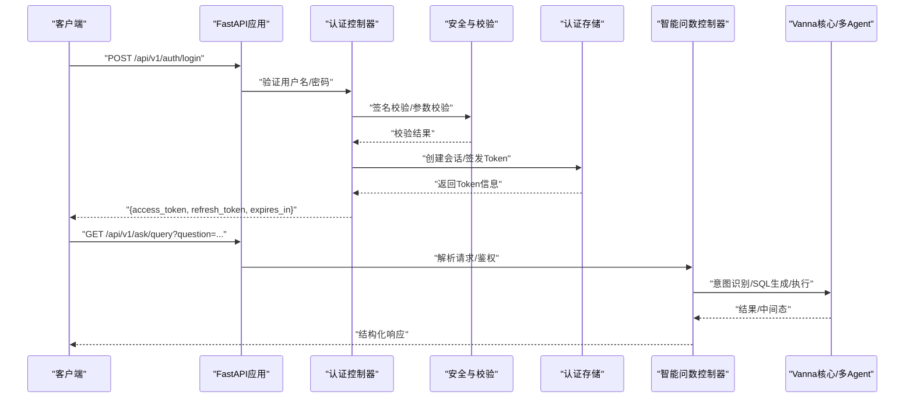
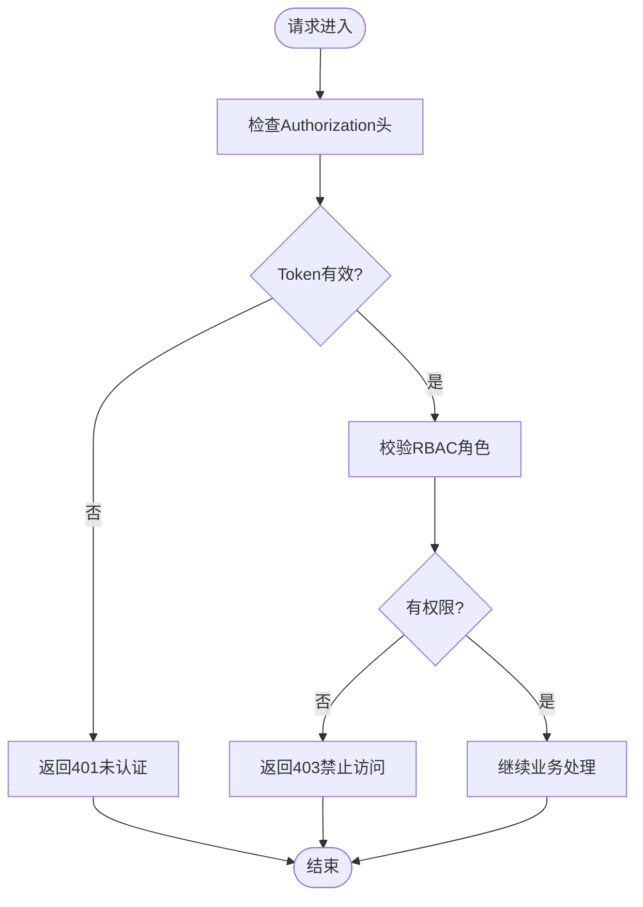
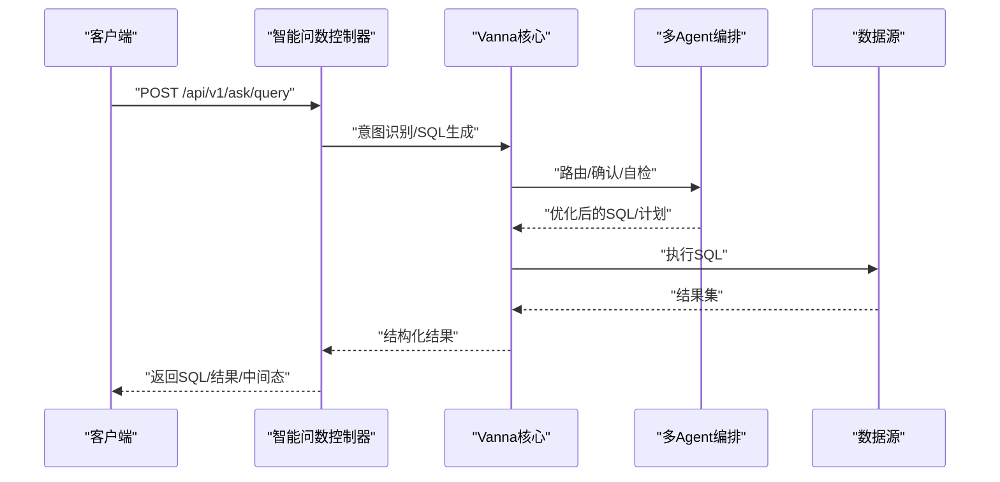
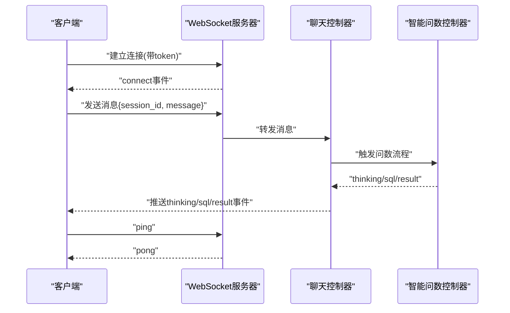
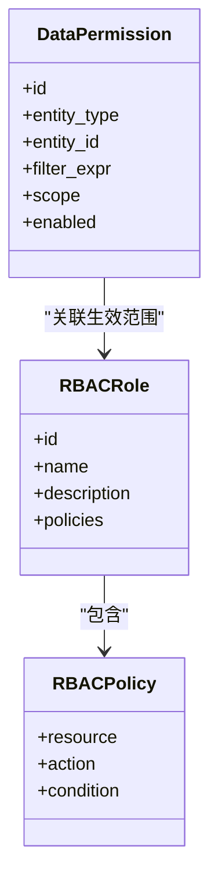
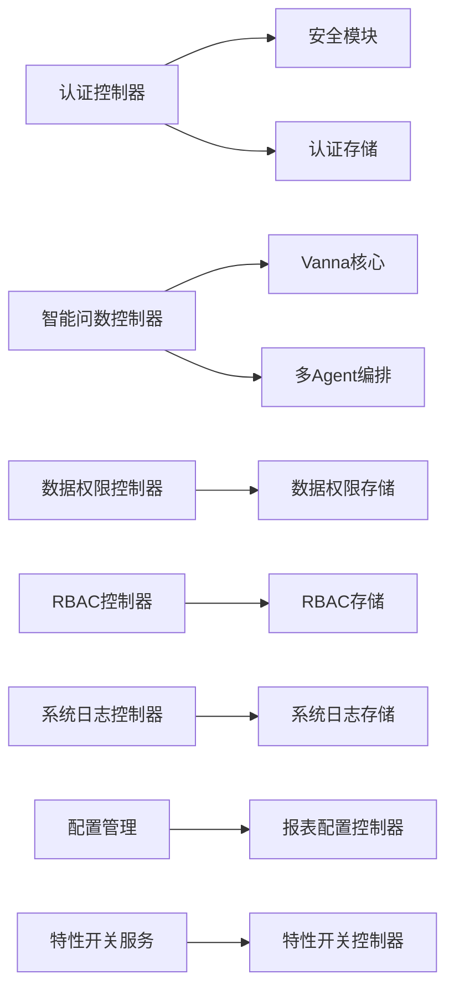

# API 接口文档

<cite>
**本文引用的文件**   
- [backend/app.py](file://backend/app.py)
- [backend/controllers/auth.py](file://backend/controllers/auth.py)
- [backend/controllers/ask_flow.py](file://backend/controllers/ask_flow.py)
- [backend/controllers/smart_chat.py](file://backend/controllers/smart_chat.py)
- [backend/controllers/datasources.py](file://backend/controllers/datasources.py)
- [backend/controllers/data_permissions.py](file://backend/controllers/data_permissions.py)
- [backend/controllers/rbac.py](file://backend/controllers/rbac.py)
- [backend/controllers/system_logs.py](file://backend/controllers/system_logs.py)
- [backend/controllers/report_config.py](file://backend/controllers/report_config.py)
- [backend/controllers/advanced_capabilities.py](file://backend/controllers/advanced_capabilities.py)
- [backend/controllers/bookshelf.py](file://backend/controllers/bookshelf.py)
- [backend/controllers/ai_models.py](file://backend/controllers/ai_models.py)
- [backend/controllers/dashboard.py](file://backend/controllers/dashboard.py)
- [backend/controllers/organization_trees.py](file://backend/controllers/organization_trees.py)
- [backend/controllers/feature_flags.py](file://backend/controllers/feature_flags.py)
- [backend/controllers/agents.py](file://backend/controllers/agents.py)
- [backend/controllers/dataset_transforms.py](file://backend/controllers/dataset_transforms.py)
- [backend/controllers/feishu_sync.py](file://backend/controllers/feishu_sync.py)
- [backend/controllers/runtime_migration.py](file://backend/controllers/runtime_migration.py)
- [backend/security.py](file://backend/security.py)
- [backend/auth_store.py](file://backend/auth_store.py)
- [backend/rbac_store.py](file://backend/rbac_store.py)
- [backend/data_permission_store.py](file://backend/data_permission_store.py)
- [backend/system_log_store.py](file://backend/system_log_store.py)
- [backend/config_manager.py](file://backend/config_manager.py)
- [backend/feature_flags.py](file://backend/feature_flags.py)
- [backend/vanna_core.py](file://backend/vanna_core.py)
- [backend/four_agent_ask.py](file://backend/four_agent_ask.py)
- [frontend/src/api/index.js](file://frontend/src/api/index.js)
</cite>

## 目录
1. [简介](#简介)
2. [项目结构](#项目结构)
3. [核心组件](#核心组件)
4. [架构总览](#架构总览)
5. [详细组件分析](#详细组件分析)
6. [依赖分析](#依赖分析)
7. [性能考虑](#性能考虑)
8. [故障排查指南](#故障排查指南)
9. [结论](#结论)
10. [附录](#附录)

## 简介
本文件为 SmartAsk 智能问数平台的全面 API 接口文档，覆盖 RESTful 端点、认证与权限、智能问数核心能力（自然语言查询、SQL 生成、结果获取）、管理接口（数据集、权限、系统监控等）、WebSocket 实时接口、版本管理、限流与安全策略，以及客户端集成与调试指南。读者可据此完成前后端对接、系统集成与运维排障。

## 项目结构
后端采用模块化控制器组织 REST 接口，按功能域划分：认证、智能问数、数据源、权限、报表配置、组织树、特性开关、Agent、数据集转换、飞书同步、运行时迁移等。前端通过统一的 API 模块发起请求，并处理鉴权与错误。

```mermaid
graph TB
subgraph "前端"
FE_API["前端API封装<br/>frontend/src/api/index.js"]
FE_VUE["Vue页面与组件"]
end
subgraph "后端应用"
APP["FastAPI应用入口<br/>backend/app.py"]
AUTH_C["认证控制器<br/>controllers/auth.py"]
ASK_C["智能问数控制器<br/>controllers/ask_flow.py"]
CHAT_C["聊天控制器<br/>controllers/smart_chat.py"]
DS_C["数据源控制器<br/>controllers/datasources.py"]
DP_C["数据权限控制器<br/>controllers/data_permissions.py"]
RBAC_C["RBAC控制器<br/>controllers/rbac.py"]
LOG_C["系统日志控制器<br/>controllers/system_logs.py"]
RC_C["报表配置控制器<br/>controllers/report_config.py"]
ADV_C["高级能力控制器<br/>controllers/advanced_capabilities.py"]
BS_C["书架控制器<br/>controllers/bookshelf.py"]
AI_C["AI模型控制器<br/>controllers/ai_models.py"]
DASH_C["仪表盘控制器<br/>controllers/dashboard.py"]
ORG_C["组织树控制器<br/>controllers/organization_trees.py"]
FF_C["特性开关控制器<br/>controllers/feature_flags.py"]
AG_C["Agent控制器<br/>controllers/agents.py"]
DT_C["数据集转换控制器<br/>controllers/dataset_transforms.py"]
FS_C["飞书同步控制器<br/>controllers/feishu_sync.py"]
RM_C["运行时迁移控制器<br/>controllers/runtime_migration.py"]
end
subgraph "服务与存储"
SEC["安全与校验<br/>security.py"]
AUTH_STORE["认证存储<br/>auth_store.py"]
RBAC_STORE["RBAC存储<br/>rbac_store.py"]
DP_STORE["数据权限存储<br/>data_permission_store.py"]
LOG_STORE["系统日志存储<br/>system_log_store.py"]
CFG["配置管理<br/>config_manager.py"]
FF["特性开关服务<br/>feature_flags.py"]
VANN["Vanna核心<br/>vanna_core.py"]
FOUR["四Agent编排<br/>four_agent_ask.py"]
end
FE_API --> APP
APP --> AUTH_C
APP --> ASK_C
APP --> CHAT_C
APP --> DS_C
APP --> DP_C
APP --> RBAC_C
APP --> LOG_C
APP --> RC_C
APP --> ADV_C
APP --> BS_C
APP --> AI_C
APP --> DASH_C
APP --> ORG_C
APP --> FF_C
APP --> AG_C
APP --> DT_C
APP --> FS_C
APP --> RM_C
AUTH_C --> SEC
AUTH_C --> AUTH_STORE
ASK_C --> VANN
ASK_C --> FOUR
DP_C --> DP_STORE
RBAC_C --> RBAC_STORE
LOG_C --> LOG_STORE
RC_C --> CFG
FF_C --> FF
```

**图表来源** 
- [backend/app.py](file://backend/app.py)
- [backend/controllers/auth.py](file://backend/controllers/auth.py)
- [backend/controllers/ask_flow.py](file://backend/controllers/ask_flow.py)
- [backend/controllers/smart_chat.py](file://backend/controllers/smart_chat.py)
- [backend/controllers/datasources.py](file://backend/controllers/datasources.py)
- [backend/controllers/data_permissions.py](file://backend/controllers/data_permissions.py)
- [backend/controllers/rbac.py](file://backend/controllers/rbac.py)
- [backend/controllers/system_logs.py](file://backend/controllers/system_logs.py)
- [backend/controllers/report_config.py](file://backend/controllers/report_config.py)
- [backend/controllers/advanced_capabilities.py](file://backend/controllers/advanced_capabilities.py)
- [backend/controllers/bookshelf.py](file://backend/controllers/bookshelf.py)
- [backend/controllers/ai_models.py](file://backend/controllers/ai_models.py)
- [backend/controllers/dashboard.py](file://backend/controllers/dashboard.py)
- [backend/controllers/organization_trees.py](file://backend/controllers/organization_trees.py)
- [backend/controllers/feature_flags.py](file://backend/controllers/feature_flags.py)
- [backend/controllers/agents.py](file://backend/controllers/agents.py)
- [backend/controllers/dataset_transforms.py](file://backend/controllers/dataset_transforms.py)
- [backend/controllers/feishu_sync.py](file://backend/controllers/feishu_sync.py)
- [backend/controllers/runtime_migration.py](file://backend/controllers/runtime_migration.py)
- [backend/security.py](file://backend/security.py)
- [backend/auth_store.py](file://backend/auth_store.py)
- [backend/rbac_store.py](file://backend/rbac_store.py)
- [backend/data_permission_store.py](file://backend/data_permission_store.py)
- [backend/system_log_store.py](file://backend/system_log_store.py)
- [backend/config_manager.py](file://backend/config_manager.py)
- [backend/feature_flags.py](file://backend/feature_flags.py)
- [backend/vanna_core.py](file://backend/vanna_core.py)
- [backend/four_agent_ask.py](file://backend/four_agent_ask.py)
- [frontend/src/api/index.js](file://frontend/src/api/index.js)

**章节来源**
- [backend/app.py](file://backend/app.py)
- [frontend/src/api/index.js](file://frontend/src/api/index.js)

## 核心组件
- 认证与授权：基于 Token 的无状态鉴权，支持登录、刷新、注销；结合 RBAC 与数据级权限控制资源访问。
- 智能问数：自然语言转 SQL、执行计划、结果聚合、多 Agent 协作与质量自检。
- 数据源与权限：数据源连接管理、数据集元数据、行/列级权限配置。
- 管理与监控：系统日志、报表配置、特性开关、组织树、Agent 注册与调度、运行时迁移。
- 外部集成：飞书同步、AI 模型接入。

**章节来源**
- [backend/controllers/auth.py](file://backend/controllers/auth.py)
- [backend/controllers/ask_flow.py](file://backend/controllers/ask_flow.py)
- [backend/controllers/smart_chat.py](file://backend/controllers/smart_chat.py)
- [backend/controllers/datasources.py](file://backend/controllers/datasources.py)
- [backend/controllers/data_permissions.py](file://backend/controllers/data_permissions.py)
- [backend/controllers/rbac.py](file://backend/controllers/rbac.py)
- [backend/controllers/system_logs.py](file://backend/controllers/system_logs.py)
- [backend/controllers/report_config.py](file://backend/controllers/report_config.py)
- [backend/controllers/advanced_capabilities.py](file://backend/controllers/advanced_capabilities.py)
- [backend/controllers/bookshelf.py](file://backend/controllers/bookshelf.py)
- [backend/controllers/ai_models.py](file://backend/controllers/ai_models.py)
- [backend/controllers/dashboard.py](file://backend/controllers/dashboard.py)
- [backend/controllers/organization_trees.py](file://backend/controllers/organization_trees.py)
- [backend/controllers/feature_flags.py](file://backend/controllers/feature_flags.py)
- [backend/controllers/agents.py](file://backend/controllers/agents.py)
- [backend/controllers/dataset_transforms.py](file://backend/controllers/dataset_transforms.py)
- [backend/controllers/feishu_sync.py](file://backend/controllers/feishu_sync.py)
- [backend/controllers/runtime_migration.py](file://backend/controllers/runtime_migration.py)
- [backend/security.py](file://backend/security.py)
- [backend/auth_store.py](file://backend/auth_store.py)
- [backend/rbac_store.py](file://backend/rbac_store.py)
- [backend/data_permission_store.py](file://backend/data_permission_store.py)
- [backend/system_log_store.py](file://backend/system_log_store.py)
- [backend/config_manager.py](file://backend/config_manager.py)
- [backend/feature_flags.py](file://backend/feature_flags.py)
- [backend/vanna_core.py](file://backend/vanna_core.py)
- [backend/four_agent_ask.py](file://backend/four_agent_ask.py)

## 架构总览
SmartAsk 后端以 FastAPI 应用为中心，各控制器暴露 REST 端点，调用领域服务与存储层。认证流程统一由安全中间件与存储层支撑；智能问数链路通过 Vanna 核心与多 Agent 编排实现从自然语言到 SQL 与结果的端到端处理。

**图表来源** 
- [backend/app.py](file://backend/app.py)
- [backend/controllers/auth.py](file://backend/controllers/auth.py)
- [backend/controllers/ask_flow.py](file://backend/controllers/ask_flow.py)
- [backend/security.py](file://backend/security.py)
- [backend/auth_store.py](file://backend/auth_store.py)
- [backend/vanna_core.py](file://backend/vanna_core.py)
- [backend/four_agent_ask.py](file://backend/four_agent_ask.py)

## 详细组件分析

### 认证与权限（REST）
- 登录
  - 方法：POST
  - URL：/api/v1/auth/login
  - 请求体：用户名、密码（具体字段以控制器定义为准）
  - 响应：access_token、refresh_token、expires_in
  - 错误码：401（凭据无效）、422（参数校验失败）
- 刷新令牌
  - 方法：POST
  - URL：/api/v1/auth/refresh
  - 请求体：refresh_token
  - 响应：新的 access_token
  - 错误码：401（令牌过期或无效）
- 登出
  - 方法：POST
  - URL：/api/v1/auth/logout
  - 请求头：Authorization: Bearer {access_token}
  - 响应：成功标志
  - 错误码：401（未认证）
- 用户信息与权限
  - 方法：GET
  - URL：/api/v1/auth/me
  - 请求头：Authorization: Bearer {access_token}
  - 响应：用户基本信息、角色与数据权限摘要
  - 错误码：401（未认证）

权限验证流程
- 所有受保护端点需携带 Authorization: Bearer {token}
- 服务端校验 Token 有效性、过期时间、签名
- 基于 RBAC 与数据权限进行资源访问控制

**图表来源** 
- [backend/security.py](file://backend/security.py)
- [backend/auth_store.py](file://backend/auth_store.py)
- [backend/rbac_store.py](file://backend/rbac_store.py)
- [backend/data_permission_store.py](file://backend/data_permission_store.py)

**章节来源**
- [backend/controllers/auth.py](file://backend/controllers/auth.py)
- [backend/security.py](file://backend/security.py)
- [backend/auth_store.py](file://backend/auth_store.py)
- [backend/rbac_store.py](file://backend/rbac_store.py)
- [backend/data_permission_store.py](file://backend/data_permission_store.py)

### 智能问数核心（REST）
- 自然语言查询
  - 方法：GET/POST
  - URL：/api/v1/ask/query
  - 请求参数：question（自然语言问题）、可选上下文（如数据集范围、时间范围、过滤条件）
  - 响应：SQL 文本、执行计划、结果集（分页）、中间思考过程（可选）
  - 错误码：400（参数缺失）、401（未认证）、403（无权限）、500（执行异常）
- 历史与回放
  - 方法：GET
  - URL：/api/v1/ask/history
  - 请求参数：session_id、page、size
  - 响应：历史记录列表（含问题、SQL、结果摘要）
- 结果获取
  - 方法：GET
  - URL：/api/v1/ask/result/{task_id}
  - 响应：任务结果（数据表、图表配置、导出链接）

**图表来源** 
- [backend/controllers/ask_flow.py](file://backend/controllers/ask_flow.py)
- [backend/vanna_core.py](file://backend/vanna_core.py)
- [backend/four_agent_ask.py](file://backend/four_agent_ask.py)

**章节来源**
- [backend/controllers/ask_flow.py](file://backend/controllers/ask_flow.py)
- [backend/vanna_core.py](file://backend/vanna_core.py)
- [backend/four_agent_ask.py](file://backend/four_agent_ask.py)

### 聊天与实时交互（REST + WebSocket）
- 聊天消息
  - 方法：POST
  - URL：/api/v1/chat/message
  - 请求体：session_id、message、options（是否流式）
  - 响应：消息ID、状态、内容片段（非流式）
- WebSocket 实时推送
  - URL：ws://{host}/api/v1/ws/chat?token={access_token}
  - 事件类型：
    - connect：连接建立
    - thinking：思考过程（中间态）
    - sql：生成的SQL
    - result：最终结果
    - error：错误信息
  - 心跳：ping/pong 维持连接

**图表来源** 
- [backend/controllers/smart_chat.py](file://backend/controllers/smart_chat.py)
- [backend/controllers/ask_flow.py](file://backend/controllers/ask_flow.py)

**章节来源**
- [backend/controllers/smart_chat.py](file://backend/controllers/smart_chat.py)

### 数据源与数据集管理（REST）
- 数据源
  - 方法：CRUD
  - URL：/api/v1/datasources/*
  - 功能：新增、更新、删除、测试连接、列出可用数据源
  - 错误码：400（参数错误）、401（未认证）、409（重复）、500（连接失败）
- 数据集
  - 方法：CRUD
  - URL：/api/v1/datasets/*
  - 功能：元数据管理、字段映射、视图定义、刷新索引

**章节来源**
- [backend/controllers/datasources.py](file://backend/controllers/datasources.py)

### 数据权限与RBAC（REST）
- 数据权限
  - 方法：CRUD
  - URL：/api/v1/data-permissions/*
  - 功能：行/列级权限配置、生效范围、继承关系
- RBAC
  - 方法：CRUD
  - URL：/api/v1/rbac/*
  - 功能：角色、资源、操作映射，批量分配

**图表来源** 
- [backend/controllers/data_permissions.py](file://backend/controllers/data_permissions.py)
- [backend/controllers/rbac.py](file://backend/controllers/rbac.py)
- [backend/data_permission_store.py](file://backend/data_permission_store.py)
- [backend/rbac_store.py](file://backend/rbac_store.py)

**章节来源**
- [backend/controllers/data_permissions.py](file://backend/controllers/data_permissions.py)
- [backend/controllers/rbac.py](file://backend/controllers/rbac.py)
- [backend/data_permission_store.py](file://backend/data_permission_store.py)
- [backend/rbac_store.py](file://backend/rbac_store.py)

### 系统监控与管理（REST）
- 系统日志
  - 方法：GET/POST
  - URL：/api/v1/logs/*
  - 功能：查询、导出、告警规则
- 报表配置
  - 方法：CRUD
  - URL：/api/v1/report-config/*
  - 功能：阈值、模板、定时任务
- 特性开关
  - 方法：GET/PUT
  - URL：/api/v1/features/*
  - 功能：动态启用/禁用功能
- 组织树
  - 方法：CRUD
  - URL：/api/v1/org-tree/*
  - 功能：部门/团队层级、成员关系
- Agent 管理
  - 方法：CRUD
  - URL：/api/v1/agents/*
  - 功能：注册、能力声明、路由策略
- 数据集转换
  - 方法：CRUD
  - URL：/api/v1/dataset-transforms/*
  - 功能：ETL 规则、转换脚本
- 飞书同步
  - 方法：CRUD
  - URL：/api/v1/feishu-sync/*
  - 功能：表同步、增量更新、状态监控
- 运行时迁移
  - 方法：POST
  - URL：/api/v1/migrations/run
  - 功能：执行迁移脚本、回滚

**章节来源**
- [backend/controllers/system_logs.py](file://backend/controllers/system_logs.py)
- [backend/controllers/report_config.py](file://backend/controllers/report_config.py)
- [backend/controllers/feature_flags.py](file://backend/controllers/feature_flags.py)
- [backend/controllers/organization_trees.py](file://backend/controllers/organization_trees.py)
- [backend/controllers/agents.py](file://backend/controllers/agents.py)
- [backend/controllers/dataset_transforms.py](file://backend/controllers/dataset_transforms.py)
- [backend/controllers/feishu_sync.py](file://backend/controllers/feishu_sync.py)
- [backend/controllers/runtime_migration.py](file://backend/controllers/runtime_migration.py)

### 其他管理接口
- 书架（Bookshelf）
  - 方法：CRUD
  - URL：/api/v1/bookshelf/*
  - 功能：知识条目、提示词模板、案例库
- AI 模型
  - 方法：CRUD
  - URL：/api/v1/ai-models/*
  - 功能：模型接入、参数配置、健康检查
- 仪表盘
  - 方法：GET
  - URL：/api/v1/dashboard/*
  - 功能：关键指标、运行状态、容量监控

**章节来源**
- [backend/controllers/bookshelf.py](file://backend/controllers/bookshelf.py)
- [backend/controllers/ai_models.py](file://backend/controllers/ai_models.py)
- [backend/controllers/dashboard.py](file://backend/controllers/dashboard.py)

## 依赖分析
- 控制器依赖
  - 认证控制器依赖安全模块与认证存储
  - 智能问数控制器依赖 Vanna 核心与多 Agent 编排
  - 权限相关控制器依赖 RBAC 与数据权限存储
  - 管理接口依赖配置管理与特性开关服务
- 外部依赖
  - 数据库（PostgreSQL 等）
  - 缓存（可选）
  - 消息队列（可选，用于异步任务）
  - 第三方服务（飞书、AI 模型提供商）

**图表来源** 
- [backend/controllers/auth.py](file://backend/controllers/auth.py)
- [backend/security.py](file://backend/security.py)
- [backend/auth_store.py](file://backend/auth_store.py)
- [backend/controllers/ask_flow.py](file://backend/controllers/ask_flow.py)
- [backend/vanna_core.py](file://backend/vanna_core.py)
- [backend/four_agent_ask.py](file://backend/four_agent_ask.py)
- [backend/controllers/data_permissions.py](file://backend/controllers/data_permissions.py)
- [backend/data_permission_store.py](file://backend/data_permission_store.py)
- [backend/controllers/rbac.py](file://backend/controllers/rbac.py)
- [backend/rbac_store.py](file://backend/rbac_store.py)
- [backend/controllers/system_logs.py](file://backend/controllers/system_logs.py)
- [backend/system_log_store.py](file://backend/system_log_store.py)
- [backend/config_manager.py](file://backend/config_manager.py)
- [backend/controllers/report_config.py](file://backend/controllers/report_config.py)
- [backend/feature_flags.py](file://backend/feature_flags.py)
- [backend/controllers/feature_flags.py](file://backend/controllers/feature_flags.py)

**章节来源**
- [backend/app.py](file://backend/app.py)
- [backend/security.py](file://backend/security.py)
- [backend/auth_store.py](file://backend/auth_store.py)
- [backend/rbac_store.py](file://backend/rbac_store.py)
- [backend/data_permission_store.py](file://backend/data_permission_store.py)
- [backend/system_log_store.py](file://backend/system_log_store.py)
- [backend/config_manager.py](file://backend/config_manager.py)
- [backend/feature_flags.py](file://backend/feature_flags.py)
- [backend/vanna_core.py](file://backend/vanna_core.py)
- [backend/four_agent_ask.py](file://backend/four_agent_ask.py)

## 性能考虑
- 连接池与并发
  - 数据库连接池大小根据 QPS 与延迟目标调优
  - 使用异步 I/O 提升高并发下的吞吐
- 缓存策略
  - 热点查询结果缓存（TTL 与失效策略）
  - 元数据与权限缓存减少频繁读取
- 查询优化
  - SQL 生成后加入执行计划分析与改写
  - 分页与投影裁剪减少数据传输
- 限流与熔断
  - 对敏感接口（如登录、写操作）实施速率限制
  - 下游服务不可用时快速失败与降级
- 监控与告警
  - 记录关键路径耗时与错误率
  - 设置阈值告警与自动扩缩容

[本节为通用指导，不直接分析具体文件]

## 故障排查指南
- 常见问题
  - 401 未认证：检查 Authorization 头与 Token 有效期
  - 403 禁止访问：检查 RBAC 与数据权限配置
  - 422 参数校验失败：核对请求体字段与格式
  - 500 内部错误：查看系统日志与堆栈
- 调试工具
  - 使用 curl 或 Postman 构造请求，开启详细日志
  - 前端控制台网络面板观察请求/响应
  - 后端日志定位错误位置与上下文
- 日志与审计
  - 系统日志接口提供查询与导出
  - 关键操作留痕便于回溯

**章节来源**
- [backend/controllers/system_logs.py](file://backend/controllers/system_logs.py)
- [backend/system_log_store.py](file://backend/system_log_store.py)

## 结论
SmartAsk 平台通过清晰的模块化架构与完善的认证权限体系，提供了从自然语言到数据的完整链路。借助 WebSocket 实时交互与丰富的管理接口，开发者可以快速集成与扩展。建议在生产环境完善限流、缓存与监控策略，确保稳定性与性能。

[本节为总结性内容，不直接分析具体文件]

## 附录

### API 版本管理
- 版本前缀：/api/v1
- 向后兼容原则：新增字段不影响现有消费者
- 废弃策略：提前公告与过渡期

### 限流策略
- 全局限流：按 IP/用户维度限制请求频率
- 接口级限流：对写操作与敏感接口单独配置
- 配额管理：按租户或项目设定上限

### 安全考虑
- 传输加密：强制 HTTPS
- 输入校验：严格白名单与长度限制
- 输出脱敏：敏感字段遮蔽
- 审计日志：关键操作记录与留存

### 客户端集成示例（前端）
- 初始化
  - 设置基础 URL 与超时
  - 注入 Authorization 头
- 登录与令牌管理
  - 调用登录接口保存 access_token 与 refresh_token
  - 刷新逻辑在 token 过期时自动重试
- 错误处理
  - 统一拦截 401/403/422/500 并提示用户
  - 重试机制与退避策略

**章节来源**
- [frontend/src/api/index.js](file://frontend/src/api/index.js)

### 请求/响应示例（JSON 结构与状态码）
- 登录
  - 请求体：{username, password}
  - 响应体：{access_token, refresh_token, expires_in}
  - 状态码：200（成功）、401（凭据无效）、422（参数错误）
- 自然语言查询
  - 请求体：{question, context}
  - 响应体：{sql, plan, result, thinking}
  - 状态码：200（成功）、400（参数错误）、401（未认证）、403（无权限）、500（执行异常）
- 错误处理策略
  - 统一错误对象：{code, message, details}
  - 客户端根据 code 分支处理

[本节为通用说明，不直接分析具体文件]

### WebSocket 使用说明
- 连接建立
  - URL：ws://{host}/api/v1/ws/chat?token={access_token}
  - 握手成功后接收 connect 事件
- 消息格式
  - 发送：{type:"message", session_id, message, options}
  - 接收：{type:"thinking|sql|result|error", data}
- 心跳与重连
  - 定期 ping/pong
  - 断线自动重连与指数退避

**章节来源**
- [backend/controllers/smart_chat.py](file://backend/controllers/smart_chat.py)