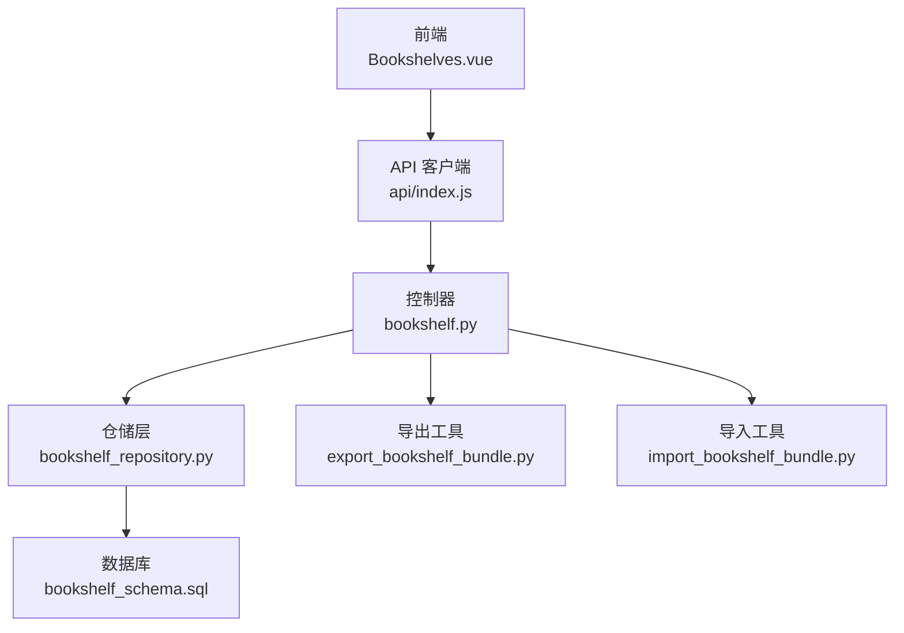
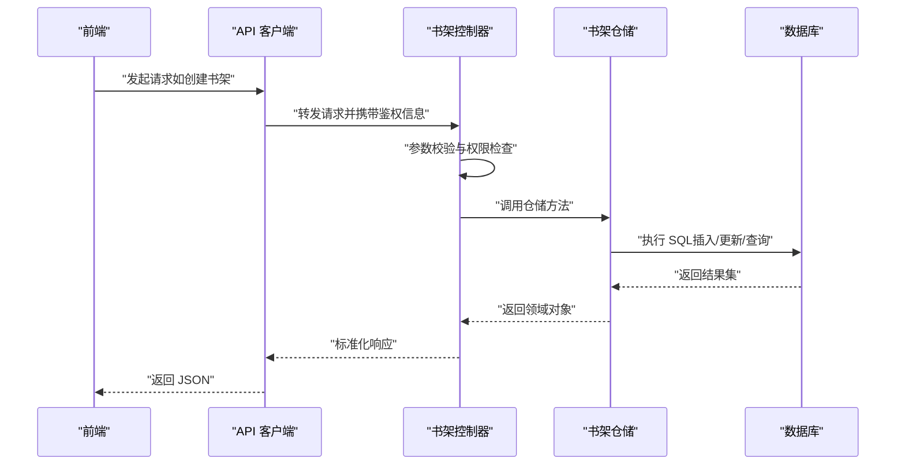
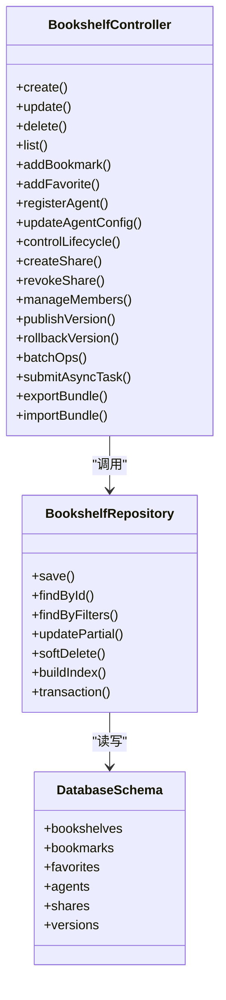
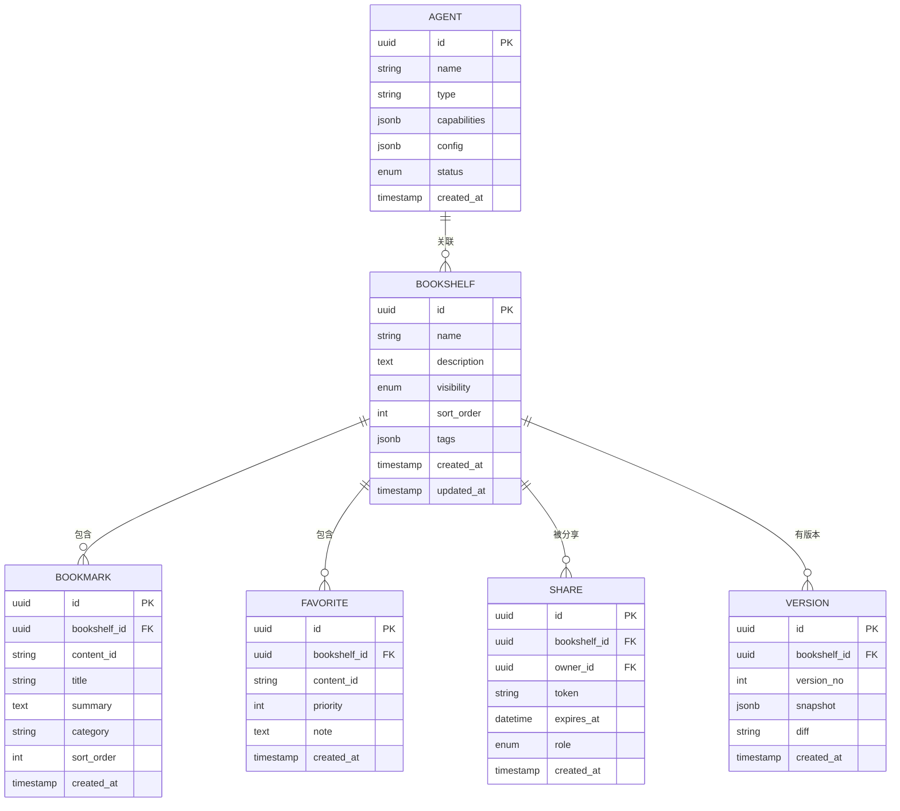
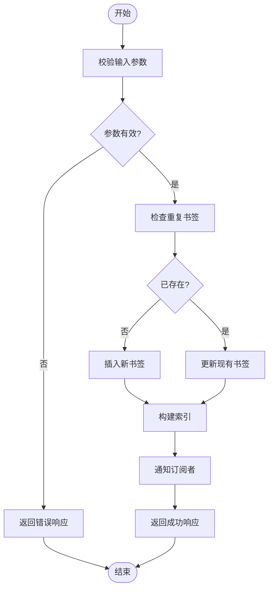

# 书架管理接口

<cite>
**本文引用的文件**   
- [backend/controllers/bookshelf.py](file://backend/controllers/bookshelf.py)
- [backend/bookshelf_repository.py](file://backend/bookshelf_repository.py)
- [backend/migrations/20260330_bookshelf_schema.sql](file://backend/migrations/20260330_bookshelf_schema.sql)
- [docker/postgres/init/001_bookshelf_schema.sql](file://docker/postgres/init/001_bookshelf_schema.sql)
- [backend/export_bookshelf_bundle.py](file://backend/export_bookshelf_bundle.py)
- [backend/import_bookshelf_bundle.py](file://backend/import_bookshelf_bundle.py)
- [backend/app.py](file://backend/app.py)
- [frontend/src/views/Bookshelves.vue](file://frontend/src/views/Bookshelves.vue)
- [frontend/src/api/index.js](file://frontend/src/api/index.js)
</cite>

## 目录
1. [简介](#简介)
2. [项目结构](#项目结构)
3. [核心组件](#核心组件)
4. [架构总览](#架构总览)
5. [详细组件分析](#详细组件分析)
6. [依赖关系分析](#依赖关系分析)
7. [性能考虑](#性能考虑)
8. [故障排查指南](#故障排查指南)
9. [结论](#结论)
10. [附录](#附录)

## 简介
本文件为 SmartAsk 平台的“书架管理”功能提供完整的 API 文档，覆盖以下能力：
- 书架的创建、编辑、删除与查询
- 书架元数据管理与内容组织（书签、收藏）
- 智能体管理接口（注册、配置、生命周期控制）
- 分享与协作（权限控制、版本管理）
- 批量操作与异步任务处理
- 数据同步、备份与恢复

读者可据此快速对接前端或集成第三方系统。

## 项目结构
书架管理相关代码主要分布在后端控制器、仓储层、数据库迁移脚本以及前后端交互文件中：
- 控制器层：定义 RESTful 路由与请求校验
- 仓储层：封装数据访问逻辑（CRUD、索引、聚合）
- 迁移脚本：定义书架、书签、收藏、智能体等表结构
- 导出导入：支持书架包导出与导入
- 前端视图与 API 调用：展示与交互入口

图表来源
- [backend/controllers/bookshelf.py](file://backend/controllers/bookshelf.py)
- [backend/bookshelf_repository.py](file://backend/bookshelf_repository.py)
- [backend/migrations/20260330_bookshelf_schema.sql](file://backend/migrations/20260330_bookshelf_schema.sql)
- [docker/postgres/init/001_bookshelf_schema.sql](file://docker/postgres/init/001_bookshelf_schema.sql)
- [backend/export_bookshelf_bundle.py](file://backend/export_bookshelf_bundle.py)
- [backend/import_bookshelf_bundle.py](file://backend/import_bookshelf_bundle.py)
- [frontend/src/views/Bookshelves.vue](file://frontend/src/views/Bookshelves.vue)
- [frontend/src/api/index.js](file://frontend/src/api/index.js)

章节来源
- [backend/controllers/bookshelf.py](file://backend/controllers/bookshelf.py)
- [backend/bookshelf_repository.py](file://backend/bookshelf_repository.py)
- [backend/migrations/20260330_bookshelf_schema.sql](file://backend/migrations/20260330_bookshelf_schema.sql)
- [docker/postgres/init/001_bookshelf_schema.sql](file://docker/postgres/init/001_bookshelf_schema.sql)
- [backend/export_bookshelf_bundle.py](file://backend/export_bookshelf_bundle.py)
- [backend/import_bookshelf_bundle.py](file://backend/import_bookshelf_bundle.py)
- [frontend/src/views/Bookshelves.vue](file://frontend/src/views/Bookshelves.vue)
- [frontend/src/api/index.js](file://frontend/src/api/index.js)

## 核心组件
- 书架控制器：暴露书架 CRUD、书签/收藏、智能体关联、分享与协作、批量操作、导出导入等接口
- 书架仓储：实现数据访问、索引构建、事务与一致性保障
- 数据库模型：书架、书签、收藏、智能体、分享与权限、版本记录等实体
- 导出导入：序列化书架包、增量/全量导入、冲突策略

章节来源
- [backend/controllers/bookshelf.py](file://backend/controllers/bookshelf.py)
- [backend/bookshelf_repository.py](file://backend/bookshelf_repository.py)
- [backend/migrations/20260330_bookshelf_schema.sql](file://backend/migrations/20260330_bookshelf_schema.sql)
- [docker/postgres/init/001_bookshelf_schema.sql](file://docker/postgres/init/001_bookshelf_schema.sql)

## 架构总览
书架管理采用分层架构：前端通过 API 客户端调用后端控制器，控制器负责参数校验与权限检查，仓储层执行数据操作，最终由数据库持久化。导出导入模块作为辅助服务，支持离线迁移与备份恢复。

图表来源
- [backend/controllers/bookshelf.py](file://backend/controllers/bookshelf.py)
- [backend/bookshelf_repository.py](file://backend/bookshelf_repository.py)
- [backend/migrations/20260330_bookshelf_schema.sql](file://backend/migrations/20260330_bookshelf_schema.sql)
- [docker/postgres/init/001_bookshelf_schema.sql](file://docker/postgres/init/001_bookshelf_schema.sql)

## 详细组件分析

### 书架管理接口（CRUD）
- 创建书架：POST /api/bookshelves
  - 输入：名称、描述、可见性、排序、标签等
  - 输出：书架 ID、创建时间、状态
  - 行为：校验唯一性、初始化默认书签/收藏、写入审计日志
- 更新书架：PUT /api/bookshelves/{id}
  - 输入：可更新字段集合
  - 输出：更新后的书架元数据
  - 行为：部分更新、并发控制（版本号）
- 删除书架：DELETE /api/bookshelves/{id}
  - 行为：软删除或级联清理书签/收藏；权限校验
- 查询书架：GET /api/bookshelves
  - 过滤：按名称、标签、可见性、所有者
  - 分页：页码、每页大小、排序字段

章节来源
- [backend/controllers/bookshelf.py](file://backend/controllers/bookshelf.py)
- [backend/bookshelf_repository.py](file://backend/bookshelf_repository.py)
- [backend/migrations/20260330_bookshelf_schema.sql](file://backend/migrations/20260330_bookshelf_schema.sql)
- [docker/postgres/init/001_bookshelf_schema.sql](file://docker/postgres/init/001_bookshelf_schema.sql)

### 书签与收藏接口
- 添加书签：POST /api/bookshelves/{id}/bookmarks
  - 输入：内容标识、标题、摘要、分类、排序
  - 行为：去重、索引构建、通知订阅者
- 更新书签：PUT /api/bookshelves/{id}/bookmarks/{bid}
  - 行为：字段更新、版本控制
- 删除书签：DELETE /api/bookshelves/{id}/bookmarks/{bid}
  - 行为：级联清理引用
- 收藏内容：POST /api/bookshelves/{id}/favorites
  - 输入：内容标识、优先级、备注
  - 行为：快速访问索引、统计计数
- 查询书签/收藏：GET /api/bookshelves/{id}/bookmarks, GET /api/bookshelves/{id}/favorites
  - 过滤：分类、标签、时间范围
  - 排序：自定义权重、最近使用

章节来源
- [backend/controllers/bookshelf.py](file://backend/controllers/bookshelf.py)
- [backend/bookshelf_repository.py](file://backend/bookshelf_repository.py)
- [backend/migrations/20260330_bookshelf_schema.sql](file://backend/migrations/20260330_bookshelf_schema.sql)
- [docker/postgres/init/001_bookshelf_schema.sql](file://docker/postgres/init/001_bookshelf_schema.sql)

### 智能体管理接口
- 注册智能体：POST /api/agents
  - 输入：名称、类型、能力清单、初始配置
  - 行为：注册到注册表、生成默认模板
- 更新智能体配置：PUT /api/agents/{agentId}
  - 输入：配置项键值对
  - 行为：热更新或重启生效策略
- 启用/禁用智能体：PATCH /api/agents/{agentId}/status
  - 行为：状态机切换、依赖检查
- 查询智能体：GET /api/agents
  - 过滤：类型、状态、能力标签
- 生命周期控制：启动、停止、重启
  - 行为：资源分配/释放、健康检查

章节来源
- [backend/controllers/bookshelf.py](file://backend/controllers/bookshelf.py)
- [backend/bookshelf_repository.py](file://backend/bookshelf_repository.py)
- [backend/migrations/20260330_bookshelf_schema.sql](file://backend/migrations/20260330_bookshelf_schema.sql)
- [docker/postgres/init/001_bookshelf_schema.sql](file://docker/postgres/init/001_bookshelf_schema.sql)

### 分享与协作接口
- 创建分享链接：POST /api/bookshelves/{id}/shares
  - 输入：有效期、访问密码、角色（只读/编辑）
  - 行为：生成令牌、权限绑定
- 撤销分享：DELETE /api/bookshelves/{id}/shares/{shareId}
  - 行为：失效令牌、审计记录
- 成员管理：添加/移除协作者、变更角色
  - 行为：RBAC 校验、权限继承
- 版本管理：发布新版本、回滚
  - 行为：快照保存、差异对比、合并策略

章节来源
- [backend/controllers/bookshelf.py](file://backend/controllers/bookshelf.py)
- [backend/bookshelf_repository.py](file://backend/bookshelf_repository.py)
- [backend/migrations/20260330_bookshelf_schema.sql](file://backend/migrations/20260330_bookshelf_schema.sql)
- [docker/postgres/init/001_bookshelf_schema.sql](file://docker/postgres/init/001_bookshelf_schema.sql)

### 批量操作与异步任务
- 批量创建/更新/删除：POST /api/bookshelves/batch
  - 输入：操作列表、失败策略（跳过/继续/中止）
  - 行为：事务分组、幂等键、进度回调
- 异步任务：提交任务、查询状态、获取结果
  - 行为：任务队列、重试机制、超时控制

章节来源
- [backend/controllers/bookshelf.py](file://backend/controllers/bookshelf.py)
- [backend/bookshelf_repository.py](file://backend/bookshelf_repository.py)

### 数据同步、备份与恢复
- 导出书架包：GET /api/bookshelves/{id}/export
  - 输出：结构化包（JSON/YAML），含元数据、书签、收藏、智能体配置
- 导入书架包：POST /api/bookshelves/import
  - 输入：包文件、冲突策略（覆盖/跳过/合并）
  - 行为：校验完整性、增量更新、回滚点
- 定时同步：配置源与目标、频率、映射规则
  - 行为：增量拉取、冲突检测、审计日志

章节来源
- [backend/export_bookshelf_bundle.py](file://backend/export_bookshelf_bundle.py)
- [backend/import_bookshelf_bundle.py](file://backend/import_bookshelf_bundle.py)
- [backend/controllers/bookshelf.py](file://backend/controllers/bookshelf.py)

## 依赖关系分析
书架管理的依赖关系如下：
- 控制器依赖仓储层进行数据访问
- 仓储层依赖数据库模型（迁移脚本定义）
- 导出导入模块独立于主流程，供运维与迁移使用
- 前端通过 API 客户端与控制器交互

图表来源
- [backend/controllers/bookshelf.py](file://backend/controllers/bookshelf.py)
- [backend/bookshelf_repository.py](file://backend/bookshelf_repository.py)
- [backend/migrations/20260330_bookshelf_schema.sql](file://backend/migrations/20260330_bookshelf_schema.sql)
- [docker/postgres/init/001_bookshelf_schema.sql](file://docker/postgres/init/001_bookshelf_schema.sql)

章节来源
- [backend/controllers/bookshelf.py](file://backend/controllers/bookshelf.py)
- [backend/bookshelf_repository.py](file://backend/bookshelf_repository.py)
- [backend/migrations/20260330_bookshelf_schema.sql](file://backend/migrations/20260330_bookshelf_schema.sql)
- [docker/postgres/init/001_bookshelf_schema.sql](file://docker/postgres/init/001_bookshelf_schema.sql)

## 性能考虑
- 索引优化：为常用查询字段建立复合索引（如书架名称、标签、所有者）
- 分页与懒加载：列表接口默认分页，避免一次性加载大量数据
- 缓存策略：热点书架元数据与书签索引可缓存
- 事务边界：批量操作分批次提交，降低锁竞争
- 异步处理：耗时任务（导出/导入/同步）走异步队列，提升响应速度

[本节为通用指导，不直接分析具体文件]

## 故障排查指南
- 常见错误码与含义：参数校验失败、权限不足、资源不存在、并发冲突
- 日志定位：查看控制器日志、仓储层 SQL 日志、数据库慢查询
- 数据一致性：检查事务回滚点、导入冲突策略、版本快照
- 权限问题：确认 RBAC 配置、分享令牌有效性、成员角色
- 性能瓶颈：监控数据库连接池、索引命中率、缓存命中率

章节来源
- [backend/controllers/bookshelf.py](file://backend/controllers/bookshelf.py)
- [backend/bookshelf_repository.py](file://backend/bookshelf_repository.py)

## 结论
书架管理接口提供了完整的数据建模、权限控制、协作与迁移能力，适合企业级知识管理与智能体编排场景。建议结合前端最佳实践与后端性能优化，确保高可用与可扩展性。

[本节为总结性内容，不直接分析具体文件]

## 附录

### 数据模型定义（ER 图）

图表来源
- [backend/migrations/20260330_bookshelf_schema.sql](file://backend/migrations/20260330_bookshelf_schema.sql)
- [docker/postgres/init/001_bookshelf_schema.sql](file://docker/postgres/init/001_bookshelf_schema.sql)

### 关键流程图（书签添加）

图表来源
- [backend/controllers/bookshelf.py](file://backend/controllers/bookshelf.py)
- [backend/bookshelf_repository.py](file://backend/bookshelf_repository.py)

### 前端交互要点
- 页面入口：Bookshelves.vue 提供书架列表、详情、书签与收藏管理界面
- API 客户端：api/index.js 封装统一请求、鉴权与错误处理
- 交互反馈：加载态、错误提示、成功通知

章节来源
- [frontend/src/views/Bookshelves.vue](file://frontend/src/views/Bookshelves.vue)
- [frontend/src/api/index.js](file://frontend/src/api/index.js)