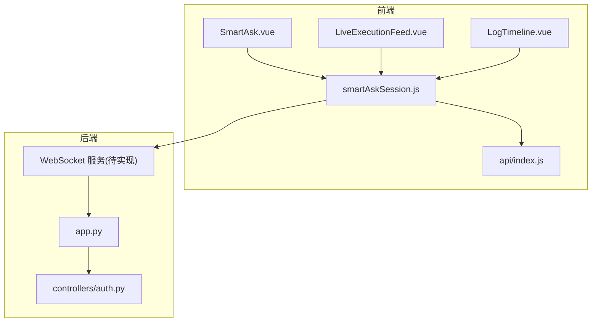
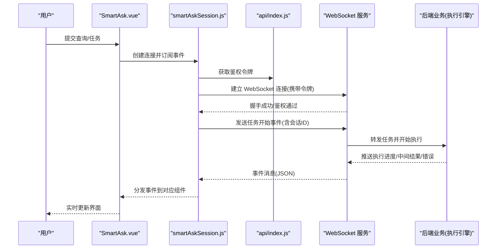
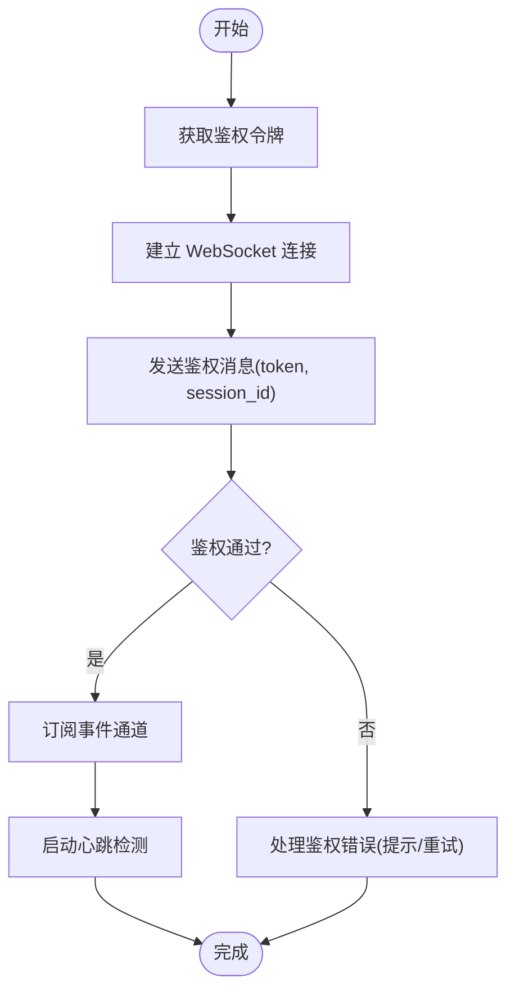
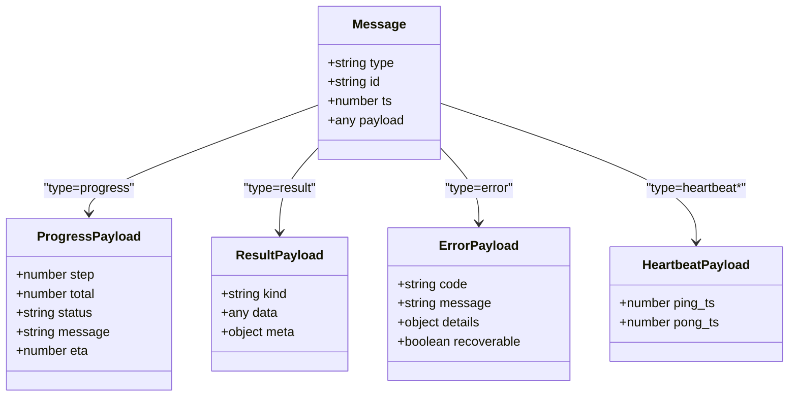
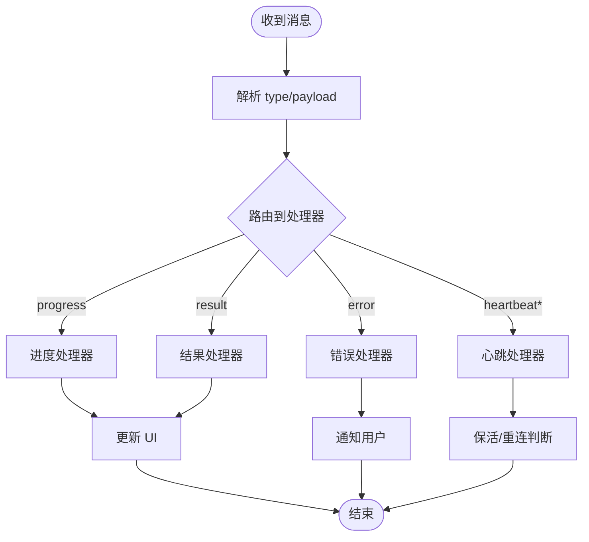
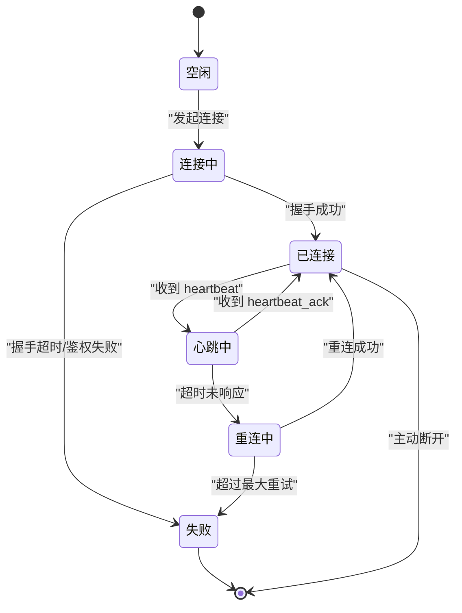
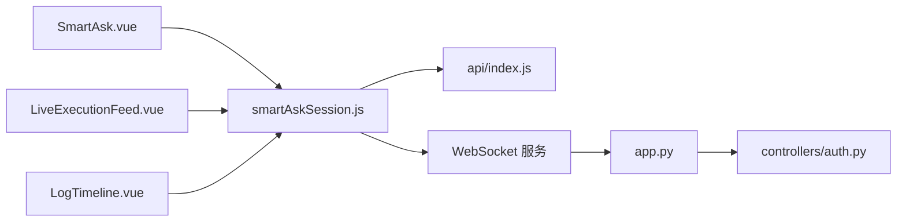

# 实时接口

<cite>
**本文引用的文件**   
- [backend/app.py](file://backend/app.py)
- [backend/controllers/auth.py](file://backend/controllers/auth.py)
- [frontend/src/views/SmartAsk.vue](file://frontend/src/views/SmartAsk.vue)
- [frontend/src/components/smartask/LiveExecutionFeed.vue](file://frontend/src/components/smartask/LiveExecutionFeed.vue)
- [frontend/src/components/smartask/LogTimeline.vue](file://frontend/src/components/smartask/LogTimeline.vue)
- [frontend/src/state/smartAskSession.js](file://frontend/src/state/smartAskSession.js)
- [frontend/src/api/index.js](file://frontend/src/api/index.js)
</cite>

## 目录
1. [简介](#简介)
2. [项目结构](#项目结构)
3. [核心组件](#核心组件)
4. [架构总览](#架构总览)
5. [详细组件分析](#详细组件分析)
6. [依赖关系分析](#依赖关系分析)
7. [性能考虑](#性能考虑)
8. [故障排查指南](#故障排查指南)
9. [结论](#结论)
10. [附录](#附录)

## 简介
本文件为 SmartAsk 平台的“实时接口”文档，聚焦于 WebSocket 实时通信能力。内容涵盖：
- 连接建立与握手协议、身份验证流程
- 实时消息格式（执行进度、中间结果、错误信息）
- 事件类型与消息路由机制
- 心跳检测与连接保活（超时与重连策略）
- 客户端集成示例（连接管理、消息订阅、错误处理）
- 性能优化建议（压缩、批量传输、内存管理）
- 调试工具与故障排查

说明：由于当前仓库未包含后端 WebSocket 实现代码，本文档基于前端对实时能力的调用模式进行归纳与约定式描述，确保前后端对接时具备一致契约。

## 项目结构
SmartAsk 的实时通信由前端发起并维护 WebSocket 连接，后端提供相应的 WebSocket 服务以推送执行进度、中间结果和错误等事件。关键位置如下：
- 前端视图层：负责用户交互与展示实时状态
- 前端会话状态：集中管理连接生命周期、消息订阅与重试
- API 模块：封装通用请求与鉴权逻辑
- 后端入口：注册路由与服务启动（WebSocket 服务端点应在此处挂载）

图表来源
- [frontend/src/views/SmartAsk.vue](file://frontend/src/views/SmartAsk.vue)
- [frontend/src/components/smartask/LiveExecutionFeed.vue](file://frontend/src/components/smartask/LiveExecutionFeed.vue)
- [frontend/src/components/smartask/LogTimeline.vue](file://frontend/src/components/smartask/LogTimeline.vue)
- [frontend/src/state/smartAskSession.js](file://frontend/src/state/smartAskSession.js)
- [frontend/src/api/index.js](file://frontend/src/api/index.js)
- [backend/app.py](file://backend/app.py)
- [backend/controllers/auth.py](file://backend/controllers/auth.py)

章节来源
- [frontend/src/views/SmartAsk.vue](file://frontend/src/views/SmartAsk.vue)
- [frontend/src/components/smartask/LiveExecutionFeed.vue](file://frontend/src/components/smartask/LiveExecutionFeed.vue)
- [frontend/src/components/smartask/LogTimeline.vue](file://frontend/src/components/smartask/LogTimeline.vue)
- [frontend/src/state/smartAskSession.js](file://frontend/src/state/smartAskSession.js)
- [frontend/src/api/index.js](file://frontend/src/api/index.js)
- [backend/app.py](file://backend/app.py)
- [backend/controllers/auth.py](file://backend/controllers/auth.py)

## 核心组件
- 连接管理器（smartAskSession.js）
  - 职责：统一创建/关闭 WebSocket、鉴权参数注入、心跳与重连、事件订阅分发、错误恢复
  - 关键点：连接状态机、消息队列、退避重连、断线恢复
- 实时渲染组件（LiveExecutionFeed.vue、LogTimeline.vue）
  - 职责：消费实时事件流，渲染执行进度、日志时间线、中间结果卡片
  - 关键点：增量更新、去重、滚动定位、性能节流
- 鉴权与认证（controllers/auth.py）
  - 职责：生成/校验访问令牌、会话绑定、权限校验
  - 关键点：令牌有效期、刷新策略、安全头传递
- 后端入口（app.py）
  - 职责：应用初始化、路由注册、中间件挂载、WebSocket 端点暴露
  - 关键点：跨域配置、静态资源代理、健康检查

章节来源
- [frontend/src/state/smartAskSession.js](file://frontend/src/state/smartAskSession.js)
- [frontend/src/components/smartask/LiveExecutionFeed.vue](file://frontend/src/components/smartask/LiveExecutionFeed.vue)
- [frontend/src/components/smartask/LogTimeline.vue](file://frontend/src/components/smartask/LogTimeline.vue)
- [backend/controllers/auth.py](file://backend/controllers/auth.py)
- [backend/app.py](file://backend/app.py)

## 架构总览
下图展示了从前端发起实时任务到后端推送事件的端到端流程。该流程强调鉴权、事件路由与前端渲染。

图表来源
- [frontend/src/views/SmartAsk.vue](file://frontend/src/views/SmartAsk.vue)
- [frontend/src/state/smartAskSession.js](file://frontend/src/state/smartAskSession.js)
- [frontend/src/api/index.js](file://frontend/src/api/index.js)
- [backend/app.py](file://backend/app.py)

## 详细组件分析

### 连接管理与鉴权
- 连接参数
  - URL：ws(s)://域名/路径（生产环境使用 wss）
  - 头部：Authorization: Bearer <token>
  - 查询参数：session_id、client_version、timestamp（可选）
- 握手协议
  - 客户端连接后需立即发送鉴权消息（包含 token 与 session_id）
  - 服务端返回握手成功或失败（失败包含错误码与原因）
- 身份验证
  - 令牌来源：api/index.js 中统一获取
  - 令牌过期：自动刷新并重试握手
  - 权限校验：按角色/组织维度控制事件可见性

图表来源
- [frontend/src/state/smartAskSession.js](file://frontend/src/state/smartAskSession.js)
- [frontend/src/api/index.js](file://frontend/src/api/index.js)

章节来源
- [frontend/src/state/smartAskSession.js](file://frontend/src/state/smartAskSession.js)
- [frontend/src/api/index.js](file://frontend/src/api/index.js)

### 实时消息格式
- 通用消息结构
  - type：事件类型（如 progress、result、error、heartbeat_ack）
  - id：消息唯一标识（用于去重与追踪）
  - ts：时间戳（毫秒）
  - payload：业务数据（随 type 变化）
- 执行进度（progress）
  - payload 字段：step、total、status、message、eta（预估剩余时间）
- 中间结果（result）
  - payload 字段：kind（sql/plan/chart/table）、data、meta（分页、统计）
- 错误信息（error）
  - payload 字段：code、message、details、recoverable（是否可恢复）
- 心跳相关（heartbeat/heartbeat_ack）
  - heartbeat：服务端定时发送
  - heartbeat_ack：客户端回传确认

图表来源
- [frontend/src/state/smartAskSession.js](file://frontend/src/state/smartAskSession.js)
- [frontend/src/components/smartask/LiveExecutionFeed.vue](file://frontend/src/components/smartask/LiveExecutionFeed.vue)
- [frontend/src/components/smartask/LogTimeline.vue](file://frontend/src/components/smartask/LogTimeline.vue)

章节来源
- [frontend/src/state/smartAskSession.js](file://frontend/src/state/smartAskSession.js)
- [frontend/src/components/smartask/LiveExecutionFeed.vue](file://frontend/src/components/smartask/LiveExecutionFeed.vue)
- [frontend/src/components/smartask/LogTimeline.vue](file://frontend/src/components/smartask/LogTimeline.vue)

### 事件类型与路由机制
- 事件分类
  - 执行类：progress、result、error
  - 系统类：heartbeat、heartbeat_ack、reconnect、disconnect
  - 业务类：plan、sql、chart、table（根据 result.kind 区分）
- 路由策略
  - 基于 type 分发到对应处理器
  - 基于 session_id 隔离不同会话
  - 基于 client_version 兼容旧版本客户端
- 处理策略
  - progress：增量更新进度条与 ETA
  - result：渲染中间结果卡片，支持分页加载
  - error：弹出错误提示，标记不可恢复则终止流程

图表来源
- [frontend/src/state/smartAskSession.js](file://frontend/src/state/smartAskSession.js)
- [frontend/src/components/smartask/LiveExecutionFeed.vue](file://frontend/src/components/smartask/LiveExecutionFeed.vue)
- [frontend/src/components/smartask/LogTimeline.vue](file://frontend/src/components/smartask/LogTimeline.vue)

章节来源
- [frontend/src/state/smartAskSession.js](file://frontend/src/state/smartAskSession.js)
- [frontend/src/components/smartask/LiveExecutionFeed.vue](file://frontend/src/components/smartask/LiveExecutionFeed.vue)
- [frontend/src/components/smartask/LogTimeline.vue](file://frontend/src/components/smartask/LogTimeline.vue)

### 心跳检测与连接保活
- 心跳机制
  - 服务端每 N 秒发送 heartbeat
  - 客户端在 M 秒内回复 heartbeat_ack
  - 连续 K 次无响应触发重连
- 超时处理
  - 握手超时：快速失败并提示
  - 消息超时：丢弃或缓存（视业务）
- 重连策略
  - 指数退避：初始间隔 × 增长因子
  - 最大重试次数限制
  - 网络恢复后自动重连

图表来源
- [frontend/src/state/smartAskSession.js](file://frontend/src/state/smartAskSession.js)

章节来源
- [frontend/src/state/smartAskSession.js](file://frontend/src/state/smartAskSession.js)

### 客户端集成示例
- 连接管理
  - 创建连接：传入 wsUrl、token、session_id
  - 订阅事件：on('progress'|'result'|'error')
  - 关闭连接：清理监听器与定时器
- 消息订阅
  - 使用事件总线分发到各组件
  - 支持去重与限流
- 错误处理
  - 捕获网络异常、鉴权失败、业务错误
  - 提供用户友好提示与重试入口

章节来源
- [frontend/src/state/smartAskSession.js](file://frontend/src/state/smartAskSession.js)
- [frontend/src/components/smartask/LiveExecutionFeed.vue](file://frontend/src/components/smartask/LiveExecutionFeed.vue)
- [frontend/src/components/smartask/LogTimeline.vue](file://frontend/src/components/smartask/LogTimeline.vue)

## 依赖关系分析
- 前端依赖
  - smartAskSession.js 依赖 api/index.js 获取令牌
  - LiveExecutionFeed.vue 与 LogTimeline.vue 依赖 smartAskSession.js 的事件流
- 后端依赖
  - app.py 作为入口，可能依赖 controllers/auth.py 进行鉴权
  - WebSocket 服务需与业务执行引擎集成

图表来源
- [frontend/src/views/SmartAsk.vue](file://frontend/src/views/SmartAsk.vue)
- [frontend/src/state/smartAskSession.js](file://frontend/src/state/smartAskSession.js)
- [frontend/src/components/smartask/LiveExecutionFeed.vue](file://frontend/src/components/smartask/LiveExecutionFeed.vue)
- [frontend/src/components/smartask/LogTimeline.vue](file://frontend/src/components/smartask/LogTimeline.vue)
- [frontend/src/api/index.js](file://frontend/src/api/index.js)
- [backend/app.py](file://backend/app.py)
- [backend/controllers/auth.py](file://backend/controllers/auth.py)

章节来源
- [frontend/src/state/smartAskSession.js](file://frontend/src/state/smartAskSession.js)
- [frontend/src/api/index.js](file://frontend/src/api/index.js)
- [backend/app.py](file://backend/app.py)
- [backend/controllers/auth.py](file://backend/controllers/auth.py)

## 性能考虑
- 消息压缩
  - 启用 gzip/deflate 压缩大体积 payload（如 SQL、表格数据）
  - 前端按需解压，避免阻塞主线程
- 批量传输
  - 合并多个小消息为批量事件，降低握手与序列化开销
  - 设置最小批大小与最大延迟阈值
- 内存管理
  - 限制历史消息缓存大小，采用环形缓冲
  - 及时释放不再使用的监听器与定时器
- 渲染优化
  - 虚拟列表渲染长日志
  - 防抖/节流高频更新（如进度条）

[本节为通用指导，不直接分析具体文件]

## 故障排查指南
- 常见问题
  - 握手失败：检查 token 有效性、跨域配置、端口与协议
  - 频繁断线：检查心跳超时配置、网络稳定性、服务器负载
  - 消息丢失：检查客户端重连策略、消息去重与幂等处理
- 调试工具
  - 浏览器开发者工具 Network/WebSocket 面板
  - 前端日志开关与级别控制
  - 后端访问日志与错误堆栈
- 定位步骤
  - 复现问题并抓取握手与消息序列
  - 核对事件类型与 payload 是否符合约定
  - 检查鉴权与权限控制逻辑

章节来源
- [frontend/src/state/smartAskSession.js](file://frontend/src/state/smartAskSession.js)
- [frontend/src/api/index.js](file://frontend/src/api/index.js)
- [backend/app.py](file://backend/app.py)
- [backend/controllers/auth.py](file://backend/controllers/auth.py)

## 结论
本文档为 SmartAsk 平台的实时接口提供了完整的约定与最佳实践，涵盖连接、鉴权、消息格式、事件路由、心跳保活、性能优化与故障排查。建议在实现后端 WebSocket 服务时严格遵循本文约定的数据结构与流程，以确保前后端稳定协作与用户体验一致性。

[本节为总结，不直接分析具体文件]

## 附录
- 术语表
  - WebSocket：全双工通信协议
  - 心跳：周期性保活信号
  - 指数退避：重连间隔按指数增长
- 参考文件
  - 前端会话管理：smartAskSession.js
  - 实时渲染组件：LiveExecutionFeed.vue、LogTimeline.vue
  - 鉴权模块：controllers/auth.py
  - 后端入口：app.py

[本节为补充信息，不直接分析具体文件]