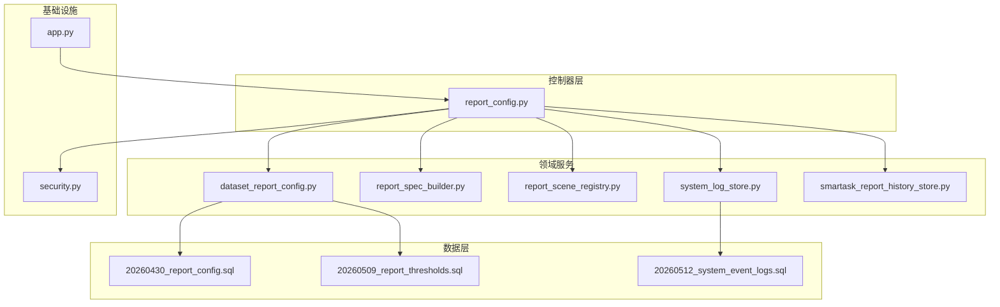
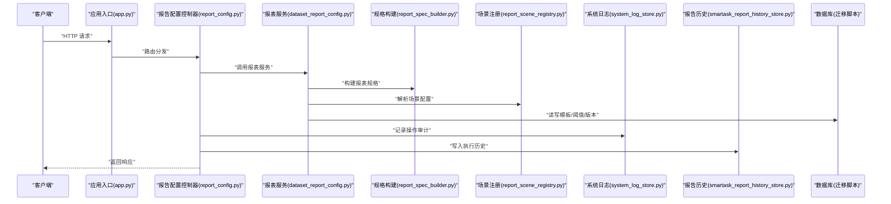
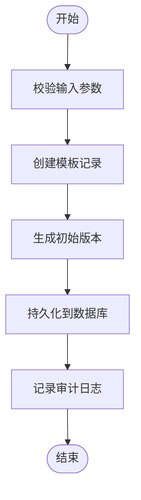
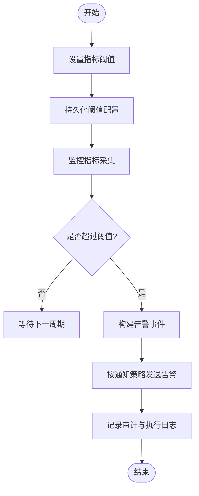
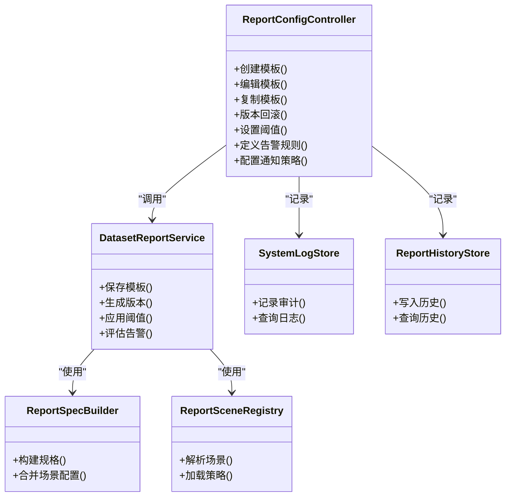

# 报告配置接口

<cite>
**本文引用的文件**   
- [report_config.py](file://backend/controllers/report_config.py)
- [dataset_report_config.py](file://backend/dataset_report_config.py)
- [20260430_report_config.sql](file://backend/migrations/20260430_report_config.sql)
- [20260509_report_thresholds.sql](file://backend/migrations/20260509_report_thresholds.sql)
- [20260512_system_event_logs.sql](file://backend/migrations/20260512_system_event_logs.sql)
- [app.py](file://backend/app.py)
- [security.py](file://backend/security.py)
- [system_log_store.py](file://backend/system_log_store.py)
- [smartask_report_history_store.py](file://backend/smartask_report_history_store.py)
- [report_spec_builder.py](file://backend/report_spec_builder.py)
- [report_scene_registry.py](file://backend/report_scene_registry.py)
</cite>

## 目录
1. [简介](#简介)
2. [项目结构](#项目结构)
3. [核心组件](#核心组件)
4. [架构总览](#架构总览)
5. [详细组件分析](#详细组件分析)
6. [依赖关系分析](#依赖关系分析)
7. [性能考虑](#性能考虑)
8. [故障排查指南](#故障排查指南)
9. [结论](#结论)
10. [附录](#附录)

## 简介
本文件为 SmartAsk 平台的“报告配置”能力提供面向开发者的 API 文档，覆盖以下范围：
- 报表模板管理：创建、编辑、复制与版本控制
- 阈值配置：指标阈值设置、告警规则定义、通知策略配置
- 定时任务管理：调度策略、执行日志、失败重试机制
- 报告导出：PDF、Excel、CSV 等格式支持与批量导出
- 权限控制：访问授权、分享管理与审计日志
- 性能监控：执行时间统计与资源使用情况分析

说明：
- 本文档以现有后端代码为依据进行归纳与结构化整理。若某些能力在仓库中尚未实现，将明确标注“待实现”，并给出建议的接口形态与数据模型，便于后续扩展。

## 项目结构
围绕报告配置的代码主要分布在以下位置：
- 控制器层：负责 HTTP 路由与请求处理
- 领域服务：报表规格构建、场景注册、历史存储、系统日志
- 迁移脚本：数据库表结构与字段演进
- 安全与鉴权：统一鉴权与权限校验

图表来源
- [report_config.py](file://backend/controllers/report_config.py)
- [dataset_report_config.py](file://backend/dataset_report_config.py)
- [report_spec_builder.py](file://backend/report_spec_builder.py)
- [report_scene_registry.py](file://backend/report_scene_registry.py)
- [system_log_store.py](file://backend/system_log_store.py)
- [smartask_report_history_store.py](file://backend/smartask_report_history_store.py)
- [app.py](file://backend/app.py)
- [security.py](file://backend/security.py)
- [20260430_report_config.sql](file://backend/migrations/20260430_report_config.sql)
- [20260509_report_thresholds.sql](file://backend/migrations/20260509_report_thresholds.sql)
- [20260512_system_event_logs.sql](file://backend/migrations/20260512_system_event_logs.sql)

章节来源
- [report_config.py](file://backend/controllers/report_config.py)
- [dataset_report_config.py](file://backend/dataset_report_config.py)
- [app.py](file://backend/app.py)
- [security.py](file://backend/security.py)

## 核心组件
- 报表模板管理（CRUD 与版本）
  - 通过控制器暴露模板增删改查、复制与版本化接口
  - 使用迁移脚本维护模板元数据与版本表结构
- 阈值与告警配置
  - 基于迁移脚本定义的阈值与告警表结构，提供指标阈值设置、告警规则定义与通知策略配置
- 定时任务管理
  - 调度策略、执行日志与失败重试机制（当前仓库未提供具体实现，建议按如下接口设计扩展）
- 报告导出
  - 支持 PDF、Excel、CSV 等格式与批量导出（当前仓库未提供具体实现，建议按如下接口设计扩展）
- 权限控制
  - 基于统一鉴权与安全模块，提供访问授权、分享管理与审计日志记录
- 性能监控
  - 执行时间统计与资源使用情况分析（当前仓库未提供具体实现，建议按如下接口设计扩展）

章节来源
- [20260430_report_config.sql](file://backend/migrations/20260430_report_config.sql)
- [20260509_report_thresholds.sql](file://backend/migrations/20260509_report_thresholds.sql)
- [20260512_system_event_logs.sql](file://backend/migrations/20260512_system_event_logs.sql)

## 架构总览
报告配置功能由控制器层协调多个领域服务完成，底层依赖数据库迁移脚本所定义的持久化结构，并通过安全模块进行鉴权与审计。

图表来源
- [app.py](file://backend/app.py)
- [report_config.py](file://backend/controllers/report_config.py)
- [dataset_report_config.py](file://backend/dataset_report_config.py)
- [report_spec_builder.py](file://backend/report_spec_builder.py)
- [report_scene_registry.py](file://backend/report_scene_registry.py)
- [system_log_store.py](file://backend/system_log_store.py)
- [smartask_report_history_store.py](file://backend/smartask_report_history_store.py)
- [20260430_report_config.sql](file://backend/migrations/20260430_report_config.sql)
- [20260509_report_thresholds.sql](file://backend/migrations/20260509_report_thresholds.sql)

## 详细组件分析

### 报表模板管理接口
- 能力概述
  - 模板创建：定义模板名称、描述、关联数据集、输出维度与指标、渲染样式等
  - 模板编辑：增量更新模板属性与渲染参数
  - 模板复制：快速生成新模板并继承原模板配置
  - 版本控制：每次变更生成新版本，支持回滚与对比
- 数据模型要点（来自迁移脚本）
  - 模板主表：模板标识、名称、描述、状态、创建/更新时间、创建人等
  - 模板版本表：版本号、快照内容、差异摘要、生效状态等
- 典型流程（创建与版本化）

章节来源
- [20260430_report_config.sql](file://backend/migrations/20260430_report_config.sql)

### 阈值配置接口
- 能力概述
  - 指标阈值设置：为指定指标配置上限/下限、环比/同比阈值、时间窗口等
  - 告警规则定义：组合多个阈值条件，定义触发级别与动作
  - 通知策略配置：选择通知渠道（如邮件、飞书等）、接收人、去重与静默策略
- 数据模型要点（来自迁移脚本）
  - 阈值表：指标标识、阈值类型、阈值值、时间窗口、生效状态等
  - 告警规则表：规则名称、条件表达式、触发级别、动作集合等
  - 通知策略表：渠道类型、目标地址、频率限制、静默时段等
- 典型流程（设置阈值与触发告警）

章节来源
- [20260509_report_thresholds.sql](file://backend/migrations/20260509_report_thresholds.sql)

### 定时任务管理（建议扩展）
- 能力概述
  - 调度策略：Cron 表达式、延迟执行、依赖任务编排
  - 执行日志：任务启动、运行状态、结果摘要、错误堆栈
  - 失败重试：指数退避、最大重试次数、死信队列
- 建议接口形态
  - 任务定义：POST /api/report-schedules（创建/更新）
  - 任务执行：POST /api/report-schedules/{id}/run（立即执行）
  - 执行日志：GET /api/report-schedules/{id}/logs（分页查询）
  - 重试策略：PUT /api/report-schedules/{id}/retry-policy（更新重试策略）
- 注意
  - 当前仓库未提供具体实现，建议在控制器与服务层新增相应模块，并复用系统日志与审计能力

[本节为概念性设计，不直接分析具体文件]

### 报告导出（建议扩展）
- 能力概述
  - 格式支持：PDF、Excel、CSV
  - 批量导出：多模板并行导出、进度回调、下载链接
- 建议接口形态
  - 导出任务：POST /api/reports/export（提交导出任务）
  - 任务状态：GET /api/reports/export/{taskId}（查询进度）
  - 下载文件：GET /api/reports/export/{taskId}/download（获取文件）
  - 批量导出：POST /api/reports/export/batch（批量提交）
- 注意
  - 当前仓库未提供具体实现，建议在导出服务中集成渲染引擎与对象存储

[本节为概念性设计，不直接分析具体文件]

### 权限控制
- 能力概述
  - 访问授权：基于角色/资源的访问控制，确保仅授权用户可操作模板与阈值
  - 分享管理：模板或报告的分享链接、有效期、访问权限粒度
  - 审计日志：所有关键操作的审计记录，包括操作人、时间、IP、变更前后快照
- 实现要点
  - 鉴权：通过安全模块对请求进行身份与权限校验
  - 审计：统一写入系统日志表，支持检索与导出
- 相关数据模型（来自迁移脚本）
  - 系统事件日志表：事件类型、主体、客体、操作、结果、上下文等

章节来源
- [security.py](file://backend/security.py)
- [20260512_system_event_logs.sql](file://backend/migrations/20260512_system_event_logs.sql)

### 性能监控（建议扩展）
- 能力概述
  - 执行时间统计：接口耗时、SQL 执行耗时、渲染耗时
  - 资源使用情况：CPU、内存、I/O 峰值与均值
- 建议接口形态
  - 指标上报：POST /api/report-metrics（上报执行指标）
  - 查询统计：GET /api/report-metrics?period=...&group_by=...
  - 资源监控：GET /api/report-metrics/resources?interval=...
- 注意
  - 当前仓库未提供具体实现，建议在控制器或服务层埋点，并聚合至监控系统

[本节为概念性设计，不直接分析具体文件]

## 依赖关系分析
- 控制器依赖
  - 报表服务：封装模板 CRUD、版本化、阈值与告警逻辑
  - 规格构建：根据模板与场景生成最终报表规格
  - 场景注册：解析不同业务场景的配置映射
  - 系统日志：记录审计与操作轨迹
  - 报告历史：记录执行历史与结果摘要
- 数据依赖
  - 迁移脚本定义了模板、版本、阈值、告警、通知策略与系统日志等表结构
- 安全依赖
  - 统一鉴权与安全校验贯穿所有接口

图表来源
- [report_config.py](file://backend/controllers/report_config.py)
- [dataset_report_config.py](file://backend/dataset_report_config.py)
- [report_spec_builder.py](file://backend/report_spec_builder.py)
- [report_scene_registry.py](file://backend/report_scene_registry.py)
- [system_log_store.py](file://backend/system_log_store.py)
- [smartask_report_history_store.py](file://backend/smartask_report_history_store.py)

章节来源
- [report_config.py](file://backend/controllers/report_config.py)
- [dataset_report_config.py](file://backend/dataset_report_config.py)
- [report_spec_builder.py](file://backend/report_spec_builder.py)
- [report_scene_registry.py](file://backend/report_scene_registry.py)
- [system_log_store.py](file://backend/system_log_store.py)
- [smartask_report_history_store.py](file://backend/smartask_report_history_store.py)

## 性能考虑
- 接口层面
  - 对耗时操作（如导出、复杂渲染）采用异步任务与进度查询
  - 合理分页与限流，避免大查询阻塞
- 数据层面
  - 为常用查询字段建立索引（模板名称、状态、创建时间、指标标识等）
  - 版本快照与历史数据归档，降低热表压力
- 监控与优化
  - 接入性能埋点，统计 P95/P99 耗时与错误率
  - 定期分析慢查询与热点路径，优化 SQL 与缓存策略

[本节为通用指导，不直接分析具体文件]

## 故障排查指南
- 常见问题定位
  - 权限问题：检查鉴权中间件与角色分配，确认用户具备所需资源权限
  - 数据一致性：核对模板版本快照与当前生效版本，必要时回滚
  - 阈值误报：检查阈值配置的时间窗口与指标口径，确认数据采集正常
  - 审计缺失：确认系统日志写入成功，检查日志表结构与写入权限
- 日志与诊断
  - 使用系统日志查询接口检索操作轨迹与错误堆栈
  - 结合报告历史查看执行结果与异常信息

章节来源
- [security.py](file://backend/security.py)
- [system_log_store.py](file://backend/system_log_store.py)
- [20260512_system_event_logs.sql](file://backend/migrations/20260512_system_event_logs.sql)

## 结论
本报告配置接口文档基于现有代码与迁移脚本进行了系统化梳理，明确了模板管理、阈值与告警、权限与审计的核心能力与数据结构。对于定时任务、导出与性能监控等能力，提供了可扩展的接口设计与实施建议，便于后续迭代完善。

[本节为总结性内容，不直接分析具体文件]

## 附录
- 相关迁移脚本
  - 报表模板与版本：[20260430_report_config.sql](file://backend/migrations/20260430_report_config.sql)
  - 阈值与告警：[20260509_report_thresholds.sql](file://backend/migrations/20260509_report_thresholds.sql)
  - 系统事件日志：[20260512_system_event_logs.sql](file://backend/migrations/20260512_system_event_logs.sql)
- 关键服务与工具
  - 报表规格构建：[report_spec_builder.py](file://backend/report_spec_builder.py)
  - 场景注册：[report_scene_registry.py](file://backend/report_scene_registry.py)
  - 报告历史存储：[smartask_report_history_store.py](file://backend/smartask_report_history_store.py)
  - 系统日志存储：[system_log_store.py](file://backend/system_log_store.py)
  - 安全与鉴权：[security.py](file://backend/security.py)
  - 应用入口：[app.py](file://backend/app.py)