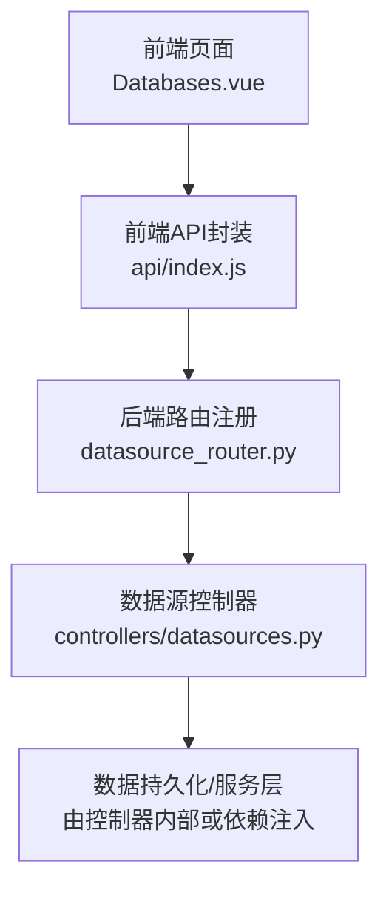
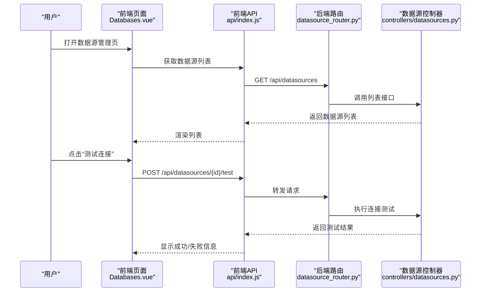
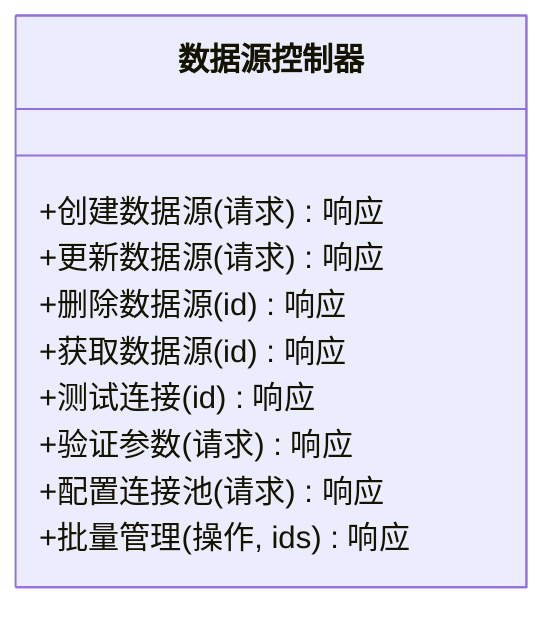
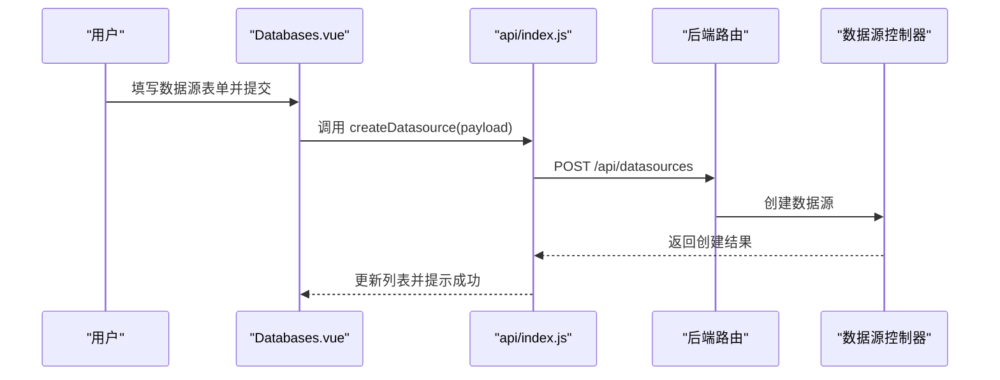
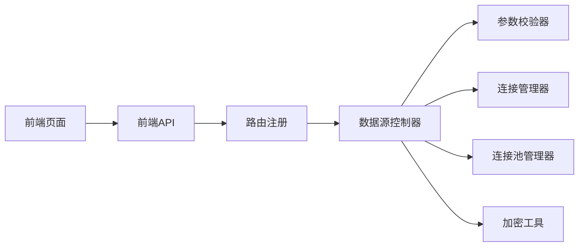

# 数据源配置接口

<cite>
**本文引用的文件**   
- [datasources.py](file://backend/controllers/datasources.py)
- [datasource_router.py](file://backend/datasource_router.py)
- [app.py](file://backend/app.py)
- [Databases.vue](file://frontend/src/views/Databases.vue)
- [index.js](file://frontend/src/api/index.js)
</cite>

## 目录
1. [简介](#简介)
2. [项目结构](#项目结构)
3. [核心组件](#核心组件)
4. [架构总览](#架构总览)
5. [详细组件分析](#详细组件分析)
6. [依赖分析](#依赖分析)
7. [性能考虑](#性能考虑)
8. [故障排查指南](#故障排查指南)
9. [结论](#结论)
10. [附录](#附录)

## 简介
本文件为 SmartAsk 平台“数据源配置”功能的 API 文档，聚焦于数据源连接管理、类型支持、安全配置、CRUD 操作、状态监控与性能优化建议。内容基于后端控制器、路由注册以及前端视图与 API 调用实现进行整理，帮助开发者快速集成与排障。

## 项目结构
与数据源配置相关的代码主要分布在以下位置：
- 后端控制器：负责 HTTP 请求处理、参数校验、业务编排与响应封装
- 后端路由：将 URL 路径映射到控制器方法
- 前端视图：提供数据源配置的 UI 与交互
- 前端 API：封装对后端的 REST 调用



**图表来源** 
- [Databases.vue](file://frontend/src/views/Databases.vue)
- [index.js](file://frontend/src/api/index.js)
- [datasource_router.py](file://backend/datasource_router.py)
- [datasources.py](file://backend/controllers/datasources.py)

**章节来源**
- [datasources.py](file://backend/controllers/datasources.py)
- [datasource_router.py](file://backend/datasource_router.py)
- [app.py](file://backend/app.py)
- [Databases.vue](file://frontend/src/views/Databases.vue)
- [index.js](file://frontend/src/api/index.js)

## 核心组件
- 数据源控制器：提供数据源的增删改查、连接测试、参数校验、批量管理等能力
- 路由注册：定义 RESTful 路径与方法绑定
- 前端页面：数据源列表、新增/编辑表单、连接测试、健康检查与资源统计展示
- 前端 API：统一封装请求、错误处理与响应解析

**章节来源**
- [datasources.py](file://backend/controllers/datasources.py)
- [datasource_router.py](file://backend/datasource_router.py)
- [Databases.vue](file://frontend/src/views/Databases.vue)
- [index.js](file://frontend/src/api/index.js)

## 架构总览
整体采用前后端分离的 REST 架构：前端通过 API 模块发起 HTTP 请求，后端路由将请求分发至数据源控制器，控制器完成参数校验、业务逻辑与结果返回。



**图表来源** 
- [Databases.vue](file://frontend/src/views/Databases.vue)
- [index.js](file://frontend/src/api/index.js)
- [datasource_router.py](file://backend/datasource_router.py)
- [datasources.py](file://backend/controllers/datasources.py)

## 详细组件分析

### 数据源控制器（后端）
- 职责
  - 接收并校验数据源创建、更新、删除等请求参数
  - 执行连接测试、参数验证、连接池配置校验
  - 返回统一的 JSON 响应格式
- 关键能力
  - 数据源 CRUD：创建、读取、更新、删除
  - 连接测试：验证数据库连通性与认证
  - 参数验证：字段完整性、类型与取值范围
  - 连接池配置：最大连接数、超时、重试策略等
  - 批量管理：批量启用/禁用、批量删除等
- 安全相关
  - 敏感字段加密存储（如密码、密钥）
  - SSL/TLS 连接开关与证书配置
  - 认证机制（用户名/密码、令牌等）



**图表来源** 
- [datasources.py](file://backend/controllers/datasources.py)

**章节来源**
- [datasources.py](file://backend/controllers/datasources.py)

### 路由注册（后端）
- 职责
  - 将 URL 路径与控制器方法绑定
  - 定义 HTTP 方法与访问权限
- 典型路径
  - 数据源列表：GET /api/datasources
  - 数据源详情：GET /api/datasources/{id}
  - 创建数据源：POST /api/datasources
  - 更新数据源：PUT /api/datasources/{id}
  - 删除数据源：DELETE /api/datasources/{id}
  - 测试连接：POST /api/datasources/{id}/test
  - 参数验证：POST /api/datasources/validate
  - 连接池配置：PUT /api/datasources/{id}/pool
  - 批量管理：POST /api/datasources/batch

```mermaid
flowchart TD
A["HTTP 请求进入"] --> B{"匹配路由"}
B --> |/api/datasources| C["控制器: 列表/创建"]
B --> |/api/datasources/{id}| D["控制器: 详情/更新/删除"]
B --> |/api/datasources/{id}/test| E["控制器: 测试连接"]
B --> |/api/datasources/validate| F["控制器: 参数验证"]
B --> |/api/datasources/{id}/pool| G["控制器: 连接池配置"]
B --> |/api/datasources/batch| H["控制器: 批量管理"]
```

**图表来源** 
- [datasource_router.py](file://backend/datasource_router.py)

**章节来源**
- [datasource_router.py](file://backend/datasource_router.py)

### 前端页面与 API（前端）
- 职责
  - 提供数据源管理的可视化界面
  - 封装对后端的 REST 调用，统一错误处理与提示
- 功能点
  - 数据源列表展示与搜索
  - 新增/编辑表单（含类型选择、连接参数、SSL、认证）
  - 连接测试与健康检查
  - 资源使用统计展示
  - 批量操作（启用/禁用、删除）



**图表来源** 
- [Databases.vue](file://frontend/src/views/Databases.vue)
- [index.js](file://frontend/src/api/index.js)
- [datasource_router.py](file://backend/datasource_router.py)
- [datasources.py](file://backend/controllers/datasources.py)

**章节来源**
- [Databases.vue](file://frontend/src/views/Databases.vue)
- [index.js](file://frontend/src/api/index.js)

## 依赖分析
- 控制器依赖
  - 参数校验器：用于字段完整性与类型校验
  - 连接管理器：负责建立数据库连接、SSL/TLS、认证
  - 连接池管理器：维护连接池大小、超时、重试策略
  - 加密工具：敏感字段加密存储
- 路由依赖
  - Flask/FastAPI 路由框架（根据实际框架）
- 前端依赖
  - Vue 组件与状态管理
  - Axios/Fetch 网络请求库



**图表来源** 
- [datasources.py](file://backend/controllers/datasources.py)
- [datasource_router.py](file://backend/datasource_router.py)
- [Databases.vue](file://frontend/src/views/Databases.vue)
- [index.js](file://frontend/src/api/index.js)

**章节来源**
- [datasources.py](file://backend/controllers/datasources.py)
- [datasource_router.py](file://backend/datasource_router.py)
- [Databases.vue](file://frontend/src/views/Databases.vue)
- [index.js](file://frontend/src/api/index.js)

## 性能考虑
- 连接池配置
  - 合理设置最大连接数与最小连接数，避免过多连接导致资源耗尽
  - 调整连接超时与查询超时，防止长事务阻塞
  - 启用连接复用与空闲回收策略
- 参数校验与缓存
  - 对频繁使用的连接参数进行本地缓存，减少重复校验
  - 对连接测试结果做短期缓存，降低测试频率
- 批量操作
  - 使用批量接口减少网络往返与服务器负载
  - 对大批量任务进行分片与异步处理
- 监控与告警
  - 暴露连接池使用率、活跃连接数、等待队列长度等指标
  - 对连接失败率与延迟进行阈值告警

[本节为通用指导，不直接分析具体文件]

## 故障排查指南
- 连接失败
  - 检查网络可达性、端口与防火墙规则
  - 确认用户名、密码、数据库名与主机地址正确
  - 查看 SSL/TLS 证书是否有效且受信任
- 参数校验失败
  - 核对必填字段与数据类型
  - 检查取值范围与格式（如端口号、超时时间）
- 连接池问题
  - 观察连接池是否耗尽，是否存在泄漏
  - 调整超时与最大连接数，避免死锁
- 认证失败
  - 确认认证方式（用户名/密码、令牌）与权限
  - 检查数据库用户权限与角色
- 前端报错
  - 查看浏览器控制台与网络面板的错误信息
  - 确认 API 路径与请求体格式正确

**章节来源**
- [datasources.py](file://backend/controllers/datasources.py)
- [Databases.vue](file://frontend/src/views/Databases.vue)
- [index.js](file://frontend/src/api/index.js)

## 结论
SmartAsk 的数据源配置功能提供了完整的数据源管理与连接管理能力，涵盖多种数据库类型、安全配置、CRUD 操作与状态监控。通过合理的连接池配置与监控告警，可显著提升系统的稳定性与性能。建议在部署前充分进行参数调优与故障演练，确保生产环境的可靠性。

[本节为总结，不直接分析具体文件]

## 附录

### 数据源类型支持
- MySQL
  - 连接参数：主机、端口、数据库名、用户名、密码、SSL
  - 连接池：最大连接数、超时、重试
- PostgreSQL
  - 连接参数：主机、端口、数据库名、用户名、密码、SSL
  - 连接池：最大连接数、超时、重试
- Oracle
  - 连接参数：主机、端口、服务名/SID、用户名、密码、SSL
  - 连接池：最大连接数、超时、重试
- 其他类型（按需扩展）
  - SQL Server、SQLite、ClickHouse 等

[本节为通用说明，不直接分析具体文件]

### 安全配置
- 加密存储
  - 敏感字段（密码、密钥）在持久化前进行加密
  - 密钥管理建议使用外部密钥管理服务
- SSL/TLS
  - 启用 SSL 连接，配置证书与信任链
  - 强制使用 TLS 高版本，禁用不安全协议
- 认证机制
  - 支持用户名/密码、令牌等多种认证方式
  - 限制弱口令与频繁登录尝试

[本节为通用说明，不直接分析具体文件]

### CRUD 操作示例（描述性）
- 创建数据源
  - 方法：POST
  - 路径：/api/datasources
  - 请求体：包含类型、连接参数、SSL、认证等信息
  - 响应：创建结果与数据源 ID
- 更新数据源
  - 方法：PUT
  - 路径：/api/datasources/{id}
  - 请求体：需要更新的字段
  - 响应：更新结果
- 删除数据源
  - 方法：DELETE
  - 路径：/api/datasources/{id}
  - 响应：删除结果
- 批量管理
  - 方法：POST
  - 路径：/api/datasources/batch
  - 请求体：操作类型与目标 ID 列表
  - 响应：批量操作结果

[本节为通用说明，不直接分析具体文件]

### 状态监控接口（描述性）
- 连接健康检查
  - 方法：POST
  - 路径：/api/datasources/{id}/test
  - 响应：健康状态与诊断信息
- 资源使用统计
  - 方法：GET
  - 路径：/api/datasources/{id}/stats
  - 响应：连接池使用率、活跃连接数、等待队列长度等

[本节为通用说明，不直接分析具体文件]