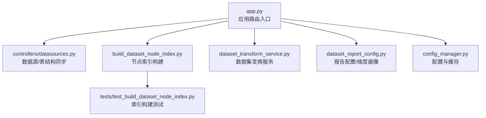
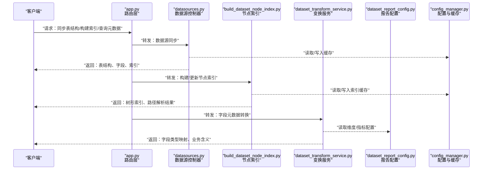
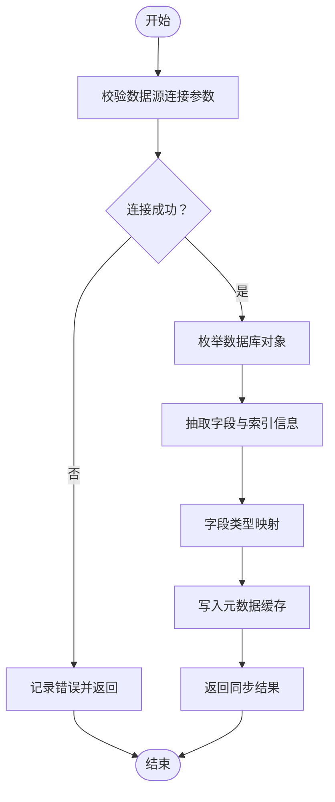
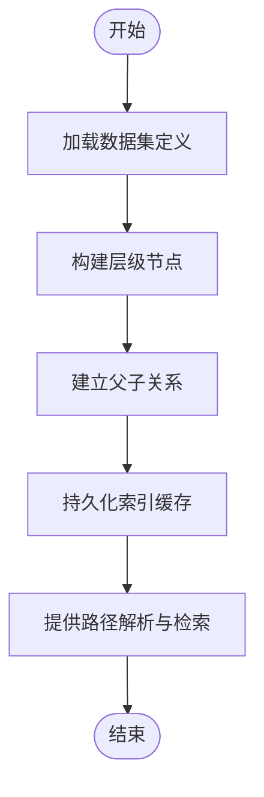
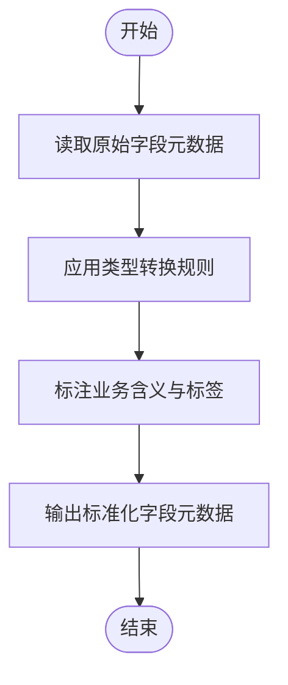
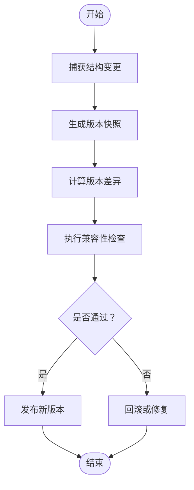
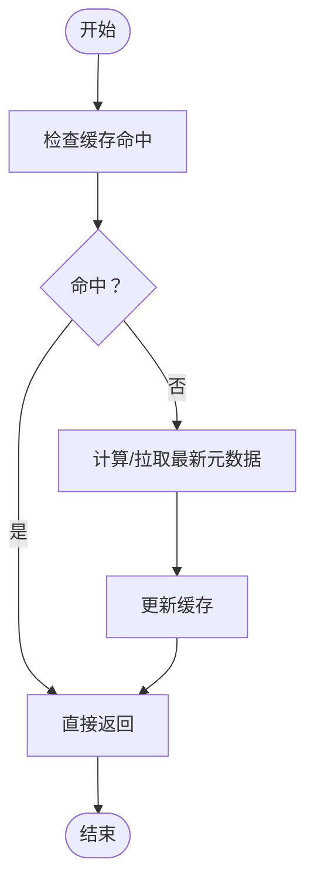
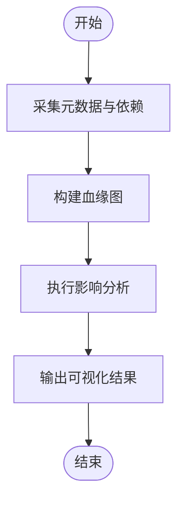
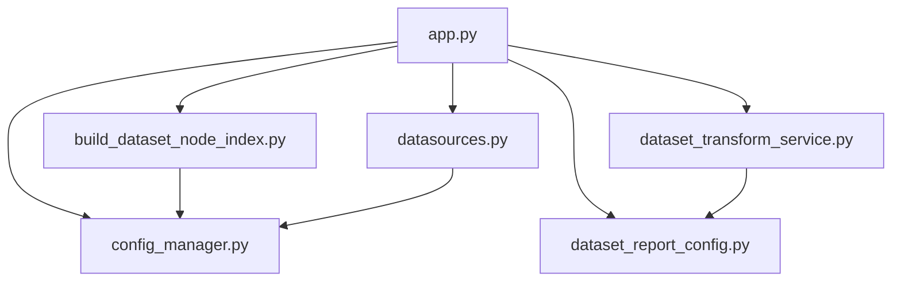

# 数据集元数据接口

<cite>
**本文引用的文件**   
- [build_dataset_node_index.py](file://backend/build_dataset_node_index.py)
- [dataset_transform_service.py](file://backend/dataset_transform_service.py)
- [datasources.py](file://backend/controllers/datasources.py)
- [dataset_report_config.py](file://backend/dataset_report_config.py)
- [config_manager.py](file://backend/config_manager.py)
- [app.py](file://backend/app.py)
- [test_build_dataset_node_index.py](file://backend/tests/test_build_dataset_node_index.py)
</cite>

## 目录
1. [简介](#简介)
2. [项目结构](#项目结构)
3. [核心组件](#核心组件)
4. [架构总览](#架构总览)
5. [详细组件分析](#详细组件分析)
6. [依赖关系分析](#依赖关系分析)
7. [性能考虑](#性能考虑)
8. [故障排查指南](#故障排查指南)
9. [结论](#结论)
10. [附录](#附录)

## 简介
本文件为 SmartAsk 平台“数据集元数据管理”的 API 文档，覆盖以下能力：
- 表结构同步接口：自动发现表结构、字段类型映射与索引信息获取
- 数据集节点索引管理：树形结构构建、路径解析与快速检索
- 字段级元数据管理：字段描述、数据类型转换与业务含义标注
- 数据集版本管理：结构变更追踪与兼容性检查
- 元数据缓存策略与性能优化
- 数据血缘分析：依赖关系追踪与影响分析

## 项目结构
围绕数据集元数据管理的后端实现主要位于 backend 目录，关键文件包括：
- 数据源与表结构同步：controllers/datasources.py
- 数据集节点索引构建：build_dataset_node_index.py
- 数据集变换与服务编排：dataset_transform_service.py
- 报告配置与维度画像：dataset_report_config.py
- 配置管理与缓存：config_manager.py
- 应用路由入口：app.py
- 单元测试用例：tests/test_build_dataset_node_index.py

图表来源
- [app.py](file://backend/app.py)
- [datasources.py](file://backend/controllers/datasources.py)
- [build_dataset_node_index.py](file://backend/build_dataset_node_index.py)
- [dataset_transform_service.py](file://backend/dataset_transform_service.py)
- [dataset_report_config.py](file://backend/dataset_report_config.py)
- [config_manager.py](file://backend/config_manager.py)
- [test_build_dataset_node_index.py](file://backend/tests/test_build_dataset_node_index.py)

章节来源
- [app.py](file://backend/app.py)
- [datasources.py](file://backend/controllers/datasources.py)
- [build_dataset_node_index.py](file://backend/build_dataset_node_index.py)
- [dataset_transform_service.py](file://backend/dataset_transform_service.py)
- [dataset_report_config.py](file://backend/dataset_report_config.py)
- [config_manager.py](file://backend/config_manager.py)
- [test_build_dataset_node_index.py](file://backend/tests/test_build_dataset_node_index.py)

## 核心组件
- 数据源与表结构同步（datasources.py）
  - 负责连接数据源、扫描表、抽取字段与索引信息，并输出标准化元数据
- 数据集节点索引（build_dataset_node_index.py）
  - 基于数据集定义构建层级索引，支持路径解析与快速检索
- 数据集变换服务（dataset_transform_service.py）
  - 提供字段级元数据转换、类型映射与业务含义标注
- 报告配置与维度画像（dataset_report_config.py）
  - 维护维度/指标配置，辅助生成报表与查询计划
- 配置与缓存（config_manager.py）
  - 集中管理配置项与缓存策略，提升元数据访问性能
- 应用路由（app.py）
  - 统一暴露 REST 接口，串联上述组件

章节来源
- [datasources.py](file://backend/controllers/datasources.py)
- [build_dataset_node_index.py](file://backend/build_dataset_node_index.py)
- [dataset_transform_service.py](file://backend/dataset_transform_service.py)
- [dataset_report_config.py](file://backend/dataset_report_config.py)
- [config_manager.py](file://backend/config_manager.py)
- [app.py](file://backend/app.py)

## 架构总览
下图展示从客户端请求到元数据服务的调用链路，以及各组件之间的交互。

图表来源
- [app.py](file://backend/app.py)
- [datasources.py](file://backend/controllers/datasources.py)
- [build_dataset_node_index.py](file://backend/build_dataset_node_index.py)
- [dataset_transform_service.py](file://backend/dataset_transform_service.py)
- [dataset_report_config.py](file://backend/dataset_report_config.py)
- [config_manager.py](file://backend/config_manager.py)

## 详细组件分析

### 表结构同步接口（自动发现、字段类型映射、索引信息）
- 功能要点
  - 自动发现：根据数据源类型与连接参数，枚举数据库对象（库、表、视图等）
  - 字段类型映射：将底层数据类型映射为平台标准类型，便于后续处理
  - 索引信息获取：提取主键、唯一键、普通索引及复合索引
- 典型流程
  - 接收同步请求 -> 校验数据源连接 -> 枚举对象 -> 抽取字段与索引 -> 类型映射 -> 写入缓存 -> 返回结果
- 错误处理
  - 连接失败、权限不足、对象过大时的降级与重试策略
  - 部分失败时返回增量结果与错误明细

图表来源
- [datasources.py](file://backend/controllers/datasources.py)
- [config_manager.py](file://backend/config_manager.py)

章节来源
- [datasources.py](file://backend/controllers/datasources.py)
- [config_manager.py](file://backend/config_manager.py)

### 数据集节点索引管理（树形结构、路径解析、快速检索）
- 功能要点
  - 树形构建：按数据集/主题域/表/字段层级组织索引
  - 路径解析：支持多级路径匹配与别名解析
  - 快速检索：基于索引前缀与标签进行高效查找
- 典型流程
  - 触发构建 -> 读取数据集定义 -> 生成节点 -> 建立父子关系 -> 写入索引缓存 -> 提供查询接口
- 性能优化
  - 增量构建与懒加载
  - 前缀树或倒排索引加速检索

图表来源
- [build_dataset_node_index.py](file://backend/build_dataset_node_index.py)
- [config_manager.py](file://backend/config_manager.py)
- [test_build_dataset_node_index.py](file://backend/tests/test_build_dataset_node_index.py)

章节来源
- [build_dataset_node_index.py](file://backend/build_dataset_node_index.py)
- [config_manager.py](file://backend/config_manager.py)
- [test_build_dataset_node_index.py](file://backend/tests/test_build_dataset_node_index.py)

### 字段级元数据管理（描述、类型转换、业务含义）
- 功能要点
  - 字段描述：补充字段注释、示例值、敏感级别
  - 类型转换：跨数据源类型归一化与精度处理
  - 业务含义：通过维度/指标配置标注语义，支撑智能问数
- 典型流程
  - 输入原始字段元数据 -> 应用转换规则 -> 关联业务标签 -> 输出标准化字段元数据
- 配置驱动
  - 使用 dataset_report_config.py 中的维度/指标配置驱动转换与标注

图表来源
- [dataset_transform_service.py](file://backend/dataset_transform_service.py)
- [dataset_report_config.py](file://backend/dataset_report_config.py)

章节来源
- [dataset_transform_service.py](file://backend/dataset_transform_service.py)
- [dataset_report_config.py](file://backend/dataset_report_config.py)

### 数据集版本管理（结构变更追踪、兼容性检查）
- 功能要点
  - 版本快照：对表结构、字段元数据、索引信息进行版本化存储
  - 变更追踪：对比不同版本的差异，生成变更日志
  - 兼容性检查：评估上游依赖与下游查询的兼容风险
- 典型流程
  - 捕获变更 -> 生成新版本 -> 计算差异 -> 执行兼容性检查 -> 发布或回滚

图表来源
- [dataset_transform_service.py](file://backend/dataset_transform_service.py)
- [dataset_report_config.py](file://backend/dataset_report_config.py)
- [config_manager.py](file://backend/config_manager.py)

章节来源
- [dataset_transform_service.py](file://backend/dataset_transform_service.py)
- [dataset_report_config.py](file://backend/dataset_report_config.py)
- [config_manager.py](file://backend/config_manager.py)

### 元数据缓存策略与性能优化
- 缓存策略
  - 分层缓存：内存缓存 + 持久化缓存（如 Redis/本地文件）
  - 失效策略：TTL、按版本失效、按数据源失效
  - 预取与预热：在高峰前预构建索引与元数据
- 性能优化
  - 增量同步与懒加载
  - 批量操作与并发控制
  - 查询路径剪枝与结果裁剪

图表来源
- [config_manager.py](file://backend/config_manager.py)

章节来源
- [config_manager.py](file://backend/config_manager.py)

### 数据血缘分析（依赖追踪、影响分析）
- 功能要点
  - 依赖追踪：记录数据集/表/字段间的上下游关系
  - 影响分析：当某字段或表结构变更时，评估受影响范围
  - 可视化：以图形式展示血缘拓扑
- 典型流程
  - 采集元数据 -> 构建依赖边 -> 生成血缘图 -> 支持影响面查询

图表来源
- [dataset_transform_service.py](file://backend/dataset_transform_service.py)
- [dataset_report_config.py](file://backend/dataset_report_config.py)

章节来源
- [dataset_transform_service.py](file://backend/dataset_transform_service.py)
- [dataset_report_config.py](file://backend/dataset_report_config.py)

## 依赖关系分析
- 组件耦合
  - app.py 作为路由层，低耦合地调度 datasources、index、transform、report、cache
  - config_manager 被多个组件共享，承担配置与缓存职责
- 外部依赖
  - 数据源连接器（SQL/NoSQL/API）
  - 缓存系统（Redis/本地）
  - 配置中心（可选）

图表来源
- [app.py](file://backend/app.py)
- [datasources.py](file://backend/controllers/datasources.py)
- [build_dataset_node_index.py](file://backend/build_dataset_node_index.py)
- [dataset_transform_service.py](file://backend/dataset_transform_service.py)
- [dataset_report_config.py](file://backend/dataset_report_config.py)
- [config_manager.py](file://backend/config_manager.py)

章节来源
- [app.py](file://backend/app.py)
- [datasources.py](file://backend/controllers/datasources.py)
- [build_dataset_node_index.py](file://backend/build_dataset_node_index.py)
- [dataset_transform_service.py](file://backend/dataset_transform_service.py)
- [dataset_report_config.py](file://backend/dataset_report_config.py)
- [config_manager.py](file://backend/config_manager.py)

## 性能考虑
- 缓存命中率优先：热点元数据常驻内存，冷数据落盘
- 增量构建：仅重建变更节点，避免全量刷新
- 并发控制：限制并发同步与构建任务，防止资源争用
- 查询优化：路径前缀匹配、结果裁剪、分页与懒加载
- 监控与告警：记录慢查询与缓存失效事件，及时扩容

## 故障排查指南
- 常见问题
  - 数据源连接失败：检查连接参数、网络与权限
  - 索引构建缓慢：确认数据量与并发设置，启用增量构建
  - 缓存不一致：清理过期缓存，重新预热
  - 类型映射异常：核对映射规则与目标类型精度
- 定位方法
  - 查看日志与错误码
  - 使用测试用例验证索引构建与路径解析
  - 通过配置中心检查缓存策略与 TTL

章节来源
- [test_build_dataset_node_index.py](file://backend/tests/test_build_dataset_node_index.py)
- [config_manager.py](file://backend/config_manager.py)

## 结论
本 API 文档围绕 SmartAsk 的数据集元数据管理，系统化梳理了表结构同步、节点索引、字段元数据、版本管理、缓存优化与血缘分析等核心能力。通过分层架构与配置驱动，平台可实现高可用、高性能与可扩展的元数据服务，支撑智能问数与数据分析场景。

## 附录
- 术语
  - 数据集：一组相关表的逻辑集合，用于业务分析与报表
  - 节点索引：按层级组织的元数据索引，支持路径解析与检索
  - 血缘：数据集/表/字段间的依赖关系图谱
- 参考
  - 单元测试：tests/test_build_dataset_node_index.py
  - 配置与缓存：config_manager.py
  - 数据源同步：controllers/datasources.py
  - 变换与报告：dataset_transform_service.py、dataset_report_config.py