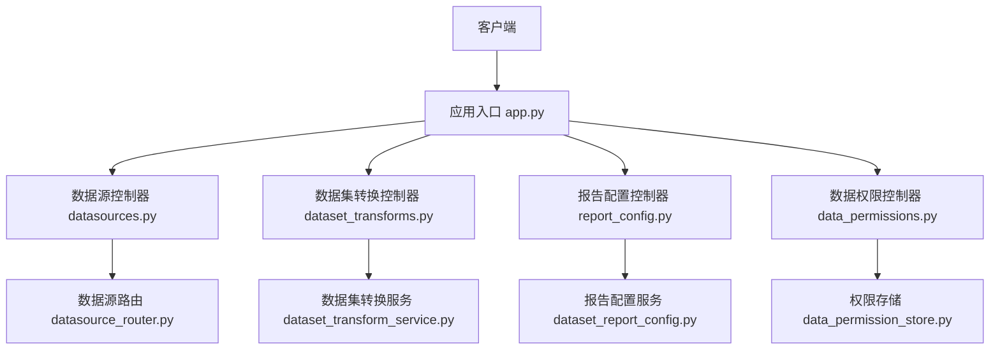
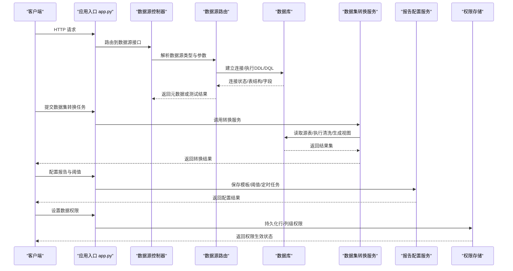
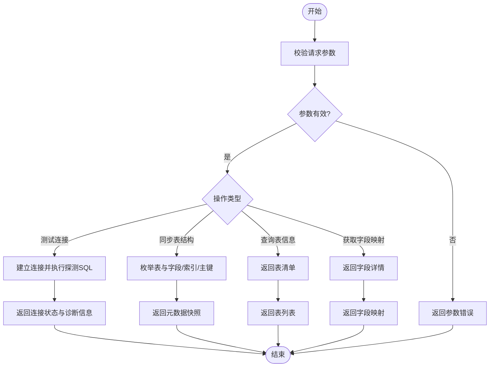
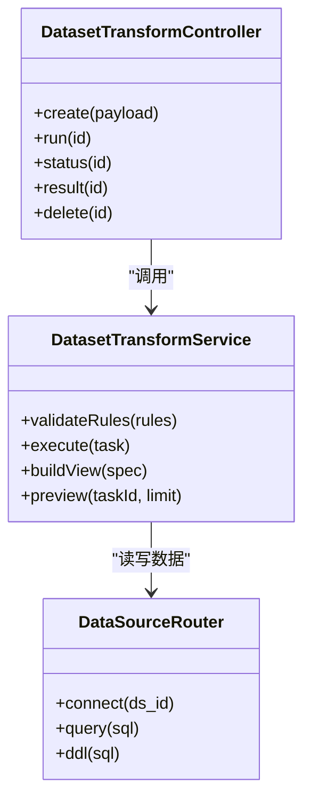
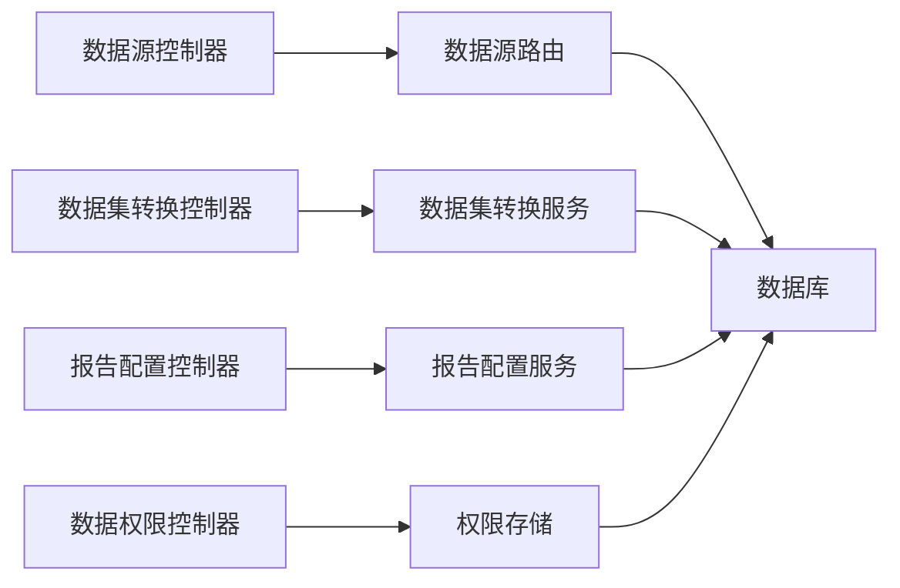

# 数据集管理接口

<cite>
**本文档引用的文件**   
- [datasources.py](file://backend/controllers/datasources.py)
- [dataset_transforms.py](file://backend/controllers/dataset_transforms.py)
- [report_config.py](file://backend/controllers/report_config.py)
- [data_permissions.py](file://backend/controllers/data_permissions.py)
- [app.py](file://backend/app.py)
- [datasource_router.py](file://backend/datasource_router.py)
- [dataset_report_config.py](file://backend/dataset_report_config.py)
- [dataset_transform_service.py](file://backend/dataset_transform_service.py)
- [data_permission_store.py](file://backend/data_permission_store.py)
- [migrations/20260509_report_thresholds.sql](file://backend/migrations/20260509_report_thresholds.sql)
- [migrations/20260630_dataset_transforms.sql](file://backend/migrations/20260630_dataset_transforms.sql)
</cite>

## 目录
1. [简介](#简介)
2. [项目结构](#项目结构)
3. [核心组件](#核心组件)
4. [架构总览](#架构总览)
5. [详细组件分析](#详细组件分析)
6. [依赖关系分析](#依赖关系分析)
7. [性能考虑](#性能考虑)
8. [故障排查指南](#故障排查指南)
9. [结论](#结论)
10. [附录](#附录)

## 简介
本文件为 SmartAsk 平台“数据集管理”能力的 API 文档，覆盖以下能力：
- 数据源配置：数据库连接、表结构同步、数据源测试
- 数据集元数据管理：表信息获取、字段映射、索引管理
- 数据集转换：数据清洗、字段计算、视图创建
- 报告配置：报表模板管理、阈值设置、定时任务配置
- CRUD 操作示例：增删改查与批量操作
- 数据权限控制：行级权限与列级权限配置
- 错误处理与异常方案

## 项目结构
后端以控制器（controllers）为核心暴露 REST 接口，配合服务层与存储层实现业务逻辑。与数据集管理相关的关键文件如下：
- 控制器层：数据源、数据集转换、报告配置、数据权限
- 路由与装配：应用入口与数据源路由分发
- 服务与存储：数据集转换服务、报告配置服务、权限存储
- 迁移脚本：报告阈值、数据集转换等数据库变更

图表来源
- [app.py](file://backend/app.py)
- [datasources.py](file://backend/controllers/datasources.py)
- [dataset_transforms.py](file://backend/controllers/dataset_transforms.py)
- [report_config.py](file://backend/controllers/report_config.py)
- [data_permissions.py](file://backend/controllers/data_permissions.py)
- [datasource_router.py](file://backend/datasource_router.py)
- [dataset_transform_service.py](file://backend/dataset_transform_service.py)
- [dataset_report_config.py](file://backend/dataset_report_config.py)
- [data_permission_store.py](file://backend/data_permission_store.py)

章节来源
- [app.py](file://backend/app.py)
- [datasources.py](file://backend/controllers/datasources.py)
- [dataset_transforms.py](file://backend/controllers/dataset_transforms.py)
- [report_config.py](file://backend/controllers/report_config.py)
- [data_permissions.py](file://backend/controllers/data_permissions.py)
- [datasource_router.py](file://backend/datasource_router.py)
- [dataset_transform_service.py](file://backend/dataset_transform_service.py)
- [dataset_report_config.py](file://backend/dataset_report_config.py)
- [data_permission_store.py](file://backend/data_permission_store.py)

## 核心组件
- 数据源配置接口
  - 功能：新增/更新/删除/查询数据源；测试连接；同步表结构；列出可用表与字段
  - 关键路径：数据源控制器与数据源路由
- 数据集元数据管理接口
  - 功能：获取表信息、字段映射、索引信息；维护元数据缓存
  - 关键路径：数据源控制器与数据源路由
- 数据集转换接口
  - 功能：定义清洗规则、字段计算、生成视图；执行转换并返回结果
  - 关键路径：数据集转换控制器与服务
- 报告配置接口
  - 功能：报表模板管理、阈值设置、定时任务配置
  - 关键路径：报告配置控制器与服务
- 数据权限控制接口
  - 功能：行级/列级权限配置与校验
  - 关键路径：数据权限控制器与权限存储

章节来源
- [datasources.py](file://backend/controllers/datasources.py)
- [dataset_transforms.py](file://backend/controllers/dataset_transforms.py)
- [report_config.py](file://backend/controllers/report_config.py)
- [data_permissions.py](file://backend/controllers/data_permissions.py)
- [datasource_router.py](file://backend/datasource_router.py)
- [dataset_transform_service.py](file://backend/dataset_transform_service.py)
- [dataset_report_config.py](file://backend/dataset_report_config.py)
- [data_permission_store.py](file://backend/data_permission_store.py)

## 架构总览
下图展示从请求到处理的整体流程，以及各模块间的职责边界。

图表来源
- [app.py](file://backend/app.py)
- [datasources.py](file://backend/controllers/datasources.py)
- [datasource_router.py](file://backend/datasource_router.py)
- [dataset_transform_service.py](file://backend/dataset_transform_service.py)
- [dataset_report_config.py](file://backend/dataset_report_config.py)
- [data_permission_store.py](file://backend/data_permission_store.py)

## 详细组件分析

### 数据源配置接口
- 能力范围
  - 数据源 CRUD：新增、更新、删除、查询
  - 连接测试：验证连通性、认证、网络可达
  - 表结构同步：拉取表列表、字段类型、主键、索引
  - 元数据查询：按数据源获取表信息与字段映射
- 典型请求
  - 新增数据源：POST /api/datasources
  - 更新数据源：PUT /api/datasources/{id}
  - 删除数据源：DELETE /api/datasources/{id}
  - 查询数据源：GET /api/datasources
  - 测试连接：POST /api/datasources/{id}/test
  - 同步表结构：POST /api/datasources/{id}/sync
  - 获取表信息：GET /api/datasources/{id}/tables
  - 获取字段映射：GET /api/datasources/{id}/tables/{table}/columns
- 响应要点
  - 连接测试返回连通性与错误原因
  - 同步返回表清单与字段元数据
  - 表信息包含名称、引擎、行数估算、主键
  - 字段映射包含名称、类型、是否可空、默认值、注释

图表来源
- [datasources.py](file://backend/controllers/datasources.py)
- [datasource_router.py](file://backend/datasource_router.py)

章节来源
- [datasources.py](file://backend/controllers/datasources.py)
- [datasource_router.py](file://backend/datasource_router.py)

### 数据集元数据管理接口
- 能力范围
  - 表信息获取：表名、引擎、行数、主键、外键
  - 字段映射：字段名、类型、长度、精度、可空、默认值、注释
  - 索引管理：唯一索引、普通索引、复合索引
- 典型请求
  - 获取表信息：GET /api/datasets/{ds_id}/tables
  - 获取字段映射：GET /api/datasets/{ds_id}/tables/{table}/columns
  - 获取索引信息：GET /api/datasets/{ds_id}/tables/{table}/indexes
- 行为说明
  - 支持增量同步与全量刷新
  - 对大表进行采样统计，避免阻塞
  - 字段映射可缓存以提升查询性能

章节来源
- [datasources.py](file://backend/controllers/datasources.py)
- [datasource_router.py](file://backend/datasource_router.py)

### 数据集转换接口
- 能力范围
  - 数据清洗：去重、空值填充、类型转换、正则过滤
  - 字段计算：表达式计算、聚合衍生、时间窗口
  - 视图创建：基于源表生成物化视图或临时视图
- 典型请求
  - 创建转换任务：POST /api/dataset-transforms
  - 执行转换：POST /api/dataset-transforms/{id}/run
  - 查询任务状态：GET /api/dataset-transforms/{id}
  - 查看结果：GET /api/dataset-transforms/{id}/result
  - 删除任务：DELETE /api/dataset-transforms/{id}
- 数据结构
  - 输入：源表、清洗规则、计算表达式、目标视图名
  - 输出：任务ID、状态、进度、错误信息、结果预览

图表来源
- [dataset_transforms.py](file://backend/controllers/dataset_transforms.py)
- [dataset_transform_service.py](file://backend/dataset_transform_service.py)
- [datasource_router.py](file://backend/datasource_router.py)

章节来源
- [dataset_transforms.py](file://backend/controllers/dataset_transforms.py)
- [dataset_transform_service.py](file://backend/dataset_transform_service.py)
- [datasource_router.py](file://backend/datasource_router.py)

### 报告配置接口
- 能力范围
  - 报表模板管理：模板CRUD、版本管理、发布
  - 阈值设置：指标阈值、告警规则、通知渠道
  - 定时任务：调度周期、触发条件、失败重试
- 典型请求
  - 模板CRUD：POST/PUT/DELETE/GET /api/report-templates
  - 阈值管理：POST/PUT/DELETE/GET /api/report-thresholds
  - 定时任务：POST/PUT/DELETE/GET /api/report-schedules
- 数据模型
  - 模板：名称、描述、SQL/DSL、渲染格式、版本
  - 阈值：指标、比较符、阈值、级别、通知策略
  - 定时任务：cron 表达式、时区、依赖、重试策略

章节来源
- [report_config.py](file://backend/controllers/report_config.py)
- [dataset_report_config.py](file://backend/dataset_report_config.py)
- [migrations/20260509_report_thresholds.sql](file://backend/migrations/20260509_report_thresholds.sql)

### 数据权限控制接口
- 能力范围
  - 行级权限：按组织/角色/用户过滤行
  - 列级权限：隐藏敏感字段、脱敏策略
  - 权限继承与优先级：组织 > 角色 > 用户
- 典型请求
  - 行级权限：POST/PUT/DELETE/GET /api/data-permissions/row
  - 列级权限：POST/PUT/DELETE/GET /api/data-permissions/column
  - 权限校验：POST /api/data-permissions/evaluate
- 行为说明
  - 权限规则在查询前注入 WHERE 与 SELECT 投影
  - 支持动态上下文（当前用户、组织、租户）

章节来源
- [data_permissions.py](file://backend/controllers/data_permissions.py)
- [data_permission_store.py](file://backend/data_permission_store.py)

### CRUD 操作示例
以下为常见操作的请求与响应要点（以路径与字段为例，不展示具体代码）：
- 数据源
  - 新增：POST /api/datasources，主体包含类型、连接串、认证信息
  - 更新：PUT /api/datasources/{id}，仅更新变更字段
  - 删除：DELETE /api/datasources/{id}，需确认无依赖
  - 查询：GET /api/datasources，支持分页与筛选
  - 批量：POST /api/datasources/batch，传入数组批量创建/更新
- 数据集转换
  - 创建：POST /api/dataset-transforms，主体包含规则与目标
  - 执行：POST /api/dataset-transforms/{id}/run
  - 查询：GET /api/dataset-transforms/{id}
  - 删除：DELETE /api/dataset-transforms/{id}
  - 批量：POST /api/dataset-transforms/batch-run，批量执行
- 报告配置
  - 模板：POST/PUT/DELETE/GET /api/report-templates
  - 阈值：POST/PUT/DELETE/GET /api/report-thresholds
  - 定时任务：POST/PUT/DELETE/GET /api/report-schedules
  - 批量：POST /api/report-configs/batch，批量导入导出
- 数据权限
  - 行级：POST/PUT/DELETE/GET /api/data-permissions/row
  - 列级：POST/PUT/DELETE/GET /api/data-permissions/column
  - 批量：POST /api/data-permissions/batch，批量下发

章节来源
- [datasources.py](file://backend/controllers/datasources.py)
- [dataset_transforms.py](file://backend/controllers/dataset_transforms.py)
- [report_config.py](file://backend/controllers/report_config.py)
- [data_permissions.py](file://backend/controllers/data_permissions.py)

### 错误处理与异常情况
- 通用错误码
  - 400 参数错误：缺失必填字段、类型不匹配、格式非法
  - 401 未授权：缺少认证或令牌无效
  - 403 禁止访问：权限不足或资源不可见
  - 404 资源不存在：ID 错误或已被删除
  - 409 冲突：重复创建或并发修改冲突
  - 500 内部错误：服务端异常或未知错误
- 数据源错误
  - 连接失败：网络不可达、认证失败、SSL 证书问题
  - 元数据同步失败：权限不足、对象不存在、方言不兼容
- 转换错误
  - 规则校验失败：表达式语法错误、字段不存在
  - 执行失败：超时、内存不足、目标表被锁
- 报告配置错误
  - 模板引用缺失：SQL/DSL 无法解析
  - 阈值冲突：重复定义或越界
  - 定时任务冲突：cron 表达式非法或与其他任务冲突
- 权限错误
  - 规则冲突：行列级权限不一致
  - 评估失败：上下文缺失或策略未加载

章节来源
- [datasources.py](file://backend/controllers/datasources.py)
- [dataset_transforms.py](file://backend/controllers/dataset_transforms.py)
- [report_config.py](file://backend/controllers/report_config.py)
- [data_permissions.py](file://backend/controllers/data_permissions.py)

## 依赖关系分析
- 控制器依赖服务与存储
  - 数据源控制器依赖数据源路由进行连接与元数据操作
  - 数据集转换控制器依赖转换服务进行规则校验与执行
  - 报告配置控制器依赖报告配置服务进行模板与阈值管理
  - 数据权限控制器依赖权限存储进行规则持久化与评估
- 外部依赖
  - 数据库驱动与方言适配
  - 调度器（用于定时任务）
  - 消息队列（可选，用于异步任务）

图表来源
- [datasources.py](file://backend/controllers/datasources.py)
- [dataset_transforms.py](file://backend/controllers/dataset_transforms.py)
- [report_config.py](file://backend/controllers/report_config.py)
- [data_permissions.py](file://backend/controllers/data_permissions.py)
- [datasource_router.py](file://backend/datasource_router.py)
- [dataset_transform_service.py](file://backend/dataset_transform_service.py)
- [dataset_report_config.py](file://backend/dataset_report_config.py)
- [data_permission_store.py](file://backend/data_permission_store.py)

章节来源
- [datasources.py](file://backend/controllers/datasources.py)
- [dataset_transforms.py](file://backend/controllers/dataset_transforms.py)
- [report_config.py](file://backend/controllers/report_config.py)
- [data_permissions.py](file://backend/controllers/data_permissions.py)
- [datasource_router.py](file://backend/datasource_router.py)
- [dataset_transform_service.py](file://backend/dataset_transform_service.py)
- [dataset_report_config.py](file://backend/dataset_report_config.py)
- [data_permission_store.py](file://backend/data_permission_store.py)

## 性能考虑
- 元数据同步
  - 大表采样统计，避免全表扫描
  - 增量同步与缓存失效策略
- 转换执行
  - 分页与限制返回行数，防止内存溢出
  - 异步执行与任务队列，提升吞吐
- 报告配置
  - 模板预编译与缓存
  - 阈值评估批量化与延迟计算
- 权限评估
  - 规则合并与短路求值
  - 上下文缓存减少重复计算

[本节为通用指导，无需特定文件来源]

## 故障排查指南
- 数据源连接失败
  - 检查网络连通性与防火墙策略
  - 核对认证信息与证书配置
  - 查看日志中的错误码与堆栈
- 元数据不同步
  - 确认用户具备系统元数据读取权限
  - 检查方言与版本兼容性
- 转换任务失败
  - 校验清洗规则与表达式语法
  - 查看目标表锁与资源占用
  - 调整超时与内存参数
- 报告配置异常
  - 验证模板 SQL/DSL 可解析
  - 检查阈值与定时任务冲突
- 权限评估异常
  - 检查规则优先级与上下文完整性
  - 确认权限策略已加载与生效

章节来源
- [datasources.py](file://backend/controllers/datasources.py)
- [dataset_transforms.py](file://backend/controllers/dataset_transforms.py)
- [report_config.py](file://backend/controllers/report_config.py)
- [data_permissions.py](file://backend/controllers/data_permissions.py)

## 结论
SmartAsk 的数据集管理通过清晰的控制器-服务-存储分层，提供完整的数据源配置、元数据管理、转换能力、报告配置与权限控制。建议在生产环境启用异步任务、缓存与监控，确保稳定性与性能。

[本节为总结，无需特定文件来源]

## 附录
- 相关迁移脚本
  - 报告阈值：backend/migrations/20260509_report_thresholds.sql
  - 数据集转换：backend/migrations/20260630_dataset_transforms.sql

章节来源
- [migrations/20260509_report_thresholds.sql](file://backend/migrations/20260509_report_thresholds.sql)
- [migrations/20260630_dataset_transforms.sql](file://backend/migrations/20260630_dataset_transforms.sql)