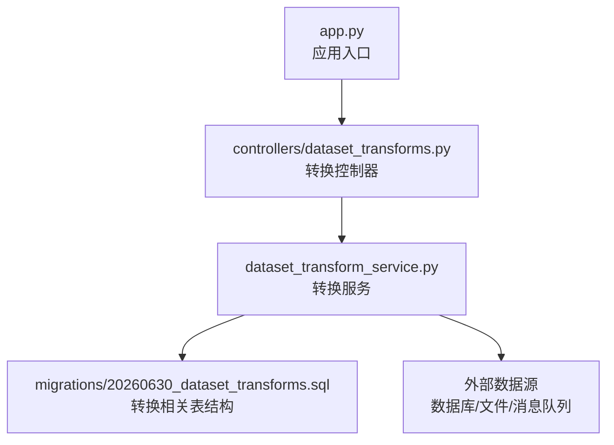
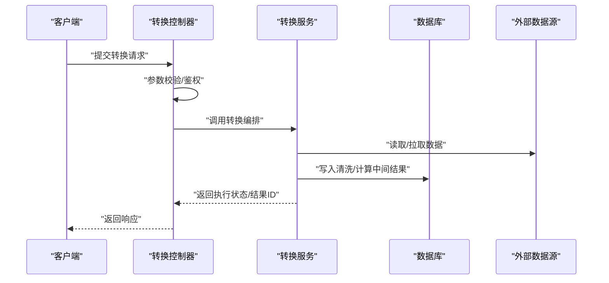
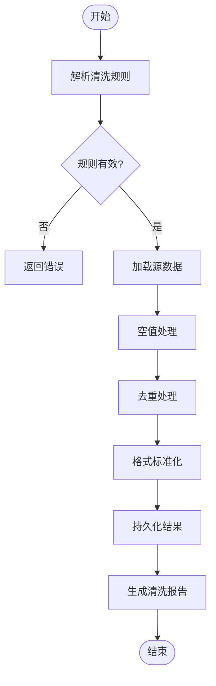
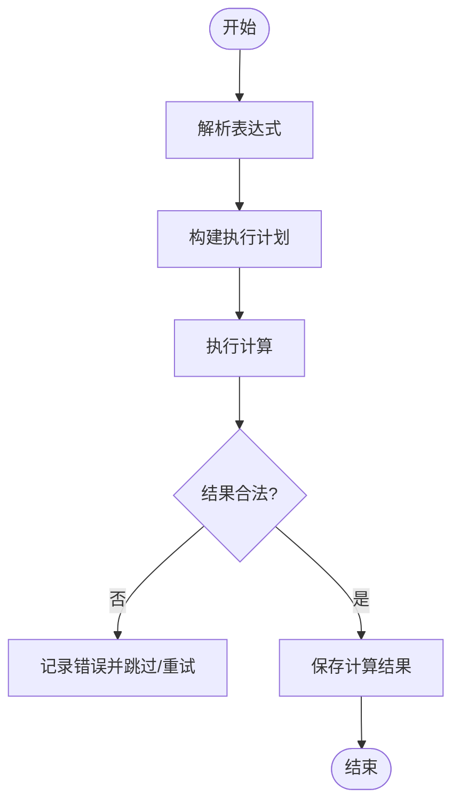
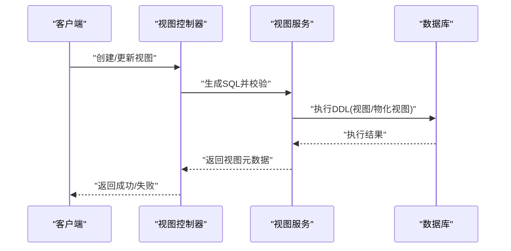
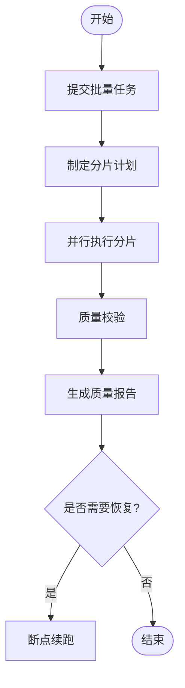
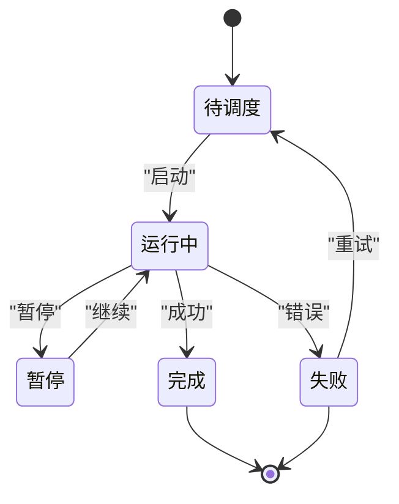
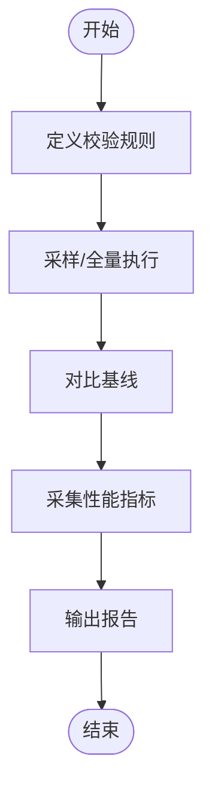
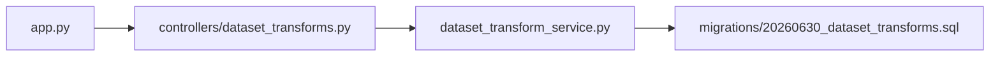

# 数据集转换接口

<cite>
**本文引用的文件**   
- [dataset_transforms.py](file://backend/controllers/dataset_transforms.py)
- [dataset_transform_service.py](file://backend/dataset_transform_service.py)
- [20260630_dataset_transforms.sql](file://backend/migrations/20260630_dataset_transforms.sql)
- [app.py](file://backend/app.py)
</cite>

## 目录
1. [简介](#简介)
2. [项目结构](#项目结构)
3. [核心组件](#核心组件)
4. [架构总览](#架构总览)
5. [详细组件分析](#详细组件分析)
6. [依赖关系分析](#依赖关系分析)
7. [性能考虑](#性能考虑)
8. [故障排查指南](#故障排查指南)
9. [结论](#结论)
10. [附录](#附录)

## 简介
本文件为 SmartAsk 平台“数据集转换”功能的 API 文档，覆盖以下能力：
- 数据清洗接口：空值处理、重复数据去重、数据格式标准化
- 字段计算接口：表达式引擎、函数库支持、自定义计算逻辑
- 视图创建接口：SQL 视图生成、物化视图管理、查询优化
- 批量数据处理接口：数据迁移、格式转换、质量校验
- 转换任务管理：任务调度、进度跟踪、错误恢复
- 转换结果验证：数据一致性检查、性能基准测试

本说明面向开发者与运维人员，既提供高层概览，也给出代码级映射与流程图，帮助快速定位实现位置并理解调用链路。

## 项目结构
与数据集转换相关的后端实现主要位于 backend 目录：
- 控制器层：HTTP 路由与请求解析
- 服务层：业务编排与执行
- 迁移脚本：数据库结构与初始数据
- 应用入口：路由注册与启动

图表来源
- [app.py](file://backend/app.py)
- [dataset_transforms.py](file://backend/controllers/dataset_transforms.py)
- [dataset_transform_service.py](file://backend/dataset_transform_service.py)
- [20260630_dataset_transforms.sql](file://backend/migrations/20260630_dataset_transforms.sql)

章节来源
- [app.py](file://backend/app.py)
- [dataset_transforms.py](file://backend/controllers/dataset_transforms.py)
- [dataset_transform_service.py](file://backend/dataset_transform_service.py)
- [20260630_dataset_transforms.sql](file://backend/migrations/20260630_dataset_transforms.sql)

## 核心组件
- 转换控制器（HTTP）：暴露 RESTful 接口，负责参数校验、权限控制、响应封装
- 转换服务（业务）：编排清洗、计算、视图、批量任务等流程，协调持久化与外部系统
- 数据模型与迁移：定义转换任务、清洗规则、视图定义、执行日志等表结构
- 应用入口：统一注册路由，初始化依赖注入

章节来源
- [dataset_transforms.py](file://backend/controllers/dataset_transforms.py)
- [dataset_transform_service.py](file://backend/dataset_transform_service.py)
- [20260630_dataset_transforms.sql](file://backend/migrations/20260630_dataset_transforms.sql)
- [app.py](file://backend/app.py)

## 架构总览
整体采用“控制器-服务-存储”分层架构，控制器仅做请求解析与响应包装，核心逻辑下沉至服务层；数据通过迁移脚本维护，确保版本一致性与可回滚。

图表来源
- [dataset_transforms.py](file://backend/controllers/dataset_transforms.py)
- [dataset_transform_service.py](file://backend/dataset_transform_service.py)
- [20260630_dataset_transforms.sql](file://backend/migrations/20260630_dataset_transforms.sql)

## 详细组件分析

### 数据清洗接口
- 功能范围
  - 空值处理：填充、删除、默认值策略
  - 重复数据去重：基于键或全行去重
  - 格式标准化：日期、数值、枚举、编码统一
- 典型流程
  - 接收清洗规则与目标字段映射
  - 按规则顺序执行清洗步骤
  - 输出清洗后数据集与统计信息

图表来源
- [dataset_transforms.py](file://backend/controllers/dataset_transforms.py)
- [dataset_transform_service.py](file://backend/dataset_transform_service.py)

章节来源
- [dataset_transforms.py](file://backend/controllers/dataset_transforms.py)
- [dataset_transform_service.py](file://backend/dataset_transform_service.py)

### 字段计算接口
- 功能范围
  - 表达式引擎：支持常用算数、字符串、时间函数
  - 函数库：内置数学、文本、日期函数集合
  - 自定义逻辑：允许注册扩展函数或脚本
- 典型流程
  - 解析计算表达式与字段映射
  - 构建执行计划（函数解析、类型推导）
  - 逐行或批量化计算并落盘

图表来源
- [dataset_transforms.py](file://backend/controllers/dataset_transforms.py)
- [dataset_transform_service.py](file://backend/dataset_transform_service.py)

章节来源
- [dataset_transforms.py](file://backend/controllers/dataset_transforms.py)
- [dataset_transform_service.py](file://backend/dataset_transform_service.py)

### 视图创建接口
- 功能范围
  - SQL 视图生成：从规则/DSL 转换为标准 SQL 视图
  - 物化视图管理：创建、刷新、失效策略
  - 查询优化：索引建议、谓词下推、分区裁剪
- 典型流程
  - 输入视图定义与依赖
  - 生成 SQL 并校验语法
  - 在目标库中创建/更新视图
  - 缓存元数据并返回视图详情

图表来源
- [dataset_transforms.py](file://backend/controllers/dataset_transforms.py)
- [dataset_transform_service.py](file://backend/dataset_transform_service.py)

章节来源
- [dataset_transforms.py](file://backend/controllers/dataset_transforms.py)
- [dataset_transform_service.py](file://backend/dataset_transform_service.py)

### 批量数据处理接口
- 功能范围
  - 数据迁移：跨库/跨格式迁移
  - 格式转换：CSV/JSON/Parquet 等互转
  - 质量校验：完整性、唯一性、一致性校验
- 典型流程
  - 提交批量任务（源/目标、映射、策略）
  - 分片并行处理与断点续跑
  - 汇总质量报告与异常明细

图表来源
- [dataset_transforms.py](file://backend/controllers/dataset_transforms.py)
- [dataset_transform_service.py](file://backend/dataset_transform_service.py)

章节来源
- [dataset_transforms.py](file://backend/controllers/dataset_transforms.py)
- [dataset_transform_service.py](file://backend/dataset_transform_service.py)

### 转换任务管理
- 功能范围
  - 任务调度：定时/事件触发
  - 进度跟踪：阶段状态、耗时、吞吐
  - 错误恢复：重试、补偿、告警
- 典型流程
  - 创建任务并分配资源
  - 周期性上报进度
  - 失败自动重试与人工干预

图表来源
- [dataset_transforms.py](file://backend/controllers/dataset_transforms.py)
- [dataset_transform_service.py](file://backend/dataset_transform_service.py)

章节来源
- [dataset_transforms.py](file://backend/controllers/dataset_transforms.py)
- [dataset_transform_service.py](file://backend/dataset_transform_service.py)

### 转换结果验证接口
- 功能范围
  - 数据一致性检查：行数、聚合值、抽样比对
  - 性能基准测试：吞吐、延迟、资源占用
- 典型流程
  - 指定对比基线与采样策略
  - 执行校验与采集指标
  - 输出差异报告与优化建议

图表来源
- [dataset_transforms.py](file://backend/controllers/dataset_transforms.py)
- [dataset_transform_service.py](file://backend/dataset_transform_service.py)

章节来源
- [dataset_transforms.py](file://backend/controllers/dataset_transforms.py)
- [dataset_transform_service.py](file://backend/dataset_transform_service.py)

## 依赖关系分析
- 控制器依赖服务：请求解析与校验后委托服务执行
- 服务依赖数据层：读写任务、规则、视图元数据与执行日志
- 迁移脚本保障结构：确保表结构与初始数据可用

图表来源
- [app.py](file://backend/app.py)
- [dataset_transforms.py](file://backend/controllers/dataset_transforms.py)
- [dataset_transform_service.py](file://backend/dataset_transform_service.py)
- [20260630_dataset_transforms.sql](file://backend/migrations/20260630_dataset_transforms.sql)

章节来源
- [app.py](file://backend/app.py)
- [dataset_transforms.py](file://backend/controllers/dataset_transforms.py)
- [dataset_transform_service.py](file://backend/dataset_transform_service.py)
- [20260630_dataset_transforms.sql](file://backend/migrations/20260630_dataset_transforms.sql)

## 性能考虑
- 批处理与分片：大任务按分片并行，避免单点阻塞
- 增量与快照：优先增量处理，必要时生成快照便于回滚
- 索引与物化：对高频查询字段建立索引，使用物化视图提升读性能
- 资源隔离：任务级别限流与配额，防止资源争用
- 监控与度量：关键路径埋点，收集吞吐、延迟、错误率

[本节为通用指导，不直接分析具体文件]

## 故障排查指南
- 常见问题
  - 规则解析失败：检查字段映射与表达式语法
  - 数据源不可达：确认连接配置与网络连通性
  - 视图创建失败：核对权限与依赖对象是否存在
  - 任务失败：查看执行日志与重试策略
- 排查步骤
  - 定位任务 ID，检索执行日志
  - 复现最小用例，逐步缩小问题范围
  - 检查依赖表结构与索引是否完整
  - 启用更详细的调试日志与慢查询追踪

章节来源
- [dataset_transforms.py](file://backend/controllers/dataset_transforms.py)
- [dataset_transform_service.py](file://backend/dataset_transform_service.py)
- [20260630_dataset_transforms.sql](file://backend/migrations/20260630_dataset_transforms.sql)

## 结论
SmartAsk 的数据集转换模块以清晰的控制器-服务分层组织，围绕清洗、计算、视图、批量任务与结果验证形成闭环。通过迁移脚本保障数据结构一致性，结合分片并行与物化视图等手段提升性能与可用性。建议在上线前完善监控与告警，持续优化规则与索引策略。

[本节为总结性内容，不直接分析具体文件]

## 附录
- 术语
  - 物化视图：将查询结果物理化存储以提升读取性能
  - 分片：将大数据集切分为多个子任务并行处理
  - 快照：某一时刻的数据副本，用于回滚与对比
- 参考
  - 迁移脚本：用于初始化与升级转换相关表结构
  - 控制器与服务：承载 HTTP 接口与业务编排

[本节为补充信息，不直接分析具体文件]