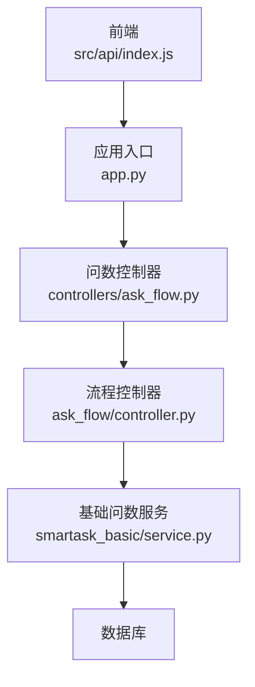
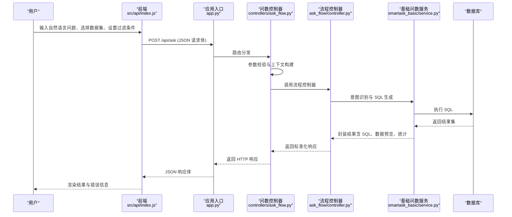
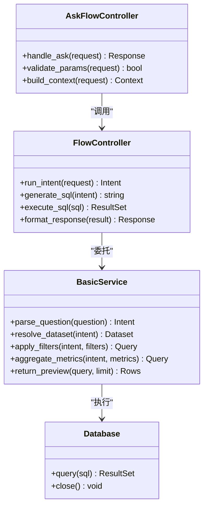

# 基础问数接口

<cite>
**本文引用的文件**   
- [backend/app.py](file://backend/app.py)
- [backend/controllers/ask_flow.py](file://backend/controllers/ask_flow.py)
- [backend/ask_flow/controller.py](file://backend/ask_flow/controller.py)
- [backend/ask_flow/contracts.py](file://backend/ask_flow/contracts.py)
- [backend/smartask_basic/service.py](file://backend/smartask_basic/service.py)
- [frontend/src/api/index.js](file://frontend/src/api/index.js)
</cite>

## 目录
1. [简介](#简介)
2. [项目结构](#项目结构)
3. [核心组件](#核心组件)
4. [架构总览](#架构总览)
5. [详细组件分析](#详细组件分析)
6. [依赖关系分析](#依赖关系分析)
7. [性能考虑](#性能考虑)
8. [故障排查指南](#故障排查指南)
9. [结论](#结论)
10. [附录](#附录)

## 简介
本文件面向 SmartAsk 基础问数功能的 API 文档，聚焦自然语言查询接口的完整流程：从前端发起请求、后端参数校验与意图识别、SQL 生成与执行，到结果返回（含 SQL、执行结果、数据预览与错误信息）。文档同时给出请求/响应示例、参数校验规则、错误处理机制以及性能优化建议与最佳实践。

## 项目结构
SmartAsk 后端采用分层设计：应用入口注册路由，控制器层负责请求解析与编排，业务服务层实现基础问数的核心逻辑（意图识别、SQL 生成、执行与结果封装），前端通过统一的 API 模块调用后端接口。

图表来源
- [backend/app.py](file://backend/app.py)
- [backend/controllers/ask_flow.py](file://backend/controllers/ask_flow.py)
- [backend/ask_flow/controller.py](file://backend/ask_flow/controller.py)
- [backend/smartask_basic/service.py](file://backend/smartask_basic/service.py)
- [frontend/src/api/index.js](file://frontend/src/api/index.js)

章节来源
- [backend/app.py](file://backend/app.py)
- [backend/controllers/ask_flow.py](file://backend/controllers/ask_flow.py)
- [backend/ask_flow/controller.py](file://backend/ask_flow/controller.py)
- [backend/smartask_basic/service.py](file://backend/smartask_basic/service.py)
- [frontend/src/api/index.js](file://frontend/src/api/index.js)

## 核心组件
- 应用入口与路由注册：统一暴露 HTTP 接口，挂载问数相关路由。
- 问数控制器：接收并校验请求体，组织上下文（用户问题、数据集选择、过滤条件等），调用流程控制器。
- 流程控制器：协调意图识别、SQL 生成、执行与结果组装，处理异常与状态码。
- 基础问数服务：实现基础问数的核心能力（意图识别、SQL 生成、执行、结果封装）。
- 前端 API 模块：封装请求方法，提供统一的调用方式。

章节来源
- [backend/app.py](file://backend/app.py)
- [backend/controllers/ask_flow.py](file://backend/controllers/ask_flow.py)
- [backend/ask_flow/controller.py](file://backend/ask_flow/controller.py)
- [backend/smartask_basic/service.py](file://backend/smartask_basic/service.py)
- [frontend/src/api/index.js](file://frontend/src/api/index.js)

## 架构总览
下图展示基础问数接口的端到端调用链路与数据流。

图表来源
- [backend/app.py](file://backend/app.py)
- [backend/controllers/ask_flow.py](file://backend/controllers/ask_flow.py)
- [backend/ask_flow/controller.py](file://backend/ask_flow/controller.py)
- [backend/smartask_basic/service.py](file://backend/smartask_basic/service.py)
- [frontend/src/api/index.js](file://frontend/src/api/index.js)

## 详细组件分析

### 接口定义与请求格式
- 接口路径：POST /api/ask
- 内容类型：application/json
- 请求体字段说明：
  - question：字符串，必填，用户自然语言问题
  - dataset_id：字符串或整数，可选，指定数据集标识；未指定时由系统根据问题自动匹配
  - filters：对象，可选，过滤条件集合，键为维度字段名，值为过滤值或范围
  - metrics：数组，可选，指标字段列表；为空时由系统根据问题推断
  - limit：整数，可选，返回行数上限，默认值由服务端配置决定
  - group_by：数组，可选，分组字段列表
  - order_by：数组，可选，排序字段与方向（如 ["sales desc"]）
  - session_id：字符串，可选，会话标识，用于上下文关联
- 认证与鉴权：
  - 请求需携带认证头（如 Authorization），由应用入口或中间件校验
  - 权限控制基于数据集与组织树，未授权将返回 403

章节来源
- [backend/app.py](file://backend/app.py)
- [backend/controllers/ask_flow.py](file://backend/controllers/ask_flow.py)
- [backend/ask_flow/controller.py](file://backend/ask_flow/controller.py)
- [backend/smartask_basic/service.py](file://backend/smartask_basic/service.py)

### 参数校验与意图识别
- 参数校验规则：
  - question 非空且长度在允许范围内
  - dataset_id 若存在，必须为已注册的数据集标识
  - filters 的键必须在数据集维度字段白名单内
  - metrics 的键必须在数据集指标字段白名单内
  - limit 为正整数且不大于最大限制
  - group_by/order_by 字段需在数据集元数据中存在
- 意图识别流程：
  - 解析问题中的实体、维度、指标与操作（筛选、聚合、排序、分页）
  - 结合数据集元数据与上下文（session_id）进行消歧与补全
  - 输出结构化意图（维度、指标、过滤条件、分组、排序、限制）

章节来源
- [backend/ask_flow/contracts.py](file://backend/ask_flow/contracts.py)
- [backend/smartask_basic/service.py](file://backend/smartask_basic/service.py)

### SQL 生成与执行
- SQL 生成策略：
  - 基于意图与数据集元数据生成标准 SQL
  - 支持动态拼接 WHERE、GROUP BY、ORDER BY、LIMIT
  - 对敏感字段与权限进行注入式保护（行级/列级）
- 执行与结果封装：
  - 执行 SQL 获取结果集
  - 计算统计摘要（行数、列数、空值率等）
  - 生成数据预览（前 N 行）
  - 返回原始 SQL 与执行耗时

章节来源
- [backend/smartask_basic/service.py](file://backend/smartask_basic/service.py)
- [backend/ask_flow/controller.py](file://backend/ask_flow/controller.py)

### 响应结构与示例
- 成功响应（HTTP 200）：
  - code：整数，业务状态码（0 表示成功）
  - message：字符串，提示信息
  - data：对象，包含：
    - sql：字符串，生成的 SQL
    - rows：数组，数据预览（前 N 行）
    - stats：对象，统计信息（行数、列数、耗时等）
    - meta：对象，元数据（数据集名称、字段描述等）
- 失败响应（HTTP 4xx/5xx）：
  - code：整数，错误码
  - message：字符串，错误描述
  - details：对象，可选，详细错误信息（如校验失败字段、SQL 语法错误位置）

示例场景：
- 简单查询：仅传入 question，系统自动匹配数据集与指标，返回前若干行预览
- 条件过滤：filters 指定维度过滤条件，返回满足条件的数据
- 聚合统计：metrics 指定聚合指标，group_by 指定分组，返回汇总结果

章节来源
- [backend/ask_flow/contracts.py](file://backend/ask_flow/contracts.py)
- [backend/controllers/ask_flow.py](file://backend/controllers/ask_flow.py)

### 错误处理机制
- 参数校验失败：返回 400，message 指明缺失或非法字段
- 数据集不存在或无权限：返回 403 或 404
- SQL 生成失败：返回 422，details 包含生成失败原因
- 数据库执行异常：返回 500，details 包含错误堆栈摘要
- 超时或资源不足：返回 504 或 503，提示重试或稍后访问

章节来源
- [backend/ask_flow/controller.py](file://backend/ask_flow/controller.py)
- [backend/smartask_basic/service.py](file://backend/smartask_basic/service.py)

## 依赖关系分析

图表来源
- [backend/controllers/ask_flow.py](file://backend/controllers/ask_flow.py)
- [backend/ask_flow/controller.py](file://backend/ask_flow/controller.py)
- [backend/smartask_basic/service.py](file://backend/smartask_basic/service.py)

章节来源
- [backend/controllers/ask_flow.py](file://backend/controllers/ask_flow.py)
- [backend/ask_flow/controller.py](file://backend/ask_flow/controller.py)
- [backend/smartask_basic/service.py](file://backend/smartask_basic/service.py)

## 性能考虑
- 连接池与并发：使用数据库连接池，限制并发查询数量，避免资源耗尽
- 查询优化：
  - 合理设置 limit，避免返回过大结果集
  - 使用索引字段进行过滤与排序
  - 避免不必要的跨表 JOIN，优先使用预聚合视图
- 缓存策略：
  - 对相同意图与参数的查询结果进行短期缓存
  - 热点数据集的元数据与字典表缓存
- 异步处理：
  - 长耗时查询改为异步任务，前端轮询或 WebSocket 推送进度
- 监控与限流：
  - 记录慢查询日志，设置阈值告警
  - 按用户或 IP 限流，防止滥用

[本节为通用指导，不直接分析具体文件]

## 故障排查指南
- 常见问题定位：
  - 参数校验失败：检查 question、dataset_id、filters、metrics 是否符合规范
  - 意图识别错误：确认问题表述是否清晰，必要时补充上下文（session_id）
  - SQL 生成异常：查看 details 中的错误信息，修正字段名或语法
  - 执行失败：检查数据库连接、权限与表结构变更
- 调试建议：
  - 启用详细日志，记录请求体、意图、SQL 与执行耗时
  - 使用前端调试工具查看网络请求与响应
  - 在后端添加断点或打印关键变量

章节来源
- [backend/ask_flow/controller.py](file://backend/ask_flow/controller.py)
- [backend/smartask_basic/service.py](file://backend/smartask_basic/service.py)

## 结论
SmartAsk 基础问数接口通过清晰的层次化设计与严格的参数校验，实现了从自然语言到 SQL 的高效转换与执行。遵循本文档的请求格式、响应结构与错误处理机制，可确保前后端协作顺畅。结合性能优化建议与最佳实践，可在高并发与大数据量场景下保持稳定与高效。

[本节为总结性内容，不直接分析具体文件]

## 附录
- 前端调用示例（伪代码）：
  - 发起请求：POST /api/ask，携带 JSON 请求体
  - 处理响应：根据 code 判断成功或失败，渲染 data.sql、data.rows 与 data.stats
- 测试用例建议：
  - 覆盖简单查询、条件过滤、聚合统计、错误场景（缺参、非法字段、无权限、执行异常）
  - 验证 limit、group_by、order_by 的组合行为

章节来源
- [frontend/src/api/index.js](file://frontend/src/api/index.js)