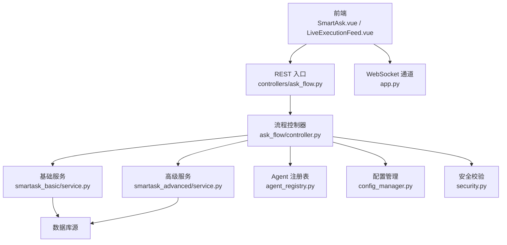
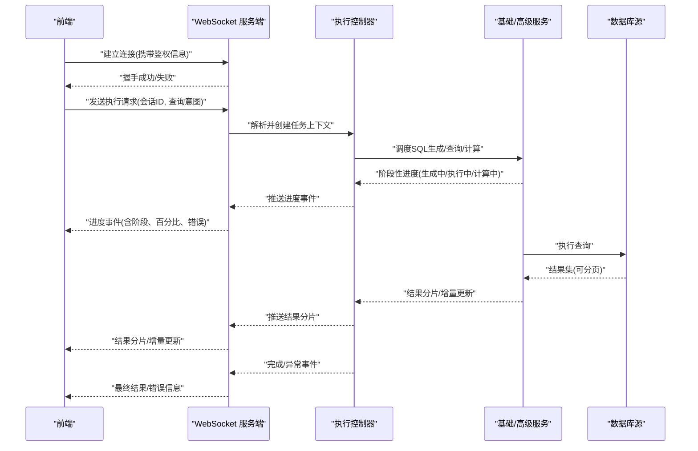
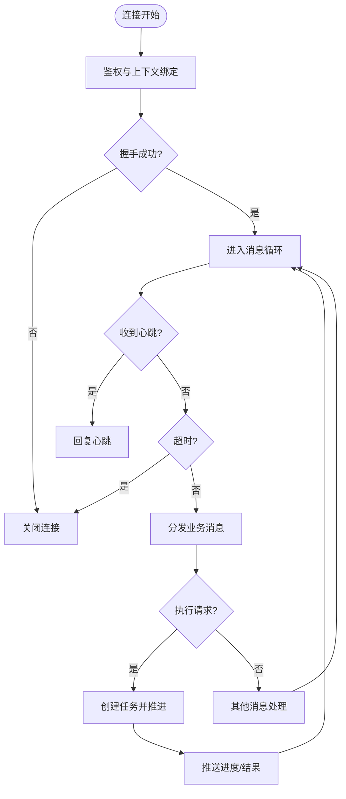
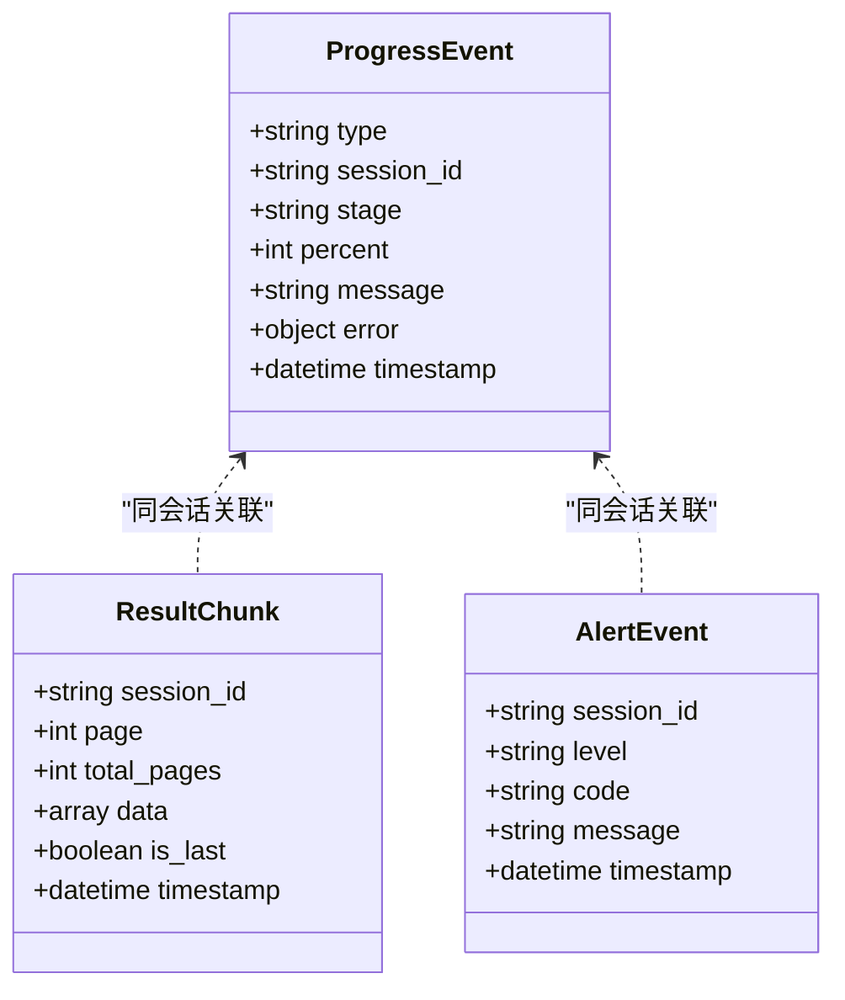
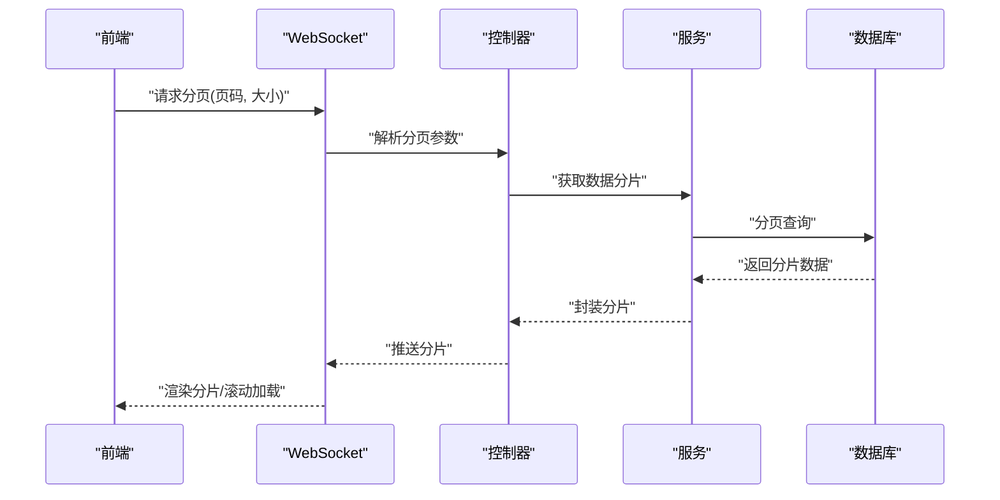
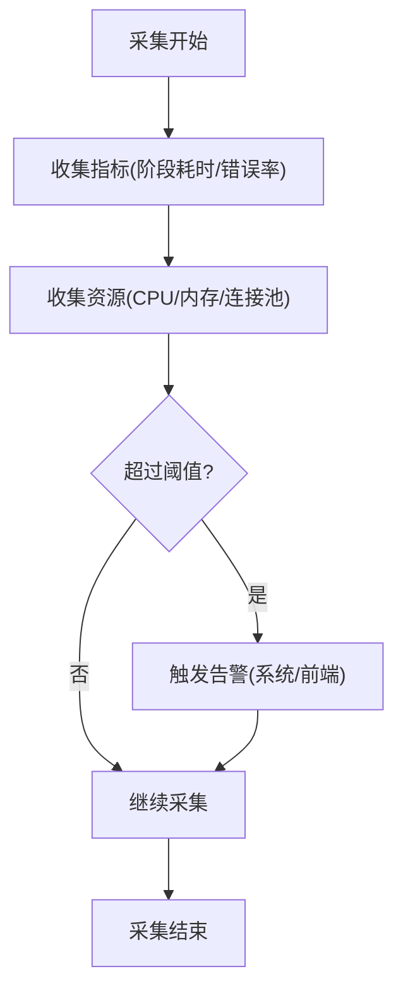
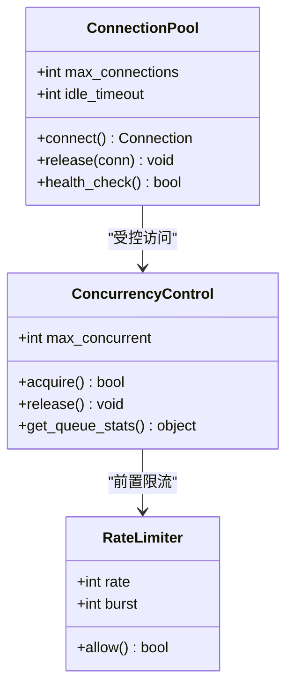
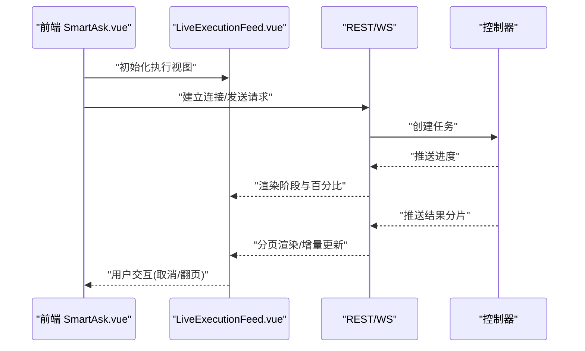
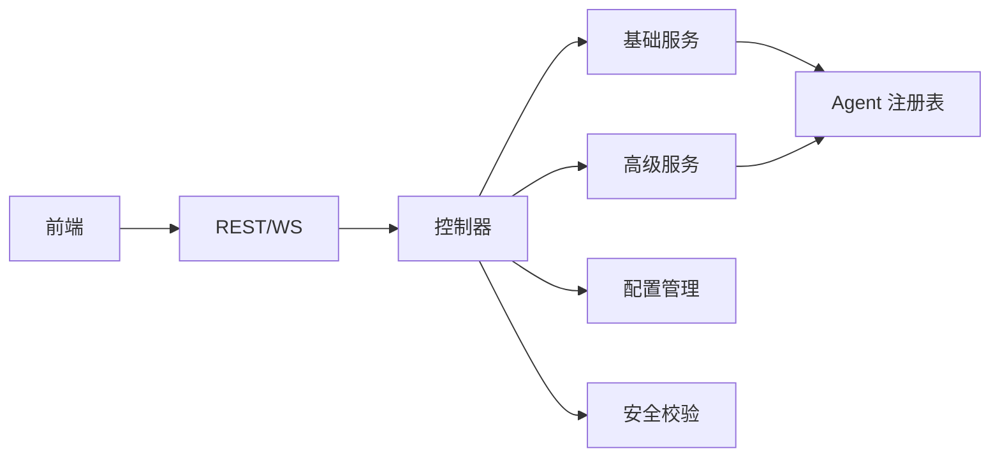

# 实时执行接口

<cite>
**本文引用的文件**
- [app.py](file://backend/app.py)
- [ask_flow/controller.py](file://backend/ask_flow/controller.py)
- [ask_flow/contracts.py](file://backend/ask_flow/contracts.py)
- [controllers/ask_flow.py](file://backend/controllers/ask_flow.py)
- [smartask_advanced/service.py](file://backend/smartask_advanced/service.py)
- [smartask_basic/service.py](file://backend/smartask_basic/service.py)
- [agent_registry.py](file://backend/agent_registry.py)
- [config_manager.py](file://backend/config_manager.py)
- [security.py](file://backend/security.py)
- [frontend/src/components/smartask/LiveExecutionFeed.vue](file://frontend/src/components/smartask/LiveExecutionFeed.vue)
- [frontend/src/views/SmartAsk.vue](file://frontend/src/views/SmartAsk.vue)
- [frontend/src/api/index.js](file://frontend/src/api/index.js)
</cite>

## 目录
1. [简介](#简介)
2. [项目结构](#项目结构)
3. [核心组件](#核心组件)
4. [架构总览](#架构总览)
5. [详细组件分析](#详细组件分析)
6. [依赖关系分析](#依赖关系分析)
7. [性能考量](#性能考量)
8. [故障排查指南](#故障排查指南)
9. [结论](#结论)
10. [附录](#附录)

## 简介
本文件为 SmartAsk 的“实时执行”能力提供完整的 API 文档，覆盖 WebSocket 连接建立与消息协议、执行进度推送、实时数据流处理（流式响应、增量更新、分页加载）、执行监控指标与告警、以及连接池与并发控制策略。文档同时给出端到端交互示例，帮助前端与后端开发者快速集成与排障。

## 项目结构
SmartAsk 的实时执行由前后端协同实现：
- 后端通过 FastAPI 暴露 REST 入口，并在需要时启用 WebSocket 通道用于长耗时任务的实时状态与结果推送。
- ask_flow 模块负责编排智能问数流程，协调基础与高级服务，统一契约定义与控制器。
- 前端通过 Vue 组件订阅实时事件，渲染执行时间线与结果卡片。

**图表来源**
- [app.py](file://backend/app.py)
- [controllers/ask_flow.py](file://backend/controllers/ask_flow.py)
- [ask_flow/controller.py](file://backend/ask_flow/controller.py)
- [smartask_basic/service.py](file://backend/smartask_basic/service.py)
- [smartask_advanced/service.py](file://backend/smartask_advanced/service.py)
- [agent_registry.py](file://backend/agent_registry.py)
- [config_manager.py](file://backend/config_manager.py)
- [security.py](file://backend/security.py)

**章节来源**
- [app.py](file://backend/app.py)
- [controllers/ask_flow.py](file://backend/controllers/ask_flow.py)
- [ask_flow/controller.py](file://backend/ask_flow/controller.py)
- [smartask_basic/service.py](file://backend/smartask_basic/service.py)
- [smartask_advanced/service.py](file://backend/smartask_advanced/service.py)
- [agent_registry.py](file://backend/agent_registry.py)
- [config_manager.py](file://backend/config_manager.py)
- [security.py](file://backend/security.py)
- [frontend/src/views/SmartAsk.vue](file://frontend/src/views/SmartAsk.vue)
- [frontend/src/components/smartask/LiveExecutionFeed.vue](file://frontend/src/components/smartask/LiveExecutionFeed.vue)

## 核心组件
- WebSocket 接入层：负责连接握手、鉴权、心跳检测、断线重连与任务生命周期管理。
- 执行控制器：接收请求、解析参数、路由到基础或高级问数服务，维护任务上下文与进度广播。
- 基础/高级服务：分别实现 SQL 生成、查询执行、结果计算与分析增强等能力。
- Agent 注册表：动态发现与调用可插拔 Agent，支持扩展与灰度。
- 配置与安全：集中管理运行时配置、权限校验与审计。

**章节来源**
- [ask_flow/controller.py](file://backend/ask_flow/controller.py)
- [ask_flow/contracts.py](file://backend/ask_flow/contracts.py)
- [smartask_basic/service.py](file://backend/smartask_basic/service.py)
- [smartask_advanced/service.py](file://backend/smartask_advanced/service.py)
- [agent_registry.py](file://backend/agent_registry.py)
- [config_manager.py](file://backend/config_manager.py)
- [security.py](file://backend/security.py)

## 架构总览
下图展示从前端发起实时执行到后端返回流式结果的完整链路，包括握手、心跳、进度推送与结果分片。

**图表来源**
- [app.py](file://backend/app.py)
- [controllers/ask_flow.py](file://backend/controllers/ask_flow.py)
- [ask_flow/controller.py](file://backend/ask_flow/controller.py)
- [smartask_basic/service.py](file://backend/smartask_basic/service.py)
- [smartask_advanced/service.py](file://backend/smartask_advanced/service.py)

## 详细组件分析

### WebSocket 连接与消息协议
- 连接建立
  - 客户端通过 WebSocket 建立连接，需在 URL 查询参数或首条消息中携带鉴权令牌与会话标识。
  - 服务端校验令牌有效性，绑定用户与租户上下文，分配任务 ID，返回握手成功消息。
- 心跳检测
  - 客户端与服务端周期性互发心跳帧；超时未收到心跳则判定连接失效。
  - 服务端在空闲超时时主动关闭连接，释放资源。
- 断线重连
  - 客户端检测到断开后按指数退避策略重连，携带上次会话 ID 以恢复上下文。
  - 服务端对同一会话的重连进行幂等处理，避免重复任务。
- 消息协议
  - 上行消息类型：连接握手、执行请求、取消请求、心跳。
  - 下行消息类型：握手确认、进度事件、结果分片、告警事件、完成/错误事件、心跳应答。
  - 所有消息采用 JSON 格式，包含通用字段：消息类型、会话 ID、时间戳、负载。

**图表来源**
- [app.py](file://backend/app.py)
- [controllers/ask_flow.py](file://backend/controllers/ask_flow.py)

**章节来源**
- [app.py](file://backend/app.py)
- [controllers/ask_flow.py](file://backend/controllers/ask_flow.py)

### 执行进度推送接口
- 阶段划分
  - SQL 生成：提示词构建、模型推理、语法校验。
  - 数据库查询：计划优化、执行、拉取结果集。
  - 结果计算：聚合、过滤、排序、可视化准备。
- 推送内容
  - 阶段名称、当前步骤、百分比、累计耗时、错误码与错误消息。
  - 结果分片：页码、记录数、是否最后一页、增量标记。
- 错误上报
  - 结构化错误对象，包含错误类型、位置、建议修复动作。

**图表来源**
- [ask_flow/contracts.py](file://backend/ask_flow/contracts.py)
- [ask_flow/controller.py](file://backend/ask_flow/controller.py)

**章节来源**
- [ask_flow/contracts.py](file://backend/ask_flow/contracts.py)
- [ask_flow/controller.py](file://backend/ask_flow/controller.py)

### 实时数据流处理
- 流式响应
  - 后端将大结果集拆分为分片，逐条推送，前端按需渲染。
  - 支持暂停/恢复播放，避免 UI 卡顿。
- 增量更新
  - 针对交互式探索场景，仅推送差异部分，减少带宽与渲染压力。
- 分页加载
  - 客户端根据总页数与当前页码请求下一批数据，服务端按游标或偏移量分页。

**图表来源**
- [controllers/ask_flow.py](file://backend/controllers/ask_flow.py)
- [ask_flow/controller.py](file://backend/ask_flow/controller.py)
- [smartask_basic/service.py](file://backend/smartask_basic/service.py)
- [smartask_advanced/service.py](file://backend/smartask_advanced/service.py)

**章节来源**
- [controllers/ask_flow.py](file://backend/controllers/ask_flow.py)
- [ask_flow/controller.py](file://backend/ask_flow/controller.py)
- [smartask_basic/service.py](file://backend/smartask_basic/service.py)
- [smartask_advanced/service.py](file://backend/smartask_advanced/service.py)

### 执行监控接口
- 性能指标
  - 各阶段耗时、QPS、延迟分布、错误率。
- 资源使用统计
  - CPU、内存、数据库连接池占用、I/O 吞吐。
- 异常告警
  - 阈值触发告警，推送至监控系统与前端通知栏。

**图表来源**
- [ask_flow/controller.py](file://backend/ask_flow/controller.py)
- [config_manager.py](file://backend/config_manager.py)

**章节来源**
- [ask_flow/controller.py](file://backend/ask_flow/controller.py)
- [config_manager.py](file://backend/config_manager.py)

### 连接池管理与并发控制
- 连接池
  - 数据库连接池按租户隔离，限制最大连接数与空闲回收时间。
  - 支持连接健康检查与自动重建。
- 并发控制
  - 基于令牌桶或信号量限制并发任务数，防止过载。
  - 任务队列优先级与公平调度，保证关键任务优先。
- 限流与熔断
  - 对上游请求进行速率限制，异常时快速失败与降级。

**图表来源**
- [config_manager.py](file://backend/config_manager.py)
- [security.py](file://backend/security.py)

**章节来源**
- [config_manager.py](file://backend/config_manager.py)
- [security.py](file://backend/security.py)

### 前端实时交互示例
- 长耗时查询
  - 前端建立 WebSocket，显示进度条与阶段标签，支持取消操作。
- 大数据分析
  - 前端分页加载结果，支持虚拟滚动与增量更新。
- 交互式探索
  - 前端发送过滤条件变更，后端推送差异结果，保持低延迟。

**图表来源**
- [frontend/src/views/SmartAsk.vue](file://frontend/src/views/SmartAsk.vue)
- [frontend/src/components/smartask/LiveExecutionFeed.vue](file://frontend/src/components/smartask/LiveExecutionFeed.vue)
- [frontend/src/api/index.js](file://frontend/src/api/index.js)

**章节来源**
- [frontend/src/views/SmartAsk.vue](file://frontend/src/views/SmartAsk.vue)
- [frontend/src/components/smartask/LiveExecutionFeed.vue](file://frontend/src/components/smartask/LiveExecutionFeed.vue)
- [frontend/src/api/index.js](file://frontend/src/api/index.js)

## 依赖关系分析
- 控制器依赖基础与高级服务，服务依赖数据库源与 Agent 注册表。
- 配置与安全模块贯穿全链路，确保一致性与合规性。
- 前端依赖 API 与 WebSocket 通道，组件间通过事件总线通信。

**图表来源**
- [ask_flow/controller.py](file://backend/ask_flow/controller.py)
- [smartask_basic/service.py](file://backend/smartask_basic/service.py)
- [smartask_advanced/service.py](file://backend/smartask_advanced/service.py)
- [agent_registry.py](file://backend/agent_registry.py)
- [config_manager.py](file://backend/config_manager.py)
- [security.py](file://backend/security.py)
- [controllers/ask_flow.py](file://backend/controllers/ask_flow.py)

**章节来源**
- [ask_flow/controller.py](file://backend/ask_flow/controller.py)
- [smartask_basic/service.py](file://backend/smartask_basic/service.py)
- [smartask_advanced/service.py](file://backend/smartask_advanced/service.py)
- [agent_registry.py](file://backend/agent_registry.py)
- [config_manager.py](file://backend/config_manager.py)
- [security.py](file://backend/security.py)
- [controllers/ask_flow.py](file://backend/controllers/ask_flow.py)

## 性能考量
- 合理设置分片大小与并发上限，避免内存峰值过高。
- 使用游标分页替代偏移分页，提升大数据集查询性能。
- 心跳间隔与超时时间需平衡网络抖动与资源占用。
- 监控指标采样频率与存储周期应可调，避免影响主路径。

[本节为通用指导，不直接分析具体文件]

## 故障排查指南
- 连接问题
  - 检查鉴权令牌有效期与跨域配置。
  - 查看心跳超时日志与重连次数。
- 执行异常
  - 定位错误码与错误位置，核对输入参数与权限。
  - 查看数据库连接池状态与慢查询日志。
- 性能瓶颈
  - 分析阶段耗时分布，识别热点 Agent 或 SQL。
  - 调整并发与分片大小，观察指标变化。

**章节来源**
- [security.py](file://backend/security.py)
- [config_manager.py](file://backend/config_manager.py)
- [ask_flow/controller.py](file://backend/ask_flow/controller.py)

## 结论
SmartAsk 的实时执行能力通过 WebSocket 与流式分片机制，实现了高可用、低延迟的用户体验。结合完善的监控与连接池管理，可在大规模数据分析与交互式探索场景中稳定运行。建议在生产环境充分压测与调优，确保指标与资源使用处于健康区间。

[本节为总结，不直接分析具体文件]

## 附录
- 术语表
  - 会话 ID：唯一标识一次用户交互的生命周期。
  - 分片：结果集的连续片段，便于流式传输与渲染。
  - 增量更新：仅推送与上一次结果差异的数据。
- 最佳实践
  - 前端应实现优雅降级与重试逻辑。
  - 后端需对异常进行结构化上报与可观测性埋点。

[本节为补充说明，不直接分析具体文件]