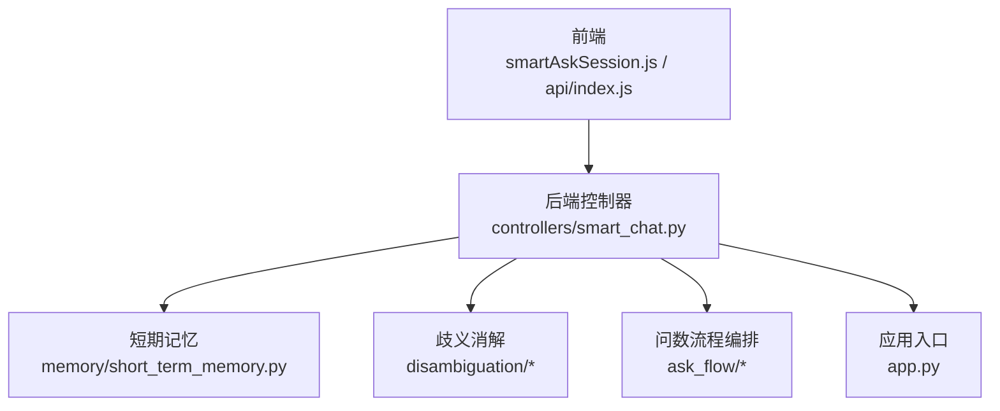
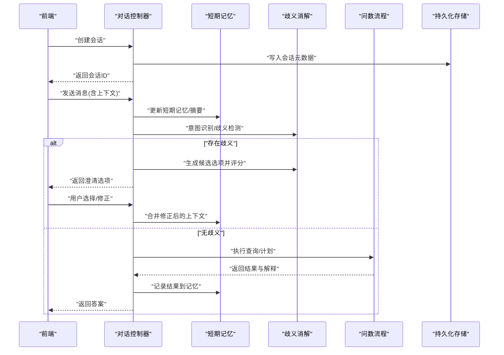
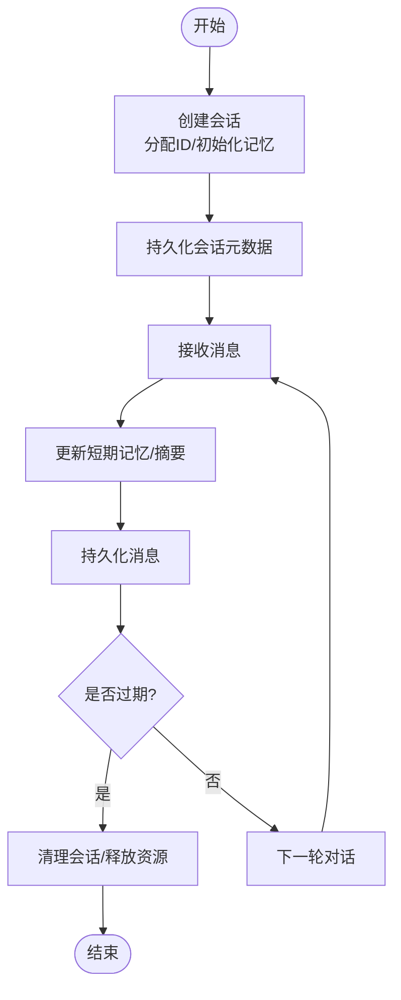
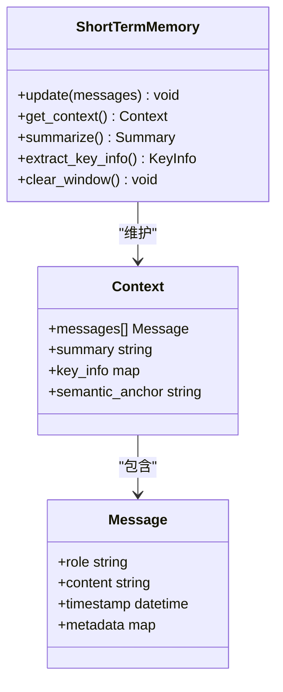
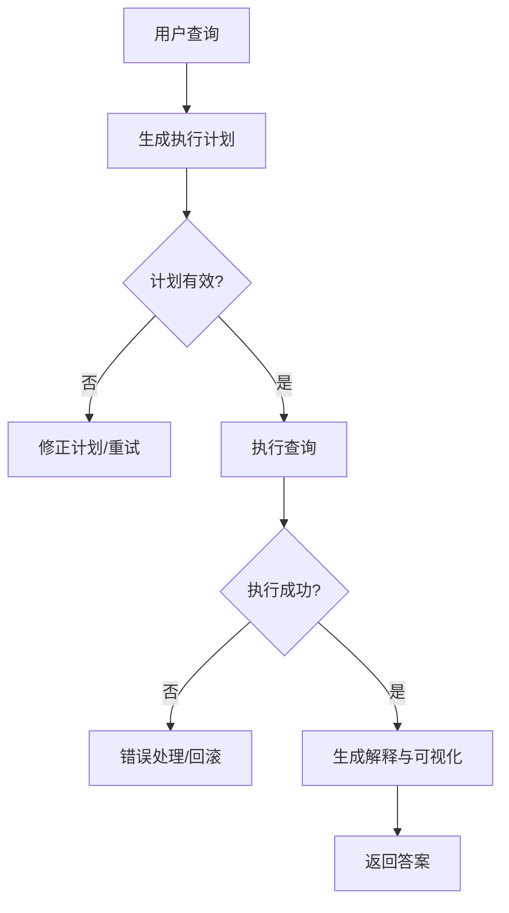
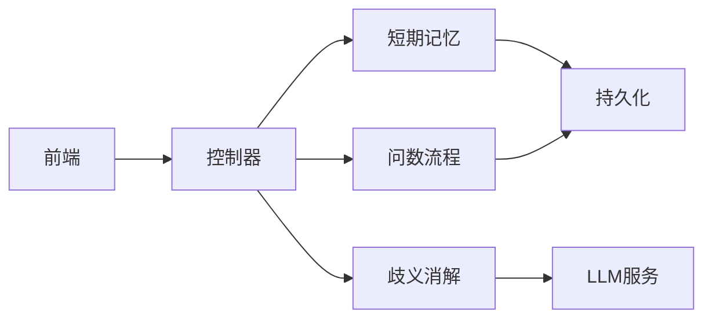

# 对话管理接口

<cite>
**本文引用的文件**   
- [backend/controllers/smart_chat.py](file://backend/controllers/smart_chat.py)
- [backend/memory/short_term_memory.py](file://backend/memory/short_term_memory.py)
- [backend/app.py](file://backend/app.py)
- [frontend/src/state/smartAskSession.js](file://frontend/src/state/smartAskSession.js)
- [frontend/src/api/index.js](file://frontend/src/api/index.js)
- [backend/disambiguation/llm_arbiter.py](file://backend/disambiguation/llm_arbiter.py)
- [backend/disambiguation/option_builder.py](file://backend/disambiguation/option_builder.py)
- [backend/disambiguation/scoring.py](file://backend/disambiguation/scoring.py)
- [backend/ask_flow/controller.py](file://backend/ask_flow/controller.py)
- [backend/ask_flow/contracts.py](file://backend/ask_flow/contracts.py)
</cite>

## 目录
1. [简介](#简介)
2. [项目结构](#项目结构)
3. [核心组件](#核心组件)
4. [架构总览](#架构总览)
5. [详细组件分析](#详细组件分析)
6. [依赖关系分析](#依赖关系分析)
7. [性能考虑](#性能考虑)
8. [故障排查指南](#故障排查指南)
9. [结论](#结论)
10. [附录](#附录)

## 简介
本文件为 SmartAsk 对话管理功能的 API 文档，聚焦多轮对话、上下文维护、历史消息管理与会话状态同步。内容覆盖：
- 会话生命周期：创建、消息存储、上下文清理、过期处理
- 对话记忆机制：短期记忆、关键信息提取、语义关联
- 对话优化接口：意图澄清、查询修正、答案反馈收集
- 完整对话流示例：多轮问答、上下文引用、话题切换
- 内存管理与性能优化建议

## 项目结构
与对话管理相关的后端模块主要位于 backend 下：
- controllers/smart_chat.py：对话相关 HTTP 控制器（会话、消息、澄清等）
- memory/short_term_memory.py：短期记忆实现（上下文窗口、摘要、关键信息）
- disambiguation/*：歧义消解与选项构建（意图澄清、评分）
- ask_flow/*：问数流程编排与契约定义（用于对话中的执行链路）
- app.py：路由注册与中间件入口

前端侧：
- frontend/src/state/smartAskSession.js：会话状态管理（本地缓存、消息列表、上下文）
- frontend/src/api/index.js：API 调用封装（会话、消息、澄清、反馈）



图表来源
- [backend/controllers/smart_chat.py](file://backend/controllers/smart_chat.py)
- [backend/memory/short_term_memory.py](file://backend/memory/short_term_memory.py)
- [backend/disambiguation/llm_arbiter.py](file://backend/disambiguation/llm_arbiter.py)
- [backend/disambiguation/option_builder.py](file://backend/disambiguation/option_builder.py)
- [backend/disambiguation/scoring.py](file://backend/disambiguation/scoring.py)
- [backend/ask_flow/controller.py](file://backend/ask_flow/controller.py)
- [backend/ask_flow/contracts.py](file://backend/ask_flow/contracts.py)
- [backend/app.py](file://backend/app.py)
- [frontend/src/state/smartAskSession.js](file://frontend/src/state/smartAskSession.js)
- [frontend/src/api/index.js](file://frontend/src/api/index.js)

章节来源
- [backend/controllers/smart_chat.py](file://backend/controllers/smart_chat.py)
- [backend/memory/short_term_memory.py](file://backend/memory/short_term_memory.py)
- [backend/app.py](file://backend/app.py)
- [frontend/src/state/smartAskSession.js](file://frontend/src/state/smartAskSession.js)
- [frontend/src/api/index.js](file://frontend/src/api/index.js)

## 核心组件
- 会话控制器（smart_chat）：提供会话创建、消息发送、历史查询、澄清交互、反馈提交等 REST 接口；负责会话 ID 生成、消息持久化、上下文组装与返回。
- 短期记忆（short_term_memory）：维护会话的短期上下文窗口，支持消息裁剪、摘要压缩、关键信息抽取与语义关联。
- 歧义消解（disambiguation）：当用户意图不明确时，生成候选选项并评分，辅助澄清与修正。
- 问数流程（ask_flow）：将对话中的查询转化为可执行的计划或 SQL，并在对话中回传执行结果与解释。
- 前端会话状态（smartAskSession）：维护本地会话、消息列表、上下文快照，负责与后端 API 同步。

章节来源
- [backend/controllers/smart_chat.py](file://backend/controllers/smart_chat.py)
- [backend/memory/short_term_memory.py](file://backend/memory/short_term_memory.py)
- [backend/disambiguation/llm_arbiter.py](file://backend/disambiguation/llm_arbiter.py)
- [backend/disambiguation/option_builder.py](file://backend/disambiguation/option_builder.py)
- [backend/disambiguation/scoring.py](file://backend/disambiguation/scoring.py)
- [backend/ask_flow/controller.py](file://backend/ask_flow/controller.py)
- [backend/ask_flow/contracts.py](file://backend/ask_flow/contracts.py)
- [frontend/src/state/smartAskSession.js](file://frontend/src/state/smartAskSession.js)
- [frontend/src/api/index.js](file://frontend/src/api/index.js)

## 架构总览
SmartAsk 对话管理采用“控制器 + 记忆 + 消歧 + 流程编排”的分层架构。前端通过 API 发起请求，控制器协调记忆与消歧模块，必要时调用问数流程完成数据查询与结果回写。



图表来源
- [backend/controllers/smart_chat.py](file://backend/controllers/smart_chat.py)
- [backend/memory/short_term_memory.py](file://backend/memory/short_term_memory.py)
- [backend/disambiguation/llm_arbiter.py](file://backend/disambiguation/llm_arbiter.py)
- [backend/disambiguation/option_builder.py](file://backend/disambiguation/option_builder.py)
- [backend/disambiguation/scoring.py](file://backend/disambiguation/scoring.py)
- [backend/ask_flow/controller.py](file://backend/ask_flow/controller.py)
- [backend/ask_flow/contracts.py](file://backend/ask_flow/contracts.py)

## 详细组件分析

### 会话生命周期管理
- 会话创建：分配唯一会话 ID，初始化短期记忆与基础上下文，写入持久化存储。
- 消息存储：每条用户输入与系统回复均落库，附带时间戳、角色、上下文片段。
- 上下文清理：基于窗口大小与摘要策略裁剪历史，保留关键信息与语义锚点。
- 会话过期：按配置 TTL 清理长期不活跃会话，释放内存与存储资源。



章节来源
- [backend/controllers/smart_chat.py](file://backend/controllers/smart_chat.py)
- [backend/memory/short_term_memory.py](file://backend/memory/short_term_memory.py)

### 对话记忆机制
- 短期记忆存储：维护最近 N 条消息与摘要，支持滑动窗口与增量更新。
- 关键信息提取：从对话中提取实体、指标、过滤条件等关键要素，形成结构化上下文。
- 语义关联：将当前问题与历史上下文进行语义匹配，增强回答准确性。



图表来源
- [backend/memory/short_term_memory.py](file://backend/memory/short_term_memory.py)

章节来源
- [backend/memory/short_term_memory.py](file://backend/memory/short_term_memory.py)

### 歧义消解与意图澄清
- 意图识别：根据用户输入与上下文判断是否存在歧义。
- 选项构建：生成候选澄清项（如指标、维度、时间范围）。
- 评分排序：对候选项进行相关性评分，返回最优选项供用户确认。

```mermaid
sequenceDiagram
participant CTRL as "控制器"
participant DIS as "歧义消解"
participant OPT as "选项构建"
participant SCR as "评分器"
CTRL->>DIS : "检测意图歧义"
alt "存在歧义"
CTRL->>OPT : "构建候选选项"
OPT-->>CTRL : "候选列表"
CTRL->>SCR : "评分排序"
SCR-->>CTRL : "排序结果"
CTRL-->>CTRL : "生成澄清提示"
else "无歧义"
CTRL-->>CTRL : "直接执行流程"
end
```

图表来源
- [backend/disambiguation/llm_arbiter.py](file://backend/disambiguation/llm_arbiter.py)
- [backend/disambiguation/option_builder.py](file://backend/disambiguation/option_builder.py)
- [backend/disambiguation/scoring.py](file://backend/disambiguation/scoring.py)

章节来源
- [backend/disambiguation/llm_arbiter.py](file://backend/disambiguation/llm_arbiter.py)
- [backend/disambiguation/option_builder.py](file://backend/disambiguation/option_builder.py)
- [backend/disambiguation/scoring.py](file://backend/disambiguation/scoring.py)

### 问数流程编排
- 将自然语言查询转换为可执行计划（如 SQL），在对话中回传执行步骤与结果。
- 支持多步推理、错误恢复与结果解释。



图表来源
- [backend/ask_flow/controller.py](file://backend/ask_flow/controller.py)
- [backend/ask_flow/contracts.py](file://backend/ask_flow/contracts.py)

章节来源
- [backend/ask_flow/controller.py](file://backend/ask_flow/controller.py)
- [backend/ask_flow/contracts.py](file://backend/ask_flow/contracts.py)

### 前端会话状态管理
- 维护本地会话对象（ID、创建时间、状态）。
- 管理消息列表与上下文快照，支持乐观更新与失败回滚。
- 与后端 API 同步，确保前后端一致性。

章节来源
- [frontend/src/state/smartAskSession.js](file://frontend/src/state/smartAskSession.js)
- [frontend/src/api/index.js](file://frontend/src/api/index.js)

## 依赖关系分析
- 控制器依赖记忆、消歧与流程模块，形成松耦合的模块化设计。
- 前端通过 API 与后端交互，状态管理独立于业务逻辑。
- 短期记忆作为共享状态，被多个组件读取与更新。



图表来源
- [backend/controllers/smart_chat.py](file://backend/controllers/smart_chat.py)
- [backend/memory/short_term_memory.py](file://backend/memory/short_term_memory.py)
- [backend/disambiguation/llm_arbiter.py](file://backend/disambiguation/llm_arbiter.py)
- [backend/ask_flow/controller.py](file://backend/ask_flow/controller.py)

章节来源
- [backend/controllers/smart_chat.py](file://backend/controllers/smart_chat.py)
- [backend/memory/short_term_memory.py](file://backend/memory/short_term_memory.py)
- [backend/disambiguation/llm_arbiter.py](file://backend/disambiguation/llm_arbiter.py)
- [backend/ask_flow/controller.py](file://backend/ask_flow/controller.py)

## 性能考虑
- 短期记忆窗口大小可调，避免过大导致内存压力。
- 摘要策略应平衡信息保留与计算开销。
- 歧义消解与问数流程可异步执行，提升响应速度。
- 会话过期策略需合理设置 TTL，定期清理无效会话。
- 数据库读写分离与连接池优化，减少 I/O 瓶颈。

## 故障排查指南
- 会话创建失败：检查会话 ID 生成与持久化逻辑。
- 消息丢失：验证消息落库与前端状态同步。
- 歧义消解异常：检查选项构建与评分逻辑。
- 问数流程错误：查看执行计划与 SQL 生成日志。
- 内存溢出：监控短期记忆大小与摘要频率。

## 结论
SmartAsk 对话管理通过模块化设计与清晰的职责划分，实现了高效的多轮对话、上下文维护与意图澄清能力。短期记忆与歧义消解机制提升了用户体验，问数流程编排确保了数据查询的准确性与可解释性。建议持续优化内存管理与异步处理，进一步提升系统性能与稳定性。

## 附录
- API 端点参考：会话创建、消息发送、历史查询、澄清交互、反馈提交
- 数据结构参考：会话、消息、上下文、关键信息、候选选项
- 配置项参考：会话 TTL、记忆窗口大小、摘要阈值、评分权重