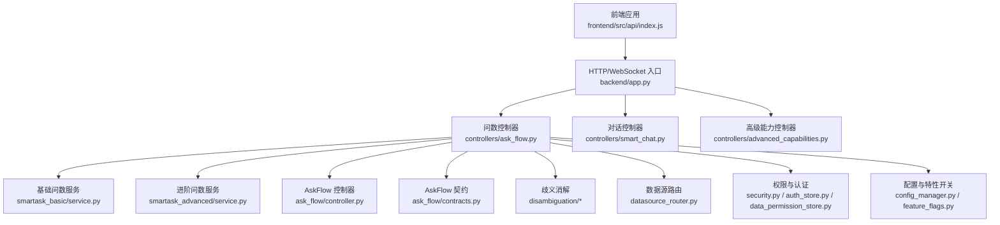
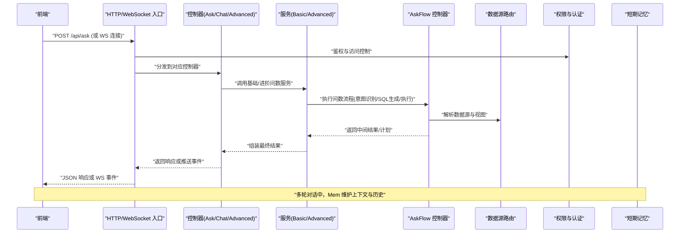
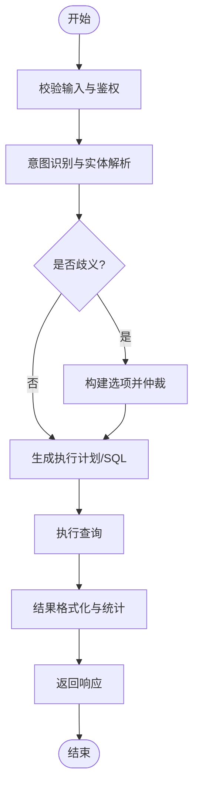
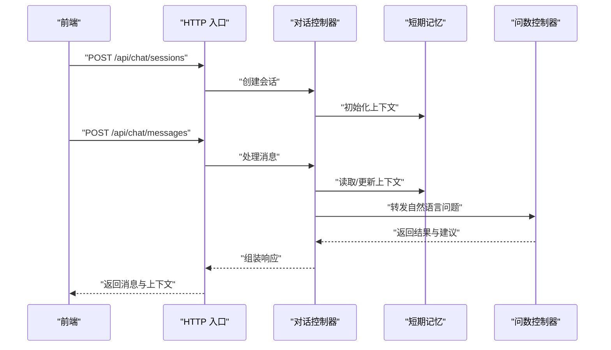
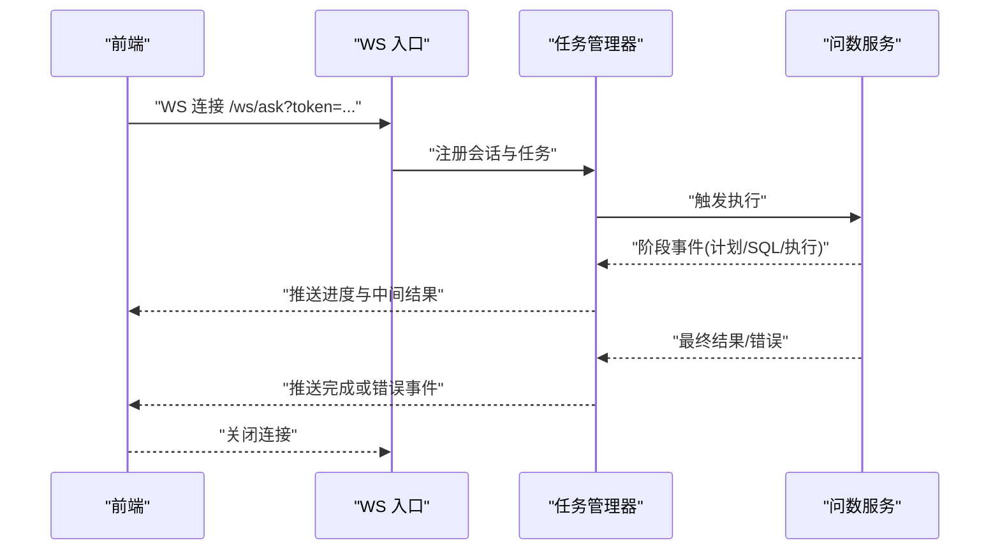
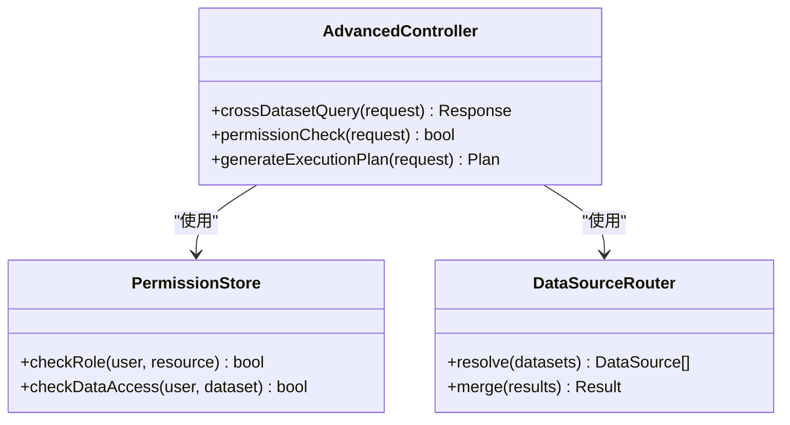
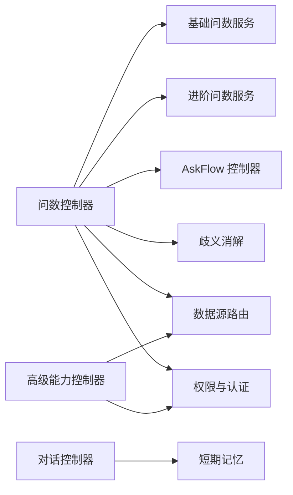

# 智能问数核心接口

<cite>
**本文引用的文件**   
- [app.py](file://backend/app.py)
- [controllers/ask_flow.py](file://backend/controllers/ask_flow.py)
- [controllers/smart_chat.py](file://backend/controllers/smart_chat.py)
- [controllers/advanced_capabilities.py](file://backend/controllers/advanced_capabilities.py)
- [ask_flow/controller.py](file://backend/ask_flow/controller.py)
- [ask_flow/contracts.py](file://backend/ask_flow/contracts.py)
- [smartask_advanced/service.py](file://backend/smartask_advanced/service.py)
- [smartask_basic/service.py](file://backend/smartask_basic/service.py)
- [disambiguation/llm_arbiter.py](file://backend/disambiguation/llm_arbiter.py)
- [disambiguation/option_builder.py](file://backend/disambiguation/option_builder.py)
- [memory/short_term_memory.py](file://backend/memory/short_term_memory.py)
- [security.py](file://backend/security.py)
- [auth_store.py](file://backend/auth_store.py)
- [data_permission_store.py](file://backend/data_permission_store.py)
- [datasource_router.py](file://backend/datasource_router.py)
- [feature_flags.py](file://backend/feature_flags.py)
- [config_manager.py](file://backend/config_manager.py)
- [frontend/src/api/index.js](file://frontend/src/api/index.js)
</cite>

## 目录
1. [简介](#简介)
2. [项目结构](#项目结构)
3. [核心组件](#核心组件)
4. [架构总览](#架构总览)
5. [详细组件分析](#详细组件分析)
6. [依赖分析](#依赖分析)
7. [性能考虑](#性能考虑)
8. [故障排查指南](#故障排查指南)
9. [结论](#结论)
10. [附录](#附录)

## 简介
本文件为 SmartAsk 智能问数系统的“核心接口”文档，聚焦以下能力：
- 自然语言查询接口：输入参数、意图识别、SQL 生成流程与结果返回格式
- 多轮对话接口：上下文管理、历史消息处理、对话状态维护
- 实时执行反馈接口：WebSocket 连接建立、执行进度推送、错误信息上报
- 高级问数功能接口：跨数据集查询、权限校验、执行计划生成
- 完整请求/响应示例：复杂查询场景与错误处理
- 性能优化建议与限流策略

## 项目结构
后端采用模块化控制器与服务分层设计：
- 控制器层：暴露 HTTP/WebSocket 接口，负责入参校验、鉴权、路由到服务层
- 服务层：封装问数核心流程（基础版/进阶版）、意图识别、歧义消解、数据源路由、权限校验等
- 存储与配置：认证、权限、系统配置、特性开关等
- 前端：API 调用封装、会话缓存、实时执行展示

图表来源
- [app.py](file://backend/app.py)
- [controllers/ask_flow.py](file://backend/controllers/ask_flow.py)
- [controllers/smart_chat.py](file://backend/controllers/smart_chat.py)
- [controllers/advanced_capabilities.py](file://backend/controllers/advanced_capabilities.py)
- [ask_flow/controller.py](file://backend/ask_flow/controller.py)
- [ask_flow/contracts.py](file://backend/ask_flow/contracts.py)
- [smartask_basic/service.py](file://backend/smartask_basic/service.py)
- [smartask_advanced/service.py](file://backend/smartask_advanced/service.py)
- [disambiguation/llm_arbiter.py](file://backend/disambiguation/llm_arbiter.py)
- [disambiguation/option_builder.py](file://backend/disambiguation/option_builder.py)
- [datasource_router.py](file://backend/datasource_router.py)
- [security.py](file://backend/security.py)
- [auth_store.py](file://backend/auth_store.py)
- [data_permission_store.py](file://backend/data_permission_store.py)
- [config_manager.py](file://backend/config_manager.py)
- [feature_flags.py](file://backend/feature_flags.py)
- [frontend/src/api/index.js](file://frontend/src/api/index.js)

章节来源
- [app.py](file://backend/app.py)
- [controllers/ask_flow.py](file://backend/controllers/ask_flow.py)
- [controllers/smart_chat.py](file://backend/controllers/smart_chat.py)
- [controllers/advanced_capabilities.py](file://backend/controllers/advanced_capabilities.py)
- [ask_flow/controller.py](file://backend/ask_flow/controller.py)
- [ask_flow/contracts.py](file://backend/ask_flow/contracts.py)
- [smartask_basic/service.py](file://backend/smartask_basic/service.py)
- [smartask_advanced/service.py](file://backend/smartask_advanced/service.py)
- [disambiguation/llm_arbiter.py](file://backend/disambiguation/llm_arbiter.py)
- [disambiguation/option_builder.py](file://backend/disambiguation/option_builder.py)
- [memory/short_term_memory.py](file://backend/memory/short_term_memory.py)
- [datasource_router.py](file://backend/datasource_router.py)
- [security.py](file://backend/security.py)
- [auth_store.py](file://backend/auth_store.py)
- [data_permission_store.py](file://backend/data_permission_store.py)
- [config_manager.py](file://backend/config_manager.py)
- [feature_flags.py](file://backend/feature_flags.py)
- [frontend/src/api/index.js](file://frontend/src/api/index.js)

## 核心组件
- 问数控制器（Ask Flow Controller）：统一编排自然语言查询的生命周期，包括意图识别、SQL 生成、执行与结果格式化。
- 对话控制器（Smart Chat Controller）：提供多轮对话能力，维护会话上下文、历史消息与状态。
- 高级能力控制器（Advanced Capabilities Controller）：开放跨数据集查询、权限校验、执行计划生成等高级能力。
- AskFlow 控制器与契约：定义问数流程的标准化输入输出与阶段契约。
- 基础/进阶问数服务：分别实现不同复杂度与能力的问数流水线。
- 歧义消解模块：在意图或路由存在歧义时，构建选项并仲裁选择。
- 短期记忆：用于会话级上下文与历史消息管理。
- 安全与权限：认证、授权与数据权限控制。
- 数据源路由：根据查询语义选择合适的数据源与视图。
- 配置与特性开关：运行时配置与功能开关。

章节来源
- [controllers/ask_flow.py](file://backend/controllers/ask_flow.py)
- [controllers/smart_chat.py](file://backend/controllers/smart_chat.py)
- [controllers/advanced_capabilities.py](file://backend/controllers/advanced_capabilities.py)
- [ask_flow/controller.py](file://backend/ask_flow/controller.py)
- [ask_flow/contracts.py](file://backend/ask_flow/contracts.py)
- [smartask_basic/service.py](file://backend/smartask_basic/service.py)
- [smartask_advanced/service.py](file://backend/smartask_advanced/service.py)
- [disambiguation/llm_arbiter.py](file://backend/disambiguation/llm_arbiter.py)
- [disambiguation/option_builder.py](file://backend/disambiguation/option_builder.py)
- [memory/short_term_memory.py](file://backend/memory/short_term_memory.py)
- [security.py](file://backend/security.py)
- [auth_store.py](file://backend/auth_store.py)
- [data_permission_store.py](file://backend/data_permission_store.py)
- [datasource_router.py](file://backend/datasource_router.py)
- [config_manager.py](file://backend/config_manager.py)
- [feature_flags.py](file://backend/feature_flags.py)

## 架构总览
下图展示了从前端发起请求到后端服务处理的端到端流程，涵盖 HTTP 与 WebSocket 两种通道。

图表来源
- [app.py](file://backend/app.py)
- [controllers/ask_flow.py](file://backend/controllers/ask_flow.py)
- [controllers/smart_chat.py](file://backend/controllers/smart_chat.py)
- [controllers/advanced_capabilities.py](file://backend/controllers/advanced_capabilities.py)
- [ask_flow/controller.py](file://backend/ask_flow/controller.py)
- [smartask_basic/service.py](file://backend/smartask_basic/service.py)
- [smartask_advanced/service.py](file://backend/smartask_advanced/service.py)
- [datasource_router.py](file://backend/datasource_router.py)
- [security.py](file://backend/security.py)
- [auth_store.py](file://backend/auth_store.py)
- [data_permission_store.py](file://backend/data_permission_store.py)
- [memory/short_term_memory.py](file://backend/memory/short_term_memory.py)

## 详细组件分析

### 自然语言查询接口（Ask Flow）
- 功能概述
  - 接收用户自然语言问题，进行意图识别与实体解析
  - 生成 SQL 或执行计划，支持多步骤与条件分支
  - 执行查询并返回结构化结果，包含元数据、统计信息与可视化建议
- 关键流程
  - 入参校验与鉴权
  - 意图识别与路由（单表/多表/聚合/过滤）
  - SQL 生成与质量检查
  - 执行计划生成与优化
  - 结果格式化与分页
- 典型输入字段
  - 问题文本、上下文提示、时间范围、维度/指标约束、排序与分页参数
- 典型输出字段
  - 结果集、SQL 文本、执行计划、置信度、解释说明、可视化建议

图表来源
- [controllers/ask_flow.py](file://backend/controllers/ask_flow.py)
- [ask_flow/controller.py](file://backend/ask_flow/controller.py)
- [ask_flow/contracts.py](file://backend/ask_flow/contracts.py)
- [smartask_basic/service.py](file://backend/smartask_basic/service.py)
- [smartask_advanced/service.py](file://backend/smartask_advanced/service.py)
- [disambiguation/llm_arbiter.py](file://backend/disambiguation/llm_arbiter.py)
- [disambiguation/option_builder.py](file://backend/disambiguation/option_builder.py)

章节来源
- [controllers/ask_flow.py](file://backend/controllers/ask_flow.py)
- [ask_flow/controller.py](file://backend/ask_flow/controller.py)
- [ask_flow/contracts.py](file://backend/ask_flow/contracts.py)
- [smartask_basic/service.py](file://backend/smartask_basic/service.py)
- [smartask_advanced/service.py](file://backend/smartask_advanced/service.py)
- [disambiguation/llm_arbiter.py](file://backend/disambiguation/llm_arbiter.py)
- [disambiguation/option_builder.py](file://backend/disambiguation/option_builder.py)

### 多轮对话接口（Smart Chat）
- 功能概述
  - 维护会话上下文与历史消息，支持追问、澄清与修正
  - 基于短期记忆存储对话状态，确保一致性
- 关键流程
  - 会话初始化与会话 ID 管理
  - 消息追加与上下文更新
  - 意图继承与上下文感知
  - 结果回写与历史归档
- 典型输入字段
  - 会话 ID、消息内容、操作类型（发送/撤回/澄清）、上下文增强参数
- 典型输出字段
  - 新消息、上下文快照、建议动作、状态码

图表来源
- [controllers/smart_chat.py](file://backend/controllers/smart_chat.py)
- [memory/short_term_memory.py](file://backend/memory/short_term_memory.py)
- [controllers/ask_flow.py](file://backend/controllers/ask_flow.py)

章节来源
- [controllers/smart_chat.py](file://backend/controllers/smart_chat.py)
- [memory/short_term_memory.py](file://backend/memory/short_term_memory.py)
- [controllers/ask_flow.py](file://backend/controllers/ask_flow.py)

### 实时执行反馈接口（WebSocket）
- 功能概述
  - 通过 WebSocket 建立长连接，推送执行进度、中间结果与错误信息
  - 支持断线重连与状态同步
- 关键流程
  - 连接建立与鉴权
  - 订阅任务 ID 与事件通道
  - 服务端按阶段推送进度与结果
  - 客户端渲染实时日志与结果卡片
- 典型事件
  - 连接成功、计划生成、SQL 执行、结果返回、错误上报、完成确认

图表来源
- [app.py](file://backend/app.py)
- [controllers/ask_flow.py](file://backend/controllers/ask_flow.py)
- [smartask_advanced/service.py](file://backend/smartask_advanced/service.py)

章节来源
- [app.py](file://backend/app.py)
- [controllers/ask_flow.py](file://backend/controllers/ask_flow.py)
- [smartask_advanced/service.py](file://backend/smartask_advanced/service.py)

### 高级问数功能接口（Advanced Capabilities）
- 功能概述
  - 跨数据集查询：自动路由到多个数据源并合并结果
  - 权限校验：基于角色与数据权限进行细粒度控制
  - 执行计划生成：输出可审计的执行计划与优化建议
- 关键流程
  - 输入解析与目标数据集识别
  - 权限校验与访问控制
  - 跨数据集路由与合并策略
  - 执行计划生成与质量评估
- 典型输入字段
  - 问题文本、目标数据集列表、权限上下文、计划模式（预览/全量）
- 典型输出字段
  - 合并结果、路由路径、权限决策、执行计划、质量评分

图表来源
- [controllers/advanced_capabilities.py](file://backend/controllers/advanced_capabilities.py)
- [data_permission_store.py](file://backend/data_permission_store.py)
- [datasource_router.py](file://backend/datasource_router.py)

章节来源
- [controllers/advanced_capabilities.py](file://backend/controllers/advanced_capabilities.py)
- [data_permission_store.py](file://backend/data_permission_store.py)
- [datasource_router.py](file://backend/datasource_router.py)

## 依赖分析
- 控制器依赖服务层，服务层依赖 AskFlow 控制器与契约
- 歧义消解模块被问数流程调用，用于路由与意图冲突处理
- 短期记忆服务于多轮对话的状态维护
- 安全与权限模块贯穿所有接口，确保访问控制
- 数据源路由与配置管理支撑动态数据访问与特性开关

图表来源
- [controllers/ask_flow.py](file://backend/controllers/ask_flow.py)
- [smartask_basic/service.py](file://backend/smartask_basic/service.py)
- [smartask_advanced/service.py](file://backend/smartask_advanced/service.py)
- [ask_flow/controller.py](file://backend/ask_flow/controller.py)
- [disambiguation/llm_arbiter.py](file://backend/disambiguation/llm_arbiter.py)
- [disambiguation/option_builder.py](file://backend/disambiguation/option_builder.py)
- [datasource_router.py](file://backend/datasource_router.py)
- [security.py](file://backend/security.py)
- [auth_store.py](file://backend/auth_store.py)
- [data_permission_store.py](file://backend/data_permission_store.py)
- [controllers/smart_chat.py](file://backend/controllers/smart_chat.py)
- [memory/short_term_memory.py](file://backend/memory/short_term_memory.py)
- [controllers/advanced_capabilities.py](file://backend/controllers/advanced_capabilities.py)

章节来源
- [controllers/ask_flow.py](file://backend/controllers/ask_flow.py)
- [controllers/smart_chat.py](file://backend/controllers/smart_chat.py)
- [controllers/advanced_capabilities.py](file://backend/controllers/advanced_capabilities.py)
- [ask_flow/controller.py](file://backend/ask_flow/controller.py)
- [ask_flow/contracts.py](file://backend/ask_flow/contracts.py)
- [smartask_basic/service.py](file://backend/smartask_basic/service.py)
- [smartask_advanced/service.py](file://backend/smartask_advanced/service.py)
- [disambiguation/llm_arbiter.py](file://backend/disambiguation/llm_arbiter.py)
- [disambiguation/option_builder.py](file://backend/disambiguation/option_builder.py)
- [memory/short_term_memory.py](file://backend/memory/short_term_memory.py)
- [datasource_router.py](file://backend/datasource_router.py)
- [security.py](file://backend/security.py)
- [auth_store.py](file://backend/auth_store.py)
- [data_permission_store.py](file://backend/data_permission_store.py)

## 性能考虑
- 查询优化
  - 对高频查询启用结果缓存与物化视图
  - 限制最大返回行数与深度聚合，避免大结果集
  - 使用增量计算与预聚合减少实时计算压力
- 并发与限流
  - 对自然语言查询接口设置 QPS 限制与令牌桶算法
  - WebSocket 连接数上限与心跳保活机制
  - 分租户隔离与资源配额
- I/O 与网络
  - 数据库连接池与超时配置
  - 异步执行与事件驱动架构
  - 压缩传输与分页加载
- 监控与诊断
  - 记录慢查询与失败率
  - 指标采集与告警阈值
  - 链路追踪与分布式日志

[本节为通用指导，不直接分析具体文件]

## 故障排查指南
- 常见问题
  - 鉴权失败：检查 token 有效性、角色与数据权限
  - 意图识别错误：查看意图分类与实体解析日志
  - SQL 生成异常：检查模板与约束规则
  - 执行超时：调整超时与重试策略
  - WebSocket 断开：检查心跳与重连逻辑
- 定位方法
  - 查看控制器与服务层日志
  - 检查 AskFlow 阶段契约与中间状态
  - 使用调试工具验证输入与输出
  - 开启特性开关以获取更详细的诊断信息

章节来源
- [security.py](file://backend/security.py)
- [auth_store.py](file://backend/auth_store.py)
- [data_permission_store.py](file://backend/data_permission_store.py)
- [ask_flow/contracts.py](file://backend/ask_flow/contracts.py)
- [feature_flags.py](file://backend/feature_flags.py)

## 结论
SmartAsk 智能问数核心接口通过清晰的控制器-服务分层、标准化的 AskFlow 契约与完善的权限与安全机制，提供了强大的自然语言查询、多轮对话与实时反馈能力。结合性能优化与限流策略，可在高并发场景下稳定运行。建议在生产环境完善监控与诊断体系，持续优化查询性能与用户体验。

[本节为总结性内容，不直接分析具体文件]

## 附录
- 请求/响应示例（概念性描述）
  - 自然语言查询：输入问题文本与上下文，返回结果集、SQL、执行计划与解释
  - 多轮对话：输入会话 ID 与消息，返回新消息、上下文快照与建议动作
  - 实时反馈：WebSocket 事件包含计划、执行、结果与错误信息
  - 高级能力：跨数据集查询返回合并结果、路由路径与权限决策
- 前端集成要点
  - 使用统一的 API 封装进行请求与事件订阅
  - 维护会话缓存与历史消息
  - 渲染实时执行日志与结果卡片

章节来源
- [frontend/src/api/index.js](file://frontend/src/api/index.js)