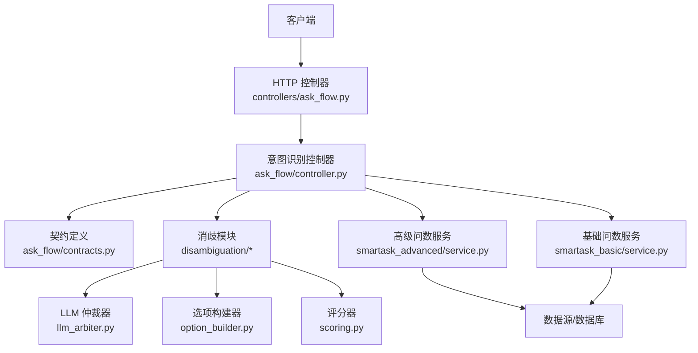
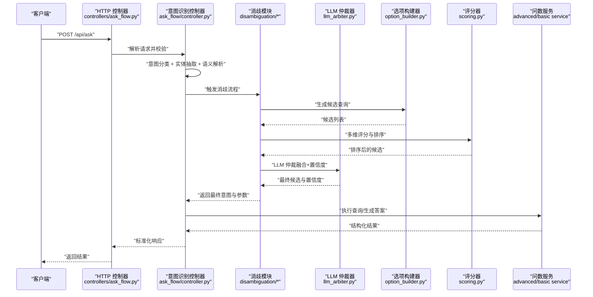
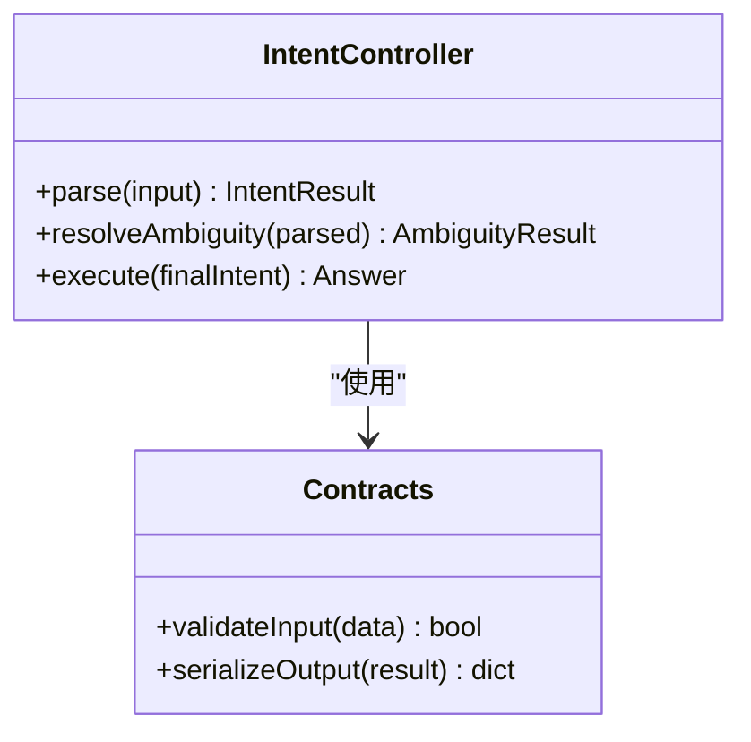
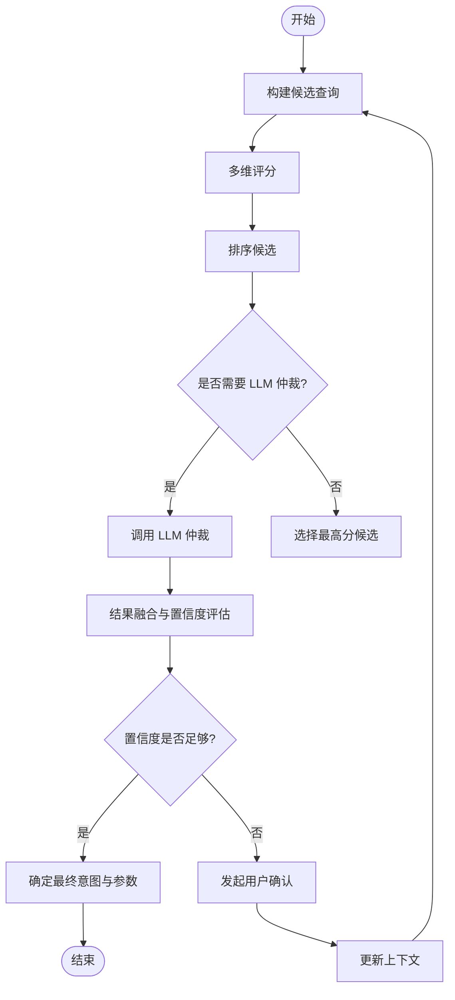
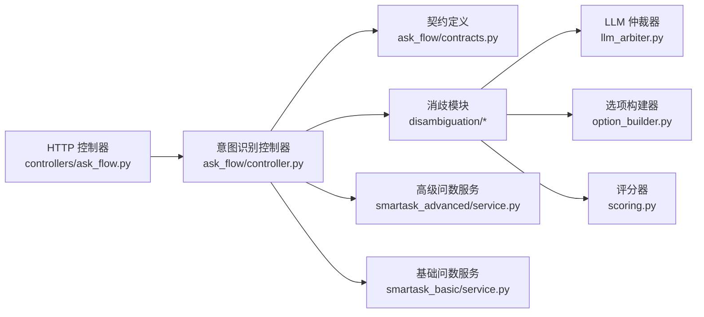

# 查询意图识别接口

<cite>
**本文引用的文件**   
- [backend/controllers/ask_flow.py](file://backend/controllers/ask_flow.py)
- [backend/ask_flow/controller.py](file://backend/ask_flow/controller.py)
- [backend/ask_flow/contracts.py](file://backend/ask_flow/contracts.py)
- [backend/disambiguation/llm_arbiter.py](file://backend/disambiguation/llm_arbiter.py)
- [backend/disambiguation/option_builder.py](file://backend/disambiguation/option_builder.py)
- [backend/disambiguation/scoring.py](file://backend/disambiguation/scoring.py)
- [backend/smartask_advanced/service.py](file://backend/smartask_advanced/service.py)
- [backend/smartask_basic/service.py](file://backend/smartask_basic/service.py)
- [backend/app.py](file://backend/app.py)
</cite>

## 目录
1. [简介](#简介)
2. [项目结构](#项目结构)
3. [核心组件](#核心组件)
4. [架构总览](#架构总览)
5. [详细组件分析](#详细组件分析)
6. [依赖关系分析](#依赖关系分析)
7. [性能考量](#性能考量)
8. [故障排查指南](#故障排查指南)
9. [结论](#结论)
10. [附录](#附录)

## 简介
本文件为 SmartAsk 查询意图识别功能的 API 文档，聚焦自然语言理解（NLU）能力：意图分类、实体抽取与语义解析；并详细说明消歧处理机制（多义性处理、上下文理解、用户确认流程）、选项构建接口（候选查询生成、评分算法、排序策略）、LLM 仲裁器接口（模型调用、结果融合、置信度评估）。同时提供完整的意图识别示例（模糊查询、复合意图、领域特定表达），以及自定义意图扩展方法与训练数据格式要求。

## 项目结构
SmartAsk 的意图识别相关代码主要分布在以下模块：
- ask_flow：意图识别主流程控制器与契约定义
- disambiguation：消歧模块（LLM 仲裁器、选项构建、评分）
- smartask_advanced / smartask_basic：高级与基础问数服务（用于路由与执行）
- controllers：HTTP 控制器入口（对外暴露 API）
- app：应用启动与路由注册

图表来源 
- [backend/controllers/ask_flow.py](file://backend/controllers/ask_flow.py)
- [backend/ask_flow/controller.py](file://backend/ask_flow/controller.py)
- [backend/ask_flow/contracts.py](file://backend/ask_flow/contracts.py)
- [backend/disambiguation/llm_arbiter.py](file://backend/disambiguation/llm_arbiter.py)
- [backend/disambiguation/option_builder.py](file://backend/disambiguation/option_builder.py)
- [backend/disambiguation/scoring.py](file://backend/disambiguation/scoring.py)
- [backend/smartask_advanced/service.py](file://backend/smartask_advanced/service.py)
- [backend/smartask_basic/service.py](file://backend/smartask_basic/service.py)

章节来源
- [backend/controllers/ask_flow.py](file://backend/controllers/ask_flow.py)
- [backend/ask_flow/controller.py](file://backend/ask_flow/controller.py)
- [backend/ask_flow/contracts.py](file://backend/ask_flow/contracts.py)
- [backend/disambiguation/llm_arbiter.py](file://backend/disambiguation/llm_arbiter.py)
- [backend/disambiguation/option_builder.py](file://backend/disambiguation/option_builder.py)
- [backend/disambiguation/scoring.py](file://backend/disambiguation/scoring.py)
- [backend/smartask_advanced/service.py](file://backend/smartask_advanced/service.py)
- [backend/smartask_basic/service.py](file://backend/smartask_basic/service.py)

## 核心组件
- 意图识别控制器（ask_flow/controller.py）：接收用户输入，组织 NLU 管线（意图分类、实体抽取、语义解析），驱动消歧与选项构建，协调 LLM 仲裁器进行最终决策。
- 契约定义（ask_flow/contracts.py）：统一数据结构与校验规则，确保各阶段输入输出一致。
- 消歧模块（disambiguation/*）：
  - LLM 仲裁器（llm_arbiter.py）：调用大模型对候选方案进行仲裁，融合多路结果并给出置信度。
  - 选项构建器（option_builder.py）：基于意图与实体生成候选查询（SQL/DSL），支持模板填充与约束注入。
  - 评分器（scoring.py）：对候选方案进行多维评分（相关性、覆盖率、可执行性等），并排序。
- 问数服务（smartask_advanced/service.py, smartask_basic/service.py）：根据最终意图与参数执行查询或返回结构化答案。
- HTTP 控制器（controllers/ask_flow.py）：对外暴露 REST 接口，负责鉴权、参数校验、请求分发与响应封装。

章节来源
- [backend/ask_flow/controller.py](file://backend/ask_flow/controller.py)
- [backend/ask_flow/contracts.py](file://backend/ask_flow/contracts.py)
- [backend/disambiguation/llm_arbiter.py](file://backend/disambiguation/llm_arbiter.py)
- [backend/disambiguation/option_builder.py](file://backend/disambiguation/option_builder.py)
- [backend/disambiguation/scoring.py](file://backend/disambiguation/scoring.py)
- [backend/smartask_advanced/service.py](file://backend/smartask_advanced/service.py)
- [backend/smartask_basic/service.py](file://backend/smartask_basic/service.py)
- [backend/controllers/ask_flow.py](file://backend/controllers/ask_flow.py)

## 架构总览
下图展示从用户输入到最终答案的端到端流程，包括 NLU、消歧、选项构建、评分与 LLM 仲裁。

图表来源 
- [backend/controllers/ask_flow.py](file://backend/controllers/ask_flow.py)
- [backend/ask_flow/controller.py](file://backend/ask_flow/controller.py)
- [backend/disambiguation/llm_arbiter.py](file://backend/disambiguation/llm_arbiter.py)
- [backend/disambiguation/option_builder.py](file://backend/disambiguation/option_builder.py)
- [backend/disambiguation/scoring.py](file://backend/disambiguation/scoring.py)
- [backend/smartask_advanced/service.py](file://backend/smartask_advanced/service.py)
- [backend/smartask_basic/service.py](file://backend/smartask_basic/service.py)

## 详细组件分析

### 意图识别控制器（ask_flow/controller.py）
职责与流程：
- 接收原始自然语言输入，调用 NLU 子模块完成意图分类、实体抽取与语义解析。
- 将解析结果传递给消歧模块，生成候选并评分，必要时触发用户确认。
- 协调 LLM 仲裁器进行最终裁决，输出结构化意图与参数。

关键要点：
- 输入校验遵循 contracts.py 定义的契约。
- 支持多轮对话上下文，保留历史消息以增强消歧准确性。
- 错误路径包含重试与降级策略（如回退至基础问数服务）。

章节来源
- [backend/ask_flow/controller.py](file://backend/ask_flow/controller.py)
- [backend/ask_flow/contracts.py](file://backend/ask_flow/contracts.py)

#### 类图（意图识别控制器与契约）

图表来源 
- [backend/ask_flow/controller.py](file://backend/ask_flow/controller.py)
- [backend/ask_flow/contracts.py](file://backend/ask_flow/contracts.py)

### 消歧模块（disambiguation/*）
- 选项构建器（option_builder.py）：根据意图与实体生成多个候选查询（SQL/DSL），支持模板填充、条件组合与约束注入。
- 评分器（scoring.py）：对候选进行多维度评分（语义匹配、数据覆盖、可执行性、业务合理性等），并按分数排序。
- LLM 仲裁器（llm_arbiter.py）：调用大模型对候选进行仲裁，融合多路结果并计算置信度，必要时提出澄清问题。

图表来源 
- [backend/disambiguation/option_builder.py](file://backend/disambiguation/option_builder.py)
- [backend/disambiguation/scoring.py](file://backend/disambiguation/scoring.py)
- [backend/disambiguation/llm_arbiter.py](file://backend/disambiguation/llm_arbiter.py)

章节来源
- [backend/disambiguation/option_builder.py](file://backend/disambiguation/option_builder.py)
- [backend/disambiguation/scoring.py](file://backend/disambiguation/scoring.py)
- [backend/disambiguation/llm_arbiter.py](file://backend/disambiguation/llm_arbiter.py)

### 选项构建接口（option_builder.py）
功能说明：
- 候选查询生成：基于意图模板与实体值构造 SQL/DSL，支持多表关联、聚合与过滤。
- 约束注入：自动注入权限、时间范围、维度层级等业务约束。
- 可扩展性：通过插件式模板引擎支持领域特定表达式。

评分与排序：
- 评分维度：语义相关性、数据覆盖率、可执行性、业务合理性、风险等级。
- 排序策略：加权求和或学习排序（可选），支持动态权重配置。

章节来源
- [backend/disambiguation/option_builder.py](file://backend/disambiguation/option_builder.py)
- [backend/disambiguation/scoring.py](file://backend/disambiguation/scoring.py)

### LLM 仲裁器接口（llm_arbiter.py）
功能说明：
- 模型调用：封装大模型 API 调用，支持多模型切换与超时控制。
- 结果融合：整合评分器、规则引擎与大模型判断，生成最终候选。
- 置信度评估：基于一致性、证据强度与历史准确率计算置信度。

交互流程：
- 当候选数量较多或置信度不足时，触发 LLM 仲裁。
- 仲裁失败或低置信度时，生成澄清问题引导用户确认。

章节来源
- [backend/disambiguation/llm_arbiter.py](file://backend/disambiguation/llm_arbiter.py)

### HTTP 控制器（controllers/ask_flow.py）
职责：
- 暴露 REST API 接口，处理用户请求与响应。
- 参数校验、鉴权、日志记录与错误码映射。
- 调用意图识别控制器并返回标准化结果。

接口规范（摘要）：
- POST /api/ask：提交自然语言查询，返回意图识别结果或澄清问题。
- 请求体：包含用户输入、会话 ID、可选上下文。
- 响应体：包含意图类型、实体列表、候选查询、置信度、澄清问题（如有）。

章节来源
- [backend/controllers/ask_flow.py](file://backend/controllers/ask_flow.py)
- [backend/app.py](file://backend/app.py)

## 依赖关系分析
意图识别模块依赖关系如下：

图表来源 
- [backend/controllers/ask_flow.py](file://backend/controllers/ask_flow.py)
- [backend/ask_flow/controller.py](file://backend/ask_flow/controller.py)
- [backend/ask_flow/contracts.py](file://backend/ask_flow/contracts.py)
- [backend/disambiguation/llm_arbiter.py](file://backend/disambiguation/llm_arbiter.py)
- [backend/disambiguation/option_builder.py](file://backend/disambiguation/option_builder.py)
- [backend/disambiguation/scoring.py](file://backend/disambiguation/scoring.py)
- [backend/smartask_advanced/service.py](file://backend/smartask_advanced/service.py)
- [backend/smartask_basic/service.py](file://backend/smartask_basic/service.py)

章节来源
- [backend/controllers/ask_flow.py](file://backend/controllers/ask_flow.py)
- [backend/ask_flow/controller.py](file://backend/ask_flow/controller.py)
- [backend/ask_flow/contracts.py](file://backend/ask_flow/contracts.py)
- [backend/disambiguation/llm_arbiter.py](file://backend/disambiguation/llm_arbiter.py)
- [backend/disambiguation/option_builder.py](file://backend/disambiguation/option_builder.py)
- [backend/disambiguation/scoring.py](file://backend/disambiguation/scoring.py)
- [backend/smartask_advanced/service.py](file://backend/smartask_advanced/service.py)
- [backend/smartask_basic/service.py](file://backend/smartask_basic/service.py)

## 性能考量
- 缓存策略：对高频意图与实体组合进行缓存，减少重复计算。
- 异步处理：LLM 调用与评分过程可异步化，提升吞吐。
- 流式响应：长耗时任务采用 SSE 或 WebSocket 推送中间状态。
- 资源限制：设置超时、重试上限与熔断机制，避免雪崩。

[本节为通用指导，不直接分析具体文件]

## 故障排查指南
常见问题与定位方法：
- 意图分类错误：检查输入预处理、意图库覆盖度与阈值设置。
- 实体抽取缺失：验证命名实体词典与正则规则，补充领域术语。
- 消歧循环：检查上下文更新逻辑与用户确认终止条件。
- LLM 仲裁失败：查看模型调用日志、网络状态与配额限制。
- 评分异常：核对评分权重配置与候选质量。

章节来源
- [backend/ask_flow/controller.py](file://backend/ask_flow/controller.py)
- [backend/disambiguation/llm_arbiter.py](file://backend/disambiguation/llm_arbiter.py)
- [backend/disambiguation/scoring.py](file://backend/disambiguation/scoring.py)

## 结论
SmartAsk 的查询意图识别系统通过模块化设计实现了高内聚、低耦合的 NLU 能力。意图分类、实体抽取与语义解析由控制器统一管理，消歧模块提供灵活的候选生成、评分与 LLM 仲裁机制。HTTP 控制器确保接口稳定与易用。建议在生产环境中启用缓存、异步与监控，以提升性能与可靠性。

[本节为总结性内容，不直接分析具体文件]

## 附录

### 意图识别示例
- 模糊查询：“最近销售额怎么样？”
  - 意图：销售趋势分析
  - 实体：时间范围（最近）、指标（销售额）
  - 消歧：若“最近”不明确，触发用户确认（如“过去7天”或“本月”）
- 复合意图：“对比华东和华南的利润差异”
  - 意图：区域对比分析
  - 实体：地区（华东、华南）、指标（利润）
  - 消歧：若地区别名存在歧义，使用 LLM 仲裁确认
- 领域特定表达：“毛利率低于 20% 的产品有哪些？”
  - 意图：产品筛选
  - 实体：指标（毛利率）、阈值（20%）
  - 消歧：若“产品”维度不明确，结合上下文或提示用户选择

[本节为概念性示例，不直接分析具体文件]

### 自定义意图扩展方法
- 新增意图类别：在意图库中添加新类别与描述。
- 定义实体模板：为新意图定义实体抽取规则与约束。
- 实现选项构建：编写对应的查询模板与参数映射。
- 调整评分权重：根据业务需求优化评分维度与权重。
- 训练数据格式：
  - 输入：自然语言句子
  - 标签：意图类别、实体边界与类型、语义角色
  - 格式：JSON Lines，每行一个样本，包含字段如 text、intent、entities、roles

[本节为通用指导，不直接分析具体文件]