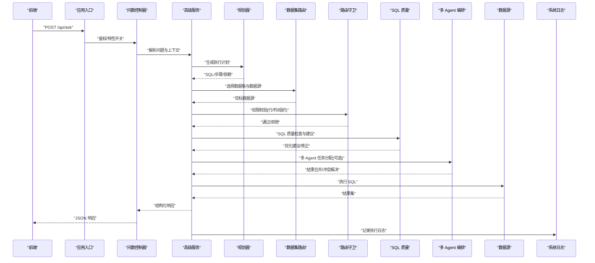
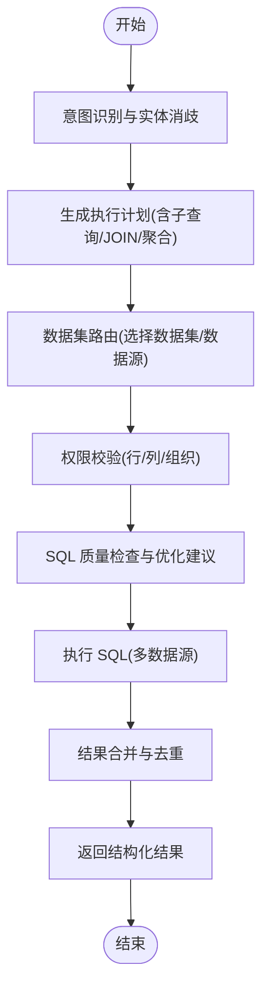
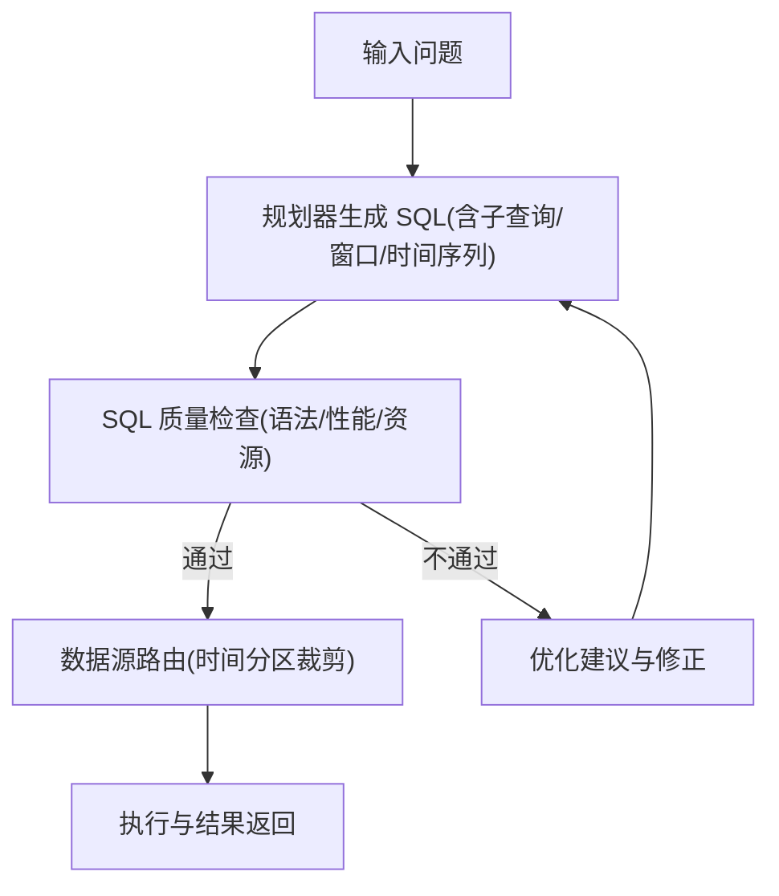
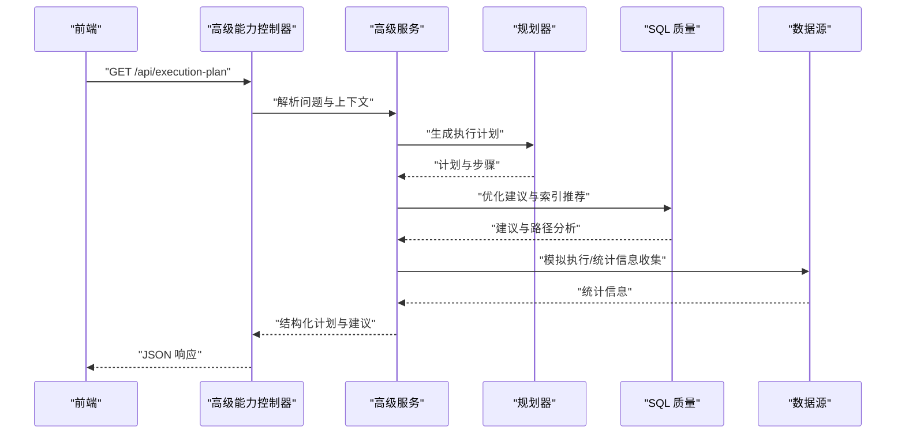
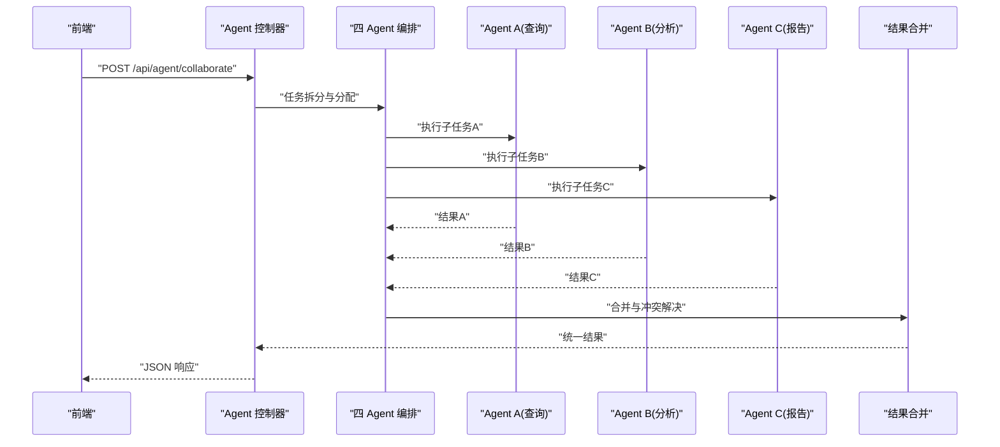
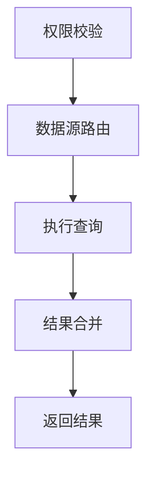
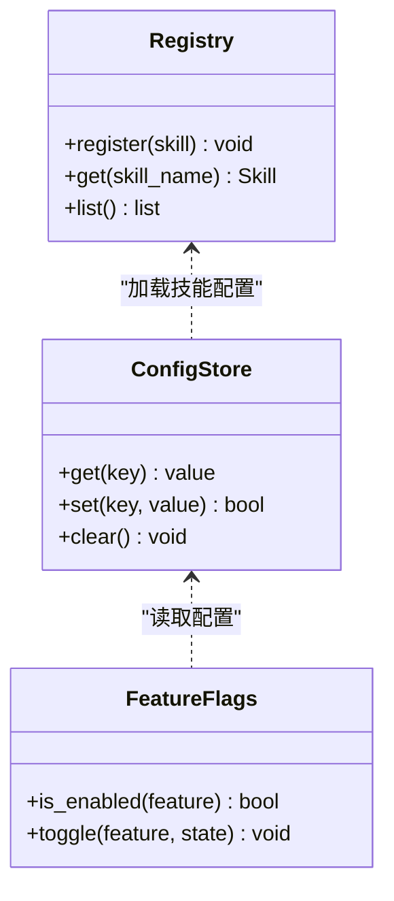
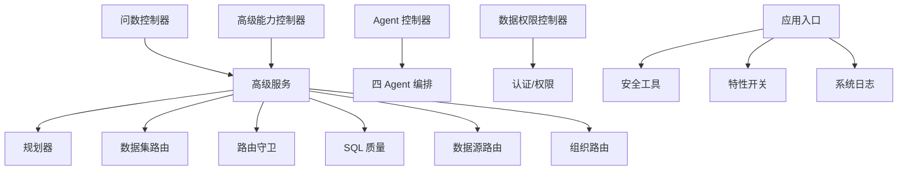

# 高级问数接口

<cite>
**本文引用的文件**   
- [backend/app.py](file://backend/app.py)
- [backend/controllers/ask_flow.py](file://backend/controllers/ask_flow.py)
- [backend/controllers/advanced_capabilities.py](file://backend/controllers/advanced_capabilities.py)
- [backend/controllers/agents.py](file://backend/controllers/agents.py)
- [backend/controllers/data_permissions.py](file://backend/controllers/data_permissions.py)
- [backend/datasource_router.py](file://backend/datasource_router.py)
- [backend/smartask_advanced/service.py](file://backend/smartask_advanced/service.py)
- [backend/smartask_advanced/config_store.py](file://backend/smartask_advanced/config_store.py)
- [backend/smartask_advanced/registry.py](file://backend/smartask_advanced/registry.py)
- [backend/smartask_advanced/skills/planner.py](file://backend/smartask_advanced/skills/planner.py)
- [backend/smartask_advanced/skills/dataset_route.py](file://backend/smartask_advanced/skills/dataset_route.py)
- [backend/smartask_advanced/skills/route_guard.py](file://backend/smartask_advanced/skills/route_guard.py)
- [backend/smartask_advanced/skills/sql_quality.py](file://backend/smartask_advanced/skills/sql_quality.py)
- [backend/smartask_basic/service.py](file://backend/smartask_basic/service.py)
- [backend/four_agent_ask.py](file://backend/four_agent_ask.py)
- [backend/vanna_core.py](file://backend/vanna_core.py)
- [backend/organization_route_resolver.py](file://backend/organization_route_resolver.py)
- [backend/feature_flags.py](file://backend/feature_flags.py)
- [backend/security.py](file://backend/security.py)
- [backend/auth_store.py](file://backend/auth_store.py)
- [backend/data_permission_store.py](file://backend/data_permission_store.py)
- [backend/rbac_store.py](file://backend/rbac_store.py)
- [backend/system_log_store.py](file://backend/system_log_store.py)
- [frontend/src/api/index.js](file://frontend/src/api/index.js)
</cite>

## 目录
1. [简介](#简介)
2. [项目结构](#项目结构)
3. [核心组件](#核心组件)
4. [架构总览](#架构总览)
5. [详细组件分析](#详细组件分析)
6. [依赖关系分析](#依赖关系分析)
7. [性能考虑](#性能考虑)
8. [故障排查指南](#故障排查指南)
9. [结论](#结论)
10. [附录](#附录)

## 简介
本文件为 SmartAsk 高级问数功能的 API 文档，聚焦跨数据集查询、多表关联、数据路由与权限控制；覆盖复杂 SQL（子查询、窗口函数、时间序列分析）的处理流程；记录执行计划生成接口（优化建议、索引推荐、执行路径分析）；说明智能体协作（多 Agent 任务分配、结果合并、冲突解决）；并提供销售分析、用户行为追踪、财务报表等完整业务示例。同时给出高级功能配置项与性能调优参数，帮助开发者快速集成与优化。

## 项目结构
后端以模块化控制器与服务为核心：
- 控制器层：负责 HTTP 请求解析、鉴权、路由到具体服务。
- 服务层：高级问数编排、基础问数执行、Agent 协作、SQL 质量检查、数据源路由、组织路由等。
- 存储层：认证、权限、RBAC、系统日志等持久化。
- 前端：API 调用封装与页面交互。

```mermaid
graph TB
FE["前端<br/>frontend/src/api/index.js"] --> APP["应用入口<br/>backend/app.py"]
APP --> CTRL_AF["问数控制器<br/>backend/controllers/ask_flow.py"]
APP --> CTRL_AC["高级能力控制器<br/>backend/controllers/advanced_capabilities.py"]
APP --> CTRL_AG["Agent 控制器<br/>backend/controllers/agents.py"]
APP --> CTRL_DP["数据权限控制器<br/>backend/controllers/data_permissions.py"]
CTRL_AF --> SVC_ADV["高级服务<br/>backend/smartask_advanced/service.py"]
CTRL_AF --> SVC_BASIC["基础服务<br/>backend/smartask_basic/service.py"]
SVC_ADV --> PLANNER["规划器<br/>backend/smartask_advanced/skills/planner.py"]
SVC_ADV --> ROUTE["数据集路由<br/>backend/smartask_advanced/skills/dataset_route.py"]
SVC_ADV --> GUARD["路由守卫<br/>backend/smartask_advanced/skills/route_guard.py"]
SVC_ADV --> SQLQ["SQL 质量<br/>backend/smartask_advanced/skills/sql_quality.py"]
SVC_ADV --> REG["技能注册表<br/>backend/smartask_advanced/registry.py"]
SVC_ADV --> CFG["配置存储<br/>backend/smartask_advanced/config_store.py"]
SVC_ADV --> DSR["数据源路由<br/>backend/datasource_router.py"]
SVC_ADV --> ORG["组织路由<br/>backend/organization_route_resolver.py"]
CTRL_AG --> FOUR["四 Agent 编排<br/>backend/four_agent_ask.py"]
SVC_BASIC --> VANN["Vanna 核心<br/>backend/vanna_core.py"]
CTRL_DP --> AUTH["认证/权限<br/>backend/auth_store.py, backend/data_permission_store.py, backend/rbac_store.py"]
APP --> SEC["安全工具<br/>backend/security.py"]
APP --> FF["特性开关<br/>backend/feature_flags.py"]
APP --> LOG["系统日志<br/>backend/system_log_store.py"]
```

图表来源
- [backend/app.py](file://backend/app.py)
- [backend/controllers/ask_flow.py](file://backend/controllers/ask_flow.py)
- [backend/controllers/advanced_capabilities.py](file://backend/controllers/advanced_capabilities.py)
- [backend/controllers/agents.py](file://backend/controllers/agents.py)
- [backend/controllers/data_permissions.py](file://backend/controllers/data_permissions.py)
- [backend/smartask_advanced/service.py](file://backend/smartask_advanced/service.py)
- [backend/smartask_basic/service.py](file://backend/smartask_basic/service.py)
- [backend/datasource_router.py](file://backend/datasource_router.py)
- [backend/organization_route_resolver.py](file://backend/organization_route_resolver.py)
- [backend/feature_flags.py](file://backend/feature_flags.py)
- [backend/security.py](file://backend/security.py)
- [backend/auth_store.py](file://backend/auth_store.py)
- [backend/data_permission_store.py](file://backend/data_permission_store.py)
- [backend/rbac_store.py](file://backend/rbac_store.py)
- [backend/system_log_store.py](file://backend/system_log_store.py)
- [frontend/src/api/index.js](file://frontend/src/api/index.js)

章节来源
- [backend/app.py](file://backend/app.py)
- [frontend/src/api/index.js](file://frontend/src/api/index.js)

## 核心组件
- 问数控制器（ask_flow）：统一接收“问题”输入，进行意图识别、路由选择、权限校验、执行与结果聚合。
- 高级能力控制器（advanced_capabilities）：暴露执行计划、优化建议、索引推荐、执行路径分析等高级接口。
- Agent 控制器（agents）：管理多 Agent 协作、任务分发、结果合并与冲突解决。
- 数据权限控制器（data_permissions）：处理行级/列级权限、租户隔离、组织维度过滤。
- 高级服务（smartask_advanced/service）：编排规划器、路由守卫、SQL 质量检查、技能注册与配置管理。
- 基础服务（smartask_basic/service）：轻量问数执行，对接 Vanna 核心。
- 数据源路由（datasource_router）：按数据集/组织/标签将查询路由至不同数据源。
- 组织路由（organization_route_resolver）：基于组织架构树进行数据访问范围限定。
- 特性开关（feature_flags）：控制高级能力的启用与灰度发布。
- 安全与认证（security, auth_store, data_permission_store, rbac_store）：鉴权、授权、审计。
- 系统日志（system_log_store）：记录关键操作与错误信息。

章节来源
- [backend/controllers/ask_flow.py](file://backend/controllers/ask_flow.py)
- [backend/controllers/advanced_capabilities.py](file://backend/controllers/advanced_capabilities.py)
- [backend/controllers/agents.py](file://backend/controllers/agents.py)
- [backend/controllers/data_permissions.py](file://backend/controllers/data_permissions.py)
- [backend/smartask_advanced/service.py](file://backend/smartask_advanced/service.py)
- [backend/smartask_basic/service.py](file://backend/smartask_basic/service.py)
- [backend/datasource_router.py](file://backend/datasource_router.py)
- [backend/organization_route_resolver.py](file://backend/organization_route_resolver.py)
- [backend/feature_flags.py](file://backend/feature_flags.py)
- [backend/security.py](file://backend/security.py)
- [backend/auth_store.py](file://backend/auth_store.py)
- [backend/data_permission_store.py](file://backend/data_permission_store.py)
- [backend/rbac_store.py](file://backend/rbac_store.py)
- [backend/system_log_store.py](file://backend/system_log_store.py)

## 架构总览
高级问数的端到端流程如下：
- 前端通过 API 发起“问题”请求。
- 应用入口进行鉴权与特性开关检查。
- 控制器解析请求并委派给高级或基础服务。
- 高级服务根据意图与上下文生成执行计划，选择数据集与数据源，进行权限校验。
- 规划器产出 SQL（支持子查询、窗口函数、时间序列），SQL 质量模块进行校验与优化建议。
- 多 Agent 协作时，任务被拆分并行执行，结果合并与冲突解决后返回。
- 系统记录执行日志与审计信息。

图表来源
- [backend/app.py](file://backend/app.py)
- [backend/controllers/ask_flow.py](file://backend/controllers/ask_flow.py)
- [backend/smartask_advanced/service.py](file://backend/smartask_advanced/service.py)
- [backend/smartask_advanced/skills/planner.py](file://backend/smartask_advanced/skills/planner.py)
- [backend/smartask_advanced/skills/dataset_route.py](file://backend/smartask_advanced/skills/dataset_route.py)
- [backend/smartask_advanced/skills/route_guard.py](file://backend/smartask_advanced/skills/route_guard.py)
- [backend/smartask_advanced/skills/sql_quality.py](file://backend/smartask_advanced/skills/sql_quality.py)
- [backend/four_agent_ask.py](file://backend/four_agent_ask.py)
- [backend/system_log_store.py](file://backend/system_log_store.py)

## 详细组件分析

### 跨数据集查询与多表关联
- 能力概述：支持跨数据集的字段对齐、关联键推断、自动 JOIN 策略选择与去重。
- 关键流程：
  - 意图识别与实体消歧，确定涉及的指标与维度。
  - 规划器生成多步执行计划，包含子查询与中间结果物化。
  - 数据集路由选择合适的数据集与数据源，必要时进行分库分表路由。
  - 路由守卫进行行列级权限校验与组织维度过滤。
  - SQL 质量模块对 JOIN 条件、聚合粒度、窗口函数进行校验与优化。
- 典型场景：销售分析（订单×商品×客户）、用户行为追踪（事件×会话×用户画像）、财务报表（科目×凭证×账簿）。

图表来源
- [backend/smartask_advanced/skills/planner.py](file://backend/smartask_advanced/skills/planner.py)
- [backend/smartask_advanced/skills/dataset_route.py](file://backend/smartask_advanced/skills/dataset_route.py)
- [backend/smartask_advanced/skills/route_guard.py](file://backend/smartask_advanced/skills/route_guard.py)
- [backend/smartask_advanced/skills/sql_quality.py](file://backend/smartask_advanced/skills/sql_quality.py)

章节来源
- [backend/smartask_advanced/skills/planner.py](file://backend/smartask_advanced/skills/planner.py)
- [backend/smartask_advanced/skills/dataset_route.py](file://backend/smartask_advanced/skills/dataset_route.py)
- [backend/smartask_advanced/skills/route_guard.py](file://backend/smartask_advanced/skills/route_guard.py)
- [backend/smartask_advanced/skills/sql_quality.py](file://backend/smartask_advanced/skills/sql_quality.py)

### 复杂查询场景（子查询、窗口函数、时间序列分析）
- 子查询：用于中间结果物化、过滤前置、聚合前预处理。
- 窗口函数：实现排名、累计求和、移动平均、同比环比计算。
- 时间序列分析：按时间粒度聚合、趋势检测、异常点识别。
- 处理要点：
  - 规划器在生成 SQL 时确保窗口分区与排序正确。
  - SQL 质量模块检查窗口函数性能与资源消耗。
  - 数据源路由针对时间分区表进行裁剪与优化。

图表来源
- [backend/smartask_advanced/skills/planner.py](file://backend/smartask_advanced/skills/planner.py)
- [backend/smartask_advanced/skills/sql_quality.py](file://backend/smartask_advanced/skills/sql_quality.py)
- [backend/datasource_router.py](file://backend/datasource_router.py)

章节来源
- [backend/smartask_advanced/skills/planner.py](file://backend/smartask_advanced/skills/planner.py)
- [backend/smartask_advanced/skills/sql_quality.py](file://backend/smartask_advanced/skills/sql_quality.py)
- [backend/datasource_router.py](file://backend/datasource_router.py)

### 执行计划生成接口（优化建议、索引推荐、执行路径分析）
- 接口职责：
  - 生成可执行的 SQL 计划与步骤图。
  - 提供优化建议（如改写 JOIN、减少扫描、使用物化视图）。
  - 推荐索引以提升查询性能。
  - 输出执行路径分析（各阶段耗时、瓶颈定位）。
- 调用流程：
  - 前端调用高级能力控制器获取执行计划。
  - 服务层调用规划器与 SQL 质量模块生成计划与建议。
  - 返回结构化 JSON（计划、建议、索引推荐、路径分析）。

图表来源
- [backend/controllers/advanced_capabilities.py](file://backend/controllers/advanced_capabilities.py)
- [backend/smartask_advanced/service.py](file://backend/smartask_advanced/service.py)
- [backend/smartask_advanced/skills/planner.py](file://backend/smartask_advanced/skills/planner.py)
- [backend/smartask_advanced/skills/sql_quality.py](file://backend/smartask_advanced/skills/sql_quality.py)

章节来源
- [backend/controllers/advanced_capabilities.py](file://backend/controllers/advanced_capabilities.py)
- [backend/smartask_advanced/service.py](file://backend/smartask_advanced/service.py)
- [backend/smartask_advanced/skills/planner.py](file://backend/smartask_advanced/skills/planner.py)
- [backend/smartask_advanced/skills/sql_quality.py](file://backend/smartask_advanced/skills/sql_quality.py)

### 智能体协作接口（多 Agent 任务分配、结果合并、冲突解决）
- 能力概述：将复杂问题拆分为多个子任务，由不同 Agent 并行执行，最终合并结果并解决冲突。
- 关键流程：
  - 控制器接收请求，交由四 Agent 编排模块进行任务拆分。
  - 各 Agent 独立执行子任务（查询、分析、报告生成）。
  - 结果合并模块进行一致性校验与冲突解决（如指标口径不一致）。
  - 返回统一的结构化结果。

图表来源
- [backend/controllers/agents.py](file://backend/controllers/agents.py)
- [backend/four_agent_ask.py](file://backend/four_agent_ask.py)

章节来源
- [backend/controllers/agents.py](file://backend/controllers/agents.py)
- [backend/four_agent_ask.py](file://backend/four_agent_ask.py)

### 权限控制与数据路由
- 权限控制：
  - 行级权限：基于组织、角色、用户维度过滤数据。
  - 列级权限：隐藏敏感字段或进行脱敏。
  - 租户隔离：不同租户数据严格隔离。
- 数据路由：
  - 按数据集标签、组织、数据源类型进行路由。
  - 支持读写分离与多数据源并发查询。

图表来源
- [backend/controllers/data_permissions.py](file://backend/controllers/data_permissions.py)
- [backend/datasource_router.py](file://backend/datasource_router.py)
- [backend/organization_route_resolver.py](file://backend/organization_route_resolver.py)

章节来源
- [backend/controllers/data_permissions.py](file://backend/controllers/data_permissions.py)
- [backend/datasource_router.py](file://backend/datasource_router.py)
- [backend/organization_route_resolver.py](file://backend/organization_route_resolver.py)

### 配置管理与特性开关
- 配置存储：集中管理高级问数的配置项（如最大并发、超时、缓存策略）。
- 特性开关：控制高级能力的启用与灰度发布。
- 技能注册表：动态加载与卸载技能模块。

图表来源
- [backend/smartask_advanced/config_store.py](file://backend/smartask_advanced/config_store.py)
- [backend/feature_flags.py](file://backend/feature_flags.py)
- [backend/smartask_advanced/registry.py](file://backend/smartask_advanced/registry.py)

章节来源
- [backend/smartask_advanced/config_store.py](file://backend/smartask_advanced/config_store.py)
- [backend/feature_flags.py](file://backend/feature_flags.py)
- [backend/smartask_advanced/registry.py](file://backend/smartask_advanced/registry.py)

## 依赖关系分析
- 控制器依赖服务层，服务层依赖技能模块与外部数据源。
- 权限与认证模块贯穿整个链路，确保安全访问。
- 系统日志记录所有关键操作，便于审计与排错。

图表来源
- [backend/controllers/ask_flow.py](file://backend/controllers/ask_flow.py)
- [backend/controllers/advanced_capabilities.py](file://backend/controllers/advanced_capabilities.py)
- [backend/controllers/agents.py](file://backend/controllers/agents.py)
- [backend/controllers/data_permissions.py](file://backend/controllers/data_permissions.py)
- [backend/smartask_advanced/service.py](file://backend/smartask_advanced/service.py)
- [backend/datasource_router.py](file://backend/datasource_router.py)
- [backend/organization_route_resolver.py](file://backend/organization_route_resolver.py)
- [backend/security.py](file://backend/security.py)
- [backend/feature_flags.py](file://backend/feature_flags.py)
- [backend/system_log_store.py](file://backend/system_log_store.py)

章节来源
- [backend/controllers/ask_flow.py](file://backend/controllers/ask_flow.py)
- [backend/controllers/advanced_capabilities.py](file://backend/controllers/advanced_capabilities.py)
- [backend/controllers/agents.py](file://backend/controllers/agents.py)
- [backend/controllers/data_permissions.py](file://backend/controllers/data_permissions.py)
- [backend/smartask_advanced/service.py](file://backend/smartask_advanced/service.py)
- [backend/datasource_router.py](file://backend/datasource_router.py)
- [backend/organization_route_resolver.py](file://backend/organization_route_resolver.py)
- [backend/security.py](file://backend/security.py)
- [backend/feature_flags.py](file://backend/feature_flags.py)
- [backend/system_log_store.py](file://backend/system_log_store.py)

## 性能考虑
- 查询优化：
  - 使用物化视图与中间结果缓存减少重复计算。
  - 合理设计索引与分区表提升查询效率。
  - 避免全表扫描与大表 JOIN，优先使用预聚合。
- 并发与资源：
  - 限制最大并发数与超时时间，防止资源耗尽。
  - 使用连接池与异步执行提升吞吐量。
- 监控与告警：
  - 记录慢查询与异常，设置阈值告警。
  - 定期分析执行计划，持续优化。

[本节为通用指导，无需特定文件引用]

## 故障排查指南
- 常见问题：
  - 权限不足：检查用户角色与数据权限配置。
  - 数据源不可达：验证数据源连接与网络配置。
  - SQL 执行失败：查看 SQL 质量模块的建议与错误日志。
  - 结果不一致：检查多 Agent 结果合并逻辑与冲突解决策略。
- 调试步骤：
  - 启用详细日志，记录每个阶段的输入输出。
  - 使用执行计划接口分析瓶颈。
  - 逐步缩小问题范围，定位具体模块。

章节来源
- [backend/system_log_store.py](file://backend/system_log_store.py)
- [backend/smartask_advanced/skills/sql_quality.py](file://backend/smartask_advanced/skills/sql_quality.py)
- [backend/four_agent_ask.py](file://backend/four_agent_ask.py)

## 结论
SmartAsk 高级问数功能提供了强大的跨数据集查询、复杂 SQL 处理、执行计划优化与多 Agent 协作能力。通过模块化设计与严格的权限控制，能够满足销售分析、用户行为追踪、财务报表等复杂业务场景的需求。结合性能调优与故障排查指南，开发者可以快速集成与优化，提升用户体验与系统稳定性。

[本节为总结，无需特定文件引用]

## 附录
- 业务示例：
  - 销售分析：订单×商品×客户的多表关联，按时间维度进行趋势分析。
  - 用户行为追踪：事件×会话×用户画像的关联，进行漏斗分析与留存率计算。
  - 财务报表生成：科目×凭证×账簿的关联，生成资产负债表与利润表。
- 配置选项：
  - 最大并发数、超时时间、缓存策略、技能开关等。
- 性能调优参数：
  - 连接池大小、查询超时、内存限制、索引推荐策略等。

[本节为补充信息，无需特定文件引用]