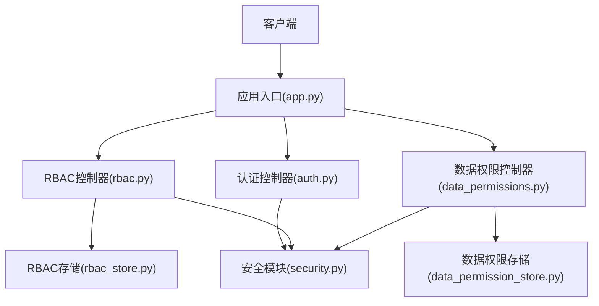
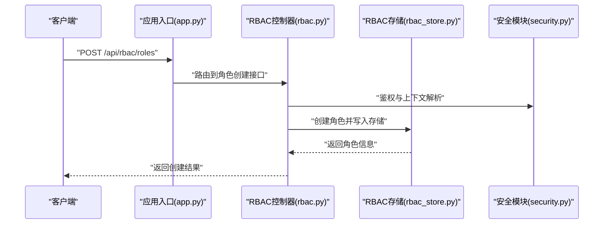
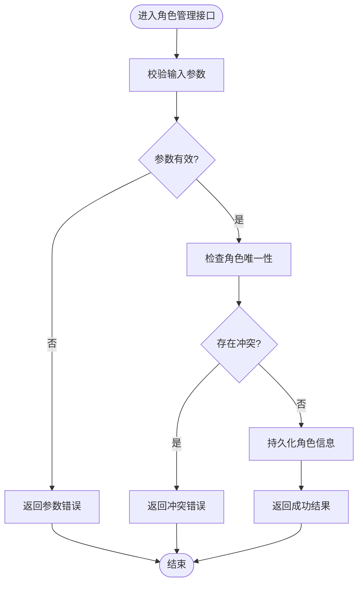
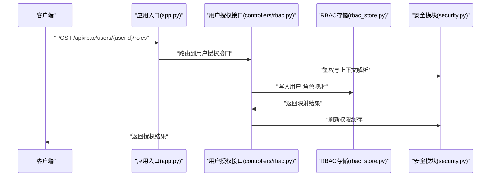
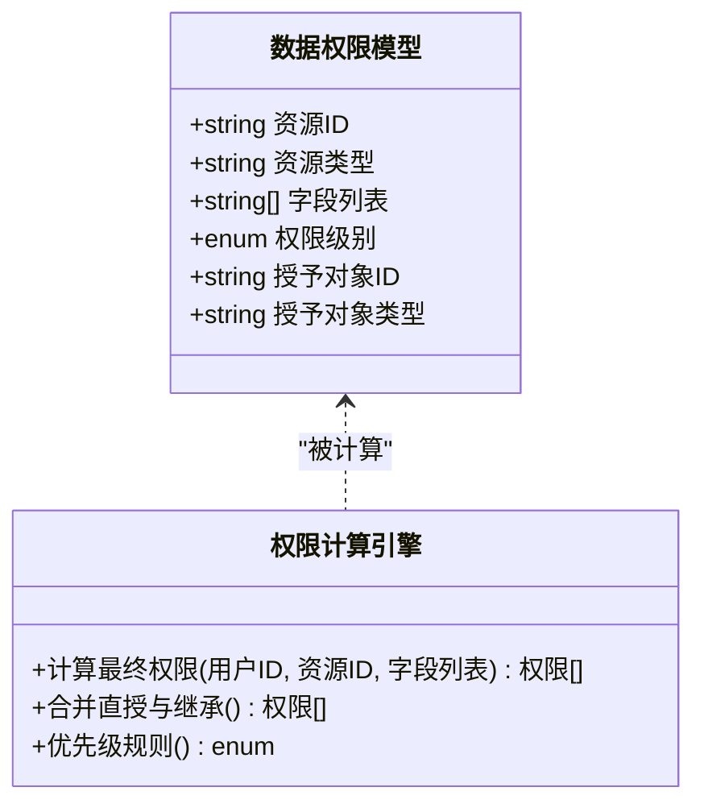
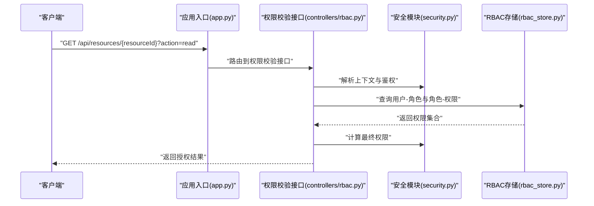
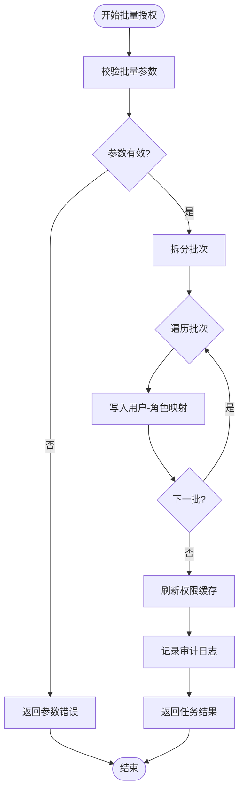
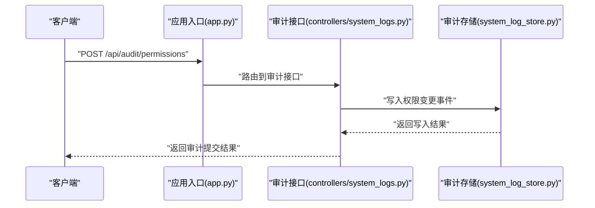
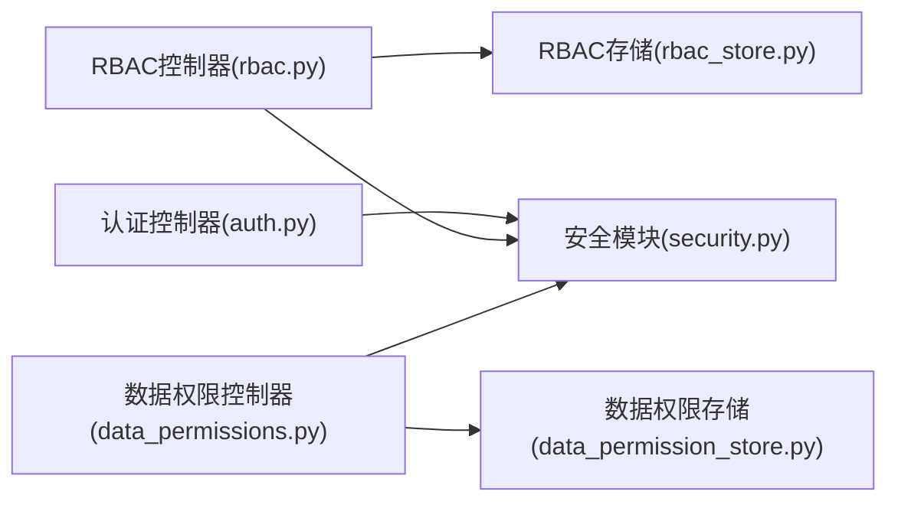

# RBAC权限管理接口

<cite>
**本文引用的文件**   
- [rbac.py](file://backend/controllers/rbac.py)
- [rbac_store.py](file://backend/rbac_store.py)
- [data_permissions.py](file://backend/controllers/data_permissions.py)
- [data_permission_store.py](file://backend/data_permission_store.py)
- [auth.py](file://backend/controllers/auth.py)
- [security.py](file://backend/security.py)
- [app.py](file://backend/app.py)
</cite>

## 目录
1. [简介](#简介)
2. [项目结构](#项目结构)
3. [核心组件](#核心组件)
4. [架构总览](#架构总览)
5. [详细组件分析](#详细组件分析)
6. [依赖关系分析](#依赖关系分析)
7. [性能考虑](#性能考虑)
8. [故障排查指南](#故障排查指南)
9. [结论](#结论)
10. [附录](#附录)

## 简介
本文件为 SmartAsk 平台的 RBAC（基于角色的访问控制）权限管理系统提供详细的 API 文档，覆盖角色管理、用户授权、字段级权限、权限继承与验证流程、批量权限管理、审计与合规检查、以及缓存策略与性能优化。读者可据此快速理解并集成权限相关接口，确保资源访问与操作授权的统一治理。

## 项目结构
RBAC 权限能力由控制器层、存储层与安全校验层共同实现：
- 控制器层：暴露 RESTful 接口，处理请求参数、调用服务/存储、返回响应。
- 存储层：负责角色、用户-角色、角色-权限、数据权限等持久化。
- 安全校验层：提供鉴权、权限判定、缓存与审计支持。

图表来源
- [app.py](file://backend/app.py)
- [rbac.py](file://backend/controllers/rbac.py)
- [data_permissions.py](file://backend/controllers/data_permissions.py)
- [auth.py](file://backend/controllers/auth.py)
- [rbac_store.py](file://backend/rbac_store.py)
- [data_permission_store.py](file://backend/data_permission_store.py)
- [security.py](file://backend/security.py)

章节来源
- [app.py](file://backend/app.py)
- [rbac.py](file://backend/controllers/rbac.py)
- [data_permissions.py](file://backend/controllers/data_permissions.py)
- [auth.py](file://backend/controllers/auth.py)
- [rbac_store.py](file://backend/rbac_store.py)
- [data_permission_store.py](file://backend/data_permission_store.py)
- [security.py](file://backend/security.py)

## 核心组件
- 角色管理接口：创建、更新、删除、查询角色；支持角色模板与批量应用。
- 用户授权接口：将角色分配给用户，支持批量授权与撤销。
- 数据权限接口：字段级权限控制，按资源维度（如数据集/表/列）进行细粒度授权。
- 权限校验接口：在业务请求中校验用户对资源的访问与操作权限。
- 审计与合规接口：记录权限变更事件，支持合规性检查与导出。
- 安全与缓存：统一鉴权、权限判定、缓存策略与性能优化。

章节来源
- [rbac.py](file://backend/controllers/rbac.py)
- [rbac_store.py](file://backend/rbac_store.py)
- [data_permissions.py](file://backend/controllers/data_permissions.py)
- [data_permission_store.py](file://backend/data_permission_store.py)
- [security.py](file://backend/security.py)

## 架构总览
RBAC 权限系统采用“控制器-存储-安全”三层解耦设计：
- 控制器层对外暴露标准 HTTP 接口，负责参数校验与响应封装。
- 存储层抽象角色、用户-角色、角色-权限、数据权限的 CRUD 与查询。
- 安全层提供统一的鉴权、权限判定、缓存与审计能力。

图表来源
- [app.py](file://backend/app.py)
- [rbac.py](file://backend/controllers/rbac.py)
- [rbac_store.py](file://backend/rbac_store.py)
- [security.py](file://backend/security.py)

## 详细组件分析

### 角色管理接口
- 功能范围
  - 创建角色：定义角色名称、描述、初始权限集合。
  - 更新角色：修改角色元信息与权限集合。
  - 删除角色：解除角色与用户/权限的关联后删除。
  - 查询角色：按条件分页查询、获取详情。
  - 角色模板：预置常用角色模板，支持批量应用至用户或组织。
- 关键流程
  - 创建/更新时校验唯一性与权限合法性。
  - 删除前执行关联清理（用户-角色、角色-权限）。
  - 模板应用时批量生成用户-角色映射与权限继承。
- 错误处理
  - 重复角色名、非法权限标识、关联未清理等异常返回明确错误码。

图表来源
- [rbac.py](file://backend/controllers/rbac.py)
- [rbac_store.py](file://backend/rbac_store.py)

章节来源
- [rbac.py](file://backend/controllers/rbac.py)
- [rbac_store.py](file://backend/rbac_store.py)

### 用户授权接口（基于角色的访问控制）
- 功能范围
  - 为用户分配/撤销角色。
  - 批量授权：一次为多用户分配同一角色或角色集。
  - 权限继承：用户通过角色继承其权限集合。
- 关键流程
  - 分配前校验用户与角色有效性。
  - 更新用户-角色映射，触发权限缓存刷新。
  - 撤销时清理映射并重新计算权限。
- 错误处理
  - 用户不存在、角色不存在、重复分配等异常返回明确错误码。

图表来源
- [rbac.py](file://backend/controllers/rbac.py)
- [rbac_store.py](file://backend/rbac_store.py)
- [security.py](file://backend/security.py)

章节来源
- [rbac.py](file://backend/controllers/rbac.py)
- [rbac_store.py](file://backend/rbac_store.py)
- [security.py](file://backend/security.py)

### 数据权限接口（字段级权限控制）
- 功能范围
  - 按资源维度（数据集/表/列）配置字段级可见与可写权限。
  - 支持按角色或用户直接授予字段级权限。
  - 权限优先级：用户直授 > 角色继承 > 默认拒绝。
- 关键流程
  - 创建/更新字段级权限时校验资源与字段合法性。
  - 查询时合并用户直授与角色继承权限，计算最终可见/可写集合。
  - 变更时触发权限缓存刷新。
- 错误处理
  - 资源不存在、字段不存在、权限冲突等异常返回明确错误码。

图表来源
- [data_permissions.py](file://backend/controllers/data_permissions.py)
- [data_permission_store.py](file://backend/data_permission_store.py)
- [security.py](file://backend/security.py)

章节来源
- [data_permissions.py](file://backend/controllers/data_permissions.py)
- [data_permission_store.py](file://backend/data_permission_store.py)
- [security.py](file://backend/security.py)

### 权限校验接口（资源访问与操作授权）
- 功能范围
  - 通用权限检查：校验用户对指定资源的操作权限。
  - 资源访问控制：按资源维度判断是否允许访问。
  - 操作授权：对特定动作（读/写/删/导出等）进行授权判定。
- 关键流程
  - 解析请求上下文（用户、租户、资源、动作）。
  - 检索用户直授与角色继承权限。
  - 根据优先级规则计算最终权限并返回结果。
- 错误处理
  - 上下文缺失、权限不足等异常返回明确错误码。

图表来源
- [rbac.py](file://backend/controllers/rbac.py)
- [security.py](file://backend/security.py)
- [rbac_store.py](file://backend/rbac_store.py)

章节来源
- [rbac.py](file://backend/controllers/rbac.py)
- [security.py](file://backend/security.py)
- [rbac_store.py](file://backend/rbac_store.py)

### 批量权限管理（批量用户授权与角色模板应用）
- 功能范围
  - 批量用户授权：一次性为多个用户分配相同角色或角色集。
  - 角色模板应用：将预设模板的角色与权限批量应用到目标用户或组织。
- 关键流程
  - 校验批量任务参数与目标集合有效性。
  - 分批写入用户-角色映射，避免大事务。
  - 完成后触发权限缓存刷新与审计记录。
- 错误处理
  - 部分失败回滚或记录失败明细，返回任务状态与结果摘要。

图表来源
- [rbac.py](file://backend/controllers/rbac.py)
- [rbac_store.py](file://backend/rbac_store.py)
- [security.py](file://backend/security.py)

章节来源
- [rbac.py](file://backend/controllers/rbac.py)
- [rbac_store.py](file://backend/rbac_store.py)
- [security.py](file://backend/security.py)

### 权限审计与合规性检查
- 功能范围
  - 记录权限变更事件（创建/更新/删除角色、用户授权/撤销、字段级权限变更）。
  - 支持按时间、操作者、资源维度查询审计日志。
  - 合规性检查：检测越权、未授权访问、敏感字段访问等风险。
- 关键流程
  - 权限变更时异步写入审计日志。
  - 合规检查扫描最近变更与访问模式，输出风险报告。
- 错误处理
  - 审计写入失败重试或降级记录，不影响主流程。

图表来源
- [system_log_store.py](file://backend/system_log_store.py)

章节来源
- [system_log_store.py](file://backend/system_log_store.py)

## 依赖关系分析
RBAC 权限系统的模块依赖如下：
- 控制器依赖存储层与安全模块。
- 存储层独立于控制器，提供数据持久化能力。
- 安全模块为各控制器提供鉴权、权限计算与缓存支持。

图表来源
- [rbac.py](file://backend/controllers/rbac.py)
- [rbac_store.py](file://backend/rbac_store.py)
- [data_permissions.py](file://backend/controllers/data_permissions.py)
- [data_permission_store.py](file://backend/data_permission_store.py)
- [auth.py](file://backend/controllers/auth.py)
- [security.py](file://backend/security.py)

章节来源
- [rbac.py](file://backend/controllers/rbac.py)
- [rbac_store.py](file://backend/rbac_store.py)
- [data_permissions.py](file://backend/controllers/data_permissions.py)
- [data_permission_store.py](file://backend/data_permission_store.py)
- [auth.py](file://backend/controllers/auth.py)
- [security.py](file://backend/security.py)

## 性能考虑
- 权限缓存策略
  - 用户-角色映射缓存：减少频繁查询用户-角色关系。
  - 角色-权限集合缓存：避免每次计算继承权限。
  - 字段级权限缓存：按资源与用户维度缓存最终权限集合。
- 缓存更新机制
  - 权限变更时主动失效相关缓存键。
  - 批量变更后统一刷新，降低抖动。
- 查询优化
  - 分页与过滤：角色与权限查询支持分页与条件过滤。
  - 索引建议：对用户ID、角色ID、资源ID建立索引以加速查询。
- 并发与一致性
  - 使用分布式锁避免并发写入冲突。
  - 读写分离：读路径优先命中缓存，写路径保证一致性。

[本节为通用性能指导，不直接分析具体文件]

## 故障排查指南
- 常见问题
  - 权限不足：检查用户-角色映射与角色-权限集合是否正确。
  - 字段级权限无效：确认字段级权限优先级与缓存刷新是否生效。
  - 批量授权失败：查看任务日志与失败明细，定位具体批次。
- 诊断步骤
  - 启用调试日志，观察权限计算链路。
  - 检查缓存键是否存在与过期策略。
  - 审计日志回溯权限变更历史。
- 恢复措施
  - 清理异常缓存键并重算权限。
  - 修正用户-角色映射或角色-权限集合后刷新缓存。

章节来源
- [security.py](file://backend/security.py)
- [rbac_store.py](file://backend/rbac_store.py)
- [data_permission_store.py](file://backend/data_permission_store.py)

## 结论
SmartAsk 的 RBAC 权限管理系统通过清晰的三层架构与完善的接口设计，实现了角色管理、用户授权、字段级权限、权限继承与校验、批量管理、审计与合规检查等核心能力。结合缓存策略与性能优化，可在高并发场景下稳定运行。建议在生产环境启用审计与合规检查，定期巡检权限配置与缓存健康度。

[本节为总结性内容，不直接分析具体文件]

## 附录
- 术语说明
  - 角色：一组权限的集合，用于简化用户授权。
  - 用户直授：直接赋予用户的权限，优先级高于角色继承。
  - 字段级权限：针对资源字段（列）的细粒度访问控制。
  - 权限继承：用户通过角色获得其权限集合。
- 最佳实践
  - 使用角色模板标准化权限配置。
  - 最小权限原则：仅授予必要权限。
  - 定期审计与合规检查，及时修复风险。

[本节为概念性内容，不直接分析具体文件]