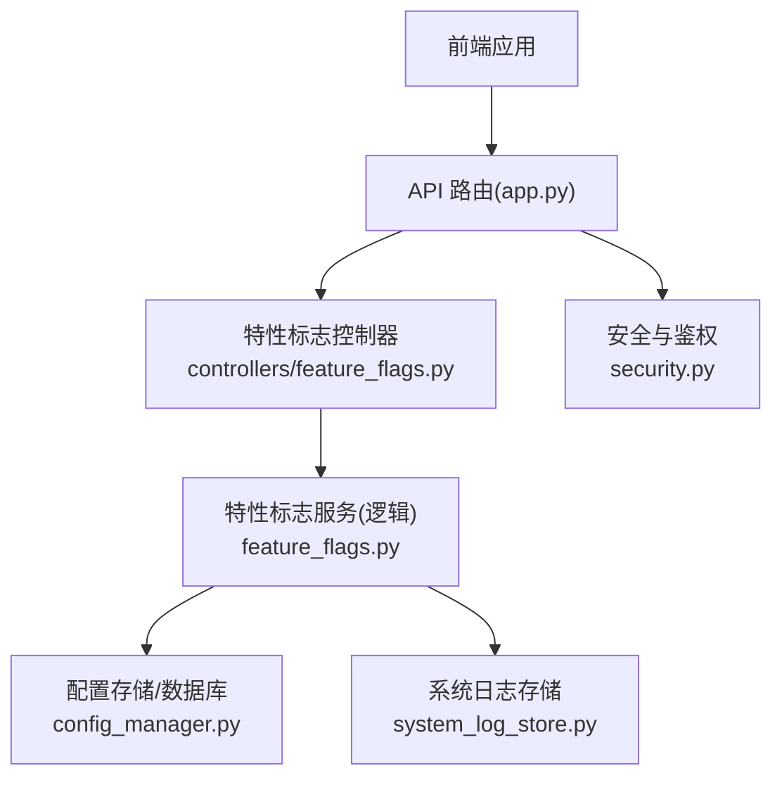
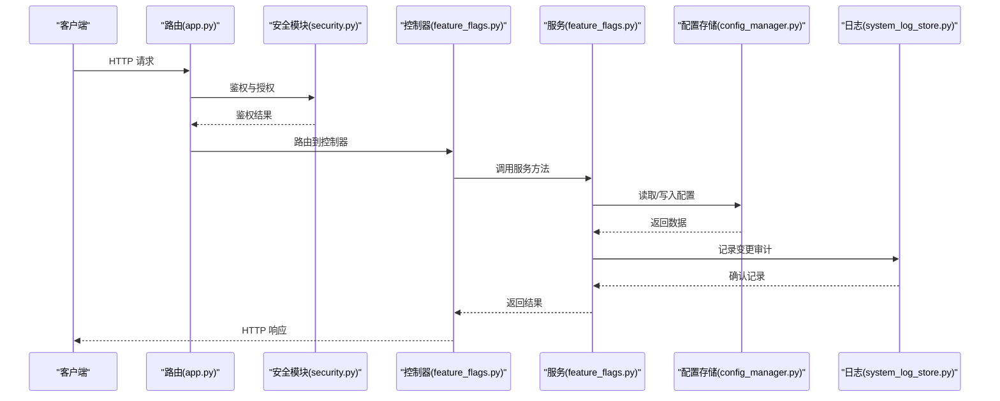
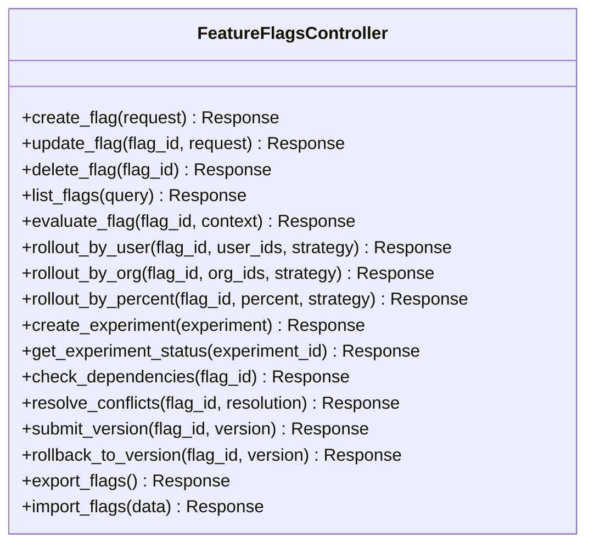
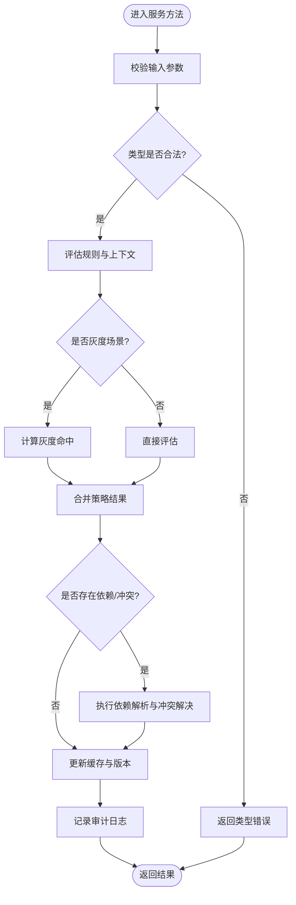
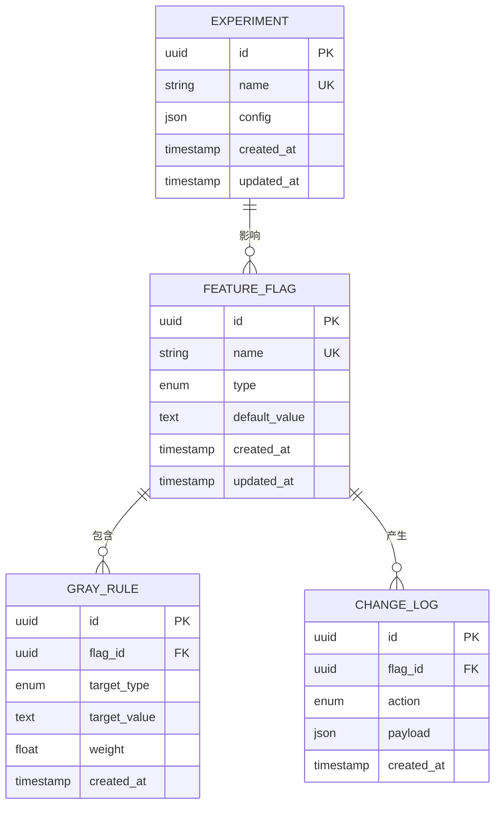
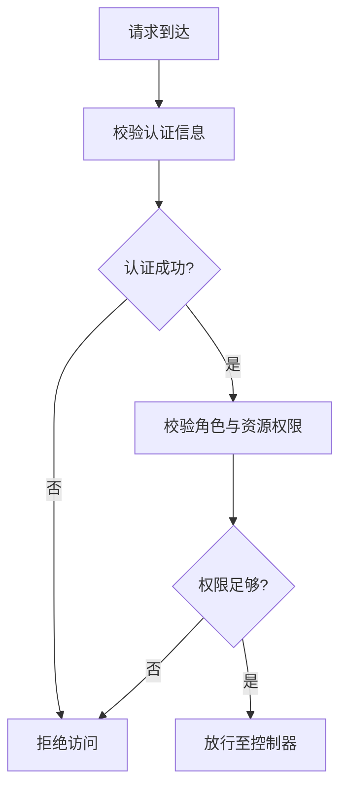
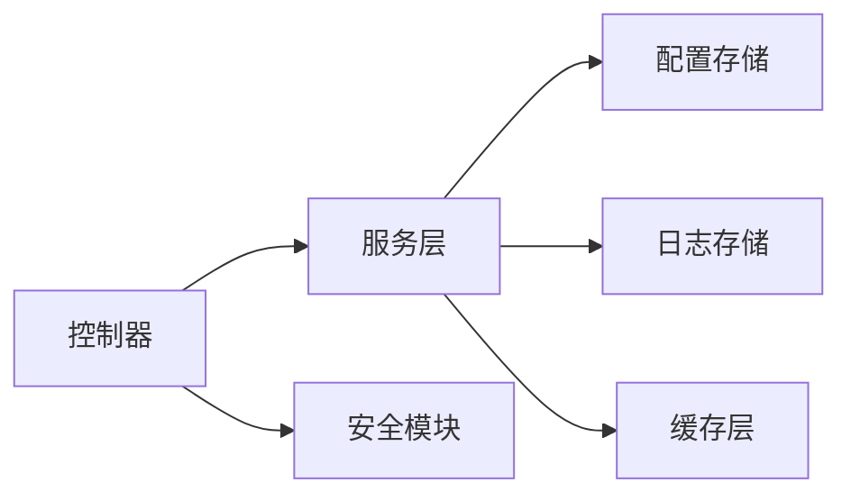

# 特性标志管理接口

<cite>
**本文引用的文件**   
- [feature_flags.py](file://backend/feature_flags.py)
- [controllers/feature_flags.py](file://backend/controllers/feature_flags.py)
- [app.py](file://backend/app.py)
- [config_manager.py](file://backend/config_manager.py)
- [system_log_store.py](file://backend/system_log_store.py)
- [security.py](file://backend/security.py)
</cite>

## 目录
1. [简介](#简介)
2. [项目结构](#项目结构)
3. [核心组件](#核心组件)
4. [架构总览](#架构总览)
5. [详细组件分析](#详细组件分析)
6. [依赖关系分析](#依赖关系分析)
7. [性能考虑](#性能考虑)
8. [故障排查指南](#故障排查指南)
9. [结论](#结论)
10. [附录](#附录)

## 简介
本文件为 SmartAsk 平台的“特性标志系统”提供全面的 API 文档，覆盖以下能力：
- 特性开关的创建与管理（布尔值、数值范围、字符串类型）
- 灰度发布接口（按用户、组织或百分比 rollout）
- 实验配置接口（A/B 测试与功能对比分析）
- 特性状态查询接口（动态获取当前生效配置）
- 特性依赖管理与冲突检测
- 变更历史追踪与回滚机制
- 缓存策略与实时更新机制
- 批量导入导出

该文档面向开发者与运维人员，既提供高层架构说明，也给出接口调用流程、数据模型与错误处理建议。

## 项目结构
特性标志系统在后端由控制器层暴露 REST 接口，服务层实现业务逻辑，存储层负责持久化与日志记录，安全模块负责鉴权与访问控制。前端通过统一 API 客户端调用后端接口，并在本地缓存特性标志以提升响应速度。

**图表来源**
- [app.py](file://backend/app.py)
- [controllers/feature_flags.py](file://backend/controllers/feature_flags.py)
- [feature_flags.py](file://backend/feature_flags.py)
- [config_manager.py](file://backend/config_manager.py)
- [system_log_store.py](file://backend/system_log_store.py)
- [security.py](file://backend/security.py)

**章节来源**
- [app.py](file://backend/app.py)
- [controllers/feature_flags.py](file://backend/controllers/feature_flags.py)
- [feature_flags.py](file://backend/feature_flags.py)
- [config_manager.py](file://backend/config_manager.py)
- [system_log_store.py](file://backend/system_log_store.py)
- [security.py](file://backend/security.py)

## 核心组件
- 控制器层：对外暴露 REST 接口，负责参数校验、权限检查、请求路由与响应封装。
- 服务层：实现特性标志的创建、更新、删除、评估、灰度与实验配置、依赖与冲突检测、版本与回滚等核心逻辑。
- 存储层：负责配置数据的持久化、查询与变更审计日志写入。
- 安全模块：提供鉴权、授权与输入校验，确保接口访问安全。
- 缓存层：在内存或分布式缓存中维护特性标志快照，支持热更新与快速读取。

**章节来源**
- [controllers/feature_flags.py](file://backend/controllers/feature_flags.py)
- [feature_flags.py](file://backend/feature_flags.py)
- [config_manager.py](file://backend/config_manager.py)
- [system_log_store.py](file://backend/system_log_store.py)
- [security.py](file://backend/security.py)

## 架构总览
下图展示了从前端到后端的完整调用链路，包括鉴权、控制器调度、服务层处理、存储读写与日志记录。

**图表来源**
- [app.py](file://backend/app.py)
- [security.py](file://backend/security.py)
- [controllers/feature_flags.py](file://backend/controllers/feature_flags.py)
- [feature_flags.py](file://backend/feature_flags.py)
- [config_manager.py](file://backend/config_manager.py)
- [system_log_store.py](file://backend/system_log_store.py)

## 详细组件分析

### 控制器层：特性标志 API
- 职责：接收并校验请求参数，执行权限检查，调用服务层方法，封装响应。
- 主要接口类别：
  - 特性开关 CRUD：创建、更新、删除、列表查询
  - 灰度发布：按用户、组织、百分比 rollout
  - 实验配置：A/B 测试定义与分配策略
  - 状态查询：动态获取当前生效配置
  - 依赖与冲突：依赖声明、冲突检测与解决
  - 版本与回滚：版本提交、历史查询、回滚操作
  - 批量导入导出：批量导入配置、导出当前配置

**图表来源**
- [controllers/feature_flags.py](file://backend/controllers/feature_flags.py)

**章节来源**
- [controllers/feature_flags.py](file://backend/controllers/feature_flags.py)

### 服务层：特性标志业务逻辑
- 职责：实现特性标志的核心业务逻辑，包括类型校验、规则评估、灰度策略计算、实验分配、依赖与冲突检测、版本管理与回滚、缓存同步与更新。
- 关键能力：
  - 类型支持：布尔值、数值范围、字符串枚举
  - 灰度策略：用户白名单、组织维度、百分比随机分流
  - 实验配置：分组、权重、指标采集
  - 依赖与冲突：声明式依赖、循环依赖检测、冲突优先级
  - 版本与回滚：语义化版本、变更审计、一键回滚
  - 缓存与实时：内存缓存、失效策略、事件驱动更新

**图表来源**
- [feature_flags.py](file://backend/feature_flags.py)

**章节来源**
- [feature_flags.py](file://backend/feature_flags.py)

### 存储层：配置与日志
- 配置存储：负责特性标志、灰度策略、实验配置的持久化与查询。
- 日志存储：记录特性标志的创建、更新、删除、版本提交与回滚等操作审计。

**图表来源**
- [config_manager.py](file://backend/config_manager.py)
- [system_log_store.py](file://backend/system_log_store.py)

**章节来源**
- [config_manager.py](file://backend/config_manager.py)
- [system_log_store.py](file://backend/system_log_store.py)

### 安全模块：鉴权与授权
- 职责：对特性标志相关接口进行鉴权与授权校验，防止未授权访问与越权操作。
- 关键点：基于角色的访问控制（RBAC）、资源级权限校验、敏感操作二次确认。

**图表来源**
- [security.py](file://backend/security.py)

**章节来源**
- [security.py](file://backend/security.py)

## 依赖关系分析
- 控制器依赖服务层，服务层依赖存储与日志模块，安全模块贯穿所有接口。
- 外部依赖：数据库、缓存（可选）、消息队列（用于实时更新）。

**图表来源**
- [controllers/feature_flags.py](file://backend/controllers/feature_flags.py)
- [feature_flags.py](file://backend/feature_flags.py)
- [config_manager.py](file://backend/config_manager.py)
- [system_log_store.py](file://backend/system_log_store.py)
- [security.py](file://backend/security.py)

**章节来源**
- [controllers/feature_flags.py](file://backend/controllers/feature_flags.py)
- [feature_flags.py](file://backend/feature_flags.py)
- [config_manager.py](file://backend/config_manager.py)
- [system_log_store.py](file://backend/system_log_store.py)
- [security.py](file://backend/security.py)

## 性能考虑
- 缓存策略：
  - 内存缓存特性标志快照，减少数据库压力
  - 支持按租户/组织维度隔离缓存键
  - 设置合理的 TTL 与失效策略
- 实时更新：
  - 使用事件驱动机制推送配置变更
  - 客户端订阅变更事件，避免轮询
- 评估优化：
  - 预计算常用上下文的评估结果
  - 灰度策略采用哈希分桶，提升命中率

[本节为通用指导，不直接分析具体文件]

## 故障排查指南
- 常见问题：
  - 鉴权失败：检查用户角色与资源权限
  - 类型不匹配：确认特性标志类型与默认值格式
  - 灰度未生效：检查目标用户/组织是否在白名单或权重是否正确
  - 依赖冲突：查看依赖图与冲突解决策略
  - 缓存不一致：清理缓存并重新加载
- 定位手段：
  - 查看变更审计日志
  - 启用调试日志输出
  - 检查缓存命中率与延迟

**章节来源**
- [system_log_store.py](file://backend/system_log_store.py)
- [security.py](file://backend/security.py)

## 结论
SmartAsk 的特性标志系统提供了完整的开关管理、灰度发布、实验配置、状态查询、依赖与冲突检测、版本与回滚、缓存与实时更新以及批量导入导出能力。通过清晰的架构分层与严格的鉴权控制，系统具备良好的可扩展性与可维护性。建议在生产环境中结合缓存与事件驱动机制，进一步提升性能与实时性。

[本节为总结，不直接分析具体文件]

## 附录
- 接口清单与示例：
  - 特性开关 CRUD：创建、更新、删除、列表
  - 灰度发布：按用户、组织、百分比
  - 实验配置：创建、查询状态
  - 状态查询：动态评估
  - 依赖与冲突：检查、解决
  - 版本与回滚：提交、回滚
  - 批量导入导出：导入、导出
- 最佳实践：
  - 使用语义化版本管理变更
  - 灰度策略逐步放量，监控指标
  - 定期清理过期实验与无效规则
  - 建立变更审批与审计流程

[本节为补充信息，不直接分析具体文件]