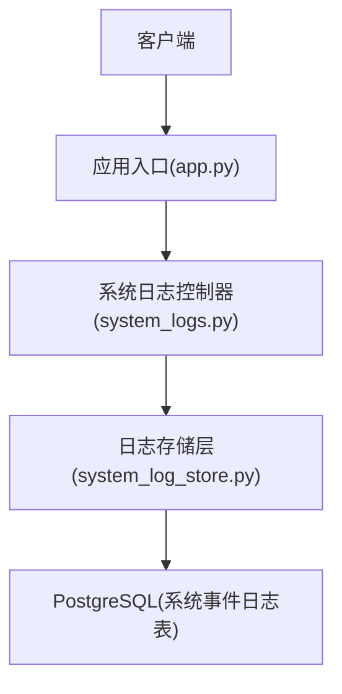
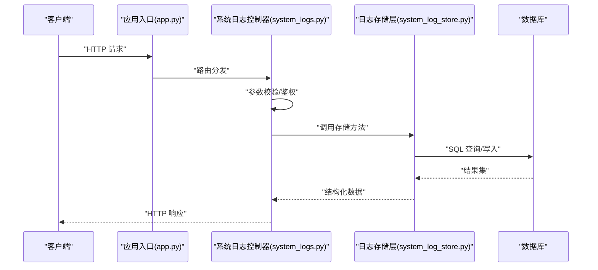
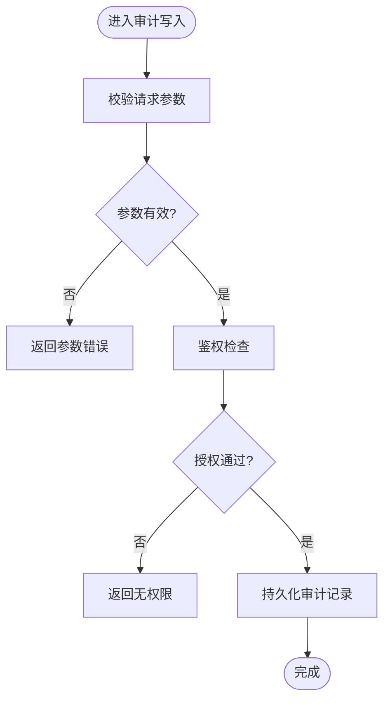
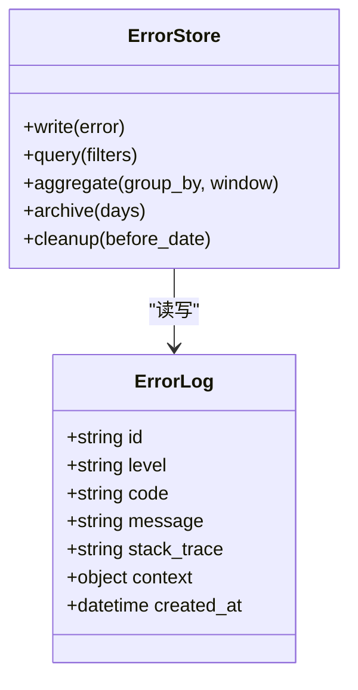
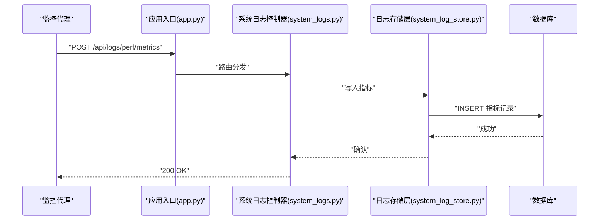
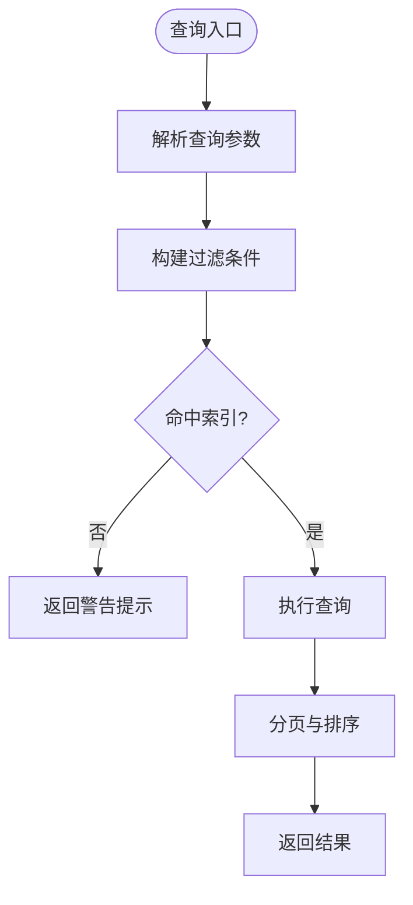
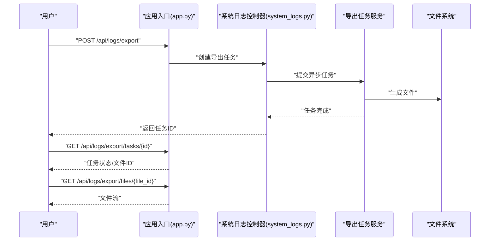
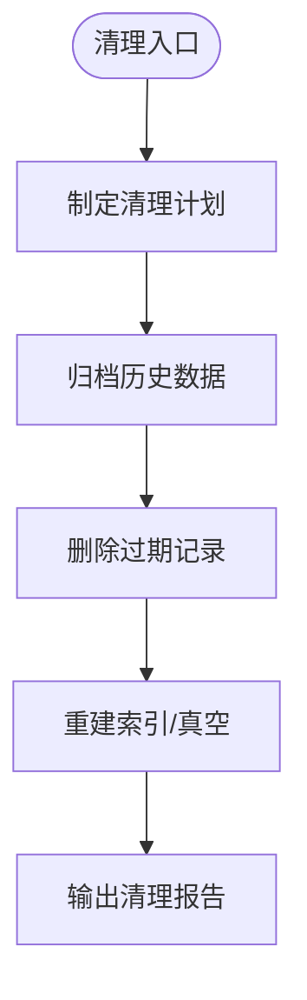
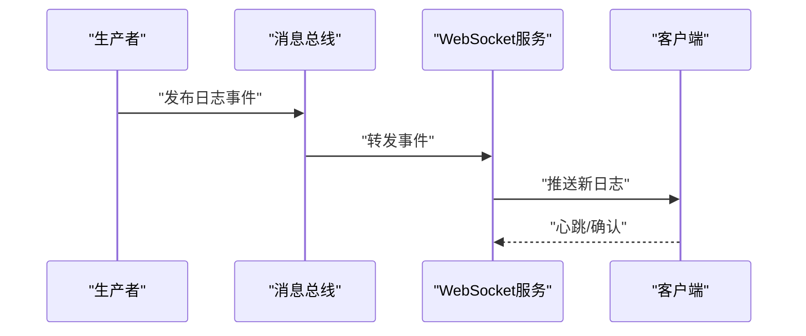
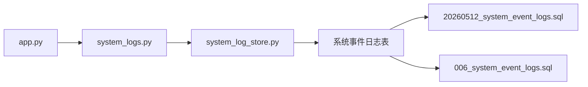

# 系统日志接口

<cite>
**本文档引用的文件**   
- [system_logs.py](file://backend/controllers/system_logs.py)
- [system_log_store.py](file://backend/system_log_store.py)
- [20260512_system_event_logs.sql](file://backend/migrations/20260512_system_event_logs.sql)
- [006_system_event_logs.sql](file://docker/postgres/init/006_system_event_logs.sql)
- [app.py](file://backend/app.py)
</cite>

## 目录
1. [简介](#简介)
2. [项目结构](#项目结构)
3. [核心组件](#核心组件)
4. [架构总览](#架构总览)
5. [详细组件分析](#详细组件分析)
6. [依赖分析](#依赖分析)
7. [性能考虑](#性能考虑)
8. [故障排查指南](#故障排查指南)
9. [结论](#结论)
10. [附录](#附录)

## 简介
本文件为 SmartAsk 平台的“系统日志管理”模块提供完整的 API 文档，覆盖以下能力：
- 操作审计接口：用户操作追踪、API 调用记录、系统事件监控
- 错误日志接口：异常捕获、堆栈跟踪、错误分类与聚合
- 性能监控接口：响应时间统计、资源使用率、系统健康检查
- 日志查询与过滤：按时间范围、用户、模块等条件检索
- 日志导出与归档：格式转换（CSV/JSON）、批量下载
- 日志清理策略与存储优化建议
- 实时日志流与告警通知机制

该模块通过后端控制器暴露 RESTful 接口，底层由持久化存储层与数据库表支撑，满足生产环境对可观测性与合规性的要求。

## 项目结构
系统日志相关代码主要分布在以下位置：
- 控制器层：REST 接口定义与请求处理
- 存储层：日志写入、查询、归档与清理逻辑
- 数据模型：数据库迁移脚本定义系统事件日志表结构
- 应用入口：路由注册与中间件集成（如鉴权、限流）

**图表来源** 
- [app.py](file://backend/app.py)
- [system_logs.py](file://backend/controllers/system_logs.py)
- [system_log_store.py](file://backend/system_log_store.py)
- [20260512_system_event_logs.sql](file://backend/migrations/20260512_system_event_logs.sql)

**章节来源**
- [system_logs.py](file://backend/controllers/system_logs.py)
- [system_log_store.py](file://backend/system_log_store.py)
- [20260512_system_event_logs.sql](file://backend/migrations/20260512_system_event_logs.sql)
- [006_system_event_logs.sql](file://docker/postgres/init/006_system_event_logs.sql)
- [app.py](file://backend/app.py)

## 核心组件
- 系统日志控制器：提供操作审计、错误日志、性能监控、查询过滤、导出归档、清理与实时流等 HTTP 端点
- 日志存储层：封装日志的写入、分页查询、条件过滤、归档压缩、清理策略与流式读取
- 数据模型：系统事件日志表用于持久化审计与事件记录
- 应用入口：将控制器路由挂载到应用，并注入鉴权、限流等横切关注点

**章节来源**
- [system_logs.py](file://backend/controllers/system_logs.py)
- [system_log_store.py](file://backend/system_log_store.py)
- [20260512_system_event_logs.sql](file://backend/migrations/20260512_system_event_logs.sql)
- [app.py](file://backend/app.py)

## 架构总览
系统日志模块采用分层架构：
- 控制器层负责协议适配、参数校验、权限控制与响应组装
- 存储层负责数据访问、批处理、归档与清理
- 数据库层提供结构化存储与索引支持
- 可选的异步任务用于导出与归档，避免阻塞主流程

**图表来源** 
- [app.py](file://backend/app.py)
- [system_logs.py](file://backend/controllers/system_logs.py)
- [system_log_store.py](file://backend/system_log_store.py)
- [20260512_system_event_logs.sql](file://backend/migrations/20260512_system_event_logs.sql)

## 详细组件分析

### 操作审计接口
- 功能要点
  - 记录用户操作行为（登录、数据访问、配置变更等）
  - 记录 API 调用轨迹（方法、路径、耗时、状态码）
  - 记录系统事件（调度任务、外部服务交互、异常恢复）
- 典型端点
  - 写入审计日志：POST /api/logs/audit
  - 查询审计日志：GET /api/logs/audit?user=&module=&start_time=&end_time=&page=&size=
  - 批量写入：POST /api/logs/audit/batch
- 字段说明（示例）
  - user_id：操作者标识
  - action：动作类型
  - module：模块名
  - detail：详情（JSON）
  - ip：来源 IP
  - created_at：创建时间
- 安全与权限
  - 仅允许具备审计查看/写入权限的用户访问
  - 敏感字段脱敏（如密码、令牌）

**图表来源** 
- [system_logs.py](file://backend/controllers/system_logs.py)
- [system_log_store.py](file://backend/system_log_store.py)

**章节来源**
- [system_logs.py](file://backend/controllers/system_logs.py)
- [system_log_store.py](file://backend/system_log_store.py)

### 错误日志接口
- 功能要点
  - 统一异常捕获与记录（含堆栈信息）
  - 错误分类（业务错误、系统错误、第三方错误）
  - 错误聚合与去重（按错误码、消息、堆栈指纹）
- 典型端点
  - 写入错误日志：POST /api/logs/errors
  - 查询错误日志：GET /api/logs/errors?level=&code=&module=&start_time=&end_time=&page=&size=
  - 错误统计：GET /api/logs/errors/stats?group_by=code,module,level&time_window=
- 字段说明（示例）
  - level：严重级别（INFO/WARN/ERROR/FATAL）
  - code：错误码
  - message：错误消息
  - stack_trace：堆栈字符串或引用
  - context：上下文（请求ID、用户、模块）
  - created_at：发生时间

**图表来源** 
- [system_log_store.py](file://backend/system_log_store.py)
- [20260512_system_event_logs.sql](file://backend/migrations/20260512_system_event_logs.sql)

**章节来源**
- [system_logs.py](file://backend/controllers/system_logs.py)
- [system_log_store.py](file://backend/system_log_store.py)

### 性能监控接口
- 功能要点
  - 响应时间统计（P50/P95/P99）
  - 资源使用率（CPU、内存、磁盘 I/O）
  - 系统健康检查（依赖服务可用性、队列积压）
- 典型端点
  - 指标上报：POST /api/logs/perf/metrics
  - 查询指标：GET /api/logs/perf/metrics?service=&metric=&start_time=&end_time=&aggregation=
  - 健康检查：GET /api/logs/perf/health
- 字段说明（示例）
  - service：服务名
  - metric：指标名称（如 response_time_seconds、cpu_usage_percent）
  - value：指标值
  - tags：标签（模块、版本、实例）
  - timestamp：采集时间

**图表来源** 
- [app.py](file://backend/app.py)
- [system_logs.py](file://backend/controllers/system_logs.py)
- [system_log_store.py](file://backend/system_log_store.py)

**章节来源**
- [system_logs.py](file://backend/controllers/system_logs.py)
- [system_log_store.py](file://backend/system_log_store.py)

### 日志查询与过滤接口
- 功能要点
  - 多条件组合过滤（时间范围、用户、模块、级别、错误码）
  - 分页与排序（created_at、response_time）
  - 全文检索（消息内容模糊匹配）
- 典型端点
  - 通用查询：GET /api/logs/query?type=audit|error|perf&filters=...&page=&size=
  - 高级搜索：POST /api/logs/search?q=&type=&filters=...
- 性能建议
  - 限制最大 page_size 与查询深度
  - 常用字段建立索引（时间、用户、模块、级别）

**图表来源** 
- [system_logs.py](file://backend/controllers/system_logs.py)
- [system_log_store.py](file://backend/system_log_store.py)

**章节来源**
- [system_logs.py](file://backend/controllers/system_logs.py)
- [system_log_store.py](file://backend/system_log_store.py)

### 日志导出与归档接口
- 功能要点
  - 导出格式：CSV、JSON
  - 批量下载：分片生成、进度查询、断点续传
  - 归档压缩：GZIP/TAR，保留元数据
- 典型端点
  - 发起导出：POST /api/logs/export?format=csv|json&filters=...
  - 查询导出任务：GET /api/logs/export/tasks/{task_id}
  - 下载文件：GET /api/logs/export/files/{file_id}
  - 归档任务：POST /api/logs/archive?retention_days=...
- 注意事项
  - 大导出异步处理，避免阻塞
  - 文件生命周期与访问控制

**图表来源** 
- [system_logs.py](file://backend/controllers/system_logs.py)
- [system_log_store.py](file://backend/system_log_store.py)

**章节来源**
- [system_logs.py](file://backend/controllers/system_logs.py)
- [system_log_store.py](file://backend/system_log_store.py)

### 日志清理策略与存储优化
- 清理策略
  - 基于时间的保留期（如 30/90/365 天）
  - 基于级别的降采样（高严重级别延长保留）
  - 冷热分离（热数据内存/SSD，冷数据对象存储）
- 存储优化
  - 分区表（按月份/级别）
  - 索引优化（复合索引：created_at+user+module）
  - 归档压缩与增量备份
- 典型端点
  - 清理任务：POST /api/logs/cleanup?before_date=&level=&module=
  - 清理状态：GET /api/logs/cleanup/status

**图表来源** 
- [system_log_store.py](file://backend/system_log_store.py)

**章节来源**
- [system_log_store.py](file://backend/system_log_store.py)

### 实时日志流与告警通知
- 功能要点
  - 实时推送：WebSocket/SSE 推送新日志
  - 订阅主题：按模块、级别、用户订阅
  - 告警规则：阈值触发、通知渠道（邮件、IM）
- 典型端点
  - 订阅流：WS /api/logs/stream?topic=...
  - 告警规则：POST /api/logs/alerts/rules
  - 告警历史：GET /api/logs/alerts/history?rule_id=&status=
- 注意事项
  - 背压与限流，防止雪崩
  - 消息去重与乱序处理

**图表来源** 
- [system_logs.py](file://backend/controllers/system_logs.py)
- [system_log_store.py](file://backend/system_log_store.py)

**章节来源**
- [system_logs.py](file://backend/controllers/system_logs.py)
- [system_log_store.py](file://backend/system_log_store.py)

## 依赖分析
- 控制器依赖存储层进行数据读写
- 存储层依赖数据库表结构与索引
- 应用入口负责路由与中间件装配
- 迁移脚本确保数据库模式一致性

**图表来源** 
- [app.py](file://backend/app.py)
- [system_logs.py](file://backend/controllers/system_logs.py)
- [system_log_store.py](file://backend/system_log_store.py)
- [20260512_system_event_logs.sql](file://backend/migrations/20260512_system_event_logs.sql)
- [006_system_event_logs.sql](file://docker/postgres/init/006_system_event_logs.sql)

**章节来源**
- [app.py](file://backend/app.py)
- [system_logs.py](file://backend/controllers/system_logs.py)
- [system_log_store.py](file://backend/system_log_store.py)
- [20260512_system_event_logs.sql](file://backend/migrations/20260512_system_event_logs.sql)
- [006_system_event_logs.sql](file://docker/postgres/init/006_system_event_logs.sql)

## 性能考虑
- 查询性能
  - 合理分页与限制返回字段
  - 使用复合索引加速常见过滤条件
  - 避免全表扫描与大范围时间查询
- 写入性能
  - 批量写入与异步落盘
  - 缓冲与合并小写
- 导出与归档
  - 分片生成与并行压缩
  - 流式传输减少内存峰值
- 监控与限流
  - 接口级限流与熔断
  - 慢查询告警与自动降级

[本节为通用指导，不直接分析具体文件]

## 故障排查指南
- 常见问题
  - 查询超时：检查索引与查询条件
  - 导出失败：确认存储空间与权限
  - 实时流断开：检查网络与心跳
- 诊断步骤
  - 查看错误日志与堆栈
  - 核对数据库连接与锁等待
  - 检查导出任务状态与文件完整性
- 定位工具
  - 错误日志查询与聚合
  - 性能指标与热点分析
  - 清理任务日志与报告

**章节来源**
- [system_logs.py](file://backend/controllers/system_logs.py)
- [system_log_store.py](file://backend/system_log_store.py)

## 结论
系统日志模块为 SmartAsk 平台提供了全面的可观测性能力，涵盖审计、错误、性能、查询、导出、归档、清理与实时流等关键场景。通过分层设计与合理的存储优化，能够在保证一致性与可用性的同时，满足大规模日志的处理需求。建议在生产环境中结合监控与告警体系，持续优化查询与写入性能，完善清理与归档策略，确保长期稳定运行。

[本节为总结性内容，不直接分析具体文件]

## 附录
- 数据库表结构参考
  - 系统事件日志表定义见迁移脚本与初始化脚本
- 接口清单（示例）
  - 审计：/api/logs/audit、/api/logs/audit/batch
  - 错误：/api/logs/errors、/api/logs/errors/stats
  - 性能：/api/logs/perf/metrics、/api/logs/perf/health
  - 查询：/api/logs/query、/api/logs/search
  - 导出：/api/logs/export、/api/logs/export/tasks、/api/logs/export/files
  - 归档：/api/logs/archive
  - 清理：/api/logs/cleanup、/api/logs/cleanup/status
  - 实时流：/api/logs/stream
  - 告警：/api/logs/alerts/rules、/api/logs/alerts/history

**章节来源**
- [20260512_system_event_logs.sql](file://backend/migrations/20260512_system_event_logs.sql)
- [006_system_event_logs.sql](file://docker/postgres/init/006_system_event_logs.sql)