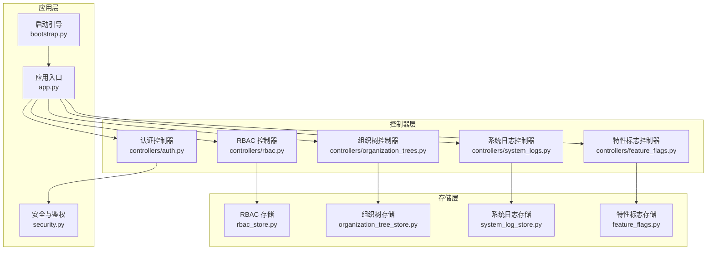
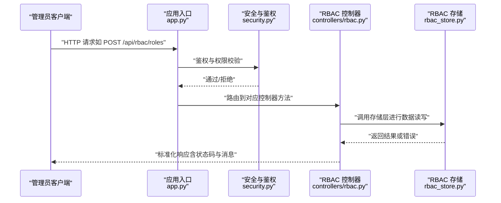
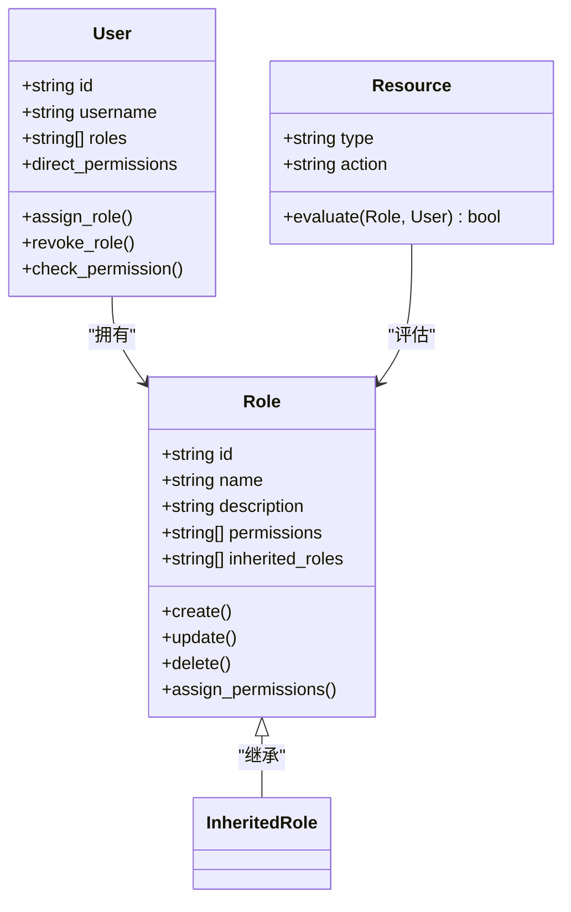
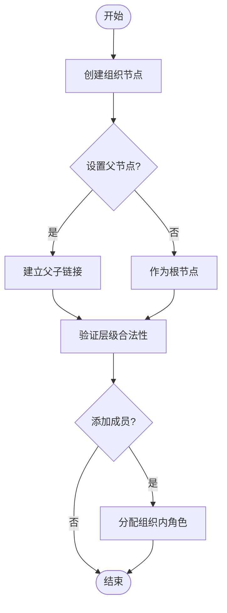
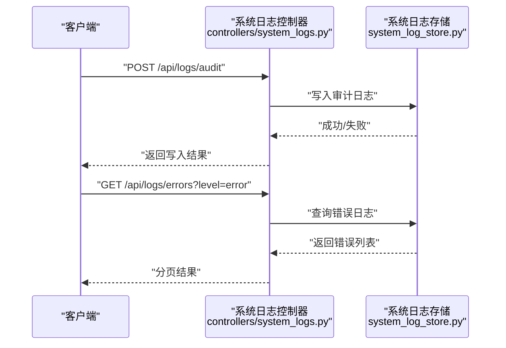
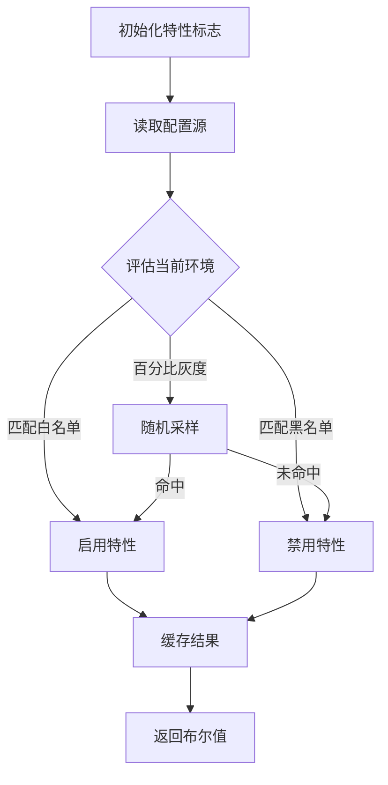
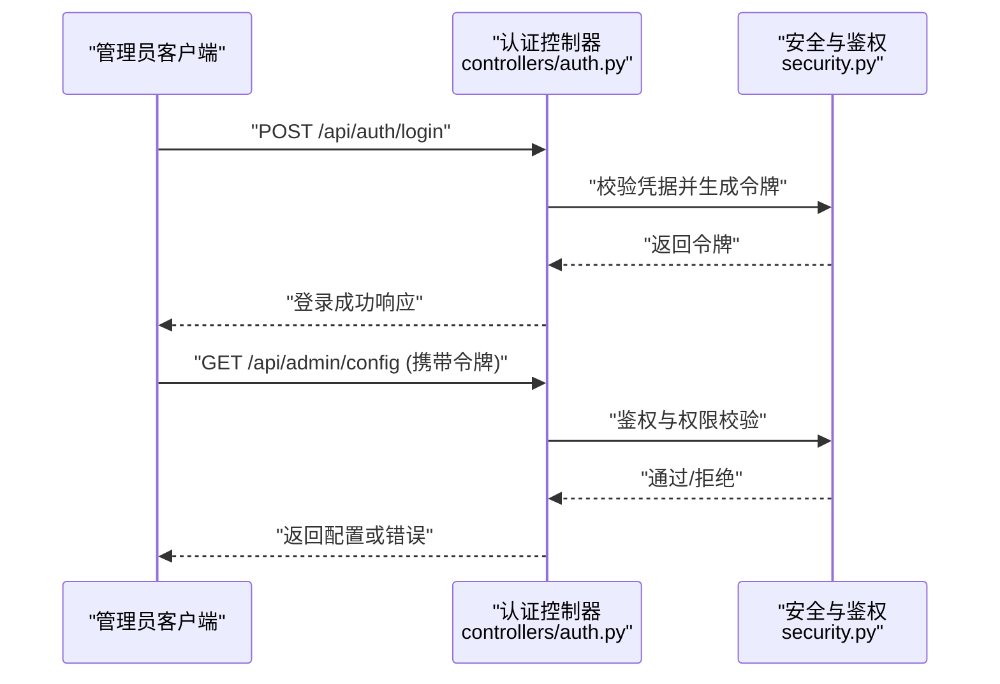
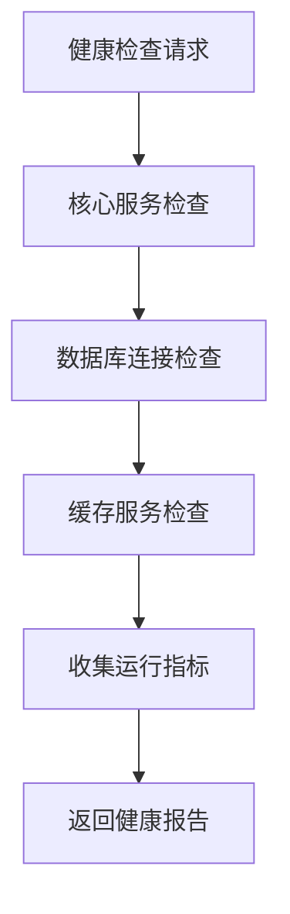
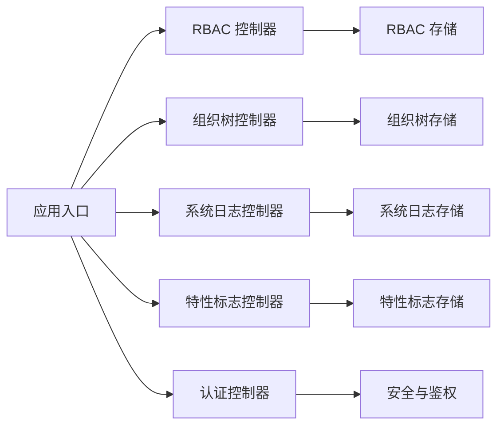

# 系统管理接口

<cite>
**本文引用的文件**   
- [rbac.py](file://backend/controllers/rbac.py)
- [organization_trees.py](file://backend/controllers/organization_trees.py)
- [system_logs.py](file://backend/controllers/system_logs.py)
- [feature_flags.py](file://backend/controllers/feature_flags.py)
- [auth.py](file://backend/controllers/auth.py)
- [app.py](file://backend/app.py)
- [bootstrap.py](file://backend/bootstrap.py)
- [security.py](file://backend/security.py)
- [rbac_store.py](file://backend/rbac_store.py)
- [organization_tree_store.py](file://backend/organization_tree_store.py)
- [system_log_store.py](file://backend/system_log_store.py)
- [feature_flags.py](file://backend/feature_flags.py)
</cite>

## 目录
1. [简介](#简介)
2. [项目结构](#项目结构)
3. [核心组件](#核心组件)
4. [架构总览](#架构总览)
5. [详细组件分析](#详细组件分析)
6. [依赖关系分析](#依赖关系分析)
7. [性能考虑](#性能考虑)
8. [故障排查指南](#故障排查指南)
9. [结论](#结论)
10. [附录](#附录)

## 简介
本文件为 SmartAsk 平台的系统管理功能提供全面的 API 文档，覆盖以下关键能力：
- RBAC 权限管理：角色定义、用户授权与权限继承机制
- 组织树管理：组织架构创建、层级关系维护与成员管理
- 系统日志：操作审计、错误追踪与性能监控
- 特性标志：功能开关、灰度发布与实验配置
- 管理员专用接口：批量用户导入、系统配置更新与监控告警
- 健康检查与诊断：系统健康状态与诊断信息
- 安全审计与合规性检查：访问控制、审计与合规校验

## 项目结构
系统管理相关能力主要位于后端 controllers 层及其对应的 store 模块，并通过应用入口统一注册路由。核心文件分布如下：
- 控制器（API 路由）：controllers/rbac.py、controllers/organization_trees.py、controllers/system_logs.py、controllers/feature_flags.py、controllers/auth.py
- 存储层（数据持久化）：rbac_store.py、organization_tree_store.py、system_log_store.py、feature_flags.py
- 应用入口与启动：app.py、bootstrap.py
- 安全与鉴权：security.py

**图表来源** 
- [app.py](file://backend/app.py)
- [bootstrap.py](file://backend/bootstrap.py)
- [rbac.py](file://backend/controllers/rbac.py)
- [organization_trees.py](file://backend/controllers/organization_trees.py)
- [system_logs.py](file://backend/controllers/system_logs.py)
- [feature_flags.py](file://backend/controllers/feature_flags.py)
- [auth.py](file://backend/controllers/auth.py)
- [rbac_store.py](file://backend/rbac_store.py)
- [organization_tree_store.py](file://backend/organization_tree_store.py)
- [system_log_store.py](file://backend/system_log_store.py)
- [feature_flags.py](file://backend/feature_flags.py)

**章节来源**
- [app.py](file://backend/app.py)
- [bootstrap.py](file://backend/bootstrap.py)

## 核心组件
- RBAC 权限管理
  - 角色定义与资源绑定
  - 用户-角色-资源的授权关系
  - 权限继承与合并策略
- 组织树管理
  - 组织节点 CRUD
  - 父子层级关系维护
  - 成员归属与迁移
- 系统日志
  - 操作审计记录
  - 错误与异常追踪
  - 性能指标采集
- 特性标志
  - 功能开关与灰度发布
  - 实验配置与动态生效
- 认证与安全
  - 登录与令牌管理
  - 鉴权中间件与访问控制
- 健康检查与诊断
  - 服务可用性探测
  - 运行时诊断信息

**章节来源**
- [rbac.py](file://backend/controllers/rbac.py)
- [organization_trees.py](file://backend/controllers/organization_trees.py)
- [system_logs.py](file://backend/controllers/system_logs.py)
- [feature_flags.py](file://backend/controllers/feature_flags.py)
- [auth.py](file://backend/controllers/auth.py)
- [security.py](file://backend/security.py)

## 架构总览
系统管理 API 采用“控制器 + 存储”的分层架构。控制器负责请求解析、参数校验、鉴权与响应封装；存储层负责数据持久化与查询优化。应用入口统一注册路由，启动引导完成初始化与依赖注入。

**图表来源** 
- [app.py](file://backend/app.py)
- [security.py](file://backend/security.py)
- [rbac.py](file://backend/controllers/rbac.py)
- [rbac_store.py](file://backend/rbac_store.py)

## 详细组件分析

### RBAC 权限管理接口
- 角色定义
  - 创建/更新/删除角色
  - 角色属性：名称、描述、可见范围、继承链
- 资源与权限
  - 资源类型与操作集合
  - 角色-资源-操作的绑定关系
- 用户授权
  - 用户-角色分配
  - 用户-资源直接授权（可选）
- 权限继承
  - 角色继承与权限合并
  - 冲突解决策略（显式允许优先）

**图表来源** 
- [rbac.py](file://backend/controllers/rbac.py)
- [rbac_store.py](file://backend/rbac_store.py)

**章节来源**
- [rbac.py](file://backend/controllers/rbac.py)
- [rbac_store.py](file://backend/rbac_store.py)

### 组织树管理接口
- 组织节点
  - 创建/更新/删除组织节点
  - 节点属性：名称、编码、层级、排序、状态
- 层级关系
  - 父子关系维护
  - 路径计算与祖先/后代查询
- 成员管理
  - 成员加入/移出组织
  - 成员角色在组织内的作用域

**图表来源** 
- [organization_trees.py](file://backend/controllers/organization_trees.py)
- [organization_tree_store.py](file://backend/organization_tree_store.py)

**章节来源**
- [organization_trees.py](file://backend/controllers/organization_trees.py)
- [organization_tree_store.py](file://backend/organization_tree_store.py)

### 系统日志接口
- 操作审计
  - 记录管理员操作（增删改查）
  - 关联用户、IP、时间戳与上下文
- 错误追踪
  - 异常堆栈与错误分类
  - 重试与降级标记
- 性能监控
  - 接口耗时、数据库慢查询
  - 资源使用率与告警阈值

**图表来源** 
- [system_logs.py](file://backend/controllers/system_logs.py)
- [system_log_store.py](file://backend/system_log_store.py)

**章节来源**
- [system_logs.py](file://backend/controllers/system_logs.py)
- [system_log_store.py](file://backend/system_log_store.py)

### 特性标志接口
- 功能开关
  - 全局开关与按租户/用户维度开关
  - 默认值与覆盖规则
- 灰度发布
  - 百分比灰度与白名单灰度
  - 灰度策略与回滚
- 实验配置
  - A/B 测试与实验分组
  - 指标采集与效果评估

**图表来源** 
- [feature_flags.py](file://backend/controllers/feature_flags.py)
- [feature_flags.py](file://backend/feature_flags.py)

**章节来源**
- [feature_flags.py](file://backend/controllers/feature_flags.py)
- [feature_flags.py](file://backend/feature_flags.py)

### 认证与安全
- 登录与会话
  - 用户名密码/第三方登录
  - 会话令牌签发与刷新
- 鉴权中间件
  - 基于 RBAC 的接口级鉴权
  - 组织级数据隔离
- 安全审计
  - 登录审计与异常告警
  - 敏感操作二次确认

**图表来源** 
- [auth.py](file://backend/controllers/auth.py)
- [security.py](file://backend/security.py)

**章节来源**
- [auth.py](file://backend/controllers/auth.py)
- [security.py](file://backend/security.py)

### 健康检查与诊断
- 健康检查
  - 服务存活探针
  - 依赖服务连通性检测（数据库、缓存等）
- 诊断信息
  - 运行时配置快照
  - 内存与线程状态摘要
  - 错误日志聚合视图

[本节为概念性流程说明，不直接分析具体文件]

## 依赖关系分析
- 控制器对存储层的依赖清晰，便于单元测试与替换实现
- 安全模块贯穿所有受保护接口，确保统一的鉴权策略
- 应用入口集中管理路由注册，便于扩展与维护

**图表来源** 
- [rbac.py](file://backend/controllers/rbac.py)
- [organization_trees.py](file://backend/controllers/organization_trees.py)
- [system_logs.py](file://backend/controllers/system_logs.py)
- [feature_flags.py](file://backend/controllers/feature_flags.py)
- [auth.py](file://backend/controllers/auth.py)
- [rbac_store.py](file://backend/rbac_store.py)
- [organization_tree_store.py](file://backend/organization_tree_store.py)
- [system_log_store.py](file://backend/system_log_store.py)
- [feature_flags.py](file://backend/feature_flags.py)
- [security.py](file://backend/security.py)
- [app.py](file://backend/app.py)

**章节来源**
- [app.py](file://backend/app.py)

## 性能考虑
- 存储层查询优化：索引设计、分页与过滤条件
- 鉴权中间件缓存：角色与权限结果的短期缓存
- 日志写入异步化：避免阻塞主请求链路
- 特性标志评估缓存：减少重复计算与配置读取

[本节提供通用指导，不直接分析具体文件]

## 故障排查指南
- 鉴权失败
  - 检查令牌有效性、角色绑定与资源权限
  - 查看认证控制器与安全模块的错误日志
- 组织树异常
  - 验证父子关系合法性与循环引用
  - 检查组织树存储的完整性约束
- 日志缺失
  - 确认日志写入通道与存储可用性
  - 检查日志级别与过滤条件
- 特性标志不生效
  - 核对配置源与评估策略
  - 检查缓存是否过期或污染

**章节来源**
- [auth.py](file://backend/controllers/auth.py)
- [security.py](file://backend/security.py)
- [organization_trees.py](file://backend/controllers/organization_trees.py)
- [system_logs.py](file://backend/controllers/system_logs.py)
- [feature_flags.py](file://backend/controllers/feature_flags.py)

## 结论
SmartAsk 系统管理模块以清晰的控制器-存储分层为基础，结合统一的安全鉴权与丰富的管理能力（RBAC、组织树、系统日志、特性标志），为平台提供了稳定可扩展的管理接口。建议在生产环境中加强日志审计、性能监控与健康检查，确保系统的可观测性与可靠性。

[本节为总结性内容，不直接分析具体文件]

## 附录
- 管理员专用接口示例
  - 批量用户导入：通过 CSV/JSON 批量创建用户并分配角色
  - 系统配置更新：热更新全局配置与租户级配置
  - 监控告警：配置告警规则与通知渠道
- 合规性检查
  - 定期扫描权限滥用与越权访问
  - 审计日志留存与导出

[本节为补充说明，不直接分析具体文件]