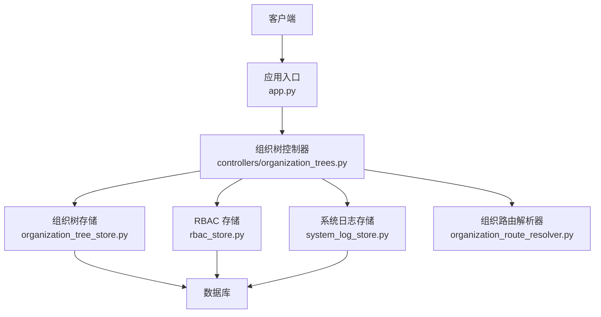
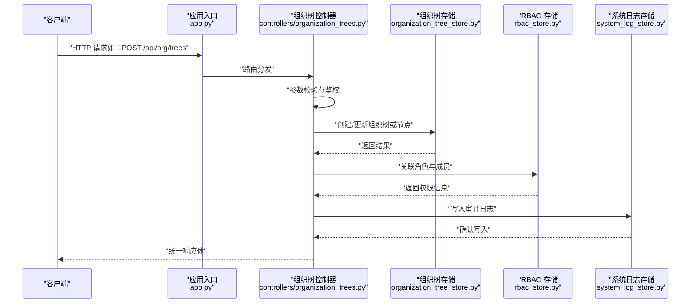
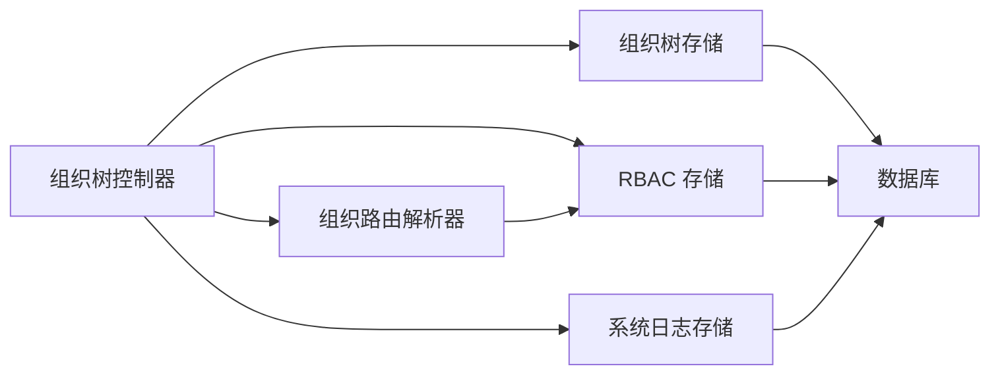

# 组织树管理接口

<cite>
**本文档引用的文件**   
- [controllers/organization_trees.py](file://backend/controllers/organization_trees.py)
- [organization_tree_store.py](file://backend/organization_tree_store.py)
- [organization_route_resolver.py](file://backend/organization_route_resolver.py)
- [rbac_store.py](file://backend/rbac_store.py)
- [system_log_store.py](file://backend/system_log_store.py)
- [app.py](file://backend/app.py)
</cite>

## 目录
1. [简介](#简介)
2. [项目结构](#项目结构)
3. [核心组件](#核心组件)
4. [架构总览](#架构总览)
5. [详细组件分析](#详细组件分析)
6. [依赖关系分析](#依赖关系分析)
7. [性能考虑](#性能考虑)
8. [故障排查指南](#故障排查指南)
9. [结论](#结论)
10. [附录](#附录)

## 简介
本文件为 SmartAsk 平台的“组织树管理”模块提供全面的 API 文档，覆盖以下能力：
- 组织树的创建与维护：层级结构定义、节点关系管理、版本化与变更审计
- 组织成员管理：成员的添加、移除、角色分配与权限隔离
- 数据隔离机制：确保不同组织间的数据安全与访问边界
- 组织树查询：层级遍历、路径搜索、祖先/后代检索
- 批量操作：批量导入成员、批量更新组织结构
- 同步与缓存：组织树同步机制与缓存策略说明

该文档面向后端开发者、集成方与运维人员，既提供高层概览，也给出代码级实现定位与调用流程。

## 项目结构
组织树相关功能主要分布在以下文件：
- controllers/organization_trees.py：HTTP 控制器，暴露 REST 接口
- organization_tree_store.py：组织树持久化与查询逻辑
- organization_route_resolver.py：基于组织的路由解析与权限判定
- rbac_store.py：角色与权限存储（RBAC）
- system_log_store.py：系统日志与审计记录
- app.py：应用路由注册与中间件装配

图表来源
- [app.py](file://backend/app.py)
- [controllers/organization_trees.py](file://backend/controllers/organization_trees.py)
- [organization_tree_store.py](file://backend/organization_tree_store.py)
- [rbac_store.py](file://backend/rbac_store.py)
- [system_log_store.py](file://backend/system_log_store.py)
- [organization_route_resolver.py](file://backend/organization_route_resolver.py)

章节来源
- [controllers/organization_trees.py](file://backend/controllers/organization_trees.py)
- [organization_tree_store.py](file://backend/organization_tree_store.py)
- [organization_route_resolver.py](file://backend/organization_route_resolver.py)
- [rbac_store.py](file://backend/rbac_store.py)
- [system_log_store.py](file://backend/system_log_store.py)
- [app.py](file://backend/app.py)

## 核心组件
- 组织树控制器（controllers/organization_trees.py）
  - 职责：接收 HTTP 请求，参数校验，调用服务层，返回统一响应
  - 关键能力：组织树 CRUD、节点关系维护、成员管理、批量操作、查询与搜索、审计与版本
- 组织树存储（organization_tree_store.py）
  - 职责：组织树数据的增删改查、层级遍历、路径搜索、版本快照
  - 关键能力：节点索引、父子关系维护、拓扑校验、并发安全
- 组织路由解析器（organization_route_resolver.py）
  - 职责：根据当前用户所属组织与角色，解析资源访问路由与权限
  - 关键能力：组织上下文注入、跨组织访问拦截、默认组织选择
- RBAC 存储（rbac_store.py）
  - 职责：角色、权限、成员-角色映射的持久化与查询
  - 关键能力：角色继承、权限合并、批量授权
- 系统日志存储（system_log_store.py）
  - 职责：审计日志写入、查询与导出
  - 关键能力：操作主体、对象、时间戳、变更前后对比

章节来源
- [controllers/organization_trees.py](file://backend/controllers/organization_trees.py)
- [organization_tree_store.py](file://backend/organization_tree_store.py)
- [organization_route_resolver.py](file://backend/organization_route_resolver.py)
- [rbac_store.py](file://backend/rbac_store.py)
- [system_log_store.py](file://backend/system_log_store.py)

## 架构总览
组织树管理采用分层架构：控制器负责接口契约，存储层负责数据一致性，解析器负责权限与路由，日志层负责审计与可观测性。

图表来源
- [app.py](file://backend/app.py)
- [controllers/organization_trees.py](file://backend/controllers/organization_trees.py)
- [organization_tree_store.py](file://backend/organization_tree_store.py)
- [rbac_store.py](file://backend/rbac_store.py)
- [system_log_store.py](file://backend/system_log_store.py)

## 详细组件分析

### 组织树控制器（API 契约）
- 组织树管理
  - 创建组织树：支持根节点初始化、命名、描述、初始管理员分配
  - 更新组织树：修改元数据、切换活跃版本、软删除
  - 删除组织树：级联清理或归档策略
- 节点关系管理
  - 新增子节点：指定父节点 ID、节点类型、排序权重
  - 移动节点：变更父节点与同级顺序，触发拓扑校验
  - 删除节点：处理子节点迁移策略（上移/下移/转交）
- 成员管理
  - 添加成员：指定组织/节点、用户标识、角色列表
  - 移除成员：按组织/节点维度解绑角色
  - 角色分配：批量授予/撤销角色，支持继承规则
- 查询与搜索
  - 层级遍历：按深度优先/广度优先返回子树
  - 路径搜索：按节点名序列匹配完整路径
  - 祖先/后代：快速检索上下级关系
- 批量操作
  - 批量导入成员：CSV/JSON 批量授权，失败回滚与部分成功报告
  - 批量更新结构：节点批量移动/重命名/状态变更
- 版本与审计
  - 版本快照：每次重大变更生成版本号与差异摘要
  - 审计日志：记录操作人、时间、对象、变更前后值

章节来源
- [controllers/organization_trees.py](file://backend/controllers/organization_trees.py)

### 组织树存储（数据结构与算法）
- 数据模型
  - 组织树：全局唯一标识、名称、状态、版本、创建/更新时间
  - 节点：ID、父节点 ID、类型、路径、排序、状态、扩展属性
  - 成员-角色：用户、组织/节点、角色、生效范围、有效期
- 复杂度与优化
  - 层级遍历：使用邻接表+路径前缀索引，O(k) 输出 k 个节点
  - 路径搜索：基于路径前缀与名称索引，近似 O(log n + m)
  - 拓扑校验：检测环与重复路径，O(n) 验证
- 并发与一致性
  - 事务保护：节点移动与成员变更在同一事务中提交
  - 乐观锁：通过版本号控制冲突，失败重试或提示
- 错误处理
  - 非法父节点、循环引用、越权操作均返回明确错误码与消息

章节来源
- [organization_tree_store.py](file://backend/organization_tree_store.py)

### 组织路由解析器（权限与隔离）
- 组织上下文
  - 从请求头或会话中提取当前组织与节点上下文
  - 未设置时回退到默认组织或拒绝访问
- 权限判定
  - 结合 RBAC 与组织/节点范围，计算有效权限集合
  - 跨组织访问需显式授权或走审批流
- 路由绑定
  - 将资源路由与组织/节点绑定，自动过滤不可见数据
  - 支持白名单与黑名单策略

章节来源
- [organization_route_resolver.py](file://backend/organization_route_resolver.py)

### RBAC 存储（角色与权限）
- 角色模型
  - 角色：ID、名称、描述、继承链、状态
  - 权限：资源、动作、条件
- 成员-角色映射
  - 支持组织级与节点级作用域
  - 批量授权与撤销，支持幂等与去重
- 权限合并
  - 自顶向下合并角色权限，去重与优先级排序

章节来源
- [rbac_store.py](file://backend/rbac_store.py)

### 系统日志存储（审计与版本）
- 审计事件
  - 事件类型：组织树创建/更新/删除、节点变更、成员变更、角色变更
  - 字段：操作人、时间、组织/节点、对象、变更前后值、版本
- 查询与导出
  - 按时间、对象、操作人筛选
  - 分页导出 CSV/JSON

章节来源
- [system_log_store.py](file://backend/system_log_store.py)

### 应用入口（路由与中间件）
- 路由注册
  - 将组织树相关接口挂载至统一前缀
- 中间件
  - 鉴权、限流、审计埋点、组织上下文注入

章节来源
- [app.py](file://backend/app.py)

## 依赖关系分析
- 控制器依赖存储层与解析器，避免直接访问数据库
- 存储层依赖数据库驱动与事务管理器
- 解析器依赖 RBAC 存储与上下文提供者
- 日志层独立于业务逻辑，保证审计不阻塞主流程

图表来源
- [controllers/organization_trees.py](file://backend/controllers/organization_trees.py)
- [organization_tree_store.py](file://backend/organization_tree_store.py)
- [rbac_store.py](file://backend/rbac_store.py)
- [organization_route_resolver.py](file://backend/organization_route_resolver.py)
- [system_log_store.py](file://backend/system_log_store.py)

章节来源
- [controllers/organization_trees.py](file://backend/controllers/organization_trees.py)
- [organization_tree_store.py](file://backend/organization_tree_store.py)
- [rbac_store.py](file://backend/rbac_store.py)
- [organization_route_resolver.py](file://backend/organization_route_resolver.py)
- [system_log_store.py](file://backend/system_log_store.py)

## 性能考虑
- 查询优化
  - 使用路径前缀索引加速层级遍历与路径搜索
  - 对热点组织树启用内存缓存（LRU），设置过期与失效策略
- 写入优化
  - 批量操作采用事务批处理，减少往返次数
  - 异步写入审计日志，降低主链路延迟
- 并发控制
  - 节点移动与成员变更使用乐观锁，冲突时重试或提示
  - 读多写少场景下，允许最终一致性的只读副本
- 缓存策略
  - 组织树快照缓存：版本变更后失效
  - 权限缓存：按用户+组织+节点粒度缓存，变更时主动失效

[本节为通用性能建议，无需特定文件来源]

## 故障排查指南
- 常见错误
  - 循环引用：节点父链中出现自身，检查拓扑校验逻辑
  - 越权访问：缺少组织/节点权限，核对 RBAC 映射与上下文
  - 并发冲突：版本不一致导致更新失败，建议重试或提示用户刷新
- 诊断步骤
  - 查看审计日志：定位最近变更与操作人
  - 检查版本快照：对比差异，恢复误操作
  - 监控缓存命中：确认缓存是否及时失效
- 修复建议
  - 修正节点关系后重新构建索引
  - 补全缺失的成员-角色映射
  - 调整缓存过期时间与失效策略

章节来源
- [system_log_store.py](file://backend/system_log_store.py)
- [organization_tree_store.py](file://backend/organization_tree_store.py)
- [rbac_store.py](file://backend/rbac_store.py)

## 结论
组织树管理模块以清晰的层次结构与严格的权限隔离为核心，提供完整的组织树生命周期管理、成员与角色管理、查询与批量操作、审计与版本化能力。通过合理的索引与缓存策略，兼顾了查询性能与写入一致性。建议在大规模部署中结合异步任务与只读副本进一步提升吞吐与可用性。

[本节为总结性内容，无需特定文件来源]

## 附录

### API 清单与行为说明（概念性）
- 组织树
  - 创建/更新/删除：支持元数据管理与状态切换
  - 版本快照：每次重大变更生成版本与差异摘要
- 节点关系
  - 新增/移动/删除：支持拓扑校验与子节点迁移策略
- 成员与角色
  - 添加/移除/分配：支持组织/节点作用域与批量操作
- 查询与搜索
  - 层级遍历/路径搜索/祖先后代：提供高效索引与分页
- 审计与日志
  - 操作记录/变更对比/导出：满足合规与回溯需求

[本节为概念性说明，无需特定文件来源]