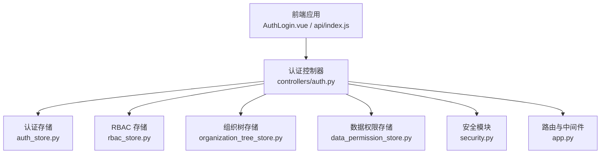
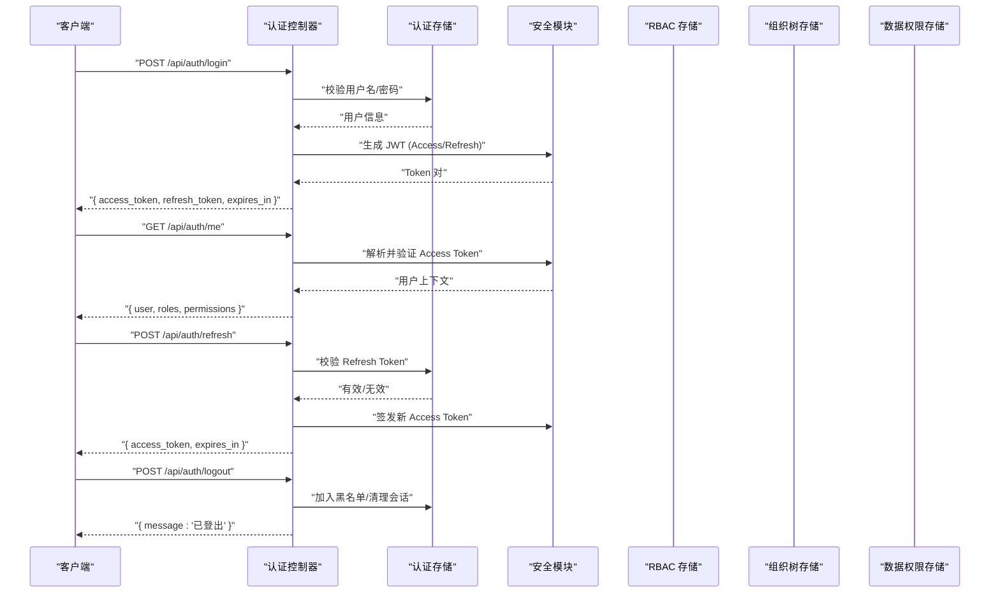
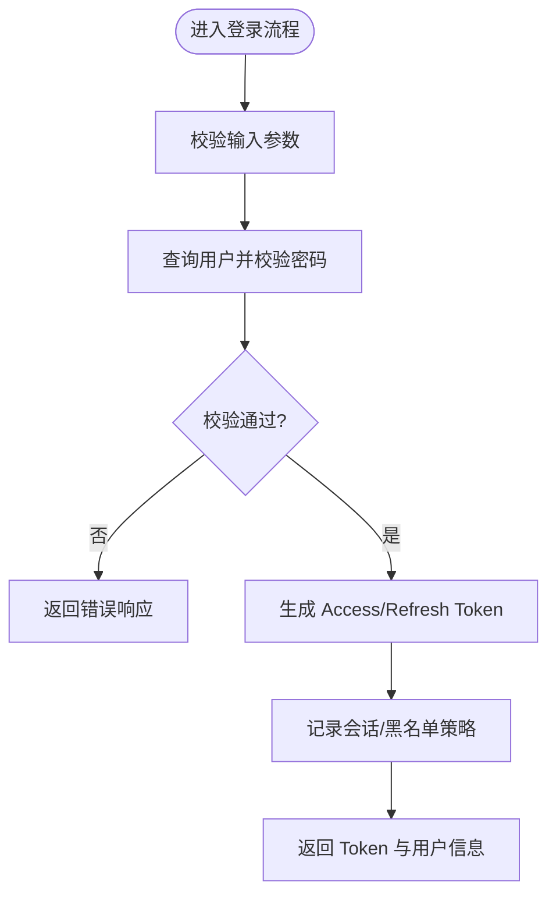
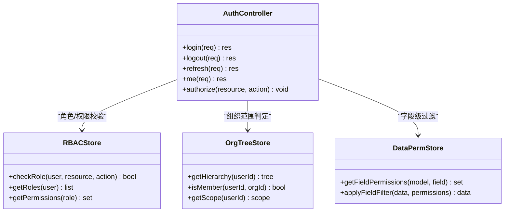
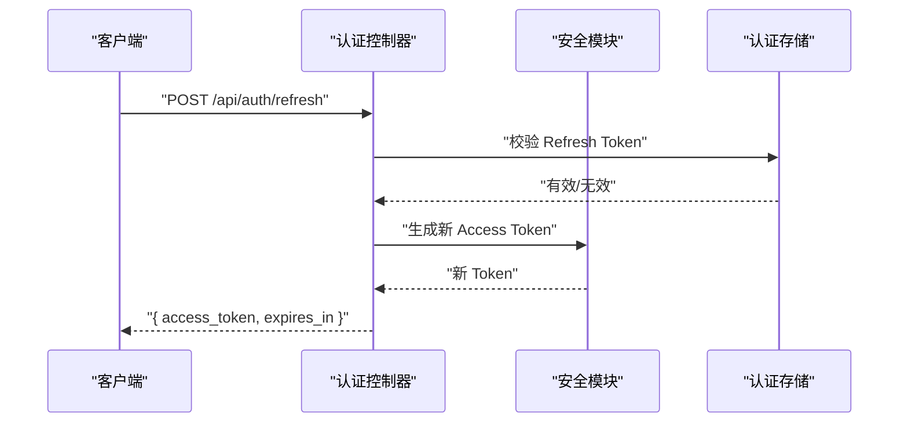
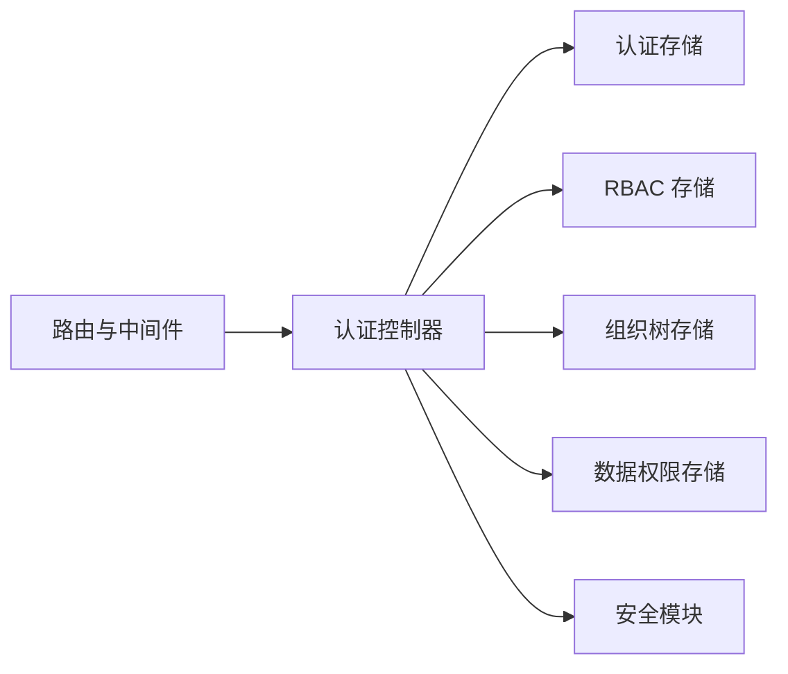

# 认证接口

<cite>
**本文引用的文件**   
- [backend/controllers/auth.py](file://backend/controllers/auth.py)
- [backend/auth_store.py](file://backend/auth_store.py)
- [backend/rbac_store.py](file://backend/rbac_store.py)
- [backend/organization_tree_store.py](file://backend/organization_tree_store.py)
- [backend/data_permission_store.py](file://backend/data_permission_store.py)
- [backend/security.py](file://backend/security.py)
- [backend/app.py](file://backend/app.py)
- [frontend/src/api/index.js](file://frontend/src/api/index.js)
- [frontend/src/auth/AuthLogin.vue](file://frontend/src/auth/AuthLogin.vue)
</cite>

## 目录
1. [简介](#简介)
2. [项目结构](#项目结构)
3. [核心组件](#核心组件)
4. [架构总览](#架构总览)
5. [详细组件分析](#详细组件分析)
6. [依赖关系分析](#依赖关系分析)
7. [性能考量](#性能考量)
8. [故障排查指南](#故障排查指南)
9. [结论](#结论)
10. [附录](#附录)

## 简介
本文件为 SmartAsk 平台的认证系统 API 文档，覆盖用户登录、登出、Token 管理（生成、验证、刷新）、权限校验（RBAC、组织树、字段级）等。文档包含接口定义、请求与响应示例、错误码说明、安全最佳实践以及客户端集成要点，帮助前后端开发者快速对接并保障安全。

## 项目结构
认证相关能力由后端控制器、存储层与安全模块共同实现：
- 控制器层：处理 HTTP 请求与响应，封装 Token 生命周期与鉴权流程
- 存储层：负责用户、角色、组织树、数据权限等持久化访问
- 安全层：提供密码加密、签名与校验、防重放/防爆破等安全策略
- 前端：封装登录、登出、Token 刷新等调用，统一拦截器处理鉴权失败

**图示来源** 
- [backend/controllers/auth.py](file://backend/controllers/auth.py)
- [backend/auth_store.py](file://backend/auth_store.py)
- [backend/rbac_store.py](file://backend/rbac_store.py)
- [backend/organization_tree_store.py](file://backend/organization_tree_store.py)
- [backend/data_permission_store.py](file://backend/data_permission_store.py)
- [backend/security.py](file://backend/security.py)
- [backend/app.py](file://backend/app.py)

**章节来源**
- [backend/controllers/auth.py](file://backend/controllers/auth.py)
- [backend/auth_store.py](file://backend/auth_store.py)
- [backend/rbac_store.py](file://backend/rbac_store.py)
- [backend/organization_tree_store.py](file://backend/organization_tree_store.py)
- [backend/data_permission_store.py](file://backend/data_permission_store.py)
- [backend/security.py](file://backend/security.py)
- [backend/app.py](file://backend/app.py)

## 核心组件
- 认证控制器：对外暴露登录、登出、Token 刷新、当前用户信息、权限检查等接口
- 认证存储：用户凭据校验、会话状态、Token 签发与黑名单管理
- RBAC 存储：角色与资源映射、权限集合查询
- 组织树存储：组织层级、成员关系、继承规则
- 数据权限存储：字段级权限、行级过滤条件
- 安全模块：密码哈希、JWT 签名、时间戳校验、防暴力破解

**章节来源**
- [backend/controllers/auth.py](file://backend/controllers/auth.py)
- [backend/auth_store.py](file://backend/auth_store.py)
- [backend/rbac_store.py](file://backend/rbac_store.py)
- [backend/organization_tree_store.py](file://backend/organization_tree_store.py)
- [backend/data_permission_store.py](file://backend/data_permission_store.py)
- [backend/security.py](file://backend/security.py)

## 架构总览
认证流程采用“无状态 JWT + 可选黑名单”的混合模式：登录成功后签发短期有效的 Access Token，配合 Refresh Token 进行续期；敏感操作通过 RBAC、组织树与字段级权限进行细粒度控制。

**图示来源** 
- [backend/controllers/auth.py](file://backend/controllers/auth.py)
- [backend/auth_store.py](file://backend/auth_store.py)
- [backend/security.py](file://backend/security.py)
- [backend/rbac_store.py](file://backend/rbac_store.py)
- [backend/organization_tree_store.py](file://backend/organization_tree_store.py)
- [backend/data_permission_store.py](file://backend/data_permission_store.py)

## 详细组件分析

### 认证控制器（登录、登出、Token 管理）
- 登录接口
  - 方法：POST
  - 路径：/api/auth/login
  - 请求体：用户名、密码、可选设备指纹或来源 IP
  - 成功响应：access_token、refresh_token、expires_in、用户基础信息
  - 失败响应：错误码与消息（如凭证错误、账户锁定）
- 登出接口
  - 方法：POST
  - 路径：/api/auth/logout
  - 请求头：携带 Access Token
  - 成功响应：登出成功消息
  - 失败响应：未授权或 Token 无效
- 刷新接口
  - 方法：POST
  - 路径：/api/auth/refresh
  - 请求体：refresh_token
  - 成功响应：新的 access_token 与过期时间
  - 失败响应：刷新令牌无效或过期
- 当前用户信息
  - 方法：GET
  - 路径：/api/auth/me
  - 请求头：携带 Access Token
  - 成功响应：用户、角色、权限集合
  - 失败响应：未授权

**图示来源** 
- [backend/controllers/auth.py](file://backend/controllers/auth.py)
- [backend/auth_store.py](file://backend/auth_store.py)
- [backend/security.py](file://backend/security.py)

**章节来源**
- [backend/controllers/auth.py](file://backend/controllers/auth.py)
- [backend/auth_store.py](file://backend/auth_store.py)
- [backend/security.py](file://backend/security.py)

### 权限验证流程（RBAC、组织树、字段级）
- RBAC 权限检查
  - 基于角色-资源-动作的矩阵模型，控制器在业务逻辑前注入权限校验
  - 支持全局开关与按资源维度细化
- 组织树权限控制
  - 依据用户在组织中的层级与成员关系，决定可访问的数据范围
  - 支持继承与合并策略
- 字段级权限验证
  - 针对数据模型的字段进行可见性控制，避免敏感信息泄露
  - 结合查询结果过滤与响应序列化阶段裁剪

**图示来源** 
- [backend/rbac_store.py](file://backend/rbac_store.py)
- [backend/organization_tree_store.py](file://backend/organization_tree_store.py)
- [backend/data_permission_store.py](file://backend/data_permission_store.py)
- [backend/controllers/auth.py](file://backend/controllers/auth.py)

**章节来源**
- [backend/rbac_store.py](file://backend/rbac_store.py)
- [backend/organization_tree_store.py](file://backend/organization_tree_store.py)
- [backend/data_permission_store.py](file://backend/data_permission_store.py)
- [backend/controllers/auth.py](file://backend/controllers/auth.py)

### Token 机制（生成、验证、刷新）
- 生成
  - Access Token：短期有效，用于请求鉴权
  - Refresh Token：长期有效，用于续期 Access Token
  - 载荷包含用户标识、角色、权限摘要、签发时间与过期时间
- 验证
  - 校验签名、过期时间、黑名单命中
  - 失败则返回未授权错误
- 刷新
  - 校验 Refresh Token 有效性
  - 签发新的 Access Token，必要时轮换 Refresh Token

**图示来源** 
- [backend/controllers/auth.py](file://backend/controllers/auth.py)
- [backend/security.py](file://backend/security.py)
- [backend/auth_store.py](file://backend/auth_store.py)

**章节来源**
- [backend/controllers/auth.py](file://backend/controllers/auth.py)
- [backend/security.py](file://backend/security.py)
- [backend/auth_store.py](file://backend/auth_store.py)

### 安全最佳实践
- 密码加密
  - 使用强哈希算法与盐值，禁止明文存储
- 会话管理
  - 短时效 Access Token 与长时效 Refresh Token 分离
  - 支持黑名单与主动失效
- 防攻击策略
  - 登录失败次数限制与冷却时间
  - 请求频率限制与 IP 白名单
  - 防重放与时间戳校验

**章节来源**
- [backend/security.py](file://backend/security.py)
- [backend/auth_store.py](file://backend/auth_store.py)

### 客户端集成示例与常见错误处理
- 前端集成
  - 登录页提交用户名与密码，保存返回的 Token
  - 在请求拦截器中附加 Authorization 头
  - 捕获 401 自动触发刷新流程，失败后跳转登录
- 常见错误
  - 401 未授权：Token 缺失、过期或无效
  - 403 禁止访问：权限不足或组织范围不匹配
  - 429 限流：频繁请求触发保护策略
  - 500 服务器错误：内部异常，需查看日志

```mermaid
sequenceDiagram
participant FE as "前端"
participant API as "API 网关/控制器"
participant Store as "认证存储"
participant Sec as "安全模块"
FE->>API : "带 Authorization 的请求"
API->>Sec : "解析并验证 Token"
Sec-->>API : "用户上下文/错误"
API-->>FE : "成功响应/401 未授权"
FE->>API : "401 时发起刷新请求"
API->>Store : "校验 Refresh Token"
Store-->>API : "有效/无效"
API-->>FE : "新 Access Token 或跳转登录"
```

**图示来源** 
- [frontend/src/api/index.js](file://frontend/src/api/index.js)
- [frontend/src/auth/AuthLogin.vue](file://frontend/src/auth/AuthLogin.vue)
- [backend/controllers/auth.py](file://backend/controllers/auth.py)
- [backend/auth_store.py](file://backend/auth_store.py)
- [backend/security.py](file://backend/security.py)

**章节来源**
- [frontend/src/api/index.js](file://frontend/src/api/index.js)
- [frontend/src/auth/AuthLogin.vue](file://frontend/src/auth/AuthLogin.vue)
- [backend/controllers/auth.py](file://backend/controllers/auth.py)
- [backend/auth_store.py](file://backend/auth_store.py)
- [backend/security.py](file://backend/security.py)

## 依赖关系分析
认证控制器依赖多个存储与安全模块，形成清晰的职责边界与松耦合设计。

**图示来源** 
- [backend/controllers/auth.py](file://backend/controllers/auth.py)
- [backend/auth_store.py](file://backend/auth_store.py)
- [backend/rbac_store.py](file://backend/rbac_store.py)
- [backend/organization_tree_store.py](file://backend/organization_tree_store.py)
- [backend/data_permission_store.py](file://backend/data_permission_store.py)
- [backend/security.py](file://backend/security.py)
- [backend/app.py](file://backend/app.py)

**章节来源**
- [backend/controllers/auth.py](file://backend/controllers/auth.py)
- [backend/app.py](file://backend/app.py)

## 性能考量
- Token 校验尽量无状态，减少数据库访问
- 批量权限计算缓存热点角色与组织范围
- 刷新令牌轮换降低并发风险
- 限流与熔断保护关键接口

[本节为通用指导，无需具体文件引用]

## 故障排查指南
- 登录失败
  - 检查用户名/密码是否正确
  - 查看账户是否被锁定或禁用
- 401 未授权
  - 确认 Authorization 头格式正确
  - 检查 Token 是否过期或已被拉黑
- 403 禁止访问
  - 核对角色与资源权限配置
  - 确认组织范围与字段级权限设置
- 刷新失败
  - 检查 Refresh Token 是否有效
  - 查看刷新频率限制

**章节来源**
- [backend/controllers/auth.py](file://backend/controllers/auth.py)
- [backend/auth_store.py](file://backend/auth_store.py)
- [backend/security.py](file://backend/security.py)

## 结论
SmartAsk 认证系统以 JWT 为核心，结合 RBAC、组织树与字段级权限，提供完整且安全的鉴权方案。通过短效 Access Token 与长效 Refresh Token 的组合，兼顾安全性与用户体验。建议在生产环境启用严格的限流、黑名单与审计日志，确保系统稳定与安全。

[本节为总结性内容，无需具体文件引用]

## 附录
- 接口清单
  - POST /api/auth/login：登录
  - POST /api/auth/logout：登出
  - POST /api/auth/refresh：刷新 Token
  - GET /api/auth/me：获取当前用户信息
- 错误码参考
  - 401：未授权
  - 403：禁止访问
  - 429：请求过多
  - 500：服务器内部错误

[本节为补充信息，无需具体文件引用]