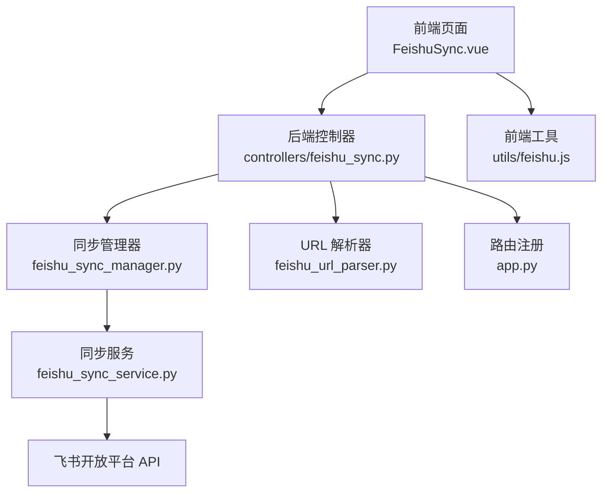
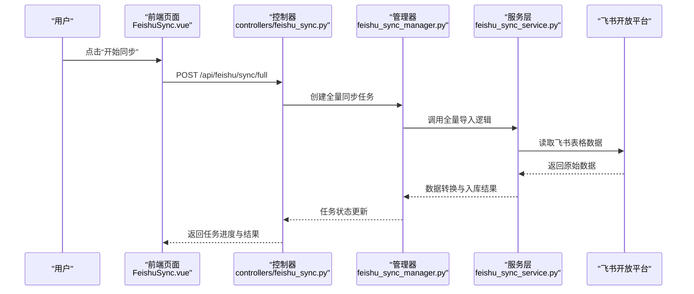
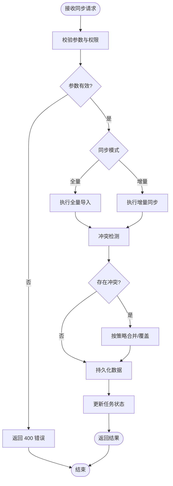
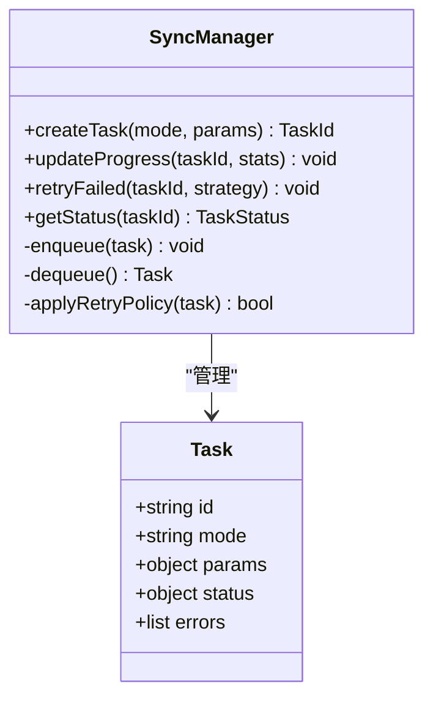
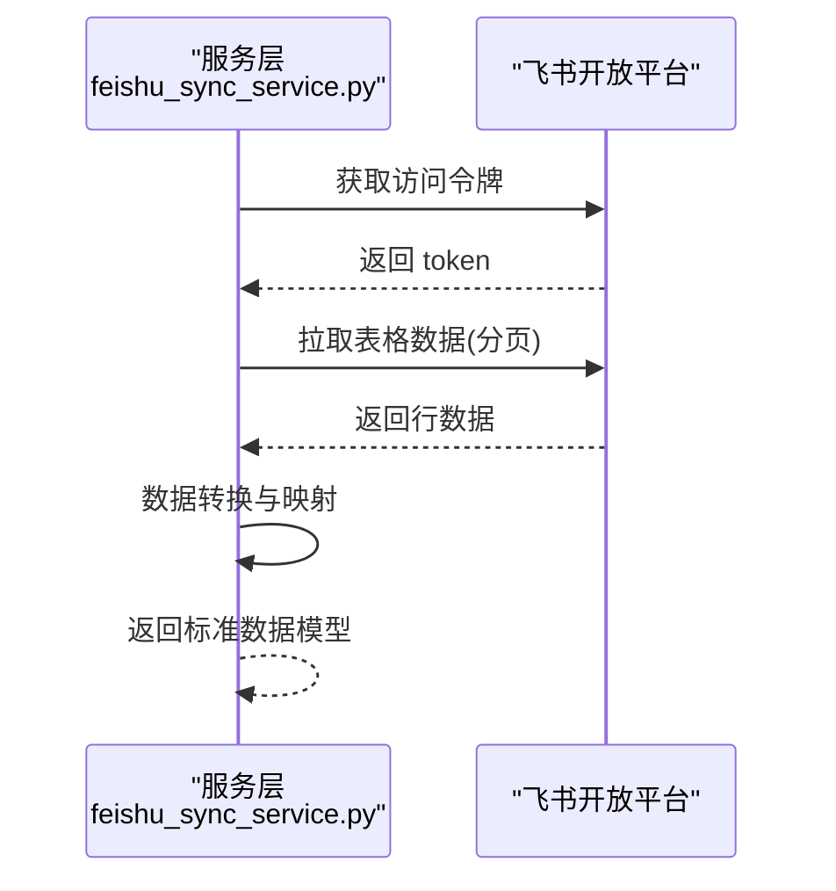
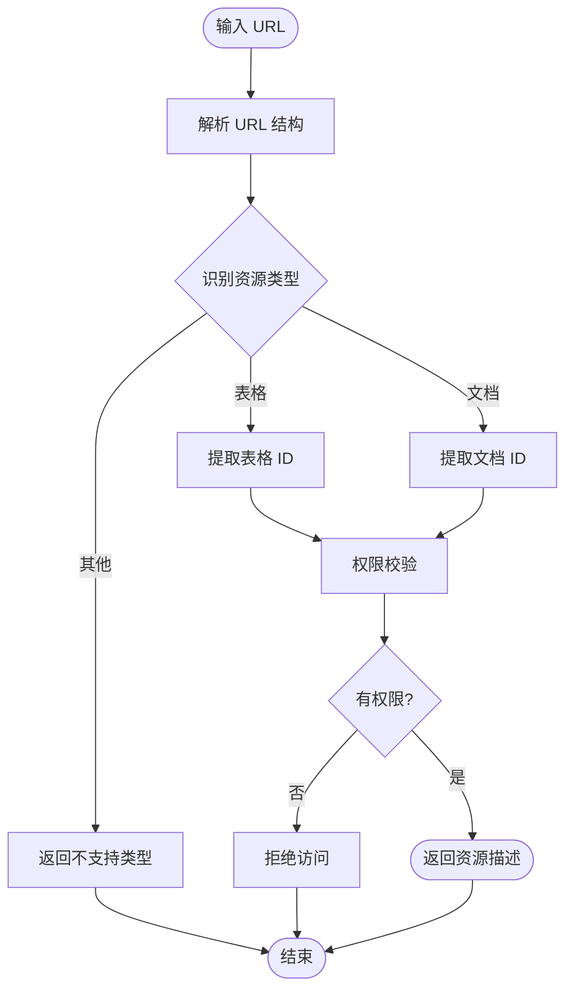
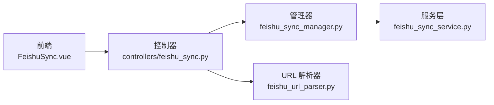

# 飞书集成接口

<cite>
**本文引用的文件**   
- [controllers/feishu_sync.py](file://backend/controllers/feishu_sync.py)
- [feishu_sync_manager.py](file://backend/feishu_sync_manager.py)
- [feishu_sync_service.py](file://backend/feishu_sync_service.py)
- [feishu_url_parser.py](file://backend/feishu_url_parser.py)
- [start_feishu_sync.py](file://backend/start_feishu_sync.py)
- [get_feishu_tables.py](file://backend/get_feishu_tables.py)
- [app.py](file://backend/app.py)
- [frontend/src/views/FeishuSync.vue](file://frontend/src/views/FeishuSync.vue)
- [frontend/src/utils/feishu.js](file://frontend/src/utils/feishu.js)
</cite>

## 目录
1. [简介](#简介)
2. [项目结构](#项目结构)
3. [核心组件](#核心组件)
4. [架构总览](#架构总览)
5. [详细组件分析](#详细组件分析)
6. [依赖关系分析](#依赖关系分析)
7. [性能考虑](#性能考虑)
8. [故障排查指南](#故障排查指南)
9. [结论](#结论)
10. [附录](#附录) 

## 简介
本文件为 SmartAsk 平台的飞书集成功能提供完整的 API 文档，覆盖以下能力：
- 飞书数据同步接口：表格数据导入、增量同步与冲突解决机制
- 飞书消息推送接口：通知发送、富文本消息与交互式按钮
- 飞书 URL 解析接口：链接提取、内容识别与权限验证
- 飞书工作流集成接口：审批流程、自动化任务与事件触发
- OAuth 授权流程：应用注册、权限申请与 Token 管理
- 数据映射与转换规则：字段对应关系与数据格式转换
- 错误处理与重试机制最佳实践

## 项目结构
后端围绕“控制器 + 管理器 + 服务”的分层组织，前端通过视图与工具模块调用后端接口。关键文件如下：
- 控制器层：暴露 HTTP 接口，负责参数校验、鉴权与响应封装
- 管理层：编排同步任务、调度与状态管理
- 服务层：对接飞书开放平台 API，实现具体业务逻辑
- URL 解析器：解析飞书链接并识别资源类型与权限
- 启动脚本与工具：用于初始化、拉取表结构与运行同步任务
- 前端页面与工具：用户交互与前端侧的飞书相关辅助方法

**图表来源** 
- [controllers/feishu_sync.py](file://backend/controllers/feishu_sync.py)
- [feishu_sync_manager.py](file://backend/feishu_sync_manager.py)
- [feishu_sync_service.py](file://backend/feishu_sync_service.py)
- [feishu_url_parser.py](file://backend/feishu_url_parser.py)
- [app.py](file://backend/app.py)
- [frontend/src/views/FeishuSync.vue](file://frontend/src/views/FeishuSync.vue)
- [frontend/src/utils/feishu.js](file://frontend/src/utils/feishu.js)

**章节来源**
- [controllers/feishu_sync.py](file://backend/controllers/feishu_sync.py)
- [feishu_sync_manager.py](file://backend/feishu_sync_manager.py)
- [feishu_sync_service.py](file://backend/feishu_sync_service.py)
- [feishu_url_parser.py](file://backend/feishu_url_parser.py)
- [app.py](file://backend/app.py)
- [frontend/src/views/FeishuSync.vue](file://frontend/src/views/FeishuSync.vue)
- [frontend/src/utils/feishu.js](file://frontend/src/utils/feishu.js)

## 核心组件
- 飞书同步控制器：对外暴露数据同步、增量同步、冲突处理等 REST 接口
- 同步管理器：负责任务编排、状态跟踪、并发控制与重试策略
- 同步服务：封装飞书表格、消息与工作流相关 API 调用
- URL 解析器：解析飞书链接，识别文档/表格/知识库等资源类型，进行权限校验
- 启动脚本与工具：初始化配置、拉取表结构、执行一次性或周期性同步任务

**章节来源**
- [controllers/feishu_sync.py](file://backend/controllers/feishu_sync.py)
- [feishu_sync_manager.py](file://backend/feishu_sync_manager.py)
- [feishu_sync_service.py](file://backend/feishu_sync_service.py)
- [feishu_url_parser.py](file://backend/feishu_url_parser.py)
- [start_feishu_sync.py](file://backend/start_feishu_sync.py)
- [get_feishu_tables.py](file://backend/get_feishu_tables.py)

## 架构总览
整体采用分层架构，前后端分离，后端通过控制器暴露统一 API，由管理器与服务层协同完成与飞书开放平台的交互。

**图表来源** 
- [controllers/feishu_sync.py](file://backend/controllers/feishu_sync.py)
- [feishu_sync_manager.py](file://backend/feishu_sync_manager.py)
- [feishu_sync_service.py](file://backend/feishu_sync_service.py)
- [frontend/src/views/FeishuSync.vue](file://frontend/src/views/FeishuSync.vue)

## 详细组件分析

### 飞书数据同步接口（控制器）
- 功能范围
  - 全量导入：从飞书表格批量拉取数据并写入本地存储
  - 增量同步：基于时间戳或变更标记进行增量更新
  - 冲突解决：检测重复键与版本差异，按策略合并或覆盖
- 典型请求
  - 全量导入：POST /api/feishu/sync/full
  - 增量同步：POST /api/feishu/sync/incremental
  - 冲突处理：POST /api/feishu/sync/conflict-resolve
- 响应与状态码
  - 200：成功，返回任务 ID 或结果摘要
  - 400：参数校验失败
  - 401/403：未授权或权限不足
  - 500：内部错误，包含错误码与简要信息

**图表来源** 
- [controllers/feishu_sync.py](file://backend/controllers/feishu_sync.py)

**章节来源**
- [controllers/feishu_sync.py](file://backend/controllers/feishu_sync.py)

### 同步管理器（任务编排与状态）
- 职责
  - 创建与管理同步任务生命周期
  - 维护任务队列、并发限制与重试策略
  - 聚合服务层返回结果并更新状态
- 关键行为
  - 任务创建：分配唯一任务 ID，记录初始状态
  - 进度上报：定期更新已处理行数、成功率与错误数
  - 失败重试：指数退避与最大重试次数控制
  - 结果汇总：生成统计信息与错误明细

**图表来源** 
- [feishu_sync_manager.py](file://backend/feishu_sync_manager.py)

**章节来源**
- [feishu_sync_manager.py](file://backend/feishu_sync_manager.py)

### 同步服务（飞书 API 对接）
- 职责
  - 封装飞书表格读取、消息发送与工作流调用
  - 数据格式转换与字段映射
  - 异常捕获与错误分类
- 关键能力
  - 表格数据拉取：分页获取行数据，转换为标准模型
  - 消息推送：支持纯文本、富文本与按钮交互
  - 工作流触发：发起审批或自动化任务，监听回调
  - 权限校验：检查应用对目标资源的访问权限

**图表来源** 
- [feishu_sync_service.py](file://backend/feishu_sync_service.py)

**章节来源**
- [feishu_sync_service.py](file://backend/feishu_sync_service.py)

### URL 解析器（链接提取与权限验证）
- 功能
  - 解析飞书链接，识别资源类型（文档、表格、知识库等）
  - 提取资源 ID 与必要上下文
  - 校验当前应用是否具备访问权限
- 输入输出
  - 输入：飞书 URL 字符串
  - 输出：结构化资源描述（类型、ID、权限状态）

**图表来源** 
- [feishu_url_parser.py](file://backend/feishu_url_parser.py)

**章节来源**
- [feishu_url_parser.py](file://backend/feishu_url_parser.py)

### 启动脚本与工具（初始化与拉取表结构）
- start_feishu_sync.py：用于启动同步任务或定时任务
- get_feishu_tables.py：拉取飞书表格元数据，辅助字段映射配置

**章节来源**
- [start_feishu_sync.py](file://backend/start_feishu_sync.py)
- [get_feishu_tables.py](file://backend/get_feishu_tables.py)

### 前端集成（页面与工具）
- FeishuSync.vue：提供用户界面，触发同步、查看任务状态与结果
- utils/feishu.js：封装前端侧飞书相关工具方法（如签名、格式化）

**章节来源**
- [frontend/src/views/FeishuSync.vue](file://frontend/src/views/FeishuSync.vue)
- [frontend/src/utils/feishu.js](file://frontend/src/utils/feishu.js)

## 依赖关系分析
- 控制器依赖管理器与服务层，形成清晰的职责边界
- 管理器依赖服务层进行实际 API 调用
- URL 解析器独立于同步流程，可被控制器或服务层复用
- 前端通过 REST 接口与后端交互，工具模块辅助数据处理

**图表来源** 
- [controllers/feishu_sync.py](file://backend/controllers/feishu_sync.py)
- [feishu_sync_manager.py](file://backend/feishu_sync_manager.py)
- [feishu_sync_service.py](file://backend/feishu_sync_service.py)
- [feishu_url_parser.py](file://backend/feishu_url_parser.py)
- [frontend/src/views/FeishuSync.vue](file://frontend/src/views/FeishuSync.vue)

**章节来源**
- [controllers/feishu_sync.py](file://backend/controllers/feishu_sync.py)
- [feishu_sync_manager.py](file://backend/feishu_sync_manager.py)
- [feishu_sync_service.py](file://backend/feishu_sync_service.py)
- [feishu_url_parser.py](file://backend/feishu_url_parser.py)
- [frontend/src/views/FeishuSync.vue](file://frontend/src/views/FeishuSync.vue)

## 性能考虑
- 分页与批处理：拉取大量表格数据时采用分页与批量写入，降低内存占用与网络开销
- 并发控制：管理器限制并发任务数，避免对飞书 API 限流
- 缓存策略：对频繁访问的元数据（如表结构）进行短期缓存
- 重试与退避：对瞬时失败使用指数退避重试，减少抖动影响
- 增量同步：优先使用增量同步，减少不必要的数据传输

[本节为通用指导，不直接分析具体文件]

## 故障排查指南
- 常见问题
  - 权限不足：检查应用权限与资源访问设置
  - 令牌过期：刷新访问令牌并重新发起请求
  - 数据不一致：核对字段映射与数据类型转换
  - 任务失败：查看任务日志与错误明细，定位失败步骤
- 建议操作
  - 启用详细日志，记录请求与响应摘要
  - 使用工具脚本拉取表结构，验证字段映射
  - 逐步缩小问题范围，隔离外部依赖

**章节来源**
- [controllers/feishu_sync.py](file://backend/controllers/feishu_sync.py)
- [feishu_sync_manager.py](file://backend/feishu_sync_manager.py)
- [feishu_sync_service.py](file://backend/feishu_sync_service.py)
- [feishu_url_parser.py](file://backend/feishu_url_parser.py)

## 结论
SmartAsk 的飞书集成通过清晰的分层架构与完善的错误处理机制，实现了稳定的数据同步、消息推送与 URL 解析能力。结合增量同步、冲突解决与重试策略，可在保证一致性的同时提升性能与可靠性。建议在生产环境中完善监控与告警，持续优化字段映射与权限配置。

[本节为总结性内容，不直接分析具体文件]

## 附录
- OAuth 授权流程要点
  - 应用注册：在飞书开放平台创建应用，配置回调地址与权限
  - 权限申请：按需申请表格、消息与工作流相关权限
  - Token 管理：安全存储访问令牌与刷新令牌，定期轮换
- 数据映射与转换规则
  - 字段对应关系：建立飞书字段与本地模型的映射表
  - 格式转换：处理日期、数值与枚举类型的标准化
- 工作流集成要点
  - 审批流程：定义触发条件与回调处理
  - 自动化任务：配置事件监听与动作执行
  - 事件触发：确保事件幂等性与去重

[本节为概念性说明，不直接分析具体文件]