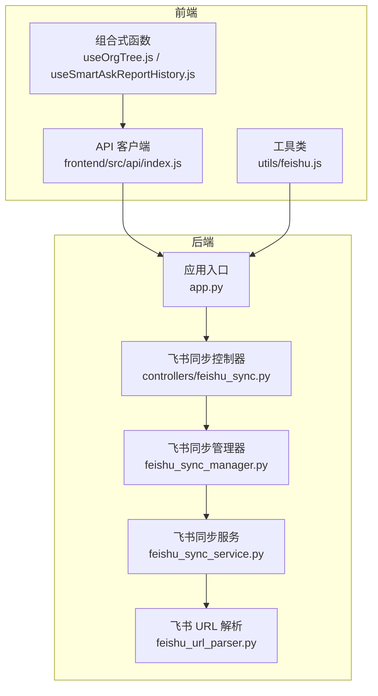
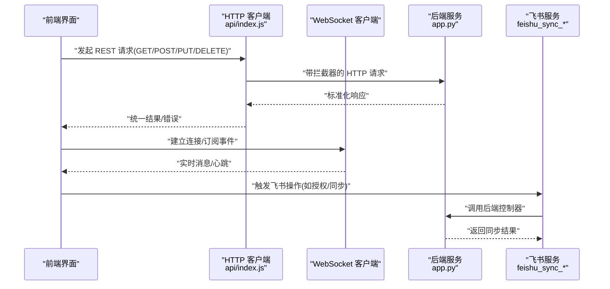
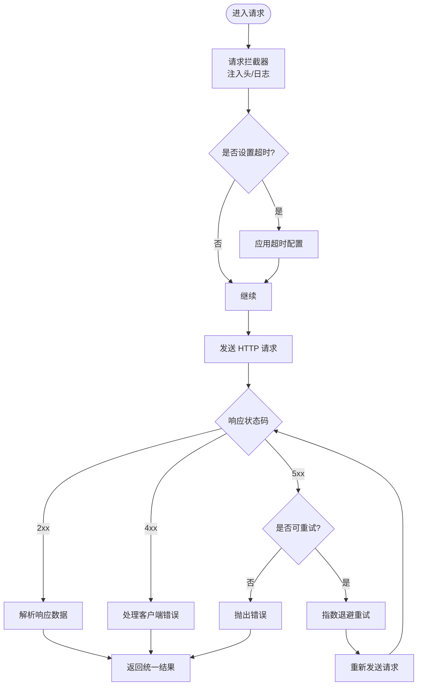
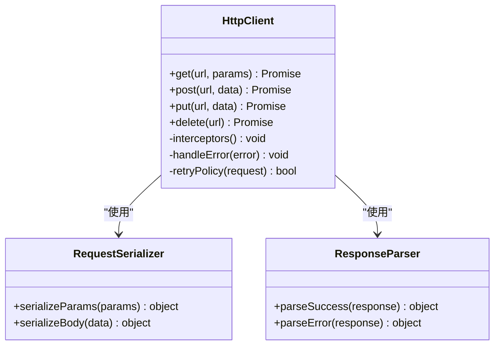
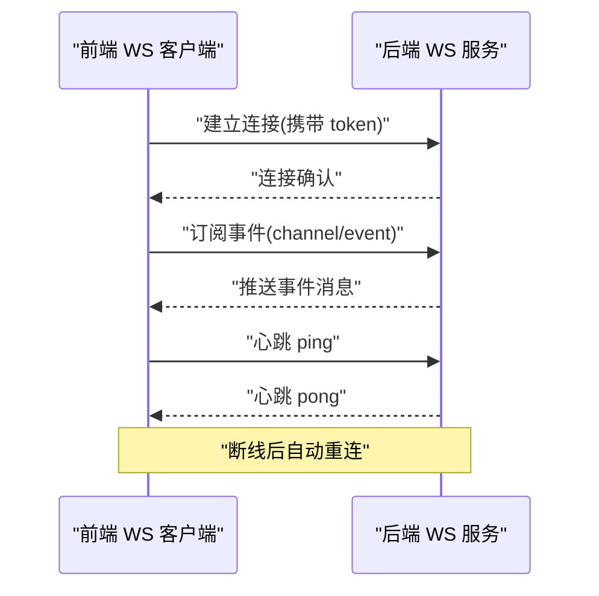
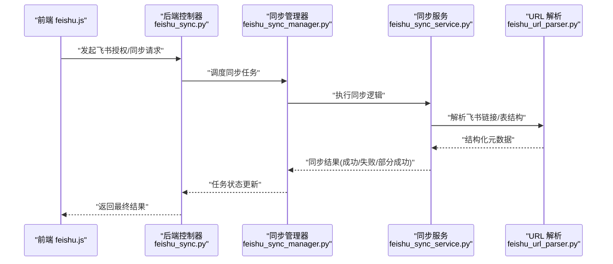
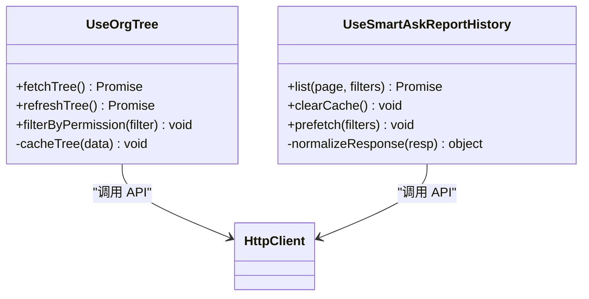
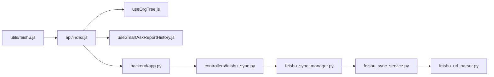

# API 集成

<cite>
**本文引用的文件**   
- [frontend/src/api/index.js](file://frontend/src/api/index.js)
- [frontend/src/composables/useOrgTree.js](file://frontend/src/composables/useOrgTree.js)
- [frontend/src/composables/useSmartAskReportHistory.js](file://frontend/src/composables/useSmartAskReportHistory.js)
- [frontend/src/utils/feishu.js](file://frontend/src/utils/feishu.js)
- [backend/controllers/feishu_sync.py](file://backend/controllers/feishu_sync.py)
- [backend/feishu_sync_manager.py](file://backend/feishu_sync_manager.py)
- [backend/feishu_sync_service.py](file://backend/feishu_sync_service.py)
- [backend/feishu_url_parser.py](file://backend/feishu_url_parser.py)
- [backend/app.py](file://backend/app.py)
</cite>

## 目录
1. [简介](#简介)
2. [项目结构](#项目结构)
3. [核心组件](#核心组件)
4. [架构总览](#架构总览)
5. [详细组件分析](#详细组件分析)
6. [依赖关系分析](#依赖关系分析)
7. [性能考量](#性能考量)
8. [故障排查指南](#故障排查指南)
9. [结论](#结论)
10. [附录](#附录)

## 简介
本文件面向 SmartAsk 智能问数平台的 API 集成层，聚焦前端统一 HTTP 客户端封装、RESTful 调用模式、WebSocket 实时通信、飞书第三方服务集成，以及组合式函数（composables）的复用设计。文档旨在帮助开发者快速理解并正确集成各模块，提供最佳实践与调试方法，确保稳定性与可维护性。

## 项目结构
前端 API 集成主要位于以下目录：
- frontend/src/api：统一的 HTTP 客户端封装与请求拦截器
- frontend/src/composables：可复用的业务逻辑封装（组织树、报告历史等）
- frontend/src/utils：工具类（如飞书相关能力）
- backend/controllers：后端控制器（含飞书同步控制器）
- backend/feishu_*：飞书同步相关的管理器、服务与 URL 解析

**图表来源** 
- [frontend/src/api/index.js](file://frontend/src/api/index.js)
- [frontend/src/composables/useOrgTree.js](file://frontend/src/composables/useOrgTree.js)
- [frontend/src/composables/useSmartAskReportHistory.js](file://frontend/src/composables/useSmartAskReportHistory.js)
- [frontend/src/utils/feishu.js](file://frontend/src/utils/feishu.js)
- [backend/app.py](file://backend/app.py)
- [backend/controllers/feishu_sync.py](file://backend/controllers/feishu_sync.py)
- [backend/feishu_sync_manager.py](file://backend/feishu_sync_manager.py)
- [backend/feishu_sync_service.py](file://backend/feishu_sync_service.py)
- [backend/feishu_url_parser.py](file://backend/feishu_url_parser.py)

**章节来源**
- [frontend/src/api/index.js](file://frontend/src/api/index.js)
- [backend/app.py](file://backend/app.py)

## 核心组件
- 统一 HTTP 客户端：集中管理请求拦截、错误处理、重试机制、超时配置与响应数据标准化
- RESTful 封装：对 GET/POST/PUT/DELETE 进行统一封装，规范参数序列化与响应处理
- WebSocket 实时通信：连接建立、消息订阅、断线重连、心跳检测
- 飞书集成：OAuth 认证、API 调用、数据同步、错误处理
- 组合式函数：组织树与报告历史的复用逻辑封装

**章节来源**
- [frontend/src/api/index.js](file://frontend/src/api/index.js)
- [frontend/src/composables/useOrgTree.js](file://frontend/src/composables/useOrgTree.js)
- [frontend/src/composables/useSmartAskReportHistory.js](file://frontend/src/composables/useSmartAskReportHistory.js)
- [frontend/src/utils/feishu.js](file://frontend/src/utils/feishu.js)
- [backend/controllers/feishu_sync.py](file://backend/controllers/feishu_sync.py)
- [backend/feishu_sync_manager.py](file://backend/feishu_sync_manager.py)
- [backend/feishu_sync_service.py](file://backend/feishu_sync_service.py)
- [backend/feishu_url_parser.py](file://backend/feishu_url_parser.py)

## 架构总览
整体架构以前端统一 HTTP 客户端为核心，通过 RESTful 接口与后端交互；WebSocket 用于实时事件推送；飞书集成通过前端工具类与后端控制器协同完成 OAuth 与数据同步。

**图表来源** 
- [frontend/src/api/index.js](file://frontend/src/api/index.js)
- [backend/app.py](file://backend/app.py)
- [backend/controllers/feishu_sync.py](file://backend/controllers/feishu_sync.py)
- [backend/feishu_sync_manager.py](file://backend/feishu_sync_manager.py)
- [backend/feishu_sync_service.py](file://backend/feishu_sync_service.py)
- [backend/feishu_url_parser.py](file://backend/feishu_url_parser.py)

## 详细组件分析

### 统一 HTTP 客户端（REST 封装）
- 请求拦截器：统一注入鉴权头、追踪 ID、日志记录
- 错误处理：网络异常、HTTP 状态码分类、业务错误映射
- 重试机制：针对幂等请求（GET/HEAD/OPTIONS）或特定状态码进行指数退避重试
- 超时配置：全局默认超时与单请求覆盖
- 响应处理：统一解包成功数据、错误信息、分页元数据

**图表来源** 
- [frontend/src/api/index.js](file://frontend/src/api/index.js)

**章节来源**
- [frontend/src/api/index.js](file://frontend/src/api/index.js)

### RESTful 调用模式
- GET：查询数据，支持分页、过滤、排序参数序列化
- POST：创建资源，校验请求体，处理唯一约束冲突
- PUT：更新资源，全量更新语义，字段存在性校验
- DELETE：删除资源，软删除策略与权限校验

**图表来源** 
- [frontend/src/api/index.js](file://frontend/src/api/index.js)

**章节来源**
- [frontend/src/api/index.js](file://frontend/src/api/index.js)

### WebSocket 实时通信
- 连接建立：自动握手、鉴权令牌注入
- 消息订阅：按频道/事件类型订阅，去重与优先级
- 断线重连：指数退避、最大重试次数、连接状态持久化
- 心跳检测：定时 ping/pong，超时判定与恢复流程

**图表来源** 
- [frontend/src/api/index.js](file://frontend/src/api/index.js)

**章节来源**
- [frontend/src/api/index.js](file://frontend/src/api/index.js)

### 飞书集成（OAuth 认证与数据同步）
- OAuth 认证：前端引导用户授权，获取授权码并交换访问令牌
- API 调用：封装飞书开放平台接口，统一错误处理与限流
- 数据同步：增量同步表结构与数据，冲突解决与回滚策略
- 错误处理：网络异常、权限不足、配额限制、数据不一致

**图表来源** 
- [frontend/src/utils/feishu.js](file://frontend/src/utils/feishu.js)
- [backend/controllers/feishu_sync.py](file://backend/controllers/feishu_sync.py)
- [backend/feishu_sync_manager.py](file://backend/feishu_sync_manager.py)
- [backend/feishu_sync_service.py](file://backend/feishu_sync_service.py)
- [backend/feishu_url_parser.py](file://backend/feishu_url_parser.py)

**章节来源**
- [frontend/src/utils/feishu.js](file://frontend/src/utils/feishu.js)
- [backend/controllers/feishu_sync.py](file://backend/controllers/feishu_sync.py)
- [backend/feishu_sync_manager.py](file://backend/feishu_sync_manager.py)
- [backend/feishu_sync_service.py](file://backend/feishu_sync_service.py)
- [backend/feishu_url_parser.py](file://backend/feishu_url_parser.py)

### 组合式函数（Composables）
- useOrgTree：封装组织树数据的获取、缓存、刷新与权限过滤
- useSmartAskReportHistory：封装报告历史列表、分页、筛选与本地缓存

**图表来源** 
- [frontend/src/composables/useOrgTree.js](file://frontend/src/composables/useOrgTree.js)
- [frontend/src/composables/useSmartAskReportHistory.js](file://frontend/src/composables/useSmartAskReportHistory.js)
- [frontend/src/api/index.js](file://frontend/src/api/index.js)

**章节来源**
- [frontend/src/composables/useOrgTree.js](file://frontend/src/composables/useOrgTree.js)
- [frontend/src/composables/useSmartAskReportHistory.js](file://frontend/src/composables/useSmartAskReportHistory.js)
- [frontend/src/api/index.js](file://frontend/src/api/index.js)

## 依赖关系分析
- 前端 API 客户端依赖组合式函数与工具类，为视图层提供稳定抽象
- 后端控制器依赖同步管理器与服务，实现职责分离
- 飞书 URL 解析器为同步服务提供结构化输入

**图表来源** 
- [frontend/src/api/index.js](file://frontend/src/api/index.js)
- [frontend/src/composables/useOrgTree.js](file://frontend/src/composables/useOrgTree.js)
- [frontend/src/composables/useSmartAskReportHistory.js](file://frontend/src/composables/useSmartAskReportHistory.js)
- [frontend/src/utils/feishu.js](file://frontend/src/utils/feishu.js)
- [backend/app.py](file://backend/app.py)
- [backend/controllers/feishu_sync.py](file://backend/controllers/feishu_sync.py)
- [backend/feishu_sync_manager.py](file://backend/feishu_sync_manager.py)
- [backend/feishu_sync_service.py](file://backend/feishu_sync_service.py)
- [backend/feishu_url_parser.py](file://backend/feishu_url_parser.py)

**章节来源**
- [frontend/src/api/index.js](file://frontend/src/api/index.js)
- [backend/app.py](file://backend/app.py)

## 性能考量
- 请求合并与去抖：避免重复请求，减少带宽占用
- 缓存策略：本地内存缓存与持久化缓存结合，提升首屏与二次加载速度
- 分页与懒加载：大数据集按需加载，降低内存压力
- 重试与退避：合理设置重试次数与退避间隔，避免雪崩
- WebSocket 心跳与批量推送：降低频繁小消息开销

[本节为通用指导，不直接分析具体文件]

## 故障排查指南
- 网络错误：检查代理、跨域、证书与超时配置
- 鉴权失败：确认 token 有效性、刷新机制与权限范围
- 飞书同步失败：查看同步日志、权限配置、URL 解析结果与数据一致性
- 实时通信问题：检查 WS 连接状态、心跳响应与订阅频道

**章节来源**
- [frontend/src/api/index.js](file://frontend/src/api/index.js)
- [backend/controllers/feishu_sync.py](file://backend/controllers/feishu_sync.py)
- [backend/feishu_sync_manager.py](file://backend/feishu_sync_manager.py)
- [backend/feishu_sync_service.py](file://backend/feishu_sync_service.py)
- [backend/feishu_url_parser.py](file://backend/feishu_url_parser.py)

## 结论
SmartAsk 的 API 集成层通过统一客户端、RESTful 封装、WebSocket 实时通信与飞书集成，构建了稳定可扩展的前后端交互体系。组合式函数进一步提升了代码复用性与可维护性。遵循本文的最佳实践与调试方法，可有效提升开发效率与系统可靠性。

[本节为总结性内容，不直接分析具体文件]

## 附录
- 集成示例：在视图中通过组合式函数获取组织树与报告历史，统一由 API 客户端处理请求与错误
- 调试方法：启用详细日志、模拟网络异常、验证飞书授权流程与同步任务状态

[本节为补充说明，不直接分析具体文件]