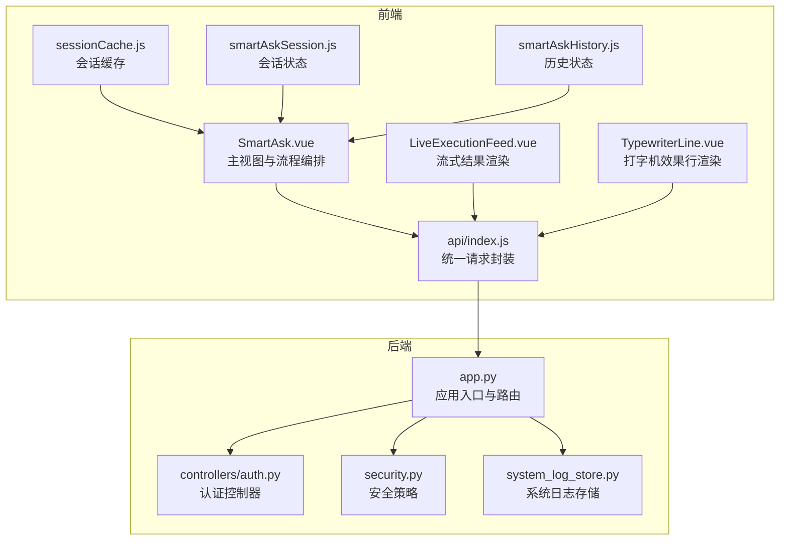
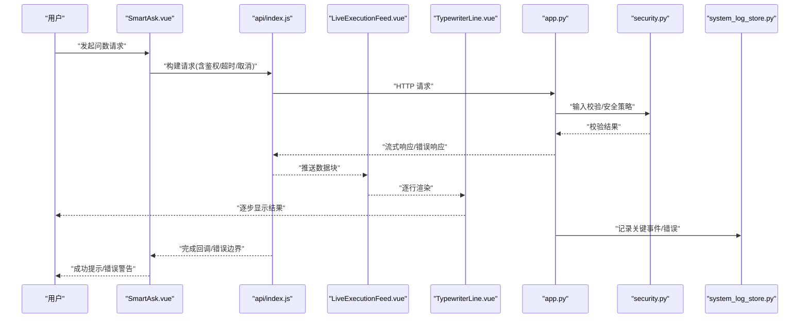
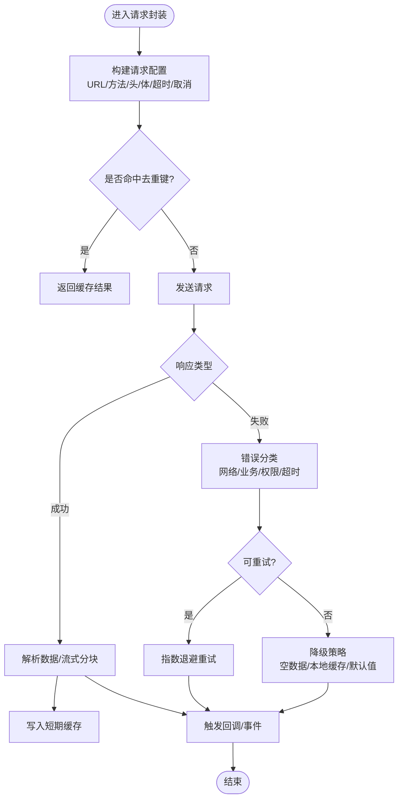
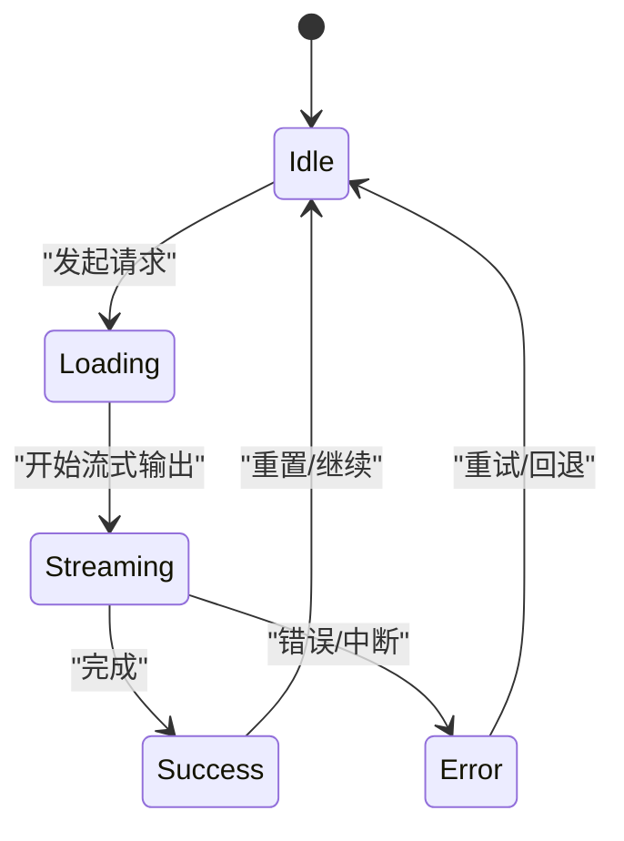
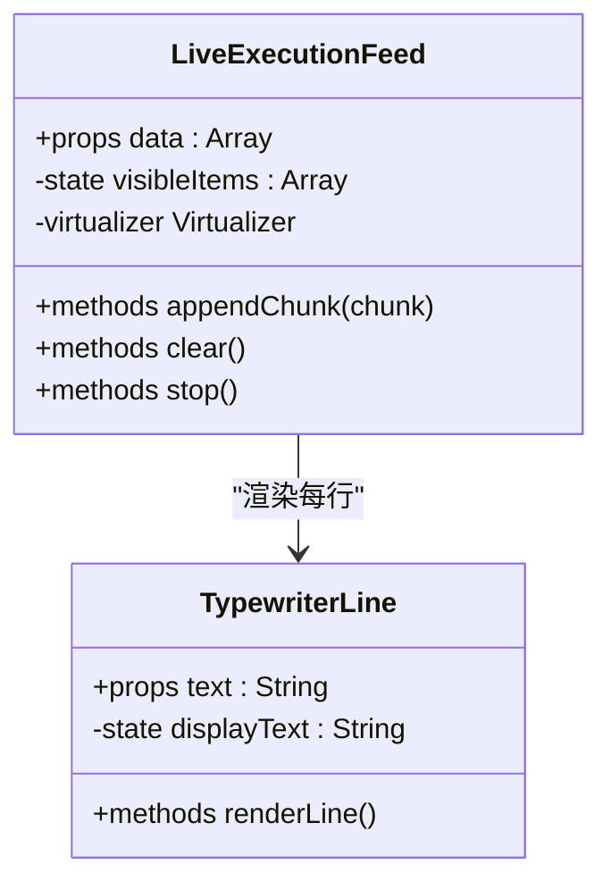
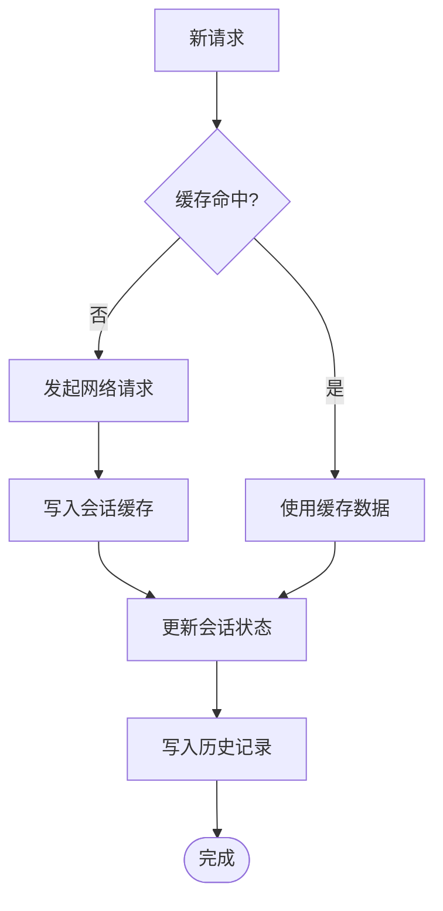
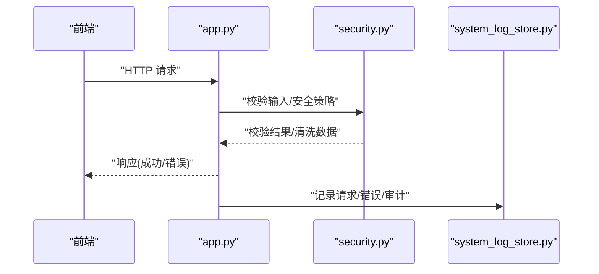
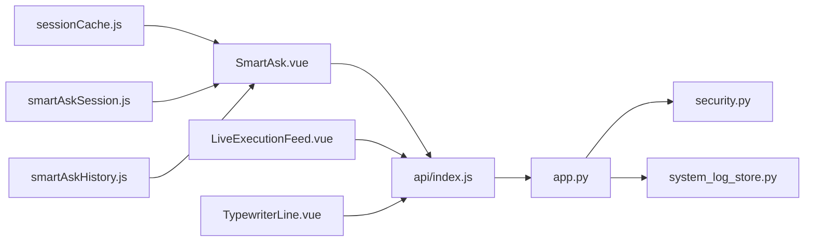

# API 集成最佳实践

<cite>
**本文引用的文件**   
- [frontend/src/api/index.js](file://frontend/src/api/index.js)
- [frontend/src/views/SmartAsk.vue](file://frontend/src/views/SmartAsk.vue)
- [frontend/src/components/smartask/LiveExecutionFeed.vue](file://frontend/src/components/smartask/LiveExecutionFeed.vue)
- [frontend/src/components/smartask/TypewriterLine.vue](file://frontend/src/components/smartask/TypewriterLine.vue)
- [frontend/src/state/sessionCache.js](file://frontend/src/state/sessionCache.js)
- [frontend/src/state/smartAskSession.js](file://frontend/src/state/smartAskSession.js)
- [frontend/src/state/smartAskHistory.js](file://frontend/src/state/smartAskHistory.js)
- [backend/app.py](file://backend/app.py)
- [backend/controllers/auth.py](file://backend/controllers/auth.py)
- [backend/security.py](file://backend/security.py)
- [backend/system_log_store.py](file://backend/system_log_store.py)
</cite>

## 目录
1. [简介](#简介)
2. [项目结构](#项目结构)
3. [核心组件](#核心组件)
4. [架构总览](#架构总览)
5. [详细组件分析](#详细组件分析)
6. [依赖关系分析](#依赖关系分析)
7. [性能考虑](#性能考虑)
8. [故障排查指南](#故障排查指南)
9. [结论](#结论)
10. [附录](#附录)

## 简介
本文件面向 SmartAsk 平台的 API 集成，提供从前端到后端的端到端最佳实践。内容覆盖错误边界处理、加载状态管理、用户反馈设计、性能优化策略、安全考量以及调试与监控方法。文档以仓库中的实际代码为依据，结合可视化图示帮助读者快速理解并落地实施。

## 项目结构
SmartAsk 采用前后端分离架构：
- 前端（Vue 3 + Vite）：API 调用集中在 api 模块，页面与组件负责交互与展示，状态通过组合式状态管理维护。
- 后端（Python）：应用入口集中，控制器按功能划分，安全与日志由独立模块支撑。

**图表来源** 
- [frontend/src/api/index.js](file://frontend/src/api/index.js)
- [frontend/src/views/SmartAsk.vue](file://frontend/src/views/SmartAsk.vue)
- [frontend/src/components/smartask/LiveExecutionFeed.vue](file://frontend/src/components/smartask/LiveExecutionFeed.vue)
- [frontend/src/components/smartask/TypewriterLine.vue](file://frontend/src/components/smartask/TypewriterLine.vue)
- [frontend/src/state/sessionCache.js](file://frontend/src/state/sessionCache.js)
- [frontend/src/state/smartAskSession.js](file://frontend/src/state/smartAskSession.js)
- [frontend/src/state/smartAskHistory.js](file://frontend/src/state/smartAskHistory.js)
- [backend/app.py](file://backend/app.py)
- [backend/controllers/auth.py](file://backend/controllers/auth.py)
- [backend/security.py](file://backend/security.py)
- [backend/system_log_store.py](file://backend/system_log_store.py)

**章节来源**
- [frontend/src/api/index.js](file://frontend/src/api/index.js)
- [frontend/src/views/SmartAsk.vue](file://frontend/src/views/SmartAsk.vue)
- [backend/app.py](file://backend/app.py)

## 核心组件
- 统一请求封装（前端）：集中处理请求头、鉴权、重试、取消、错误分类与上报。
- 主视图与流程编排（前端）：组织对话生命周期、加载态、流式输出与状态同步。
- 流式渲染组件（前端）：增量更新 UI，支持中断与滚动优化。
- 应用入口与安全（后端）：路由注册、全局异常捕获、输入校验、敏感数据处理与日志记录。

**章节来源**
- [frontend/src/api/index.js](file://frontend/src/api/index.js)
- [frontend/src/views/SmartAsk.vue](file://frontend/src/views/SmartAsk.vue)
- [frontend/src/components/smartask/LiveExecutionFeed.vue](file://frontend/src/components/smartask/LiveExecutionFeed.vue)
- [backend/app.py](file://backend/app.py)
- [backend/security.py](file://backend/security.py)

## 架构总览
下图展示了从用户操作到后端处理的完整链路，包括错误边界、加载态、流式响应与日志记录的关键节点。

**图表来源** 
- [frontend/src/views/SmartAsk.vue](file://frontend/src/views/SmartAsk.vue)
- [frontend/src/api/index.js](file://frontend/src/api/index.js)
- [frontend/src/components/smartask/LiveExecutionFeed.vue](file://frontend/src/components/smartask/LiveExecutionFeed.vue)
- [frontend/src/components/smartask/TypewriterLine.vue](file://frontend/src/components/smartask/TypewriterLine.vue)
- [backend/app.py](file://backend/app.py)
- [backend/security.py](file://backend/security.py)
- [backend/system_log_store.py](file://backend/system_log_store.py)

## 详细组件分析

### 统一请求封装（前端）
职责与要点：
- 请求拦截：注入鉴权头、追踪 ID、超时控制、取消令牌。
- 响应处理：统一解析成功/失败，错误分类（网络、业务、权限），触发降级与重试。
- 去重与缓存：对相同参数请求进行合并与短期缓存，避免重复请求。
- 错误边界：捕获未预期异常，上报日志并返回友好提示。

**图表来源** 
- [frontend/src/api/index.js](file://frontend/src/api/index.js)

**章节来源**
- [frontend/src/api/index.js](file://frontend/src/api/index.js)

### 主视图与流程编排（SmartAsk.vue）
职责与要点：
- 生命周期管理：创建会话、发送消息、接收流式片段、终止与清理。
- 加载态管理：骨架屏、进度指示、取消操作、状态同步。
- 用户反馈：成功提示、错误警告、确认对话框、操作反馈。
- 状态同步：与会话缓存和历史记录的协调更新。

**图表来源** 
- [frontend/src/views/SmartAsk.vue](file://frontend/src/views/SmartAsk.vue)

**章节来源**
- [frontend/src/views/SmartAsk.vue](file://frontend/src/views/SmartAsk.vue)

### 流式渲染组件（LiveExecutionFeed.vue）
职责与要点：
- 增量渲染：接收数据块并追加到列表，保持滚动位置与性能。
- 中断与恢复：支持取消当前流式任务，恢复时平滑衔接。
- 虚拟滚动：大数据量下按需渲染可见区域，降低内存占用。

**图表来源** 
- [frontend/src/components/smartask/LiveExecutionFeed.vue](file://frontend/src/components/smartask/LiveExecutionFeed.vue)
- [frontend/src/components/smartask/TypewriterLine.vue](file://frontend/src/components/smartask/TypewriterLine.vue)

**章节来源**
- [frontend/src/components/smartask/LiveExecutionFeed.vue](file://frontend/src/components/smartask/LiveExecutionFeed.vue)
- [frontend/src/components/smartask/TypewriterLine.vue](file://frontend/src/components/smartask/TypewriterLine.vue)

### 会话与历史状态（sessionCache.js / smartAskSession.js / smartAskHistory.js）
职责与要点：
- 会话缓存：短期保存最近请求结果，提升二次访问速度。
- 会话状态：维护当前会话上下文、消息序列、执行状态。
- 历史记录：持久化或半持久化历史条目，支持检索与回放。

**图表来源** 
- [frontend/src/state/sessionCache.js](file://frontend/src/state/sessionCache.js)
- [frontend/src/state/smartAskSession.js](file://frontend/src/state/smartAskSession.js)
- [frontend/src/state/smartAskHistory.js](file://frontend/src/state/smartAskHistory.js)

**章节来源**
- [frontend/src/state/sessionCache.js](file://frontend/src/state/sessionCache.js)
- [frontend/src/state/smartAskSession.js](file://frontend/src/state/smartAskSession.js)
- [frontend/src/state/smartAskHistory.js](file://frontend/src/state/smartAskHistory.js)

### 后端应用入口与安全（app.py / security.py / system_log_store.py）
职责与要点：
- 应用入口：路由注册、中间件链、全局异常捕获、跨域与限流。
- 安全策略：输入校验、XSS 防护、CSRF 防护、敏感字段脱敏与加密。
- 日志记录：结构化日志、错误堆栈、审计事件、性能指标。

**图表来源** 
- [backend/app.py](file://backend/app.py)
- [backend/security.py](file://backend/security.py)
- [backend/system_log_store.py](file://backend/system_log_store.py)

**章节来源**
- [backend/app.py](file://backend/app.py)
- [backend/security.py](file://backend/security.py)
- [backend/system_log_store.py](file://backend/system_log_store.py)

## 依赖关系分析
前端通过 api 模块统一调用后端接口；视图与组件依赖状态模块进行数据绑定与更新；后端控制器与安全模块为 API 提供能力与保障。

**图表来源** 
- [frontend/src/views/SmartAsk.vue](file://frontend/src/views/SmartAsk.vue)
- [frontend/src/api/index.js](file://frontend/src/api/index.js)
- [frontend/src/components/smartask/LiveExecutionFeed.vue](file://frontend/src/components/smartask/LiveExecutionFeed.vue)
- [frontend/src/components/smartask/TypewriterLine.vue](file://frontend/src/components/smartask/TypewriterLine.vue)
- [frontend/src/state/sessionCache.js](file://frontend/src/state/sessionCache.js)
- [frontend/src/state/smartAskSession.js](file://frontend/src/state/smartAskSession.js)
- [frontend/src/state/smartAskHistory.js](file://frontend/src/state/smartAskHistory.js)
- [backend/app.py](file://backend/app.py)
- [backend/security.py](file://backend/security.py)
- [backend/system_log_store.py](file://backend/system_log_store.py)

**章节来源**
- [frontend/src/api/index.js](file://frontend/src/api/index.js)
- [backend/app.py](file://backend/app.py)

## 性能考虑
- 请求去重：基于 URL+参数生成唯一键，合并并发请求，减少重复网络开销。
- 数据缓存：短期会话缓存与长期历史缓存分层，命中即返回，未命中再拉取。
- 懒加载：按需加载组件与数据，首屏最小化，滚动触发加载。
- 虚拟滚动：大数据列表仅渲染可视区域，显著降低内存与重排成本。
- 流式输出：服务端分块推送，前端增量渲染，提升感知速度。
- 取消与中止：支持取消长时间任务，释放资源，避免无效计算。

[本节为通用指导，不直接分析具体文件]

## 故障排查指南
- 全局错误捕获：前端统一拦截器捕获网络与业务错误，分类上报；后端全局异常处理器记录堆栈与上下文。
- 用户友好提示：根据错误类型展示不同提示（网络不可用、权限不足、参数错误、服务降级）。
- 降级策略：缓存优先、默认值回退、离线模式、只读视图。
- 日志收集：前端埋点（请求耗时、错误码、用户行为），后端结构化日志（请求ID、用户ID、时间戳、堆栈）。
- 常见问题：
  - 请求超时：检查后端处理耗时、网络延迟、超时阈值设置。
  - 流式中断：确认取消令牌传播、组件销毁时机、后端流式关闭。
  - 缓存不一致：清理过期缓存、强制刷新、版本兼容。
  - 权限错误：检查鉴权头、角色权限、资源访问控制。

**章节来源**
- [backend/app.py](file://backend/app.py)
- [backend/system_log_store.py](file://backend/system_log_store.py)
- [frontend/src/api/index.js](file://frontend/src/api/index.js)

## 结论
通过统一的请求封装、清晰的视图编排、流式渲染与稳健的后端安全与日志体系，SmartAsk 平台在 API 集成中实现了高可用、高性能与良好用户体验。建议持续完善错误分类、缓存策略与监控告警，确保系统在复杂场景下的稳定性与可观测性。

[本节为总结性内容，不直接分析具体文件]

## 附录
- 安全最佳实践：
  - 输入验证：白名单校验、长度限制、类型转换、SQL 注入防护。
  - XSS 防护：输出编码、CSP 策略、富文本过滤。
  - CSRF 防护：同源策略、Token 校验、SameSite Cookie。
  - 敏感数据加密：传输层 TLS、字段级加密、密钥管理。
- 调试与监控：
  - 网络请求监控：记录请求/响应、耗时、错误码、重试次数。
  - 错误追踪：前端 Sentry/自研上报，后端结构化日志与堆栈。
  - 性能分析：首屏时间、长任务检测、内存泄漏排查。
  - 日志收集：集中化日志平台、索引与告警规则。

[本节为通用指导，不直接分析具体文件]