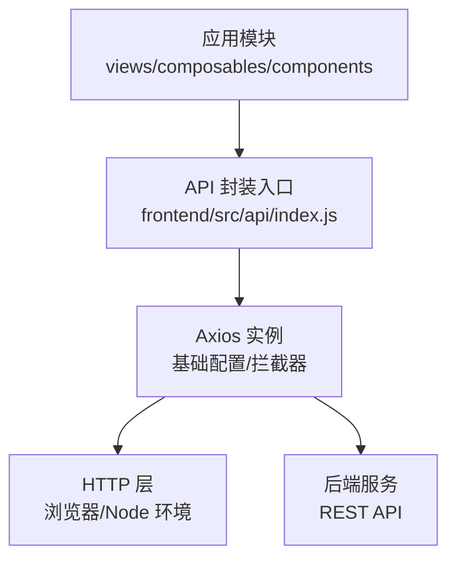
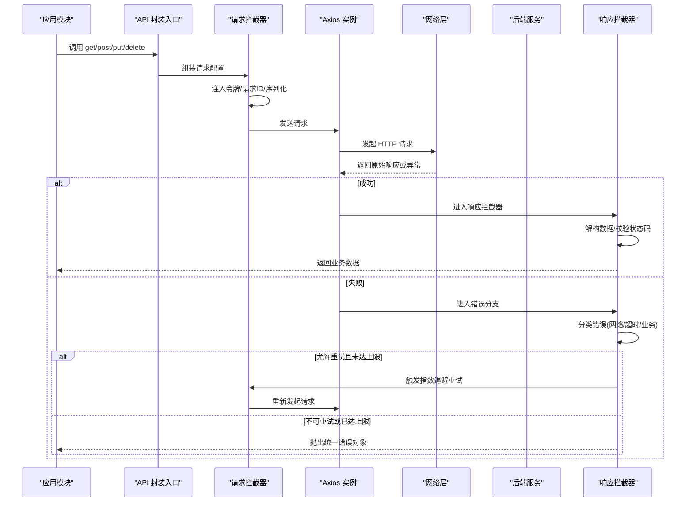
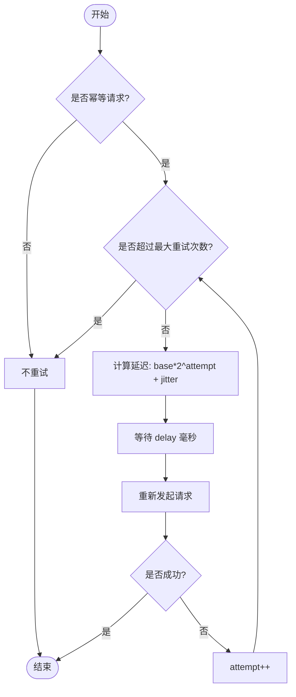
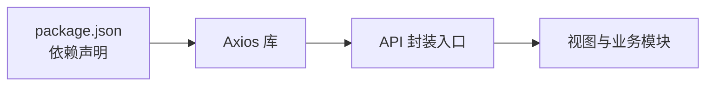

# HTTP 客户端封装

<cite>
**本文引用的文件**   
- [frontend/src/api/index.js](file://frontend/src/api/index.js)
- [frontend/package.json](file://frontend/package.json)
</cite>

## 目录
1. [简介](#简介)
2. [项目结构](#项目结构)
3. [核心组件](#核心组件)
4. [架构总览](#架构总览)
5. [详细组件分析](#详细组件分析)
6. [依赖关系分析](#依赖关系分析)
7. [性能考量](#性能考量)
8. [故障排查指南](#故障排查指南)
9. [结论](#结论)
10. [附录](#附录)

## 简介
本文件为 SmartAsk 平台前端 HTTP 客户端封装的权威文档，聚焦统一的 API 请求封装实现与最佳实践。内容涵盖 Axios 实例配置、请求/响应拦截器设计模式、统一错误处理策略（网络错误、业务错误、超时）、请求重试机制（指数退避与最大重试次数）、参数序列化与响应解构、类型转换、请求取消与并发控制、缓存策略，以及 GET/POST/PUT/DELETE 调用方式、文件上传下载、流式响应处理等使用示例与调试优化建议。

## 项目结构
SmartAsk 前端的 HTTP 客户端封装位于 frontend/src/api 目录下，通过单一入口对外暴露统一的请求方法。该封装基于 Axios 构建，集中管理基础 URL、超时、认证头、拦截器与通用错误处理逻辑，便于全应用一致地发起 HTTP 请求。

图表来源
- [frontend/src/api/index.js](file://frontend/src/api/index.js)

章节来源
- [frontend/src/api/index.js](file://frontend/src/api/index.js)

## 核心组件
- Axios 实例：集中定义 baseURL、超时时间、Content-Type、认证头等基础配置。
- 请求拦截器：统一注入鉴权令牌、请求 ID、防重放标记、参数序列化等。
- 响应拦截器：统一解构业务数据、状态码校验、错误映射、日志埋点。
- 错误处理：区分网络错误、超时、业务错误，提供可配置的降级与提示。
- 重试机制：支持指数退避、最大重试次数、幂等性判断与抖动随机化。
- 工具函数：参数序列化、URL 编码、查询串拼接、响应解构与类型转换。
- 导出接口：get/post/put/delete 等方法封装，支持可选的重试、取消、缓存开关。

章节来源
- [frontend/src/api/index.js](file://frontend/src/api/index.js)

## 架构总览
下图展示了从业务模块到后端服务的完整调用链路，包括拦截器、错误处理与重试流程的关键节点。

图表来源
- [frontend/src/api/index.js](file://frontend/src/api/index.js)

## 详细组件分析

### Axios 实例与基础配置
- 目标：为所有请求提供一致的基线行为，避免重复配置。
- 关键点：
  - baseURL：指向后端服务根路径，便于跨环境切换。
  - timeout：设置全局超时阈值，配合错误处理给出明确提示。
  - headers：默认 Content-Type、Accept、Authorization 等。
  - withCredentials：是否携带 Cookie，用于跨域会话场景。
  - transformRequest/transformResponse：统一参数序列化与响应解构。

章节来源
- [frontend/src/api/index.js](file://frontend/src/api/index.js)

### 请求拦截器设计
- 目标：在请求发出前完成鉴权、追踪、参数标准化等操作。
- 关键点：
  - 注入 Authorization 头（如 JWT）。
  - 生成唯一 requestId，便于链路追踪与去重。
  - 对 JSON 请求体进行序列化；对查询参数进行 URL 编码。
  - 合并用户自定义 headers，避免覆盖关键头。
  - 支持可选的幂等键（idempotency-key）用于重试安全。

章节来源
- [frontend/src/api/index.js](file://frontend/src/api/index.js)

### 响应拦截器设计
- 目标：统一解析响应数据、校验业务状态码、规范化错误对象。
- 关键点：
  - 解构业务响应体（如 { code, data, message }），提取 data。
  - 根据后端状态码映射为统一错误类型（网络/超时/业务）。
  - 记录请求耗时、路由、参数摘要（脱敏）用于监控与排障。
  - 将非 2xx 响应转换为标准错误对象，包含可诊断信息。

章节来源
- [frontend/src/api/index.js](file://frontend/src/api/index.js)

### 统一错误处理机制
- 目标：将各类异常收敛为一致的错误模型，便于上层消费与展示。
- 关键点：
  - 网络错误：连接失败、DNS 解析失败、CORS 错误等。
  - 超时错误：超过 timeout 阈值，自动中断并提示。
  - 业务错误：后端返回非 2xx 或业务码异常，携带 message 与 code。
  - 错误分级：区分可重试与不可重试，指导重试策略。
  - 用户提示：结合 UI 框架显示友好消息，避免技术细节泄露。

章节来源
- [frontend/src/api/index.js](file://frontend/src/api/index.js)

### 请求重试机制（指数退避）
- 目标：提升弱网与瞬时错误的成功率，同时避免雪崩。
- 关键点：
  - 仅对幂等请求（GET/HEAD/OPTIONS/PUT/DELETE）启用重试。
  - 指数退避公式：delay = baseDelay * (2^attempt) + jitter。
  - 最大重试次数：可配置上限，防止无限重试。
  - 抖动随机化：加入随机抖动，降低多客户端同步重试风险。
  - 条件跳过：针对特定错误码或响应特征跳过重试。

图表来源
- [frontend/src/api/index.js](file://frontend/src/api/index.js)

章节来源
- [frontend/src/api/index.js](file://frontend/src/api/index.js)

### 参数序列化与响应解构
- 目标：确保请求参数与响应数据的格式一致性，减少边界问题。
- 关键点：
  - 请求侧：JSON 对象序列化为字符串；查询参数进行 URL 编码；FormData 用于文件上传。
  - 响应侧：根据 Content-Type 选择解析策略（JSON/Blob/Text）。
  - 类型转换：数值、布尔、日期等字段按约定转换，保证下游稳定消费。
  - 空值处理：剔除 undefined/null，避免无效参数传递。

章节来源
- [frontend/src/api/index.js](file://frontend/src/api/index.js)

### 请求取消与并发控制
- 目标：避免内存泄漏与资源浪费，提升用户体验。
- 关键点：
  - 取消令牌：使用 AbortController 管理请求生命周期，组件卸载时取消。
  - 并发限制：维护队列或信号量，限制同时进行的请求数量。
  - 优先级：高优先级请求抢占低优先级请求（可选）。
  - 清理：取消后释放监听器与定时器，避免悬挂任务。

章节来源
- [frontend/src/api/index.js](file://frontend/src/api/index.js)

### 缓存策略
- 目标：减少重复请求，提升响应速度与稳定性。
- 关键点：
  - 缓存键：由 URL、方法、查询参数与必要请求头组成。
  - 缓存有效期：TTL 控制过期时间，支持手动失效。
  - 缓存存储：内存 Map 为主，必要时持久化（谨慎使用）。
  - 写操作绕过：POST/PUT/DELETE 默认不命中缓存，或选择性更新相关键。
  - 缓存预热：页面加载时预取高频数据。

章节来源
- [frontend/src/api/index.js](file://frontend/src/api/index.js)

### 使用示例
- GET 请求：传入 URL 与查询参数，支持缓存与重试开关。
- POST 请求：提交 JSON 或 FormData，适用于表单与文件上传。
- PUT/DELETE：更新或删除资源，注意幂等性与确认提示。
- 文件上传：使用 FormData，设置正确的 Content-Type，处理进度事件。
- 文件下载：接收 Blob，生成临时链接触发下载，处理大文件分块。
- 流式响应：读取 ReadableStream，增量渲染 SSE/Server-Sent Events。

章节来源
- [frontend/src/api/index.js](file://frontend/src/api/index.js)

## 依赖关系分析
HTTP 客户端封装依赖 Axios 作为底层 HTTP 库，并通过 package.json 声明版本约束。稳定的依赖版本有助于避免兼容性问题与运行时异常。

图表来源
- [frontend/package.json](file://frontend/package.json)
- [frontend/src/api/index.js](file://frontend/src/api/index.js)

章节来源
- [frontend/package.json](file://frontend/package.json)
- [frontend/src/api/index.js](file://frontend/src/api/index.js)

## 性能考量
- 合理设置超时与重试：避免过长等待与过多重试导致卡顿。
- 压缩传输：启用 gzip/br 压缩，减小响应体积。
- 连接复用：保持长连接，减少握手开销。
- 缓存命中：优先命中内存缓存，降低后端压力。
- 懒加载：按需发起请求，避免首屏阻塞。
- 监控埋点：记录请求耗时、错误率、重试次数，持续优化。

[本节为通用指导，无需引用具体文件]

## 故障排查指南
- 常见问题定位：
  - 网络错误：检查 CORS、代理、域名解析与证书。
  - 超时错误：调整 timeout，排查后端慢查询与数据库锁。
  - 业务错误：核对后端状态码与 message，完善错误映射。
  - 重试风暴：检查幂等键与抖动参数，避免雪崩。
- 调试技巧：
  - 开启请求/响应日志，记录 requestId 与耗时。
  - 使用浏览器开发者工具 Network 面板过滤与抓包。
  - 模拟弱网与错误码，验证降级与提示逻辑。
- 修复建议：
  - 统一错误码字典，前后端对齐。
  - 增加熔断与限流，保护后端与前端体验。
  - 完善单元测试与集成测试，覆盖边界用例。

章节来源
- [frontend/src/api/index.js](file://frontend/src/api/index.js)

## 结论
通过对 Axios 的统一封装，SmartAsk 平台在前端实现了稳定、可观测、易扩展的 HTTP 客户端能力。借助拦截器、错误处理、重试与缓存等机制，显著提升了网络调用的健壮性与性能。建议在后续迭代中持续完善监控与测试，确保在高并发与弱网环境下依然保持良好体验。

[本节为总结性内容，无需引用具体文件]

## 附录
- 术语表：
  - 幂等请求：多次执行结果与一次执行相同（GET/HEAD/OPTIONS/PUT/DELETE）。
  - 指数退避：重试间隔按指数增长，降低竞争与拥塞。
  - 抖动随机化：在退避基础上加入随机偏移，避免同步重试。
  - 流式响应：服务端逐步推送数据，客户端增量处理。
- 参考规范：
  - RESTful API 设计规范
  - HTTP 状态码语义
  - 前端错误处理最佳实践

[本节为概念性内容，无需引用具体文件]