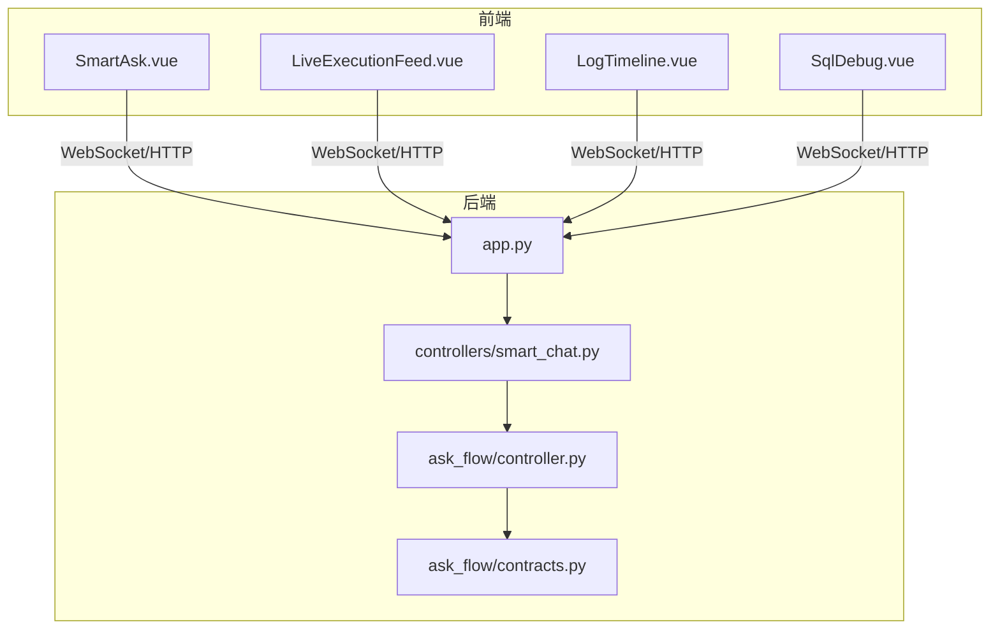
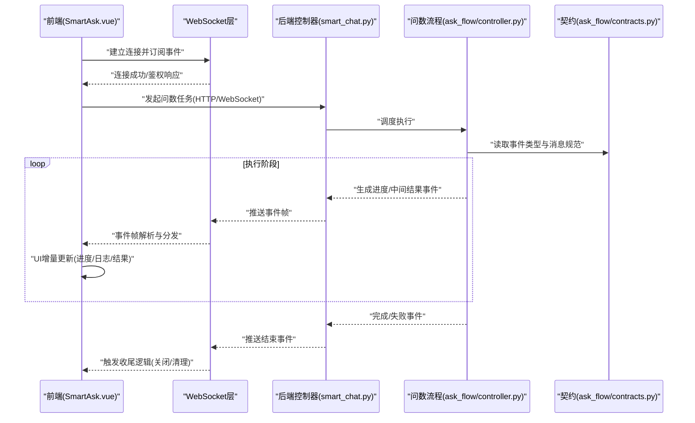
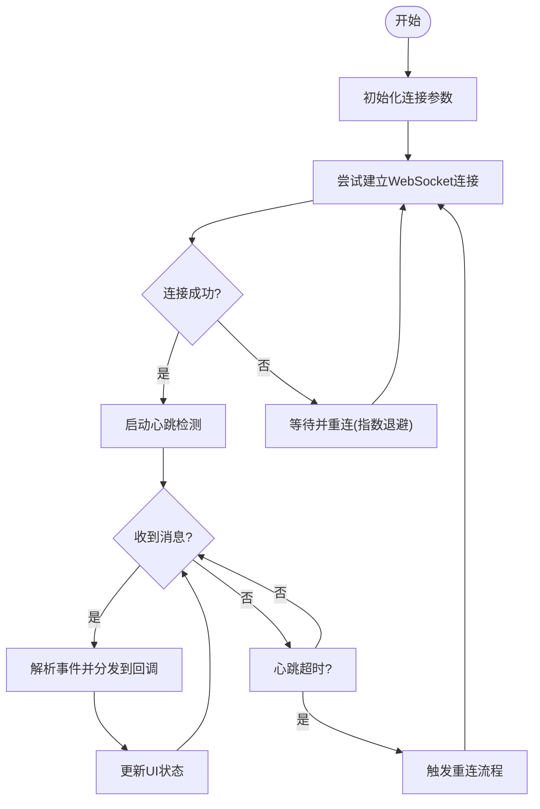
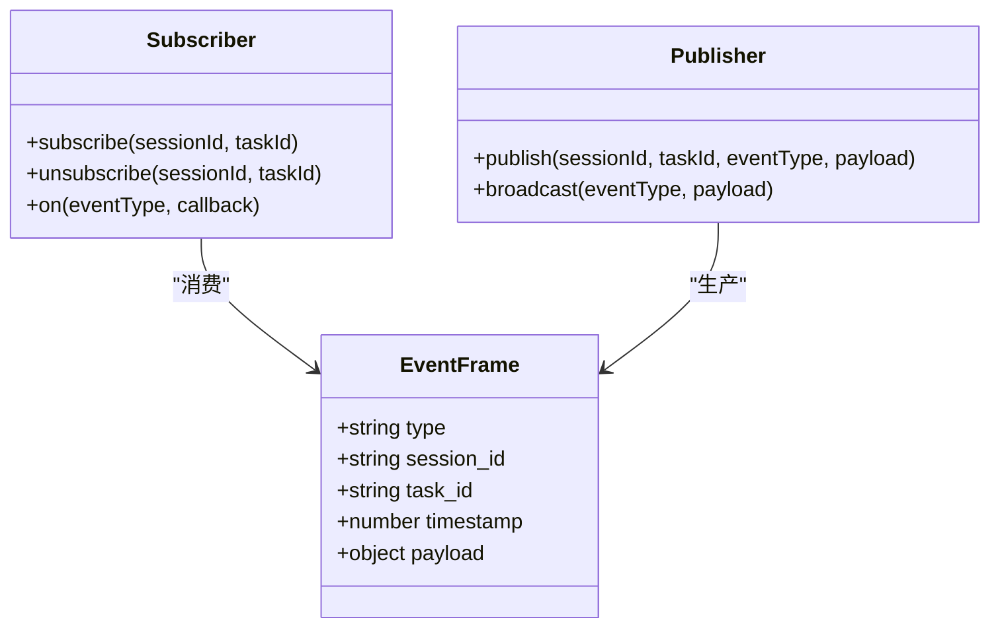
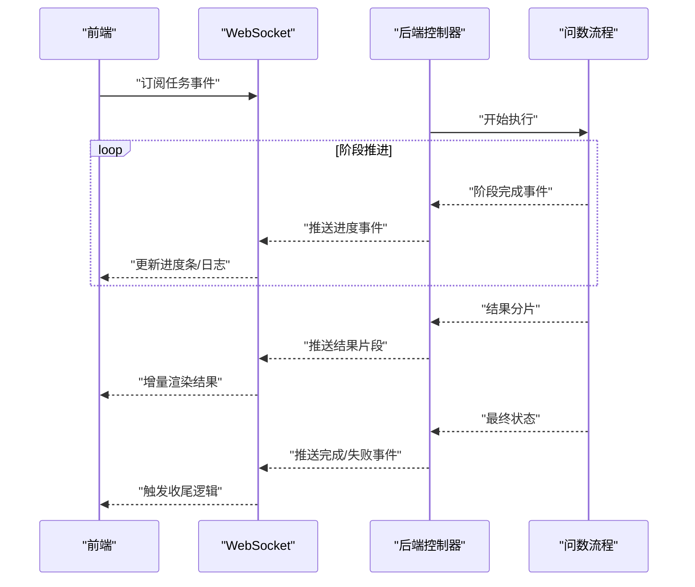
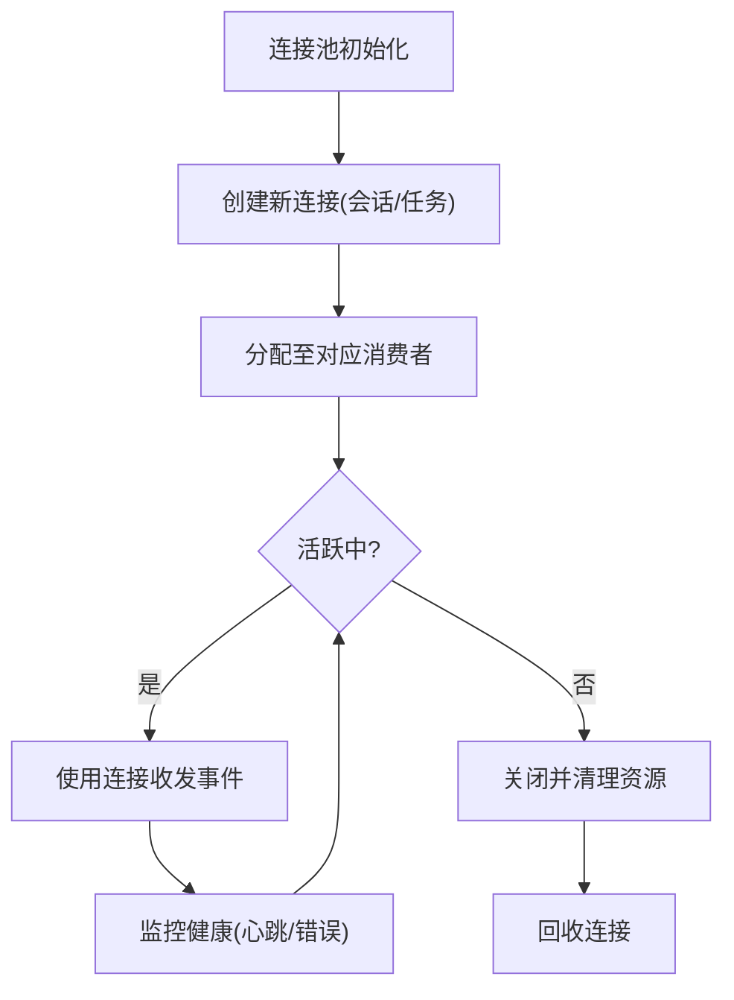
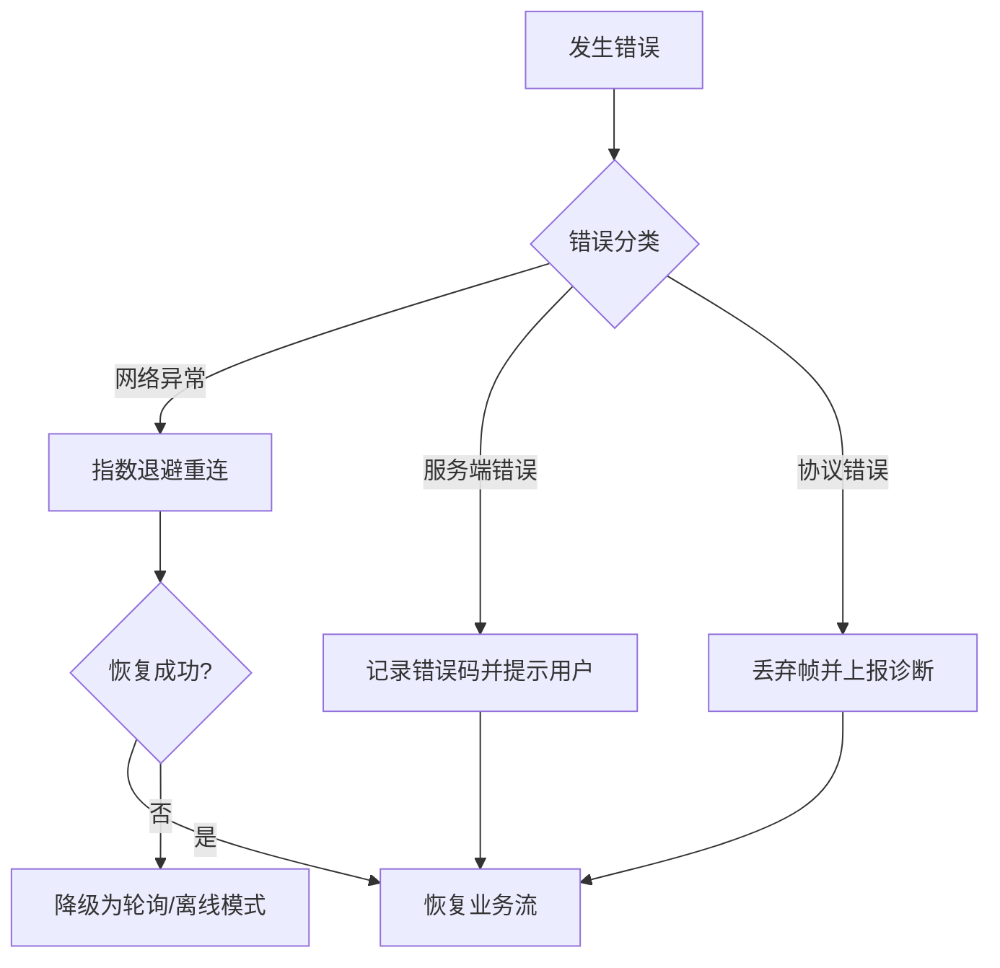
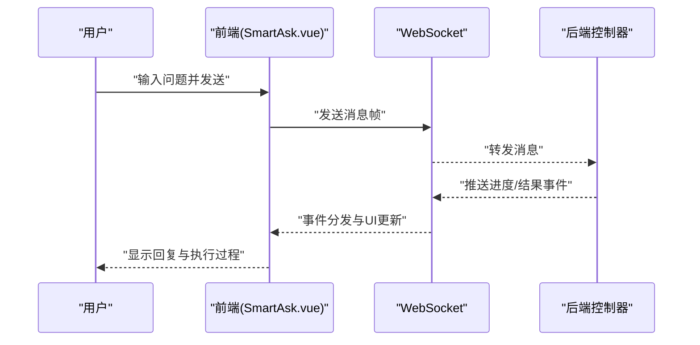
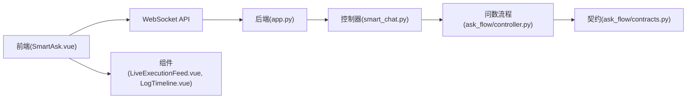

# WebSocket 实时通信

<cite>
**本文引用的文件**   
- [app.py](file://backend/app.py)
- [smart_chat.py](file://backend/controllers/smart_chat.py)
- [ask_flow_controller.py](file://backend/ask_flow/controller.py)
- [contracts.py](file://backend/ask_flow/contracts.py)
- [SmartAsk.vue](file://frontend/src/views/SmartAsk.vue)
- [LiveExecutionFeed.vue](file://frontend/src/components/smartask/LiveExecutionFeed.vue)
- [LogTimeline.vue](file://frontend/src/components/smartask/LogTimeline.vue)
- [SqlDebug.vue](file://frontend/src/views/SqlDebug.vue)
- [package.json](file://frontend/package.json)
</cite>

## 目录
1. [简介](#简介)
2. [项目结构](#项目结构)
3. [核心组件](#核心组件)
4. [架构总览](#架构总览)
5. [详细组件分析](#详细组件分析)
6. [依赖关系分析](#依赖关系分析)
7. [性能考量](#性能考量)
8. [故障排查指南](#故障排查指南)
9. [结论](#结论)
10. [附录](#附录)

## 简介
本文件面向 SmartAsk 平台的 WebSocket 实时通信能力，系统性阐述连接管理（建立、自动重连、心跳检测、断线处理）、消息订阅与发布机制（事件类型、消息格式、回调处理）、实时数据流（问数执行进度推送、结果流式返回、状态更新通知）、连接池管理（多连接支持、资源清理、内存泄漏防护）、错误处理与恢复策略（网络异常、服务端错误、协议错误），并提供集成示例（实时聊天、进度监控、事件驱动的 UI 更新）以及调试工具与性能监控方法。

## 项目结构
后端以 FastAPI 应用为核心，提供 HTTP 接口与 WebSocket 端点；前端基于 Vue 3 与 Vite，通过原生 WebSocket API 或第三方库实现与服务端的实时交互。关键位置如下：
- 后端入口与路由注册：backend/app.py
- 智能对话控制器（含 WebSocket 相关逻辑）：backend/controllers/smart_chat.py
- 问数流程控制器与契约定义：backend/ask_flow/controller.py、backend/ask_flow/contracts.py
- 前端主视图与实时展示组件：frontend/src/views/SmartAsk.vue、frontend/src/components/smartask/LiveExecutionFeed.vue、frontend/src/components/smartask/LogTimeline.vue
- 调试页面：frontend/src/views/SqlDebug.vue
- 前端依赖声明：frontend/package.json

**图表来源** 
- [app.py](file://backend/app.py)
- [smart_chat.py](file://backend/controllers/smart_chat.py)
- [ask_flow_controller.py](file://backend/ask_flow/controller.py)
- [contracts.py](file://backend/ask_flow/contracts.py)
- [SmartAsk.vue](file://frontend/src/views/SmartAsk.vue)
- [LiveExecutionFeed.vue](file://frontend/src/components/smartask/LiveExecutionFeed.vue)
- [LogTimeline.vue](file://frontend/src/components/smartask/LogTimeline.vue)
- [SqlDebug.vue](file://frontend/src/views/SqlDebug.vue)

**章节来源**
- [app.py](file://backend/app.py)
- [smart_chat.py](file://backend/controllers/smart_chat.py)
- [ask_flow_controller.py](file://backend/ask_flow/controller.py)
- [contracts.py](file://backend/ask_flow/contracts.py)
- [SmartAsk.vue](file://frontend/src/views/SmartAsk.vue)
- [LiveExecutionFeed.vue](file://frontend/src/components/smartask/LiveExecutionFeed.vue)
- [LogTimeline.vue](file://frontend/src/components/smartask/LogTimeline.vue)
- [SqlDebug.vue](file://frontend/src/views/SqlDebug.vue)
- [package.json](file://frontend/package.json)

## 核心组件
- 连接管理器（前端）：负责 WebSocket 生命周期（连接、重连、心跳、断线处理）、消息订阅/发布、事件分发与回调。
- 实时渲染组件（前端）：消费事件流，驱动 UI 增量更新（如执行进度条、日志时间轴、结果流式输出）。
- 后端控制器（后端）：接收客户端请求，调度问数流程，按事件类型推送进度与结果片段。
- 契约与协议（后端）：定义事件类型、消息字段、状态码与错误码，确保前后端一致性。

**章节来源**
- [smart_chat.py](file://backend/controllers/smart_chat.py)
- [ask_flow_controller.py](file://backend/ask_flow/controller.py)
- [contracts.py](file://backend/ask_flow/contracts.py)
- [SmartAsk.vue](file://frontend/src/views/SmartAsk.vue)
- [LiveExecutionFeed.vue](file://frontend/src/components/smartask/LiveExecutionFeed.vue)
- [LogTimeline.vue](file://frontend/src/components/smartask/LogTimeline.vue)

## 架构总览
整体采用“前端事件驱动 + 后端事件推送”的架构。前端通过 WebSocket 建立长连接，订阅特定会话或任务的事件通道；后端在问数执行过程中按阶段推送进度、中间结果与最终结果，前端根据事件类型进行增量渲染与状态同步。

**图表来源** 
- [smart_chat.py](file://backend/controllers/smart_chat.py)
- [ask_flow_controller.py](file://backend/ask_flow/controller.py)
- [contracts.py](file://backend/ask_flow/contracts.py)
- [SmartAsk.vue](file://frontend/src/views/SmartAsk.vue)

## 详细组件分析

### 连接管理与重连策略（前端）
- 连接建立：在页面初始化或用户触发时创建 WebSocket 连接，携带必要的鉴权参数（如 token、会话标识）。
- 自动重连：当检测到连接断开或网络异常时，采用指数退避策略进行重连，避免雪崩效应。
- 心跳检测：周期性发送心跳帧，服务端未响应则判定为断线并触发重连。
- 断线处理：记录断线原因，清理临时状态，必要时提示用户并引导重试。

**图表来源** 
- [SmartAsk.vue](file://frontend/src/views/SmartAsk.vue)
- [LiveExecutionFeed.vue](file://frontend/src/components/smartask/LiveExecutionFeed.vue)
- [LogTimeline.vue](file://frontend/src/components/smartask/LogTimeline.vue)

**章节来源**
- [SmartAsk.vue](file://frontend/src/views/SmartAsk.vue)
- [LiveExecutionFeed.vue](file://frontend/src/components/smartask/LiveExecutionFeed.vue)
- [LogTimeline.vue](file://frontend/src/components/smartask/LogTimeline.vue)

### 消息订阅与发布机制（前后端）
- 事件类型：包括连接状态、执行进度、中间结果、最终结果、错误信息等。
- 消息格式：统一 JSON 帧结构，包含事件类型、会话/任务标识、时间戳、负载数据等。
- 订阅模型：前端按会话或任务维度订阅事件，避免无关事件干扰。
- 发布模型：后端按执行阶段推送事件，保证顺序性与幂等性。

**图表来源** 
- [contracts.py](file://backend/ask_flow/contracts.py)
- [smart_chat.py](file://backend/controllers/smart_chat.py)
- [ask_flow_controller.py](file://backend/ask_flow/controller.py)

**章节来源**
- [contracts.py](file://backend/ask_flow/contracts.py)
- [smart_chat.py](file://backend/controllers/smart_chat.py)
- [ask_flow_controller.py](file://backend/ask_flow/controller.py)

### 实时数据流：问数执行进度、结果流式返回、状态更新
- 进度推送：将执行步骤拆分为多个阶段，每阶段推送进度事件（如“解析SQL”、“执行查询”、“聚合结果”）。
- 结果流式返回：大结果集分片推送，前端增量渲染，避免一次性加载导致卡顿。
- 状态更新通知：任务状态变更（进行中、完成、失败）及时通知前端，驱动界面切换。

**图表来源** 
- [ask_flow_controller.py](file://backend/ask_flow/controller.py)
- [smart_chat.py](file://backend/controllers/smart_chat.py)
- [LiveExecutionFeed.vue](file://frontend/src/components/smartask/LiveExecutionFeed.vue)
- [LogTimeline.vue](file://frontend/src/components/smartask/LogTimeline.vue)

**章节来源**
- [ask_flow_controller.py](file://backend/ask_flow/controller.py)
- [smart_chat.py](file://backend/controllers/smart_chat.py)
- [LiveExecutionFeed.vue](file://frontend/src/components/smartask/LiveExecutionFeed.vue)
- [LogTimeline.vue](file://frontend/src/components/smartask/LogTimeline.vue)

### 连接池管理（多连接支持、资源清理、内存泄漏防护）
- 多连接支持：按会话或任务维度维护独立连接，避免单点阻塞影响全局。
- 资源清理：连接关闭时释放事件监听器、定时器与缓存数据。
- 内存泄漏防护：限制事件队列长度，定期清理过期任务上下文，避免无限增长。

**图表来源** 
- [SmartAsk.vue](file://frontend/src/views/SmartAsk.vue)
- [LiveExecutionFeed.vue](file://frontend/src/components/smartask/LiveExecutionFeed.vue)

**章节来源**
- [SmartAsk.vue](file://frontend/src/views/SmartAsk.vue)
- [LiveExecutionFeed.vue](file://frontend/src/components/smartask/LiveExecutionFeed.vue)

### 错误处理与恢复策略
- 网络异常：捕获连接失败、超时、中断等异常，触发重连与降级策略。
- 服务端错误：识别服务端返回的错误码，区分可重试与不可重试错误。
- 协议错误：校验消息格式与字段完整性，丢弃非法帧并记录诊断信息。

**图表来源** 
- [smart_chat.py](file://backend/controllers/smart_chat.py)
- [ask_flow_controller.py](file://backend/ask_flow/controller.py)
- [SmartAsk.vue](file://frontend/src/views/SmartAsk.vue)

**章节来源**
- [smart_chat.py](file://backend/controllers/smart_chat.py)
- [ask_flow_controller.py](file://backend/ask_flow/controller.py)
- [SmartAsk.vue](file://frontend/src/views/SmartAsk.vue)

### 集成示例
- 实时聊天：前端建立 WebSocket 连接，发送用户消息，接收服务端回复并即时渲染。
- 进度监控：订阅执行进度事件，更新进度条与日志时间轴。
- 事件驱动的 UI 更新：根据事件类型切换组件状态（加载中、完成、失败），并触发相应动画或提示。

**图表来源** 
- [SmartAsk.vue](file://frontend/src/views/SmartAsk.vue)
- [LiveExecutionFeed.vue](file://frontend/src/components/smartask/LiveExecutionFeed.vue)
- [LogTimeline.vue](file://frontend/src/components/smartask/LogTimeline.vue)
- [smart_chat.py](file://backend/controllers/smart_chat.py)

**章节来源**
- [SmartAsk.vue](file://frontend/src/views/SmartAsk.vue)
- [LiveExecutionFeed.vue](file://frontend/src/components/smartask/LiveExecutionFeed.vue)
- [LogTimeline.vue](file://frontend/src/components/smartask/LogTimeline.vue)
- [smart_chat.py](file://backend/controllers/smart_chat.py)

## 依赖关系分析
- 前端依赖：Vue 3、Vite、原生 WebSocket API 或第三方库（如 socket.io-client，若使用需在 package.json 中声明）。
- 后端依赖：FastAPI、异步 I/O 框架、数据库访问层（用于持久化历史与配置）。
- 模块耦合：控制器与问数流程解耦，通过契约定义事件协议，降低前后端耦合度。

**图表来源** 
- [package.json](file://frontend/package.json)
- [app.py](file://backend/app.py)
- [smart_chat.py](file://backend/controllers/smart_chat.py)
- [ask_flow_controller.py](file://backend/ask_flow/controller.py)
- [contracts.py](file://backend/ask_flow/contracts.py)

**章节来源**
- [package.json](file://frontend/package.json)
- [app.py](file://backend/app.py)
- [smart_chat.py](file://backend/controllers/smart_chat.py)
- [ask_flow_controller.py](file://backend/ask_flow/controller.py)
- [contracts.py](file://backend/ask_flow/contracts.py)

## 性能考量
- 连接复用：尽量复用已有连接，减少握手开销。
- 批量推送：合并小事件为批量帧，降低网络频率。
- 背压控制：前端限制事件处理速率，避免 UI 卡顿。
- 资源上限：设置连接池大小上限与事件队列长度，防止内存膨胀。
- 压缩传输：对大结果分片启用压缩（如 gzip），减少带宽占用。

[本节为通用指导，不直接分析具体文件]

## 故障排查指南
- 连接失败：检查鉴权参数、网络连通性、防火墙策略。
- 心跳超时：确认服务端心跳响应是否正常，调整超时阈值。
- 事件丢失：核对事件序列号与去重逻辑，检查前端事件队列是否溢出。
- 内存泄漏：监控连接数量与事件队列长度，定期清理无效会话。
- 调试工具：使用浏览器开发者工具的 Network/WebSocket 面板、后端日志与 SqlDebug.vue 辅助定位。

**章节来源**
- [SqlDebug.vue](file://frontend/src/views/SqlDebug.vue)
- [SmartAsk.vue](file://frontend/src/views/SmartAsk.vue)
- [smart_chat.py](file://backend/controllers/smart_chat.py)

## 结论
SmartAsk 平台的 WebSocket 实时通信通过清晰的前后端职责划分与契约定义，实现了高可靠、可扩展的实时数据流。连接管理、消息订阅/发布、错误恢复与性能优化共同保障了用户体验与系统稳定性。建议在生产环境中持续监控连接健康与事件吞吐，结合调试工具快速定位问题。

[本节为总结性内容，不直接分析具体文件]

## 附录
- 事件类型清单：连接状态、执行进度、中间结果、最终结果、错误信息。
- 消息帧字段：type、session_id、task_id、timestamp、payload。
- 常见错误码：网络类、服务端类、协议类。
- 最佳实践：最小化事件粒度、合理设置重连退避、严格校验消息格式。

[本节为补充说明，不直接分析具体文件]