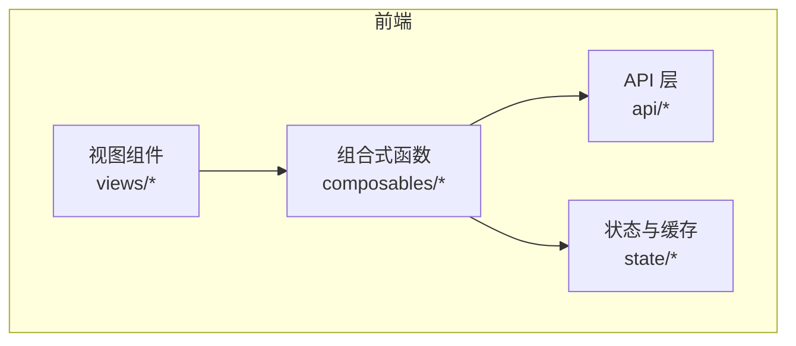
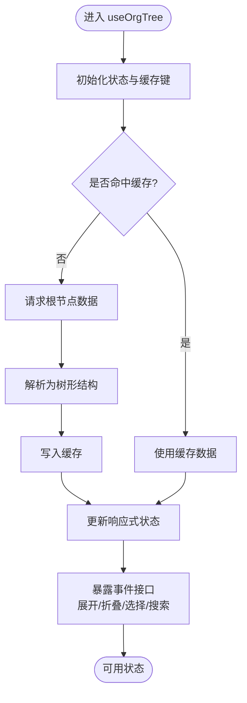
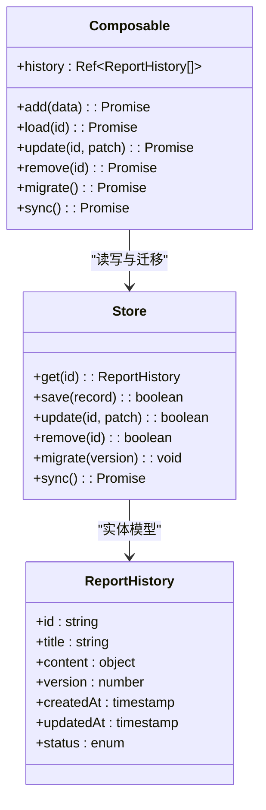
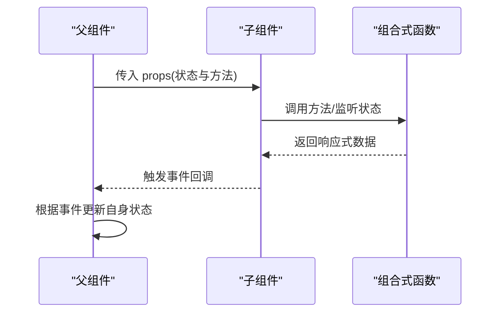
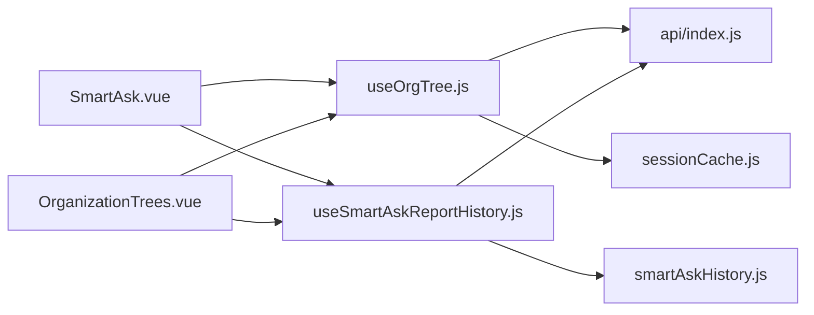

# 组合式函数模式

<cite>
**本文档引用的文件**   
- [useOrgTree.js](file://frontend/src/composables/useOrgTree.js)
- [useSmartAskReportHistory.js](file://frontend/src/composables/useSmartAskReportHistory.js)
- [SmartAsk.vue](file://frontend/src/views/SmartAsk.vue)
- [OrganizationTrees.vue](file://frontend/src/views/OrganizationTrees.vue)
- [api/index.js](file://frontend/src/api/index.js)
- [sessionCache.js](file://frontend/src/state/sessionCache.js)
- [smartAskHistory.js](file://frontend/src/state/smartAskHistory.js)
</cite>

## 目录
1. [简介](#简介)
2. [项目结构](#项目结构)
3. [核心组件](#核心组件)
4. [架构总览](#架构总览)
5. [详细组件分析](#详细组件分析)
6. [依赖分析](#依赖分析)
7. [性能考虑](#性能考虑)
8. [故障排查指南](#故障排查指南)
9. [结论](#结论)
10. [附录](#附录)

## 简介
本文件面向 SmartAsk 平台的前端 Vue 3 组合式函数（composables）模式，聚焦可复用逻辑的封装设计，包括状态管理、副作用处理与生命周期管理的最佳实践。重点文档化两个关键组合式函数：
- useOrgTree：组织树数据管理，涵盖树形数据结构、异步加载、缓存策略与事件处理。
- useSmartAskReportHistory：报告历史管理，涵盖 CRUD 操作、本地存储、同步机制与数据迁移。

同时提供测试策略、与其他组件的集成方式、自定义组合式函数的开发指南以及使用示例与调试技巧，帮助开发者快速理解并高效扩展。

## 项目结构
前端代码采用按功能域划分的目录组织，组合式函数集中在 composables 目录中，视图组件在 views 目录中通过组合式函数获取状态与行为，API 调用统一在 api 目录中定义，全局状态与缓存位于 state 目录。

图表来源
- [SmartAsk.vue](file://frontend/src/views/SmartAsk.vue)
- [OrganizationTrees.vue](file://frontend/src/views/OrganizationTrees.vue)
- [useOrgTree.js](file://frontend/src/composables/useOrgTree.js)
- [useSmartAskReportHistory.js](file://frontend/src/composables/useSmartAskReportHistory.js)
- [api/index.js](file://frontend/src/api/index.js)
- [sessionCache.js](file://frontend/src/state/sessionCache.js)
- [smartAskHistory.js](file://frontend/src/state/smartAskHistory.js)

章节来源
- [useOrgTree.js](file://frontend/src/composables/useOrgTree.js)
- [useSmartAskReportHistory.js](file://frontend/src/composables/useSmartAskReportHistory.js)
- [api/index.js](file://frontend/src/api/index.js)
- [sessionCache.js](file://frontend/src/state/sessionCache.js)
- [smartAskHistory.js](file://frontend/src/state/smartAskHistory.js)

## 核心组件
- useOrgTree：负责组织树的构建、展开/折叠、搜索过滤、异步加载节点、缓存命中与失效、事件派发与订阅。
- useSmartAskReportHistory：负责报告历史的增删改查、本地持久化、版本迁移、冲突合并与同步策略。

章节来源
- [useOrgTree.js](file://frontend/src/composables/useOrgTree.js)
- [useSmartAskReportHistory.js](file://frontend/src/composables/useSmartAskReportHistory.js)

## 架构总览
组合式函数作为业务逻辑的“微服务”，向上暴露响应式状态与方法，向下依赖 API 层与本地缓存/存储。视图组件通过 props、事件发射与插槽与组合式函数协作，形成清晰的数据流与职责边界。

```mermaid
sequenceDiagram
participant View as "视图组件"
participant Org as "useOrgTree"
participant API as "API 层"
participant Cache as "本地缓存"
View->>Org : 初始化/请求树数据
Org->>Cache : 检查缓存
alt 命中缓存
Cache-->>Org : 返回缓存数据
Org-->>View : 更新响应式状态
else 未命中
Org->>API : 发起异步请求
API-->>Org : 返回原始数据
Org->>Cache : 写入缓存
Org-->>View : 更新响应式状态
end
View->>Org : 用户交互(展开/折叠/搜索)
Org-->>View : 触发事件或更新状态
```

图表来源
- [useOrgTree.js](file://frontend/src/composables/useOrgTree.js)
- [api/index.js](file://frontend/src/api/index.js)
- [sessionCache.js](file://frontend/src/state/sessionCache.js)

章节来源
- [useOrgTree.js](file://frontend/src/composables/useOrgTree.js)
- [api/index.js](file://frontend/src/api/index.js)
- [sessionCache.js](file://frontend/src/state/sessionCache.js)

## 详细组件分析

### useOrgTree（组织树）组合式函数
- 目标：封装组织树数据的获取、缓存、渲染所需的状态与行为，支持异步加载、节点展开/折叠、搜索过滤与事件分发。
- 关键能力：
  - 树形数据结构管理：维护根节点与子节点层级关系，支持按需加载与懒展开。
  - 异步加载：首次加载根节点，点击节点时再加载子节点；失败重试与超时控制。
  - 缓存策略：基于键值对缓存树片段，设置过期时间与失效条件，避免重复请求。
  - 事件处理：对外暴露展开、折叠、选择、搜索等事件，供父组件监听与联动。
  - 错误处理：网络异常、解析失败、空数据等场景的统一处理与降级展示。
  - 生命周期：在组合式函数内部完成订阅与清理，避免内存泄漏。

图表来源
- [useOrgTree.js](file://frontend/src/composables/useOrgTree.js)

章节来源
- [useOrgTree.js](file://frontend/src/composables/useOrgTree.js)

### useSmartAskReportHistory（报告历史）组合式函数
- 目标：封装报告历史的 CRUD 操作、本地存储、版本迁移与同步机制，确保数据一致性与可恢复性。
- 关键能力：
  - CRUD 操作：新增、读取、更新、删除历史记录；批量操作与事务回滚。
  - 本地存储：基于 localStorage/IndexedDB 的持久化，支持分片与压缩。
  - 同步机制：与后端增量同步，冲突检测与合并策略，离线优先与在线补偿。
  - 数据迁移：版本号管理与迁移脚本，兼容旧格式与新字段。
  - 错误处理：存储容量不足、序列化失败、网络中断等异常的处理与提示。
  - 生命周期：自动清理过期记录、定期备份与校验完整性。

图表来源
- [useSmartAskReportHistory.js](file://frontend/src/composables/useSmartAskReportHistory.js)
- [smartAskHistory.js](file://frontend/src/state/smartAskHistory.js)

章节来源
- [useSmartAskReportHistory.js](file://frontend/src/composables/useSmartAskReportHistory.js)
- [smartAskHistory.js](file://frontend/src/state/smartAskHistory.js)

### 与其他组件的集成方式
- Props 传递：组合式函数返回的状态与方法通过解构赋值传递给模板或子组件，保持单一数据源。
- 事件发射：组合式函数通过回调或事件总线向外抛出交互事件，父组件监听后执行联动逻辑。
- 插槽使用：视图组件将组合式函数提供的渲染片段以插槽形式注入，实现高度可定制的 UI。

图表来源
- [SmartAsk.vue](file://frontend/src/views/SmartAsk.vue)
- [OrganizationTrees.vue](file://frontend/src/views/OrganizationTrees.vue)
- [useOrgTree.js](file://frontend/src/composables/useOrgTree.js)
- [useSmartAskReportHistory.js](file://frontend/src/composables/useSmartAskReportHistory.js)

章节来源
- [SmartAsk.vue](file://frontend/src/views/SmartAsk.vue)
- [OrganizationTrees.vue](file://frontend/src/views/OrganizationTrees.vue)
- [useOrgTree.js](file://frontend/src/composables/useOrgTree.js)
- [useSmartAskReportHistory.js](file://frontend/src/composables/useSmartAskReportHistory.js)

## 依赖分析
组合式函数依赖 API 层进行数据获取，依赖本地缓存提升性能，依赖状态模块进行跨组件共享。视图组件仅关注 UI 与交互，不直接处理复杂逻辑。

图表来源
- [SmartAsk.vue](file://frontend/src/views/SmartAsk.vue)
- [OrganizationTrees.vue](file://frontend/src/views/OrganizationTrees.vue)
- [useOrgTree.js](file://frontend/src/composables/useOrgTree.js)
- [useSmartAskReportHistory.js](file://frontend/src/composables/useSmartAskReportHistory.js)
- [api/index.js](file://frontend/src/api/index.js)
- [sessionCache.js](file://frontend/src/state/sessionCache.js)
- [smartAskHistory.js](file://frontend/src/state/smartAskHistory.js)

章节来源
- [api/index.js](file://frontend/src/api/index.js)
- [sessionCache.js](file://frontend/src/state/sessionCache.js)
- [smartAskHistory.js](file://frontend/src/state/smartAskHistory.js)

## 性能考虑
- 缓存命中率：合理设置缓存键与过期时间，减少重复请求。
- 懒加载与分页：按需加载节点与历史记录，降低初始负载。
- 防抖与节流：对搜索与频繁交互进行节流，避免过度计算。
- 内存管理：及时取消未完成的请求与清理订阅，防止泄漏。
- 序列化优化：对大型对象进行压缩或分片存储。

[本节为通用指导，无需引用具体文件]

## 故障排查指南
- 常见问题：
  - 缓存未命中导致重复请求：检查缓存键生成逻辑与过期策略。
  - 异步请求失败：查看网络状态与错误码，增加重试与降级逻辑。
  - 本地存储满：监控存储空间，实施清理与迁移策略。
  - 数据不一致：启用冲突检测与合并，保证最终一致性。
- 调试技巧：
  - 使用浏览器开发者工具观察响应式状态变化。
  - 打印关键路径日志，定位问题环节。
  - 编写单元测试覆盖边界条件与异常分支。

章节来源
- [useOrgTree.js](file://frontend/src/composables/useOrgTree.js)
- [useSmartAskReportHistory.js](file://frontend/src/composables/useSmartAskReportHistory.js)

## 结论
通过组合式函数模式，SmartAsk 平台实现了高内聚、低耦合的可复用逻辑封装。useOrgTree 与 useSmartAskReportHistory 分别解决了组织树与报告历史的核心需求，结合缓存、异步与事件机制，提升了用户体验与系统稳定性。建议持续完善测试覆盖与性能监控，确保长期可维护性。

[本节为总结内容，无需引用具体文件]

## 附录
- 测试策略：
  - 单元测试：针对组合式函数的每个方法进行独立测试，覆盖正常与异常路径。
  - Mock 数据：模拟 API 响应与本地存储，确保测试环境稳定。
  - 异步测试：使用异步断言与等待机制，验证并发与时序正确性。
- 开发指南：
  - 命名规范：组合式函数以 use 开头，方法名动词+名词，状态名名词。
  - 接口设计：返回对象包含状态与方法，明确类型与默认值。
  - 错误处理：统一错误类型与消息，提供用户友好提示。
- 使用示例：
  - 在视图中引入组合式函数，解构状态与方法，绑定模板与事件。
  - 通过插槽定制 UI，通过事件回调实现跨组件通信。
- 调试技巧：
  - 使用 Vue DevTools 观察响应式状态与组件树。
  - 添加控制台日志与埋点，追踪关键流程。

[本节为通用指导，无需引用具体文件]