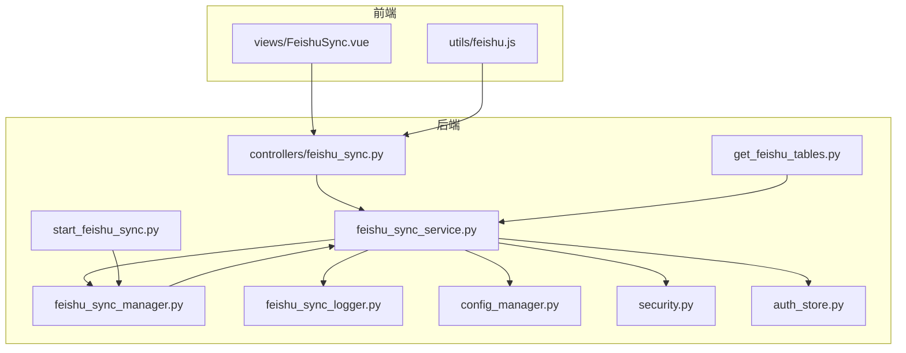
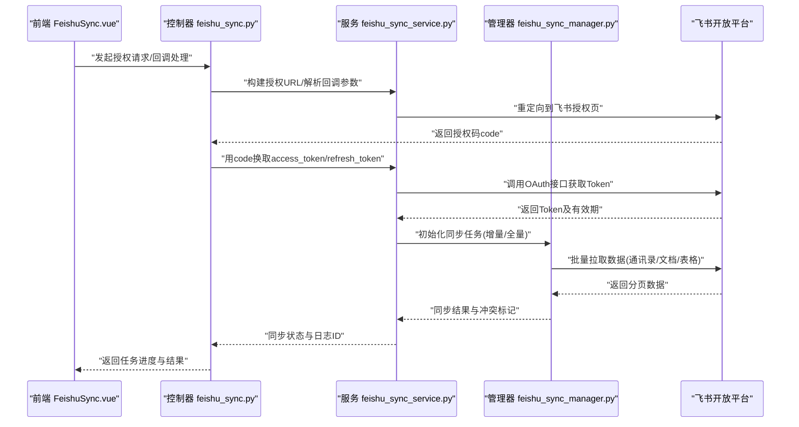
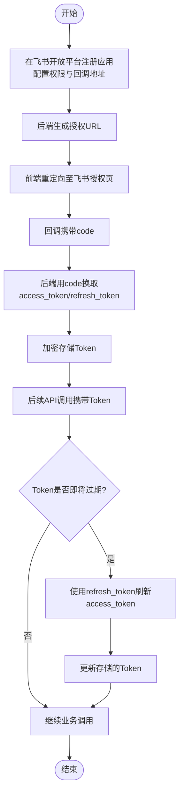
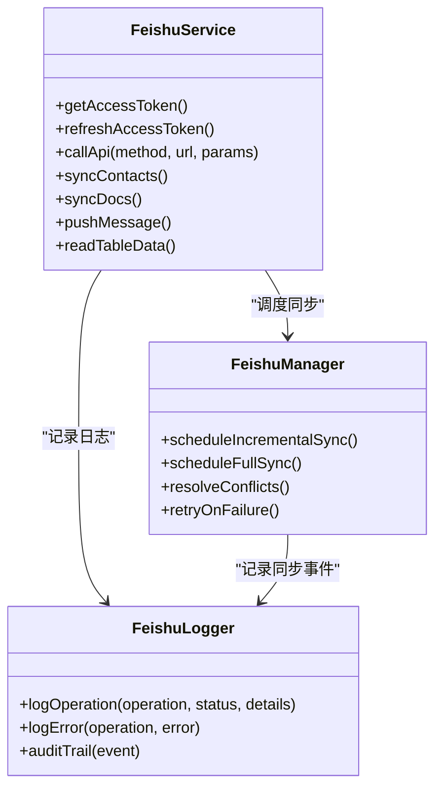
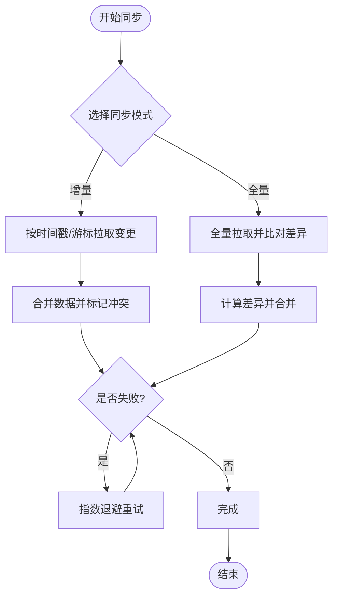
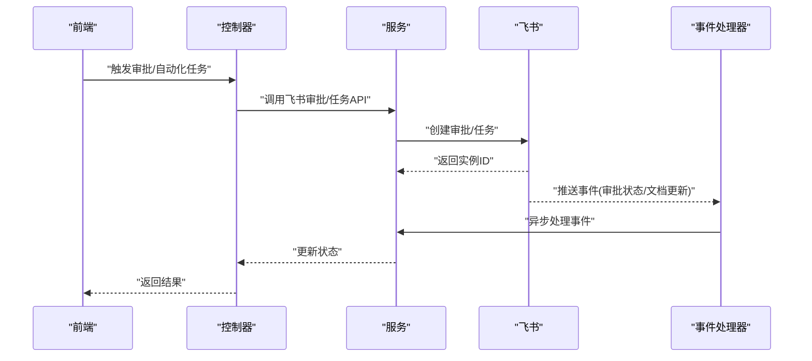
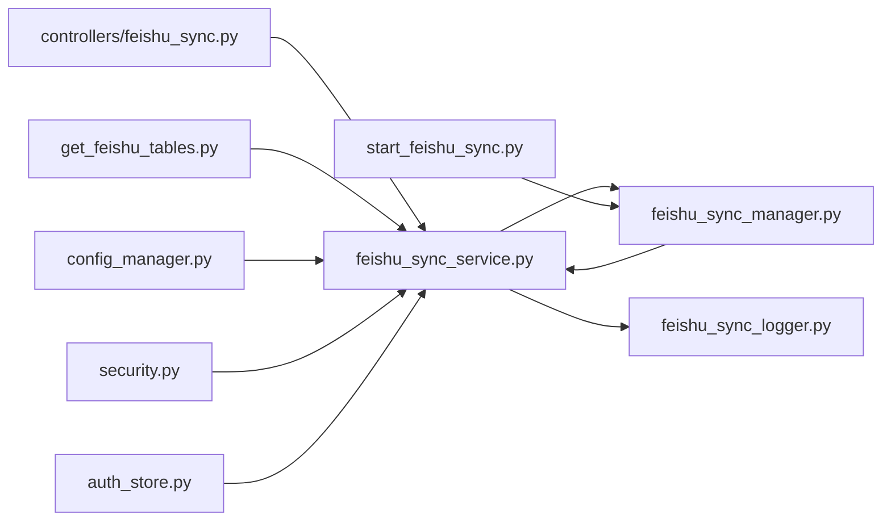

# 飞书服务集成

<cite>
**本文引用的文件**   
- [feishu_sync_service.py](file://backend/feishu_sync_service.py)
- [feishu_sync_manager.py](file://backend/feishu_sync_manager.py)
- [feishu_sync_logger.py](file://backend/feishu_sync_logger.py)
- [controllers/feishu_sync.py](file://backend/controllers/feishu_sync.py)
- [start_feishu_sync.py](file://backend/start_feishu_sync.py)
- [get_feishu_tables.py](file://backend/get_feishu_tables.py)
- [frontend/src/utils/feishu.js](file://frontend/src/utils/feishu.js)
- [frontend/src/views/FeishuSync.vue](file://frontend/src/views/FeishuSync.vue)
- [config_manager.py](file://backend/config_manager.py)
- [security.py](file://backend/security.py)
- [auth_store.py](file://backend/auth_store.py)
</cite>

## 目录
1. [简介](#简介)
2. [项目结构](#项目结构)
3. [核心组件](#核心组件)
4. [架构总览](#架构总览)
5. [详细组件分析](#详细组件分析)
6. [依赖关系分析](#依赖关系分析)
7. [性能考虑](#性能考虑)
8. [故障排查指南](#故障排查指南)
9. [结论](#结论)
10. [附录](#附录)

## 简介
本文件为 SmartAsk 平台与飞书服务的集成文档，覆盖 OAuth 认证、API 封装、数据同步机制、工作流集成、安全策略与常见问题排查。目标是帮助开发者快速理解并正确接入飞书能力，包括应用注册与权限配置、授权码获取与 Token 刷新、通讯录/文档/消息/表格等 API 调用封装、增量与全量同步、冲突解决与重试策略、审批与自动化事件监听，以及登录、导出、报告发送、协作编辑等典型场景示例。

## 项目结构
SmartAsk 的飞书集成主要分布在后端服务与前端工具中：
- 后端服务层：负责飞书 OAuth、Token 管理、API 封装、同步任务调度与日志记录。
- 控制器层：暴露 HTTP 接口供前端或外部系统调用。
- 前端工具：提供飞书相关的前端辅助方法与页面入口。

**图表来源** 
- [controllers/feishu_sync.py](file://backend/controllers/feishu_sync.py)
- [feishu_sync_service.py](file://backend/feishu_sync_service.py)
- [feishu_sync_manager.py](file://backend/feishu_sync_manager.py)
- [feishu_sync_logger.py](file://backend/feishu_sync_logger.py)
- [start_feishu_sync.py](file://backend/start_feishu_sync.py)
- [get_feishu_tables.py](file://backend/get_feishu_tables.py)
- [config_manager.py](file://backend/config_manager.py)
- [security.py](file://backend/security.py)
- [auth_store.py](file://backend/auth_store.py)
- [frontend/src/utils/feishu.js](file://frontend/src/utils/feishu.js)
- [frontend/src/views/FeishuSync.vue](file://frontend/src/views/FeishuSync.vue)

**章节来源**
- [controllers/feishu_sync.py](file://backend/controllers/feishu_sync.py)
- [feishu_sync_service.py](file://backend/feishu_sync_service.py)
- [feishu_sync_manager.py](file://backend/feishu_sync_manager.py)
- [feishu_sync_logger.py](file://backend/feishu_sync_logger.py)
- [start_feishu_sync.py](file://backend/start_feishu_sync.py)
- [get_feishu_tables.py](file://backend/get_feishu_tables.py)
- [config_manager.py](file://backend/config_manager.py)
- [security.py](file://backend/security.py)
- [auth_store.py](file://backend/auth_store.py)
- [frontend/src/utils/feishu.js](file://frontend/src/utils/feishu.js)
- [frontend/src/views/FeishuSync.vue](file://frontend/src/views/FeishuSync.vue)

## 核心组件
- 飞书同步服务（feishu_sync_service.py）：统一封装飞书 OAuth、Token 管理、API 调用、同步任务编排与错误处理。
- 同步管理器（feishu_sync_manager.py）：负责调度与执行增量/全量同步、冲突检测与合并、重试策略。
- 同步日志（feishu_sync_logger.py）：记录关键操作、异常与审计信息，便于问题定位。
- 控制器（controllers/feishu_sync.py）：对外暴露 HTTP 接口，如授权回调、同步触发、状态查询等。
- 启动脚本（start_feishu_sync.py）：用于启动后台同步进程或定时任务。
- 表元数据获取（get_feishu_tables.py）：拉取飞书多维表格元数据，辅助数据映射与校验。
- 前端工具（frontend/src/utils/feishu.js）：封装前端侧飞书交互逻辑（如跳转授权、回调处理）。
- 前端页面（frontend/src/views/FeishuSync.vue）：提供飞书同步管理与监控界面。

**章节来源**
- [feishu_sync_service.py](file://backend/feishu_sync_service.py)
- [feishu_sync_manager.py](file://backend/feishu_sync_manager.py)
- [feishu_sync_logger.py](file://backend/feishu_sync_logger.py)
- [controllers/feishu_sync.py](file://backend/controllers/feishu_sync.py)
- [start_feishu_sync.py](file://backend/start_feishu_sync.py)
- [get_feishu_tables.py](file://backend/get_feishu_tables.py)
- [frontend/src/utils/feishu.js](file://frontend/src/utils/feishu.js)
- [frontend/src/views/FeishuSync.vue](file://frontend/src/views/FeishuSync.vue)

## 架构总览
整体架构采用前后端分离设计，后端通过统一的飞书同步服务对接飞书开放平台，前端通过控制器提供的 RESTful 接口进行交互。同步任务由独立进程或定时任务驱动，确保高可用与可观测性。

**图表来源** 
- [controllers/feishu_sync.py](file://backend/controllers/feishu_sync.py)
- [feishu_sync_service.py](file://backend/feishu_sync_service.py)
- [feishu_sync_manager.py](file://backend/feishu_sync_manager.py)
- [frontend/src/views/FeishuSync.vue](file://frontend/src/views/FeishuSync.vue)

## 详细组件分析

### 飞书 OAuth 认证流程
- 应用注册与权限配置：在飞书开放平台创建应用，配置企业自建应用权限（通讯录、文档、消息、表格等），设置回调地址。
- 授权码获取：前端跳转到飞书授权页，用户同意后回调携带 code。
- Token 获取与刷新：后端使用 code 换取 access_token 与 refresh_token；access_token 过期前自动刷新。
- 安全存储：Token 加密存储于安全存储区，最小化权限访问。

**图表来源** 
- [controllers/feishu_sync.py](file://backend/controllers/feishu_sync.py)
- [feishu_sync_service.py](file://backend/feishu_sync_service.py)
- [security.py](file://backend/security.py)
- [auth_store.py](file://backend/auth_store.py)

**章节来源**
- [controllers/feishu_sync.py](file://backend/controllers/feishu_sync.py)
- [feishu_sync_service.py](file://backend/feishu_sync_service.py)
- [security.py](file://backend/security.py)
- [auth_store.py](file://backend/auth_store.py)

### 飞书 API 调用封装
- 通讯录操作：组织成员、部门、岗位信息的读取与同步。
- 文档管理：文档创建、更新、权限控制、版本管理。
- 消息推送：企业内部机器人消息、卡片消息、群聊通知。
- 表格操作：多维表格数据读写、字段映射、批量导入导出。

**图表来源** 
- [feishu_sync_service.py](file://backend/feishu_sync_service.py)
- [feishu_sync_manager.py](file://backend/feishu_sync_manager.py)
- [feishu_sync_logger.py](file://backend/feishu_sync_logger.py)

**章节来源**
- [feishu_sync_service.py](file://backend/feishu_sync_service.py)
- [feishu_sync_manager.py](file://backend/feishu_sync_manager.py)
- [feishu_sync_logger.py](file://backend/feishu_sync_logger.py)

### 数据同步机制
- 增量同步：基于时间戳或游标拉取变更数据，减少带宽与负载。
- 全量同步：定期或按需执行完整数据拉取，保证一致性。
- 冲突解决：以服务端为准或合并策略，记录冲突详情。
- 错误重试：指数退避与最大重试次数，失败告警。

**图表来源** 
- [feishu_sync_manager.py](file://backend/feishu_sync_manager.py)
- [feishu_sync_service.py](file://backend/feishu_sync_service.py)

**章节来源**
- [feishu_sync_manager.py](file://backend/feishu_sync_manager.py)
- [feishu_sync_service.py](file://backend/feishu_sync_service.py)

### 飞书工作流集成
- 审批流程：通过飞书审批 API 创建、查询、更新审批实例。
- 自动化任务：结合飞书机器人或 Webhook 触发后端任务。
- 事件监听：订阅飞书事件（如文档更新、消息回复），异步处理。

**图表来源** 
- [controllers/feishu_sync.py](file://backend/controllers/feishu_sync.py)
- [feishu_sync_service.py](file://backend/feishu_sync_service.py)

**章节来源**
- [controllers/feishu_sync.py](file://backend/controllers/feishu_sync.py)
- [feishu_sync_service.py](file://backend/feishu_sync_service.py)

### 安全考虑
- Token 存储：加密存储，限制访问范围，定期轮换。
- 权限最小化：仅申请必要权限，避免过度授权。
- 敏感信息保护：对密钥、密码等敏感数据进行加密与脱敏。
- 审计与监控：记录所有敏感操作，便于追踪与审计。

**章节来源**
- [security.py](file://backend/security.py)
- [auth_store.py](file://backend/auth_store.py)
- [config_manager.py](file://backend/config_manager.py)

### 集成示例
- 用户登录：通过飞书 OAuth 实现单点登录，绑定本地用户账户。
- 数据导出：从飞书多维表格导出数据，转换为 CSV/Excel 格式。
- 报告发送：将生成的报告通过飞书机器人发送到指定群组。
- 协作编辑：在飞书文档中嵌入 SmartAsk 的分析结果，支持多人协作。

**章节来源**
- [controllers/feishu_sync.py](file://backend/controllers/feishu_sync.py)
- [feishu_sync_service.py](file://backend/feishu_sync_service.py)
- [frontend/src/utils/feishu.js](file://frontend/src/utils/feishu.js)
- [frontend/src/views/FeishuSync.vue](file://frontend/src/views/FeishuSync.vue)

## 依赖关系分析
后端模块间存在清晰的依赖关系：控制器依赖服务层，服务层依赖管理器与日志器，管理器负责调度与重试，日志器提供审计与调试支持。

**图表来源** 
- [controllers/feishu_sync.py](file://backend/controllers/feishu_sync.py)
- [feishu_sync_service.py](file://backend/feishu_sync_service.py)
- [feishu_sync_manager.py](file://backend/feishu_sync_manager.py)
- [feishu_sync_logger.py](file://backend/feishu_sync_logger.py)
- [start_feishu_sync.py](file://backend/start_feishu_sync.py)
- [get_feishu_tables.py](file://backend/get_feishu_tables.py)
- [config_manager.py](file://backend/config_manager.py)
- [security.py](file://backend/security.py)
- [auth_store.py](file://backend/auth_store.py)

**章节来源**
- [controllers/feishu_sync.py](file://backend/controllers/feishu_sync.py)
- [feishu_sync_service.py](file://backend/feishu_sync_service.py)
- [feishu_sync_manager.py](file://backend/feishu_sync_manager.py)
- [feishu_sync_logger.py](file://backend/feishu_sync_logger.py)
- [start_feishu_sync.py](file://backend/start_feishu_sync.py)
- [get_feishu_tables.py](file://backend/get_feishu_tables.py)
- [config_manager.py](file://backend/config_manager.py)
- [security.py](file://backend/security.py)
- [auth_store.py](file://backend/auth_store.py)

## 性能考虑
- 连接池与限流：复用 HTTP 连接，遵循飞书 API 限流策略。
- 批处理与分页：批量拉取数据，合理设置分页大小。
- 缓存热点数据：对频繁访问的配置与元数据进行缓存。
- 异步处理：耗时任务异步执行，提升响应速度。
- 监控与告警：实时监控同步任务与健康状态，及时告警。

[本节为通用指导，无需特定文件引用]

## 故障排查指南
- 授权失败：检查回调地址、应用权限、网络连通性。
- Token 过期：确认刷新逻辑是否正常，检查存储的 Token 是否有效。
- 同步失败：查看日志中的错误码与详细信息，检查数据源状态。
- 性能问题：分析慢查询与 API 调用频率，优化批处理大小与并发度。
- 权限不足：核对应用权限配置，确保最小权限原则。

**章节来源**
- [feishu_sync_logger.py](file://backend/feishu_sync_logger.py)
- [controllers/feishu_sync.py](file://backend/controllers/feishu_sync.py)
- [feishu_sync_service.py](file://backend/feishu_sync_service.py)

## 结论
SmartAsk 的飞书集成通过清晰的分层架构与完善的错误处理机制，实现了稳定的 OAuth 认证、API 封装、数据同步与工作流集成。建议在生产环境中严格遵循安全最佳实践，持续监控与优化性能，确保系统的高可用性与可扩展性。

[本节为总结性内容，无需特定文件引用]

## 附录
- 常见错误码与解决方案
- 配置项说明与环境变量
- 测试与验证步骤
- 扩展开发指南

[本节为补充信息，无需特定文件引用]