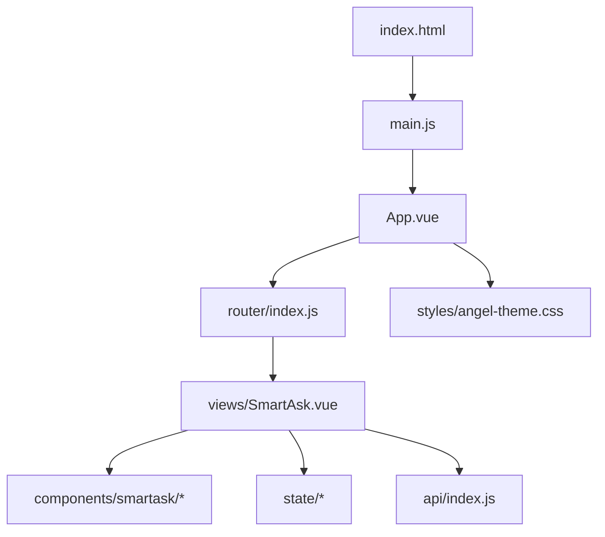
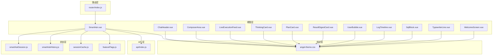
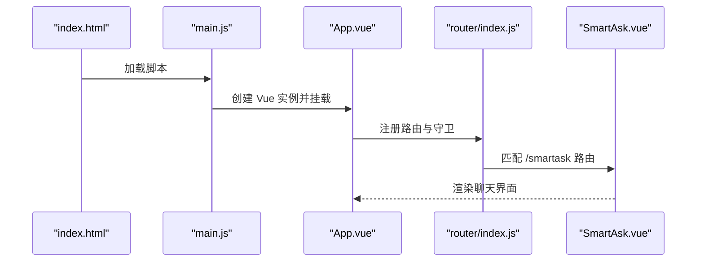
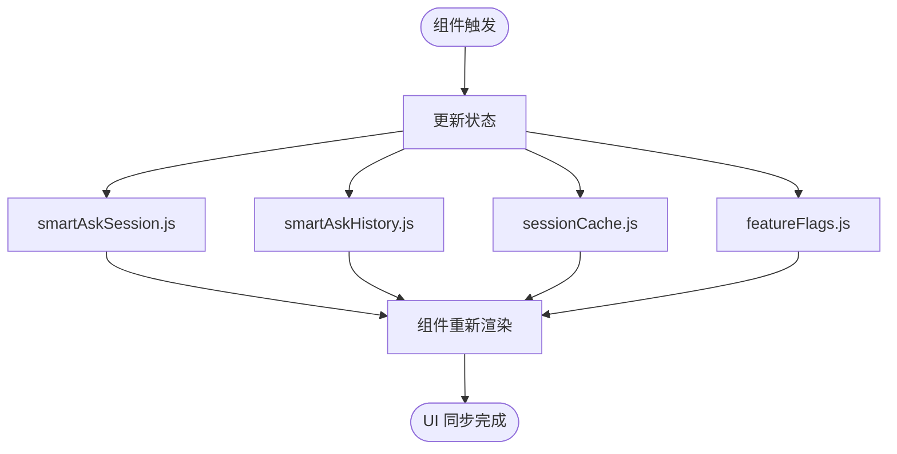
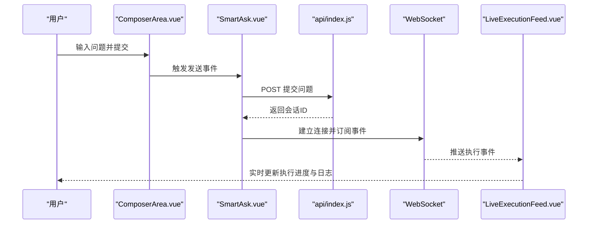
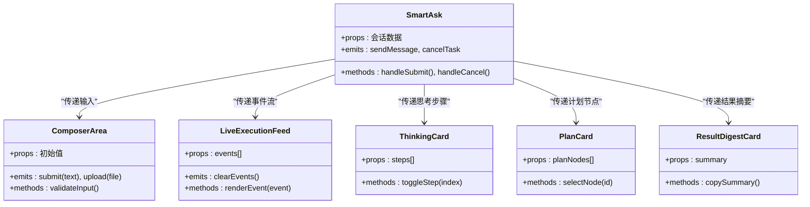
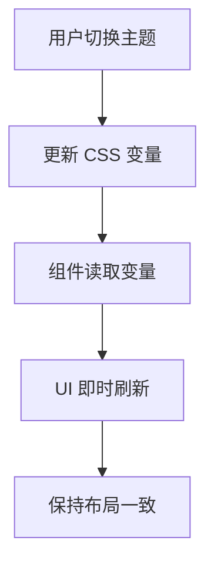
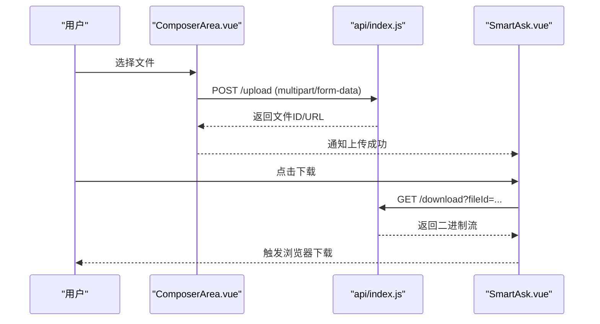
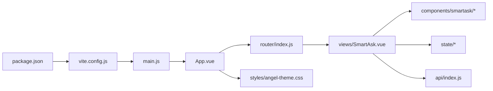

# 前端开发文档

<cite>
**本文引用的文件**   
- [frontend/src/main.js](file://frontend/src/main.js)
- [frontend/src/App.vue](file://frontend/src/App.vue)
- [frontend/vite.config.js](file://frontend/vite.config.js)
- [frontend/package.json](file://frontend/package.json)
- [frontend/index.html](file://frontend/index.html)
- [frontend/src/router/index.js](file://frontend/src/router/index.js)
- [frontend/src/api/index.js](file://frontend/src/api/index.js)
- [frontend/src/state/smartAskSession.js](file://frontend/src/state/smartAskSession.js)
- [frontend/src/state/smartAskHistory.js](file://frontend/src/state/smartAskHistory.js)
- [frontend/src/state/sessionCache.js](file://frontend/src/state/sessionCache.js)
- [frontend/src/state/featureFlags.js](file://frontend/src/state/featureFlags.js)
- [frontend/src/views/SmartAsk.vue](file://frontend/src/views/SmartAsk.vue)
- [frontend/src/components/smartask/ChatHeader.vue](file://frontend/src/components/smartask/ChatHeader.vue)
- [frontend/src/components/smartask/ComposerArea.vue](file://frontend/src/components/smartask/ComposerArea.vue)
- [frontend/src/components/smartask/LiveExecutionFeed.vue](file://frontend/src/components/smartask/LiveExecutionFeed.vue)
- [frontend/src/components/smartask/ThinkingCard.vue](file://frontend/src/components/smartask/ThinkingCard.vue)
- [frontend/src/components/smartask/PlanCard.vue](file://frontend/src/components/smartask/PlanCard.vue)
- [frontend/src/components/smartask/ResultDigestCard.vue](file://frontend/src/components/smartask/ResultDigestCard.vue)
- [frontend/src/components/smartask/UserBubble.vue](file://frontend/src/components/smartask/UserBubble.vue)
- [frontend/src/components/smartask/LogTimeline.vue](file://frontend/src/components/smartask/LogTimeline.vue)
- [frontend/src/components/smartask/SqlBlock.vue](file://frontend/src/components/smartask/SqlBlock.vue)
- [frontend/src/components/smartask/TypewriterLine.vue](file://frontend/src/components/smartask/TypewriterLine.vue)
- [frontend/src/components/smartask/WelcomeScreen.vue](file://frontend/src/components/smartask/WelcomeScreen.vue)
- [frontend/src/styles/angel-theme.css](file://frontend/src/styles/angel-theme.css)
</cite>

## 目录
1. [简介](#简介)
2. [项目结构](#项目结构)
3. [核心组件](#核心组件)
4. [架构总览](#架构总览)
5. [详细组件分析](#详细组件分析)
6. [依赖关系分析](#依赖关系分析)
7. [性能考虑](#性能考虑)
8. [故障排查指南](#故障排查指南)
9. [结论](#结论)
10. [附录](#附录)

## 简介
本文件面向 SmartAsk 智能问数平台的前端开发者，系统化阐述基于 Vue 3 与 Vite 的现代前端架构与实现。内容覆盖应用初始化、路由配置、状态管理、组件化设计、响应式主题系统、前后端 API 集成（REST 与 WebSocket）、以及开发与调试最佳实践。读者可据此快速上手开发、扩展功能并优化性能。

## 项目结构
前端工程位于 frontend 目录，采用典型的 Vue 3 + Vite 单页应用组织方式：
- 入口与构建：index.html、main.js、vite.config.js、package.json
- 路由：router/index.js
- 视图：views/*（页面级组件）
- 组件：components/smartask/*（智能问数相关 UI）
- 状态：state/*（会话、历史、缓存、特性开关）
- 样式：styles/angel-theme.css（主题变量与全局样式）
- API：api/index.js（统一请求封装）

图表来源
- [frontend/index.html](file://frontend/index.html)
- [frontend/src/main.js](file://frontend/src/main.js)
- [frontend/src/App.vue](file://frontend/src/App.vue)
- [frontend/src/router/index.js](file://frontend/src/router/index.js)
- [frontend/src/views/SmartAsk.vue](file://frontend/src/views/SmartAsk.vue)
- [frontend/src/styles/angel-theme.css](file://frontend/src/styles/angel-theme.css)

章节来源
- [frontend/index.html](file://frontend/index.html)
- [frontend/src/main.js](file://frontend/src/main.js)
- [frontend/src/App.vue](file://frontend/src/App.vue)
- [frontend/vite.config.js](file://frontend/vite.config.js)
- [frontend/package.json](file://frontend/package.json)

## 核心组件
- 聊天界面容器：SmartAsk.vue（承载对话流、输入区、执行反馈与结果卡片）
- 头部信息：ChatHeader.vue（会话标题、操作按钮等）
- 输入区域：ComposerArea.vue（文本输入、快捷指令、附件上传）
- 实时执行反馈：LiveExecutionFeed.vue（事件流渲染、进度指示）
- 思考与计划：ThinkingCard.vue、PlanCard.vue（展示推理步骤与计划节点）
- 结果摘要：ResultDigestCard.vue（关键指标、结论摘要）
- 用户消息气泡：UserBubble.vue（用户提问展示）
- 日志时间线：LogTimeline.vue（后端日志或执行链路可视化）
- SQL 片段：SqlBlock.vue（SQL 代码块高亮与复制）
- 打字机效果：TypewriterLine.vue（逐字输出动画）
- 欢迎屏：WelcomeScreen.vue（空态引导与示例问题）

章节来源
- [frontend/src/views/SmartAsk.vue](file://frontend/src/views/SmartAsk.vue)
- [frontend/src/components/smartask/ChatHeader.vue](file://frontend/src/components/smartask/ChatHeader.vue)
- [frontend/src/components/smartask/ComposerArea.vue](file://frontend/src/components/smartask/ComposerArea.vue)
- [frontend/src/components/smartask/LiveExecutionFeed.vue](file://frontend/src/components/smartask/LiveExecutionFeed.vue)
- [frontend/src/components/smartask/ThinkingCard.vue](file://frontend/src/components/smartask/ThinkingCard.vue)
- [frontend/src/components/smartask/PlanCard.vue](file://frontend/src/components/smartask/PlanCard.vue)
- [frontend/src/components/smartask/ResultDigestCard.vue](file://frontend/src/components/smartask/ResultDigestCard.vue)
- [frontend/src/components/smartask/UserBubble.vue](file://frontend/src/components/smartask/UserBubble.vue)
- [frontend/src/components/smartask/LogTimeline.vue](file://frontend/src/components/smartask/LogTimeline.vue)
- [frontend/src/components/smartask/SqlBlock.vue](file://frontend/src/components/smartask/SqlBlock.vue)
- [frontend/src/components/smartask/TypewriterLine.vue](file://frontend/src/components/smartask/TypewriterLine.vue)
- [frontend/src/components/smartask/WelcomeScreen.vue](file://frontend/src/components/smartask/WelcomeScreen.vue)

## 架构总览
整体采用“视图层 + 状态层 + API 层”的清晰分层：
- 视图层：Vue 3 组件负责 UI 渲染与交互
- 状态层：集中管理会话、历史、缓存与特性开关
- API 层：统一封装 REST 调用与 WebSocket 连接
- 路由层：页面导航与权限控制
- 样式层：CSS 变量驱动的主题系统

图表来源
- [frontend/src/views/SmartAsk.vue](file://frontend/src/views/SmartAsk.vue)
- [frontend/src/state/smartAskSession.js](file://frontend/src/state/smartAskSession.js)
- [frontend/src/state/smartAskHistory.js](file://frontend/src/state/smartAskHistory.js)
- [frontend/src/state/sessionCache.js](file://frontend/src/state/sessionCache.js)
- [frontend/src/state/featureFlags.js](file://frontend/src/state/featureFlags.js)
- [frontend/src/api/index.js](file://frontend/src/api/index.js)
- [frontend/src/router/index.js](file://frontend/src/router/index.js)
- [frontend/src/styles/angel-theme.css](file://frontend/src/styles/angel-theme.css)

## 详细组件分析

### 应用初始化与路由
- 应用初始化：main.js 创建 Vue 应用实例，挂载根组件 App.vue，注册插件与全局样式
- 路由配置：router/index.js 定义页面路由，包含 SmartAsk 主视图与其他管理页面
- 根组件：App.vue 作为布局壳，注入路由与全局状态

图表来源
- [frontend/index.html](file://frontend/index.html)
- [frontend/src/main.js](file://frontend/src/main.js)
- [frontend/src/App.vue](file://frontend/src/App.vue)
- [frontend/src/router/index.js](file://frontend/src/router/index.js)
- [frontend/src/views/SmartAsk.vue](file://frontend/src/views/SmartAsk.vue)

章节来源
- [frontend/src/main.js](file://frontend/src/main.js)
- [frontend/src/App.vue](file://frontend/src/App.vue)
- [frontend/src/router/index.js](file://frontend/src/router/index.js)

### 状态管理与数据流
- smartAskSession.js：维护当前会话上下文（如会话 ID、用户信息、模型选择）
- smartAskHistory.js：管理历史消息列表与分页、持久化策略
- sessionCache.js：浏览器会话缓存（LocalStorage/SessionStorage）读写封装
- featureFlags.js：特性开关与灰度发布控制

图表来源
- [frontend/src/state/smartAskSession.js](file://frontend/src/state/smartAskSession.js)
- [frontend/src/state/smartAskHistory.js](file://frontend/src/state/smartAskHistory.js)
- [frontend/src/state/sessionCache.js](file://frontend/src/state/sessionCache.js)
- [frontend/src/state/featureFlags.js](file://frontend/src/state/featureFlags.js)

章节来源
- [frontend/src/state/smartAskSession.js](file://frontend/src/state/smartAskSession.js)
- [frontend/src/state/smartAskHistory.js](file://frontend/src/state/smartAskHistory.js)
- [frontend/src/state/sessionCache.js](file://frontend/src/state/sessionCache.js)
- [frontend/src/state/featureFlags.js](file://frontend/src/state/featureFlags.js)

### API 集成与实时通信
- api/index.js：统一封装 HTTP 请求（含鉴权头、错误处理、重试策略），并提供 WebSocket 连接方法
- SmartAsk.vue：在用户提交问题时发起 REST 请求，建立 WebSocket 通道接收实时事件
- LiveExecutionFeed.vue：订阅事件流，渲染执行阶段、进度与日志

图表来源
- [frontend/src/components/smartask/ComposerArea.vue](file://frontend/src/components/smartask/ComposerArea.vue)
- [frontend/src/views/SmartAsk.vue](file://frontend/src/views/SmartAsk.vue)
- [frontend/src/api/index.js](file://frontend/src/api/index.js)
- [frontend/src/components/smartask/LiveExecutionFeed.vue](file://frontend/src/components/smartask/LiveExecutionFeed.vue)

章节来源
- [frontend/src/api/index.js](file://frontend/src/api/index.js)
- [frontend/src/views/SmartAsk.vue](file://frontend/src/views/SmartAsk.vue)
- [frontend/src/components/smartask/LiveExecutionFeed.vue](file://frontend/src/components/smartask/LiveExecutionFeed.vue)

### 组件间通信与事件处理
- 父子通信：通过 props 传递数据，通过 emits 触发事件
- 兄弟组件：通过父组件中转或使用共享状态（state/*）
- 跨层级：使用 provide/inject 或集中状态管理
- 事件总线：必要时使用轻量事件机制（避免过度耦合）

图表来源
- [frontend/src/views/SmartAsk.vue](file://frontend/src/views/SmartAsk.vue)
- [frontend/src/components/smartask/ComposerArea.vue](file://frontend/src/components/smartask/ComposerArea.vue)
- [frontend/src/components/smartask/LiveExecutionFeed.vue](file://frontend/src/components/smartask/LiveExecutionFeed.vue)
- [frontend/src/components/smartask/ThinkingCard.vue](file://frontend/src/components/smartask/ThinkingCard.vue)
- [frontend/src/components/smartask/PlanCard.vue](file://frontend/src/components/smartask/PlanCard.vue)
- [frontend/src/components/smartask/ResultDigestCard.vue](file://frontend/src/components/smartask/ResultDigestCard.vue)

章节来源
- [frontend/src/views/SmartAsk.vue](file://frontend/src/views/SmartAsk.vue)
- [frontend/src/components/smartask/ComposerArea.vue](file://frontend/src/components/smartask/ComposerArea.vue)
- [frontend/src/components/smartask/LiveExecutionFeed.vue](file://frontend/src/components/smartask/LiveExecutionFeed.vue)
- [frontend/src/components/smartask/ThinkingCard.vue](file://frontend/src/components/smartask/ThinkingCard.vue)
- [frontend/src/components/smartask/PlanCard.vue](file://frontend/src/components/smartask/PlanCard.vue)
- [frontend/src/components/smartask/ResultDigestCard.vue](file://frontend/src/components/smartask/ResultDigestCard.vue)

### 响应式设计与主题定制
- 响应式：基于 CSS 媒体查询与弹性布局，适配桌面与移动端
- 主题系统：通过 angel-theme.css 定义 CSS 变量（颜色、字号、间距），组件引用变量实现一键换肤
- 暗色模式：切换主题变量，动态刷新 UI

图表来源
- [frontend/src/styles/angel-theme.css](file://frontend/src/styles/angel-theme.css)

章节来源
- [frontend/src/styles/angel-theme.css](file://frontend/src/styles/angel-theme.css)

### 文件上传下载
- 上传：ComposerArea.vue 支持拖拽与选择文件，调用 api/index.js 的上传接口，携带鉴权头
- 下载：SmartAsk.vue 提供导出按钮，调用下载接口，处理二进制流与文件名

图表来源
- [frontend/src/components/smartask/ComposerArea.vue](file://frontend/src/components/smartask/ComposerArea.vue)
- [frontend/src/views/SmartAsk.vue](file://frontend/src/views/SmartAsk.vue)
- [frontend/src/api/index.js](file://frontend/src/api/index.js)

章节来源
- [frontend/src/components/smartask/ComposerArea.vue](file://frontend/src/components/smartask/ComposerArea.vue)
- [frontend/src/views/SmartAsk.vue](file://frontend/src/views/SmartAsk.vue)
- [frontend/src/api/index.js](file://frontend/src/api/index.js)

## 依赖关系分析
- 构建依赖：Vite、Vue 3、Vue Router、Axios（或 Fetch 封装）、WebSocket
- 运行时依赖：浏览器兼容性（ES6+、Fetch、WebSocket）
- 组件依赖：SmartAsk.vue 依赖多个子组件与状态模块
- API 依赖：统一请求封装与错误处理

图表来源
- [frontend/package.json](file://frontend/package.json)
- [frontend/vite.config.js](file://frontend/vite.config.js)
- [frontend/src/main.js](file://frontend/src/main.js)
- [frontend/src/App.vue](file://frontend/src/App.vue)
- [frontend/src/router/index.js](file://frontend/src/router/index.js)
- [frontend/src/views/SmartAsk.vue](file://frontend/src/views/SmartAsk.vue)
- [frontend/src/components/smartask/ChatHeader.vue](file://frontend/src/components/smartask/ChatHeader.vue)
- [frontend/src/components/smartask/ComposerArea.vue](file://frontend/src/components/smartask/ComposerArea.vue)
- [frontend/src/components/smartask/LiveExecutionFeed.vue](file://frontend/src/components/smartask/LiveExecutionFeed.vue)
- [frontend/src/components/smartask/ThinkingCard.vue](file://frontend/src/components/smartask/ThinkingCard.vue)
- [frontend/src/components/smartask/PlanCard.vue](file://frontend/src/components/smartask/PlanCard.vue)
- [frontend/src/components/smartask/ResultDigestCard.vue](file://frontend/src/components/smartask/ResultDigestCard.vue)
- [frontend/src/components/smartask/UserBubble.vue](file://frontend/src/components/smartask/UserBubble.vue)
- [frontend/src/components/smartask/LogTimeline.vue](file://frontend/src/components/smartask/LogTimeline.vue)
- [frontend/src/components/smartask/SqlBlock.vue](file://frontend/src/components/smartask/SqlBlock.vue)
- [frontend/src/components/smartask/TypewriterLine.vue](file://frontend/src/components/smartask/TypewriterLine.vue)
- [frontend/src/components/smartask/WelcomeScreen.vue](file://frontend/src/components/smartask/WelcomeScreen.vue)
- [frontend/src/state/smartAskSession.js](file://frontend/src/state/smartAskSession.js)
- [frontend/src/state/smartAskHistory.js](file://frontend/src/state/smartAskHistory.js)
- [frontend/src/state/sessionCache.js](file://frontend/src/state/sessionCache.js)
- [frontend/src/state/featureFlags.js](file://frontend/src/state/featureFlags.js)
- [frontend/src/api/index.js](file://frontend/src/api/index.js)
- [frontend/src/styles/angel-theme.css](file://frontend/src/styles/angel-theme.css)

章节来源
- [frontend/package.json](file://frontend/package.json)
- [frontend/vite.config.js](file://frontend/vite.config.js)
- [frontend/src/api/index.js](file://frontend/src/api/index.js)

## 性能考虑
- 组件懒加载：路由级与组件级按需加载，减少首屏体积
- 虚拟滚动：长列表（日志、消息）使用虚拟滚动提升渲染性能
- 防抖节流：输入框与搜索场景使用防抖，避免频繁请求
- 缓存策略：对静态资源与热点数据启用缓存；WebSocket 断线重连
- 图片与媒体：压缩与懒加载，降低带宽占用
- 主题切换：仅更新 CSS 变量，避免全量重绘

[本节为通用指导，不直接分析具体文件]

## 故障排查指南
- 网络请求失败：检查 api/index.js 的错误处理与重试逻辑，确认鉴权头与跨域设置
- WebSocket 连接异常：查看连接状态、心跳与重连机制，定位服务端事件格式
- 状态不同步：检查 state/* 中的副作用与异步更新，确保单一数据源
- 样式错乱：核对 angel-theme.css 变量是否被正确覆盖，检查媒体查询优先级
- 路由跳转无效：确认 router/index.js 的路由表与守卫逻辑

章节来源
- [frontend/src/api/index.js](file://frontend/src/api/index.js)
- [frontend/src/state/smartAskSession.js](file://frontend/src/state/smartAskSession.js)
- [frontend/src/state/smartAskHistory.js](file://frontend/src/state/smartAskHistory.js)
- [frontend/src/state/sessionCache.js](file://frontend/src/state/sessionCache.js)
- [frontend/src/state/featureFlags.js](file://frontend/src/state/featureFlags.js)
- [frontend/src/router/index.js](file://frontend/src/router/index.js)
- [frontend/src/styles/angel-theme.css](file://frontend/src/styles/angel-theme.css)

## 结论
SmartAsk 前端采用清晰的 Vue 3 + Vite 架构，结合模块化组件、集中状态管理与统一 API 封装，实现了可扩展的智能问数界面。通过主题系统与响应式设计，保证了良好的用户体验与可维护性。建议持续优化性能与错误处理，完善测试与文档，以支撑业务快速迭代。

[本节为总结，不直接分析具体文件]

## 附录
- 新增组件流程：
  - 在 components/smartask 下创建新组件，定义 props/emits
  - 在 SmartAsk.vue 中引入并使用，绑定状态与事件
  - 如需路由访问，在 router/index.js 中添加路由
- 添加页面视图：
  - 在 views 目录下新建 Vue 组件
  - 在 router/index.js 中注册路由与元信息
  - 在 App.vue 中配置布局与导航
- 用户交互逻辑：
  - 使用 emits 向父组件传递事件
  - 通过 state/* 更新共享状态
  - 在 api/index.js 中封装请求与错误处理
- 调试技巧：
  - 使用浏览器开发者工具的网络面板与 WebSocket 面板
  - 在组件中打印关键状态变化
  - 利用 Vite 的热重载快速验证改动

[本节为通用指导，不直接分析具体文件]