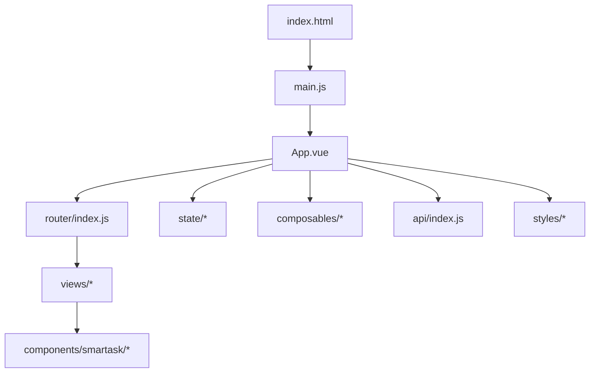
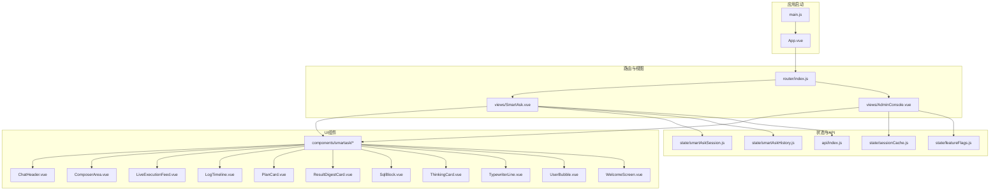
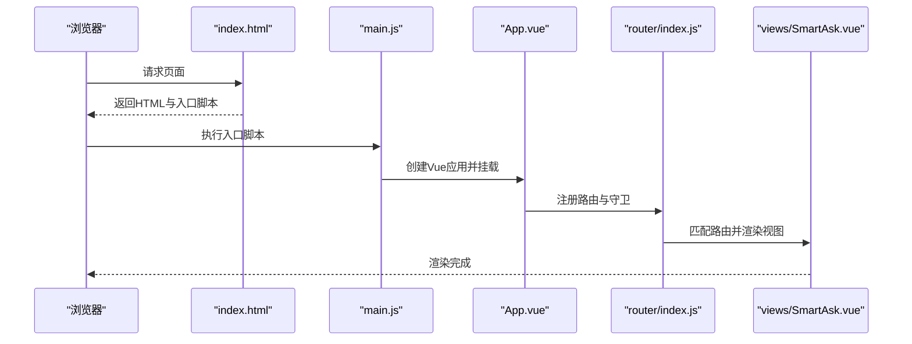
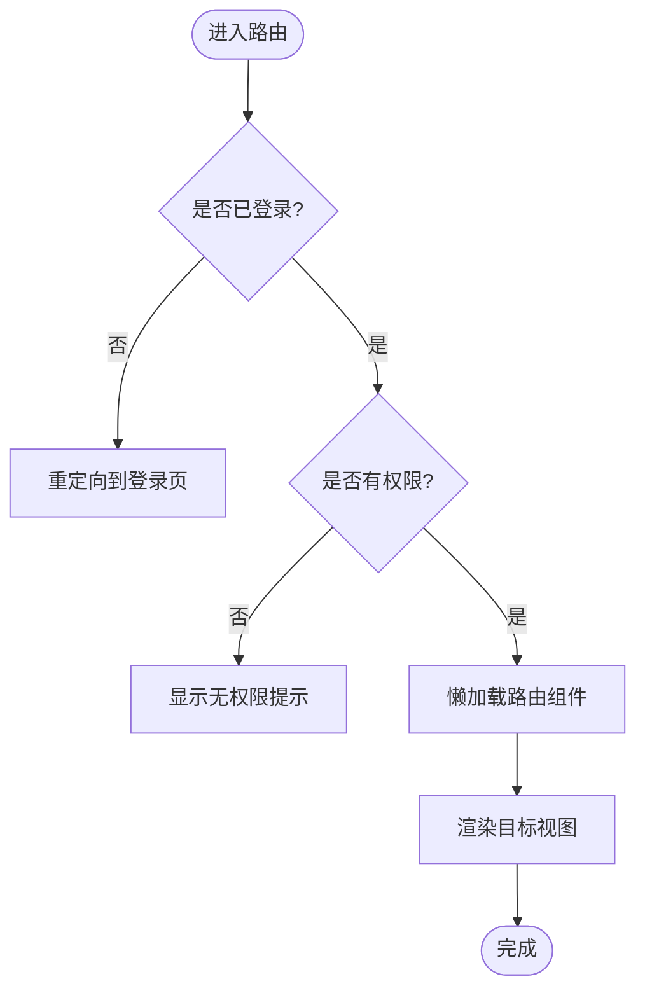
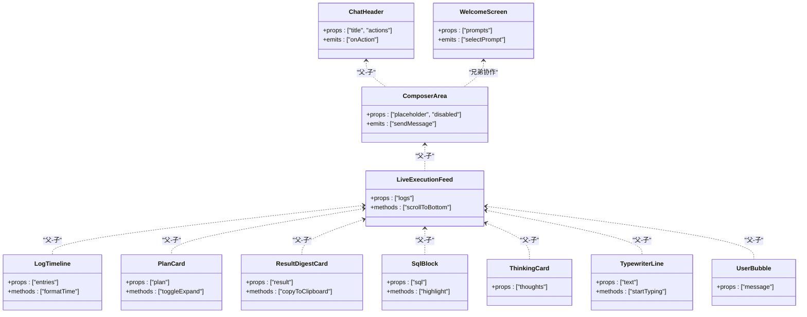
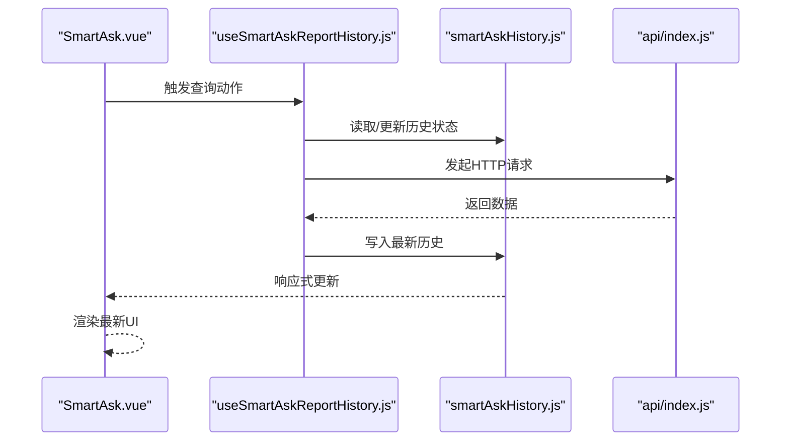
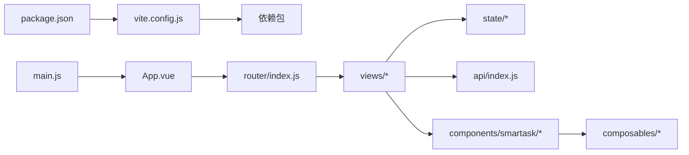

# 前端架构设计

<cite>
**本文引用的文件**   
- [frontend/package.json](file://frontend/package.json)
- [frontend/vite.config.js](file://frontend/vite.config.js)
- [frontend/index.html](file://frontend/index.html)
- [frontend/src/main.js](file://frontend/src/main.js)
- [frontend/src/App.vue](file://frontend/src/App.vue)
- [frontend/src/router/index.js](file://frontend/src/router/index.js)
- [frontend/src/api/index.js](file://frontend/src/api/index.js)
- [frontend/src/state/smartAskSession.js](file://frontend/src/state/smartAskSession.js)
- [frontend/src/state/smartAskHistory.js](file://frontend/src/state/smartAskHistory.js)
- [frontend/src/state/sessionCache.js](file://frontend/src/state/sessionCache.js)
- [frontend/src/state/featureFlags.js](file://frontend/src/state/featureFlags.js)
- [frontend/src/composables/useOrgTree.js](file://frontend/src/composables/useOrgTree.js)
- [frontend/src/composables/useSmartAskReportHistory.js](file://frontend/src/composables/useSmartAskReportHistory.js)
- [frontend/src/views/SmartAsk.vue](file://frontend/src/views/SmartAsk.vue)
- [frontend/src/views/AdminConsole.vue](file://frontend/src/views/AdminConsole.vue)
- [frontend/src/components/smartask/ChatHeader.vue](file://frontend/src/components/smartask/ChatHeader.vue)
- [frontend/src/components/smartask/ComposerArea.vue](file://frontend/src/components/smartask/ComposerArea.vue)
- [frontend/src/components/smartask/LiveExecutionFeed.vue](file://frontend/src/components/smartask/LiveExecutionFeed.vue)
- [frontend/src/components/smartask/LogTimeline.vue](file://frontend/src/components/smartask/LogTimeline.vue)
- [frontend/src/components/smartask/PlanCard.vue](file://frontend/src/components/smartask/PlanCard.vue)
- [frontend/src/components/smartask/ResultDigestCard.vue](file://frontend/src/components/smartask/ResultDigestCard.vue)
- [frontend/src/components/smartask/SqlBlock.vue](file://frontend/src/components/smartask/SqlBlock.vue)
- [frontend/src/components/smartask/ThinkingCard.vue](file://frontend/src/components/smartask/ThinkingCard.vue)
- [frontend/src/components/smartask/TypewriterLine.vue](file://frontend/src/components/smartask/TypewriterLine.vue)
- [frontend/src/components/smartask/UserBubble.vue](file://frontend/src/components/smartask/UserBubble.vue)
- [frontend/src/components/smartask/WelcomeScreen.vue](file://frontend/src/components/smartask/WelcomeScreen.vue)
- [frontend/src/styles/angel-theme.css](file://frontend/src/styles/angel-theme.css)
</cite>

## 目录
1. [简介](#简介)
2. [项目结构](#项目结构)
3. [核心组件](#核心组件)
4. [架构总览](#架构总览)
5. [详细组件分析](#详细组件分析)
6. [依赖关系分析](#依赖关系分析)
7. [性能与构建优化](#性能与构建优化)
8. [故障排查指南](#故障排查指南)
9. [结论](#结论)
10. [附录：扩展与配置示例](#附录扩展与配置示例)

## 简介
本文件面向 SmartAsk 智能问数平台的前端工程，基于 Vue 3 + Vite 的现代技术栈，系统阐述应用初始化流程、模块加载机制、插件与路由策略、组件化架构原则、状态管理与 API 集成方式，以及构建期性能优化手段。文档同时提供可操作的扩展示例，帮助开发者快速新增功能模块、接入新依赖并配置开发环境。

## 项目结构
前端工程采用按“能力域”组织的方式：
- 入口与运行时：index.html、main.js、App.vue
- 路由：router/index.js
- 视图层：views/*（页面级组件）
- 业务组件：components/smartask/*（对话与执行相关 UI）
- 组合式函数：composables/*（跨组件复用逻辑）
- 状态管理：state/*（会话、历史、缓存、特性开关）
- 样式：styles/*（主题与全局样式）
- 构建与工具：vite.config.js、package.json

图表来源
- [frontend/index.html](file://frontend/index.html)
- [frontend/src/main.js](file://frontend/src/main.js)
- [frontend/src/App.vue](file://frontend/src/App.vue)
- [frontend/src/router/index.js](file://frontend/src/router/index.js)

章节来源
- [frontend/package.json](file://frontend/package.json)
- [frontend/vite.config.js](file://frontend/vite.config.js)
- [frontend/index.html](file://frontend/index.html)
- [frontend/src/main.js](file://frontend/src/main.js)
- [frontend/src/App.vue](file://frontend/src/App.vue)
- [frontend/src/router/index.js](file://frontend/src/router/index.js)

## 核心组件
- 应用壳 App.vue：挂载根节点、注册全局样式、承载路由出口与全局布局。
- 路由 router/index.js：集中定义页面路由、嵌套路由与守卫逻辑。
- API 客户端 api/index.js：封装 HTTP 请求、拦截器、错误处理与统一响应格式。
- 状态 state/*：会话、历史记录、本地缓存与特性开关等轻量状态。
- 组合式函数 composables/*：跨组件复用的业务逻辑（如组织树、报告历史）。
- 视图 views/*：页面级容器，组合业务组件与状态。
- 组件 components/smartask/*：对话界面、执行流可视化、结果展示等原子/复合组件。

章节来源
- [frontend/src/App.vue](file://frontend/src/App.vue)
- [frontend/src/router/index.js](file://frontend/src/router/index.js)
- [frontend/src/api/index.js](file://frontend/src/api/index.js)
- [frontend/src/state/smartAskSession.js](file://frontend/src/state/smartAskSession.js)
- [frontend/src/state/smartAskHistory.js](file://frontend/src/state/smartAskHistory.js)
- [frontend/src/state/sessionCache.js](file://frontend/src/state/sessionCache.js)
- [frontend/src/state/featureFlags.js](file://frontend/src/state/featureFlags.js)
- [frontend/src/composables/useOrgTree.js](file://frontend/src/composables/useOrgTree.js)
- [frontend/src/composables/useSmartAskReportHistory.js](file://frontend/src/composables/useSmartAskReportHistory.js)
- [frontend/src/views/SmartAsk.vue](file://frontend/src/views/SmartAsk.vue)
- [frontend/src/views/AdminConsole.vue](file://frontend/src/views/AdminConsole.vue)
- [frontend/src/components/smartask/ChatHeader.vue](file://frontend/src/components/smartask/ChatHeader.vue)
- [frontend/src/components/smartask/ComposerArea.vue](file://frontend/src/components/smartask/ComposerArea.vue)
- [frontend/src/components/smartask/LiveExecutionFeed.vue](file://frontend/src/components/smartask/LiveExecutionFeed.vue)
- [frontend/src/components/smartask/LogTimeline.vue](file://frontend/src/components/smartask/LogTimeline.vue)
- [frontend/src/components/smartask/PlanCard.vue](file://frontend/src/components/smartask/PlanCard.vue)
- [frontend/src/components/smartask/ResultDigestCard.vue](file://frontend/src/components/smartask/ResultDigestCard.vue)
- [frontend/src/components/smartask/SqlBlock.vue](file://frontend/src/components/smartask/SqlBlock.vue)
- [frontend/src/components/smartask/ThinkingCard.vue](file://frontend/src/components/smartask/ThinkingCard.vue)
- [frontend/src/components/smartask/TypewriterLine.vue](file://frontend/src/components/smartask/TypewriterLine.vue)
- [frontend/src/components/smartask/UserBubble.vue](file://frontend/src/components/smartask/UserBubble.vue)
- [frontend/src/components/smartask/WelcomeScreen.vue](file://frontend/src/components/smartask/WelcomeScreen.vue)

## 架构总览
整体采用“单页应用 + 模块化”的架构：
- 入口 main.js 创建 Vue 应用实例，挂载根组件 App.vue，并注册插件与全局配置。
- App.vue 作为应用外壳，负责全局样式注入、路由出口与基础布局。
- 路由层通过 router/index.js 进行页面导航与权限控制。
- 数据层通过 api/index.js 与后端交互，结合 state/* 管理前端状态。
- 视图层由 views/* 组合业务组件 components/smartask/* 完成用户交互。
- 通用逻辑下沉到 composables/*，避免重复代码。

图表来源
- [frontend/src/main.js](file://frontend/src/main.js)
- [frontend/src/App.vue](file://frontend/src/App.vue)
- [frontend/src/router/index.js](file://frontend/src/router/index.js)
- [frontend/src/api/index.js](file://frontend/src/api/index.js)
- [frontend/src/state/smartAskSession.js](file://frontend/src/state/smartAskSession.js)
- [frontend/src/state/smartAskHistory.js](file://frontend/src/state/smartAskHistory.js)
- [frontend/src/state/sessionCache.js](file://frontend/src/state/sessionCache.js)
- [frontend/src/state/featureFlags.js](file://frontend/src/state/featureFlags.js)
- [frontend/src/views/SmartAsk.vue](file://frontend/src/views/SmartAsk.vue)
- [frontend/src/views/AdminConsole.vue](file://frontend/src/views/AdminConsole.vue)
- [frontend/src/components/smartask/ChatHeader.vue](file://frontend/src/components/smartask/ChatHeader.vue)
- [frontend/src/components/smartask/ComposerArea.vue](file://frontend/src/components/smartask/ComposerArea.vue)
- [frontend/src/components/smartask/LiveExecutionFeed.vue](file://frontend/src/components/smartask/LiveExecutionFeed.vue)
- [frontend/src/components/smartask/LogTimeline.vue](file://frontend/src/components/smartask/LogTimeline.vue)
- [frontend/src/components/smartask/PlanCard.vue](file://frontend/src/components/smartask/PlanCard.vue)
- [frontend/src/components/smartask/ResultDigestCard.vue](file://frontend/src/components/smartask/ResultDigestCard.vue)
- [frontend/src/components/smartask/SqlBlock.vue](file://frontend/src/components/smartask/SqlBlock.vue)
- [frontend/src/components/smartask/ThinkingCard.vue](file://frontend/src/components/smartask/ThinkingCard.vue)
- [frontend/src/components/smartask/TypewriterLine.vue](file://frontend/src/components/smartask/TypewriterLine.vue)
- [frontend/src/components/smartask/UserBubble.vue](file://frontend/src/components/smartask/UserBubble.vue)
- [frontend/src/components/smartask/WelcomeScreen.vue](file://frontend/src/components/smartask/WelcomeScreen.vue)

## 详细组件分析

### 应用初始化与插件系统
- 入口 main.js：创建 Vue 应用实例，挂载根组件，注册插件（如路由、状态管理等），并设置全局样式与错误边界。
- App.vue：作为应用外壳，注入全局样式、渲染路由出口，并提供全局布局与上下文。
- 插件与配置：在 vite.config.js 中配置构建行为、别名、代理与优化选项；在 package.json 中声明依赖与脚本命令。

图表来源
- [frontend/index.html](file://frontend/index.html)
- [frontend/src/main.js](file://frontend/src/main.js)
- [frontend/src/App.vue](file://frontend/src/App.vue)
- [frontend/src/router/index.js](file://frontend/src/router/index.js)
- [frontend/src/views/SmartAsk.vue](file://frontend/src/views/SmartAsk.vue)

章节来源
- [frontend/src/main.js](file://frontend/src/main.js)
- [frontend/src/App.vue](file://frontend/src/App.vue)
- [frontend/vite.config.js](file://frontend/vite.config.js)
- [frontend/package.json](file://frontend/package.json)

### 路由系统与守卫
- 路由策略：集中式路由配置，支持嵌套路由与动态参数；通过路由守卫实现鉴权与访问控制。
- 导航模式：使用 history 或 hash 模式，按需懒加载页面组件，减少首屏体积。
- 守卫逻辑：在进入视图前校验登录态、角色权限与特性开关。

图表来源
- [frontend/src/router/index.js](file://frontend/src/router/index.js)

章节来源
- [frontend/src/router/index.js](file://frontend/src/router/index.js)

### 组件化架构与通信模式
- 单文件组件(SFC)规范：每个组件一个 .vue 文件，包含模板、脚本与样式，职责单一、命名清晰。
- 层次结构设计：
  - 页面级：views/* 组合业务组件与状态。
  - 业务组件：components/smartask/* 聚焦对话、执行与结果展示。
  - 原子组件：细粒度 UI 元素，便于复用与测试。
- 父子组件通信：
  - props 向下传递数据，events 向上传递事件。
  - 复杂状态通过 state/* 与 composables/* 共享。
- 组合式函数：将跨组件逻辑抽离为 use* 函数，提升复用性与可维护性。

图表来源
- [frontend/src/components/smartask/ChatHeader.vue](file://frontend/src/components/smartask/ChatHeader.vue)
- [frontend/src/components/smartask/ComposerArea.vue](file://frontend/src/components/smartask/ComposerArea.vue)
- [frontend/src/components/smartask/LiveExecutionFeed.vue](file://frontend/src/components/smartask/LiveExecutionFeed.vue)
- [frontend/src/components/smartask/LogTimeline.vue](file://frontend/src/components/smartask/LogTimeline.vue)
- [frontend/src/components/smartask/PlanCard.vue](file://frontend/src/components/smartask/PlanCard.vue)
- [frontend/src/components/smartask/ResultDigestCard.vue](file://frontend/src/components/smartask/ResultDigestCard.vue)
- [frontend/src/components/smartask/SqlBlock.vue](file://frontend/src/components/smartask/SqlBlock.vue)
- [frontend/src/components/smartask/ThinkingCard.vue](file://frontend/src/components/smartask/ThinkingCard.vue)
- [frontend/src/components/smartask/TypewriterLine.vue](file://frontend/src/components/smartask/TypewriterLine.vue)
- [frontend/src/components/smartask/UserBubble.vue](file://frontend/src/components/smartask/UserBubble.vue)
- [frontend/src/components/smartask/WelcomeScreen.vue](file://frontend/src/components/smartask/WelcomeScreen.vue)

章节来源
- [frontend/src/components/smartask/ChatHeader.vue](file://frontend/src/components/smartask/ChatHeader.vue)
- [frontend/src/components/smartask/ComposerArea.vue](file://frontend/src/components/smartask/ComposerArea.vue)
- [frontend/src/components/smartask/LiveExecutionFeed.vue](file://frontend/src/components/smartask/LiveExecutionFeed.vue)
- [frontend/src/components/smartask/LogTimeline.vue](file://frontend/src/components/smartask/LogTimeline.vue)
- [frontend/src/components/smartask/PlanCard.vue](file://frontend/src/components/smartask/PlanCard.vue)
- [frontend/src/components/smartask/ResultDigestCard.vue](file://frontend/src/components/smartask/ResultDigestCard.vue)
- [frontend/src/components/smartask/SqlBlock.vue](file://frontend/src/components/smartask/SqlBlock.vue)
- [frontend/src/components/smartask/ThinkingCard.vue](file://frontend/src/components/smartask/ThinkingCard.vue)
- [frontend/src/components/smartask/TypewriterLine.vue](file://frontend/src/components/smartask/TypewriterLine.vue)
- [frontend/src/components/smartask/UserBubble.vue](file://frontend/src/components/smartask/UserBubble.vue)
- [frontend/src/components/smartask/WelcomeScreen.vue](file://frontend/src/components/smartask/WelcomeScreen.vue)

### 状态管理与数据流
- smartAskSession.js：维护当前会话上下文（如会话ID、用户信息、临时状态）。
- smartAskHistory.js：管理问答历史列表、分页与持久化策略。
- sessionCache.js：会话级缓存（内存或 sessionStorage），用于短期数据共享。
- featureFlags.js：特性开关，控制功能可见性与行为差异。
- 数据流：视图触发事件 → 调用 composables/* → 更新 state/* → 驱动组件重新渲染。

图表来源
- [frontend/src/views/SmartAsk.vue](file://frontend/src/views/SmartAsk.vue)
- [frontend/src/composables/useSmartAskReportHistory.js](file://frontend/src/composables/useSmartAskReportHistory.js)
- [frontend/src/state/smartAskHistory.js](file://frontend/src/state/smartAskHistory.js)
- [frontend/src/api/index.js](file://frontend/src/api/index.js)

章节来源
- [frontend/src/state/smartAskSession.js](file://frontend/src/state/smartAskSession.js)
- [frontend/src/state/smartAskHistory.js](file://frontend/src/state/smartAskHistory.js)
- [frontend/src/state/sessionCache.js](file://frontend/src/state/sessionCache.js)
- [frontend/src/state/featureFlags.js](file://frontend/src/state/featureFlags.js)
- [frontend/src/composables/useSmartAskReportHistory.js](file://frontend/src/composables/useSmartAskReportHistory.js)
- [frontend/src/api/index.js](file://frontend/src/api/index.js)

### API 集成与错误处理
- api/index.js：封装统一的请求方法、拦截器（请求头、令牌）、响应解构与错误分类。
- 错误处理：网络异常、业务错误码、超时重试与降级策略。
- 最佳实践：接口版本化、参数校验、敏感信息脱敏与日志记录。

章节来源
- [frontend/src/api/index.js](file://frontend/src/api/index.js)

## 依赖关系分析
- 构建依赖：Vite、Vue 3、路由库、HTTP 客户端、状态管理库等。
- 运行时依赖：浏览器兼容、Polyfill、第三方 UI 库。
- 内部依赖：视图依赖组件与状态，组件依赖组合式函数与 API。

图表来源
- [frontend/package.json](file://frontend/package.json)
- [frontend/vite.config.js](file://frontend/vite.config.js)
- [frontend/src/main.js](file://frontend/src/main.js)
- [frontend/src/App.vue](file://frontend/src/App.vue)
- [frontend/src/router/index.js](file://frontend/src/router/index.js)
- [frontend/src/api/index.js](file://frontend/src/api/index.js)
- [frontend/src/state/smartAskSession.js](file://frontend/src/state/smartAskSession.js)
- [frontend/src/state/smartAskHistory.js](file://frontend/src/state/smartAskHistory.js)
- [frontend/src/state/sessionCache.js](file://frontend/src/state/sessionCache.js)
- [frontend/src/state/featureFlags.js](file://frontend/src/state/featureFlags.js)
- [frontend/src/composables/useOrgTree.js](file://frontend/src/composables/useOrgTree.js)
- [frontend/src/composables/useSmartAskReportHistory.js](file://frontend/src/composables/useSmartAskReportHistory.js)
- [frontend/src/views/SmartAsk.vue](file://frontend/src/views/SmartAsk.vue)
- [frontend/src/components/smartask/ChatHeader.vue](file://frontend/src/components/smartask/ChatHeader.vue)

章节来源
- [frontend/package.json](file://frontend/package.json)
- [frontend/vite.config.js](file://frontend/vite.config.js)

## 性能与构建优化
- 代码分割与懒加载：
  - 路由级懒加载：按需加载视图组件，降低首屏体积。
  - 组件级懒加载：对重型组件使用动态导入。
- 资源压缩与缓存：
  - JS/CSS 压缩、Tree Shaking、图片与字体优化。
  - 启用 HTTP 缓存与 CDN 加速。
- 构建优化：
  - Vite 预构建与依赖优化。
  - 生产环境移除调试代码与 console。
- 运行时优化：
  - 虚拟滚动、防抖节流、Web Worker 计算密集型任务。
  - 骨架屏与渐进式加载。

章节来源
- [frontend/vite.config.js](file://frontend/vite.config.js)
- [frontend/package.json](file://frontend/package.json)

## 故障排查指南
- 常见问题定位：
  - 路由跳转失败：检查路由配置与守卫逻辑。
  - 组件未渲染：检查 props/emits 与响应式更新。
  - API 请求失败：检查拦截器、错误码与网络状态。
  - 状态不同步：检查 state 更新路径与副作用清理。
- 调试建议：
  - 使用浏览器开发者工具查看网络与 DOM。
  - 添加结构化日志与错误上报。
  - 编写单元测试与端到端测试覆盖关键路径。

章节来源
- [frontend/src/router/index.js](file://frontend/src/router/index.js)
- [frontend/src/api/index.js](file://frontend/src/api/index.js)
- [frontend/src/state/smartAskSession.js](file://frontend/src/state/smartAskSession.js)
- [frontend/src/state/smartAskHistory.js](file://frontend/src/state/smartAskHistory.js)

## 结论
SmartAsk 前端采用 Vue 3 + Vite 的现代架构，具备清晰的模块边界、良好的可扩展性与高性能构建能力。通过组件化、组合式函数与轻量状态管理，实现了高内聚低耦合的设计目标。配合路由懒加载、资源压缩与运行时优化，确保用户体验与可维护性。

## 附录：扩展与配置示例
- 新增功能模块：
  - 在 views/* 下创建页面组件，并在 router/index.js 中注册路由与守卫。
  - 在 components/smartask/* 中新增业务组件，遵循 props/emits 契约。
  - 在 state/* 中新增状态模块，并通过 composables/* 暴露 API。
- 添加新依赖：
  - 在 package.json 中声明依赖，运行 pnpm install。
  - 在 vite.config.js 中配置别名、代理与优化选项。
- 配置开发环境：
  - 使用 pnpm dev 启动开发服务器，启用热重载与调试。
  - 配置环境变量与代理以对接后端服务。

章节来源
- [frontend/package.json](file://frontend/package.json)
- [frontend/vite.config.js](file://frontend/vite.config.js)
- [frontend/src/router/index.js](file://frontend/src/router/index.js)
- [frontend/src/api/index.js](file://frontend/src/api/index.js)
- [frontend/src/state/smartAskSession.js](file://frontend/src/state/smartAskSession.js)
- [frontend/src/state/smartAskHistory.js](file://frontend/src/state/smartAskHistory.js)
- [frontend/src/composables/useOrgTree.js](file://frontend/src/composables/useOrgTree.js)
- [frontend/src/composables/useSmartAskReportHistory.js](file://frontend/src/composables/useSmartAskReportHistory.js)