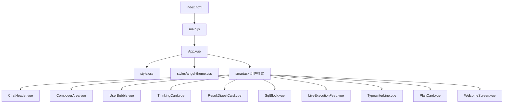
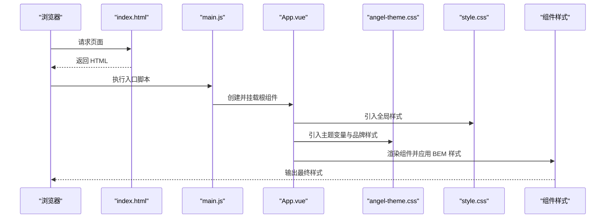
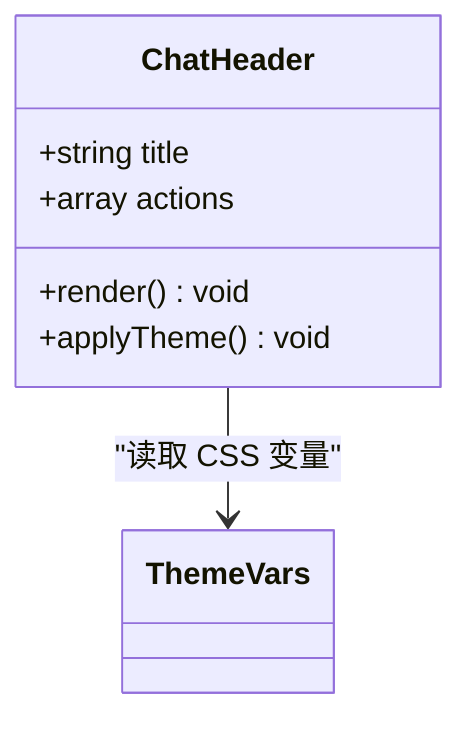
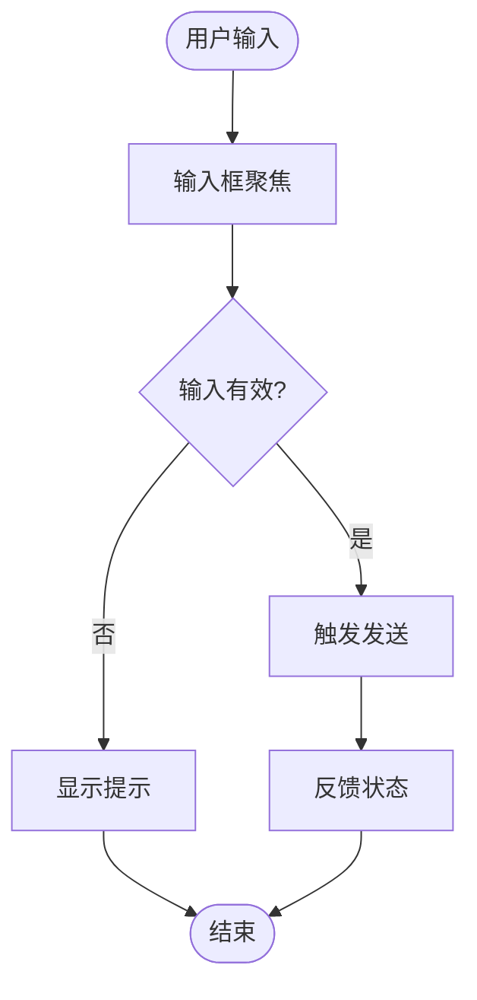
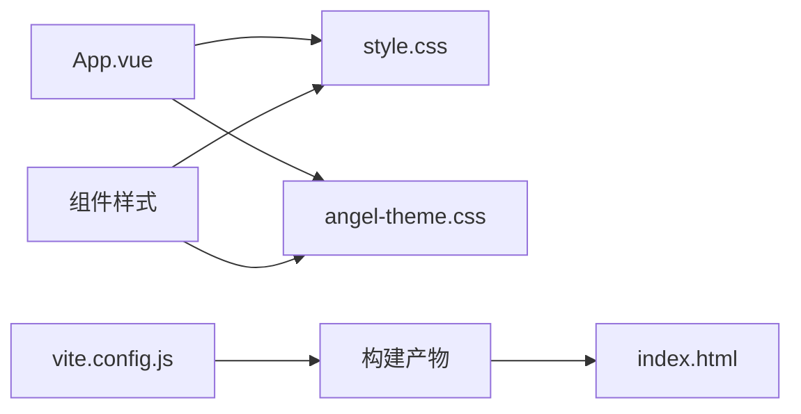

# 样式与主题

<cite>
**本文引用的文件**   
- [frontend/src/styles/angel-theme.css](file://frontend/src/styles/angel-theme.css)
- [frontend/src/style.css](file://frontend/src/style.css)
- [frontend/src/main.js](file://frontend/src/main.js)
- [frontend/src/App.vue](file://frontend/src/App.vue)
- [frontend/src/components/smartask/ChatHeader.vue](file://frontend/src/components/smartask/ChatHeader.vue)
- [frontend/src/components/smartask/ComposerArea.vue](file://frontend/src/components/smartask/ComposerArea.vue)
- [frontend/src/components/smartask/UserBubble.vue](file://frontend/src/components/smartask/UserBubble.vue)
- [frontend/src/components/smartask/ThinkingCard.vue](file://frontend/src/components/smartask/ThinkingCard.vue)
- [frontend/src/components/smartask/ResultDigestCard.vue](file://frontend/src/components/smartask/ResultDigestCard.vue)
- [frontend/src/components/smartask/SqlBlock.vue](file://frontend/src/components/smartask/SqlBlock.vue)
- [frontend/src/components/smartask/LiveExecutionFeed.vue](file://frontend/src/components/smartask/LiveExecutionFeed.vue)
- [frontend/src/components/smartask/TypewriterLine.vue](file://frontend/src/components/smartask/TypewriterLine.vue)
- [frontend/src/components/smartask/PlanCard.vue](file://frontend/src/components/smartask/PlanCard.vue)
- [frontend/src/components/smartask/WelcomeScreen.vue](file://frontend/src/components/smartask/WelcomeScreen.vue)
- [frontend/src/views/SmartAsk.vue](file://frontend/src/views/SmartAsk.vue)
- [frontend/index.html](file://frontend/index.html)
- [frontend/vite.config.js](file://frontend/vite.config.js)
</cite>

## 目录
1. [简介](#简介)
2. [项目结构](#项目结构)
3. [核心组件](#核心组件)
4. [架构总览](#架构总览)
5. [详细组件分析](#详细组件分析)
6. [依赖分析](#依赖分析)
7. [性能考虑](#性能考虑)
8. [故障排查指南](#故障排查指南)
9. [结论](#结论)
10. [附录](#附录)

## 简介
本文件为 SmartAsk 智能问数平台的样式系统与主题定制开发文档。内容覆盖基于 CSS 变量与自定义属性的主题系统、Angel 品牌主题实现、响应式策略、组件样式规范（BEM、模块化、隔离）、动画与过渡、调试工具与兼容性测试，以及主题定制示例与最佳实践。目标是帮助开发者快速理解并高效扩展平台样式体系，确保多品牌、多场景下的视觉一致性与可维护性。

## 项目结构
前端样式与主题相关的关键位置如下：
- 全局样式入口与基础重置位于 style.css
- 主题变量与品牌样式集中在 styles/angel-theme.css
- 应用根组件 App.vue 负责挂载全局样式与主题切换逻辑
- 各业务组件采用 BEM 命名组织样式，并通过 CSS 变量进行主题化
- Vite 构建配置 vite.config.js 管理静态资源与样式处理
- index.html 作为页面入口，承载全局脚本与样式注入点

**图表来源**
- [frontend/index.html](file://frontend/index.html)
- [frontend/src/main.js](file://frontend/src/main.js)
- [frontend/src/App.vue](file://frontend/src/App.vue)
- [frontend/src/style.css](file://frontend/src/style.css)
- [frontend/src/styles/angel-theme.css](file://frontend/src/styles/angel-theme.css)
- [frontend/src/components/smartask/*.vue](file://frontend/src/components/smartask/ChatHeader.vue)

**章节来源**
- [frontend/src/style.css](file://frontend/src/style.css)
- [frontend/src/styles/angel-theme.css](file://frontend/src/styles/angel-theme.css)
- [frontend/src/App.vue](file://frontend/src/App.vue)
- [frontend/vite.config.js](file://frontend/vite.config.js)

## 核心组件
- 主题变量与颜色系统：通过 CSS 自定义属性集中定义，如主色、辅色、中性色、成功/警告/错误等语义色，便于统一替换与动态切换。
- 字体与排版：在全局样式中声明字体族、字号阶梯、行高与字重，确保跨组件一致性。
- 间距与布局：使用统一的间距变量（如 4px 倍数）控制边距、内边距与栅格间距，提升布局一致性。
- 阴影与层级：以 z-index 与 box-shadow 变量统一管理卡片、弹窗与悬浮层的视觉层次。
- 组件样式规范：遵循 BEM 命名约定，按 Block__Element--Modifier 组织类名；通过 CSS 变量实现样式隔离与主题覆盖。

**章节来源**
- [frontend/src/styles/angel-theme.css](file://frontend/src/styles/angel-theme.css)
- [frontend/src/style.css](file://frontend/src/style.css)
- [frontend/src/components/smartask/ChatHeader.vue](file://frontend/src/components/smartask/ChatHeader.vue)
- [frontend/src/components/smartask/ComposerArea.vue](file://frontend/src/components/smartask/ComposerArea.vue)
- [frontend/src/components/smartask/UserBubble.vue](file://frontend/src/components/smartask/UserBubble.vue)
- [frontend/src/components/smartask/ThinkingCard.vue](file://frontend/src/components/smartask/ThinkingCard.vue)
- [frontend/src/components/smartask/ResultDigestCard.vue](file://frontend/src/components/smartask/ResultDigestCard.vue)
- [frontend/src/components/smartask/SqlBlock.vue](file://frontend/src/components/smartask/SqlBlock.vue)
- [frontend/src/components/smartask/LiveExecutionFeed.vue](file://frontend/src/components/smartask/LiveExecutionFeed.vue)
- [frontend/src/components/smartask/TypewriterLine.vue](file://frontend/src/components/smartask/TypewriterLine.vue)
- [frontend/src/components/smartask/PlanCard.vue](file://frontend/src/components/smartask/PlanCard.vue)
- [frontend/src/components/smartask/WelcomeScreen.vue](file://frontend/src/components/smartask/WelcomeScreen.vue)

## 架构总览
样式与主题的加载与生效流程如下：
- index.html 引入构建后的资源
- main.js 初始化 Vue 应用并挂载根组件
- App.vue 引入全局样式与主题样式，提供主题切换能力
- angel-theme.css 定义 CSS 变量与品牌样式
- 各组件通过 BEM 类名与 CSS 变量组合实现样式隔离与主题适配

**图表来源**
- [frontend/index.html](file://frontend/index.html)
- [frontend/src/main.js](file://frontend/src/main.js)
- [frontend/src/App.vue](file://frontend/src/App.vue)
- [frontend/src/style.css](file://frontend/src/style.css)
- [frontend/src/styles/angel-theme.css](file://frontend/src/styles/angel-theme.css)

**章节来源**
- [frontend/index.html](file://frontend/index.html)
- [frontend/src/main.js](file://frontend/src/main.js)
- [frontend/src/App.vue](file://frontend/src/App.vue)
- [frontend/src/style.css](file://frontend/src/style.css)
- [frontend/src/styles/angel-theme.css](file://frontend/src/styles/angel-theme.css)

## 详细组件分析
以下对关键组件的样式结构与主题化方式进行说明，强调 BEM 命名、CSS 变量使用与响应式适配。

### ChatHeader.vue
- 结构：头部容器、标题区、操作按钮区
- 样式：使用 .chat-header__title、.chat-header__actions 等 BEM 类；通过 CSS 变量控制背景、边框与文字颜色
- 主题：在 angel-theme.css 中定义头部区域的主色与对比度，支持深色模式切换

**图表来源**
- [frontend/src/components/smartask/ChatHeader.vue](file://frontend/src/components/smartask/ChatHeader.vue)
- [frontend/src/styles/angel-theme.css](file://frontend/src/styles/angel-theme.css)

**章节来源**
- [frontend/src/components/smartask/ChatHeader.vue](file://frontend/src/components/smartask/ChatHeader.vue)
- [frontend/src/styles/angel-theme.css](file://frontend/src/styles/angel-theme.css)

### ComposerArea.vue
- 结构：输入框、发送按钮、附件区
- 样式：.composer-area__input、.composer-area__send；聚焦态与禁用态通过 CSS 变量与伪类控制
- 主题：输入框边框、占位符颜色与按钮主色由主题变量驱动

**图表来源**
- [frontend/src/components/smartask/ComposerArea.vue](file://frontend/src/components/smartask/ComposerArea.vue)
- [frontend/src/styles/angel-theme.css](file://frontend/src/styles/angel-theme.css)

**章节来源**
- [frontend/src/components/smartask/ComposerArea.vue](file://frontend/src/components/smartask/ComposerArea.vue)
- [frontend/src/styles/angel-theme.css](file://frontend/src/styles/angel-theme.css)

### UserBubble.vue
- 结构：用户消息气泡、时间戳、头像
- 样式：.user-bubble__content、.user-bubble__meta；对齐与圆角通过变量控制
- 主题：气泡背景与文字颜色随主题变化，确保可读性

**章节来源**
- [frontend/src/components/smartask/UserBubble.vue](file://frontend/src/components/smartask/UserBubble.vue)
- [frontend/src/styles/angel-theme.css](file://frontend/src/styles/angel-theme.css)

### ThinkingCard.vue
- 结构：思考过程卡片、步骤列表、状态指示
- 样式：.thinking-card__step、.thinking-card__status；动画用于逐步展示
- 主题：卡片背景、分隔线与状态色由主题变量管理

**章节来源**
- [frontend/src/components/smartask/ThinkingCard.vue](file://frontend/src/components/smartask/ThinkingCard.vue)
- [frontend/src/styles/angel-theme.css](file://frontend/src/styles/angel-theme.css)

### ResultDigestCard.vue
- 结构：结果摘要卡片、指标展示、操作按钮
- 样式：.result-digest__metric、.result-digest__actions；网格布局与间距变量
- 主题：强调色与图标颜色跟随主题

**章节来源**
- [frontend/src/components/smartask/ResultDigestCard.vue](file://frontend/src/components/smartask/ResultDigestCard.vue)
- [frontend/src/styles/angel-theme.css](file://frontend/src/styles/angel-theme.css)

### SqlBlock.vue
- 结构：SQL 代码块、语法高亮、复制按钮
- 样式：.sql-block__code、.sql-block__toolbar；滚动与换行处理
- 主题：代码背景、关键字颜色与选中态由主题变量控制

**章节来源**
- [frontend/src/components/smartask/SqlBlock.vue](file://frontend/src/components/smartask/SqlBlock.vue)
- [frontend/src/styles/angel-theme.css](file://frontend/src/styles/angel-theme.css)

### LiveExecutionFeed.vue
- 结构：执行日志流、时间线、状态标签
- 样式：.feed-item__time、.feed-item__status；滚动与自动更新
- 主题：状态标签颜色与背景随主题变化

**章节来源**
- [frontend/src/components/smartask/LiveExecutionFeed.vue](file://frontend/src/components/smartask/LiveExecutionFeed.vue)
- [frontend/src/styles/angel-theme.css](file://frontend/src/styles/angel-theme.css)

### TypewriterLine.vue
- 结构：打字机效果文本行、光标闪烁
- 样式：.typewriter-line__text、.typewriter-line__cursor；动画与延迟控制
- 主题：文本颜色与光标颜色由主题变量决定

**章节来源**
- [frontend/src/components/smartask/TypewriterLine.vue](file://frontend/src/components/smartask/TypewriterLine.vue)
- [frontend/src/styles/angel-theme.css](file://frontend/src/styles/angel-theme.css)

### PlanCard.vue
- 结构：计划卡片、任务列表、进度条
- 样式：.plan-card__task、.plan-card__progress；进度条宽度与颜色
- 主题：进度条主色与背景色跟随主题

**章节来源**
- [frontend/src/components/smartask/PlanCard.vue](file://frontend/src/components/smartask/PlanCard.vue)
- [frontend/src/styles/angel-theme.css](file://frontend/src/styles/angel-theme.css)

### WelcomeScreen.vue
- 结构：欢迎页、快捷入口、引导文案
- 样式：.welcome-screen__hero、.welcome-screen__shortcuts；弹性布局与居中
- 主题：主色调与按钮样式由主题变量控制

**章节来源**
- [frontend/src/components/smartask/WelcomeScreen.vue](file://frontend/src/components/smartask/WelcomeScreen.vue)
- [frontend/src/styles/angel-theme.css](file://frontend/src/styles/angel-theme.css)

## 依赖分析
样式与主题的依赖关系如下：
- App.vue 依赖 style.css 与 angel-theme.css
- 各组件依赖 BEM 类名与 CSS 变量
- Vite 构建将样式打包并注入到页面

**图表来源**
- [frontend/src/App.vue](file://frontend/src/App.vue)
- [frontend/src/style.css](file://frontend/src/style.css)
- [frontend/src/styles/angel-theme.css](file://frontend/src/styles/angel-theme.css)
- [frontend/vite.config.js](file://frontend/vite.config.js)
- [frontend/index.html](file://frontend/index.html)

**章节来源**
- [frontend/src/App.vue](file://frontend/src/App.vue)
- [frontend/src/style.css](file://frontend/src/style.css)
- [frontend/src/styles/angel-theme.css](file://frontend/src/styles/angel-theme.css)
- [frontend/vite.config.js](file://frontend/vite.config.js)
- [frontend/index.html](file://frontend/index.html)

## 性能考虑
- 减少样式重复：通过 CSS 变量与公共类复用样式，降低 CSS 体积
- 避免过度嵌套：BEM 扁平化结构，提高选择器匹配效率
- 合理使用动画：优先使用 transform 与 opacity，避免触发布局重排
- 按需加载样式：组件级样式与主题分离，减少首屏样式体积
- 缓存与压缩：Vite 构建时启用 CSS 压缩与缓存策略

[本节为通用指导，不直接分析具体文件]

## 故障排查指南
- 主题未生效：检查 angel-theme.css 是否被正确引入，确认 CSS 变量作用域与优先级
- 样式冲突：使用浏览器开发者工具审查元素，定位覆盖规则与 !important 使用
- 响应式异常：检查媒体查询断点与单位使用，确保移动端适配
- 动画卡顿：优化动画属性，避免频繁重绘与重排
- 兼容性测试：在不同浏览器与设备上验证样式表现，必要时添加前缀或降级方案

**章节来源**
- [frontend/src/styles/angel-theme.css](file://frontend/src/styles/angel-theme.css)
- [frontend/src/style.css](file://frontend/src/style.css)
- [frontend/src/App.vue](file://frontend/src/App.vue)

## 结论
SmartAsk 的样式系统以 CSS 变量为核心，结合 BEM 命名与模块化组织，实现了高度可定制的主题体系。Angel 品牌主题通过集中变量与样式覆盖完成品牌化适配。响应式设计与动画优化保障了多端体验与性能。建议持续完善主题变量字典与组件样式规范，以提升团队协作效率与产品一致性。

[本节为总结性内容，不直接分析具体文件]

## 附录
- 主题定制示例：新增品牌主题时，复制 angel-theme.css 并修改变量值，确保所有语义色与尺寸变量完整
- 品牌适配最佳实践：Logo 替换通过 CSS 背景图或 SVG 注入；图标系统集成需统一尺寸与颜色变量
- 调试工具推荐：Chrome DevTools 的 Elements 与 Styles 面板、CSS Variables 调试插件、Lighthouse 性能审计

[本节为补充信息，不直接分析具体文件]