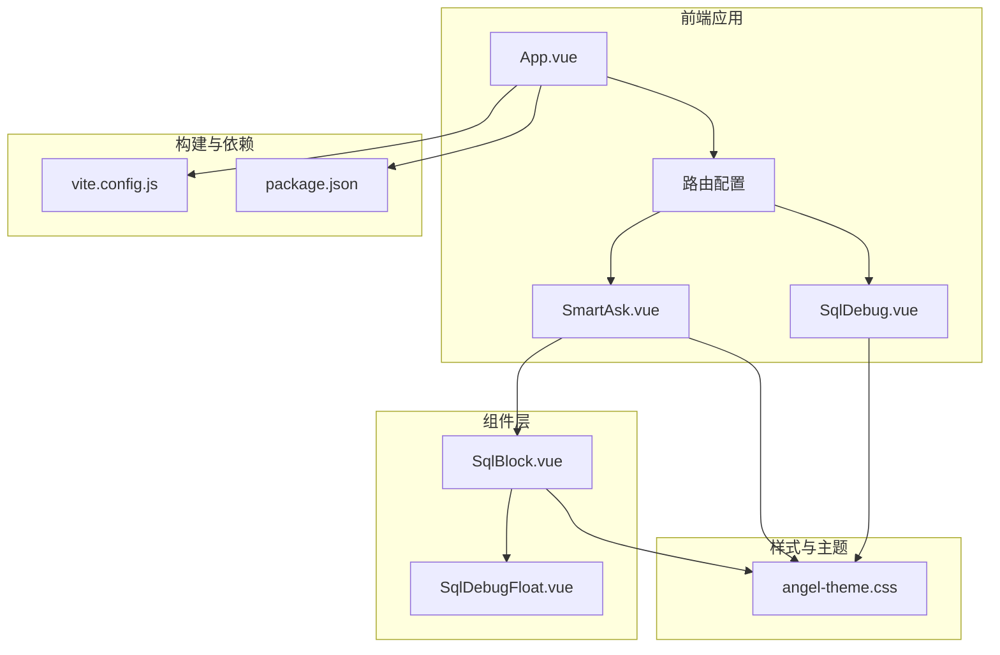
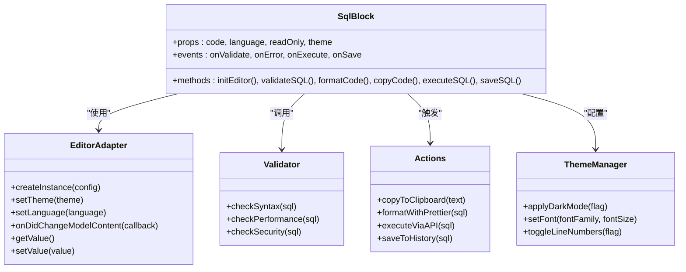
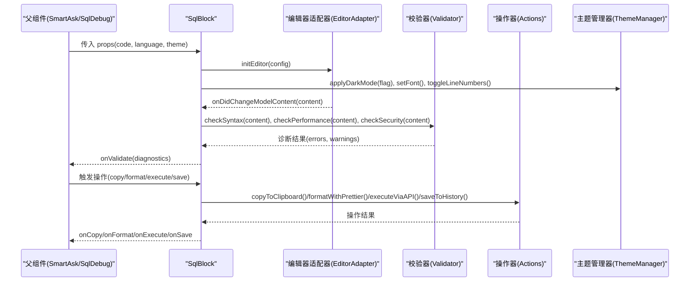
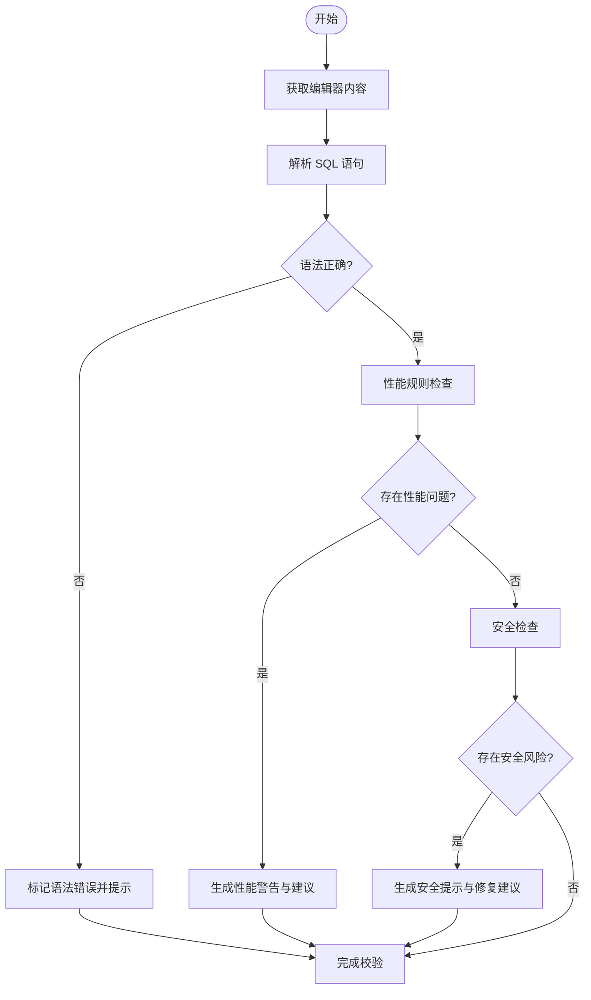
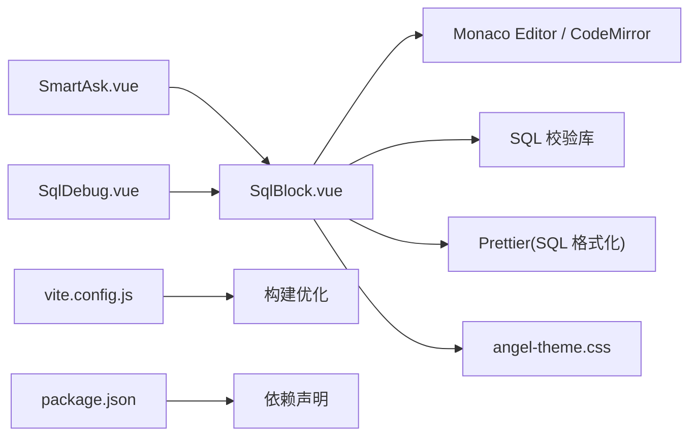

# SQL代码块组件 (SqlBlock)

<cite>
**本文引用的文件**
- [SqlBlock.vue](file://frontend/src/components/smartask/SqlBlock.vue)
- [SqlDebugFloat.vue](file://frontend/src/components/SqlDebugFloat.vue)
- [SmartAsk.vue](file://frontend/src/views/SmartAsk.vue)
- [SqlDebug.vue](file://frontend/src/views/SqlDebug.vue)
- [package.json](file://frontend/package.json)
- [vite.config.js](file://frontend/vite.config.js)
- [angel-theme.css](file://frontend/src/styles/angel-theme.css)
</cite>

## 目录
1. [简介](#简介)
2. [项目结构](#项目结构)
3. [核心组件](#核心组件)
4. [架构总览](#架构总览)
5. [详细组件分析](#详细组件分析)
6. [依赖关系分析](#依赖关系分析)
7. [性能考虑](#性能考虑)
8. [故障排查指南](#故障排查指南)
9. [结论](#结论)
10. [附录](#附录)

## 简介
本技术文档围绕前端 SqlBlock SQL代码块组件，系统阐述其如何实现 SQL 代码的高亮显示与语法检查、编辑器集成（Monaco Editor / CodeMirror）、语法校验机制（SQL 语法验证、性能警告、安全提示）、代码操作（复制、格式化、执行、保存）、主题定制（暗色模式、字体设置、行号显示），以及性能优化策略与调试技巧。文档面向不同技术背景的读者，提供从概览到实现细节的多层次说明，并辅以架构图、流程图和时序图帮助理解。

## 项目结构
SqlBlock 位于前端 Vue 项目中，作为智能问答界面的关键交互组件之一，负责展示与编辑 SQL 片段，并提供调试入口与主题配置能力。相关视图与工具组件共同构成完整的 SQL 编辑体验。

图表来源
- [SmartAsk.vue](file://frontend/src/views/SmartAsk.vue)
- [SqlBlock.vue](file://frontend/src/components/smartask/SqlBlock.vue)
- [SqlDebugFloat.vue](file://frontend/src/components/SqlDebugFloat.vue)
- [SqlDebug.vue](file://frontend/src/views/SqlDebug.vue)
- [angel-theme.css](file://frontend/src/styles/angel-theme.css)
- [vite.config.js](file://frontend/vite.config.js)
- [package.json](file://frontend/package.json)

章节来源
- [SmartAsk.vue](file://frontend/src/views/SmartAsk.vue)
- [SqlBlock.vue](file://frontend/src/components/smartask/SqlBlock.vue)
- [SqlDebugFloat.vue](file://frontend/src/components/SqlDebugFloat.vue)
- [SqlDebug.vue](file://frontend/src/views/SqlDebug.vue)
- [angel-theme.css](file://frontend/src/styles/angel-theme.css)
- [vite.config.js](file://frontend/vite.config.js)
- [package.json](file://frontend/package.json)

## 核心组件
- SqlBlock：SQL 代码块的核心展示与编辑组件，封装编辑器实例、高亮、语法检查、操作按钮与主题适配。
- SqlDebugFloat：浮动调试面板，提供快速查看 SQL 上下文、错误定位与执行反馈的辅助功能。
- SmartAsk 与 SqlDebug：页面级容器，组织 SqlBlock 的使用场景与调试流程。

章节来源
- [SqlBlock.vue](file://frontend/src/components/smartask/SqlBlock.vue)
- [SqlDebugFloat.vue](file://frontend/src/components/SqlDebugFloat.vue)
- [SmartAsk.vue](file://frontend/src/views/SmartAsk.vue)
- [SqlDebug.vue](file://frontend/src/views/SqlDebug.vue)

## 架构总览
SqlBlock 采用“编辑器 + 校验 + 操作”的分层设计：
- 编辑器层：基于 Monaco Editor 或 CodeMirror 的实例化与配置，负责渲染、输入处理与事件分发。
- 校验层：SQL 语法检查、性能规则提示、安全规则提示，通过异步或同步方式触发诊断信息。
- 操作层：复制、格式化、执行、保存等用户动作，调用后端服务或本地工具完成。
- 主题层：暗色模式、字体、行号等视觉配置，统一由 CSS 变量或编辑器主题管理。

图表来源
- [SqlBlock.vue](file://frontend/src/components/smartask/SqlBlock.vue)

章节来源
- [SqlBlock.vue](file://frontend/src/components/smartask/SqlBlock.vue)

## 详细组件分析

### SqlBlock 组件分析
SqlBlock 是 SQL 编辑体验的核心，负责：
- 编辑器初始化与生命周期管理
- 语言与主题切换
- 实时语法检查与诊断提示
- 用户操作（复制、格式化、执行、保存）
- 与父组件的事件通信

图表来源
- [SqlBlock.vue](file://frontend/src/components/smartask/SqlBlock.vue)

章节来源
- [SqlBlock.vue](file://frontend/src/components/smartask/SqlBlock.vue)

### 编辑器集成（Monaco Editor / CodeMirror）
- 选择策略：根据运行环境与需求选择 Monaco Editor（功能强大、扩展性好）或 CodeMirror（轻量、易嵌入）。
- 配置要点：
  - 语言支持：启用 SQL 语法高亮与自动补全。
  - 主题：支持暗色模式与自定义主题。
  - 行为：行号显示、缩进、撤销重做、快捷键绑定。
  - 性能：按需加载语言包、延迟初始化、虚拟滚动。
- 事件处理：内容变更、焦点变化、选择范围、命令执行。

章节来源
- [SqlBlock.vue](file://frontend/src/components/smartask/SqlBlock.vue)
- [package.json](file://frontend/package.json)
- [vite.config.js](file://frontend/vite.config.js)

### 语法检查机制
- SQL 语法验证：解析 SQL 语句，返回语法错误位置与描述。
- 性能警告：检测慢查询模式（如全表扫描、缺少索引提示、复杂 JOIN）。
- 安全提示：识别潜在风险（如 SELECT *、未加 WHERE 的 UPDATE/DELETE、注入风险）。
- 集成方式：
  - 本地校验：使用 SQL 解析库进行静态分析。
  - 远程校验：将 SQL 发送至后端服务进行深度分析与建议。
- 用户体验：在编辑器中显示下划线、悬浮提示、侧边栏诊断列表。

图表来源
- [SqlBlock.vue](file://frontend/src/components/smartask/SqlBlock.vue)

章节来源
- [SqlBlock.vue](file://frontend/src/components/smartask/SqlBlock.vue)

### 代码操作功能
- 复制：将当前 SQL 复制到剪贴板，支持多行与格式保留。
- 格式化：调用 Prettier 或内置格式化器对 SQL 进行美化。
- 执行：将 SQL 发送至后端执行接口，返回结果集或错误信息。
- 保存：将 SQL 保存到历史记录或数据库，支持版本管理与回滚。

章节来源
- [SqlBlock.vue](file://frontend/src/components/smartask/SqlBlock.vue)

### 主题定制支持
- 暗色模式：通过 CSS 变量或编辑器主题切换实现整体暗色风格。
- 字体设置：支持自定义字体族与字号，提升可读性。
- 行号显示：可开关行号显示，适应不同屏幕尺寸与使用习惯。
- 主题持久化：用户偏好存储至本地或后端，跨会话保持一致。

章节来源
- [angel-theme.css](file://frontend/src/styles/angel-theme.css)
- [SqlBlock.vue](file://frontend/src/components/smartask/SqlBlock.vue)

### 调试与辅助功能
- SqlDebugFloat：浮动面板展示 SQL 上下文、错误定位、执行日志。
- 断点与步进：在编辑器中标记关键行，逐步执行与观察状态。
- 日志输出：控制台与可视化日志面板结合，便于问题追踪。

章节来源
- [SqlDebugFloat.vue](file://frontend/src/components/SqlDebugFloat.vue)
- [SqlDebug.vue](file://frontend/src/views/SqlDebug.vue)

## 依赖关系分析
SqlBlock 依赖前端构建工具与第三方库，确保编辑器与校验功能的稳定运行。

图表来源
- [SqlBlock.vue](file://frontend/src/components/smartask/SqlBlock.vue)
- [package.json](file://frontend/package.json)
- [vite.config.js](file://frontend/vite.config.js)

章节来源
- [package.json](file://frontend/package.json)
- [vite.config.js](file://frontend/vite.config.js)
- [SqlBlock.vue](file://frontend/src/components/smartask/SqlBlock.vue)

## 性能考虑
- 编辑器初始化：延迟加载与按需引入语言包，减少首屏体积。
- 校验频率：防抖与节流控制，避免频繁触发导致卡顿。
- 内存管理：及时销毁编辑器实例与监听器，防止内存泄漏。
- 网络请求：批量执行与缓存结果，降低后端压力。
- 渲染优化：虚拟滚动与增量更新，提升大文本处理能力。

[本节为通用指导，不直接分析具体文件]

## 故障排查指南
- 编辑器无法加载：检查依赖安装与构建配置，确认资源路径正确。
- 语法检查无响应：校验库是否初始化成功，网络请求是否被拦截。
- 主题不生效：CSS 变量是否正确覆盖，编辑器主题是否匹配。
- 执行失败：后端接口是否可达，权限与参数是否合法。
- 调试困难：打开浮动面板查看错误堆栈与日志输出。

章节来源
- [SqlDebugFloat.vue](file://frontend/src/components/SqlDebugFloat.vue)
- [SqlDebug.vue](file://frontend/src/views/SqlDebug.vue)

## 结论
SqlBlock 组件通过模块化设计与清晰的职责划分，实现了 SQL 代码的高亮显示、语法检查与丰富的操作功能。结合 Monaco Editor 或 CodeMirror 的灵活配置，以及主题定制与性能优化策略，为用户提供高效、安全的 SQL 编辑体验。未来可进一步扩展插件生态与智能建议能力，提升开发效率与代码质量。

[本节为总结性内容，不直接分析具体文件]

## 附录
- 最佳实践：
  - 合理拆分校验逻辑，避免主线程阻塞。
  - 使用懒加载与缓存策略优化性能。
  - 提供用户友好的错误提示与修复建议。
- 常见问题：
  - 编辑器卡顿：检查大文本处理与渲染优化。
  - 主题冲突：隔离样式与作用域，避免全局污染。
  - 跨域问题：配置代理与 CORS 策略。

[本节为补充信息，不直接分析具体文件]