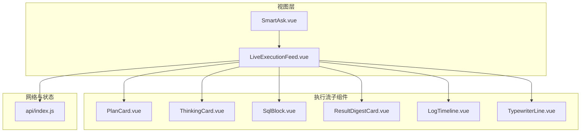
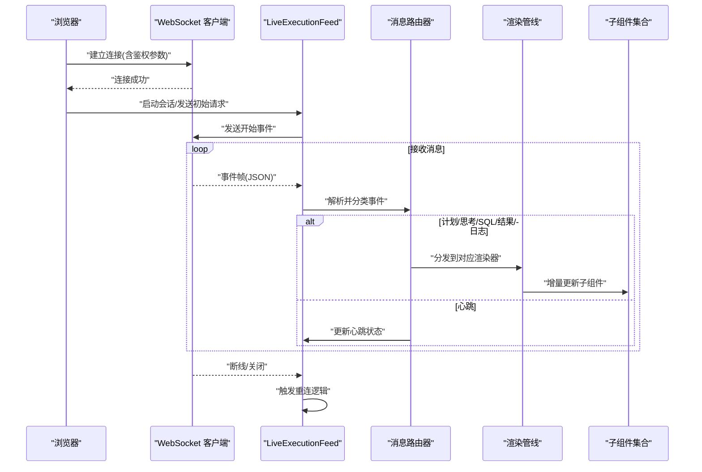
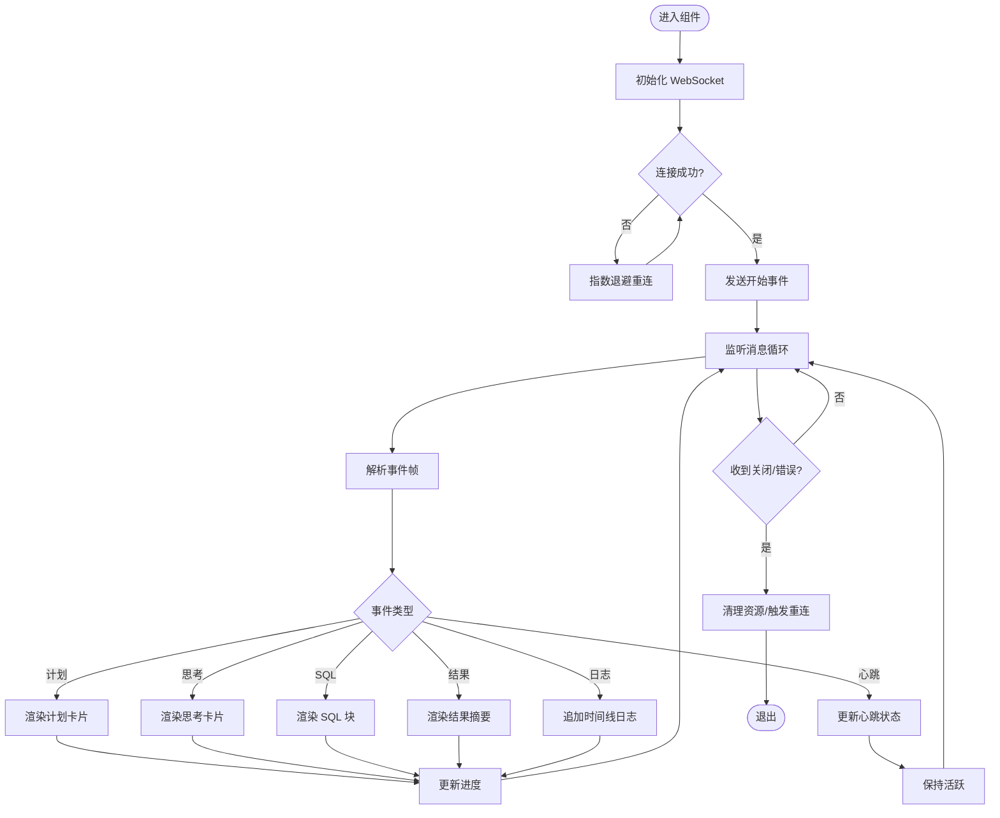
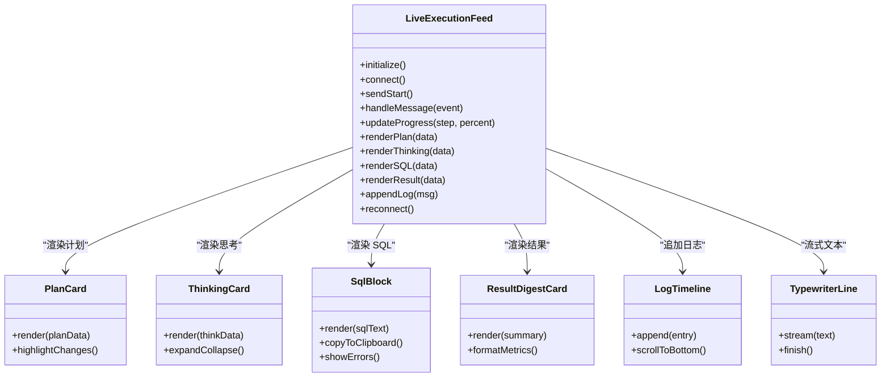
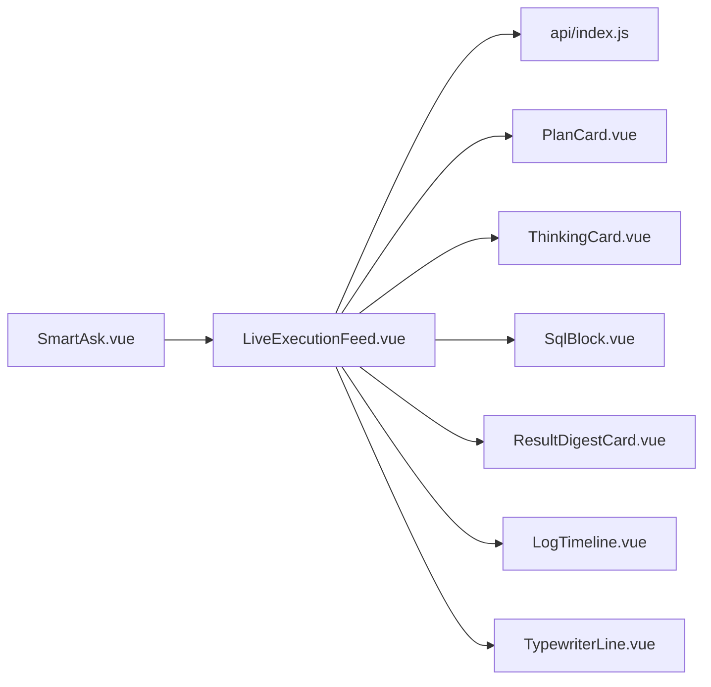

# 实时执行流组件 (LiveExecutionFeed)

<cite>
**本文引用的文件**   
- [LiveExecutionFeed.vue](file://frontend/src/components/smartask/LiveExecutionFeed.vue)
- [PlanCard.vue](file://frontend/src/components/smartask/PlanCard.vue)
- [ThinkingCard.vue](file://frontend/src/components/smartask/ThinkingCard.vue)
- [SqlBlock.vue](file://frontend/src/components/smartask/SqlBlock.vue)
- [ResultDigestCard.vue](file://frontend/src/components/smartask/ResultDigestCard.vue)
- [TypewriterLine.vue](file://frontend/src/components/smartask/TypewriterLine.vue)
- [LogTimeline.vue](file://frontend/src/components/smartask/LogTimeline.vue)
- [SmartAsk.vue](file://frontend/src/views/SmartAsk.vue)
- [index.js](file://frontend/src/api/index.js)
</cite>

## 目录
1. [简介](#简介)
2. [项目结构](#项目结构)
3. [核心组件](#核心组件)
4. [架构总览](#架构总览)
5. [详细组件分析](#详细组件分析)
6. [依赖关系分析](#依赖关系分析)
7. [性能考虑](#性能考虑)
8. [故障排查指南](#故障排查指南)
9. [结论](#结论)
10. [附录](#附录)

## 简介
本技术文档围绕前端实时执行流组件 LiveExecutionFeed，系统性阐述其 WebSocket 连接管理、实时消息流处理、执行步骤渲染、进度状态管理、消息类型差异化展示以及性能优化策略。目标是帮助开发者与使用者快速理解该组件的工作原理、扩展点与常见问题解决方案。

## 项目结构
LiveExecutionFeed 位于前端 smartask 子系统中，作为智能问答“中间区”的核心可视化容器，负责接收后端推送的执行事件，驱动计划卡片、思考过程、SQL 片段、结果摘要等子组件的增量渲染。

图表来源
- [SmartAsk.vue](file://frontend/src/views/SmartAsk.vue)
- [LiveExecutionFeed.vue](file://frontend/src/components/smartask/LiveExecutionFeed.vue)
- [PlanCard.vue](file://frontend/src/components/smartask/PlanCard.vue)
- [ThinkingCard.vue](file://frontend/src/components/smartask/ThinkingCard.vue)
- [SqlBlock.vue](file://frontend/src/components/smartask/SqlBlock.vue)
- [ResultDigestCard.vue](file://frontend/src/components/smartask/ResultDigestCard.vue)
- [LogTimeline.vue](file://frontend/src/components/smartask/LogTimeline.vue)
- [TypewriterLine.vue](file://frontend/src/components/smartask/TypewriterLine.vue)
- [index.js](file://frontend/src/api/index.js)

章节来源
- [LiveExecutionFeed.vue](file://frontend/src/components/smartask/LiveExecutionFeed.vue)
- [SmartAsk.vue](file://frontend/src/views/SmartAsk.vue)
- [index.js](file://frontend/src/api/index.js)

## 核心组件
- LiveExecutionFeed：执行流主容器，负责 WebSocket 生命周期管理（建立、心跳、重连）、消息分发、渲染调度、进度与错误状态管理。
- PlanCard：计划步骤卡片，展示 SQL 生成计划、数据源选择、查询意图等结构化信息。
- ThinkingCard：思考过程卡片，呈现推理链、约束检查、路由决策等文本型内容。
- SqlBlock：SQL 代码块，支持语法高亮、复制、折叠、错误提示。
- ResultDigestCard：结果摘要卡片，展示统计指标、关键洞察、可操作建议。
- LogTimeline：时间线日志，按时间顺序展示系统级事件与调试信息。
- TypewriterLine：打字机效果行，用于逐步输出长文本或流式片段。

章节来源
- [LiveExecutionFeed.vue](file://frontend/src/components/smartask/LiveExecutionFeed.vue)
- [PlanCard.vue](file://frontend/src/components/smartask/PlanCard.vue)
- [ThinkingCard.vue](file://frontend/src/components/smartask/ThinkingCard.vue)
- [SqlBlock.vue](file://frontend/src/components/smartask/SqlBlock.vue)
- [ResultDigestCard.vue](file://frontend/src/components/smartask/ResultDigestCard.vue)
- [LogTimeline.vue](file://frontend/src/components/smartask/LogTimeline.vue)
- [TypewriterLine.vue](file://frontend/src/components/smartask/TypewriterLine.vue)

## 架构总览
LiveExecutionFeed 采用“事件驱动 + 单向数据流”的架构模式：
- 输入：WebSocket 推送的消息流（计划、思考、SQL、结果、日志、心跳）。
- 处理：消息分类器将事件映射到对应渲染管线；进度管理器维护整体与局部进度；错误处理器统一捕获并上报。
- 输出：各子组件按需增量更新，避免全量重绘。

图表来源
- [LiveExecutionFeed.vue](file://frontend/src/components/smartask/LiveExecutionFeed.vue)
- [index.js](file://frontend/src/api/index.js)

## 详细组件分析

### LiveExecutionFeed：连接管理与消息流处理
- 连接建立
  - 初始化 WebSocket 实例，设置协议与超时参数。
  - 在连接成功后发送会话初始化事件，携带必要上下文（如用户、会话ID、任务ID）。
- 心跳检测
  - 周期性发送心跳帧，服务端回显确认；若连续失败则标记连接异常。
- 断线重连
  - 指数退避策略，限制最大重试次数；支持手动恢复与自动恢复开关。
- 消息分发
  - 基于事件类型路由至不同渲染管线：计划、思考、SQL、结果、日志、心跳。
  - 对大文本使用分片与节流，避免阻塞主线程。
- 进度状态管理
  - 全局进度：总体完成百分比、阶段状态（准备中、执行中、完成、失败）。
  - 局部进度：每个步骤的加载动画、进度条、错误提示。
- 错误处理
  - 网络异常、JSON 解析失败、渲染异常均被捕获并记录到时间线。
  - 提供重试入口与降级显示（如仅展示文本、隐藏图表）。

图表来源
- [LiveExecutionFeed.vue](file://frontend/src/components/smartask/LiveExecutionFeed.vue)

章节来源
- [LiveExecutionFeed.vue](file://frontend/src/components/smartask/LiveExecutionFeed.vue)

### 执行步骤渲染逻辑：SQL 生成、数据查询、结果处理
- SQL 生成
  - 计划阶段产出结构化 SQL 草稿，包含表名、字段、过滤条件、聚合方式。
  - SqlBlock 负责语法高亮、格式化、错误定位与复制功能。
- 数据查询
  - 执行阶段通过后端接口或流式返回获取结果集；前端以增量方式追加行。
  - 对大数据集启用分页与虚拟滚动，减少 DOM 压力。
- 结果处理
  - 结果摘要由 ResultDigestCard 渲染，包括关键指标、趋势描述、建议动作。
  - 对数值进行单位换算、精度控制与异常值标注。

图表来源
- [LiveExecutionFeed.vue](file://frontend/src/components/smartask/LiveExecutionFeed.vue)
- [PlanCard.vue](file://frontend/src/components/smartask/PlanCard.vue)
- [ThinkingCard.vue](file://frontend/src/components/smartask/ThinkingCard.vue)
- [SqlBlock.vue](file://frontend/src/components/smartask/SqlBlock.vue)
- [ResultDigestCard.vue](file://frontend/src/components/smartask/ResultDigestCard.vue)
- [LogTimeline.vue](file://frontend/src/components/smartask/LogTimeline.vue)
- [TypewriterLine.vue](file://frontend/src/components/smartask/TypewriterLine.vue)

章节来源
- [LiveExecutionFeed.vue](file://frontend/src/components/smartask/LiveExecutionFeed.vue)
- [SqlBlock.vue](file://frontend/src/components/smartask/SqlBlock.vue)
- [ResultDigestCard.vue](file://frontend/src/components/smartask/ResultDigestCard.vue)

### 进度状态管理系统
- 加载动画
  - 骨架屏与旋转图标用于等待阶段，避免空白闪烁。
- 进度条更新
  - 全局进度与步骤进度分离，支持暂停、继续、重置。
- 错误状态显示
  - 错误级别分级（警告、严重），提供重试与跳过选项。
  - 错误详情可展开查看堆栈与上下文。

章节来源
- [LiveExecutionFeed.vue](file://frontend/src/components/smartask/LiveExecutionFeed.vue)
- [LogTimeline.vue](file://frontend/src/components/smartask/LogTimeline.vue)

### 消息类型处理与差异化渲染
- 计划步骤
  - 结构化展示目标、约束、数据源、SQL 草稿，支持对比差异。
- 思考过程
  - 文本为主，支持折叠、关键词高亮、引用跳转。
- 执行结果
  - 指标卡片、表格、图表混合展示，支持导出与分享。
- 日志与心跳
  - 时间线形式，支持筛选与搜索；心跳用于保活与延迟监控。

章节来源
- [PlanCard.vue](file://frontend/src/components/smartask/PlanCard.vue)
- [ThinkingCard.vue](file://frontend/src/components/smartask/ThinkingCard.vue)
- [ResultDigestCard.vue](file://frontend/src/components/smartask/ResultDigestCard.vue)
- [LogTimeline.vue](file://frontend/src/components/smartask/LogTimeline.vue)

## 依赖关系分析
LiveExecutionFeed 依赖 api 模块进行网络通信，并通过组合多个子组件实现渲染。

图表来源
- [LiveExecutionFeed.vue](file://frontend/src/components/smartask/LiveExecutionFeed.vue)
- [index.js](file://frontend/src/api/index.js)
- [SmartAsk.vue](file://frontend/src/views/SmartAsk.vue)

章节来源
- [LiveExecutionFeed.vue](file://frontend/src/components/smartask/LiveExecutionFeed.vue)
- [index.js](file://frontend/src/api/index.js)
- [SmartAsk.vue](file://frontend/src/views/SmartAsk.vue)

## 性能考虑
- 虚拟滚动
  - 对长列表与结果集启用虚拟滚动，仅渲染可视区域节点，降低内存占用与重排开销。
- 内存管理
  - 及时释放 WebSocket 与定时器；对大对象进行弱引用或池化复用。
- 事件节流
  - 对高频事件（如滚动、输入、消息合并）进行节流与防抖，避免抖动与卡顿。
- 渲染优化
  - 使用增量更新与 key 稳定标识，避免不必要的重渲染；对复杂计算使用 Web Worker。
- 网络优化
  - 批量合并消息、压缩传输、断线续传；心跳间隔自适应网络质量。

[本节为通用性能指导，不直接分析具体文件]

## 故障排查指南
- 连接问题
  - 检查 WebSocket 地址、端口、跨域配置与鉴权参数；观察控制台网络面板。
- 心跳失败
  - 调整心跳间隔与超时阈值；检查服务端健康端点与负载情况。
- 重连风暴
  - 限制最大重试次数与退避上限；增加抖动因子避免雪崩。
- 渲染异常
  - 校验事件数据结构与必填字段；对缺失字段提供默认值与降级展示。
- 性能瓶颈
  - 使用性能面板分析主线程阻塞；定位大对象与频繁重渲染位置。
- 日志定位
  - 打开 LogTimeline 查看详细事件序列；过滤错误级别与关键字。

章节来源
- [LiveExecutionFeed.vue](file://frontend/src/components/smartask/LiveExecutionFeed.vue)
- [LogTimeline.vue](file://frontend/src/components/smartask/LogTimeline.vue)

## 结论
LiveExecutionFeed 通过稳健的 WebSocket 管理、清晰的消息路由与高效的渲染管线，实现了高质量的实时执行流体验。结合虚拟滚动、内存管理与事件节流等优化策略，可在大规模数据与高并发场景下保持稳定表现。建议在生产环境开启详细日志与性能监控，持续迭代用户体验。

[本节为总结性内容，不直接分析具体文件]

## 附录
- 最佳实践
  - 为每个事件定义明确的数据契约；对可选字段提供默认值。
  - 将渲染逻辑与业务逻辑解耦，便于测试与替换。
  - 对敏感信息进行脱敏与权限控制。
- 扩展建议
  - 支持自定义渲染器插件；允许用户切换主题与布局。
  - 引入缓存层减少重复渲染；支持离线回放与快照。

[本节为补充性内容，不直接分析具体文件]