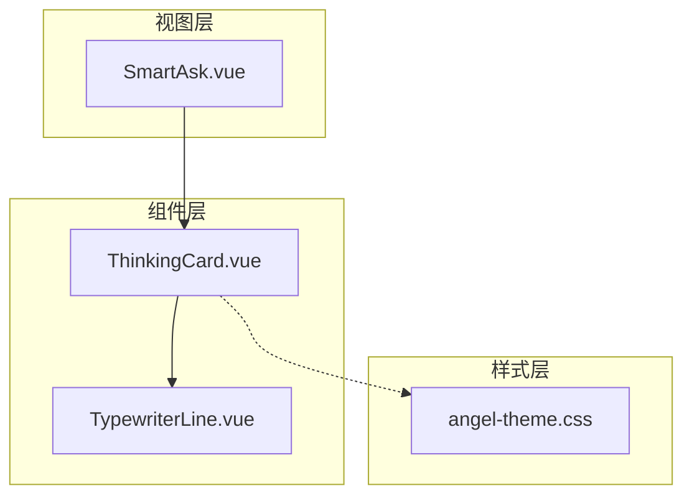
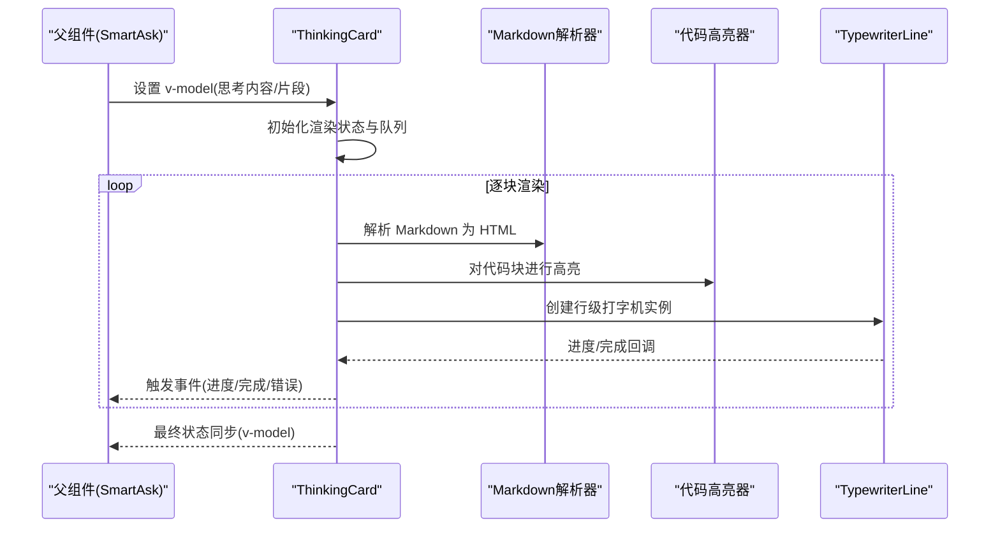
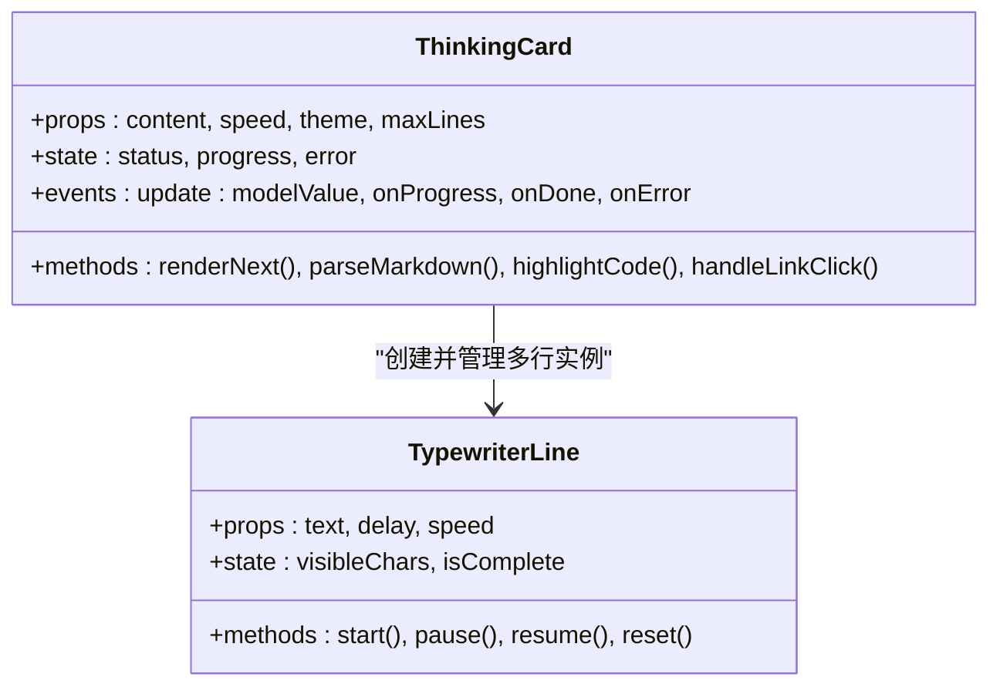
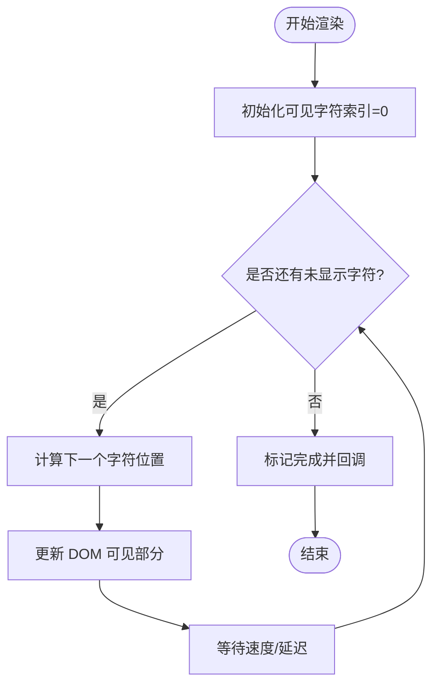
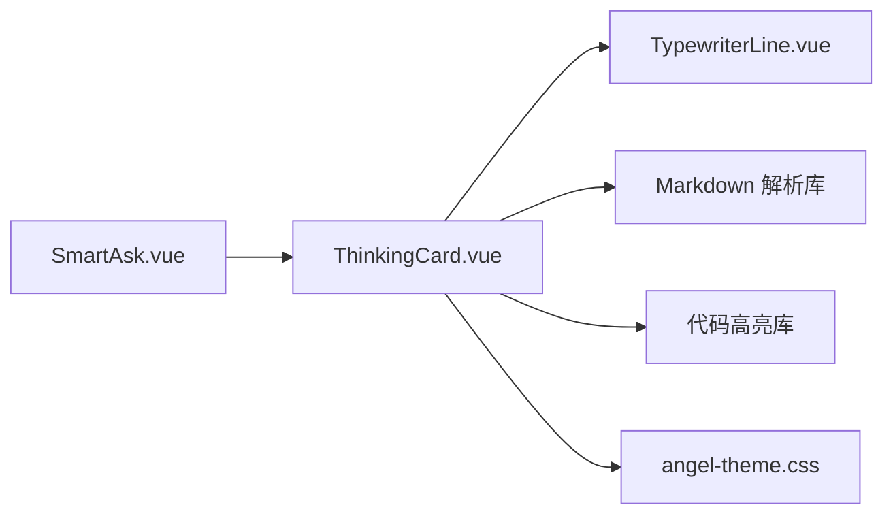

# 思考卡片组件 (ThinkingCard)

<cite>
**本文引用的文件**   
- [ThinkingCard.vue](file://frontend/src/components/smartask/ThinkingCard.vue)
- [TypewriterLine.vue](file://frontend/src/components/smartask/TypewriterLine.vue)
- [SmartAsk.vue](file://frontend/src/views/SmartAsk.vue)
- [angel-theme.css](file://frontend/src/styles/angel-theme.css)
</cite>

## 目录
1. [简介](#简介)
2. [项目结构](#项目结构)
3. [核心组件](#核心组件)
4. [架构总览](#架构总览)
5. [详细组件分析](#详细组件分析)
6. [依赖关系分析](#依赖关系分析)
7. [性能考量](#性能考量)
8. [故障排查指南](#故障排查指南)
9. [结论](#结论)
10. [附录](#附录)

## 简介
ThinkingCard 是用于展示 AI 思考过程的可视化卡片组件。它通过渐进式渲染、打字机效果与状态切换动画，将模型推理过程以“逐步显式”的方式呈现给用户，提升可解释性与交互体验。该文档从系统架构、数据流、渲染机制、动画实现、样式定制与最佳实践等维度进行系统化说明，帮助开发者快速集成与扩展。

## 项目结构
ThinkingCard 位于前端 Vue 组件目录中，作为智能问答界面的关键展示单元，通常由父视图（如 SmartAsk）管理其数据与生命周期，并通过 v-model 与事件回调与父组件双向绑定。

图表来源
- [SmartAsk.vue](file://frontend/src/views/SmartAsk.vue)
- [ThinkingCard.vue](file://frontend/src/components/smartask/ThinkingCard.vue)
- [TypewriterLine.vue](file://frontend/src/components/smartask/TypewriterLine.vue)
- [angel-theme.css](file://frontend/src/styles/angel-theme.css)

章节来源
- [ThinkingCard.vue](file://frontend/src/components/smartask/ThinkingCard.vue)
- [TypewriterLine.vue](file://frontend/src/components/smartask/TypewriterLine.vue)
- [SmartAsk.vue](file://frontend/src/views/SmartAsk.vue)
- [angel-theme.css](file://frontend/src/styles/angel-theme.css)

## 核心组件
- ThinkingCard：负责思考卡片的整体布局、状态管理、内容增量渲染、Markdown 解析与代码高亮、链接处理、动画控制以及与父组件的双向绑定和事件回调。
- TypewriterLine：行级打字机渲染器，按字符或片段逐步显示文本，支持不同速度、延迟与中断恢复。
- 主题样式：通过 CSS 变量与类名提供颜色主题、字体大小、间距等可配置项。

章节来源
- [ThinkingCard.vue](file://frontend/src/components/smartask/ThinkingCard.vue)
- [TypewriterLine.vue](file://frontend/src/components/smartask/TypewriterLine.vue)
- [angel-theme.css](file://frontend/src/styles/angel-theme.css)

## 架构总览
ThinkingCard 的渲染流程遵循“数据驱动 + 增量更新”的模式：
- 父组件通过 v-model 传入思考内容（字符串或结构化片段），并监听事件回调。
- ThinkingCard 内部维护渲染状态（如加载中、进行中、完成、错误）。
- 内容按块（段落/行）进入队列，逐块交由 TypewriterLine 渲染。
- Markdown 解析与代码高亮在渲染前进行预处理，链接点击行为被拦截并统一处理。
- 动画通过过渡与定时器协同实现，确保流畅且可中断。

图表来源
- [ThinkingCard.vue](file://frontend/src/components/smartask/ThinkingCard.vue)
- [TypewriterLine.vue](file://frontend/src/components/smartask/TypewriterLine.vue)

## 详细组件分析

### ThinkingCard 组件
- 职责
  - 接收并校验输入数据（字符串或分块数组）。
  - 管理渲染状态（loading、typing、done、error）。
  - 调用 Markdown 解析与代码高亮。
  - 维护打字机队列与动画时序。
  - 暴露 v-model 双向绑定与事件回调（如 onProgress、onDone、onError）。
- 关键逻辑
  - 内容分块策略：按段落/行切分，避免一次性渲染大文本导致卡顿。
  - 增量更新：仅对新增块进行渲染，已渲染部分保持 DOM 稳定。
  - 链接处理：拦截 a 标签点击，统一打开新窗口或路由跳转。
  - 错误边界：捕获解析与高亮异常，降级为纯文本显示。
- 与父组件交互
  - v-model：双向同步思考内容与状态。
  - 事件：进度、完成、错误、用户操作（如展开/收起、复制、重试）。

图表来源
- [ThinkingCard.vue](file://frontend/src/components/smartask/ThinkingCard.vue)
- [TypewriterLine.vue](file://frontend/src/components/smartask/TypewriterLine.vue)

章节来源
- [ThinkingCard.vue](file://frontend/src/components/smartask/ThinkingCard.vue)
- [TypewriterLine.vue](file://frontend/src/components/smartask/TypewriterLine.vue)

### TypewriterLine 组件
- 职责
  - 单行文本的逐字/逐片段显示。
  - 支持速度、延迟、暂停/恢复、重置。
  - 提供完成回调与中断信号。
- 关键逻辑
  - 基于定时器或 requestAnimationFrame 推进可见字符索引。
  - 当文本包含特殊标记（如换行、空格、标点）时，优化渲染批次。
  - 支持外部中断（如用户滚动离开视口）以提升性能。

图表来源
- [TypewriterLine.vue](file://frontend/src/components/smartask/TypewriterLine.vue)

章节来源
- [TypewriterLine.vue](file://frontend/src/components/smartask/TypewriterLine.vue)

### 内容渲染机制
- Markdown 解析
  - 使用标准 Markdown 语法，支持标题、列表、表格、引用等。
  - 解析结果转换为安全 HTML，过滤危险脚本。
- 代码高亮
  - 识别代码块语言，应用对应主题高亮。
  - 失败时回退为普通文本，保证可读性。
- 链接处理
  - 统一拦截 a 标签点击，支持新窗口打开或内部路由跳转。
  - 对外部链接添加安全提示与 rel 属性。

章节来源
- [ThinkingCard.vue](file://frontend/src/components/smartask/ThinkingCard.vue)

### 动画效果实现
- 打字机效果
  - 基于 TypewriterLine 逐字推进，支持可变速度与延迟。
  - 支持暂停/恢复，便于用户阅读节奏控制。
- 渐显动画
  - 卡片容器与行级元素使用 CSS 过渡实现淡入。
  - 根据内容长度动态调整动画时长。
- 状态切换过渡
  - loading → typing → done/error 之间平滑过渡。
  - 错误状态提供重试入口，自动恢复渲染。

章节来源
- [ThinkingCard.vue](file://frontend/src/components/smartask/ThinkingCard.vue)
- [angel-theme.css](file://frontend/src/styles/angel-theme.css)

### 与父组件的数据绑定
- v-model 双向绑定
  - 父组件传入思考内容（字符串或分块数组），子组件实时更新显示。
  - 子组件在状态变化时同步回父组件，保持一致性。
- 事件回调
  - onProgress：报告当前进度（如已渲染行数/百分比）。
  - onDone：渲染完成回调，可用于后续逻辑（如滚动到底部）。
  - onError：捕获异常并上报，支持降级显示。

章节来源
- [ThinkingCard.vue](file://frontend/src/components/smartask/ThinkingCard.vue)
- [SmartAsk.vue](file://frontend/src/views/SmartAsk.vue)

### 样式定制选项
- 颜色主题
  - 通过 CSS 变量定义主色、背景色、文字色、边框色等。
  - 支持明暗主题切换与品牌色替换。
- 字体大小与行高
  - 提供多级字号与行高配置，适配不同屏幕密度。
- 间距调整
  - 卡片内边距、段落间距、代码块留白均可配置。
- 响应式适配
  - 移动端自动缩减字号与间距，保证可读性。

章节来源
- [angel-theme.css](file://frontend/src/styles/angel-theme.css)

## 依赖关系分析
ThinkingCard 依赖 TypewriterLine 进行行级渲染，同时依赖 Markdown 解析与代码高亮库（由框架或第三方提供）。父组件通过 v-model 与事件与之交互。

图表来源
- [SmartAsk.vue](file://frontend/src/views/SmartAsk.vue)
- [ThinkingCard.vue](file://frontend/src/components/smartask/ThinkingCard.vue)
- [TypewriterLine.vue](file://frontend/src/components/smartask/TypewriterLine.vue)
- [angel-theme.css](file://frontend/src/styles/angel-theme.css)

章节来源
- [ThinkingCard.vue](file://frontend/src/components/smartask/ThinkingCard.vue)
- [TypewriterLine.vue](file://frontend/src/components/smartask/TypewriterLine.vue)
- [SmartAsk.vue](file://frontend/src/views/SmartAsk.vue)
- [angel-theme.css](file://frontend/src/styles/angel-theme.css)

## 性能考量
- 分块渲染：避免一次性渲染长文本，降低主线程阻塞。
- 惰性加载：仅在可视区域内渲染行级实例，滚动离开时暂停。
- 防抖节流：对频繁的状态更新进行合并，减少重绘。
- 内存管理：及时销毁定时器与事件监听，防止泄漏。
- 降级策略：解析或高亮失败时回退为纯文本，保障可用性。

## 故障排查指南
- 常见问题
  - 内容不显示：检查 v-model 数据源是否为空或格式不正确。
  - 渲染卡顿：确认是否一次性传入过大文本，建议分块传递。
  - 代码高亮失效：检查语言标识是否正确，必要时回退为普通文本。
  - 链接无效：确认 href 格式与安全策略配置。
- 调试建议
  - 启用控制台日志，观察进度与错误事件。
  - 使用浏览器开发者工具检查 DOM 结构与样式覆盖。
  - 临时关闭动画，定位渲染瓶颈。

章节来源
- [ThinkingCard.vue](file://frontend/src/components/smartask/ThinkingCard.vue)
- [TypewriterLine.vue](file://frontend/src/components/smartask/TypewriterLine.vue)

## 结论
ThinkingCard 通过模块化设计与渐进式渲染，提供了高性能、可定制、易集成的 AI 思考过程展示方案。结合 TypewriterLine 的行级打字机效果与主题样式系统，开发者可灵活适配不同业务场景与视觉规范。建议在生产环境中启用分块渲染与惰性加载，并结合错误边界与降级策略，确保用户体验与稳定性。

## 附录
- 使用示例
  - 基础用法：直接传入字符串内容，启用默认主题与速度。
  - 分块渲染：将长文本拆分为段落数组，提升渲染效率。
  - 自定义主题：覆盖 CSS 变量，实现品牌化外观。
  - 事件监听：订阅 onProgress/onDone/onError，实现业务逻辑联动。
- 最佳实践
  - 始终提供错误边界与降级显示。
  - 合理设置速度参数，平衡可读性与性能。
  - 对敏感内容进行安全过滤与转义。
  - 在移动端测试响应式表现与触摸交互。