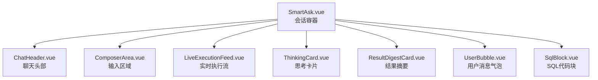
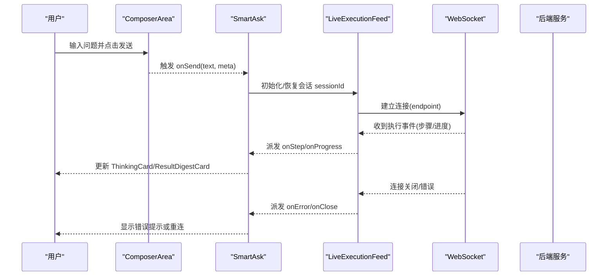
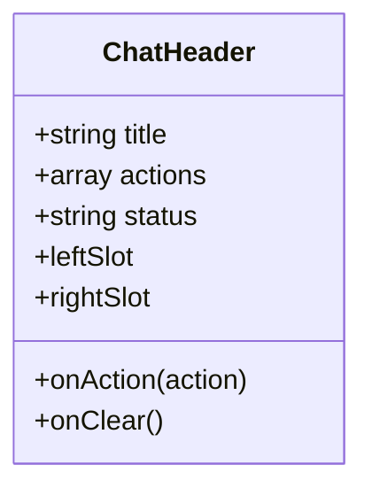
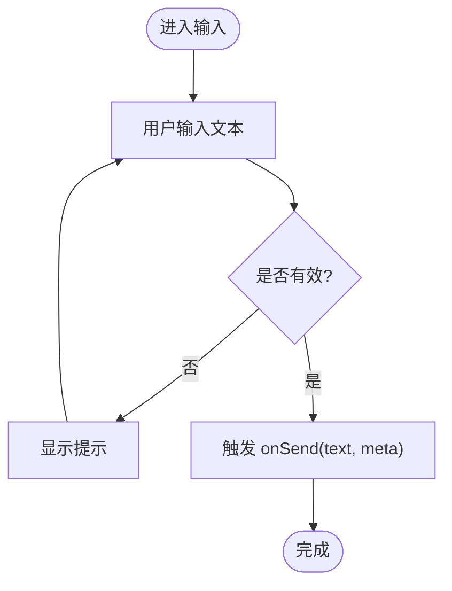
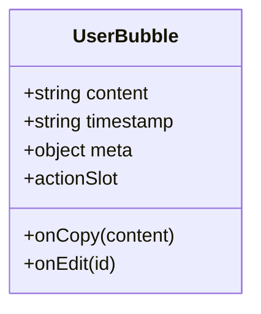
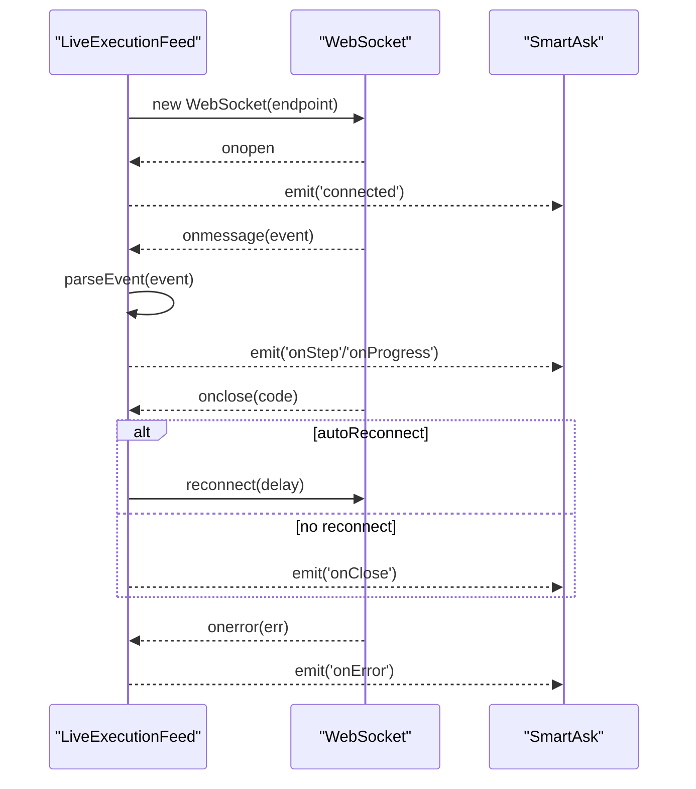
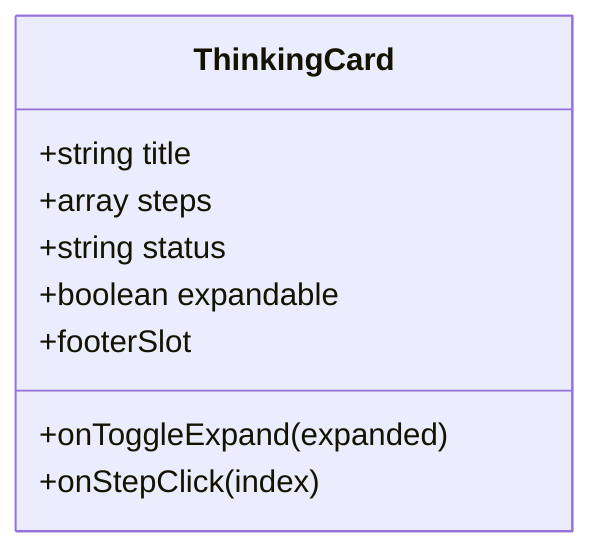
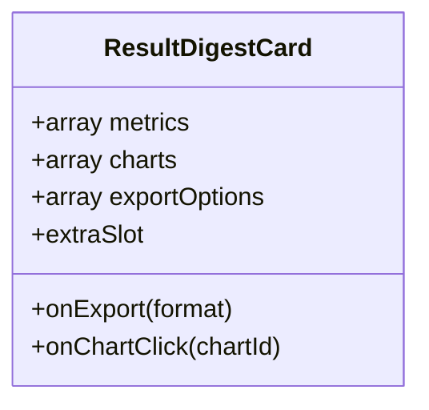
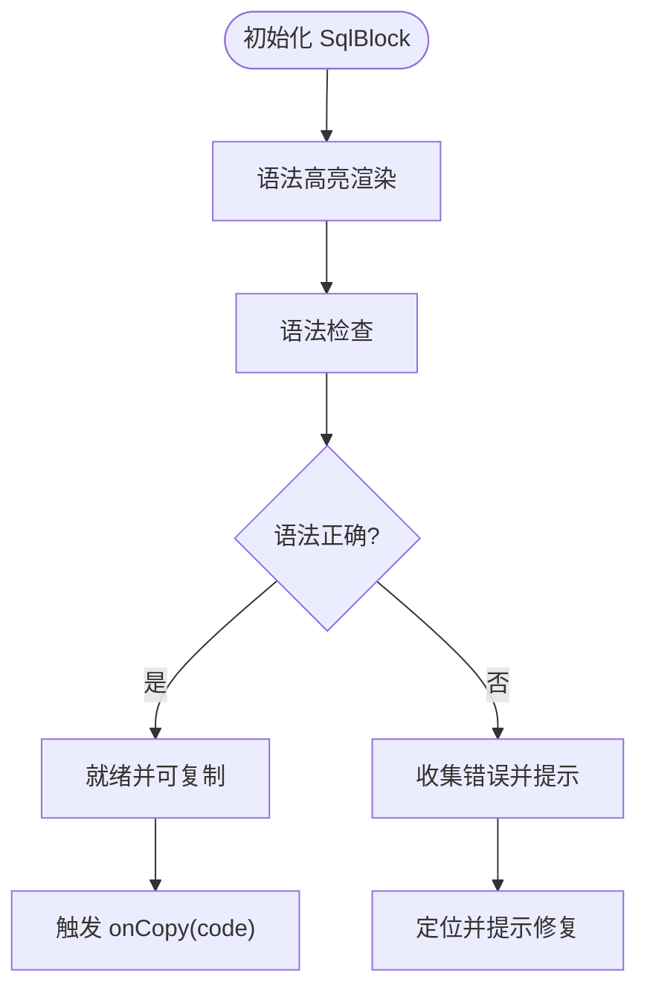
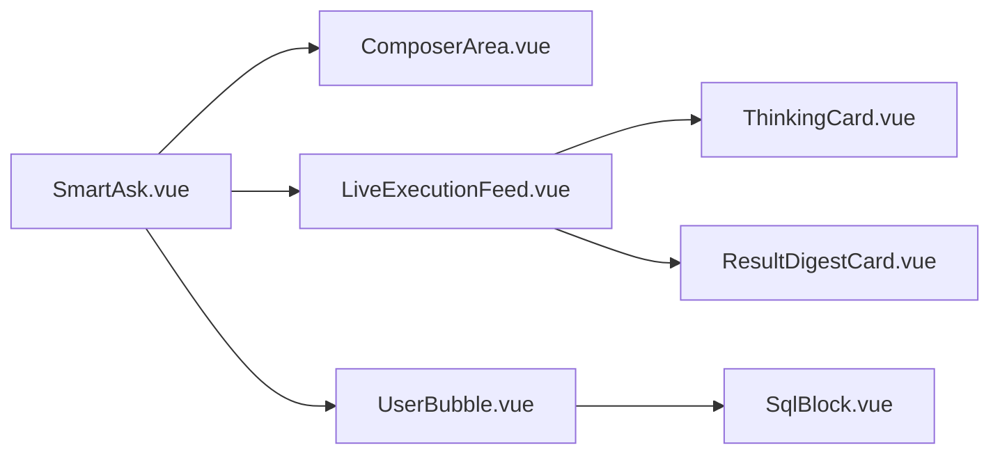

# 核心组件库

<cite>
**本文引用的文件**   
- [ChatHeader.vue](file://frontend/src/components/smartask/ChatHeader.vue)
- [ComposerArea.vue](file://frontend/src/components/smartask/ComposerArea.vue)
- [UserBubble.vue](file://frontend/src/components/smartask/UserBubble.vue)
- [LiveExecutionFeed.vue](file://frontend/src/components/smartask/LiveExecutionFeed.vue)
- [ThinkingCard.vue](file://frontend/src/components/smartask/ThinkingCard.vue)
- [ResultDigestCard.vue](file://frontend/src/components/smartask/ResultDigestCard.vue)
- [SqlBlock.vue](file://frontend/src/components/smartask/SqlBlock.vue)
- [SmartAsk.vue](file://frontend/src/views/SmartAsk.vue)
</cite>

## 目录
1. [简介](#简介)
2. [项目结构](#项目结构)
3. [核心组件](#核心组件)
4. [架构总览](#架构总览)
5. [详细组件分析](#详细组件分析)
6. [依赖关系分析](#依赖关系分析)
7. [性能考量](#性能考量)
8. [故障排查指南](#故障排查指南)
9. [结论](#结论)
10. [附录](#附录)

## 简介
本文件面向 SmartAsk 智能问数平台的前端核心 UI 组件，聚焦聊天界面与实时执行流相关组件的开发文档。内容覆盖 ChatHeader（聊天头部）、ComposerArea（输入区域）、UserBubble（用户消息气泡）的职责与交互；深入解析 LiveExecutionFeed（实时执行流）的 WebSocket 连接管理、消息流处理与进度状态更新；说明 ThinkingCard（思考卡片）与 ResultDigestCard（结果摘要）的数据绑定与渲染机制；并文档化 SqlBlock（SQL 代码块）的高亮、语法检查与复制功能实现。同时给出组件间通信模式（事件发射、属性传递、插槽使用）、复用规范（props 设计、事件命名、样式定制）以及最佳实践与示例路径。

## 项目结构
SmartAsk 前端采用 Vue 单文件组件组织方式，核心聊天与执行流组件位于 frontend/src/components/smartask 目录下，页面入口在 views/SmartAsk.vue 中组合使用这些组件。整体结构遵循“视图层组合 + 组件职责单一”的设计原则：
- 视图层：SmartAsk.vue 负责会话上下文、状态管理与子组件编排
- 组件层：ChatHeader、ComposerArea、UserBubble、LiveExecutionFeed、ThinkingCard、ResultDigestCard、SqlBlock 等各司其职
- 数据流：通过 props 自上而下传递，事件自下而上冒泡，必要时借助外部状态或可组合式函数进行跨组件共享

图表来源
- [SmartAsk.vue](file://frontend/src/views/SmartAsk.vue)
- [ChatHeader.vue](file://frontend/src/components/smartask/ChatHeader.vue)
- [ComposerArea.vue](file://frontend/src/components/smartask/ComposerArea.vue)
- [LiveExecutionFeed.vue](file://frontend/src/components/smartask/LiveExecutionFeed.vue)
- [ThinkingCard.vue](file://frontend/src/components/smartask/ThinkingCard.vue)
- [ResultDigestCard.vue](file://frontend/src/components/smartask/ResultDigestCard.vue)
- [UserBubble.vue](file://frontend/src/components/smartask/UserBubble.vue)
- [SqlBlock.vue](file://frontend/src/components/smartask/SqlBlock.vue)

章节来源
- [SmartAsk.vue](file://frontend/src/views/SmartAsk.vue)
- [ChatHeader.vue](file://frontend/src/components/smartask/ChatHeader.vue)
- [ComposerArea.vue](file://frontend/src/components/smartask/ComposerArea.vue)
- [LiveExecutionFeed.vue](file://frontend/src/components/smartask/LiveExecutionFeed.vue)
- [ThinkingCard.vue](file://frontend/src/components/smartask/ThinkingCard.vue)
- [ResultDigestCard.vue](file://frontend/src/components/smartask/ResultDigestCard.vue)
- [UserBubble.vue](file://frontend/src/components/smartask/UserBubble.vue)
- [SqlBlock.vue](file://frontend/src/components/smartask/SqlBlock.vue)

## 核心组件
本节概述各核心组件的职责边界与对外接口约定，便于快速定位与复用。

- ChatHeader（聊天头部）
  - 职责：展示会话标题、操作按钮（如新建会话、清空历史）、系统提示与状态指示
  - 关键 props：title、actions、status
  - 事件：onAction(action)、onClear()
  - 插槽：leftSlot、rightSlot 用于扩展头部内容

- ComposerArea（输入区域）
  - 职责：提供多行文本输入、快捷指令、发送按钮、附件上传占位
  - 关键 props：placeholder、disabled、maxLines
  - 事件：onSend(text, meta)、onClear()
  - 插槽：prepend、append 用于插入工具栏或快捷命令

- UserBubble（用户消息气泡）
  - 职责：渲染用户侧消息气泡，支持富文本与内嵌 SQL 片段
  - 关键 props：content、timestamp、meta
  - 事件：onCopy(content)、onEdit(id)
  - 插槽：actionSlot 用于附加操作按钮

- LiveExecutionFeed（实时执行流）
  - 职责：维护 WebSocket 连接、接收后端执行事件、驱动进度与步骤可视化
  - 关键 props：sessionId、endpoint、autoReconnect、reconnectDelay
  - 事件：onStep(step)、onProgress(progress)、onError(error)、onClose(code)
  - 内部状态：connected、steps[]、progress、error

- ThinkingCard（思考卡片）
  - 职责：展示推理过程、计划步骤、中间结论
  - 关键 props：title、steps、status、expandable
  - 事件：onToggleExpand(expanded)、onStepClick(index)
  - 插槽：footerSlot 用于附加操作

- ResultDigestCard（结果摘要）
  - 职责：汇总查询结果的关键指标、图表入口、导出入口
  - 关键 props：metrics、charts、exportOptions
  - 事件：onExport(format)、onChartClick(chartId)
  - 插槽：extraSlot 用于自定义摘要内容

- SqlBlock（SQL 代码块）
  - 职责：SQL 高亮显示、语法检查、一键复制、错误定位
  - 关键 props：code、language、showLineNumbers、readonly
  - 事件：onCopy(code)、onSyntaxError(errors)
  - 插槽：toolbarSlot 用于扩展工具栏

章节来源
- [ChatHeader.vue](file://frontend/src/components/smartask/ChatHeader.vue)
- [ComposerArea.vue](file://frontend/src/components/smartask/ComposerArea.vue)
- [UserBubble.vue](file://frontend/src/components/smartask/UserBubble.vue)
- [LiveExecutionFeed.vue](file://frontend/src/components/smartask/LiveExecutionFeed.vue)
- [ThinkingCard.vue](file://frontend/src/components/smartask/ThinkingCard.vue)
- [ResultDigestCard.vue](file://frontend/src/components/smartask/ResultDigestCard.vue)
- [SqlBlock.vue](file://frontend/src/components/smartask/SqlBlock.vue)

## 架构总览
SmartAsk 的聊天界面以 SmartAsk.vue 为容器，协调头部、输入区、消息气泡与执行流组件。LiveExecutionFeed 作为异步数据源，通过 WebSocket 将执行步骤与进度推送至 UI，ThinkingCard 与 ResultDigestCard 分别承载过程与结果信息，SqlBlock 提供 SQL 可视化能力。

图表来源
- [ComposerArea.vue](file://frontend/src/components/smartask/ComposerArea.vue)
- [SmartAsk.vue](file://frontend/src/views/SmartAsk.vue)
- [LiveExecutionFeed.vue](file://frontend/src/components/smartask/LiveExecutionFeed.vue)

章节来源
- [SmartAsk.vue](file://frontend/src/views/SmartAsk.vue)
- [LiveExecutionFeed.vue](file://frontend/src/components/smartask/LiveExecutionFeed.vue)

## 详细组件分析

### ChatHeader（聊天头部）
- 职责与交互
  - 展示会话标题与状态，提供新建会话、清空历史等操作
  - 支持左右插槽扩展，适配不同场景的工具栏
- 关键 props
  - title：会话标题
  - actions：动作列表（图标、文案、回调）
  - status：状态标识（如加载中、已连接）
- 事件
  - onAction：统一动作回调
  - onClear：清空历史确认
- 插槽
  - leftSlot/rightSlot：扩展头部左侧/右侧内容

图表来源
- [ChatHeader.vue](file://frontend/src/components/smartask/ChatHeader.vue)

章节来源
- [ChatHeader.vue](file://frontend/src/components/smartask/ChatHeader.vue)

### ComposerArea（输入区域）
- 职责与交互
  - 多行文本输入、自动增高、快捷键发送
  - 支持 prepend/append 插槽插入快捷命令或附件选择器
- 关键 props
  - placeholder：占位文案
  - disabled：禁用输入
  - maxLines：最大行数
- 事件
  - onSend：提交文本与元数据
  - onClear：清空输入

图表来源
- [ComposerArea.vue](file://frontend/src/components/smartask/ComposerArea.vue)

章节来源
- [ComposerArea.vue](file://frontend/src/components/smartask/ComposerArea.vue)

### UserBubble（用户消息气泡）
- 职责与交互
  - 渲染用户消息内容，支持富文本与内嵌 SQL 片段
  - 提供复制与编辑入口
- 关键 props
  - content：消息内容
  - timestamp：时间戳
  - meta：扩展元数据（如消息类型、ID）
- 事件
  - onCopy：复制内容
  - onEdit：编辑消息

图表来源
- [UserBubble.vue](file://frontend/src/components/smartask/UserBubble.vue)

章节来源
- [UserBubble.vue](file://frontend/src/components/smartask/UserBubble.vue)

### LiveExecutionFeed（实时执行流）
- 职责与交互
  - 管理 WebSocket 生命周期（连接、心跳、断线重连）
  - 解析后端事件流（步骤、进度、错误），驱动 UI 更新
  - 暴露标准化事件供父组件消费
- 关键 props
  - sessionId：会话标识
  - endpoint：WebSocket 地址
  - autoReconnect：是否自动重连
  - reconnectDelay：重连延迟
- 事件
  - onStep：步骤变更
  - onProgress：进度更新
  - onError：错误事件
  - onClose：连接关闭
- 内部状态
  - connected：连接状态
  - steps：步骤数组
  - progress：当前进度
  - error：错误信息

图表来源
- [LiveExecutionFeed.vue](file://frontend/src/components/smartask/LiveExecutionFeed.vue)

章节来源
- [LiveExecutionFeed.vue](file://frontend/src/components/smartask/LiveExecutionFeed.vue)

### ThinkingCard（思考卡片）
- 职责与交互
  - 展示推理步骤与中间结论，支持展开/折叠
  - 允许点击步骤跳转或查看详情
- 关键 props
  - title：卡片标题
  - steps：步骤列表（含标题、内容、状态）
  - status：整体状态（进行中、已完成、失败）
  - expandable：是否可展开
- 事件
  - onToggleExpand：切换展开状态
  - onStepClick：步骤点击回调

图表来源
- [ThinkingCard.vue](file://frontend/src/components/smartask/ThinkingCard.vue)

章节来源
- [ThinkingCard.vue](file://frontend/src/components/smartask/ThinkingCard.vue)

### ResultDigestCard（结果摘要）
- 职责与交互
  - 汇总关键指标、图表入口、导出选项
  - 支持额外插槽扩展摘要内容
- 关键 props
  - metrics：指标集合（名称、值、单位）
  - charts：图表配置（id、标题、类型）
  - exportOptions：导出格式选项
- 事件
  - onExport：导出触发
  - onChartClick：图表点击回调

图表来源
- [ResultDigestCard.vue](file://frontend/src/components/smartask/ResultDigestCard.vue)

章节来源
- [ResultDigestCard.vue](file://frontend/src/components/smartask/ResultDigestCard.vue)

### SqlBlock（SQL 代码块）
- 职责与交互
  - SQL 高亮显示、语法检查、错误定位
  - 一键复制代码、可选行号显示
- 关键 props
  - code：SQL 文本
  - language：语言标识（sql）
  - showLineNumbers：是否显示行号
  - readonly：只读模式
- 事件
  - onCopy：复制成功回调
  - onSyntaxError：语法错误回调（包含错误位置与描述）
- 插槽
  - toolbarSlot：扩展工具栏（如格式化、校验）

图表来源
- [SqlBlock.vue](file://frontend/src/components/smartask/SqlBlock.vue)

章节来源
- [SqlBlock.vue](file://frontend/src/components/smartask/SqlBlock.vue)

## 依赖关系分析
组件间的依赖主要体现在数据流向与事件通信上：
- SmartAsk.vue 作为容器，持有会话状态并编排子组件
- ComposerArea 向 SmartAsk 发送 onSend 事件
- LiveExecutionFeed 通过 WebSocket 接收事件并向上派发 onStep/onProgress/onError/onClose
- ThinkingCard 与 ResultDigestCard 消费 LiveExecutionFeed 的事件，呈现过程与结果
- SqlBlock 被嵌入到消息气泡或执行流步骤中，提供 SQL 可视化能力

图表来源
- [SmartAsk.vue](file://frontend/src/views/SmartAsk.vue)
- [ComposerArea.vue](file://frontend/src/components/smartask/ComposerArea.vue)
- [LiveExecutionFeed.vue](file://frontend/src/components/smartask/LiveExecutionFeed.vue)
- [ThinkingCard.vue](file://frontend/src/components/smartask/ThinkingCard.vue)
- [ResultDigestCard.vue](file://frontend/src/components/smartask/ResultDigestCard.vue)
- [UserBubble.vue](file://frontend/src/components/smartask/UserBubble.vue)
- [SqlBlock.vue](file://frontend/src/components/smartask/SqlBlock.vue)

章节来源
- [SmartAsk.vue](file://frontend/src/views/SmartAsk.vue)
- [LiveExecutionFeed.vue](file://frontend/src/components/smartask/LiveExecutionFeed.vue)

## 性能考量
- WebSocket 连接管理
  - 合理设置心跳与重连策略，避免频繁重连导致雪崩
  - 对事件进行节流与去抖，减少不必要的 UI 重渲染
- 渲染优化
  - 大列表虚拟滚动（如执行步骤较多时）
  - 按需加载 SqlBlock 高亮模块，降低首屏体积
- 内存管理
  - 及时清理 WebSocket 监听器与定时器
  - 组件销毁时释放资源（如取消订阅）

[本节为通用指导，不直接分析具体文件]

## 故障排查指南
- WebSocket 连接失败
  - 检查 endpoint 是否正确、网络可达性与鉴权参数
  - 查看 LiveExecutionFeed 的 onError 事件日志
- 执行流中断
  - 观察 onclose 事件码，区分正常关闭与服务端异常
  - 启用 autoReconnect 并验证重连逻辑
- SQL 语法错误
  - 关注 SqlBlock 的 onSyntaxError 回调，定位错误位置
  - 结合后端返回的错误信息进行修正
- 输入区无响应
  - 检查 ComposerArea 的 disabled 状态与 onSend 事件是否触发
  - 确认父组件是否正确处理 onSend

章节来源
- [LiveExecutionFeed.vue](file://frontend/src/components/smartask/LiveExecutionFeed.vue)
- [SqlBlock.vue](file://frontend/src/components/smartask/SqlBlock.vue)
- [ComposerArea.vue](file://frontend/src/components/smartask/ComposerArea.vue)

## 结论
SmartAsk 的核心 UI 组件围绕聊天与执行流构建，职责清晰、接口规范、通信模式一致。通过标准化的 props、事件与插槽设计，组件具备良好的可复用性与可扩展性。LiveExecutionFeed 作为异步数据中枢，确保执行过程的实时可视化；ThinkingCard 与 ResultDigestCard 分别承载过程与结果信息；SqlBlock 提供强大的 SQL 可视化能力。建议在实际使用中遵循本文档的复用规范与最佳实践，以提升开发效率与用户体验。

[本节为总结性内容，不直接分析具体文件]

## 附录
- 组件复用指南
  - props 设计规范：明确类型、默认值与必填项，避免过度耦合
  - 事件命名约定：使用 onXxx 形式，语义清晰且可预测
  - 插槽使用：优先使用具名插槽扩展行为，保持组件内核稳定
  - 样式定制：通过 CSS 变量或主题类名覆盖，避免内联样式
- 使用示例路径
  - 聊天头部：参考 [ChatHeader.vue](file://frontend/src/components/smartask/ChatHeader.vue)
  - 输入区域：参考 [ComposerArea.vue](file://frontend/src/components/smartask/ComposerArea.vue)
  - 用户消息气泡：参考 [UserBubble.vue](file://frontend/src/components/smartask/UserBubble.vue)
  - 实时执行流：参考 [LiveExecutionFeed.vue](file://frontend/src/components/smartask/LiveExecutionFeed.vue)
  - 思考卡片：参考 [ThinkingCard.vue](file://frontend/src/components/smartask/ThinkingCard.vue)
  - 结果摘要：参考 [ResultDigestCard.vue](file://frontend/src/components/smartask/ResultDigestCard.vue)
  - SQL 代码块：参考 [SqlBlock.vue](file://frontend/src/components/smartask/SqlBlock.vue)
  - 页面集成：参考 [SmartAsk.vue](file://frontend/src/views/SmartAsk.vue)