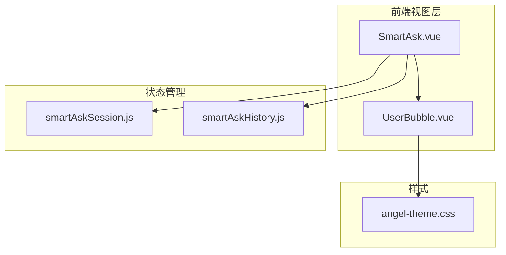
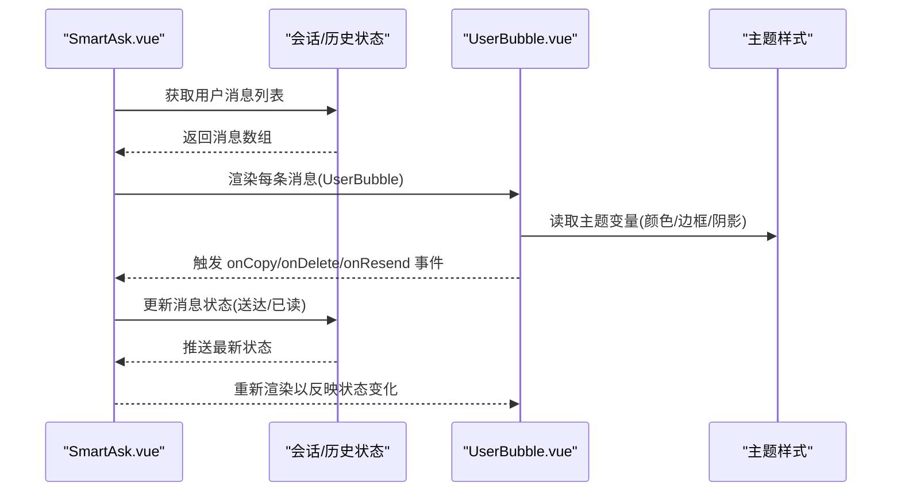
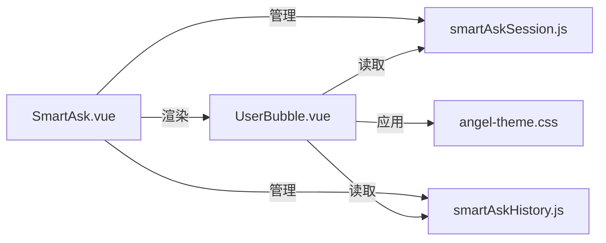

# 用户消息气泡组件 (UserBubble)

<cite>
**本文档引用的文件**   
- [UserBubble.vue](file://frontend/src/components/smartask/UserBubble.vue)
- [SmartAsk.vue](file://frontend/src/views/SmartAsk.vue)
- [smartAskSession.js](file://frontend/src/state/smartAskSession.js)
- [smartAskHistory.js](file://frontend/src/state/smartAskHistory.js)
- [angel-theme.css](file://frontend/src/styles/angel-theme.css)
</cite>

## 目录
1. [简介](#简介)
2. [项目结构](#项目结构)
3. [核心组件](#核心组件)
4. [架构总览](#架构总览)
5. [详细组件分析](#详细组件分析)
6. [依赖分析](#依赖分析)
7. [性能考虑](#性能考虑)
8. [故障排查指南](#故障排查指南)
9. [结论](#结论)
10. [附录](#附录)

## 简介
本文件为 UserBubble 用户消息气泡组件的开发文档。该组件用于展示用户发送的消息内容，涵盖文本渲染、图片显示与文件附件处理；同时提供消息状态管理（发送中、已送达、已读）的视觉反馈，以及复制、删除确认、重新发送等交互能力。文档还包含响应式设计策略、样式定制选项、使用示例与扩展方法，帮助开发者快速集成并自定义该组件。

## 项目结构
UserBubble 位于前端 Vue 组件目录 smartask 下，作为聊天界面中的用户消息气泡。其数据来源于会话与历史状态模块，样式由主题 CSS 统一管理。

图表来源
- [SmartAsk.vue](file://frontend/src/views/SmartAsk.vue)
- [UserBubble.vue](file://frontend/src/components/smartask/UserBubble.vue)
- [smartAskSession.js](file://frontend/src/state/smartAskSession.js)
- [smartAskHistory.js](file://frontend/src/state/smartAskHistory.js)
- [angel-theme.css](file://frontend/src/styles/angel-theme.css)

章节来源
- [UserBubble.vue](file://frontend/src/components/smartask/UserBubble.vue)
- [SmartAsk.vue](file://frontend/src/views/SmartAsk.vue)
- [smartAskSession.js](file://frontend/src/state/smartAskSession.js)
- [smartAskHistory.js](file://frontend/src/state/smartAskHistory.js)
- [angel-theme.css](file://frontend/src/styles/angel-theme.css)

## 核心组件
- 组件职责
  - 渲染用户消息：支持纯文本、富文本片段、图片与文件附件。
  - 状态可视化：根据消息状态（发送中、已送达、已读）显示不同视觉提示。
  - 交互操作：支持复制消息内容、删除确认、失败或超时消息的重新发送。
  - 响应式布局：适配移动端与桌面端，自动调整气泡宽度、字体大小与附件预览尺寸。
  - 可定制样式：通过主题变量控制气泡颜色、边框、阴影与间距。

- 关键输入属性（Props）
  - 消息数据对象：包含 id、content、type（文本/图片/文件）、status（pending/delivered/read）、createdAt、updatedAt、error 等字段。
  - 行为回调：onCopy、onDelete、onResend、onPreviewImage、onOpenFile 等。
  - 展示开关：showStatus、showActions、showAvatar、showTimestamp。

- 内部状态与计算
  - 格式化时间戳、是否显示操作按钮、是否显示状态指示器、图片加载状态、附件下载链接生成等。

章节来源
- [UserBubble.vue](file://frontend/src/components/smartask/UserBubble.vue)

## 架构总览
UserBubble 在 SmartAsk 视图中被渲染，读取会话与历史状态中的数据，并通过事件向父组件回传用户操作。主题样式统一由 CSS 变量驱动，确保一致的视觉风格。

图表来源
- [SmartAsk.vue](file://frontend/src/views/SmartAsk.vue)
- [UserBubble.vue](file://frontend/src/components/smartask/UserBubble.vue)
- [smartAskSession.js](file://frontend/src/state/smartAskSession.js)
- [smartAskHistory.js](file://frontend/src/state/smartAskHistory.js)
- [angel-theme.css](file://frontend/src/styles/angel-theme.css)

## 详细组件分析

### 文本渲染
- 支持多行文本、换行保留、基础富文本标签渲染。
- 长文本自动折叠与展开，避免气泡过大影响布局。
- 安全过滤：对不可信内容进行转义，防止 XSS。

章节来源
- [UserBubble.vue](file://frontend/src/components/smartask/UserBubble.vue)

### 图片显示
- 支持本地与远程图片 URL，懒加载与占位图。
- 点击预览大图，支持缩放与关闭。
- 自适应尺寸：在小屏设备上限制最大宽度，保持可读性。

章节来源
- [UserBubble.vue](file://frontend/src/components/smartask/UserBubble.vue)

### 文件附件处理
- 支持常见文件类型（PDF、Word、Excel、图片等）。
- 显示文件名、大小、类型图标，提供下载与在线预览入口。
- 大文件分片下载与进度提示（可选）。

章节来源
- [UserBubble.vue](file://frontend/src/components/smartask/UserBubble.vue)

### 消息状态管理
- 状态定义
  - 发送中（pending）：显示旋转指示器与“正在发送”文案。
  - 已送达（delivered）：显示双勾或“已送达”标识。
  - 已读（read）：显示已读标记或高亮。
- 状态流转
  - 发送成功：pending → delivered → read（服务端回执后）。
  - 发送失败：pending → error（显示错误提示与重试按钮）。
- 视觉反馈
  - 通过主题变量控制状态颜色与图标。
  - 动画过渡提升用户体验。

章节来源
- [UserBubble.vue](file://frontend/src/components/smartask/UserBubble.vue)
- [smartAskSession.js](file://frontend/src/state/smartAskSession.js)
- [smartAskHistory.js](file://frontend/src/state/smartAskHistory.js)

### 交互功能实现
- 复制消息
  - 一键复制文本内容到剪贴板，提供成功提示。
  - 支持选择复制范围（仅正文/含附件信息）。
- 删除确认
  - 二次确认弹窗，防止误删。
  - 删除后从列表中移除，并同步至后端（可选）。
- 重新发送
  - 针对失败或超时的消息，提供重试入口。
  - 重试时保留原内容与附件，避免重复上传。

章节来源
- [UserBubble.vue](file://frontend/src/components/smartask/UserBubble.vue)

### 响应式设计处理
- 移动端适配
  - 小屏幕下气泡宽度自适应，字体与间距缩小。
  - 图片与附件预览采用全屏模式。
- 屏幕尺寸自适应
  - 使用媒体查询与弹性布局，确保在不同设备上的可用性。
  - 横竖屏切换时重新计算布局。

章节来源
- [UserBubble.vue](file://frontend/src/components/smartask/UserBubble.vue)
- [angel-theme.css](file://frontend/src/styles/angel-theme.css)

### 样式定制选项
- 气泡颜色
  - 背景色、文字色、边框色可通过主题变量覆盖。
- 边框样式
  - 圆角半径、边框宽度与样式（实线/虚线）。
- 阴影效果
  - 投影强度与偏移量，增强层次感。
- 间距与排版
  - 内边距、行高、字重与字体族。

章节来源
- [angel-theme.css](file://frontend/src/styles/angel-theme.css)
- [UserBubble.vue](file://frontend/src/components/smartask/UserBubble.vue)

### 使用示例
- 基本用法
  - 在 SmartAsk 视图中引入 UserBubble，传入消息数据与回调函数。
- 高级配置
  - 启用状态显示、操作按钮、头像与时间戳。
  - 自定义主题变量以匹配品牌风格。

章节来源
- [SmartAsk.vue](file://frontend/src/views/SmartAsk.vue)
- [UserBubble.vue](file://frontend/src/components/smartask/UserBubble.vue)

### 扩展方法
- 新增消息类型
  - 扩展 type 字段，添加新渲染逻辑与预览方式。
- 自定义交互
  - 注入新的回调函数，如分享、收藏、举报等。
- 国际化支持
  - 将文案抽离为语言包，支持多语言切换。

章节来源
- [UserBubble.vue](file://frontend/src/components/smartask/UserBubble.vue)

## 依赖分析
UserBubble 依赖会话与历史状态模块进行数据绑定，受主题样式影响。与 SmartAsk 视图存在父子关系，通过事件通信。

图表来源
- [UserBubble.vue](file://frontend/src/components/smartask/UserBubble.vue)
- [smartAskSession.js](file://frontend/src/state/smartAskSession.js)
- [smartAskHistory.js](file://frontend/src/state/smartAskHistory.js)
- [angel-theme.css](file://frontend/src/styles/angel-theme.css)
- [SmartAsk.vue](file://frontend/src/views/SmartAsk.vue)

章节来源
- [UserBubble.vue](file://frontend/src/components/smartask/UserBubble.vue)
- [smartAskSession.js](file://frontend/src/state/smartAskSession.js)
- [smartAskHistory.js](file://frontend/src/state/smartAskHistory.js)
- [angel-theme.css](file://frontend/src/styles/angel-theme.css)
- [SmartAsk.vue](file://frontend/src/views/SmartAsk.vue)

## 性能考虑
- 虚拟滚动：当消息数量较大时，建议使用虚拟列表减少 DOM 节点。
- 图片懒加载：延迟加载非首屏图片，降低初始渲染压力。
- 防抖与节流：对频繁操作（如复制、搜索）进行优化。
- 内存管理：及时释放图片与文件预览的资源引用。

[本节为通用指导，无需特定文件来源]

## 故障排查指南
- 常见问题
  - 图片无法加载：检查 URL 有效性、跨域设置与网络权限。
  - 文件下载失败：验证服务器路径、权限与 MIME 类型。
  - 状态不更新：确认后端回执与状态同步逻辑。
- 调试技巧
  - 使用浏览器开发者工具查看网络请求与组件状态。
  - 打印日志定位问题发生位置。
  - 逐步禁用功能模块隔离问题。

章节来源
- [UserBubble.vue](file://frontend/src/components/smartask/UserBubble.vue)
- [smartAskSession.js](file://frontend/src/state/smartAskSession.js)
- [smartAskHistory.js](file://frontend/src/state/smartAskHistory.js)

## 结论
UserBubble 组件提供了完整的用户消息展示与交互能力，涵盖文本、图片、文件等多种内容类型，并支持丰富的状态管理与响应式布局。通过主题定制与扩展方法，开发者可以轻松适配不同业务场景与品牌风格。建议在实际使用中结合性能优化与故障排查策略，确保稳定可靠的体验。

[本节为总结性内容，无需特定文件来源]

## 附录
- 术语表
  - 气泡：消息容器，用于包裹文本、图片与附件。
  - 状态：消息生命周期中的不同阶段（发送中、已送达、已读）。
  - 主题：统一的样式变量集合，控制视觉表现。
- 参考链接
  - Vue 官方文档：组件开发与事件通信。
  - CSS 主题变量：动态样式定制最佳实践。

[本节为补充信息，无需特定文件来源]