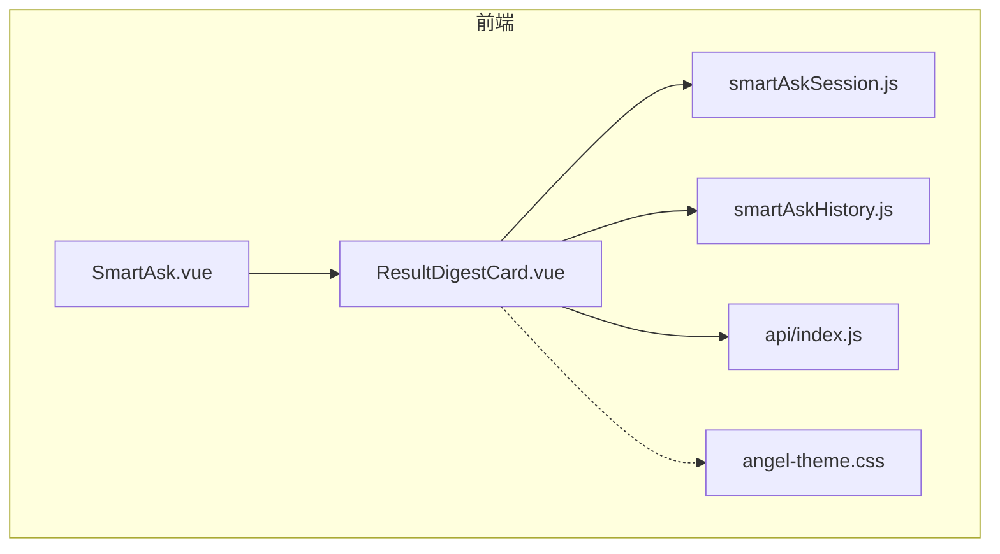
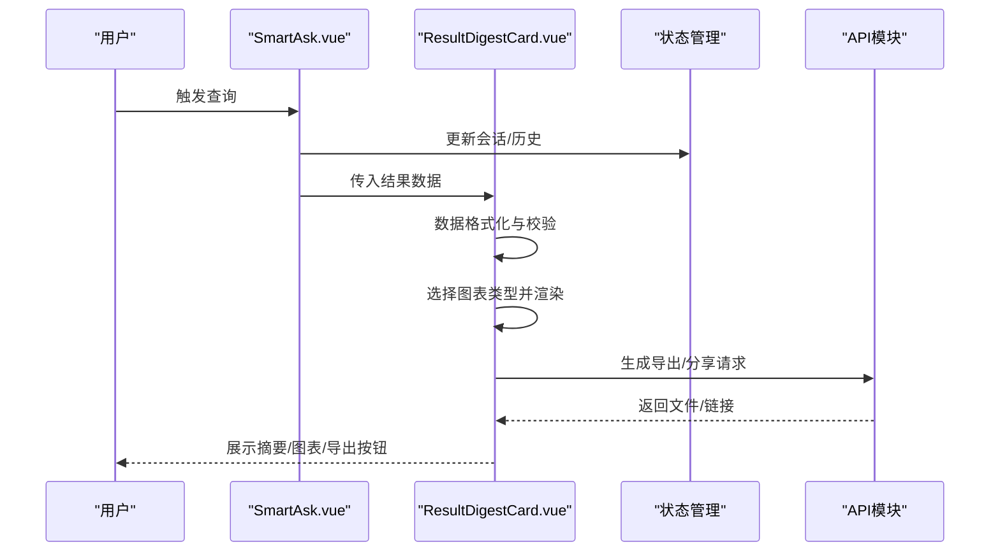
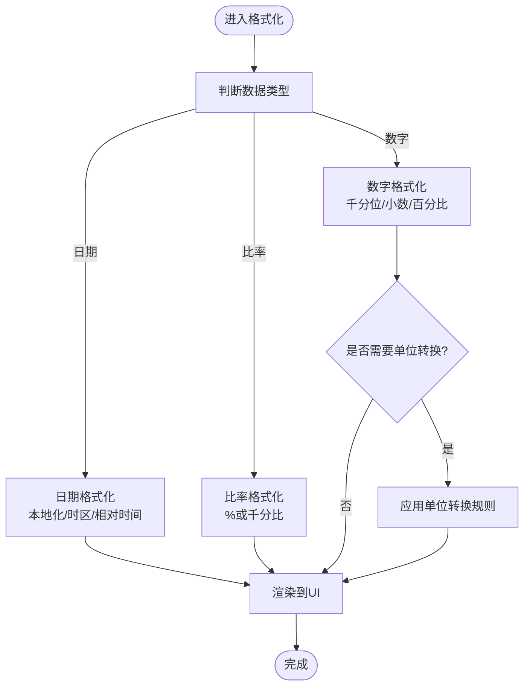
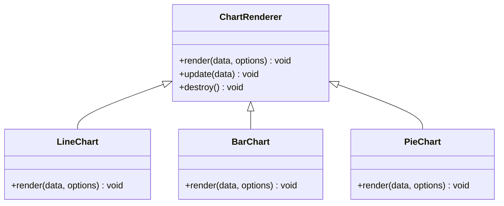
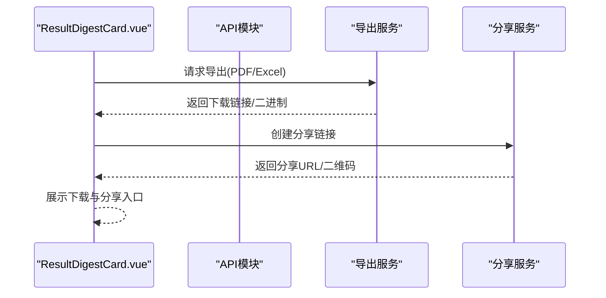
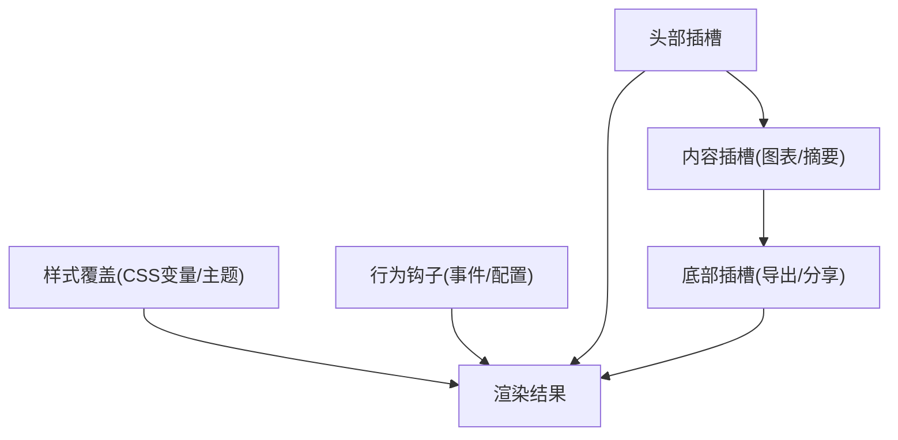
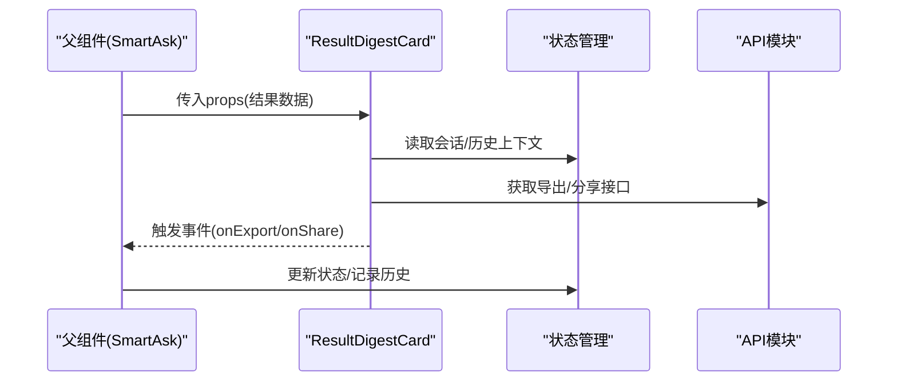
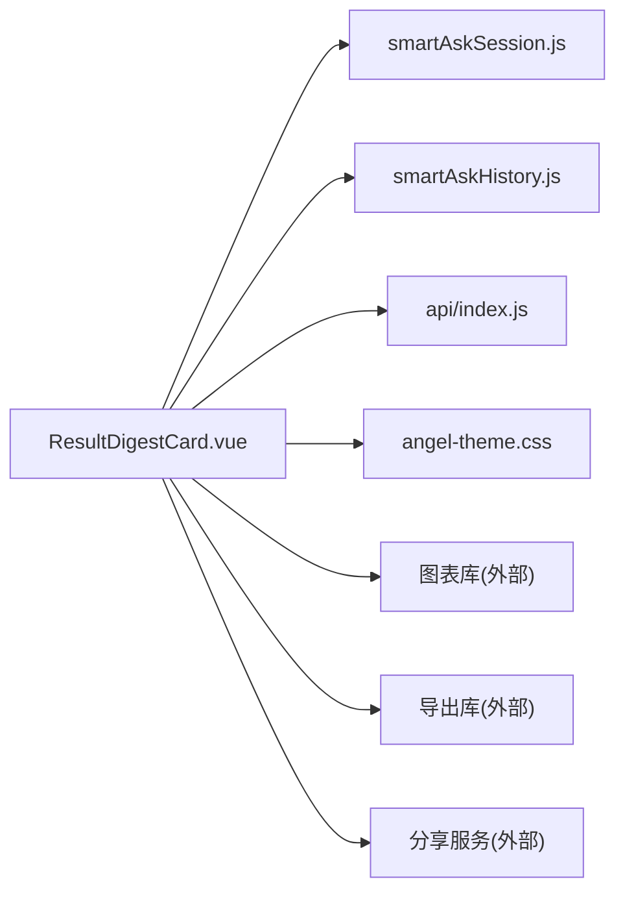

# 结果摘要组件 (ResultDigestCard)

<cite>
**本文档引用的文件**   
- [ResultDigestCard.vue](file://frontend/src/components/smartask/ResultDigestCard.vue)
- [SmartAsk.vue](file://frontend/src/views/SmartAsk.vue)
- [smartAskSession.js](file://frontend/src/state/smartAskSession.js)
- [smartAskHistory.js](file://frontend/src/state/smartAskHistory.js)
- [index.js](file://frontend/src/api/index.js)
- [angel-theme.css](file://frontend/src/styles/angel-theme.css)
</cite>

## 目录
1. [简介](#简介)
2. [项目结构](#项目结构)
3. [核心组件](#核心组件)
4. [架构总览](#架构总览)
5. [详细组件分析](#详细组件分析)
6. [依赖分析](#依赖分析)
7. [性能考虑](#性能考虑)
8. [故障排查指南](#故障排查指南)
9. [结论](#结论)
10. [附录](#附录)

## 简介
本文件为 ResultDigestCard 结果摘要组件的全面开发文档。该组件用于展示智能问数的最终结果，包括数据摘要、图表预览、导出选项与分享能力。文档覆盖：
- 数据格式化逻辑（数字、日期、单位转换）
- 图表渲染机制（类型、数据绑定、交互）
- 导出功能（PDF、Excel、分享链接）
- 自定义模板支持（插槽扩展、样式覆盖、行为定制）
- 使用示例与集成指南

## 项目结构
ResultDigestCard 位于前端 Vue 组件目录中，由上层视图 SmartAsk 调用，并通过状态管理与 API 模块进行数据交互与持久化。

**图示来源**
- [SmartAsk.vue](file://frontend/src/views/SmartAsk.vue)
- [ResultDigestCard.vue](file://frontend/src/components/smartask/ResultDigestCard.vue)
- [smartAskSession.js](file://frontend/src/state/smartAskSession.js)
- [smartAskHistory.js](file://frontend/src/state/smartAskHistory.js)
- [index.js](file://frontend/src/api/index.js)
- [angel-theme.css](file://frontend/src/styles/angel-theme.css)

**章节来源**
- [ResultDigestCard.vue](file://frontend/src/components/smartask/ResultDigestCard.vue)
- [SmartAsk.vue](file://frontend/src/views/SmartAsk.vue)
- [smartAskSession.js](file://frontend/src/state/smartAskSession.js)
- [smartAskHistory.js](file://frontend/src/state/smartAskHistory.js)
- [index.js](file://frontend/src/api/index.js)
- [angel-theme.css](file://frontend/src/styles/angel-theme.css)

## 核心组件
ResultDigestCard 负责将后端返回的智能问数结果以“摘要 + 图表 + 操作”的形式呈现，并提供导出与分享入口。其职责边界包括：
- 接收并校验结果数据模型
- 执行数据格式化（数值、日期、单位）
- 渲染图表（按类型选择渲染器）
- 提供导出与分享操作
- 暴露插槽与样式钩子供外部定制

**章节来源**
- [ResultDigestCard.vue](file://frontend/src/components/smartask/ResultDigestCard.vue)

## 架构总览
ResultDigestCard 在整体应用中的位置如下：
- 输入：来自会话状态或历史记录的结果对象
- 处理：数据格式化、图表适配、导出准备
- 输出：可视化摘要、可下载文件、分享链接

**图示来源**
- [SmartAsk.vue](file://frontend/src/views/SmartAsk.vue)
- [ResultDigestCard.vue](file://frontend/src/components/smartask/ResultDigestCard.vue)
- [smartAskSession.js](file://frontend/src/state/smartAskSession.js)
- [smartAskHistory.js](file://frontend/src/state/smartAskHistory.js)
- [index.js](file://frontend/src/api/index.js)

## 详细组件分析

### 数据模型与格式化
- 数据模型
  - 字段包含：标题、描述、指标集合、时间维度、图表类型、原始数据等
  - 校验策略：必填字段检查、数据类型校验、范围约束
- 数字格式化
  - 千分位、小数位数、百分比、货币符号
  - 动态精度控制（根据量级自动调整）
- 日期处理
  - 本地化格式、时区处理、相对时间显示
- 单位转换
  - 金额（元/万元）、数量（个/万件）、比率（% / 千分比）
  - 单位后缀与阈值判断

**图示来源**
- [ResultDigestCard.vue](file://frontend/src/components/smartask/ResultDigestCard.vue)

**章节来源**
- [ResultDigestCard.vue](file://frontend/src/components/smartask/ResultDigestCard.vue)

### 图表渲染机制
- 支持的图表类型
  - 折线图、柱状图、饼图、面积图、散点图等
- 数据绑定方式
  - 字段映射（x/y/series/group）
  - 聚合策略（sum/count/avg/max/min）
  - 过滤与排序（维度筛选、时间窗口）
- 交互功能
  - 缩放、平移、图例切换、工具提示、点击钻取
  - 响应式布局与主题适配

**图示来源**
- [ResultDigestCard.vue](file://frontend/src/components/smartask/ResultDigestCard.vue)

**章节来源**
- [ResultDigestCard.vue](file://frontend/src/components/smartask/ResultDigestCard.vue)

### 导出与分享
- PDF 生成
  - 基于页面快照或专用模板生成
  - 分页、页眉页脚、水印、分辨率控制
- Excel 导出
  - 多工作表、样式、公式、冻结窗格
  - 大数据量流式写入与内存优化
- 分享链接创建
  - 生成一次性访问令牌
  - 权限控制与有效期设置
  - 短链与二维码生成

**图示来源**
- [ResultDigestCard.vue](file://frontend/src/components/smartask/ResultDigestCard.vue)
- [index.js](file://frontend/src/api/index.js)

**章节来源**
- [ResultDigestCard.vue](file://frontend/src/components/smartask/ResultDigestCard.vue)
- [index.js](file://frontend/src/api/index.js)

### 自定义模板与扩展
- 插槽扩展
  - 头部插槽：标题、描述、操作按钮
  - 内容插槽：图表容器、摘要卡片
  - 底部插槽：导出、分享、备注
- 样式覆盖
  - CSS 变量与主题类名
  - 响应式断点与暗黑模式
- 行为定制
  - 事件钩子（onRender、onExport、onShare）
  - 配置项注入（默认图表类型、格式化规则）

**图示来源**
- [ResultDigestCard.vue](file://frontend/src/components/smartask/ResultDigestCard.vue)
- [angel-theme.css](file://frontend/src/styles/angel-theme.css)

**章节来源**
- [ResultDigestCard.vue](file://frontend/src/components/smartask/ResultDigestCard.vue)
- [angel-theme.css](file://frontend/src/styles/angel-theme.css)

### 使用示例与集成指南
- 基础用法
  - 在父组件中引入并传入结果数据
  - 监听导出与分享事件
- 高级用法
  - 自定义插槽与样式
  - 替换图表渲染器或导出实现
- 集成步骤
  - 注册组件与依赖
  - 配置主题与语言
  - 接入状态管理与 API

**图示来源**
- [SmartAsk.vue](file://frontend/src/views/SmartAsk.vue)
- [ResultDigestCard.vue](file://frontend/src/components/smartask/ResultDigestCard.vue)
- [smartAskSession.js](file://frontend/src/state/smartAskSession.js)
- [smartAskHistory.js](file://frontend/src/state/smartAskHistory.js)
- [index.js](file://frontend/src/api/index.js)

**章节来源**
- [SmartAsk.vue](file://frontend/src/views/SmartAsk.vue)
- [ResultDigestCard.vue](file://frontend/src/components/smartask/ResultDigestCard.vue)
- [smartAskSession.js](file://frontend/src/state/smartAskSession.js)
- [smartAskHistory.js](file://frontend/src/state/smartAskHistory.js)
- [index.js](file://frontend/src/api/index.js)

## 依赖分析
ResultDigestCard 的依赖关系如下：
- 内部依赖：状态管理（会话/历史）、API 模块、样式主题
- 外部依赖：图表库、导出库、分享服务
- 耦合度：低耦合（通过 props/events 通信），高内聚（格式化/渲染/导出逻辑集中）

**图示来源**
- [ResultDigestCard.vue](file://frontend/src/components/smartask/ResultDigestCard.vue)
- [smartAskSession.js](file://frontend/src/state/smartAskSession.js)
- [smartAskHistory.js](file://frontend/src/state/smartAskHistory.js)
- [index.js](file://frontend/src/api/index.js)
- [angel-theme.css](file://frontend/src/styles/angel-theme.css)

**章节来源**
- [ResultDigestCard.vue](file://frontend/src/components/smartask/ResultDigestCard.vue)
- [smartAskSession.js](file://frontend/src/state/smartAskSession.js)
- [smartAskHistory.js](file://frontend/src/state/smartAskHistory.js)
- [index.js](file://frontend/src/api/index.js)
- [angel-theme.css](file://frontend/src/styles/angel-theme.css)

## 性能考虑
- 数据格式化
  - 延迟计算与缓存（避免重复格式化）
  - 增量更新（仅重算变化字段）
- 图表渲染
  - 虚拟滚动与按需渲染
  - 大数据集采样与聚合
  - 防抖/节流交互事件
- 导出与分享
  - 异步任务与进度反馈
  - 流式写入与内存限制
  - 链接缓存与去重

[本节为通用指导，不直接分析具体文件]

## 故障排查指南
- 常见问题
  - 数据为空或格式错误：检查 props 校验与默认值
  - 图表不显示：确认图表库初始化与数据绑定
  - 导出失败：检查权限与文件大小限制
  - 分享链接无效：验证令牌有效期与权限
- 调试技巧
  - 启用日志与错误上报
  - 使用浏览器开发者工具检查网络与状态
  - 逐步隔离问题（组件/状态/API）

**章节来源**
- [ResultDigestCard.vue](file://frontend/src/components/smartask/ResultDigestCard.vue)
- [index.js](file://frontend/src/api/index.js)

## 结论
ResultDigestCard 作为智能问数的结果展示核心，提供了完整的数据格式化、图表渲染、导出与分享能力，并通过插槽与样式钩子支持高度定制化。建议在实际使用中遵循本文档的集成指南与最佳实践，确保稳定性与可扩展性。

[本节为总结，不直接分析具体文件]

## 附录
- 术语表
  - 结果摘要：对查询结果的精炼展示
  - 图表渲染：将数据转换为可视化图形
  - 导出：生成可下载的文件（PDF/Excel）
  - 分享：生成可访问的链接或二维码
- 参考资源
  - 组件源码路径
  - 主题样式文件
  - API 接口文档

[本节为补充信息，不直接分析具体文件]