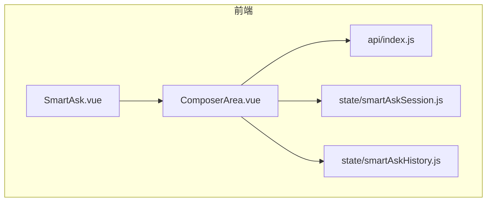
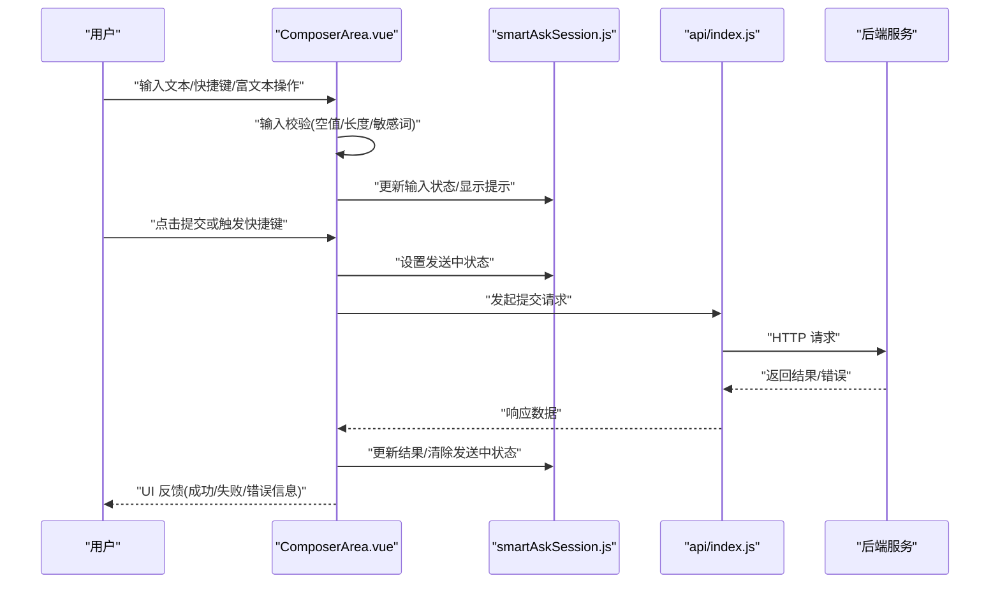
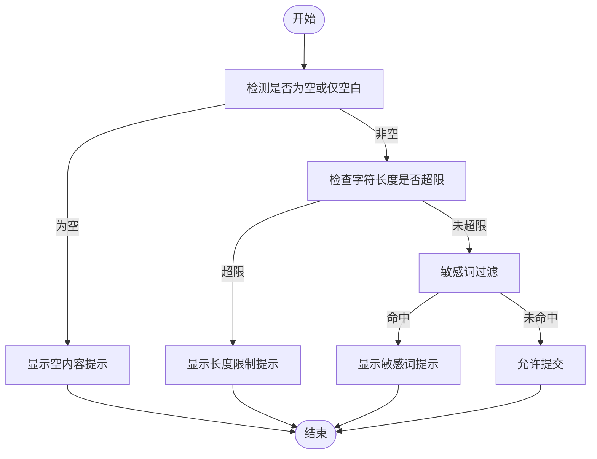
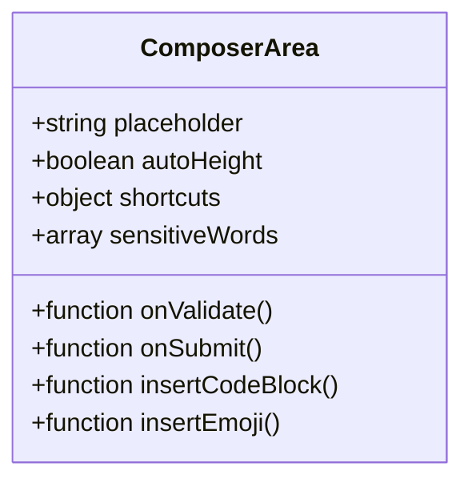
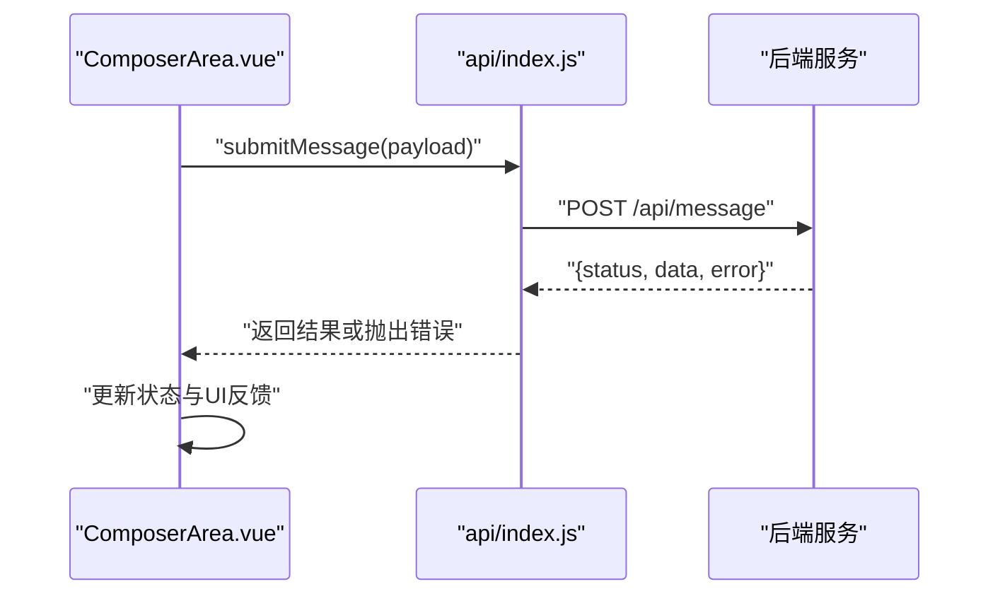
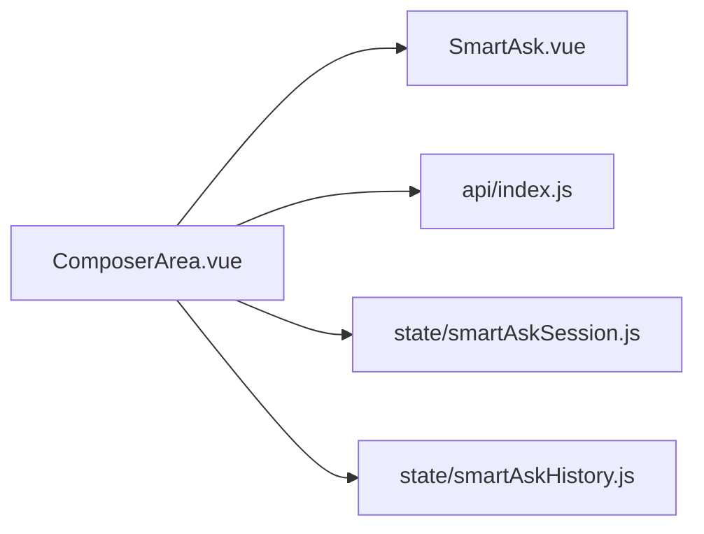

# 输入区域组件 (ComposerArea)

<cite>
**本文引用的文件**   
- [ComposerArea.vue](file://frontend/src/components/smartask/ComposerArea.vue)
- [SmartAsk.vue](file://frontend/src/views/SmartAsk.vue)
- [api/index.js](file://frontend/src/api/index.js)
- [state/smartAskSession.js](file://frontend/src/state/smartAskSession.js)
- [state/smartAskHistory.js](file://frontend/src/state/smartAskHistory.js)
</cite>

## 目录
1. [简介](#简介)
2. [项目结构](#项目结构)
3. [核心组件](#核心组件)
4. [架构总览](#架构总览)
5. [详细组件分析](#详细组件分析)
6. [依赖关系分析](#依赖关系分析)
7. [性能考虑](#性能考虑)
8. [故障排查指南](#故障排查指南)
9. [结论](#结论)
10. [附录：API 参考与使用示例](#附录api-参考与使用示例)

## 简介
本文件为 ComposerArea 输入区域组件的全面开发文档。该组件是用户的主要输入入口，提供多行文本输入、自动高度调整、快捷键支持、输入验证（空内容检测、字符限制、敏感词过滤）、与后端的交互流程（提交、加载状态管理、错误处理），以及富文本编辑能力（Markdown 支持、代码块插入、表情符号选择）。同时提供自定义配置项（占位符文本、快捷键绑定、输入提示）和完整的 API 参考与使用示例，帮助开发者快速集成与扩展。

## 项目结构
ComposerArea 位于前端 Vue 组件目录中，作为智能问答界面的核心输入模块。其调用方为 SmartAsk 视图，数据流通过状态管理与 API 层与后端服务进行交互。

**图示来源** 
- [SmartAsk.vue](file://frontend/src/views/SmartAsk.vue)
- [ComposerArea.vue](file://frontend/src/components/smartask/ComposerArea.vue)
- [api/index.js](file://frontend/src/api/index.js)
- [state/smartAskSession.js](file://frontend/src/state/smartAskSession.js)
- [state/smartAskHistory.js](file://frontend/src/state/smartAskHistory.js)

**章节来源**
- [ComposerArea.vue](file://frontend/src/components/smartask/ComposerArea.vue)
- [SmartAsk.vue](file://frontend/src/views/SmartAsk.vue)
- [api/index.js](file://frontend/src/api/index.js)
- [state/smartAskSession.js](file://frontend/src/state/smartAskSession.js)
- [state/smartAskHistory.js](file://frontend/src/state/smartAskHistory.js)

## 核心组件
- ComposerArea.vue：负责用户输入、校验、快捷操作、富文本增强、提交与状态反馈。
- SmartAsk.vue：页面级容器，组织会话上下文并渲染 ComposerArea。
- api/index.js：封装与后端的 HTTP 请求，统一错误处理与响应解析。
- state/smartAskSession.js：维护当前会话的输入、发送状态、结果等。
- state/smartAskHistory.js：维护历史消息列表与持久化策略。

**章节来源**
- [ComposerArea.vue](file://frontend/src/components/smartask/ComposerArea.vue)
- [SmartAsk.vue](file://frontend/src/views/SmartAsk.vue)
- [api/index.js](file://frontend/src/api/index.js)
- [state/smartAskSession.js](file://frontend/src/state/smartAskSession.js)
- [state/smartAskHistory.js](file://frontend/src/state/smartAskHistory.js)

## 架构总览
ComposerArea 在 UI 层接收用户输入，执行本地校验与富文本增强，随后通过 API 层将请求发送至后端。状态管理模块负责同步输入、发送进度与结果展示。整体流程如下：

**图示来源** 
- [ComposerArea.vue](file://frontend/src/components/smartask/ComposerArea.vue)
- [api/index.js](file://frontend/src/api/index.js)
- [state/smartAskSession.js](file://frontend/src/state/smartAskSession.js)

## 详细组件分析

### 输入与交互
- 多行文本输入：支持换行与粘贴，自动根据内容高度调整输入框尺寸，提升长文本输入体验。
- 快捷键支持：常见快捷键如回车提交、组合键插入特定格式（例如代码块、加粗等），可自定义绑定。
- 输入提示：基于占位符与动态提示文案，引导用户输入有效内容。

**章节来源**
- [ComposerArea.vue](file://frontend/src/components/smartask/ComposerArea.vue)

### 输入验证机制
- 空内容检测：提交前检查是否为空或仅空白字符，阻止无效提交。
- 字符限制：对输入长度进行上限控制，避免过长内容导致后端压力或渲染问题。
- 敏感词过滤：内置敏感词规则，命中时给出明确提示并可阻止提交。

**图示来源** 
- [ComposerArea.vue](file://frontend/src/components/smartask/ComposerArea.vue)

**章节来源**
- [ComposerArea.vue](file://frontend/src/components/smartask/ComposerArea.vue)

### 富文本编辑功能
- Markdown 支持：实时预览与语法高亮，支持常用 Markdown 语法。
- 代码块插入：一键插入代码块模板，支持语言标注与复制。
- 表情符号选择：弹出表情面板，快速插入表情到光标位置。

**图示来源** 
- [ComposerArea.vue](file://frontend/src/components/smartask/ComposerArea.vue)

**章节来源**
- [ComposerArea.vue](file://frontend/src/components/smartask/ComposerArea.vue)

### 与后端的交互流程
- 输入提交：组装请求体（包含文本、上下文、会话标识等），调用 API 接口。
- 加载状态管理：提交期间设置“发送中”状态，禁用重复提交，并在完成后恢复。
- 错误处理：捕获网络异常与业务错误，向用户展示友好提示。

**图示来源** 
- [ComposerArea.vue](file://frontend/src/components/smartask/ComposerArea.vue)
- [api/index.js](file://frontend/src/api/index.js)

**章节来源**
- [ComposerArea.vue](file://frontend/src/components/smartask/ComposerArea.vue)
- [api/index.js](file://frontend/src/api/index.js)

### 自定义配置选项
- 占位符文本：placeholder 属性，支持动态文案。
- 快捷键绑定：shortcuts 对象，定义按键组合与动作映射。
- 输入提示：tips 数组或函数，根据输入状态动态生成提示。

**章节来源**
- [ComposerArea.vue](file://frontend/src/components/smartask/ComposerArea.vue)

## 依赖关系分析
ComposerArea 依赖以下模块：
- 视图容器 SmartAsk.vue：提供会话上下文与布局。
- API 层 api/index.js：封装网络请求与错误处理。
- 状态管理 smartAskSession.js 与 smartAskHistory.js：维护输入、发送状态与历史消息。

**图示来源** 
- [ComposerArea.vue](file://frontend/src/components/smartask/ComposerArea.vue)
- [SmartAsk.vue](file://frontend/src/views/SmartAsk.vue)
- [api/index.js](file://frontend/src/api/index.js)
- [state/smartAskSession.js](file://frontend/src/state/smartAskSession.js)
- [state/smartAskHistory.js](file://frontend/src/state/smartAskHistory.js)

**章节来源**
- [ComposerArea.vue](file://frontend/src/components/smartask/ComposerArea.vue)
- [SmartAsk.vue](file://frontend/src/views/SmartAsk.vue)
- [api/index.js](file://frontend/src/api/index.js)
- [state/smartAskSession.js](file://frontend/src/state/smartAskSession.js)
- [state/smartAskHistory.js](file://frontend/src/state/smartAskHistory.js)

## 性能考虑
- 自动高度调整：采用防抖与节流优化，避免频繁重排与重绘。
- 输入校验：尽量在前端完成，减少不必要的后端请求。
- 富文本渲染：按需加载与懒渲染，降低初始负载。
- 网络请求：合并与去重，避免重复提交；合理设置超时与重试策略。

[本节为通用指导，不直接分析具体文件]

## 故障排查指南
- 提交无响应：检查网络连接、后端服务状态与 API 路径是否正确。
- 输入被拦截：查看空内容、长度限制与敏感词规则配置。
- 富文本异常：确认 Markdown 语法与编辑器插件加载情况。
- 状态不同步：核对状态管理中的发送中标志与结果更新逻辑。

**章节来源**
- [ComposerArea.vue](file://frontend/src/components/smartask/ComposerArea.vue)
- [api/index.js](file://frontend/src/api/index.js)
- [state/smartAskSession.js](file://frontend/src/state/smartAskSession.js)

## 结论
ComposerArea 作为用户主要输入接口，提供了完善的输入体验与健壮的错误处理机制。通过灵活的配置与可扩展的富文本能力，能够适配多种业务场景。建议在实际使用中结合业务需求定制占位符、快捷键与敏感词规则，并持续监控性能与用户体验指标。

[本节为总结性内容，不直接分析具体文件]

## 附录：API 参考与使用示例

### 组件属性与事件
- 属性
  - placeholder：占位符文本
  - autoHeight：是否启用自动高度调整
  - shortcuts：快捷键绑定映射
  - sensitiveWords：敏感词列表
  - tips：输入提示配置
- 事件
  - validate：输入校验回调
  - submit：提交回调
  - update:modelValue：双向绑定输入值

### 方法
- onValidate：执行输入校验
- onSubmit：提交输入内容
- insertCodeBlock：插入代码块
- insertEmoji：插入表情

### 使用示例
- 基础用法：引入组件并传入占位符与快捷键配置。
- 富文本增强：启用 Markdown 预览与代码块插入。
- 校验与提示：配置敏感词与长度限制，展示友好提示。
- 与状态管理集成：监听提交事件并更新会话状态。

**章节来源**
- [ComposerArea.vue](file://frontend/src/components/smartask/ComposerArea.vue)
- [SmartAsk.vue](file://frontend/src/views/SmartAsk.vue)
- [api/index.js](file://frontend/src/api/index.js)
- [state/smartAskSession.js](file://frontend/src/state/smartAskSession.js)
- [state/smartAskHistory.js](file://frontend/src/state/smartAskHistory.js)