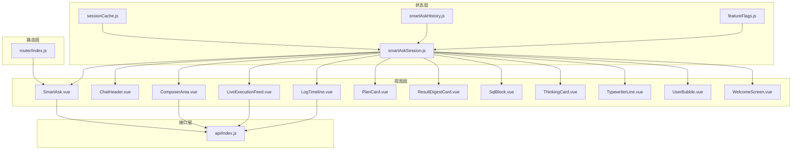
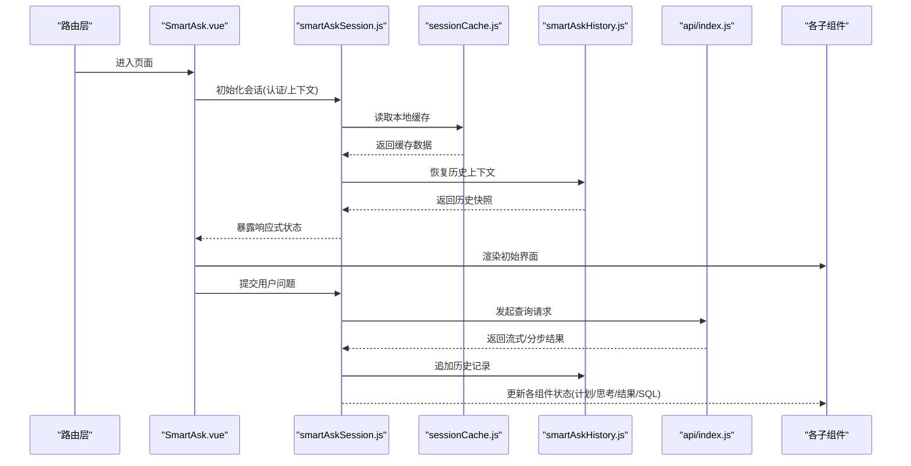
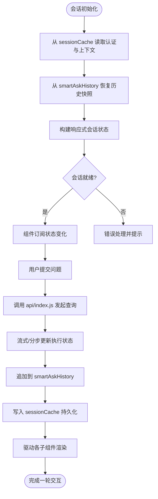
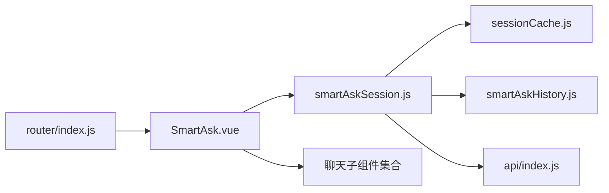

# 会话状态管理

<cite>
**本文引用的文件**   
- [smartAskSession.js](file://frontend/src/state/smartAskSession.js)
- [sessionCache.js](file://frontend/src/state/sessionCache.js)
- [smartAskHistory.js](file://frontend/src/state/smartAskHistory.js)
- [featureFlags.js](file://frontend/src/state/featureFlags.js)
- [SmartAsk.vue](file://frontend/src/views/SmartAsk.vue)
- [ChatHeader.vue](file://frontend/src/components/smartask/ChatHeader.vue)
- [ComposerArea.vue](file://frontend/src/components/smartask/ComposerArea.vue)
- [LiveExecutionFeed.vue](file://frontend/src/components/smartask/LiveExecutionFeed.vue)
- [LogTimeline.vue](file://frontend/src/components/smartask/LogTimeline.vue)
- [PlanCard.vue](file://frontend/src/components/smartask/PlanCard.vue)
- [ResultDigestCard.vue](file://frontend/src/components/smartask/ResultDigestCard.vue)
- [SqlBlock.vue](file://frontend/src/components/smartask/SqlBlock.vue)
- [ThinkingCard.vue](file://frontend/src/components/smartask/ThinkingCard.vue)
- [TypewriterLine.vue](file://frontend/src/components/smartask/TypewriterLine.vue)
- [UserBubble.vue](file://frontend/src/components/smartask/UserBubble.vue)
- [WelcomeScreen.vue](file://frontend/src/components/smartask/WelcomeScreen.vue)
- [AuthLogin.vue](file://frontend/src/auth/AuthLogin.vue)
- [index.js](file://frontend/src/router/index.js)
- [api/index.js](file://frontend/src/api/index.js)
</cite>

## 目录
1. [简介](#简介)
2. [项目结构](#项目结构)
3. [核心组件](#核心组件)
4. [架构总览](#架构总览)
5. [详细组件分析](#详细组件分析)
6. [依赖关系分析](#依赖关系分析)
7. [性能考虑](#性能考虑)
8. [故障排查指南](#故障排查指南)
9. [结论](#结论)
10. [附录](#附录)

## 简介
本文件面向 SmartAsk 智能问数平台的前端会话状态管理系统，聚焦 smartAskSession 的状态结构设计、生命周期管理、响应式数据实现与持久化机制。文档将帮助开发者理解如何在组件中访问和更新会话状态、如何处理异步操作的状态同步，并提供调试技巧与常见问题解决方案。

## 项目结构
前端状态管理相关代码集中在 frontend/src/state 目录下，核心包括：
- smartAskSession.js：会话状态定义、初始化、同步与清理等核心逻辑
- sessionCache.js：会话缓存与跨页面共享能力
- smartAskHistory.js：历史消息与查询上下文管理
- featureFlags.js：功能开关（与会话行为相关）

视图层通过 Vue 组件消费会话状态，API 层负责与后端交互，路由层控制页面切换与会话初始化时机。

图表来源
- [smartAskSession.js:1-200](file://frontend/src/state/smartAskSession.js#L1-L200)
- [sessionCache.js:1-200](file://frontend/src/state/sessionCache.js#L1-L200)
- [smartAskHistory.js:1-200](file://frontend/src/state/smartAskHistory.js#L1-L200)
- [featureFlags.js:1-200](file://frontend/src/state/featureFlags.js#L1-L200)
- [SmartAsk.vue:1-200](file://frontend/src/views/SmartAsk.vue#L1-L200)
- [api/index.js:1-200](file://frontend/src/api/index.js#L1-L200)
- [router/index.js:1-200](file://frontend/src/router/index.js#L1-L200)

章节来源
- [smartAskSession.js:1-200](file://frontend/src/state/smartAskSession.js#L1-L200)
- [sessionCache.js:1-200](file://frontend/src/state/sessionCache.js#L1-L200)
- [smartAskHistory.js:1-200](file://frontend/src/state/smartAskHistory.js#L1-L200)
- [featureFlags.js:1-200](file://frontend/src/state/featureFlags.js#L1-L200)
- [SmartAsk.vue:1-200](file://frontend/src/views/SmartAsk.vue#L1-L200)
- [api/index.js:1-200](file://frontend/src/api/index.js#L1-L200)
- [router/index.js:1-200](file://frontend/src/router/index.js#L1-L200)

## 核心组件
- smartAskSession：集中管理用户认证信息、查询上下文、临时数据；提供初始化、状态同步、清理等 API；暴露响应式对象供组件订阅
- sessionCache：封装本地存储与跨页面共享策略，确保会话在刷新或新标签页打开时恢复
- smartAskHistory：维护历史消息、查询上下文快照，支持按会话维度存取
- featureFlags：提供运行时功能开关，影响会话行为（如是否启用高级能力、日志级别等）

章节来源
- [smartAskSession.js:1-200](file://frontend/src/state/smartAskSession.js#L1-L200)
- [sessionCache.js:1-200](file://frontend/src/state/sessionCache.js#L1-L200)
- [smartAskHistory.js:1-200](file://frontend/src/state/smartAskHistory.js#L1-L200)
- [featureFlags.js:1-200](file://frontend/src/state/featureFlags.js#L1-L200)

## 架构总览
会话状态管理的整体流程如下：
- 路由进入 SmartAsk 页面时触发会话初始化，加载认证信息与历史上下文
- 用户在 ComposerArea 输入问题，调用 API 发起查询
- LiveExecutionFeed 与 LogTimeline 实时展示执行过程与日志
- PlanCard、ThinkingCard、ResultDigestCard、SqlBlock 等组件根据会话状态渲染不同阶段内容
- sessionCache 保证状态在页面刷新或跨标签页时一致
- smartAskHistory 记录每次查询的上下文与结果摘要

图表来源
- [SmartAsk.vue:1-200](file://frontend/src/views/SmartAsk.vue#L1-L200)
- [smartAskSession.js:1-200](file://frontend/src/state/smartAskSession.js#L1-L200)
- [sessionCache.js:1-200](file://frontend/src/state/sessionCache.js#L1-L200)
- [smartAskHistory.js:1-200](file://frontend/src/state/smartAskHistory.js#L1-L200)
- [api/index.js:1-200](file://frontend/src/api/index.js#L1-L200)

## 详细组件分析

### smartAskSession 状态结构与生命周期
- 状态结构
  - 用户认证信息：token、用户标识、权限范围等
  - 查询上下文：当前问题、数据集选择、过滤条件、时间范围等
  - 临时数据：中间结果、执行计划、思考步骤、SQL 片段、结果摘要等
- 生命周期
  - 初始化：从 sessionCache 恢复认证与上下文，从 smartAskHistory 恢复历史快照
  - 状态同步：API 回调更新执行阶段、结果与日志
  - 清理：退出页面或登出时清空敏感数据与临时状态

图表来源
- [smartAskSession.js:1-200](file://frontend/src/state/smartAskSession.js#L1-L200)
- [sessionCache.js:1-200](file://frontend/src/state/sessionCache.js#L1-L200)
- [smartAskHistory.js:1-200](file://frontend/src/state/smartAskHistory.js#L1-L200)
- [api/index.js:1-200](file://frontend/src/api/index.js#L1-L200)

章节来源
- [smartAskSession.js:1-200](file://frontend/src/state/smartAskSession.js#L1-L200)
- [sessionCache.js:1-200](file://frontend/src/state/sessionCache.js#L1-L200)
- [smartAskHistory.js:1-200](file://frontend/src/state/smartAskHistory.js#L1-L200)
- [api/index.js:1-200](file://frontend/src/api/index.js#L1-L200)

### 响应式数据实现规范（reactive/ref）
- reactive：用于结构化对象（如会话上下文、执行计划），适合批量更新与嵌套属性访问
- ref：用于基础类型或需要替换整个对象的场景（如布尔标志、字符串、数组引用）
- 性能优化
  - 避免在模板中频繁计算，使用 computed 派生值
  - 大对象拆分，按需更新局部状态
  - 减少不必要的深度监听，必要时使用 shallowRef/shallowReactive

章节来源
- [smartAskSession.js:1-200](file://frontend/src/state/smartAskSession.js#L1-L200)

### 持久化机制（本地存储、跨页面共享、状态恢复）
- 本地存储：sessionCache 封装 localStorage/sessionStorage 读写，序列化/反序列化状态
- 跨页面共享：通过事件总线或同源存储通道保持多标签页一致性
- 状态恢复：页面刷新或新标签页打开时，优先从缓存恢复认证与上下文，再拉取最新历史

章节来源
- [sessionCache.js:1-200](file://frontend/src/state/sessionCache.js#L1-L200)

### 组件访问与更新会话状态示例
- 在 SmartAsk.vue 中初始化会话、提交问题、监听执行进度
- 在 ComposerArea.vue 中收集用户输入并调用会话提交方法
- 在 LiveExecutionFeed.vue、LogTimeline.vue 中订阅执行状态与日志
- 在 PlanCard、ThinkingCard、ResultDigestCard、SqlBlock 中渲染对应阶段内容

章节来源
- [SmartAsk.vue:1-200](file://frontend/src/views/SmartAsk.vue#L1-L200)
- [ComposerArea.vue:1-200](file://frontend/src/components/smartask/ComposerArea.vue#L1-L200)
- [LiveExecutionFeed.vue:1-200](file://frontend/src/components/smartask/LiveExecutionFeed.vue#L1-L200)
- [LogTimeline.vue:1-200](file://frontend/src/components/smartask/LogTimeline.vue#L1-L200)
- [PlanCard.vue:1-200](file://frontend/src/components/smartask/PlanCard.vue#L1-L200)
- [ThinkingCard.vue:1-200](file://frontend/src/components/smartask/ThinkingCard.vue#L1-L200)
- [ResultDigestCard.vue:1-200](file://frontend/src/components/smartask/ResultDigestCard.vue#L1-L200)
- [SqlBlock.vue:1-200](file://frontend/src/components/smartask/SqlBlock.vue#L1-L200)

### 异步操作的状态同步
- 使用 Promise/Async-Await 包装 API 调用，统一处理成功、失败与取消
- 流式响应通过增量更新会话状态，避免阻塞 UI
- 错误边界：捕获网络异常、解析错误，回滚部分状态并提示用户

章节来源
- [api/index.js:1-200](file://frontend/src/api/index.js#L1-L200)
- [smartAskSession.js:1-200](file://frontend/src/state/smartAskSession.js#L1-L200)

## 依赖关系分析
- 视图层依赖状态层：所有聊天相关组件订阅 smartAskSession 暴露的响应式状态
- 状态层依赖持久化层：sessionCache 负责本地存储与跨页面共享
- 状态层依赖历史层：smartAskHistory 提供历史快照与追加能力
- 状态层依赖接口层：api/index.js 提供查询、日志、结果获取等能力
- 路由层触发初始化：router/index.js 在进入 SmartAsk 页面时启动会话初始化

图表来源
- [router/index.js:1-200](file://frontend/src/router/index.js#L1-L200)
- [SmartAsk.vue:1-200](file://frontend/src/views/SmartAsk.vue#L1-L200)
- [smartAskSession.js:1-200](file://frontend/src/state/smartAskSession.js#L1-L200)
- [sessionCache.js:1-200](file://frontend/src/state/sessionCache.js#L1-L200)
- [smartAskHistory.js:1-200](file://frontend/src/state/smartAskHistory.js#L1-L200)
- [api/index.js:1-200](file://frontend/src/api/index.js#L1-L200)

章节来源
- [router/index.js:1-200](file://frontend/src/router/index.js#L1-L200)
- [SmartAsk.vue:1-200](file://frontend/src/views/SmartAsk.vue#L1-L200)
- [smartAskSession.js:1-200](file://frontend/src/state/smartAskSession.js#L1-L200)
- [sessionCache.js:1-200](file://frontend/src/state/sessionCache.js#L1-L200)
- [smartAskHistory.js:1-200](file://frontend/src/state/smartAskHistory.js#L1-L200)
- [api/index.js:1-200](file://frontend/src/api/index.js#L1-L200)

## 性能考虑
- 响应式粒度：尽量使用浅层响应式（shallowRef/shallowReactive）减少深度监听开销
- 增量更新：流式结果按片段更新，避免整块重渲染
- 计算属性：对复杂派生数据使用 computed，避免重复计算
- 内存管理：及时清理定时器、取消未完成的请求、释放大对象引用
- 缓存策略：合理设置本地缓存过期时间与容量上限

[本节为通用指导，不直接分析具体文件]

## 故障排查指南
- 常见问题
  - 会话未初始化：检查路由进入时的初始化逻辑与缓存读取
  - 状态不同步：确认组件是否正确订阅响应式状态，是否存在多处独立实例
  - 异步错误未捕获：在 API 调用层增加 try/catch 与错误提示
  - 持久化失败：检查 localStorage 权限与序列化兼容性
- 调试技巧
  - 在关键节点打印状态快照，对比前后差异
  - 使用浏览器 DevTools 的 React/Vue 面板观察响应式数据变化
  - 对长耗时操作添加计时日志，定位瓶颈

章节来源
- [smartAskSession.js:1-200](file://frontend/src/state/smartAskSession.js#L1-L200)
- [sessionCache.js:1-200](file://frontend/src/state/sessionCache.js#L1-L200)
- [api/index.js:1-200](file://frontend/src/api/index.js#L1-L200)

## 结论
SmartAsk 的会话状态管理以 smartAskSession 为核心，结合 sessionCache 与 smartAskHistory 实现了完整的生命周期管理与持久化能力。通过规范的响应式数据实践与清晰的组件职责划分，系统具备良好的可维护性与扩展性。建议持续优化响应式粒度与异步错误处理，以提升用户体验与稳定性。

[本节为总结性内容，不直接分析具体文件]

## 附录
- 术语表
  - 会话：一次用户与系统的交互周期，包含认证、上下文、历史与临时数据
  - 响应式：基于 reactive/ref 的数据驱动更新机制
  - 持久化：将状态保存到本地存储以实现刷新或跨页面恢复
- 最佳实践
  - 单一状态源：所有会话状态由 smartAskSession 统一管理
  - 明确边界：组件只订阅所需字段，避免过度依赖全局状态
  - 错误优先：在网络与解析层统一处理异常，保障状态一致性

[本节为补充说明，不直接分析具体文件]