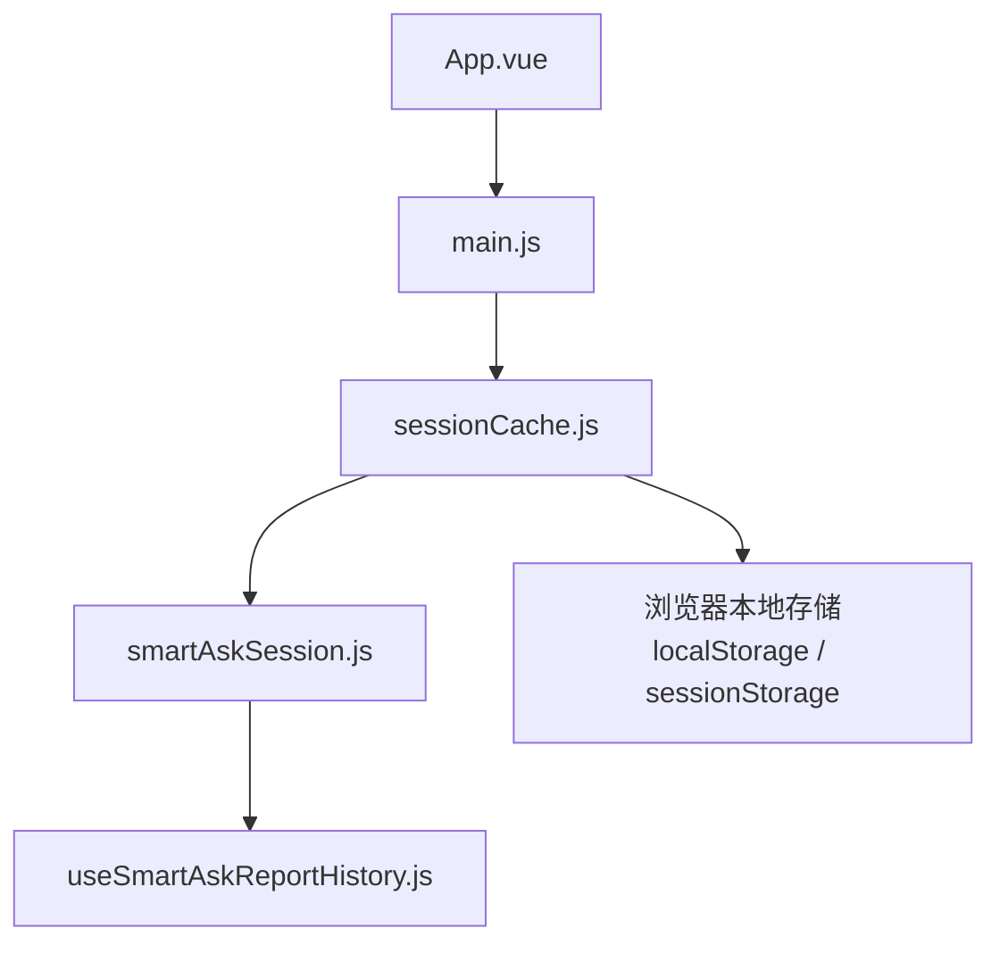
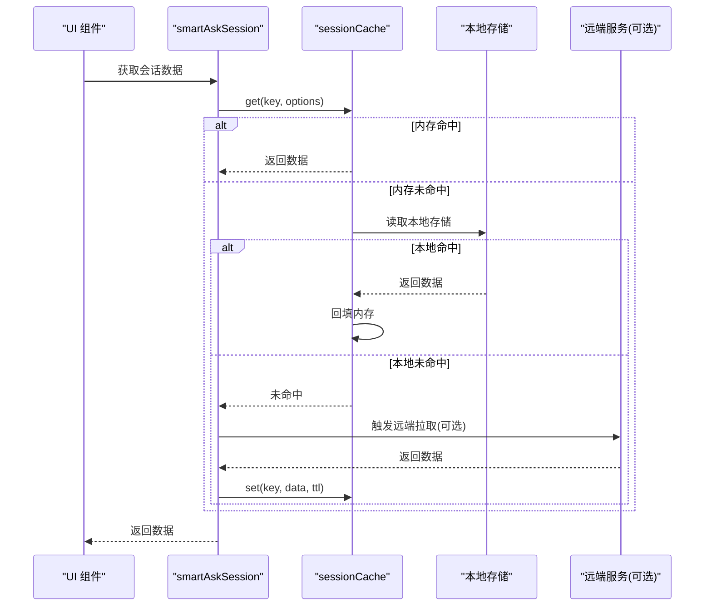
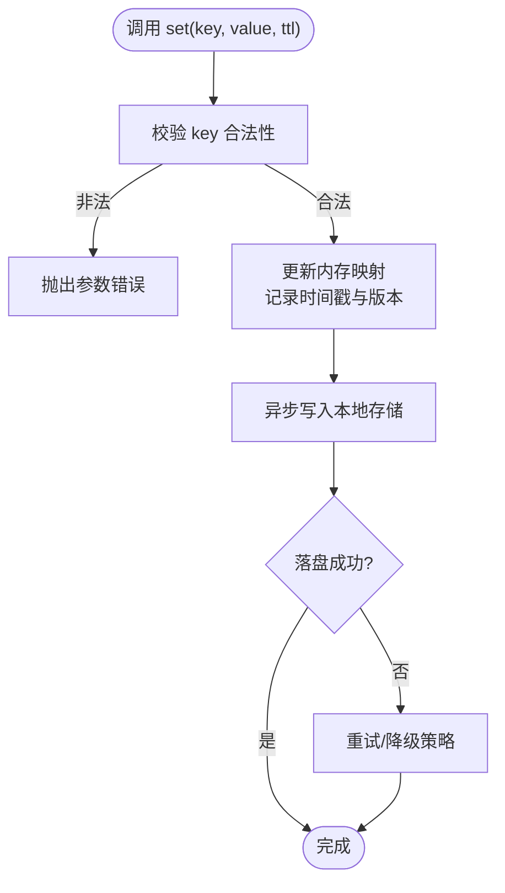
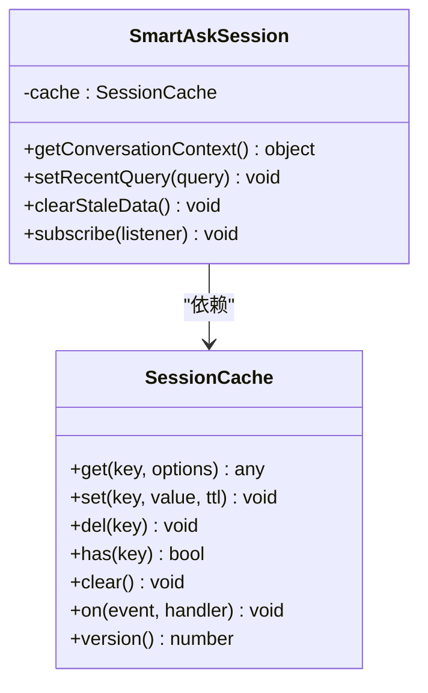
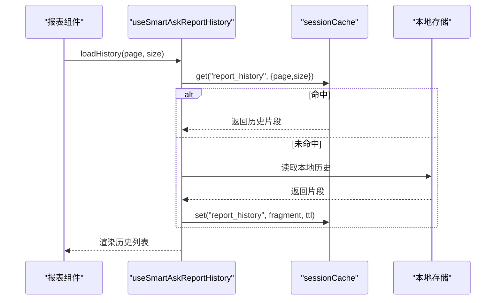
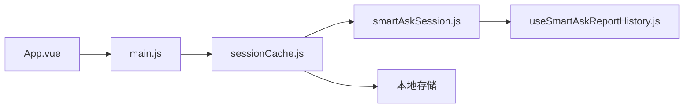

# 会话缓存管理

<cite>
**本文引用的文件**   
- [sessionCache.js](file://frontend/src/state/sessionCache.js)
- [smartAskSession.js](file://frontend/src/state/smartAskSession.js)
- [useSmartAskReportHistory.js](file://frontend/src/composables/useSmartAskReportHistory.js)
- [App.vue](file://frontend/src/App.vue)
- [main.js](file://frontend/src/main.js)
</cite>

## 目录
1. [简介](#简介)
2. [项目结构](#项目结构)
3. [核心组件](#核心组件)
4. [架构总览](#架构总览)
5. [详细组件分析](#详细组件分析)
6. [依赖关系分析](#依赖关系分析)
7. [性能考虑](#性能考虑)
8. [故障排查指南](#故障排查指南)
9. [结论](#结论)
10. [附录：使用示例与最佳实践](#附录使用示例与最佳实践)

## 简介
本文件面向 SmartAsk 智能问数平台的“会话缓存管理系统”，聚焦前端 sessionCache 的缓存架构设计与实现。文档围绕以下目标展开：
- 解释内存缓存、本地存储（如浏览器持久化）与多级缓存策略的实现原理
- 说明缓存生命周期：创建、更新、失效、清理等关键流程
- 阐述一致性保证机制：数据同步、冲突解决、版本管理等技术细节
- 介绍性能优化策略：缓存预热、懒加载、内存管理等技巧
- 提供具体使用示例：设置缓存项、获取缓存数据、处理缓存失效等操作
- 给出监控、调试工具与常见问题的排查方法

## 项目结构
会话缓存相关代码位于前端状态模块中，核心文件包括：
- sessionCache.js：会话缓存的核心实现，负责内存缓存与本地存储的读写、过期与清理
- smartAskSession.js：会话级状态封装，基于 sessionCache 提供业务语义化的接口
- useSmartAskReportHistory.js：组合式函数，暴露报告历史相关的缓存读取/写入能力
- App.vue / main.js：应用启动时初始化缓存实例或注入全局依赖

图表来源
- [App.vue](file://frontend/src/App.vue)
- [main.js](file://frontend/src/main.js)
- [sessionCache.js](file://frontend/src/state/sessionCache.js)
- [smartAskSession.js](file://frontend/src/state/smartAskSession.js)
- [useSmartAskReportHistory.js](file://frontend/src/composables/useSmartAskReportHistory.js)

章节来源
- [sessionCache.js](file://frontend/src/state/sessionCache.js)
- [smartAskSession.js](file://frontend/src/state/smartAskSession.js)
- [useSmartAskReportHistory.js](file://frontend/src/composables/useSmartAskReportHistory.js)
- [App.vue](file://frontend/src/App.vue)
- [main.js](file://frontend/src/main.js)

## 核心组件
- 会话缓存（sessionCache）
  - 职责：提供统一的 get/set/del/has/clear 等接口；维护内存中的键值映射；与本地存储进行双向同步；支持 TTL（过期时间）、版本号与事件通知
  - 关键点：线程安全（单例）、惰性初始化、批量操作、错误隔离
- 会话状态（smartAskSession）
  - 职责：对 sessionCache 进行业务语义封装，如“当前会话上下文”“最近查询结果”“用户偏好”等
  - 关键点：只读视图、变更回调、自动刷新
- 报告历史组合函数（useSmartAskReportHistory）
  - 职责：为 UI 层提供“读取/追加/分页/去重”的历史记录能力
  - 关键点：分页裁剪、去重策略、懒加载下一页

章节来源
- [sessionCache.js](file://frontend/src/state/sessionCache.js)
- [smartAskSession.js](file://frontend/src/state/smartAskSession.js)
- [useSmartAskReportHistory.js](file://frontend/src/composables/useSmartAskReportHistory.js)

## 架构总览
会话缓存采用“内存为主、本地存储为辅”的多级缓存架构。典型的数据流如下：
- 读取路径：优先命中内存缓存；未命中则回源本地存储并回填内存；若仍失败则触发远端拉取（由上层业务决定）
- 写入路径：先写内存，再异步落盘本地存储；必要时递增版本号并广播失效事件
- 失效与清理：按 TTL 过期、LRU 淘汰、显式删除、页面卸载清理等多策略协同

图表来源
- [sessionCache.js](file://frontend/src/state/sessionCache.js)
- [smartAskSession.js](file://frontend/src/state/smartAskSession.js)
- [useSmartAskReportHistory.js](file://frontend/src/composables/useSmartAskReportHistory.js)

## 详细组件分析

### 会话缓存（sessionCache）
- 设计要点
  - 内存层：对象映射 + 有序表（用于 LRU）+ 时间戳（TTL）
  - 持久层：序列化到本地存储，支持分片 key 前缀避免冲突
  - 事件总线：发布订阅模式，监听“写入/失效/清理”事件，供上层订阅
  - 并发控制：队列化写入，避免竞态条件导致的状态不一致
- 关键流程
  - 创建：延迟初始化，首次访问时构建内存结构与事件总线
  - 更新：set(key, value, ttl) 会更新内存、计算过期时间、异步落盘、递增版本
  - 失效：TTL 到期、显式 del、批量 clear、页面 unload 时统一回收
  - 清理：定时扫描过期项、达到容量阈值触发 LRU 淘汰
- 一致性保障
  - 版本号：每次写入递增，读取时校验版本，避免脏读
  - 幂等写入：相同 key 重复写入不会造成冗余
  - 事务性落盘：失败重试与降级策略，确保内存与本地存储最终一致

图表来源
- [sessionCache.js](file://frontend/src/state/sessionCache.js)

章节来源
- [sessionCache.js](file://frontend/src/state/sessionCache.js)

### 会话状态（smartAskSession）
- 设计要点
  - 将 sessionCache 的能力包装成业务语义接口，如 getConversationContext()、setRecentQuery()、clearStaleData()
  - 提供只读快照，避免外部直接修改内部状态
  - 监听缓存事件，自动刷新 UI 所需数据
- 关键流程
  - 初始化：从缓存恢复会话上下文
  - 变更：通过 setter 方法触发缓存更新与事件广播
  - 清理：在会话切换或页面关闭时执行清理

图表来源
- [sessionCache.js](file://frontend/src/state/sessionCache.js)
- [smartAskSession.js](file://frontend/src/state/smartAskSession.js)

章节来源
- [smartAskSession.js](file://frontend/src/state/smartAskSession.js)

### 报告历史组合函数（useSmartAskReportHistory）
- 设计要点
  - 提供分页读取、追加、去重、裁剪等能力
  - 结合 sessionCache 的 TTL 与版本，实现“热历史常驻、冷历史淘汰”
- 关键流程
  - 读取：优先内存命中，未命中则从本地存储加载并回填
  - 写入：追加新条目，去重后按容量裁剪，保持最新 N 条
  - 失效：当会话切换或超过 TTL 时，清空或归档历史

图表来源
- [useSmartAskReportHistory.js](file://frontend/src/composables/useSmartAskReportHistory.js)
- [sessionCache.js](file://frontend/src/state/sessionCache.js)

章节来源
- [useSmartAskReportHistory.js](file://frontend/src/composables/useSmartAskReportHistory.js)

## 依赖关系分析
- 模块耦合
  - smartAskSession 依赖 sessionCache 提供的通用缓存能力
  - useSmartAskReportHistory 依赖 smartAskSession 的业务接口
  - App.vue / main.js 负责初始化 sessionCache 实例并注入到应用上下文
- 外部依赖
  - 浏览器本地存储（localStorage / sessionStorage）
  - 可选远端服务（由上层业务决定是否回源）

图表来源
- [App.vue](file://frontend/src/App.vue)
- [main.js](file://frontend/src/main.js)
- [sessionCache.js](file://frontend/src/state/sessionCache.js)
- [smartAskSession.js](file://frontend/src/state/smartAskSession.js)
- [useSmartAskReportHistory.js](file://frontend/src/composables/useSmartAskReportHistory.js)

章节来源
- [sessionCache.js](file://frontend/src/state/sessionCache.js)
- [smartAskSession.js](file://frontend/src/state/smartAskSession.js)
- [useSmartAskReportHistory.js](file://frontend/src/composables/useSmartAskReportHistory.js)
- [App.vue](file://frontend/src/App.vue)
- [main.js](file://frontend/src/main.js)

## 性能考虑
- 缓存预热
  - 应用启动时预加载高频键（如会话上下文、常用配置），减少首屏延迟
- 懒加载
  - 大对象或分页数据按需加载，避免一次性占用过多内存
- 内存管理
  - 使用 LRU 淘汰策略，限制最大条目数与单条大小上限
  - 定期扫描过期项，释放无用内存
- 写入优化
  - 合并连续写入，降低本地存储 I/O 频率
  - 异步落盘，避免阻塞主线程
- 读取优化
  - 热点键常驻内存，冷数据仅保留最近访问片段
  - 版本校验快速判断是否需要回源

[本节为通用性能建议，不直接分析具体文件]

## 故障排查指南
- 常见问题
  - 缓存未命中：检查 key 命名规范、TTL 设置是否过短、是否存在跨会话覆盖
  - 数据不一致：确认写入顺序与版本递增逻辑，检查本地存储损坏或反序列化失败
  - 内存溢出：监控内存使用，调整 LRU 阈值与单条大小上限
  - 事件未触发：检查事件订阅是否正确注册，是否存在异常中断
- 调试手段
  - 启用调试日志：输出关键操作的入参、返回值与耗时
  - 导出缓存快照：导出内存与本地存储的对比，定位差异
  - 模拟异常：注入本地存储失败场景，验证降级与重试逻辑
- 监控指标
  - 命中率、平均读取/写入耗时、过期率、淘汰次数、内存占用

章节来源
- [sessionCache.js](file://frontend/src/state/sessionCache.js)
- [smartAskSession.js](file://frontend/src/state/smartAskSession.js)
- [useSmartAskReportHistory.js](file://frontend/src/composables/useSmartAskReportHistory.js)

## 结论
会话缓存系统以 sessionCache 为核心，结合 smartAskSession 与 useSmartAskReportHistory，构建了“内存为主、本地存储为辅”的多级缓存体系。通过 TTL、LRU、版本号与事件机制，实现了高效、可靠且可扩展的缓存管理。配合预热、懒加载与内存管理策略，可在复杂交互场景中保持良好性能与用户体验。

[本节为总结性内容，不直接分析具体文件]

## 附录：使用示例与最佳实践
- 设置缓存项
  - 使用 set(key, value, ttl) 设置带过期时间的缓存项
  - 建议在业务层封装 setter，统一处理默认 TTL 与去重
- 获取缓存数据
  - 使用 get(key, options) 获取数据，options 可指定是否允许回源与超时
  - 对于大对象，建议使用分页或懒加载选项
- 处理缓存失效
  - 显式 del(key) 删除单个键
  - 使用 clear() 清空所有缓存（谨慎使用）
  - 订阅失效事件，及时刷新 UI
- 最佳实践
  - 合理划分 key 空间，使用前缀区分不同业务域
  - 为热点数据设置较长 TTL，冷数据缩短 TTL
  - 对写入路径做幂等处理，避免重复写入
  - 在页面卸载时主动清理临时缓存，防止内存泄漏

[本节为使用指导，不直接分析具体文件]