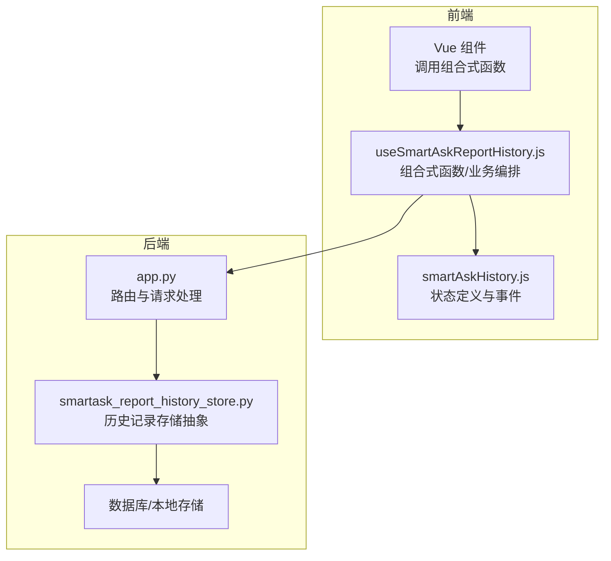
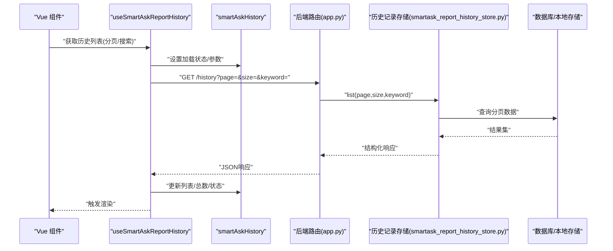
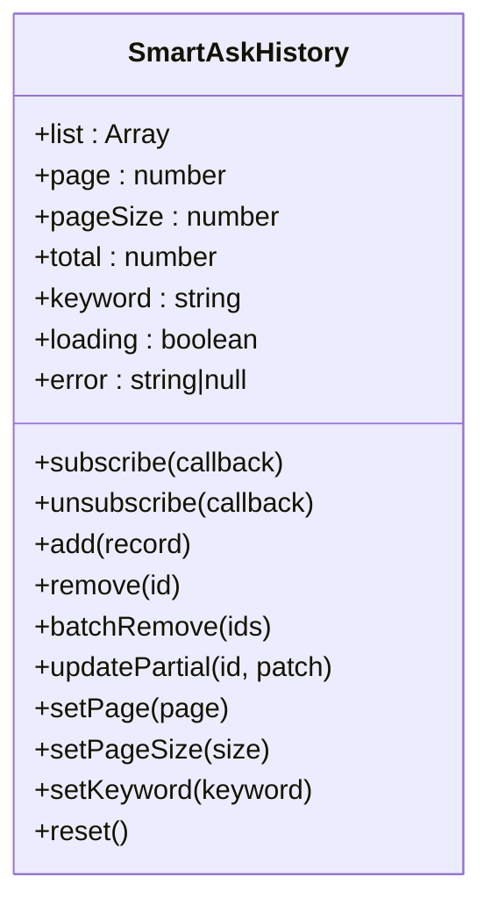
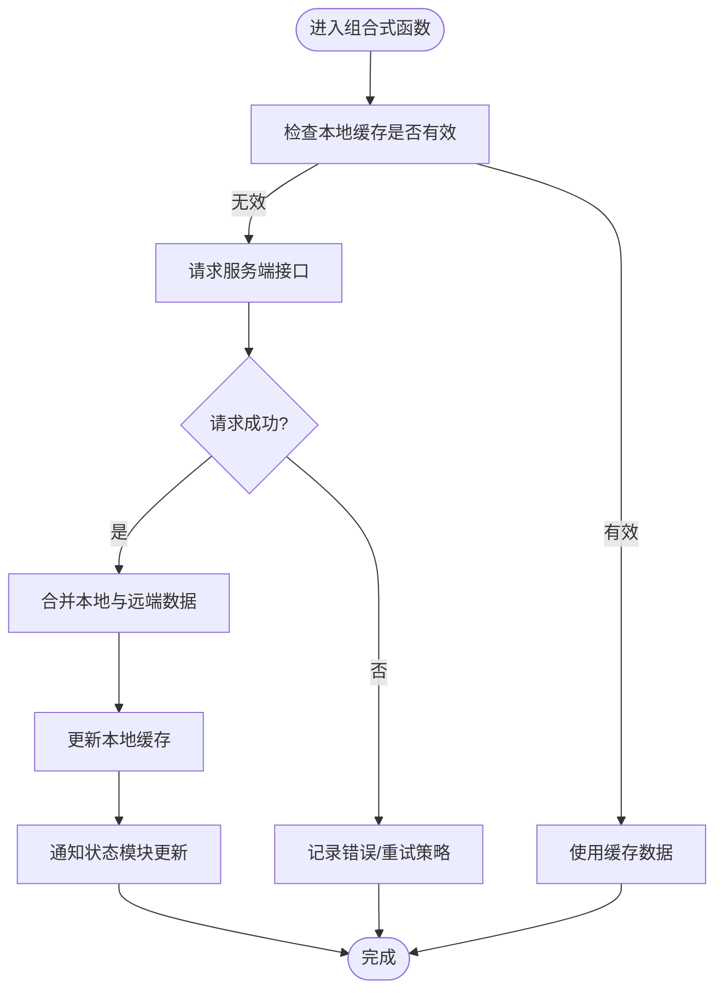
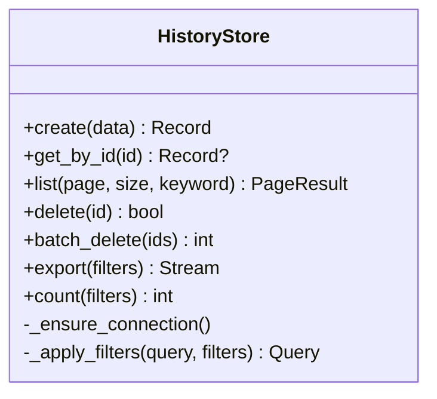
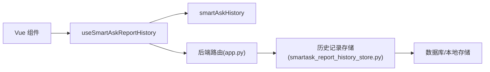

# 历史记录状态管理

<cite>
**本文引用的文件**   
- [smartAskHistory.js](file://frontend/src/state/smartAskHistory.js)
- [useSmartAskReportHistory.js](file://frontend/src/composables/useSmartAskReportHistory.js)
- [app.py](file://backend/app.py)
- [smartask_report_history_store.py](file://backend/smartask_report_history_store.py)
- [test_smartask_report_history_store.py](file://backend/tests/test_smartask_report_history_store.py)
</cite>

## 目录
1. [简介](#简介)
2. [项目结构](#项目结构)
3. [核心组件](#核心组件)
4. [架构总览](#架构总览)
5. [详细组件分析](#详细组件分析)
6. [依赖关系分析](#依赖关系分析)
7. [性能考虑](#性能考虑)
8. [故障排除指南](#故障排除指南)
9. [结论](#结论)
10. [附录：API使用示例](#附录api使用示例)

## 简介
本文件为 SmartAsk 智能问数平台“历史记录状态管理系统”的权威文档，聚焦 smartAskHistory 的状态架构与实现。内容涵盖查询历史的增删改查、分页加载、搜索过滤、本地存储与数据库同步、数据一致性保证、CRUD 操作（新增、删除、批量、导出）、状态同步机制（实时更新、冲突解决、版本控制），并提供 API 使用示例、性能优化建议与故障排除指南。

## 项目结构
SmartAsk 的历史记录功能由前端状态管理与后端持久化服务共同构成：
- 前端状态层：基于 Vue 组合式 API 的状态模块与可复用组合式函数，负责 UI 状态、分页、搜索过滤、本地缓存与与服务端的数据同步。
- 后端服务层：提供历史记录的 CRUD、分页、搜索、导出等接口，并通过统一的存储抽象对接数据库或本地存储。

**图表来源** 
- [smartAskHistory.js](file://frontend/src/state/smartAskHistory.js)
- [useSmartAskReportHistory.js](file://frontend/src/composables/useSmartAskReportHistory.js)
- [app.py](file://backend/app.py)
- [smartask_report_history_store.py](file://backend/smartask_report_history_store.py)

**章节来源**
- [smartAskHistory.js](file://frontend/src/state/smartAskHistory.js)
- [useSmartAskReportHistory.js](file://frontend/src/composables/useSmartAskReportHistory.js)
- [app.py](file://backend/app.py)
- [smartask_report_history_store.py](file://backend/smartask_report_history_store.py)

## 核心组件
- 前端状态模块 smartAskHistory.js
  - 职责：维护查询历史列表、当前页码、每页条数、搜索关键字、加载状态、错误信息等；暴露订阅/发布能力供组件消费。
  - 关键能力：初始化、增量更新、分页切换、搜索过滤、清空/删除单条、批量操作、导出。
- 组合式函数 useSmartAskReportHistory.js
  - 职责：封装与后端的交互（获取列表、新增、删除、批量、导出）、协调本地缓存与远端同步、处理分页与搜索参数、统一错误处理。
  - 关键能力：fetchHistory、addHistory、deleteHistory、batchDelete、exportHistory、search、paginate、syncLocalToRemote、syncRemoteToLocal。
- 后端存储 smartask_report_history_store.py
  - 职责：提供统一的存储接口（增删改查、分页、搜索、导出），屏蔽底层存储差异（数据库/本地）。
  - 关键能力：create、get_by_id、list（分页+过滤）、delete、batch_delete、export、count。
- 后端路由 app.py
  - 职责：暴露 HTTP 接口，接收请求参数，调用存储层并返回标准化响应。

**章节来源**
- [smartAskHistory.js](file://frontend/src/state/smartAskHistory.js)
- [useSmartAskReportHistory.js](file://frontend/src/composables/useSmartAskReportHistory.js)
- [smartask_report_history_store.py](file://backend/smartask_report_history_store.py)
- [app.py](file://backend/app.py)

## 架构总览
整体采用“前端状态 + 组合式编排 + 后端存储抽象”的分层架构，确保 UI 与数据解耦、前后端职责清晰、扩展性强。

**图表来源** 
- [useSmartAskReportHistory.js](file://frontend/src/composables/useSmartAskReportHistory.js)
- [smartAskHistory.js](file://frontend/src/state/smartAskHistory.js)
- [app.py](file://backend/app.py)
- [smartask_report_history_store.py](file://backend/smartask_report_history_store.py)

## 详细组件分析

### 前端状态模块 smartAskHistory.js
- 数据结构
  - 列表：按时间倒序排列，包含 id、问题文本、SQL、结果摘要、创建时间、更新时间、版本号等字段。
  - 元信息：当前页、每页条数、总条数、搜索关键字、排序方式、加载状态、错误信息。
- 状态变更
  - 新增：插入到头部，生成唯一 ID 与初始版本号，触发订阅通知。
  - 删除：按 ID 移除，支持软删除标记（可选）。
  - 批量：根据 ID 集合批量移除或标记。
  - 更新：局部字段更新（如结果摘要、执行状态），保持版本号递增。
  - 分页：切换页码时仅更新视图状态，实际数据由组合式函数拉取。
  - 搜索：对本地副本进行关键字匹配，不改变服务端数据。
- 并发与一致性
  - 通过版本号字段避免覆盖更新；在提交前校验版本号，失败则重新拉取最新数据。
  - 本地优先策略：先写本地，再异步同步至服务端，失败重试与回滚。

**图表来源** 
- [smartAskHistory.js](file://frontend/src/state/smartAskHistory.js)

**章节来源**
- [smartAskHistory.js](file://frontend/src/state/smartAskHistory.js)

### 组合式函数 useSmartAskReportHistory.js
- 职责边界
  - 聚合状态与副作用：发起网络请求、处理分页与搜索、合并本地与远端数据、错误与重试。
  - 提供统一 API：fetchHistory、addHistory、deleteHistory、batchDelete、exportHistory、search、clear。
- 数据流
  - 读取：优先从本地缓存读取，若过期或缺失则请求服务端，成功后回填本地缓存。
  - 写入：先落本地，再异步同步服务端；失败时保留本地并提示用户。
  - 搜索：本地快速过滤，必要时触发服务端搜索接口。
  - 分页：客户端维护 page/size，服务端返回 total 用于计算页数。
- 一致性保障
  - 版本号比对：服务端返回最新版本号，客户端比较后决定是否合并。
  - 冲突解决：以服务端为准，合并差异字段，保留审计日志。

**图表来源** 
- [useSmartAskReportHistory.js](file://frontend/src/composables/useSmartAskReportHistory.js)

**章节来源**
- [useSmartAskReportHistory.js](file://frontend/src/composables/useSmartAskReportHistory.js)

### 后端存储 smartask_report_history_store.py
- 接口设计
  - create(data): 新增一条历史记录，返回带 id 与 version 的对象。
  - get_by_id(id): 按 id 获取单条记录。
  - list(page, size, keyword=None): 分页查询，支持关键词过滤。
  - delete(id): 删除指定记录。
  - batch_delete(ids): 批量删除。
  - export(filters=None): 导出符合条件的记录（CSV/JSON）。
  - count(filters=None): 统计数量。
- 存储策略
  - 默认对接数据库表，支持通过配置切换到本地文件或内存存储（测试环境）。
  - 字段包含：id、question、sql、result_summary、status、version、created_at、updated_at 等。
- 事务与一致性
  - 写操作使用事务保证原子性；读操作支持快照隔离。
  - 版本号自增，防止覆盖更新；删除采用逻辑删除标记。

**图表来源** 
- [smartask_report_history_store.py](file://backend/smartask_report_history_store.py)

**章节来源**
- [smartask_report_history_store.py](file://backend/smartask_report_history_store.py)

### 后端路由 app.py
- 路由职责
  - 暴露 RESTful 接口：/api/history（GET/POST/DELETE）、/api/history/export（GET）。
  - 参数校验：分页参数范围、关键词长度限制、ID 合法性。
  - 权限控制：鉴权中间件、资源访问控制。
  - 响应格式：统一 JSON 结构，包含 data、message、code、trace_id。
- 错误处理
  - 捕获存储异常、参数校验异常、权限异常，返回标准错误码与消息。
  - 记录结构化日志，便于追踪与排查。

**章节来源**
- [app.py](file://backend/app.py)

## 依赖关系分析
- 前端依赖
  - Vue 组件依赖 useSmartAskReportHistory 提供的组合式 API。
  - useSmartAskReportHistory 依赖 smartAskHistory 状态模块进行状态订阅与更新。
  - 网络请求依赖后端路由接口。
- 后端依赖
  - app.py 依赖 smartask_report_history_store 提供的存储抽象。
  - smartask_report_history_store 依赖具体存储实现（数据库驱动或本地存储）。

**图表来源** 
- [useSmartAskReportHistory.js](file://frontend/src/composables/useSmartAskReportHistory.js)
- [smartAskHistory.js](file://frontend/src/state/smartAskHistory.js)
- [app.py](file://backend/app.py)
- [smartask_report_history_store.py](file://backend/smartask_report_history_store.py)

**章节来源**
- [useSmartAskReportHistory.js](file://frontend/src/composables/useSmartAskReportHistory.js)
- [smartAskHistory.js](file://frontend/src/state/smartAskHistory.js)
- [app.py](file://backend/app.py)
- [smartask_report_history_store.py](file://backend/smartask_report_history_store.py)

## 性能考虑
- 前端
  - 分页加载：避免一次性加载全部数据，按需拉取。
  - 本地缓存：合理设置缓存有效期，减少重复请求。
  - 搜索过滤：优先本地过滤，长尾场景再走服务端搜索。
  - 防抖节流：输入框搜索使用防抖，批量操作使用节流。
- 后端
  - 索引优化：对常用查询字段建立索引（question、created_at、status）。
  - 分页游标：大数据量下使用游标分页替代偏移分页。
  - 导出优化：流式导出，避免内存峰值过高。
  - 连接池：数据库连接池配置合理大小，避免连接耗尽。

[本节为通用指导，无需特定文件引用]

## 故障排除指南
- 常见问题
  - 列表为空：检查本地缓存是否过期、服务端接口是否可用、分页参数是否正确。
  - 搜索无结果：确认关键词匹配规则、服务端是否启用全文检索。
  - 删除失败：检查权限、记录是否存在、是否被其他进程锁定。
  - 导出失败：检查存储空间、文件格式兼容性、数据量大小。
- 调试步骤
  - 查看浏览器控制台与网络面板，确认请求与响应。
  - 检查后端日志，定位异常堆栈与错误码。
  - 验证数据库记录与版本号一致性。
  - 使用单元测试用例复现问题。

**章节来源**
- [test_smartask_report_history_store.py](file://backend/tests/test_smartask_report_history_store.py)

## 结论
SmartAsk 历史记录状态管理系统通过清晰的前后端分层、统一的状态管理与存储抽象，实现了高内聚、低耦合的可扩展架构。结合分页、搜索、本地缓存与版本控制，既保证了用户体验，又确保了数据一致性与可靠性。后续可在搜索能力、导出性能、缓存策略等方面持续优化。

[本节为总结性内容，无需特定文件引用]

## 附录：API使用示例
以下为常见操作的 API 调用示例（以伪代码形式描述，非真实代码）：

- 添加历史记录
  - 前端：调用 addHistory({ question, sql, result_summary })
  - 后端：POST /api/history，请求体包含必要字段，返回新记录与版本号
- 查询历史列表
  - 前端：调用 fetchHistory({ page, pageSize, keyword })
  - 后端：GET /api/history?page=1&size=20&keyword=...
- 删除记录
  - 前端：调用 deleteHistory(id)
  - 后端：DELETE /api/history/:id
- 批量删除
  - 前端：调用 batchDelete([id1, id2, ...])
  - 后端：DELETE /api/history/batch，请求体为 ids 数组
- 导出数据
  - 前端：调用 exportHistory({ filters })
  - 后端：GET /api/history/export?filters=...

[本节为概念性说明，无需特定文件引用]