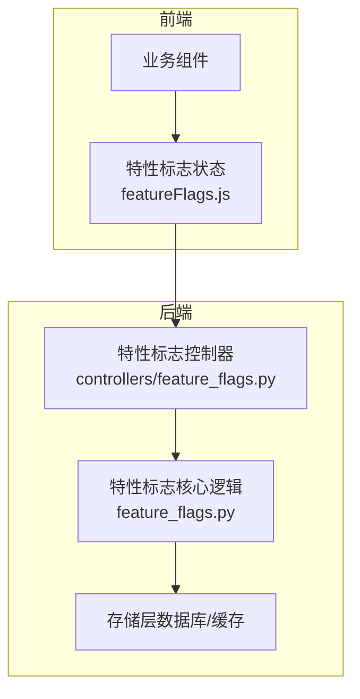
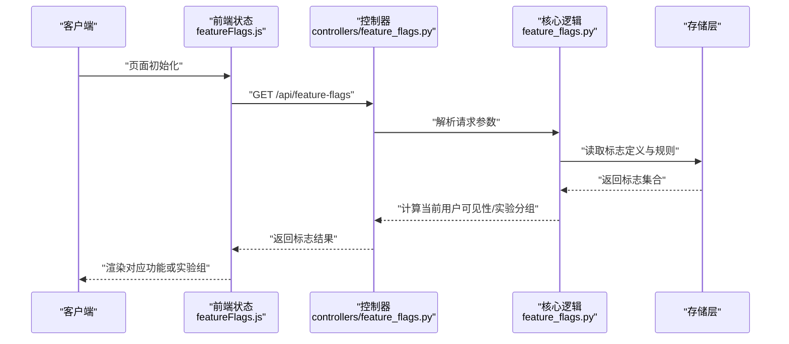
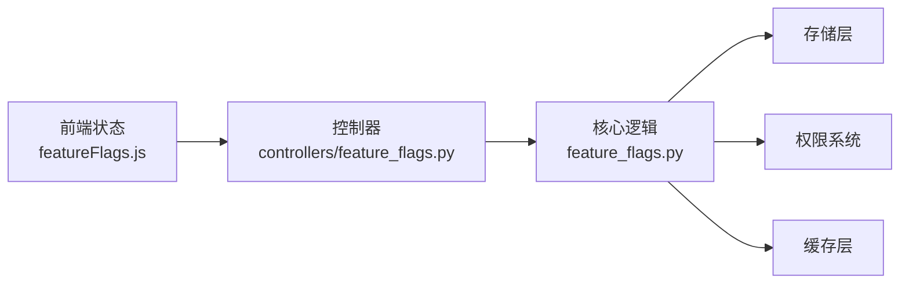

# 特性标志管理

<cite>
**本文引用的文件**   
- [backend/feature_flags.py](file://backend/feature_flags.py)
- [backend/controllers/feature_flags.py](file://backend/controllers/feature_flags.py)
- [frontend/src/state/featureFlags.js](file://frontend/src/state/featureFlags.js)
</cite>

## 目录
1. [简介](#简介)
2. [项目结构](#项目结构)
3. [核心组件](#核心组件)
4. [架构总览](#架构总览)
5. [详细组件分析](#详细组件分析)
6. [依赖关系分析](#依赖关系分析)
7. [性能考量](#性能考量)
8. [故障排查指南](#故障排查指南)
9. [结论](#结论)
10. [附录：使用示例与最佳实践](#附录使用示例与最佳实践)

## 简介
本文件为 SmartAsk 智能问数平台的“特性标志（Feature Flags）管理系统”提供系统化文档。内容覆盖设计原理、注册机制、动态配置更新、灰度发布支持、生命周期管理（定义、条件判断、权限控制）、配置方式（静态、动态、优先级）、A/B 测试集成（实验分组、流量分配、结果统计），以及具体使用示例、最佳实践与常见陷阱规避。

## 项目结构
SmartAsk 的特性标志系统由后端服务与前端状态两部分组成：
- 后端：负责特性标志的持久化、规则计算、权限校验、动态更新与 A/B 实验数据记录。
- 前端：负责拉取并缓存特性标志，渲染 UI 分支逻辑，监听变更事件并触发局部刷新。

图表来源
- [frontend/src/state/featureFlags.js](file://frontend/src/state/featureFlags.js)
- [backend/controllers/feature_flags.py](file://backend/controllers/feature_flags.py)
- [backend/feature_flags.py](file://backend/feature_flags.py)

章节来源
- [backend/feature_flags.py](file://backend/feature_flags.py)
- [backend/controllers/feature_flags.py](file://backend/controllers/feature_flags.py)
- [frontend/src/state/featureFlags.js](file://frontend/src/state/featureFlags.js)

## 核心组件
- 特性标志核心模块（后端）
  - 职责：标志定义、规则引擎、权限校验、动态配置加载、A/B 实验分流与统计。
  - 关键能力：标志注册、条件评估、版本与优先级处理、缓存策略。
- 特性标志控制器（后端）
  - 职责：对外暴露 REST API，接收客户端请求，调用核心模块完成查询、更新、实验操作。
- 特性标志状态（前端）
  - 职责：初始化时拉取服务端标志，维护本地缓存，提供响应式开关接口，订阅变更事件。

章节来源
- [backend/feature_flags.py](file://backend/feature_flags.py)
- [backend/controllers/feature_flags.py](file://backend/controllers/feature_flags.py)
- [frontend/src/state/featureFlags.js](file://frontend/src/state/featureFlags.js)

## 架构总览
特性标志系统采用前后端分离架构，后端通过控制器暴露统一接口，核心逻辑封装在独立模块中；前端以状态管理为中心，集中消费标志并提供 UI 分支能力。

图表来源
- [frontend/src/state/featureFlags.js](file://frontend/src/state/featureFlags.js)
- [backend/controllers/feature_flags.py](file://backend/controllers/feature_flags.py)
- [backend/feature_flags.py](file://backend/feature_flags.py)

## 详细组件分析

### 后端核心：特性标志模块
- 设计要点
  - 标志定义：包含唯一标识、默认值、描述、生效范围、条件表达式等元数据。
  - 条件评估：基于上下文（用户、组织、时间窗口、设备类型等）进行布尔判定。
  - 权限控制：结合 RBAC 或组织维度限制标志访问与修改权限。
  - 动态更新：支持热更新与增量同步，避免重启服务。
  - 灰度发布：按百分比、白名单、黑名单、用户分桶等策略逐步放量。
  - A/B 实验：实验 ID、变体分配、权重、指标采集与回滚。
- 数据结构与复杂度
  - 标志集合通常以字典/映射形式存储，查找 O(1)。
  - 条件评估可能涉及表达式解析，最坏情况 O(n)（n 为条件项数量）。
  - 缓存命中可显著降低 I/O 开销，建议对只读路径做多级缓存。
- 错误处理
  - 非法标志名、缺失上下文、权限不足、表达式语法错误等需明确错误码与日志。
- 优化机会
  - 预编译条件表达式、批量拉取标志、懒加载未使用标志、异步刷新。

章节来源
- [backend/feature_flags.py](file://backend/feature_flags.py)

### 后端控制器：API 网关
- 职责
  - 路由：/api/feature-flags（查询）、/api/feature-flags/:id（详情）、/api/feature-flags（新增/更新）、/api/experiments（实验相关）。
  - 鉴权：校验请求者身份与权限，防止越权操作。
  - 入参校验：标志键名、值类型、条件表达式格式、实验参数合法性。
  - 输出规范：统一响应结构，包含标志结果、实验分组、时间戳与版本。
- 典型流程
  - 查询：解析上下文 → 调用核心模块计算 → 返回结果。
  - 更新：权限校验 → 写入存储 → 失效缓存 → 广播变更。
  - 实验：创建实验 → 分配变体 → 记录曝光与转化。

章节来源
- [backend/controllers/feature_flags.py](file://backend/controllers/feature_flags.py)

### 前端状态：特性标志状态管理
- 职责
  - 初始化：启动时从后端拉取标志集合，缓存到内存。
  - 响应式：提供 isFlagEnabled(key, context) 等方法供组件调用。
  - 监听变更：通过轮询或 WebSocket 订阅后端变更事件，局部刷新 UI。
  - 降级策略：网络异常时使用本地缓存或默认值，保证可用性。
- 数据流
  - 获取 → 解析 → 缓存 → 订阅 → 更新 → 渲染。
- 性能考虑
  - 防抖/节流更新事件，避免频繁重渲染。
  - 按需拉取与增量更新，减少带宽占用。

章节来源
- [frontend/src/state/featureFlags.js](file://frontend/src/state/featureFlags.js)

## 依赖关系分析
- 模块耦合
  - 控制器依赖核心模块，核心模块依赖存储层（数据库/缓存）。
  - 前端依赖控制器 API，不直接访问存储。
- 外部依赖
  - 存储层：关系型数据库与缓存（如 Redis）用于持久化与加速。
  - 权限系统：RBAC/组织树用于权限控制。
  - 消息通道：WebSocket/SSE 用于实时推送标志变更。
- 潜在循环依赖
  - 确保核心模块不反向依赖控制器，保持单向依赖。

图表来源
- [frontend/src/state/featureFlags.js](file://frontend/src/state/featureFlags.js)
- [backend/controllers/feature_flags.py](file://backend/controllers/feature_flags.py)
- [backend/feature_flags.py](file://backend/feature_flags.py)

章节来源
- [backend/feature_flags.py](file://backend/feature_flags.py)
- [backend/controllers/feature_flags.py](file://backend/controllers/feature_flags.py)
- [frontend/src/state/featureFlags.js](file://frontend/src/state/featureFlags.js)

## 性能考量
- 缓存策略
  - 标志定义与规则结果应缓存，设置合理 TTL 与失效策略。
- 批量与增量
  - 支持批量拉取与增量同步，减少请求次数。
- 表达式优化
  - 预编译条件表达式，避免重复解析。
- 前端渲染
  - 合并多次状态更新，避免抖动；对非关键路径延迟渲染。

[本节为通用指导，不直接分析具体文件]

## 故障排查指南
- 常见问题
  - 标志未生效：检查上下文是否完整、权限是否足够、缓存是否过期。
  - 表达式错误：验证语法与变量命名，查看错误日志。
  - 实验数据缺失：确认曝光与转化埋点是否正确上报。
- 定位步骤
  - 查看控制器日志与核心模块诊断信息。
  - 核对存储层数据一致性与缓存命中率。
  - 前端控制台检查状态更新与网络请求。

章节来源
- [backend/controllers/feature_flags.py](file://backend/controllers/feature_flags.py)
- [backend/feature_flags.py](file://backend/feature_flags.py)
- [frontend/src/state/featureFlags.js](file://frontend/src/state/featureFlags.js)

## 结论
SmartAsk 的特性标志系统通过清晰的前后端分层、可扩展的规则引擎与完善的权限控制，实现了灵活的功能开关与灰度发布能力。配合 A/B 实验框架，产品团队可快速验证假设、降低上线风险。遵循本文的最佳实践与排障指南，可进一步提升系统的稳定性与可维护性。

[本节为总结性内容，不直接分析具体文件]

## 附录：使用示例与最佳实践

### 如何定义新特性
- 在后端注册标志元数据（唯一键、默认值、描述、生效范围、条件表达式）。
- 在前端通过状态管理器获取标志并控制 UI 分支。
- 建议在开发环境启用调试模式，便于观察标志计算过程。

章节来源
- [backend/feature_flags.py](file://backend/feature_flags.py)
- [frontend/src/state/featureFlags.js](file://frontend/src/state/featureFlags.js)

### 在组件中使用特性开关
- 调用 isFlagEnabled(key, context) 判断是否显示某功能。
- 根据结果渲染不同 UI 或调用不同 API。
- 对关键路径增加降级逻辑，确保无标志时的可用体验。

章节来源
- [frontend/src/state/featureFlags.js](file://frontend/src/state/featureFlags.js)

### 处理特性变更通知
- 前端订阅变更事件，收到后局部刷新相关组件。
- 后端在标志更新后主动推送或允许前端轮询。
- 注意并发更新冲突，采用版本号或时间戳去重。

章节来源
- [backend/controllers/feature_flags.py](file://backend/controllers/feature_flags.py)
- [frontend/src/state/featureFlags.js](file://frontend/src/state/featureFlags.js)

### 动态配置与优先级处理
- 支持多源配置（环境变量、配置文件、数据库、远程配置中心）。
- 优先级从高到低：运行时参数 > 环境变量 > 配置文件 > 默认值。
- 动态更新需具备幂等性与回滚能力。

章节来源
- [backend/feature_flags.py](file://backend/feature_flags.py)

### A/B 测试集成
- 实验定义：实验 ID、变体列表、权重、目标指标。
- 流量分配：基于用户哈希或会话 ID 稳定分桶。
- 结果统计：曝光与转化埋点上报，后端聚合分析。
- 灰度发布：先小流量验证，逐步放量至全量。

章节来源
- [backend/feature_flags.py](file://backend/feature_flags.py)
- [backend/controllers/feature_flags.py](file://backend/controllers/feature_flags.py)

### 最佳实践
- 标志命名规范：语义化、避免歧义、统一前缀。
- 条件表达式简洁：尽量使用原子条件，避免复杂嵌套。
- 权限最小化：仅授权必要人员修改标志。
- 监控告警：对异常率、延迟、错误码设置阈值告警。

[本节为通用指导，不直接分析具体文件]

### 常见陷阱与规避
- 忽略上下文：未传入必要上下文导致误判。
- 缓存不一致：更新后未及时失效缓存。
- 表达式滥用：过度复杂的条件影响性能与可读性。
- 实验偏差：样本量不足或分桶不均导致结论不可靠。

[本节为通用指导，不直接分析具体文件]