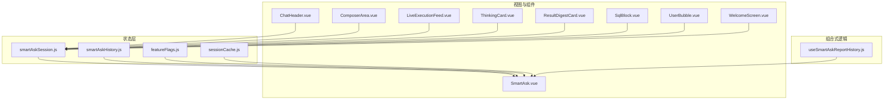
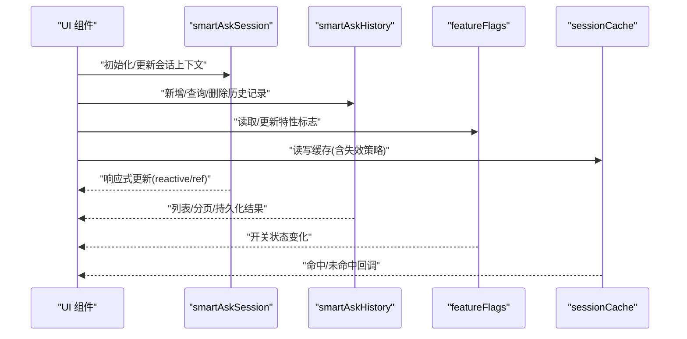
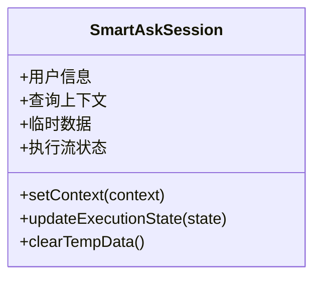
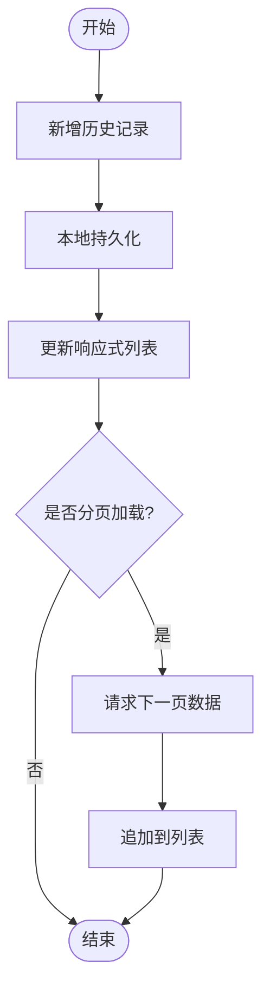
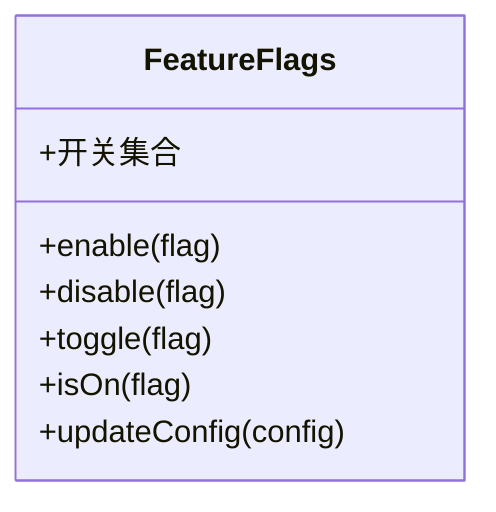
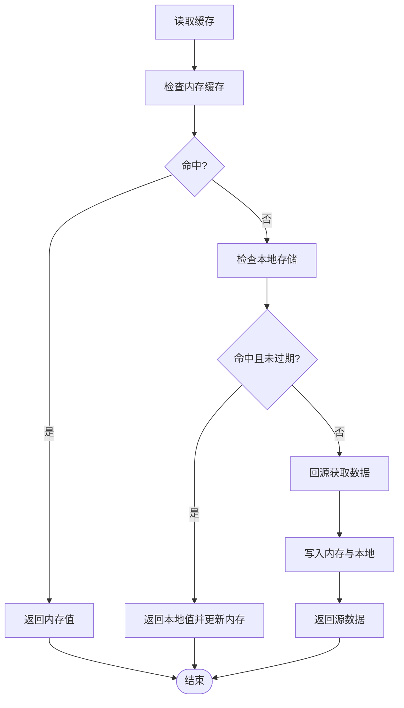
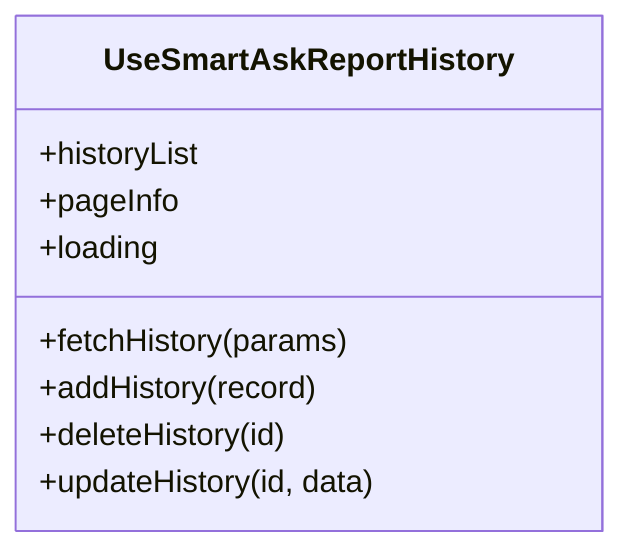
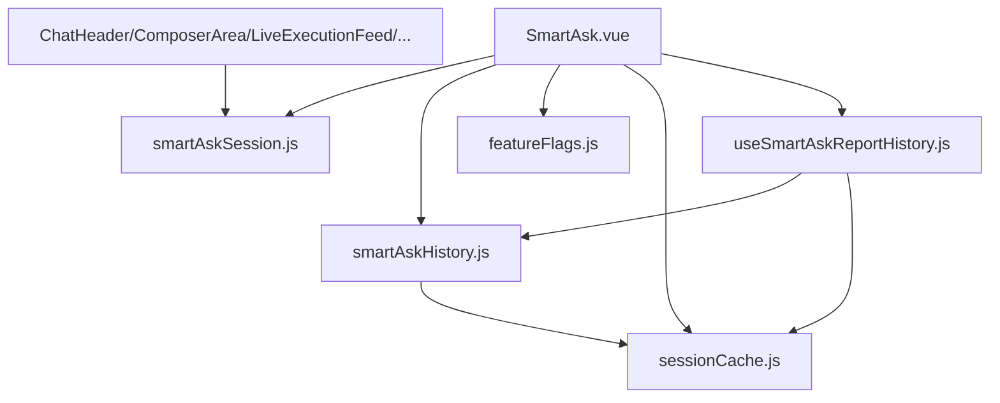

# 状态管理

<cite>
**本文引用的文件**   
- [frontend/src/state/smartAskSession.js](file://frontend/src/state/smartAskSession.js)
- [frontend/src/state/smartAskHistory.js](file://frontend/src/state/smartAskHistory.js)
- [frontend/src/state/featureFlags.js](file://frontend/src/state/featureFlags.js)
- [frontend/src/state/sessionCache.js](file://frontend/src/state/sessionCache.js)
- [frontend/src/composables/useSmartAskReportHistory.js](file://frontend/src/composables/useSmartAskReportHistory.js)
- [frontend/src/views/SmartAsk.vue](file://frontend/src/views/SmartAsk.vue)
- [frontend/src/components/smartask/ChatHeader.vue](file://frontend/src/components/smartask/ChatHeader.vue)
- [frontend/src/components/smartask/ComposerArea.vue](file://frontend/src/components/smartask/ComposerArea.vue)
- [frontend/src/components/smartask/LiveExecutionFeed.vue](file://frontend/src/components/smartask/LiveExecutionFeed.vue)
- [frontend/src/components/smartask/ThinkingCard.vue](file://frontend/src/components/smartask/ThinkingCard.vue)
- [frontend/src/components/smartask/ResultDigestCard.vue](file://frontend/src/components/smartask/ResultDigestCard.vue)
- [frontend/src/components/smartask/SqlBlock.vue](file://frontend/src/components/smartask/SqlBlock.vue)
- [frontend/src/components/smartask/UserBubble.vue](file://frontend/src/components/smartask/UserBubble.vue)
- [frontend/src/components/smartask/WelcomeScreen.vue](file://frontend/src/components/smartask/WelcomeScreen.vue)
- [frontend/src/main.js](file://frontend/src/main.js)
</cite>

## 目录
1. [简介](#简介)
2. [项目结构](#项目结构)
3. [核心组件](#核心组件)
4. [架构总览](#架构总览)
5. [详细组件分析](#详细组件分析)
6. [依赖关系分析](#依赖关系分析)
7. [性能考虑](#性能考虑)
8. [故障排查指南](#故障排查指南)
9. [结论](#结论)
10. [附录](#附录)

## 简介
本文件为 SmartAsk 智能问数平台的状态管理系统提供全面的开发文档。内容聚焦于基于 Vue.js 3 Composition API 的状态管理模式，涵盖 reactive、ref 的使用规范与最佳实践；深入解析 smartAskSession（会话状态）、smartAskHistory（历史记录）、featureFlags（特性标志）与 sessionCache（会话缓存）四大模块的设计与实现；并提供状态同步、响应式更新、性能优化与内存泄漏防护等最佳实践，以及调试技巧与示例路径，帮助开发者快速理解并高效扩展状态管理能力。

## 项目结构
前端状态管理相关代码集中在 frontend/src/state 目录下，并通过 composables 与视图/组件进行交互：
- state 层：定义会话、历史、特性标志、缓存等状态模块
- composables 层：封装可复用的组合式逻辑（如报告历史）
- views 与 components：消费状态，驱动 UI 渲染与用户交互

图表来源
- [frontend/src/state/smartAskSession.js](file://frontend/src/state/smartAskSession.js)
- [frontend/src/state/smartAskHistory.js](file://frontend/src/state/smartAskHistory.js)
- [frontend/src/state/featureFlags.js](file://frontend/src/state/featureFlags.js)
- [frontend/src/state/sessionCache.js](file://frontend/src/state/sessionCache.js)
- [frontend/src/composables/useSmartAskReportHistory.js](file://frontend/src/composables/useSmartAskReportHistory.js)
- [frontend/src/views/SmartAsk.vue](file://frontend/src/views/SmartAsk.vue)
- [frontend/src/components/smartask/ChatHeader.vue](file://frontend/src/components/smartask/ChatHeader.vue)
- [frontend/src/components/smartask/ComposerArea.vue](file://frontend/src/components/smartask/ComposerArea.vue)
- [frontend/src/components/smartask/LiveExecutionFeed.vue](file://frontend/src/components/smartask/LiveExecutionFeed.vue)
- [frontend/src/components/smartask/ThinkingCard.vue](file://frontend/src/components/smartask/ThinkingCard.vue)
- [frontend/src/components/smartask/ResultDigestCard.vue](file://frontend/src/components/smartask/ResultDigestCard.vue)
- [frontend/src/components/smartask/SqlBlock.vue](file://frontend/src/components/smartask/SqlBlock.vue)
- [frontend/src/components/smartask/UserBubble.vue](file://frontend/src/components/smartask/UserBubble.vue)
- [frontend/src/components/smartask/WelcomeScreen.vue](file://frontend/src/components/smartask/WelcomeScreen.vue)

章节来源
- [frontend/src/state/smartAskSession.js](file://frontend/src/state/smartAskSession.js)
- [frontend/src/state/smartAskHistory.js](file://frontend/src/state/smartAskHistory.js)
- [frontend/src/state/featureFlags.js](file://frontend/src/state/featureFlags.js)
- [frontend/src/state/sessionCache.js](file://frontend/src/state/sessionCache.js)
- [frontend/src/composables/useSmartAskReportHistory.js](file://frontend/src/composables/useSmartAskReportHistory.js)
- [frontend/src/views/SmartAsk.vue](file://frontend/src/views/SmartAsk.vue)

## 核心组件
本节概述四大状态模块的职责与边界：
- smartAskSession：维护当前会话的用户信息、查询上下文、临时数据与执行流状态
- smartAskHistory：管理查询历史的增删改查、分页加载与本地持久化
- featureFlags：提供功能开关、灰度发布与 A/B 测试支持，动态配置更新
- sessionCache：提供内存缓存与本地存储策略，包含缓存失效机制

章节来源
- [frontend/src/state/smartAskSession.js](file://frontend/src/state/smartAskSession.js)
- [frontend/src/state/smartAskHistory.js](file://frontend/src/state/smartAskHistory.js)
- [frontend/src/state/featureFlags.js](file://frontend/src/state/featureFlags.js)
- [frontend/src/state/sessionCache.js](file://frontend/src/state/sessionCache.js)

## 架构总览
状态管理采用“单一职责 + 组合式复用”的架构：state 层暴露响应式状态与操作方法，composables 层封装跨组件复用的业务逻辑，视图与组件通过导入使用。整体遵循单向数据流，避免循环依赖。

图表来源
- [frontend/src/state/smartAskSession.js](file://frontend/src/state/smartAskSession.js)
- [frontend/src/state/smartAskHistory.js](file://frontend/src/state/smartAskHistory.js)
- [frontend/src/state/featureFlags.js](file://frontend/src/state/featureFlags.js)
- [frontend/src/state/sessionCache.js](file://frontend/src/state/sessionCache.js)
- [frontend/src/views/SmartAsk.vue](file://frontend/src/views/SmartAsk.vue)

## 详细组件分析

### smartAskSession（会话状态）
- 职责：维护用户会话信息、查询上下文、临时数据与执行流状态
- 设计要点：
  - 使用 reactive 管理对象型状态，确保深层属性变更触发响应式更新
  - 使用 ref 管理基本类型或需要替换整个值的场景
  - 提供统一的 setter 方法，保证状态变更的可追踪性与一致性
  - 与组件通信时，优先传递最小必要字段，降低耦合
- 典型用法：
  - 在 ComposerArea 中设置查询上下文
  - 在 LiveExecutionFeed 中更新执行状态
  - 在 ThinkingCard/ResultDigestCard 中展示中间结果与最终摘要

图表来源
- [frontend/src/state/smartAskSession.js](file://frontend/src/state/smartAskSession.js)
- [frontend/src/components/smartask/ComposerArea.vue](file://frontend/src/components/smartask/ComposerArea.vue)
- [frontend/src/components/smartask/LiveExecutionFeed.vue](file://frontend/src/components/smartask/LiveExecutionFeed.vue)
- [frontend/src/components/smartask/ThinkingCard.vue](file://frontend/src/components/smartask/ThinkingCard.vue)
- [frontend/src/components/smartask/ResultDigestCard.vue](file://frontend/src/components/smartask/ResultDigestCard.vue)

章节来源
- [frontend/src/state/smartAskSession.js](file://frontend/src/state/smartAskSession.js)
- [frontend/src/components/smartask/ComposerArea.vue](file://frontend/src/components/smartask/ComposerArea.vue)
- [frontend/src/components/smartask/LiveExecutionFeed.vue](file://frontend/src/components/smartask/LiveExecutionFeed.vue)
- [frontend/src/components/smartask/ThinkingCard.vue](file://frontend/src/components/smartask/ThinkingCard.vue)
- [frontend/src/components/smartask/ResultDigestCard.vue](file://frontend/src/components/smartask/ResultDigestCard.vue)

### smartAskHistory（历史记录）
- 职责：查询历史的增删改查、本地持久化、分页加载
- 设计要点：
  - 使用 reactive 管理历史列表，ref 管理分页参数与加载状态
  - 提供 add/remove/update/query 等方法，统一操作入口
  - 本地持久化通过 localStorage 或 IndexedDB（根据规模选择），注意序列化与异常处理
  - 分页加载结合虚拟滚动或懒加载提升性能
- 典型流程：新增记录 -> 持久化 -> 列表刷新 -> 分页加载下一页

图表来源
- [frontend/src/state/smartAskHistory.js](file://frontend/src/state/smartAskHistory.js)
- [frontend/src/composables/useSmartAskReportHistory.js](file://frontend/src/composables/useSmartAskReportHistory.js)

章节来源
- [frontend/src/state/smartAskHistory.js](file://frontend/src/state/smartAskHistory.js)
- [frontend/src/composables/useSmartAskReportHistory.js](file://frontend/src/composables/useSmartAskReportHistory.js)

### featureFlags（特性标志）
- 职责：功能开关、灰度发布、A/B 测试支持、动态配置更新
- 设计要点：
  - 使用 reactive 管理全局开关集合，便于集中管理与监听
  - 提供 enable/disable/toggle 等方法，支持按用户/租户维度控制
  - 动态配置更新可通过后端接口拉取或本地配置文件热更新
  - 与路由/组件级权限结合，实现细粒度功能控制
- 典型场景：新功能灰度投放、实验组分流、按需加载模块

图表来源
- [frontend/src/state/featureFlags.js](file://frontend/src/state/featureFlags.js)

章节来源
- [frontend/src/state/featureFlags.js](file://frontend/src/state/featureFlags.js)

### sessionCache（会话缓存）
- 职责：内存缓存与本地存储策略，缓存失效机制
- 设计要点：
  - 内存缓存使用 Map/Set，提高读取性能
  - 本地存储使用 localStorage/sessionStorage，注意容量限制与序列化开销
  - 失效策略包括 TTL（时间戳）、LRU（最近最少使用）、主动清除
  - 提供 get/set/delete/clear 等方法，统一访问接口
- 典型流程：读取缓存 -> 命中返回 -> 未命中回源 -> 写入缓存 -> 过期清理

图表来源
- [frontend/src/state/sessionCache.js](file://frontend/src/state/sessionCache.js)

章节来源
- [frontend/src/state/sessionCache.js](file://frontend/src/state/sessionCache.js)

### useSmartAskReportHistory（组合式逻辑）
- 职责：封装报告历史相关的查询、分页、持久化逻辑，供多组件复用
- 设计要点：
  - 使用组合式函数暴露响应式状态与方法
  - 内部调用 smartAskHistory 与 sessionCache，解耦具体实现
  - 提供错误处理与重试机制，提升健壮性

图表来源
- [frontend/src/composables/useSmartAskReportHistory.js](file://frontend/src/composables/useSmartAskReportHistory.js)
- [frontend/src/state/smartAskHistory.js](file://frontend/src/state/smartAskHistory.js)
- [frontend/src/state/sessionCache.js](file://frontend/src/state/sessionCache.js)

章节来源
- [frontend/src/composables/useSmartAskReportHistory.js](file://frontend/src/composables/useSmartAskReportHistory.js)

## 依赖关系分析
状态模块之间保持低耦合，通过明确的接口进行交互，避免循环依赖。视图与组件仅依赖 state 与 composables，不直接操作底层存储。

图表来源
- [frontend/src/state/smartAskSession.js](file://frontend/src/state/smartAskSession.js)
- [frontend/src/state/smartAskHistory.js](file://frontend/src/state/smartAskHistory.js)
- [frontend/src/state/featureFlags.js](file://frontend/src/state/featureFlags.js)
- [frontend/src/state/sessionCache.js](file://frontend/src/state/sessionCache.js)
- [frontend/src/composables/useSmartAskReportHistory.js](file://frontend/src/composables/useSmartAskReportHistory.js)
- [frontend/src/views/SmartAsk.vue](file://frontend/src/views/SmartAsk.vue)
- [frontend/src/components/smartask/ChatHeader.vue](file://frontend/src/components/smartask/ChatHeader.vue)
- [frontend/src/components/smartask/ComposerArea.vue](file://frontend/src/components/smartask/ComposerArea.vue)
- [frontend/src/components/smartask/LiveExecutionFeed.vue](file://frontend/src/components/smartask/LiveExecutionFeed.vue)

章节来源
- [frontend/src/state/smartAskSession.js](file://frontend/src/state/smartAskSession.js)
- [frontend/src/state/smartAskHistory.js](file://frontend/src/state/smartAskHistory.js)
- [frontend/src/state/featureFlags.js](file://frontend/src/state/featureFlags.js)
- [frontend/src/state/sessionCache.js](file://frontend/src/state/sessionCache.js)
- [frontend/src/composables/useSmartAskReportHistory.js](file://frontend/src/composables/useSmartAskReportHistory.js)
- [frontend/src/views/SmartAsk.vue](file://frontend/src/views/SmartAsk.vue)
- [frontend/src/components/smartask/ChatHeader.vue](file://frontend/src/components/smartask/ChatHeader.vue)
- [frontend/src/components/smartask/ComposerArea.vue](file://frontend/src/components/smartask/ComposerArea.vue)
- [frontend/src/components/smartask/LiveExecutionFeed.vue](file://frontend/src/components/smartask/LiveExecutionFeed.vue)

## 性能考虑
- 响应式更新：
  - 合理使用 reactive 与 ref，避免不必要的深监听
  - 使用 computed 派生状态，减少重复计算
- 内存管理：
  - 及时清理事件监听器与定时器，防止内存泄漏
  - 大列表使用虚拟滚动或分页加载
- 缓存策略：
  - 合理设置 TTL 与 LRU，平衡命中率与内存占用
  - 避免频繁序列化/反序列化大对象
- I/O 优化：
  - 合并多次本地存储操作，减少磁盘 IO
  - 异步操作使用 Promise 链或 async/await，避免阻塞主线程

## 故障排查指南
- 常见问题：
  - 状态未更新：检查是否正确使用了 reactive/ref，是否在 setter 中更新
  - 缓存未命中：确认 key 一致性与过期策略
  - 历史记录丢失：检查本地存储权限与容量限制
  - 特性标志不生效：确认配置更新与组件订阅
- 调试技巧：
  - 使用 Vue DevTools 观察响应式状态变化
  - 在关键方法中添加日志输出，追踪数据流
  - 模拟异常场景，验证错误处理与恢复逻辑

## 结论
SmartAsk 的状态管理系统以清晰的模块化设计与响应式更新为核心，结合缓存与持久化策略，提供了高性能、可扩展的状态管理能力。通过遵循本文档的最佳实践与调试技巧，开发者可以快速构建稳定、易维护的前端应用。

## 附录
- 最佳实践清单：
  - 使用 reactive 管理对象型状态，ref 管理基本类型
  - 统一 setter 方法，保证状态变更可追踪
  - 合理设计缓存策略，避免内存泄漏
  - 使用组合式函数封装复用逻辑
  - 充分测试异常场景与边界条件
- 参考文件：
  - [frontend/src/main.js](file://frontend/src/main.js)
  - [frontend/src/views/SmartAsk.vue](file://frontend/src/views/SmartAsk.vue)
  - [frontend/src/components/smartask/UserBubble.vue](file://frontend/src/components/smartask/UserBubble.vue)
  - [frontend/src/components/smartask/WelcomeScreen.vue](file://frontend/src/components/smartask/WelcomeScreen.vue)
  - [frontend/src/components/smartask/SqlBlock.vue](file://frontend/src/components/smartask/SqlBlock.vue)