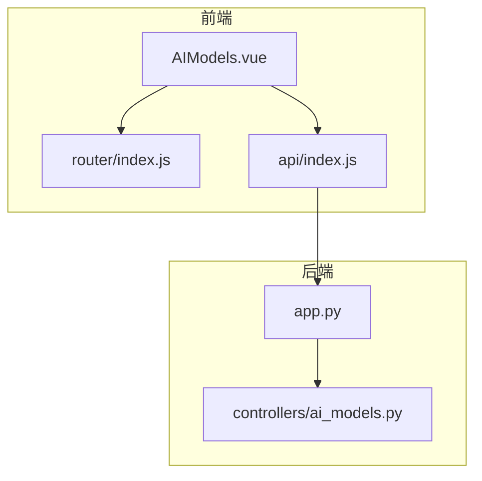
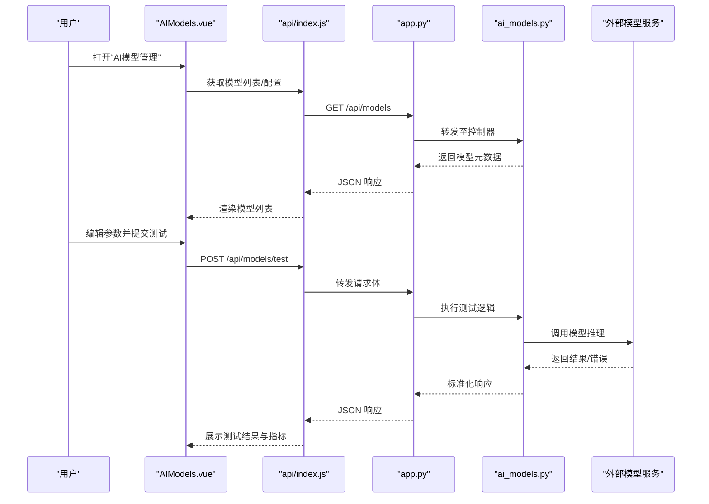
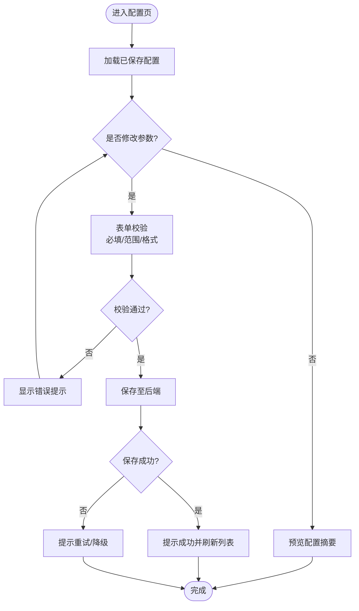
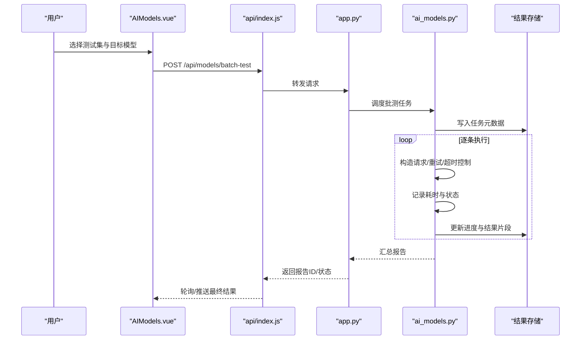
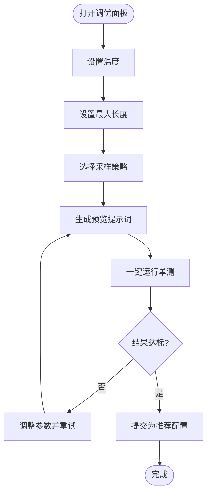
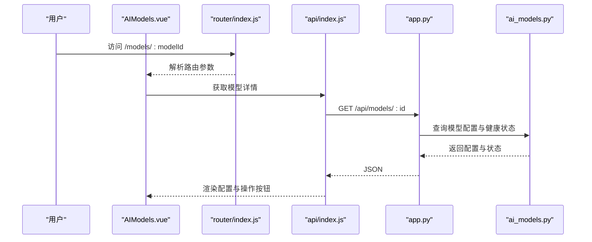
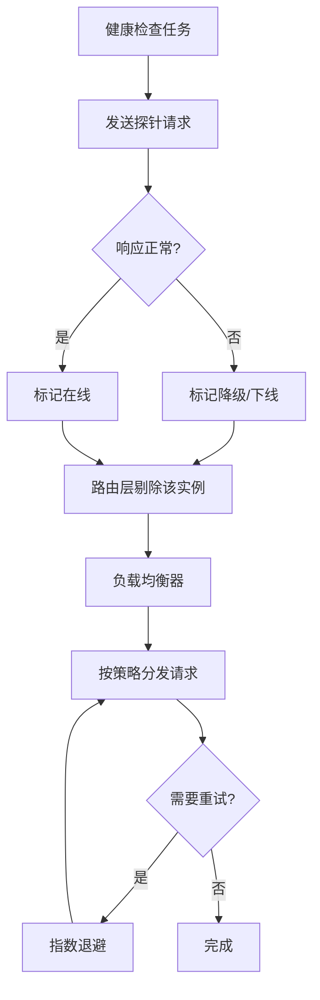
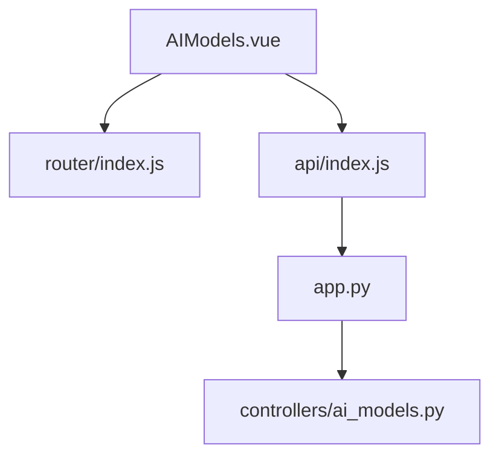

# AI模型管理页面

<cite>
**本文引用的文件**   
- [AIModels.vue](file://frontend/src/views/AIModels.vue)
- [index.js](file://frontend/src/router/index.js)
- [api/index.js](file://frontend/src/api/index.js)
- [ai_models.py](file://backend/controllers/ai_models.py)
- [app.py](file://backend/app.py)
</cite>

## 目录
1. [简介](#简介)
2. [项目结构](#项目结构)
3. [核心组件](#核心组件)
4. [架构总览](#架构总览)
5. [详细组件分析](#详细组件分析)
6. [依赖关系分析](#依赖关系分析)
7. [性能考量](#性能考量)
8. [故障排查指南](#故障排查指南)
9. [结论](#结论)
10. [附录](#附录)

## 简介
本文件为“AI模型管理页面”的开发文档，围绕前端页面 AIModels.vue 与后端控制器 ai_models.py 的交互，系统阐述模型配置、参数调优、性能监控、测试能力、路由与切换、健康检查、自动重试与负载均衡等高级能力的实现方案与最佳实践。文档面向开发者与产品实施人员，既提供高层架构视图，也给出代码级流程图与时序图，帮助快速定位问题与扩展功能。

## 项目结构
本项目采用前后端分离架构：
- 前端：Vue 单页应用，页面位于 frontend/src/views/AIModels.vue，路由在 frontend/src/router/index.js，API 调用封装在 frontend/src/api/index.js。
- 后端：Python 服务，模型相关接口集中在 backend/controllers/ai_models.py，应用入口与路由挂载在 backend/app.py。

图表来源
- [AIModels.vue](file://frontend/src/views/AIModels.vue)
- [index.js](file://frontend/src/router/index.js)
- [api/index.js](file://frontend/src/api/index.js)
- [app.py](file://backend/app.py)
- [ai_models.py](file://backend/controllers/ai_models.py)

章节来源
- [AIModels.vue](file://frontend/src/views/AIModels.vue)
- [index.js](file://frontend/src/router/index.js)
- [api/index.js](file://frontend/src/api/index.js)
- [ai_models.py](file://backend/controllers/ai_models.py)
- [app.py](file://backend/app.py)

## 核心组件
- 模型配置界面：支持选择模型供应商/名称、配置 API Key、设置请求参数（如温度、最大长度、采样策略等），并提供保存与校验。
- 模型测试：支持单条测试与批量测试，展示响应结果、耗时、状态码与错误信息，便于对比不同配置的效果。
- 参数调优：以表单形式暴露关键生成参数，支持实时预览与回滚。
- 性能监控：统计响应时间、成功率、失败原因分布，并可视化资源使用率（CPU/内存/并发）。
- 模型切换与路由：通过路由参数或全局状态切换当前生效的模型实例。
- 高级能力：健康检查、自动重试、负载均衡（多实例或多密钥轮询）。

章节来源
- [AIModels.vue](file://frontend/src/views/AIModels.vue)
- [ai_models.py](file://backend/controllers/ai_models.py)

## 架构总览
整体数据流遵循“前端页面 → API 封装 → 后端控制器 → 外部模型服务”的链路。前端负责用户交互与状态管理；后端提供统一的模型管理与测试接口，并对上游模型服务进行适配与容错。

图表来源
- [AIModels.vue](file://frontend/src/views/AIModels.vue)
- [api/index.js](file://frontend/src/api/index.js)
- [app.py](file://backend/app.py)
- [ai_models.py](file://backend/controllers/ai_models.py)

## 详细组件分析

### 模型配置界面
- 模型选择：下拉框展示可用模型，支持按供应商分组与搜索过滤。
- API 密钥配置：输入框支持明文/密文切换，保存前进行格式校验与连通性探测。
- 请求参数设置：温度、最大长度、Top-P、Top-K、停止词等字段，带默认值与范围限制。
- 保存与校验：本地缓存 + 远端持久化，提交时触发必填项与类型校验，失败回滚。

图表来源
- [AIModels.vue](file://frontend/src/views/AIModels.vue)
- [api/index.js](file://frontend/src/api/index.js)
- [ai_models.py](file://backend/controllers/ai_models.py)

章节来源
- [AIModels.vue](file://frontend/src/views/AIModels.vue)
- [api/index.js](file://frontend/src/api/index.js)
- [ai_models.py](file://backend/controllers/ai_models.py)

### 模型测试功能
- 测试用例管理：支持导入/导出测试集，维护用例标签与优先级。
- 单测与批测：单条即时验证，批量异步执行并聚合结果。
- 结果对比：同一次运行内对比不同模型/参数的输出差异，展示耗时、状态码、错误信息。
- 结果存储：将测试结果与配置快照关联，便于回溯。

图表来源
- [AIModels.vue](file://frontend/src/views/AIModels.vue)
- [api/index.js](file://frontend/src/api/index.js)
- [app.py](file://backend/app.py)
- [ai_models.py](file://backend/controllers/ai_models.py)

章节来源
- [AIModels.vue](file://frontend/src/views/AIModels.vue)
- [api/index.js](file://frontend/src/api/index.js)
- [ai_models.py](file://backend/controllers/ai_models.py)

### 参数调优界面
- 温度（temperature）：控制随机性，建议区间与默认值提示。
- 最大长度（max_length）：限制输出 token 数量，防止超长响应。
- 采样策略：Top-P、Top-K、惩罚系数等，影响多样性与稳定性。
- 实时预览：根据参数变化动态生成示例提示词与预期效果说明。

图表来源
- [AIModels.vue](file://frontend/src/views/AIModels.vue)
- [api/index.js](file://frontend/src/api/index.js)
- [ai_models.py](file://backend/controllers/ai_models.py)

章节来源
- [AIModels.vue](file://frontend/src/views/AIModels.vue)
- [api/index.js](file://frontend/src/api/index.js)
- [ai_models.py](file://backend/controllers/ai_models.py)

### 性能监控
- 响应时间统计：P50/P90/P99 分位、均值、方差。
- 成功率监控：按模型/参数维度统计成功与失败比例，失败原因分类。
- 资源使用率：CPU、内存、并发数、队列长度趋势。
- 告警规则：阈值触发通知，支持邮件/IM 集成。

章节来源
- [ai_models.py](file://backend/controllers/ai_models.py)

### 模型切换与路由配置
- 路由参数：通过 URL 路径或查询参数指定模型 ID，页面根据路由初始化对应配置。
- 全局状态：在多标签页或会话中保持当前激活模型，避免重复加载。
- 切换策略：支持热切换与冷切换，切换前进行健康检查与预热。

图表来源
- [index.js](file://frontend/src/router/index.js)
- [AIModels.vue](file://frontend/src/views/AIModels.vue)
- [api/index.js](file://frontend/src/api/index.js)
- [app.py](file://backend/app.py)
- [ai_models.py](file://backend/controllers/ai_models.py)

章节来源
- [index.js](file://frontend/src/router/index.js)
- [AIModels.vue](file://frontend/src/views/AIModels.vue)
- [api/index.js](file://frontend/src/api/index.js)
- [app.py](file://backend/app.py)
- [ai_models.py](file://backend/controllers/ai_models.py)

### 高级功能：健康检查、自动重试、负载均衡
- 健康检查：定时探测模型可用性（握手/轻量请求），标记在线/离线/退化。
- 自动重试：对瞬时错误（网络抖动、限流）进行指数退避重试，可配置最大次数与间隔。
- 负载均衡：多实例或多密钥轮询，按延迟/成功率权重分配流量，支持熔断与隔离。

章节来源
- [ai_models.py](file://backend/controllers/ai_models.py)

## 依赖关系分析
- 前端依赖：
  - Vue 组件与路由：AIModels.vue 依赖 router/index.js 进行导航与参数解析。
  - API 封装：api/index.js 统一处理请求头、鉴权、错误映射与重试。
- 后端依赖：
  - 应用入口 app.py 挂载控制器路由。
  - 控制器 ai_models.py 实现模型配置、测试、监控与高级能力。

图表来源
- [AIModels.vue](file://frontend/src/views/AIModels.vue)
- [index.js](file://frontend/src/router/index.js)
- [api/index.js](file://frontend/src/api/index.js)
- [app.py](file://backend/app.py)
- [ai_models.py](file://backend/controllers/ai_models.py)

章节来源
- [AIModels.vue](file://frontend/src/views/AIModels.vue)
- [index.js](file://frontend/src/router/index.js)
- [api/index.js](file://frontend/src/api/index.js)
- [app.py](file://backend/app.py)
- [ai_models.py](file://backend/controllers/ai_models.py)

## 性能考量
- 前端：
  - 懒加载与分页：模型列表与测试结果分页加载，减少首屏压力。
  - 防抖与节流：输入框与搜索框防抖，批量测试启动节流。
  - 缓存策略：只读配置本地缓存，变更时失效。
- 后端：
  - 连接池与超时：对外部模型服务的连接池、读写超时与重试上限。
  - 异步任务：批测与监控聚合使用异步队列，避免阻塞主线程。
  - 指标采集：低开销计数器与滑动窗口统计，降低监控开销。

[本节为通用指导，不直接分析具体文件]

## 故障排查指南
- 常见问题：
  - API Key 无效或权限不足：检查密钥格式与权限范围，必要时重新申请。
  - 模型不可用：查看健康检查状态与最近探针结果，确认供应商侧服务状态。
  - 超时与限流：增加重试次数与退避间隔，或切换到备用实例。
  - 参数非法：检查温度、最大长度等是否在允许范围内。
- 排查步骤：
  - 前端控制台查看请求/响应与错误堆栈。
  - 后端日志检索错误码与异常上下文。
  - 使用健康检查与探针工具验证端到端连通性。
  - 回放测试用例，缩小问题范围。

章节来源
- [ai_models.py](file://backend/controllers/ai_models.py)

## 结论
AI模型管理页面通过清晰的前后端分层与模块化设计，实现了模型配置、参数调优、测试与监控的一体化能力。借助健康检查、自动重试与负载均衡等高级机制，系统在可用性、稳定性与可扩展性方面具备良好基础。建议在后续迭代中完善指标体系与告警策略，持续优化用户体验与运维效率。

[本节为总结性内容，不直接分析具体文件]

## 附录
- 术语表：
  - 温度（temperature）：控制生成随机性的参数。
  - Top-P/Top-K：采样策略参数，影响多样性与质量。
  - 健康检查：周期性探测模型可用性的机制。
  - 负载均衡：在多实例间分配流量的策略。
- 参考文件：
  - 前端页面与路由：AIModels.vue、router/index.js
  - API 封装：api/index.js
  - 后端控制器与应用入口：ai_models.py、app.py

[本节为补充信息，不直接分析具体文件]