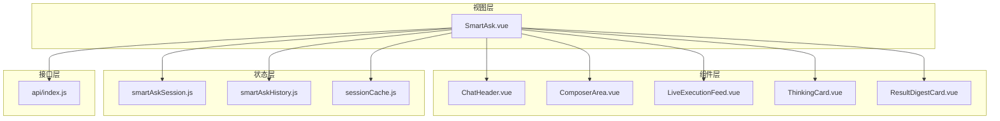
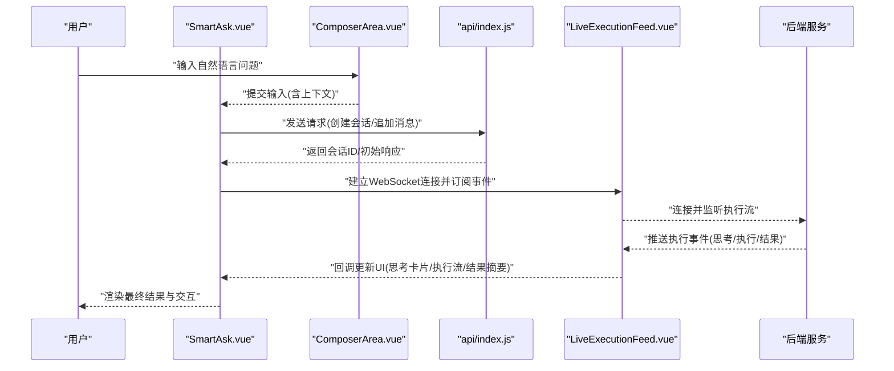
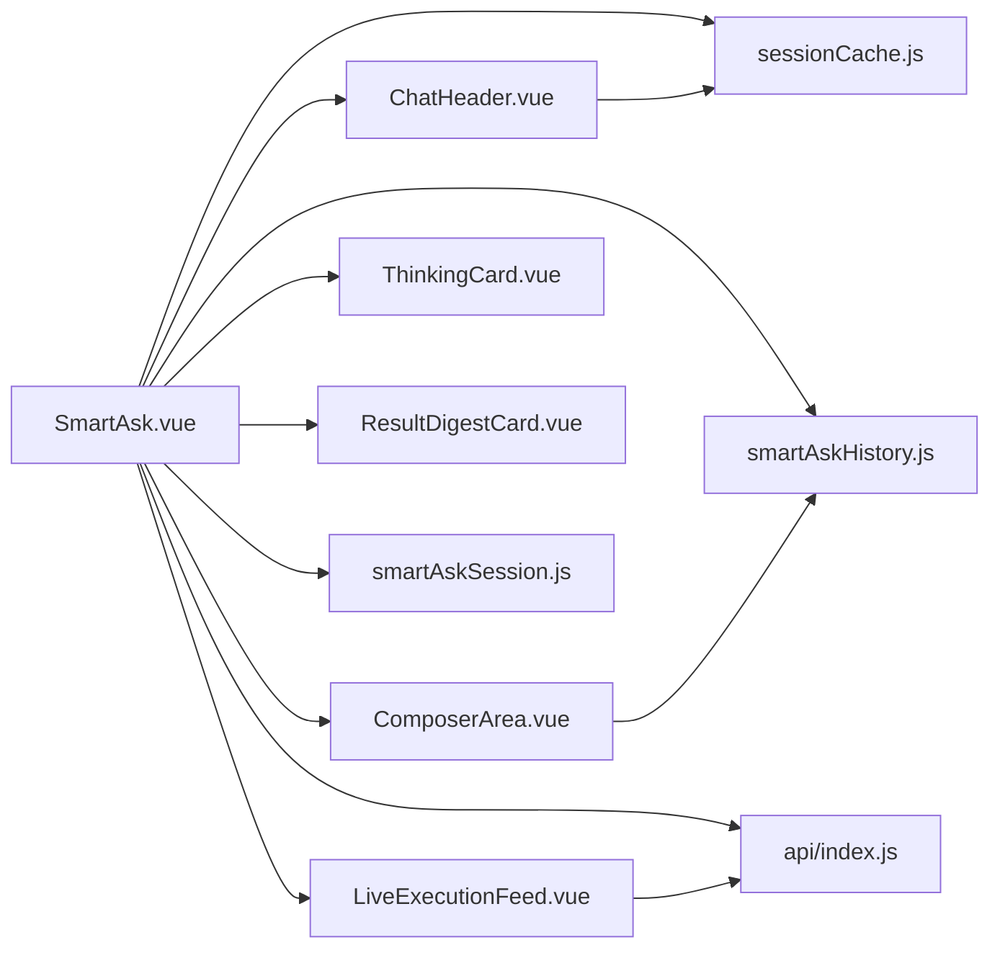

# SmartAsk主页面组件

<cite>
**本文档引用的文件**   
- [SmartAsk.vue](file://frontend/src/views/SmartAsk.vue)
- [ChatHeader.vue](file://frontend/src/components/smartask/ChatHeader.vue)
- [ComposerArea.vue](file://frontend/src/components/smartask/ComposerArea.vue)
- [LiveExecutionFeed.vue](file://frontend/src/components/smartask/LiveExecutionFeed.vue)
- [ThinkingCard.vue](file://frontend/src/components/smartask/ThinkingCard.vue)
- [ResultDigestCard.vue](file://frontend/src/components/smartask/ResultDigestCard.vue)
- [smartAskSession.js](file://frontend/src/state/smartAskSession.js)
- [smartAskHistory.js](file://frontend/src/state/smartAskHistory.js)
- [sessionCache.js](file://frontend/src/state/sessionCache.js)
- [index.js](file://frontend/src/api/index.js)
</cite>

## 目录
1. [简介](#简介)
2. [项目结构](#项目结构)
3. [核心组件](#核心组件)
4. [架构总览](#架构总览)
5. [详细组件分析](#详细组件分析)
6. [依赖关系分析](#依赖关系分析)
7. [性能考虑](#性能考虑)
8. [故障排查指南](#故障排查指南)
9. [结论](#结论)
10. [附录](#附录)

## 简介
本文件面向 SmartAsk 前端主页面与相关子组件的开发与维护，聚焦以下目标：
- 自然语言输入处理流程：从用户输入到后端执行、实时流式反馈与结果渲染。
- 查询历史管理：会话状态、历史消息持久化与恢复。
- 结果展示布局设计：思考卡片、执行流、结果摘要等模块的组织与交互。
- 聊天头部 ChatHeader：会话状态显示、操作按钮、用户信息展示。
- 输入区域 ComposerArea：文本输入、快捷指令、历史记录加载。
- 实时执行流 LiveExecutionFeed：WebSocket 连接、消息接收与渲染机制。
- 思考卡片 ThinkingCard：状态管理与动画效果。
- 结果摘要 ResultDigestCard：数据展示与交互功能。
- 多轮对话支持：上下文管理与状态保持方案。
- 错误处理、性能优化与用户体验优化实践。

## 项目结构
SmartAsk 主页面位于 views 层，由多个 smartask 子组件组合而成；状态集中在 state 层，API 调用封装在 api 层。整体采用“视图-组件-状态-API”的分层组织方式，便于职责分离与可维护性。

图表来源
- [SmartAsk.vue](file://frontend/src/views/SmartAsk.vue)
- [ChatHeader.vue](file://frontend/src/components/smartask/ChatHeader.vue)
- [ComposerArea.vue](file://frontend/src/components/smartask/ComposerArea.vue)
- [LiveExecutionFeed.vue](file://frontend/src/components/smartask/LiveExecutionFeed.vue)
- [ThinkingCard.vue](file://frontend/src/components/smartask/ThinkingCard.vue)
- [ResultDigestCard.vue](file://frontend/src/components/smartask/ResultDigestCard.vue)
- [smartAskSession.js](file://frontend/src/state/smartAskSession.js)
- [smartAskHistory.js](file://frontend/src/state/smartAskHistory.js)
- [sessionCache.js](file://frontend/src/state/sessionCache.js)
- [index.js](file://frontend/src/api/index.js)

章节来源
- [SmartAsk.vue](file://frontend/src/views/SmartAsk.vue)
- [smartAskSession.js](file://frontend/src/state/smartAskSession.js)
- [smartAskHistory.js](file://frontend/src/state/smartAskHistory.js)
- [sessionCache.js](file://frontend/src/state/sessionCache.js)
- [index.js](file://frontend/src/api/index.js)

## 核心组件
- SmartAsk.vue：主页面容器，协调各子组件、管理会话与消息流、控制布局与交互。
- ChatHeader.vue：顶部栏，显示当前会话状态、操作按钮（新建、清空、导出等）、用户信息。
- ComposerArea.vue：输入区，支持文本输入、快捷指令、历史消息快速加载。
- LiveExecutionFeed.vue：实时执行流，负责 WebSocket 连接、事件订阅、消息渲染。
- ThinkingCard.vue：思考阶段卡片，展示推理步骤、状态切换与动画。
- ResultDigestCard.vue：结果摘要卡片，展示关键指标、图表或表格，并提供交互操作。

章节来源
- [SmartAsk.vue](file://frontend/src/views/SmartAsk.vue)
- [ChatHeader.vue](file://frontend/src/components/smartask/ChatHeader.vue)
- [ComposerArea.vue](file://frontend/src/components/smartask/ComposerArea.vue)
- [LiveExecutionFeed.vue](file://frontend/src/components/smartask/LiveExecutionFeed.vue)
- [ThinkingCard.vue](file://frontend/src/components/smartask/ThinkingCard.vue)
- [ResultDigestCard.vue](file://frontend/src/components/smartask/ResultDigestCard.vue)

## 架构总览
SmartAsk 主页面通过状态管理维护会话上下文，将用户输入转化为后端请求，并通过 WebSocket 接收实时执行事件，驱动 UI 更新。整体数据流如下：

图表来源
- [SmartAsk.vue](file://frontend/src/views/SmartAsk.vue)
- [ComposerArea.vue](file://frontend/src/components/smartask/ComposerArea.vue)
- [LiveExecutionFeed.vue](file://frontend/src/components/smartask/LiveExecutionFeed.vue)
- [index.js](file://frontend/src/api/index.js)

## 详细组件分析

### SmartAsk.vue 主页面
- 职责
  - 编排 ChatHeader、ComposerArea、LiveExecutionFeed、ThinkingCard、ResultDigestCard。
  - 维护会话状态（会话ID、消息列表、执行状态）。
  - 处理用户输入，触发 API 调用与 WebSocket 连接。
  - 管理查询历史与缓存，支持多轮对话上下文传递。
- 关键流程
  - 输入处理：校验输入、组装上下文、调用 API 创建会话或追加消息。
  - 实时流：根据会话ID建立 WebSocket，订阅事件并映射为 UI 状态。
  - 结果渲染：将执行事件转换为思考卡片、执行流条目与结果摘要。
  - 历史管理：保存历史消息、会话元数据，支持恢复与导出。
- 错误处理
  - 网络异常重试与降级提示。
  - WebSocket 断线重连策略。
  - 业务错误码解析与用户友好提示。

章节来源
- [SmartAsk.vue](file://frontend/src/views/SmartAsk.vue)
- [smartAskSession.js](file://frontend/src/state/smartAskSession.js)
- [smartAskHistory.js](file://frontend/src/state/smartAskHistory.js)
- [sessionCache.js](file://frontend/src/state/sessionCache.js)
- [index.js](file://frontend/src/api/index.js)

### ChatHeader.vue 聊天头部
- 功能
  - 显示当前会话状态（空闲、思考中、执行中、完成、失败）。
  - 操作按钮：新建会话、清空历史、导出结果、切换主题等。
  - 用户信息展示：头像、昵称、权限标识。
- 交互
  - 点击新建会话时重置状态并清空输入区。
  - 点击清空历史时确认并清理本地存储。
  - 导出结果时生成结构化数据或报告。
- 状态同步
  - 与 SmartAsk.vue 的会话状态双向绑定。
  - 与 sessionCache.js 的缓存策略联动。

章节来源
- [ChatHeader.vue](file://frontend/src/components/smartask/ChatHeader.vue)
- [smartAskSession.js](file://frontend/src/state/smartAskSession.js)
- [sessionCache.js](file://frontend/src/state/sessionCache.js)

### ComposerArea.vue 输入区域
- 功能
  - 文本输入框，支持多行输入与快捷键（如 Enter 发送）。
  - 快捷指令：预设常用查询模板、数据集选择、时间范围等。
  - 历史记录加载：从本地缓存或会话历史中快速填充输入。
- 实现要点
  - 输入校验与防抖处理。
  - 快捷指令解析与参数补全。
  - 与 SmartAsk.vue 的事件通信（提交、取消、加载历史）。

章节来源
- [ComposerArea.vue](file://frontend/src/components/smartask/ComposerArea.vue)
- [smartAskHistory.js](file://frontend/src/state/smartAskHistory.js)
- [sessionCache.js](file://frontend/src/state/sessionCache.js)

### LiveExecutionFeed.vue 实时执行流
- 功能
  - WebSocket 连接管理：建立、心跳、断线重连。
  - 消息接收与分类：思考事件、执行步骤、结果片段、错误信息。
  - 渲染机制：增量更新执行流条目，支持滚动与定位。
- 关键逻辑
  - 事件映射：将后端事件类型映射为 UI 状态。
  - 状态机：跟踪执行阶段（开始、进行中、完成、失败）。
  - 性能优化：虚拟滚动、去重合并、节流渲染。
- 错误处理
  - 连接失败重试与降级为轮询。
  - 消息解析异常捕获与日志记录。

章节来源
- [LiveExecutionFeed.vue](file://frontend/src/components/smartask/LiveExecutionFeed.vue)
- [index.js](file://frontend/src/api/index.js)

### ThinkingCard.vue 思考卡片
- 功能
  - 展示推理步骤与中间结果。
  - 状态管理：未开始、进行中、已完成、失败。
  - 动画效果：打字机效果、进度条、折叠展开。
- 实现要点
  - 与 LiveExecutionFeed 的思考事件联动。
  - 使用过渡动画提升用户体验。
  - 支持复制、分享、收藏等操作。

章节来源
- [ThinkingCard.vue](file://frontend/src/components/smartask/ThinkingCard.vue)
- [LiveExecutionFeed.vue](file://frontend/src/components/smartask/LiveExecutionFeed.vue)

### ResultDigestCard.vue 结果摘要
- 功能
  - 展示关键指标、图表、表格等结构化结果。
  - 交互功能：筛选、排序、导出、钻取。
  - 数据绑定：与后端返回的结果数据结构对齐。
- 实现要点
  - 动态渲染不同结果类型（文本、图表、表格）。
  - 懒加载大数据集，避免卡顿。
  - 与 SmartAsk.vue 的上下文联动，支持后续追问。

章节来源
- [ResultDigestCard.vue](file://frontend/src/components/smartask/ResultDigestCard.vue)
- [smartAskSession.js](file://frontend/src/state/smartAskSession.js)

## 依赖关系分析
SmartAsk 主页面与各组件及状态模块之间的依赖关系如下：

图表来源
- [SmartAsk.vue](file://frontend/src/views/SmartAsk.vue)
- [ChatHeader.vue](file://frontend/src/components/smartask/ChatHeader.vue)
- [ComposerArea.vue](file://frontend/src/components/smartask/ComposerArea.vue)
- [LiveExecutionFeed.vue](file://frontend/src/components/smartask/LiveExecutionFeed.vue)
- [ThinkingCard.vue](file://frontend/src/components/smartask/ThinkingCard.vue)
- [ResultDigestCard.vue](file://frontend/src/components/smartask/ResultDigestCard.vue)
- [smartAskSession.js](file://frontend/src/state/smartAskSession.js)
- [smartAskHistory.js](file://frontend/src/state/smartAskHistory.js)
- [sessionCache.js](file://frontend/src/state/sessionCache.js)
- [index.js](file://frontend/src/api/index.js)

章节来源
- [SmartAsk.vue](file://frontend/src/views/SmartAsk.vue)
- [index.js](file://frontend/src/api/index.js)

## 性能考虑
- 渲染优化
  - 使用虚拟滚动减少长列表渲染开销。
  - 按需加载大组件与图表库。
  - 防抖与节流输入与搜索。
- 网络优化
  - WebSocket 心跳保活与断线重连。
  - 请求合并与缓存策略。
  - 错误降级与离线模式。
- 内存管理
  - 及时释放事件监听器与定时器。
  - 清理大型对象与图片资源。
  - 限制历史消息数量与缓存大小。

[本节为通用指导，不直接分析具体文件]

## 故障排查指南
- WebSocket 连接问题
  - 检查网络连接与代理设置。
  - 查看浏览器控制台错误日志。
  - 验证后端 WebSocket 端点地址与鉴权。
- 消息渲染异常
  - 检查事件类型映射是否正确。
  - 验证数据结构与字段完整性。
  - 查看 LiveExecutionFeed 的错误处理逻辑。
- 状态不同步
  - 核对会话状态与 UI 状态的一致性。
  - 检查状态更新是否被正确触发。
  - 验证缓存与本地存储的读写逻辑。
- 性能瓶颈
  - 使用浏览器性能面板分析渲染耗时。
  - 检查是否存在重复计算与无效渲染。
  - 优化大数据集的处理与展示。

章节来源
- [LiveExecutionFeed.vue](file://frontend/src/components/smartask/LiveExecutionFeed.vue)
- [smartAskSession.js](file://frontend/src/state/smartAskSession.js)
- [sessionCache.js](file://frontend/src/state/sessionCache.js)

## 结论
SmartAsk 主页面通过清晰的组件分层与状态管理，实现了自然语言问数的完整流程。各子组件职责明确，协作顺畅，具备良好的可维护性与扩展性。通过 WebSocket 实时反馈与丰富的交互设计，提供了优秀的用户体验。建议在后续迭代中持续优化性能与错误处理，进一步提升系统的稳定性与可用性。

[本节为总结性内容，不直接分析具体文件]

## 附录
- 多轮对话支持方案
  - 上下文管理：维护会话历史与上下文变量，传递给后端进行语义理解。
  - 状态保持：使用 sessionCache.js 持久化会话状态，支持刷新后恢复。
  - 消息路由：根据意图识别与规则引擎，动态调整对话流程。
- 最佳实践
  - 组件设计遵循单一职责原则。
  - 状态管理集中化，避免分散状态。
  - 错误处理统一化，提供用户友好提示。
  - 性能优化贯穿开发全流程。

[本节为补充说明，不直接分析具体文件]