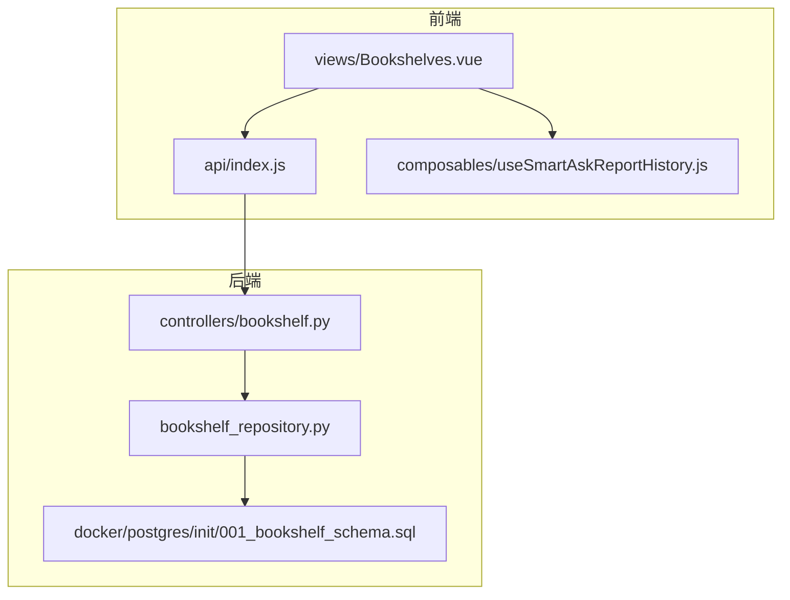
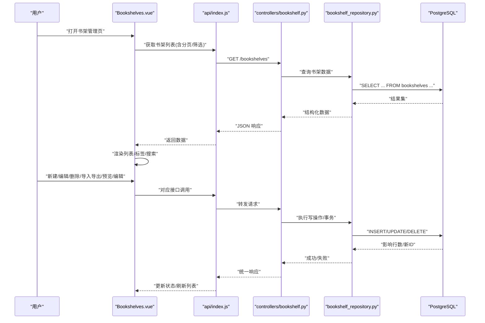
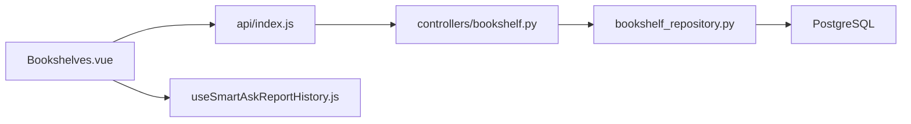

# 书架管理页面

<cite>
**本文引用的文件**   
- [Bookshelves.vue](file://frontend/src/views/Bookshelves.vue)
- [index.js](file://frontend/src/api/index.js)
- [useSmartAskReportHistory.js](file://frontend/src/composables/useSmartAskReportHistory.js)
- [bookshelf.py](file://backend/controllers/bookshelf.py)
- [bookshelf_repository.py](file://backend/bookshelf_repository.py)
- [001_bookshelf_schema.sql](file://docker/postgres/init/001_bookshelf_schema.sql)
</cite>

## 目录
1. [简介](#简介)
2. [项目结构](#项目结构)
3. [核心组件](#核心组件)
4. [架构总览](#架构总览)
5. [详细组件分析](#详细组件分析)
6. [依赖关系分析](#依赖关系分析)
7. [性能考虑](#性能考虑)
8. [故障排查指南](#故障排查指南)
9. [结论](#结论)
10. [附录](#附录)

## 简介
本文件为“书架管理页面”的开发文档，围绕 Bookshelves.vue 页面的整体架构与实现进行系统化说明。内容涵盖：
- 内容组织与标签分类、搜索过滤等核心功能
- 书架的创建、编辑、删除等生命周期管理
- 文件上传、目录结构管理与版本控制集成思路
- 标签系统的创建、关联与批量操作
- 全文搜索、条件筛选与排序的实现要点
- 报告历史管理 composable 的使用方式（查询、状态、持久化）
- 拖拽排序、批量操作、导入导出等高级功能方案
- 文件预览、在线编辑、协作编辑等特性的集成方式

## 项目结构
前端以 Vue 单文件组件组织视图层，API 调用集中在 api/index.js，业务逻辑通过 composables 暴露；后端由 Flask 控制器与仓库层提供数据访问能力，数据库初始化脚本定义书架相关表结构。

图表来源
- [Bookshelves.vue](file://frontend/src/views/Bookshelves.vue)
- [index.js](file://frontend/src/api/index.js)
- [useSmartAskReportHistory.js](file://frontend/src/composables/useSmartAskReportHistory.js)
- [bookshelf.py](file://backend/controllers/bookshelf.py)
- [bookshelf_repository.py](file://backend/bookshelf_repository.py)
- [001_bookshelf_schema.sql](file://docker/postgres/init/001_bookshelf_schema.sql)

章节来源
- [Bookshelves.vue](file://frontend/src/views/Bookshelves.vue)
- [index.js](file://frontend/src/api/index.js)
- [useSmartAskReportHistory.js](file://frontend/src/composables/useSmartAskReportHistory.js)
- [bookshelf.py](file://backend/controllers/bookshelf.py)
- [bookshelf_repository.py](file://backend/bookshelf_repository.py)
- [001_bookshelf_schema.sql](file://docker/postgres/init/001_bookshelf_schema.sql)

## 核心组件
- 视图层：Bookshelves.vue 负责书架列表展示、新建/编辑/删除交互、搜索过滤、标签筛选、批量操作、导入导出入口、文件预览与编辑器集成等。
- API 层：index.js 封装对后端的 CRUD、搜索、标签、导入导出等接口调用。
- Composable：useSmartAskReportHistory.js 提供报告历史查询、状态管理与本地持久化能力，供书架页面复用。
- 控制器层：bookshelf.py 处理 HTTP 请求、参数校验、权限检查、事务编排。
- 仓库层：bookshelf_repository.py 封装数据访问细节，对接数据库。
- 数据库：001_bookshelf_schema.sql 定义书架、标签、版本等核心表结构与索引。

章节来源
- [Bookshelves.vue](file://frontend/src/views/Bookshelves.vue)
- [index.js](file://frontend/src/api/index.js)
- [useSmartAskReportHistory.js](file://frontend/src/composables/useSmartAskReportHistory.js)
- [bookshelf.py](file://backend/controllers/bookshelf.py)
- [bookshelf_repository.py](file://backend/bookshelf_repository.py)
- [001_bookshelf_schema.sql](file://docker/postgres/init/001_bookshelf_schema.sql)

## 架构总览
书架管理采用前后端分离架构，前端通过 RESTful 接口与后端通信，后端通过仓库层访问数据库。报告历史通过 composable 在前端维护状态并持久化到本地存储，减少重复请求。

图表来源
- [Bookshelves.vue](file://frontend/src/views/Bookshelves.vue)
- [index.js](file://frontend/src/api/index.js)
- [bookshelf.py](file://backend/controllers/bookshelf.py)
- [bookshelf_repository.py](file://backend/bookshelf_repository.py)
- [001_bookshelf_schema.sql](file://docker/postgres/init/001_bookshelf_schema.sql)

## 详细组件分析

### 视图层：Bookshelves.vue
- 内容组织
  - 顶部工具栏：新建书架、导入/导出、批量操作、搜索框、标签筛选、排序选择。
  - 主区域：书架卡片或表格视图，支持分页、加载态、错误提示。
  - 侧边栏或抽屉：标签管理面板，支持新增、编辑、删除、批量关联。
- 标签分类
  - 标签列表与多选筛选，支持按标签聚合统计。
  - 标签创建与编辑弹窗，包含名称、描述、颜色等字段。
  - 批量关联：选中多个书架，统一添加/移除标签。
- 搜索过滤
  - 全文搜索：关键词匹配标题、描述、标签名。
  - 条件筛选：按标签、创建时间范围、更新时间范围、状态等。
  - 排序：按创建时间、更新时间、名称、使用次数等。
- 书架管理
  - 新建：表单校验、必填项提示、提交后刷新列表。
  - 编辑：预填充数据、变更检测、冲突提示。
  - 删除：二次确认、级联清理提示。
- 文件与版本
  - 文件上传：分片上传、进度条、断点续传、格式校验。
  - 目录结构：树形展示、重命名、移动、复制、删除。
  - 版本控制：版本列表、差异对比、回滚、发布标记。
- 报告历史
  - 使用 useSmartAskReportHistory 查询历史、缓存结果、本地持久化。
  - 支持按书架维度过滤历史、快速恢复上次运行。
- 高级特性
  - 拖拽排序：列表项拖拽调整顺序，后端同步排序字段。
  - 批量操作：批量启用/禁用、批量打标签、批量导出。
  - 导入导出：Excel/CSV 模板下载、批量导入、错误报告。
  - 预览与编辑：PDF/图片预览、代码/文本在线编辑、协作编辑集成。

章节来源
- [Bookshelves.vue](file://frontend/src/views/Bookshelves.vue)

### API 层：index.js
- 接口封装
  - 书架 CRUD：getBookshelves、createBookshelf、updateBookshelf、deleteBookshelf。
  - 搜索与筛选：searchBookshelves、filterByTags、sortBookshelves。
  - 标签管理：getTags、createTag、updateTag、deleteTag、batchTagBookshelves。
  - 文件与版本：uploadFile、listFiles、renameFile、moveFile、deleteFile、listVersions、rollbackVersion。
  - 导入导出：downloadTemplate、importBookshelves、exportBookshelves。
  - 报告历史：getReportHistory、saveReportHistory、clearReportHistory。
- 错误处理
  - 统一错误码映射、网络异常重试、超时设置、鉴权失败跳转登录。
- 缓存策略
  - 短期缓存搜索结果、标签列表、热门书架，减少重复请求。

章节来源
- [index.js](file://frontend/src/api/index.js)

### Composable：useSmartAskReportHistory.js
- 功能职责
  - 查询历史：按书架 ID、时间范围、状态查询历史记录。
  - 状态管理：loading、error、data、pagination 等状态集中管理。
  - 持久化：将关键历史快照写入 localStorage/sessionStorage，支持离线查看。
  - 事件总线：监听书架切换、搜索变化，自动刷新或清空缓存。
- 使用方式
  - 在 Bookshelves.vue 中引入 composable，订阅数据变化，驱动 UI 更新。
  - 提供方法：fetchHistory、saveSnapshot、restoreLastRun、clearCache。

章节来源
- [useSmartAskReportHistory.js](file://frontend/src/composables/useSmartAskReportHistory.js)

### 控制器层：bookshelf.py
- 路由与处理
  - GET /bookshelves：分页、筛选、排序、全文搜索。
  - POST /bookshelves：新建书架，校验输入，生成默认配置。
  - PUT /bookshelves/:id：编辑书架信息，权限校验，审计日志。
  - DELETE /bookshelves/:id：软删除，级联清理标签与文件引用。
  - POST /bookshelves/import：批量导入，模板校验，错误汇总。
  - GET /bookshelves/export：导出 CSV/Excel，异步任务回调。
  - 标签接口：CRUD 与批量关联。
  - 文件与版本接口：上传、目录管理、版本操作。
- 安全与权限
  - RBAC 校验、组织隔离、操作审计。
- 事务与一致性
  - 写操作使用事务保证一致性，失败回滚并返回明确错误。

章节来源
- [bookshelf.py](file://backend/controllers/bookshelf.py)

### 仓库层：bookshelf_repository.py
- 数据访问
  - 封装 SQL 查询与 ORM 操作，提供高内聚的数据操作方法。
  - 支持复杂查询：多表 JOIN、全文检索、聚合统计。
- 性能优化
  - 分页查询、索引优化、查询缓存、批量插入/更新。
- 错误处理
  - 数据库异常捕获、错误码映射、重试机制。

章节来源
- [bookshelf_repository.py](file://backend/bookshelf_repository.py)

### 数据库：001_bookshelf_schema.sql
- 核心表结构
  - bookshelves：书架基本信息（id、name、description、status、created_at、updated_at）。
  - tags：标签定义（id、name、color、description）。
  - bookshelf_tags：书架与标签多对多关系。
  - files：文件元数据（id、bookshelf_id、path、size、mime_type、version）。
  - versions：版本记录（id、file_id、version_no、snapshot_path、created_by）。
- 索引与约束
  - 主键、外键、唯一约束、全文索引、时间戳索引。
- 迁移与升级
  - 支持增量迁移，保留历史数据兼容性。

章节来源
- [001_bookshelf_schema.sql](file://docker/postgres/init/001_bookshelf_schema.sql)

## 依赖关系分析
- 前端依赖
  - Bookshelves.vue 依赖 index.js 的 API 封装与 useSmartAskReportHistory.js 的状态管理。
  - 组件内部依赖第三方库（如拖拽、预览、编辑器）按需引入。
- 后端依赖
  - bookshelf.py 依赖 bookshelf_repository.py 的数据访问能力。
  - 所有数据操作最终依赖 PostgreSQL 数据库。
- 外部集成
  - 文件存储（对象存储/本地磁盘）、版本控制系统（Git 集成可选）、协作编辑服务（WebSocket/CRDT）。

图表来源
- [Bookshelves.vue](file://frontend/src/views/Bookshelves.vue)
- [index.js](file://frontend/src/api/index.js)
- [useSmartAskReportHistory.js](file://frontend/src/composables/useSmartAskReportHistory.js)
- [bookshelf.py](file://backend/controllers/bookshelf.py)
- [bookshelf_repository.py](file://backend/bookshelf_repository.py)
- [001_bookshelf_schema.sql](file://docker/postgres/init/001_bookshelf_schema.sql)

章节来源
- [Bookshelves.vue](file://frontend/src/views/Bookshelves.vue)
- [index.js](file://frontend/src/api/index.js)
- [useSmartAskReportHistory.js](file://frontend/src/composables/useSmartAskReportHistory.js)
- [bookshelf.py](file://backend/controllers/bookshelf.py)
- [bookshelf_repository.py](file://backend/bookshelf_repository.py)
- [001_bookshelf_schema.sql](file://docker/postgres/init/001_bookshelf_schema.sql)

## 性能考虑
- 前端
  - 虚拟滚动：大数据量列表使用虚拟滚动提升渲染性能。
  - 防抖节流：搜索输入与窗口 resize 事件去抖，减少频繁请求。
  - 懒加载：图片与预览资源按需加载，首屏优化。
- 后端
  - 分页与投影：只返回必要字段，避免大对象传输。
  - 索引优化：高频查询字段建立复合索引，全文检索使用倒排索引。
  - 缓存策略：热点数据 Redis 缓存，失效策略合理设计。
- 数据库
  - 慢查询监控与优化，定期分析执行计划。
  - 读写分离与连接池调优，避免锁竞争。

## 故障排查指南
- 常见问题
  - 列表加载缓慢：检查分页参数、索引命中情况、网络延迟。
  - 搜索无结果：确认全文索引是否重建、关键词分词是否正确。
  - 标签关联失败：检查多对多表约束、事务是否回滚。
  - 文件上传失败：验证文件大小限制、MIME 类型、存储空间。
  - 版本回滚失败：确认快照路径存在、权限正确。
- 调试手段
  - 前端：浏览器开发者工具 Network/Console，API 请求日志。
  - 后端：Flask 日志、SQL 执行日志、错误堆栈跟踪。
  - 数据库：慢查询日志、锁等待监控、备份恢复演练。

## 结论
书架管理页面通过清晰的层次化架构与模块化设计，实现了完整的书架生命周期管理、标签分类、搜索过滤、文件与版本控制、报告历史管理等核心能力。结合拖拽排序、批量操作、导入导出、预览与编辑等高级特性，提供了高效、易用的用户体验。建议在生产环境中加强监控与告警，持续优化性能与稳定性。

## 附录
- 最佳实践
  - 统一错误码与消息规范，便于前端友好提示。
  - 敏感操作增加二次确认与审计日志。
  - 数据导出支持异步任务与进度反馈。
- 扩展方向
  - 接入 AI 辅助：智能标签推荐、内容摘要、相似书架发现。
  - 协作编辑：多人实时编辑、冲突解决、评论与审批流。
  - 权限细化：字段级权限、动态可见性控制。