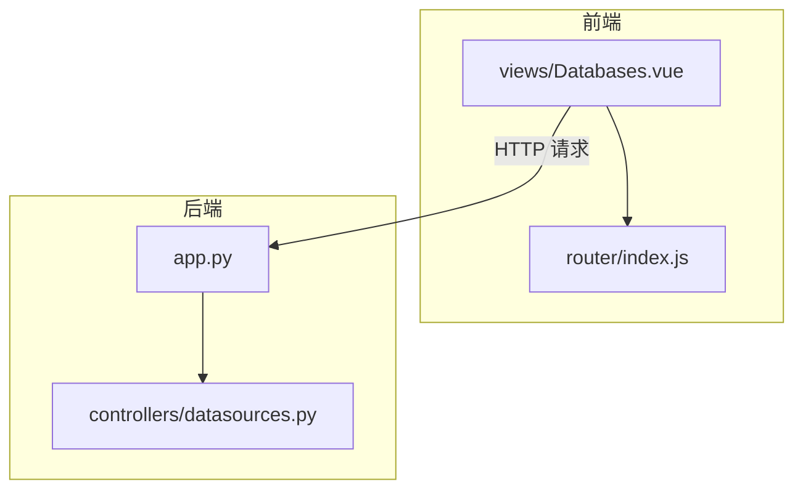
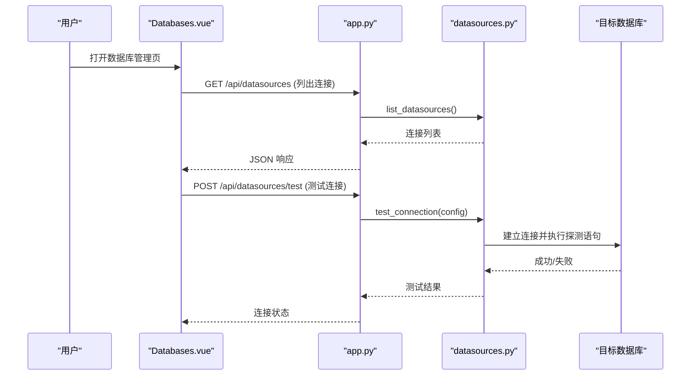
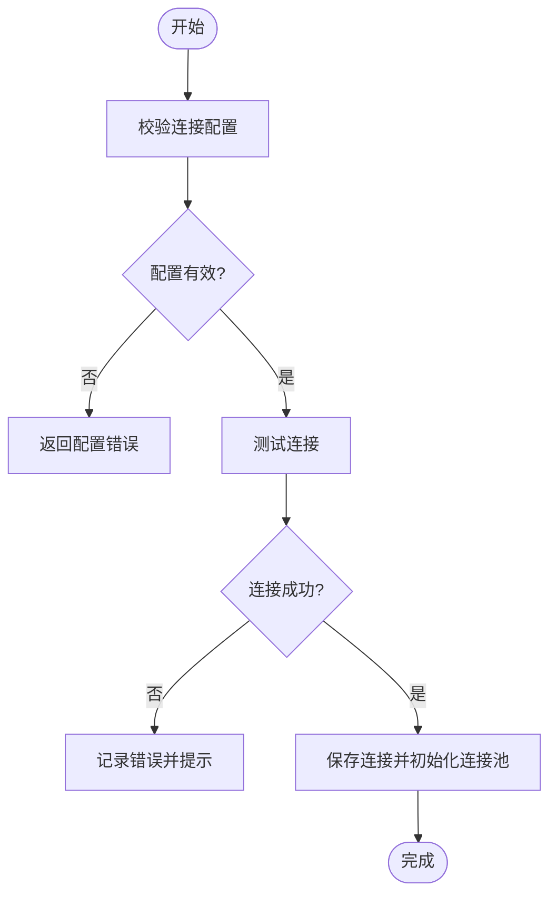
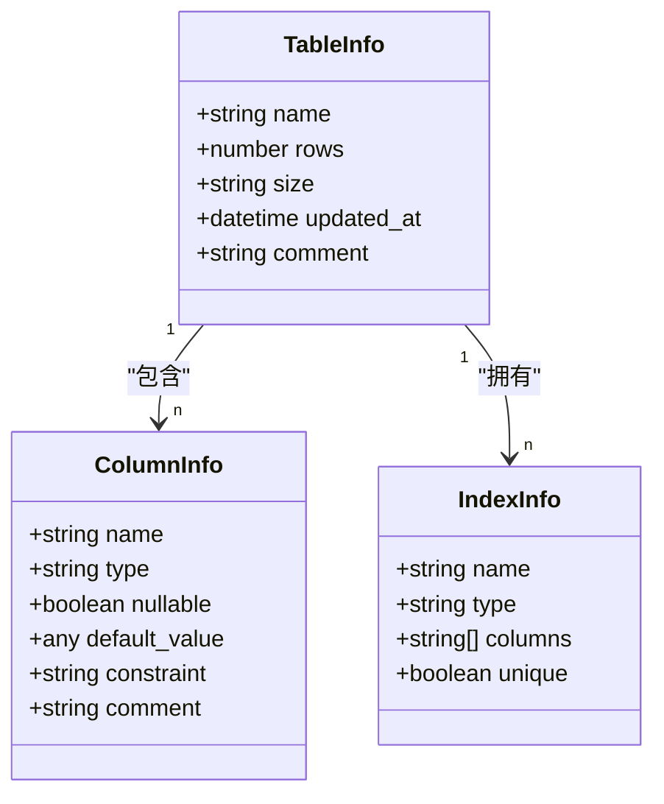
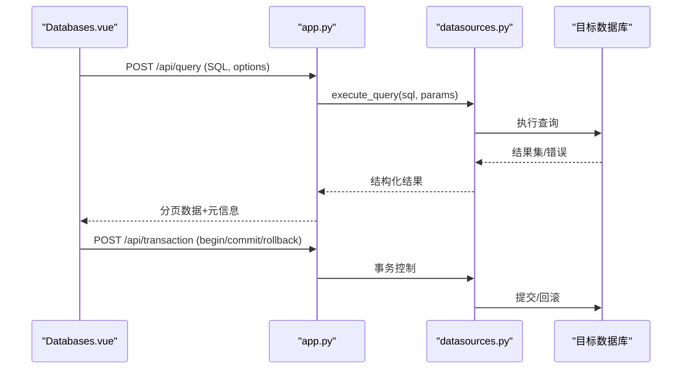
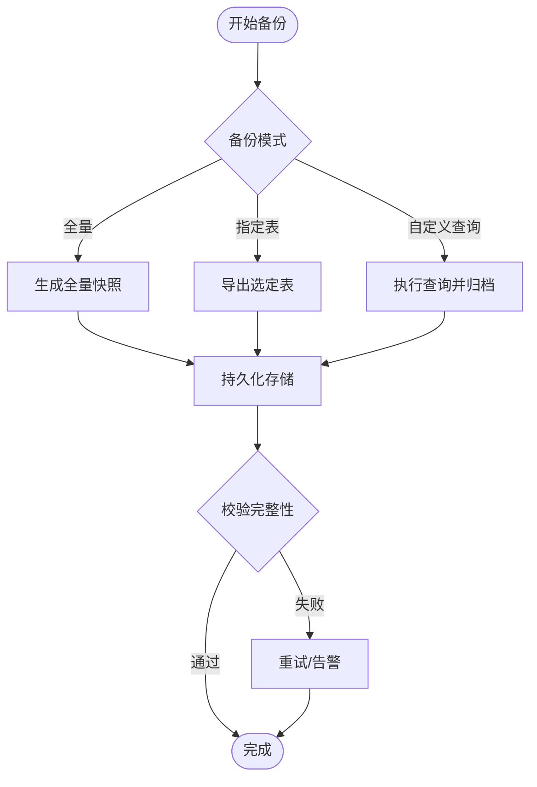
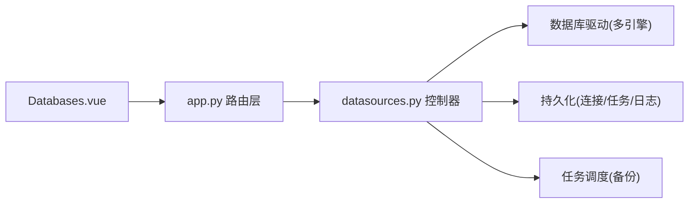

# 数据库管理页面

<cite>
**本文档引用的文件**   
- [Databases.vue](file://frontend/src/views/Databases.vue)
- [datasources.py](file://backend/controllers/datasources.py)
- [app.py](file://backend/app.py)
- [router/index.js](file://frontend/src/router/index.js)
</cite>

## 目录
1. [简介](#简介)
2. [项目结构](#项目结构)
3. [核心组件](#核心组件)
4. [架构总览](#架构总览)
5. [详细组件分析](#详细组件分析)
6. [依赖关系分析](#依赖关系分析)
7. [性能考虑](#性能考虑)
8. [故障排查指南](#故障排查指南)
9. [结论](#结论)
10. [附录](#附录)

## 简介
本文件面向“数据库管理页面”（Databases.vue）的开发与维护，系统性阐述其整体架构与实现要点，覆盖以下能力：
- 数据库连接管理：连接字符串配置、认证信息设置、连接池参数配置、连接测试与状态监控。
- 表结构浏览：表列表展示、字段信息查看、索引信息展示。
- 数据操作：查询、插入、更新、删除等操作的界面化实现。
- 备份与恢复：手动/定时/增量备份策略与执行流程。
- 监控与分析：连接状态监控、查询性能分析、慢查询日志采集。
- SQL 编辑器集成：语法高亮、智能提示、执行计划展示。
- 连接池管理与事务处理：连接复用、超时控制、错误恢复与重试机制。

## 项目结构
前端以 Vue 单文件组件组织，数据库管理页面位于 views 目录；后端通过控制器暴露数据源与数据库相关 API，路由由应用入口统一挂载。

图表来源 
- [Databases.vue](file://frontend/src/views/Databases.vue)
- [router/index.js](file://frontend/src/router/index.js)
- [app.py](file://backend/app.py)
- [datasources.py](file://backend/controllers/datasources.py)

章节来源
- [Databases.vue](file://frontend/src/views/Databases.vue)
- [datasources.py](file://backend/controllers/datasources.py)
- [app.py](file://backend/app.py)
- [router/index.js](file://frontend/src/router/index.js)

## 核心组件
- 数据库连接管理
  - 连接配置表单：支持多种数据库类型、连接字符串模板、用户名/密码、SSL/TLS、连接池大小、超时等。
  - 连接测试与状态：发起连通性检测，返回连接状态、延迟、可用连接数等。
  - 连接生命周期：创建、启用/禁用、删除、切换默认连接。
- 表结构浏览
  - 表列表：按库/模式分组展示，支持搜索与分页。
  - 字段信息：列名、类型、是否可空、默认值、注释等。
  - 索引信息：主键、唯一索引、普通索引、复合索引及字段顺序。
- 数据操作
  - 查询：SQL 编辑器 + 结果集表格，支持分页、导出、保存常用查询。
  - 增删改：行级编辑、批量导入/导出、事务提交/回滚。
- 备份与恢复
  - 手动备份：全量/指定表/自定义查询快照。
  - 定时备份：Cron 表达式配置、保留策略、失败告警。
  - 增量备份：基于 LSN/时间戳/变更日志的增量捕获。
- 监控与分析
  - 连接状态：活跃/空闲连接数、等待队列、阻塞会话。
  - 性能分析：QPS、平均响应时间、Top SQL、执行计划。
  - 慢查询日志：阈值配置、采样率、日志聚合与检索。
- SQL 编辑器集成
  - 语法高亮、自动补全、括号匹配、格式化。
  - 执行计划可视化、结果预览、缓存命中统计。
- 连接池与事务
  - 连接池参数：最大连接数、最小空闲、获取/归还超时、健康检查间隔。
  - 事务边界：显式 begin/commit/rollback，异常自动回滚与重试。

章节来源
- [Databases.vue](file://frontend/src/views/Databases.vue)
- [datasources.py](file://backend/controllers/datasources.py)
- [app.py](file://backend/app.py)

## 架构总览
前后端分离架构：前端 Databases.vue 通过 HTTP API 调用后端 datasources 控制器，后端负责与具体数据库驱动交互，提供统一的元数据与数据访问接口。

图表来源 
- [Databases.vue](file://frontend/src/views/Databases.vue)
- [app.py](file://backend/app.py)
- [datasources.py](file://backend/controllers/datasources.py)

## 详细组件分析

### 数据库连接管理
- 配置项
  - 连接字符串：协议、主机、端口、数据库名、Schema、SSL 参数。
  - 认证：用户名/密码、密钥文件、OAuth/JWT（视后端支持）。
  - 连接池：max_connections、min_idle、acquire_timeout、health_check_interval。
- 操作流程
  - 新增连接：校验配置 -> 写入持久化存储 -> 初始化连接池 -> 返回连接 ID。
  - 测试连接：使用最小权限账号执行 SELECT 1 或等价探测。
  - 启停与删除：软删除标记、释放连接池资源。
- 错误处理
  - 网络不可达、认证失败、权限不足、SSL 证书问题、连接池耗尽等。
  - 重试策略：指数退避 + 最大重试次数。

章节来源
- [Databases.vue](file://frontend/src/views/Databases.vue)
- [datasources.py](file://backend/controllers/datasources.py)

### 表结构浏览
- 表列表
  - 数据来源：系统视图/元数据表（如 information_schema、pg_catalog、sys.tables 等）。
  - 展示：名称、行数估算、大小、最后更新时间、备注。
- 字段信息
  - 列名、数据类型、长度/精度、是否可空、默认值、约束、注释。
- 索引信息
  - 索引名、类型（主键/唯一/普通）、包含列、排序规则、是否唯一。
- 交互
  - 点击表名进入详情，支持字段筛选、索引过滤、导出 DDL。

章节来源
- [Databases.vue](file://frontend/src/views/Databases.vue)
- [datasources.py](file://backend/controllers/datasources.py)

### 数据操作（CRUD）
- 查询
  - SQL 编辑器：语法高亮、自动补全、格式化。
  - 执行：异步执行、进度反馈、结果分页、导出 CSV/Excel。
  - 历史：保存常用查询、分享链接、版本对比。
- 插入/更新/删除
  - 行级编辑：单元格编辑、批量粘贴、撤销/重做。
  - 事务：显式事务块、失败自动回滚、并发冲突提示。
  - 导入：CSV/JSON 导入向导、映射字段、错误行定位。

章节来源
- [Databases.vue](file://frontend/src/views/Databases.vue)
- [datasources.py](file://backend/controllers/datasources.py)

### 备份与恢复
- 手动备份
  - 全量：锁表或一致性快照（依数据库引擎）。
  - 指定表：按白名单导出。
  - 自定义查询：将查询结果归档为快照。
- 定时备份
  - Cron 调度：周期、保留策略、失败重试与告警。
  - 存储：本地磁盘、对象存储、异地副本。
- 增量备份
  - 基于 LSN/时间戳/变更日志（如 WAL、binlog）。
  - 合并策略：基线 + 增量链，恢复时回放。
- 恢复
  - 选择时间点/版本号，校验完整性，执行恢复并验证。

章节来源
- [Databases.vue](file://frontend/src/views/Databases.vue)
- [datasources.py](file://backend/controllers/datasources.py)

### 监控与分析
- 连接状态
  - 指标：活跃/空闲连接、等待队列、阻塞会话、最近错误。
  - 刷新：轮询或 SSE/WebSocket 推送。
- 性能分析
  - QPS、P95/P99 延迟、CPU/IO 占用、锁等待。
  - Top SQL：按耗时/扫描行数/影响行数排序。
  - 执行计划：树形展示、成本估算、热点谓词。
- 慢查询日志
  - 阈值：毫秒级阈值、采样率、忽略系统库。
  - 聚合：去重、指纹化、趋势图、告警规则。

章节来源
- [Databases.vue](file://frontend/src/views/Databases.vue)
- [datasources.py](file://backend/controllers/datasources.py)

### SQL 编辑器集成
- 功能
  - 语法高亮、自动补全（表/列/函数）、括号匹配、格式化。
  - 执行计划可视化、结果预览、缓存命中率。
- 实现要点
  - 编辑器选型：Monaco/Ace/Codemirror。
  - 元数据注入：动态加载 schema、索引、函数签名。
  - 安全：只读模式、命令白名单、SQL 审计。

章节来源
- [Databases.vue](file://frontend/src/views/Databases.vue)

### 连接池管理与事务处理
- 连接池
  - 参数：max/min、获取/归还超时、健康检查、空闲回收。
  - 行为：懒创建、快速失败、优雅关闭。
- 事务
  - 边界：显式 begin/commit/rollback。
  - 异常：自动回滚、重试策略、死锁检测与回退。
  - 隔离级别：根据数据库能力配置。

章节来源
- [Databases.vue](file://frontend/src/views/Databases.vue)
- [datasources.py](file://backend/controllers/datasources.py)

## 依赖关系分析
- 前端依赖
  - Vue 组件模型、路由、状态管理（可选）、HTTP 客户端。
  - SQL 编辑器库、表格组件、图表组件。
- 后端依赖
  - Web 框架路由与中间件、数据库驱动（多引擎适配）、任务调度器（备份）。
- 外部依赖
  - 目标数据库服务、对象存储（备份）、消息队列（可选，用于异步任务）。

图表来源 
- [Databases.vue](file://frontend/src/views/Databases.vue)
- [app.py](file://backend/app.py)
- [datasources.py](file://backend/controllers/datasources.py)

章节来源
- [Databases.vue](file://frontend/src/views/Databases.vue)
- [app.py](file://backend/app.py)
- [datasources.py](file://backend/controllers/datasources.py)

## 性能考虑
- 前端
  - 大数据集分页与虚拟滚动，避免一次性渲染。
  - 防抖/节流查询输入，减少无效请求。
  - 结果集导出采用流式下载。
- 后端
  - 连接池调优：根据并发与内存限制设置 max_connections。
  - 查询限流与超时：防止长尾请求拖垮服务。
  - 元数据缓存：表/字段/索引信息缓存，降低频繁查询。
  - 备份任务异步化：队列化执行，避免阻塞请求。
- 数据库
  - 合理索引设计，避免全表扫描。
  - 慢查询阈值与采样策略平衡准确性与开销。
  - 备份窗口避开业务高峰。

## 故障排查指南
- 连接失败
  - 检查网络可达、防火墙、DNS、SSL 证书。
  - 确认用户名/密码、权限、默认 Schema。
  - 查看连接池状态与错误日志。
- 查询缓慢
  - 查看执行计划与索引命中情况。
  - 检查锁等待与阻塞会话。
  - 调整查询条件与分页策略。
- 备份失败
  - 检查存储空间、权限、目标路径。
  - 查看任务日志与重试记录。
  - 校验备份完整性与恢复演练。
- 常见错误码与处理
  - 认证失败：重新配置凭据或申请权限。
  - 连接池耗尽：扩容连接池或优化长事务。
  - 超时：增大超时或拆分大查询。

章节来源
- [Databases.vue](file://frontend/src/views/Databases.vue)
- [datasources.py](file://backend/controllers/datasources.py)

## 结论
数据库管理页面通过清晰的前后端分层与模块化设计，实现了从连接管理、结构浏览到数据操作、备份恢复与监控分析的完整闭环。建议在生产环境优先完善连接池与事务治理、慢查询与执行计划可视化、以及备份恢复的自动化与演练流程，以提升稳定性与可维护性。

## 附录
- 术语
  - 连接池：复用数据库连接以减少握手开销。
  - 事务：一组原子操作，要么全部成功，要么全部回滚。
  - 增量备份：仅备份自上次备份以来的变更。
- 最佳实践
  - 最小权限原则：为应用账户授予必要权限。
  - 参数化查询：防止 SQL 注入。
  - 备份演练：定期恢复演练确保可用性。
  - 监控告警：关键指标接入告警平台。