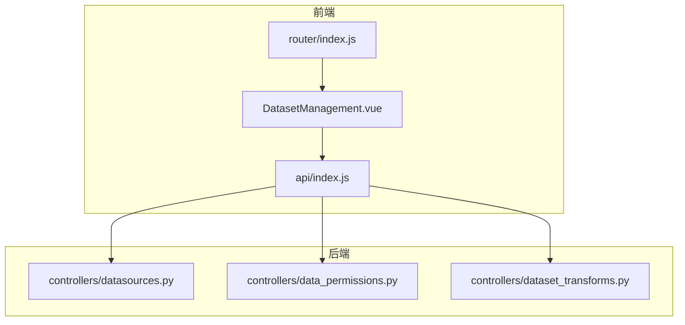
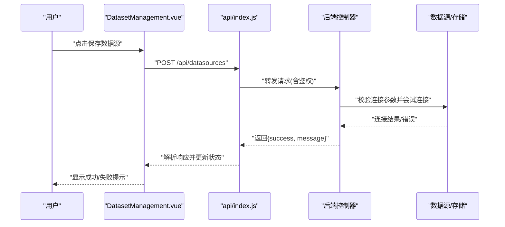
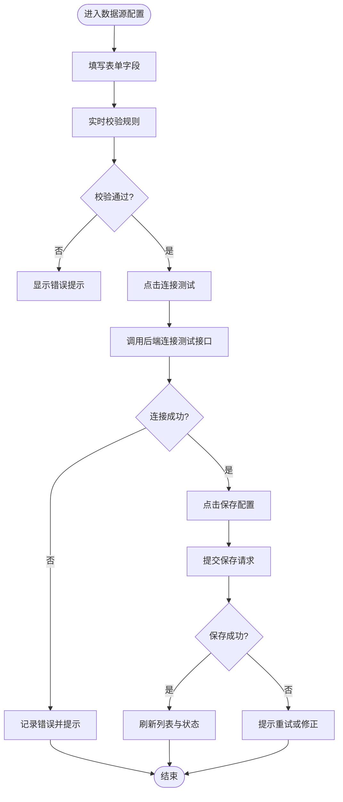
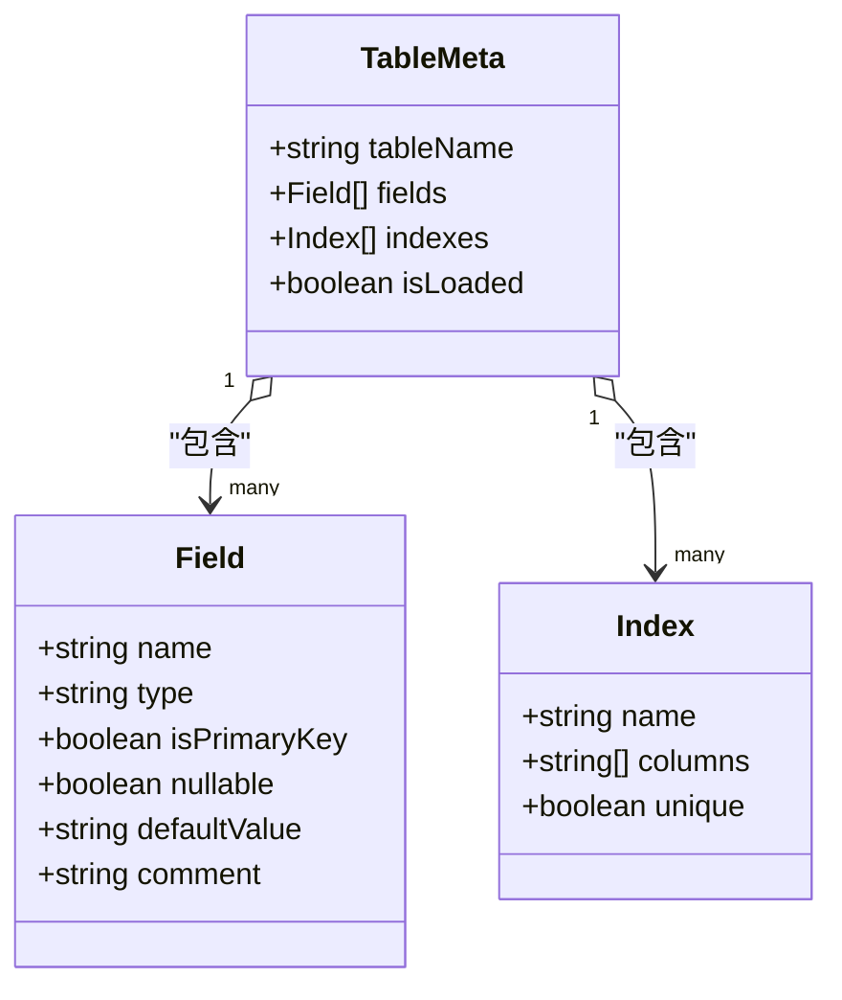
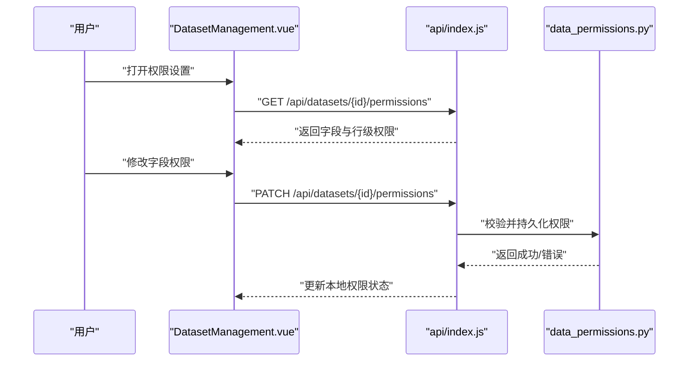
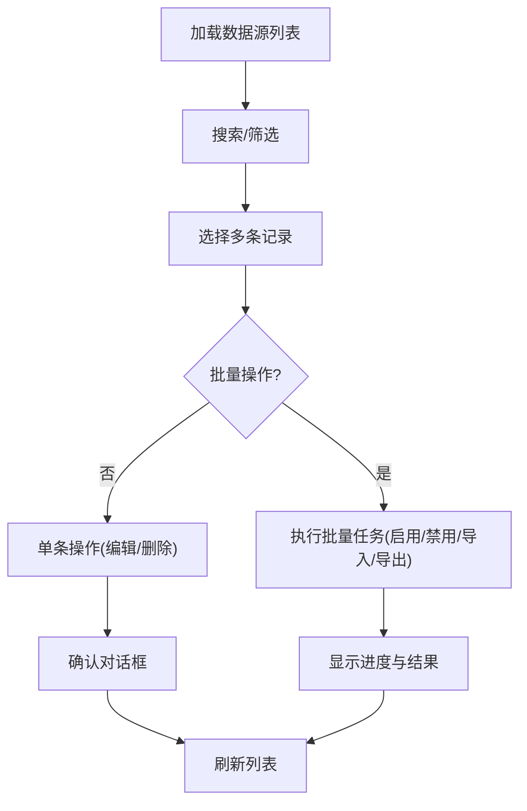
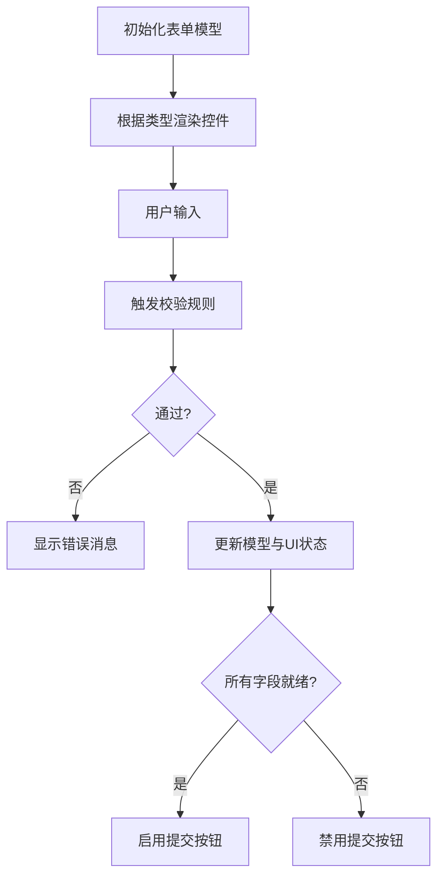
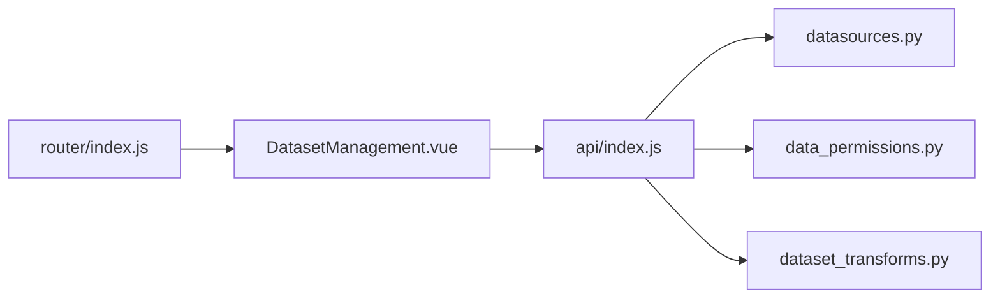

# 数据集管理页面

<cite>
**本文引用的文件**   
- [DatasetManagement.vue](file://frontend/src/views/DatasetManagement.vue)
- [api/index.js](file://frontend/src/api/index.js)
- [datasources.py](file://backend/controllers/datasources.py)
- [data_permissions.py](file://backend/controllers/data_permissions.py)
- [dataset_transforms.py](file://backend/controllers/dataset_transforms.py)
- [router/index.js](file://frontend/src/router/index.js)
</cite>

## 目录
1. [简介](#简介)
2. [项目结构](#项目结构)
3. [核心组件](#核心组件)
4. [架构总览](#架构总览)
5. [详细组件分析](#详细组件分析)
6. [依赖分析](#依赖分析)
7. [性能考虑](#性能考虑)
8. [故障排查指南](#故障排查指南)
9. [结论](#结论)
10. [附录](#附录)

## 简介
本文件面向“数据集管理”页面的开发与维护，围绕 DatasetManagement.vue 的整体架构与实现进行系统化说明。内容覆盖数据源配置、表结构预览、权限设置、数据源的增删改查（含批量操作、导入导出）、前后端 API 交互、响应式表单（动态字段生成、验证规则、实时反馈），以及数据同步、缓存策略与性能优化实践。文档力求在技术细节与可读性之间取得平衡，既适合前端开发者快速上手，也便于后端与产品人员理解整体流程。

## 项目结构
该功能位于前端视图层与后端控制器层的交汇点：
- 前端视图：DatasetManagement.vue 负责页面布局、交互与状态管理，调用 api/index.js 中的接口封装。
- 路由：通过 router/index.js 将 /datasets 等路径映射到 DatasetManagement.vue。
- 后端控制器：
  - datasources.py：数据源连接测试、保存、列表查询、删除等。
  - data_permissions.py：字段级/行级权限、继承关系管理。
  - dataset_transforms.py：数据转换、同步任务、元数据刷新等。

图表来源
- [router/index.js](file://frontend/src/router/index.js)
- [DatasetManagement.vue](file://frontend/src/views/DatasetManagement.vue)
- [api/index.js](file://frontend/src/api/index.js)
- [datasources.py](file://backend/controllers/datasources.py)
- [data_permissions.py](file://backend/controllers/data_permissions.py)
- [dataset_transforms.py](file://backend/controllers/dataset_transforms.py)

章节来源
- [router/index.js](file://frontend/src/router/index.js)
- [DatasetManagement.vue](file://frontend/src/views/DatasetManagement.vue)
- [api/index.js](file://frontend/src/api/index.js)

## 核心组件
- 数据源配置模块
  - 支持新增/编辑数据源，包含连接参数校验、连接测试、保存与状态监控。
  - 提供连接池健康检查与失败重试提示。
- 表结构预览模块
  - 展示数据库表清单、字段信息、数据类型识别、索引与主键标识。
  - 支持按表名/字段名搜索与分页加载。
- 权限设置模块
  - 字段级权限：对指定表的字段进行可见/可写控制。
  - 行级权限：基于组织树或角色条件过滤数据行。
  - 继承关系：支持从组织/角色层级继承权限并显式覆盖。
- 数据源 CRUD 与批量操作
  - 列表查询、单条删除、批量启用/禁用、批量导入/导出。
  - 支持模板下载与错误报告回传。
- 响应式表单
  - 动态字段生成：根据数据源类型渲染不同表单控件。
  - 验证规则：必填、格式、长度、白名单等。
  - 实时反馈：输入时即时校验与错误提示。

章节来源
- [DatasetManagement.vue](file://frontend/src/views/DatasetManagement.vue)
- [api/index.js](file://frontend/src/api/index.js)

## 架构总览
页面采用“视图-接口-控制器”的分层模式，关键交互如下：
- 用户操作触发视图方法，更新本地状态并调用 API。
- API 层统一处理请求头、鉴权、错误码映射与重试。
- 后端控制器执行业务逻辑，访问数据库或外部系统，返回结构化结果。

图表来源
- [DatasetManagement.vue](file://frontend/src/views/DatasetManagement.vue)
- [api/index.js](file://frontend/src/api/index.js)
- [datasources.py](file://backend/controllers/datasources.py)

章节来源
- [DatasetManagement.vue](file://frontend/src/views/DatasetManagement.vue)
- [api/index.js](file://frontend/src/api/index.js)
- [datasources.py](file://backend/controllers/datasources.py)

## 详细组件分析

### 数据源配置界面
- 界面要点
  - 表单区域：数据源名称、类型（MySQL/PostgreSQL/其他）、主机、端口、库名、用户名、密码、SSL 选项等。
  - 操作按钮：连接测试、保存、取消、重置。
  - 状态区：连接测试结果、最近测试时间、错误信息。
- 交互流程
  - 输入变更触发实时校验（正则、必填、范围）。
  - 点击“连接测试”发起异步请求，显示加载态与结果。
  - 点击“保存”提交完整配置，成功后刷新列表与状态。
- 错误处理
  - 网络异常：提示“网络不可用”，支持重试。
  - 认证失败：提示“用户名或密码错误”。
  - 连接超时：提示“连接超时，请检查网络或防火墙”。

图表来源
- [DatasetManagement.vue](file://frontend/src/views/DatasetManagement.vue)
- [api/index.js](file://frontend/src/api/index.js)
- [datasources.py](file://backend/controllers/datasources.py)

章节来源
- [DatasetManagement.vue](file://frontend/src/views/DatasetManagement.vue)
- [api/index.js](file://frontend/src/api/index.js)
- [datasources.py](file://backend/controllers/datasources.py)

### 表结构预览功能
- 功能要点
  - 表清单：分页加载、搜索过滤（表名/字段名）。
  - 字段信息：字段名、类型、是否主键、是否可空、默认值、注释。
  - 索引信息：唯一索引、普通索引、复合索引的字段组合。
- 实现思路
  - 首次加载拉取元数据，后续使用缓存减少重复请求。
  - 搜索与分页在前端完成，提升交互体验。
  - 类型识别：后端返回标准化类型，前端做友好展示（如数值精度、日期格式）。
- 性能优化
  - 延迟加载：仅展开某表时加载其字段详情。
  - 虚拟滚动：大表字段列表使用虚拟列表避免重排。

图表来源
- [DatasetManagement.vue](file://frontend/src/views/DatasetManagement.vue)
- [api/index.js](file://frontend/src/api/index.js)
- [datasources.py](file://backend/controllers/datasources.py)

章节来源
- [DatasetManagement.vue](file://frontend/src/views/DatasetManagement.vue)
- [api/index.js](file://frontend/src/api/index.js)
- [datasources.py](file://backend/controllers/datasources.py)

### 权限设置界面
- 功能要点
  - 字段级权限：为每个字段设置可见/可写，支持批量勾选。
  - 行级权限：基于组织树节点或角色条件定义过滤表达式。
  - 继承关系：从组织/角色继承权限，允许显式覆盖。
- 交互流程
  - 选择目标表后加载字段权限矩阵。
  - 修改权限后自动保存或批量提交。
  - 行级权限以可视化条件构建器辅助配置。
- 错误处理
  - 权限冲突：提示冲突位置并提供合并建议。
  - 语法错误：行级表达式校验失败时高亮错误片段。

图表来源
- [DatasetManagement.vue](file://frontend/src/views/DatasetManagement.vue)
- [api/index.js](file://frontend/src/api/index.js)
- [data_permissions.py](file://backend/controllers/data_permissions.py)

章节来源
- [DatasetManagement.vue](file://frontend/src/views/DatasetManagement.vue)
- [api/index.js](file://frontend/src/api/index.js)
- [data_permissions.py](file://backend/controllers/data_permissions.py)

### 数据源增删改查与批量操作
- 列表查询：支持分页、排序、筛选（类型、状态、创建时间）。
- 单条操作：编辑、删除、启用/禁用。
- 批量操作：批量启用/禁用、批量导入/导出。
- 导入导出：
  - 导入：模板下载、上传校验、进度条、错误报告。
  - 导出：CSV/JSON 格式，支持分片下载。

图表来源
- [DatasetManagement.vue](file://frontend/src/views/DatasetManagement.vue)
- [api/index.js](file://frontend/src/api/index.js)
- [datasources.py](file://backend/controllers/datasources.py)

章节来源
- [DatasetManagement.vue](file://frontend/src/views/DatasetManagement.vue)
- [api/index.js](file://frontend/src/api/index.js)
- [datasources.py](file://backend/controllers/datasources.py)

### 响应式表单实现
- 动态字段生成：根据数据源类型渲染不同控件（文本框、下拉、开关、文件上传）。
- 验证规则：必填、正则、长度、枚举白名单、跨字段校验。
- 实时反馈：输入即校验，错误即时提示，成功状态高亮。
- 状态管理：表单值与 UI 状态双向绑定，提交前统一校验。

图表来源
- [DatasetManagement.vue](file://frontend/src/views/DatasetManagement.vue)
- [api/index.js](file://frontend/src/api/index.js)

章节来源
- [DatasetManagement.vue](file://frontend/src/views/DatasetManagement.vue)
- [api/index.js](file://frontend/src/api/index.js)

### 与后端 API 的交互方式
- 数据获取：GET 列表、详情；分页、排序、筛选参数统一封装。
- 状态更新：PATCH/PUT 局部更新，POST 新建，DELETE 删除。
- 错误处理：统一错误码映射、重试机制、用户友好提示。
- 鉴权：请求头携带 Token，失败时跳转登录或刷新令牌。

章节来源
- [api/index.js](file://frontend/src/api/index.js)
- [datasources.py](file://backend/controllers/datasources.py)
- [data_permissions.py](file://backend/controllers/data_permissions.py)

### 数据同步、缓存策略与性能优化
- 数据同步
  - 元数据同步：定时或手动触发，增量更新表结构与字段信息。
  - 任务队列：后台执行耗时任务，前端轮询或 WebSocket 推送进度。
- 缓存策略
  - 浏览器缓存：对静态资源与不频繁变化的元数据进行缓存。
  - 内存缓存：列表页使用本地缓存减少重复请求。
  - 失效策略：配置变更后主动失效相关缓存。
- 性能优化
  - 懒加载：按需加载表详情与权限矩阵。
  - 虚拟滚动：大数据量列表优化渲染。
  - 去抖与节流：搜索与高频操作防抖/节流。
  - 并发控制：限制并行请求数，避免阻塞。

章节来源
- [dataset_transforms.py](file://backend/controllers/dataset_transforms.py)
- [DatasetManagement.vue](file://frontend/src/views/DatasetManagement.vue)
- [api/index.js](file://frontend/src/api/index.js)

## 依赖分析
- 前端依赖
  - DatasetManagement.vue 依赖 api/index.js 的接口封装。
  - 路由由 router/index.js 管理，确保页面可达。
- 后端依赖
  - datasources.py 负责数据源连接与元数据读取。
  - data_permissions.py 负责权限模型的读写与校验。
  - dataset_transforms.py 负责同步任务与转换逻辑。
- 耦合与内聚
  - 视图与接口解耦，接口层统一处理错误与鉴权。
  - 控制器职责清晰，避免跨层调用。

图表来源
- [DatasetManagement.vue](file://frontend/src/views/DatasetManagement.vue)
- [api/index.js](file://frontend/src/api/index.js)
- [datasources.py](file://backend/controllers/datasources.py)
- [data_permissions.py](file://backend/controllers/data_permissions.py)
- [dataset_transforms.py](file://backend/controllers/dataset_transforms.py)
- [router/index.js](file://frontend/src/router/index.js)

章节来源
- [DatasetManagement.vue](file://frontend/src/views/DatasetManagement.vue)
- [api/index.js](file://frontend/src/api/index.js)
- [datasources.py](file://backend/controllers/datasources.py)
- [data_permissions.py](file://backend/controllers/data_permissions.py)
- [dataset_transforms.py](file://backend/controllers/dataset_transforms.py)
- [router/index.js](file://frontend/src/router/index.js)

## 性能考虑
- 首屏优化：骨架屏与占位图提升感知速度。
- 请求优化：合并请求、分页加载、条件预取。
- 渲染优化：虚拟列表、按需渲染、避免不必要的 re-render。
- 缓存优化：合理设置缓存时间与失效策略。
- 错误恢复：失败重试与降级策略保障可用性。

[本节为通用指导，不直接分析具体文件]

## 故障排查指南
- 常见问题
  - 连接测试失败：检查网络、账号密码、端口与防火墙。
  - 权限配置无效：核对继承关系与覆盖优先级。
  - 导入失败：查看错误报告定位问题行与字段。
- 调试步骤
  - 前端：打开控制台查看网络请求与错误日志。
  - 后端：检查控制器日志与数据库连接状态。
  - 缓存：清除浏览器缓存与本地存储后重试。

章节来源
- [DatasetManagement.vue](file://frontend/src/views/DatasetManagement.vue)
- [api/index.js](file://frontend/src/api/index.js)
- [datasources.py](file://backend/controllers/datasources.py)
- [data_permissions.py](file://backend/controllers/data_permissions.py)

## 结论
DatasetManagement.vue 作为数据集管理的核心页面，通过清晰的层次结构与完善的交互设计，实现了数据源配置、表结构预览、权限设置与批量操作等关键能力。结合合理的缓存与性能优化策略，能够为用户提供高效、稳定的使用体验。建议在后续迭代中持续完善错误提示、权限可视化与同步任务的进度反馈。

[本节为总结性内容，不直接分析具体文件]

## 附录
- 术语解释
  - 数据源：指连接的数据库或其他数据存储。
  - 字段级权限：控制对表中字段的可见性与可写性。
  - 行级权限：基于条件过滤数据行。
  - 元数据：描述数据结构的信息，如表名、字段名、类型等。
- 参考文件
  - 前端视图：DatasetManagement.vue
  - 接口封装：api/index.js
  - 后端控制器：datasources.py、data_permissions.py、dataset_transforms.py
  - 路由配置：router/index.js

[本节为补充信息，不直接分析具体文件]