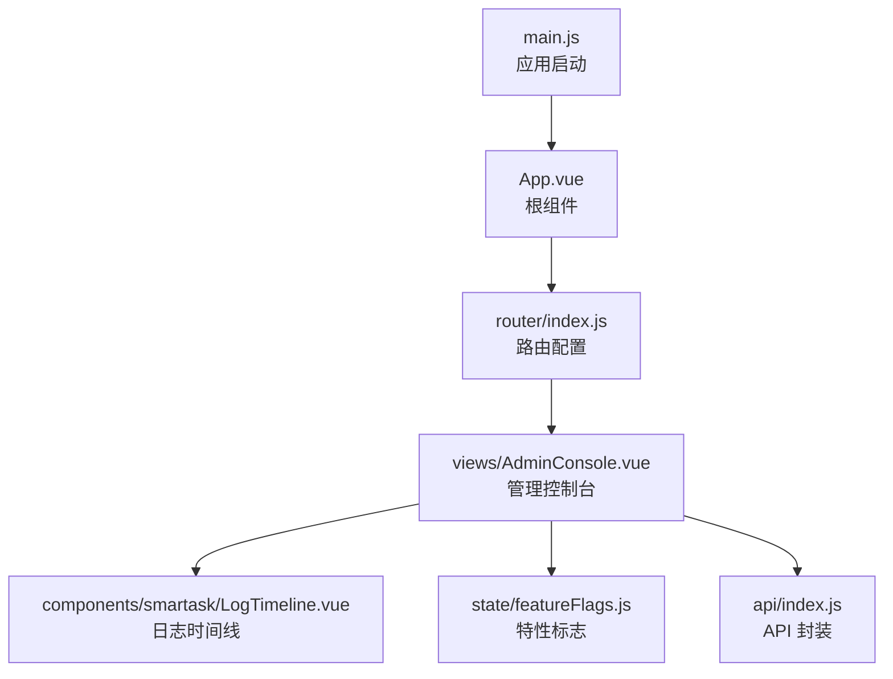
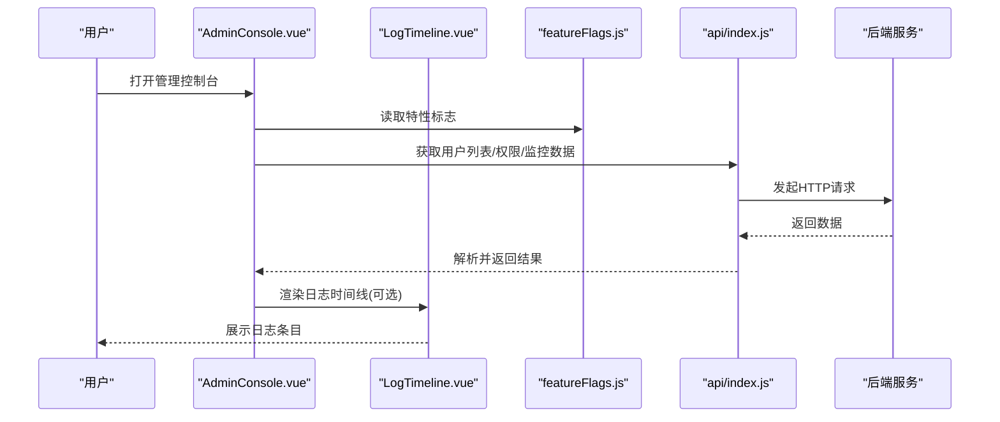
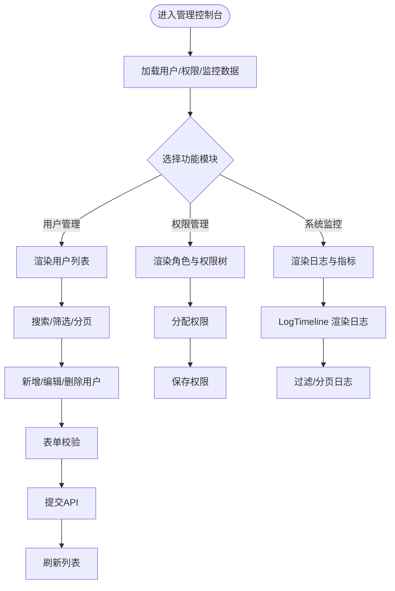
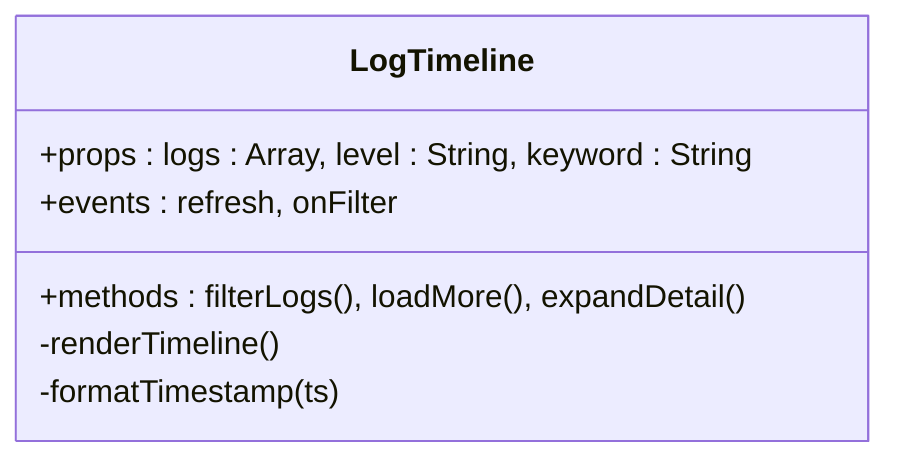
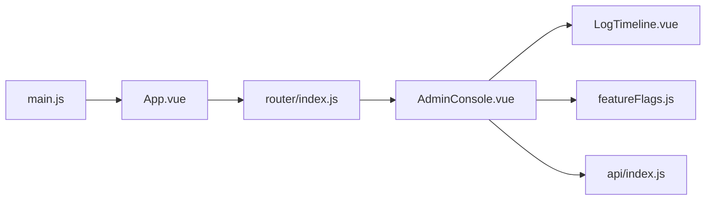

# 管理控制台页面

<cite>
**本文引用的文件**   
- [AdminConsole.vue](file://frontend/src/views/AdminConsole.vue)
- [LogTimeline.vue](file://frontend/src/components/smartask/LogTimeline.vue)
- [featureFlags.js](file://frontend/src/state/featureFlags.js)
- [api/index.js](file://frontend/src/api/index.js)
- [router/index.js](file://frontend/src/router/index.js)
- [App.vue](file://frontend/src/App.vue)
- [main.js](file://frontend/src/main.js)
</cite>

## 目录
1. [简介](#简介)
2. [项目结构](#项目结构)
3. [核心组件与功能模块](#核心组件与功能模块)
4. [架构总览](#架构总览)
5. [详细组件分析](#详细组件分析)
6. [依赖关系分析](#依赖关系分析)
7. [性能考虑](#性能考虑)
8. [故障排查指南](#故障排查指南)
9. [结论](#结论)
10. [附录](#附录)

## 简介
本文件为“管理控制台页面”的开发文档，聚焦 AdminConsole.vue 的整体架构与功能模块，涵盖用户管理、权限控制、系统监控等核心能力。文档同时说明 LogTimeline 日志时间线组件的使用与数据绑定方式，以及 featureFlags 特性标志的管理方法；并给出数据表格的增删改查（含分页、搜索、筛选）、表单验证、数据提交与错误处理的完整流程说明。

## 项目结构
管理控制台位于前端工程的路由视图层，通过路由注册进入，使用 Vue 单文件组件组织 UI 与交互逻辑。关键文件职责如下：
- AdminConsole.vue：控制台主视图，聚合用户管理、权限管理、系统监控等子模块。
- LogTimeline.vue：日志时间线展示组件，用于系统监控中的日志查看。
- featureFlags.js：特性标志状态管理，控制功能开关与界面行为。
- api/index.js：统一 API 请求封装，供各模块调用后端接口。
- router/index.js：路由配置，将 /admin 路径映射到 AdminConsole.vue。
- App.vue 与 main.js：应用入口与根组件挂载。

图表来源
- [main.js](file://frontend/src/main.js)
- [App.vue](file://frontend/src/App.vue)
- [router/index.js](file://frontend/src/router/index.js)
- [AdminConsole.vue](file://frontend/src/views/AdminConsole.vue)
- [LogTimeline.vue](file://frontend/src/components/smartask/LogTimeline.vue)
- [featureFlags.js](file://frontend/src/state/featureFlags.js)
- [api/index.js](file://frontend/src/api/index.js)

章节来源
- [router/index.js](file://frontend/src/router/index.js)
- [App.vue](file://frontend/src/App.vue)
- [main.js](file://frontend/src/main.js)

## 核心组件与功能模块
- 用户管理
  - 用户列表展示：支持分页、搜索、筛选。
  - 新增用户：表单输入、校验、提交。
  - 编辑用户信息：回显数据、变更保存。
  - 删除用户：二次确认、批量删除。
- 权限控制
  - 角色管理：创建、编辑、删除角色。
  - 权限分配：为角色或用户分配菜单/按钮级权限。
  - 访问控制：基于角色的界面元素显示/隐藏与操作拦截。
- 系统监控
  - 日志查看：通过 LogTimeline 组件按时间轴展示系统日志。
  - 性能指标：CPU、内存、响应时延等指标的可视化展示。
  - 错误统计：错误数量、类型分布、趋势图。

章节来源
- [AdminConsole.vue](file://frontend/src/views/AdminConsole.vue)
- [LogTimeline.vue](file://frontend/src/components/smartask/LogTimeline.vue)
- [featureFlags.js](file://frontend/src/state/featureFlags.js)
- [api/index.js](file://frontend/src/api/index.js)

## 架构总览
管理控制台采用“视图 + 组件 + 状态 + API”的分层结构：
- 视图层：AdminConsole.vue 作为容器，组织各功能区块。
- 组件层：LogTimeline.vue 提供可复用的日志时间线展示。
- 状态层：featureFlags.js 集中管理特性开关，影响 UI 与行为。
- API 层：api/index.js 统一封装 HTTP 请求，处理鉴权、重试、错误提示。

图表来源
- [AdminConsole.vue](file://frontend/src/views/AdminConsole.vue)
- [LogTimeline.vue](file://frontend/src/components/smartask/LogTimeline.vue)
- [featureFlags.js](file://frontend/src/state/featureFlags.js)
- [api/index.js](file://frontend/src/api/index.js)

## 详细组件分析

### AdminConsole.vue 组件分析
- 职责与结构
  - 作为控制台主视图，包含用户管理、权限管理、系统监控三大区块。
  - 通过 tab 或侧边导航切换不同功能模块。
  - 集成分页、搜索、筛选的数据表格组件。
- 用户管理实现要点
  - 列表展示：调用 API 获取用户数据，维护分页参数与查询条件。
  - 新增/编辑：弹窗表单，字段校验（必填、格式、唯一性），提交后刷新列表。
  - 删除：单条/批量删除，二次确认，成功后更新本地状态。
- 权限控制实现要点
  - 角色管理：CRUD 角色，关联权限集合。
  - 权限分配：以树形结构展示菜单/按钮权限，勾选保存。
  - 访问控制：根据当前用户角色动态渲染按钮与菜单项。
- 系统监控实现要点
  - 日志查看：使用 LogTimeline 组件，传入日志数组与过滤条件。
  - 性能指标：定时拉取指标数据，折线图/仪表盘展示。
  - 错误统计：汇总错误类型与次数，支持下钻详情。

图表来源
- [AdminConsole.vue](file://frontend/src/views/AdminConsole.vue)
- [api/index.js](file://frontend/src/api/index.js)

章节来源
- [AdminConsole.vue](file://frontend/src/views/AdminConsole.vue)

### LogTimeline.vue 组件分析
- 用途与数据绑定
  - 接收日志数组 props，按时间倒序展示。
  - 支持级别过滤（INFO/WARN/ERROR）、关键词搜索、分页。
  - 点击条目展开详情，支持复制日志内容。
- 事件与回调
  - 对外暴露 refresh 事件，父组件触发重新拉取日志。
  - 提供 onFilter 回调，便于父组件联动筛选。
- 性能优化
  - 虚拟滚动或分页加载，避免大数据量卡顿。
  - 防抖搜索，减少频繁重渲染。

图表来源
- [LogTimeline.vue](file://frontend/src/components/smartask/LogTimeline.vue)

章节来源
- [LogTimeline.vue](file://frontend/src/components/smartask/LogTimeline.vue)

### featureFlags 特性标志管理
- 作用域与生命周期
  - 在应用初始化时加载默认特性标志，支持运行时切换。
  - 通过全局状态注入，供各组件按需读取。
- 常用标志示例
  - enableUserManagement：是否启用用户管理模块。
  - enableRBAC：是否启用基于角色的访问控制。
  - enableMonitoring：是否启用系统监控面板。
- 使用方式
  - 组件内直接读取标志值，控制渲染分支与功能可用性。
  - 结合路由守卫与按钮权限指令进行访问控制。

章节来源
- [featureFlags.js](file://frontend/src/state/featureFlags.js)

### API 封装与数据流
- 统一请求封装
  - 统一处理鉴权头、超时、重试、错误码映射。
  - 提供 get/post/put/delete 等方法，简化业务调用。
- 错误处理
  - 网络异常：提示“网络连接失败”。
  - 业务错误：根据错误码显示具体原因。
  - 成功回调：更新本地状态并触发刷新。
- 数据流
  - 组件调用 API -> 返回 Promise -> then/catch 处理 -> 更新 UI。

章节来源
- [api/index.js](file://frontend/src/api/index.js)

## 依赖关系分析
- 组件依赖
  - AdminConsole.vue 依赖 LogTimeline.vue、featureFlags.js、api/index.js。
- 路由依赖
  - router/index.js 将 /admin 路由指向 AdminConsole.vue。
- 应用依赖
  - main.js 挂载 App.vue，App.vue 引入路由与全局状态。

图表来源
- [main.js](file://frontend/src/main.js)
- [App.vue](file://frontend/src/App.vue)
- [router/index.js](file://frontend/src/router/index.js)
- [AdminConsole.vue](file://frontend/src/views/AdminConsole.vue)
- [LogTimeline.vue](file://frontend/src/components/smartask/LogTimeline.vue)
- [featureFlags.js](file://frontend/src/state/featureFlags.js)
- [api/index.js](file://frontend/src/api/index.js)

章节来源
- [router/index.js](file://frontend/src/router/index.js)
- [App.vue](file://frontend/src/App.vue)
- [main.js](file://frontend/src/main.js)

## 性能考虑
- 列表与日志
  - 使用分页与虚拟滚动降低 DOM 压力。
  - 搜索与筛选采用防抖与节流，减少重复计算。
- 数据拉取
  - 合理设置缓存策略，避免频繁请求。
  - 对大对象进行懒加载与按需渲染。
- 状态管理
  - 最小化 re-render 范围，拆分组件粒度。
  - 使用 computed 与 watch 精准监听变化。

## 故障排查指南
- 常见问题
  - 用户列表为空：检查 API 返回结构与分页参数是否正确。
  - 权限按钮不显示：确认当前用户角色与 featureFlags 配置。
  - 日志不更新：确认 LogTimeline 的 refresh 事件是否触发。
- 调试建议
  - 使用浏览器开发者工具查看 Network 与 Console。
  - 在 API 层添加日志输出，定位错误码与消息。
  - 临时关闭特性标志，隔离问题模块。

章节来源
- [api/index.js](file://frontend/src/api/index.js)
- [featureFlags.js](file://frontend/src/state/featureFlags.js)
- [LogTimeline.vue](file://frontend/src/components/smartask/LogTimeline.vue)

## 结论
管理控制台以 AdminConsole.vue 为核心，整合用户管理、权限控制与系统监控三大模块，配合 LogTimeline 与 featureFlags 提供可扩展、可配置的后台管理能力。通过统一的 API 封装与清晰的数据流设计，确保界面响应性与可维护性。后续可继续完善权限粒度、监控指标丰富度与用户体验细节。

## 附录
- 开发规范
  - 组件命名遵循 PascalCase，文件按功能划分。
  - API 调用统一使用封装方法，禁止裸 fetch。
  - 表单校验集中在组件内部，错误提示统一样式。
- 扩展建议
  - 增加国际化支持，便于多语言部署。
  - 引入更丰富的监控图表与告警机制。
  - 增强权限模型的细粒度控制（字段级）。