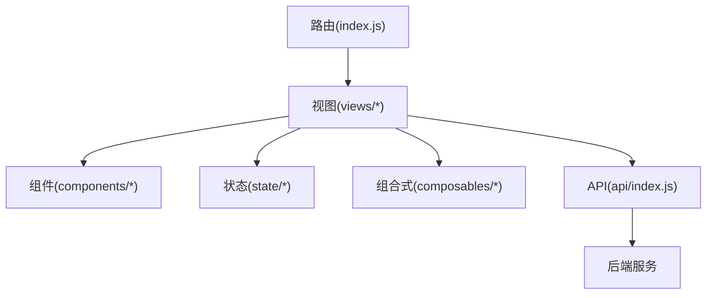
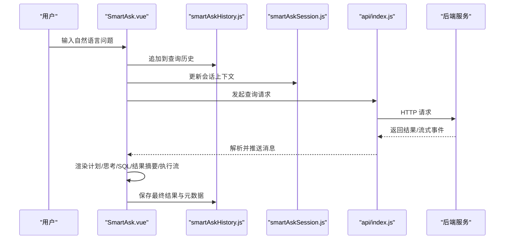
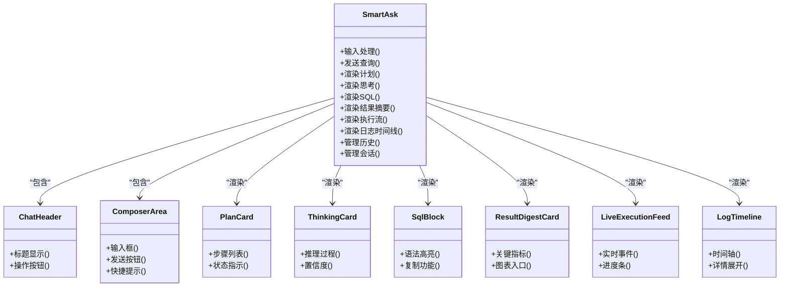
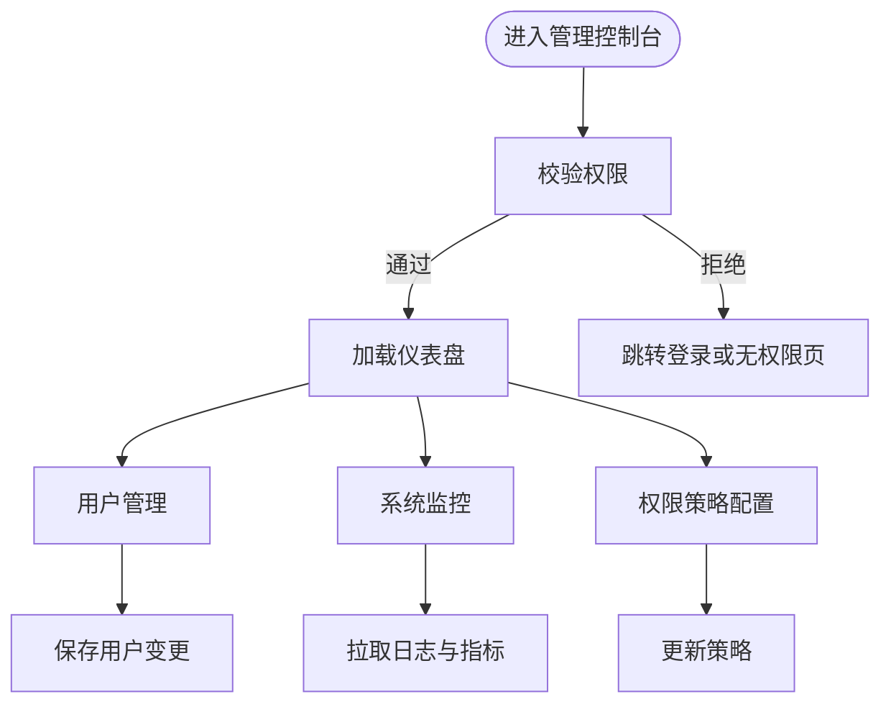
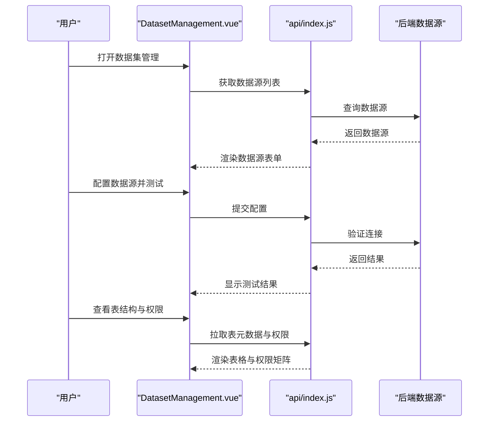
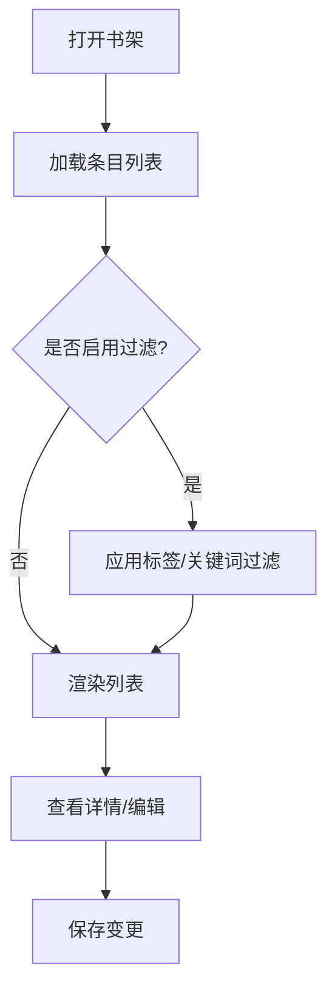
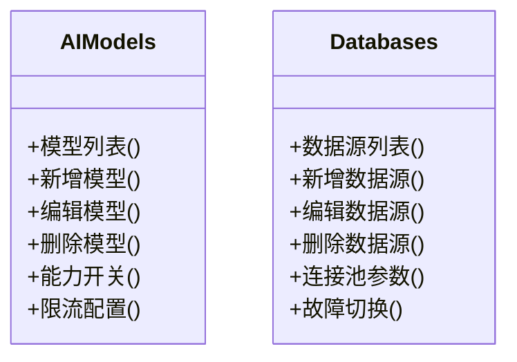
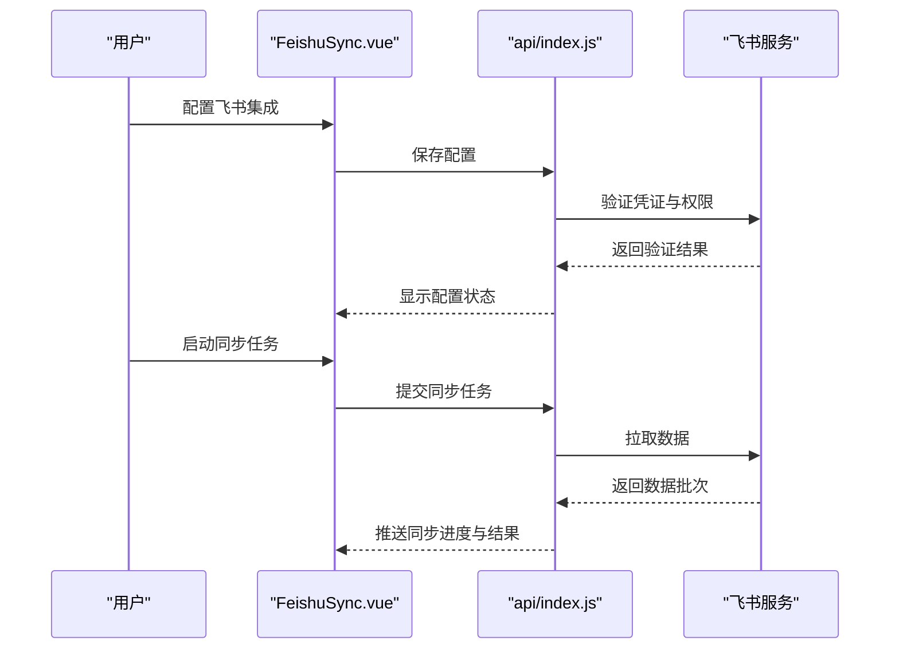
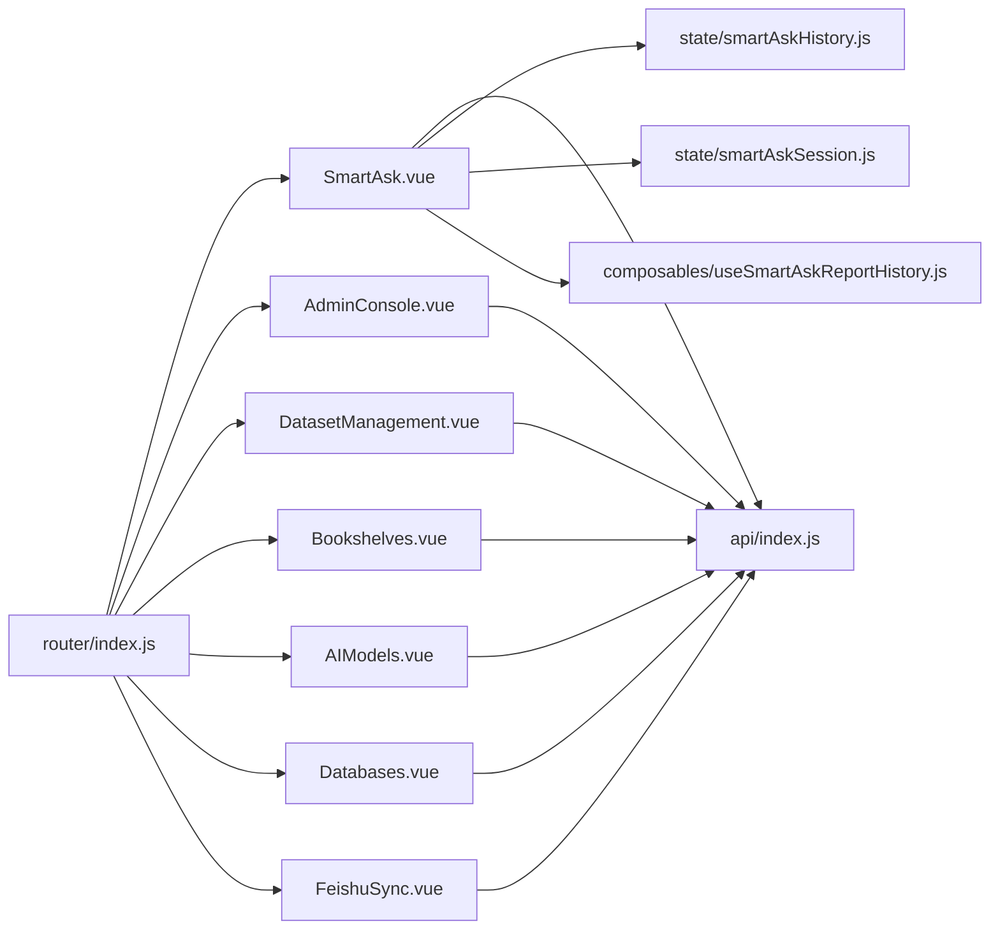

# 页面视图组件

<cite>
**本文档引用的文件**   
- [SmartAsk.vue](file://frontend/src/views/SmartAsk.vue)
- [AdminConsole.vue](file://frontend/src/views/AdminConsole.vue)
- [DatasetManagement.vue](file://frontend/src/views/DatasetManagement.vue)
- [Bookshelves.vue](file://frontend/src/views/Bookshelves.vue)
- [AIModels.vue](file://frontend/src/views/AIModels.vue)
- [Databases.vue](file://frontend/src/views/Databases.vue)
- [FeishuSync.vue](file://frontend/src/views/FeishuSync.vue)
- [router/index.js](file://frontend/src/router/index.js)
- [api/index.js](file://frontend/src/api/index.js)
- [state/smartAskHistory.js](file://frontend/src/state/smartAskHistory.js)
- [state/smartAskSession.js](file://frontend/src/state/smartAskSession.js)
- [composables/useSmartAskReportHistory.js](file://frontend/src/composables/useSmartAskReportHistory.js)
- [components/smartask/ChatHeader.vue](file://frontend/src/components/smartask/ChatHeader.vue)
- [components/smartask/ComposerArea.vue](file://frontend/src/components/smartask/ComposerArea.vue)
- [components/smartask/LiveExecutionFeed.vue](file://frontend/src/components/smartask/LiveExecutionFeed.vue)
- [components/smartask/LogTimeline.vue](file://frontend/src/components/smartask/LogTimeline.vue)
- [components/smartask/PlanCard.vue](file://frontend/src/components/smartask/PlanCard.vue)
- [components/smartask/ResultDigestCard.vue](file://frontend/src/components/smartask/ResultDigestCard.vue)
- [components/smartask/SqlBlock.vue](file://frontend/src/components/smartask/SqlBlock.vue)
- [components/smartask/ThinkingCard.vue](file://frontend/src/components/smartask/ThinkingCard.vue)
- [components/smartask/UserBubble.vue](file://frontend/src/components/smartask/UserBubble.vue)
- [components/smartask/WelcomeScreen.vue](file://frontend/src/components/smartask/WelcomeScreen.vue)
</cite>

## 目录
1. [简介](#简介)
2. [项目结构](#项目结构)
3. [核心组件](#核心组件)
4. [架构总览](#架构总览)
5. [详细组件分析](#详细组件分析)
6. [依赖关系分析](#依赖关系分析)
7. [性能考虑](#性能考虑)
8. [故障排查指南](#故障排查指南)
9. [结论](#结论)
10. [附录](#附录)

## 简介
本文件面向 SmartAsk 智能问数平台的前端页面视图组件，系统性梳理主页面、管理控制台、数据集管理、书架管理、AI模型与数据库管理、飞书同步等页面的实现要点。内容覆盖自然语言输入处理、查询历史管理、结果展示布局、多轮对话支持、权限控制、用户管理、系统监控、数据源配置、表结构预览、权限设置、内容组织与标签分类、搜索过滤、集成配置与同步状态监控、页面间导航与数据共享、错误处理方案以及响应式布局与用户体验优化实践。

## 项目结构
前端采用 Vue 单页应用组织方式：
- 路由层：集中定义页面路由与访问控制
- 视图层：各业务页面（如 SmartAsk、AdminConsole、DatasetManagement 等）
- 组件层：可复用 UI 组件（聊天头、输入区、执行流、日志时间线、卡片等）
- 状态层：会话与历史记录等全局状态
- API 层：统一封装后端接口调用
- 组合式函数：跨页面复用的逻辑（如报告历史）

图表来源
- [router/index.js](file://frontend/src/router/index.js)
- [api/index.js](file://frontend/src/api/index.js)

章节来源
- [router/index.js](file://frontend/src/router/index.js)
- [api/index.js](file://frontend/src/api/index.js)

## 核心组件
- SmartAsk 主页面：承载自然语言输入、多轮对话、计划与思考过程可视化、SQL 片段展示、结果摘要与执行流反馈、查询历史与上下文管理
- AdminConsole 管理控制台：权限控制、用户管理、系统监控
- DatasetManagement 数据集管理：数据源配置、表结构预览、权限设置
- Bookshelves 书架管理：内容组织、标签分类、搜索过滤
- AIModels 与 Databases：模型与数据库配置界面
- FeishuSync 飞书同步：集成配置与同步状态监控

章节来源
- [SmartAsk.vue](file://frontend/src/views/SmartAsk.vue)
- [AdminConsole.vue](file://frontend/src/views/AdminConsole.vue)
- [DatasetManagement.vue](file://frontend/src/views/DatasetManagement.vue)
- [Bookshelves.vue](file://frontend/src/views/Bookshelves.vue)
- [AIModels.vue](file://frontend/src/views/AIModels.vue)
- [Databases.vue](file://frontend/src/views/Databases.vue)
- [FeishuSync.vue](file://frontend/src/views/FeishuSync.vue)

## 架构总览
SmartAsk 前端以“视图 + 组件 + 状态 + API”的分层模式组织，页面通过路由进入，使用组合式函数与状态模块维护会话与历史，调用 API 与后端交互，渲染可复用组件提升一致性。

图表来源
- [SmartAsk.vue](file://frontend/src/views/SmartAsk.vue)
- [state/smartAskHistory.js](file://frontend/src/state/smartAskHistory.js)
- [state/smartAskSession.js](file://frontend/src/state/smartAskSession.js)
- [api/index.js](file://frontend/src/api/index.js)

## 详细组件分析

### SmartAsk 主页面组件
- 自然语言输入处理：在输入区捕获用户意图，进行基础校验与格式化，结合会话上下文生成查询参数
- 查询历史管理：持久化每次问答的输入、计划、思考过程、SQL、结果摘要与时间戳，支持回溯与重放
- 结果展示布局：分区域呈现计划卡片、思考过程、SQL 代码块、结果摘要、执行流与日志时间线
- 多轮对话支持：维护会话上下文，支持基于上下文的追问与条件修正

图表来源
- [SmartAsk.vue](file://frontend/src/views/SmartAsk.vue)
- [components/smartask/ChatHeader.vue](file://frontend/src/components/smartask/ChatHeader.vue)
- [components/smartask/ComposerArea.vue](file://frontend/src/components/smartask/ComposerArea.vue)
- [components/smartask/PlanCard.vue](file://frontend/src/components/smartask/PlanCard.vue)
- [components/smartask/ThinkingCard.vue](file://frontend/src/components/smartask/ThinkingCard.vue)
- [components/smartask/SqlBlock.vue](file://frontend/src/components/smartask/SqlBlock.vue)
- [components/smartask/ResultDigestCard.vue](file://frontend/src/components/smartask/ResultDigestCard.vue)
- [components/smartask/LiveExecutionFeed.vue](file://frontend/src/components/smartask/LiveExecutionFeed.vue)
- [components/smartask/LogTimeline.vue](file://frontend/src/components/smartask/LogTimeline.vue)

章节来源
- [SmartAsk.vue](file://frontend/src/views/SmartAsk.vue)
- [components/smartask/ChatHeader.vue](file://frontend/src/components/smartask/ChatHeader.vue)
- [components/smartask/ComposerArea.vue](file://frontend/src/components/smartask/ComposerArea.vue)
- [components/smartask/PlanCard.vue](file://frontend/src/components/smartask/PlanCard.vue)
- [components/smartask/ThinkingCard.vue](file://frontend/src/components/smartask/ThinkingCard.vue)
- [components/smartask/SqlBlock.vue](file://frontend/src/components/smartask/SqlBlock.vue)
- [components/smartask/ResultDigestCard.vue](file://frontend/src/components/smartask/ResultDigestCard.vue)
- [components/smartask/LiveExecutionFeed.vue](file://frontend/src/components/smartask/LiveExecutionFeed.vue)
- [components/smartask/LogTimeline.vue](file://frontend/src/components/smartask/LogTimeline.vue)
- [state/smartAskHistory.js](file://frontend/src/state/smartAskHistory.js)
- [state/smartAskSession.js](file://frontend/src/state/smartAskSession.js)
- [composables/useSmartAskReportHistory.js](file://frontend/src/composables/useSmartAskReportHistory.js)

### AdminConsole 管理控制台
- 权限控制：基于角色与资源粒度控制菜单与按钮可见性，拦截未授权访问
- 用户管理：用户增删改查、角色分配、组织树关联
- 系统监控：查看系统日志、运行指标、任务队列状态与健康检查

章节来源
- [AdminConsole.vue](file://frontend/src/views/AdminConsole.vue)

### DatasetManagement 数据集管理
- 数据源配置：新增/编辑数据源连接信息、测试连通性、选择默认库
- 表结构预览：列出可用表与字段类型、索引信息，支持刷新与缓存
- 权限设置：按数据集维度设置访问与操作权限，支持批量授权

图表来源
- [DatasetManagement.vue](file://frontend/src/views/DatasetManagement.vue)
- [api/index.js](file://frontend/src/api/index.js)

章节来源
- [DatasetManagement.vue](file://frontend/src/views/DatasetManagement.vue)

### Bookshelves 书架管理
- 内容组织：按主题/场景分组，支持拖拽排序与层级结构
- 标签分类：为条目添加标签，支持多选筛选与聚合统计
- 搜索过滤：全文检索与高级过滤（时间、作者、标签、状态）

章节来源
- [Bookshelves.vue](file://frontend/src/views/Bookshelves.vue)

### AIModels 与 Databases 配置界面
- AIModels：模型提供商接入、密钥配置、模型版本选择、能力开关与限流设置
- Databases：数据库连接配置、连接池参数、读写分离与故障切换策略

图表来源
- [AIModels.vue](file://frontend/src/views/AIModels.vue)
- [Databases.vue](file://frontend/src/views/Databases.vue)

章节来源
- [AIModels.vue](file://frontend/src/views/AIModels.vue)
- [Databases.vue](file://frontend/src/views/Databases.vue)

### FeishuSync 飞书同步
- 集成配置：飞书应用凭证、工作空间与表映射、增量/全量同步策略
- 状态监控：同步任务队列、成功/失败计数、最近同步时间与重试机制

图表来源
- [FeishuSync.vue](file://frontend/src/views/FeishuSync.vue)
- [api/index.js](file://frontend/src/api/index.js)

章节来源
- [FeishuSync.vue](file://frontend/src/views/FeishuSync.vue)

## 依赖关系分析
- 路由依赖：页面通过路由注册与守卫控制访问
- API 依赖：所有页面通过统一的 API 模块与后端交互
- 状态依赖：会话与历史状态被多个页面共享
- 组件依赖：SmartAsk 页面依赖多个子组件形成完整交互链

图表来源
- [router/index.js](file://frontend/src/router/index.js)
- [api/index.js](file://frontend/src/api/index.js)
- [state/smartAskHistory.js](file://frontend/src/state/smartAskHistory.js)
- [state/smartAskSession.js](file://frontend/src/state/smartAskSession.js)
- [composables/useSmartAskReportHistory.js](file://frontend/src/composables/useSmartAskReportHistory.js)

章节来源
- [router/index.js](file://frontend/src/router/index.js)
- [api/index.js](file://frontend/src/api/index.js)
- [state/smartAskHistory.js](file://frontend/src/state/smartAskHistory.js)
- [state/smartAskSession.js](file://frontend/src/state/smartAskSession.js)
- [composables/useSmartAskReportHistory.js](file://frontend/src/composables/useSmartAskReportHistory.js)

## 性能考虑
- 列表与大数据渲染：虚拟滚动与分页加载，避免一次性渲染大量 DOM
- 网络请求优化：合并请求、缓存策略、去抖与节流
- 组件懒加载：路由级与组件级按需加载，减少首屏体积
- 状态管理优化：局部状态优先，减少全局状态更新频率
- 流式输出：对长耗时任务采用事件流逐步渲染，提升感知速度

[本节为通用指导，不直接分析具体文件]

## 故障排查指南
- 权限相关：检查路由守卫与按钮级权限控制，确认用户角色与资源映射
- 数据源连接：验证配置信息与网络可达性，查看连接测试结果与错误码
- 同步任务：检查飞书凭证、权限范围与任务队列状态，关注失败重试与日志
- 历史与会话：确认本地存储与状态同步，排查重复提交与状态不一致
- 错误处理：统一错误提示与降级策略，记录关键异常便于定位

章节来源
- [AdminConsole.vue](file://frontend/src/views/AdminConsole.vue)
- [DatasetManagement.vue](file://frontend/src/views/DatasetManagement.vue)
- [FeishuSync.vue](file://frontend/src/views/FeishuSync.vue)

## 结论
SmartAsk 前端页面视图组件以清晰的层次结构与可复用组件为核心，围绕自然语言问数、权限与监控、数据源与权限、书架内容与标签、模型与数据库配置、飞书集成等关键能力构建。通过统一的路由、API、状态与组合式函数，实现了良好的扩展性与可维护性。后续可在性能优化、错误诊断与用户体验方面持续迭代。

[本节为总结性内容，不直接分析具体文件]

## 附录
- 响应式布局适配：采用弹性布局与媒体查询，确保在不同屏幕尺寸下的可用性
- 用户体验优化：提供加载态、空态与错误态占位，增强交互反馈与可访问性
- 页面间导航与数据共享：通过路由参数与状态模块传递上下文，保持数据一致性
- 最佳实践：组件职责单一、命名规范、错误边界与日志埋点

[本节为概念性内容，不直接分析具体文件]