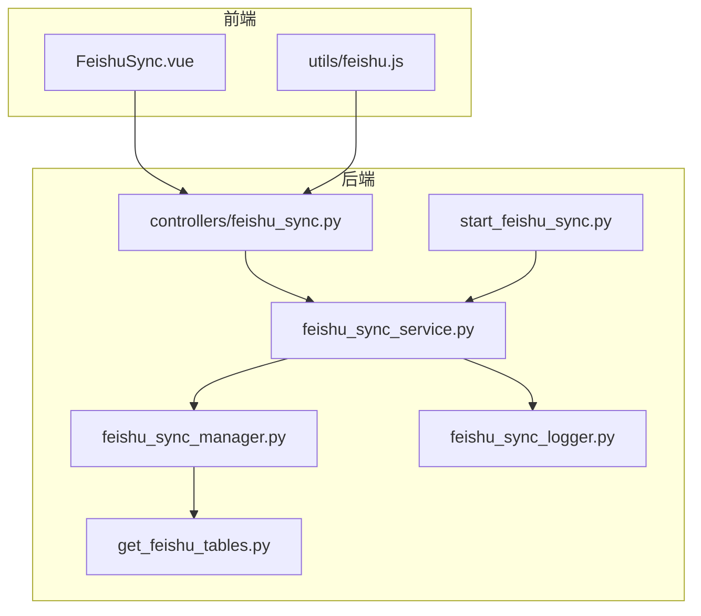
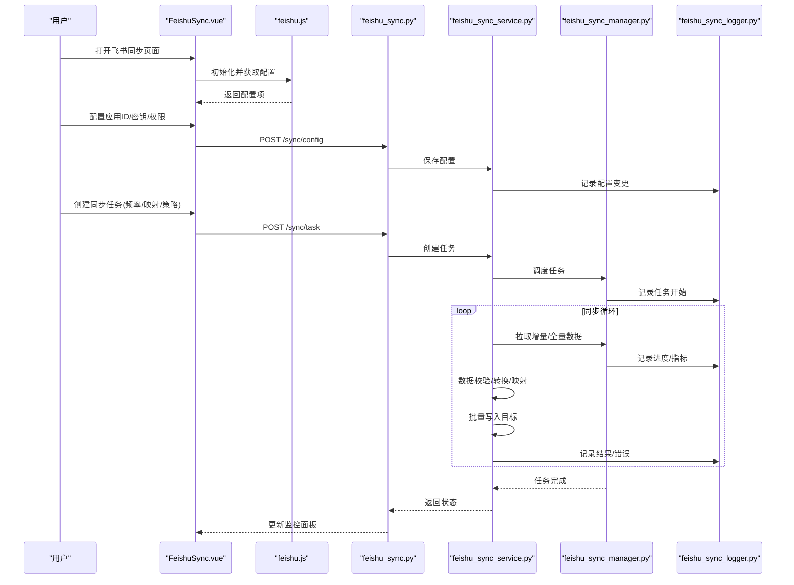
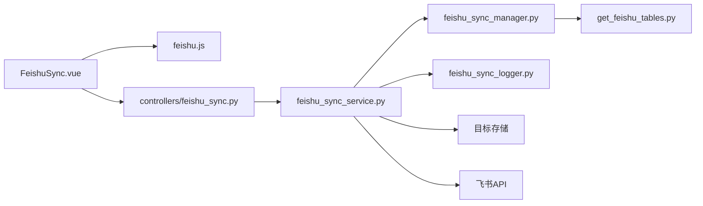

# 飞书同步页面

<cite>
**本文引用的文件**   
- [FeishuSync.vue](file://frontend/src/views/FeishuSync.vue)
- [feishu.js](file://frontend/src/utils/feishu.js)
- [feishu_sync.py](file://backend/controllers/feishu_sync.py)
- [feishu_sync_service.py](file://backend/feishu_sync_service.py)
- [feishu_sync_manager.py](file://backend/feishu_sync_manager.py)
- [feishu_sync_logger.py](file://backend/feishu_sync_logger.py)
- [start_feishu_sync.py](file://backend/start_feishu_sync.py)
- [get_feishu_tables.py](file://backend/get_feishu_tables.py)
</cite>

## 目录
1. [简介](#简介)
2. [项目结构](#项目结构)
3. [核心组件](#核心组件)
4. [架构总览](#架构总览)
5. [详细组件分析](#详细组件分析)
6. [依赖关系分析](#依赖关系分析)
7. [性能考虑](#性能考虑)
8. [故障排查指南](#故障排查指南)
9. [结论](#结论)
10. [附录](#附录)

## 简介
本文件为“飞书同步页面”的开发文档，面向前端与后端开发者，系统性阐述 FeishuSync.vue 页面的整体架构、飞书应用配置、数据同步任务、状态监控等核心功能。同时覆盖飞书 API 集成方式、feishu.js 工具类使用、增量/全量/断点续传等高级方案，以及数据校验、格式转换、批量处理的完整流程。

## 项目结构
本项目采用前后端分离架构：
- 前端：Vue 单页应用，包含飞书同步页面与飞书工具类。
- 后端：Python 服务，提供飞书同步控制器、服务层、管理器、日志器及辅助脚本。

图表来源
- [FeishuSync.vue](file://frontend/src/views/FeishuSync.vue)
- [feishu.js](file://frontend/src/utils/feishu.js)
- [feishu_sync.py](file://backend/controllers/feishu_sync.py)
- [feishu_sync_service.py](file://backend/feishu_sync_service.py)
- [feishu_sync_manager.py](file://backend/feishu_sync_manager.py)
- [feishu_sync_logger.py](file://backend/feishu_sync_logger.py)
- [start_feishu_sync.py](file://backend/start_feishu_sync.py)
- [get_feishu_tables.py](file://backend/get_feishu_tables.py)

章节来源
- [FeishuSync.vue](file://frontend/src/views/FeishuSync.vue)
- [feishu.js](file://frontend/src/utils/feishu.js)
- [feishu_sync.py](file://backend/controllers/feishu_sync.py)
- [feishu_sync_service.py](file://backend/feishu_sync_service.py)
- [feishu_sync_manager.py](file://backend/feishu_sync_manager.py)
- [feishu_sync_logger.py](file://backend/feishu_sync_logger.py)
- [start_feishu_sync.py](file://backend/start_feishu_sync.py)
- [get_feishu_tables.py](file://backend/get_feishu_tables.py)

## 核心组件
- 飞书同步页面（FeishuSync.vue）
  - 负责飞书应用配置界面（应用ID、密钥、权限申请）、同步任务配置（频率、映射、冲突策略）、同步状态监控（进度、日志、指标）。
- 飞书工具类（feishu.js）
  - 封装飞书 API 调用、错误处理、重试机制、鉴权参数组装。
- 后端控制器（feishu_sync.py）
  - 暴露 REST 接口，接收前端请求，协调服务层执行同步任务。
- 同步服务（feishu_sync_service.py）
  - 编排同步流程：获取元数据、拉取数据、转换映射、写入目标、记录日志。
- 同步管理器（feishu_sync_manager.py）
  - 管理调度、并发、批处理、断点续传、幂等控制。
- 日志器（feishu_sync_logger.py）
  - 统一记录同步过程、错误堆栈、性能指标。
- 启动脚本（start_feishu_sync.py）
  - 初始化环境、加载配置、启动后台任务。
- 表元数据获取（get_feishu_tables.py）
  - 解析飞书多维表格/知识库等元数据，供前端展示与映射配置。

章节来源
- [FeishuSync.vue](file://frontend/src/views/FeishuSync.vue)
- [feishu.js](file://frontend/src/utils/feishu.js)
- [feishu_sync.py](file://backend/controllers/feishu_sync.py)
- [feishu_sync_service.py](file://backend/feishu_sync_service.py)
- [feishu_sync_manager.py](file://backend/feishu_sync_manager.py)
- [feishu_sync_logger.py](file://backend/feishu_sync_logger.py)
- [start_feishu_sync.py](file://backend/start_feishu_sync.py)
- [get_feishu_tables.py](file://backend/get_feishu_tables.py)

## 架构总览
前端通过 feishu.js 发起 HTTP 请求到后端控制器，控制器委托服务层完成同步编排，管理器负责调度与持久化，日志器记录运行信息。

图表来源
- [FeishuSync.vue](file://frontend/src/views/FeishuSync.vue)
- [feishu.js](file://frontend/src/utils/feishu.js)
- [feishu_sync.py](file://backend/controllers/feishu_sync.py)
- [feishu_sync_service.py](file://backend/feishu_sync_service.py)
- [feishu_sync_manager.py](file://backend/feishu_sync_manager.py)
- [feishu_sync_logger.py](file://backend/feishu_sync_logger.py)

## 详细组件分析

### 飞书应用配置（FeishuSync.vue）
- 界面能力
  - 应用ID配置：输入并校验格式，支持测试连接。
  - 密钥设置：安全存储，支持加密与轮换提示。
  - 权限申请：列出所需权限，引导用户在飞书开放平台申请。
- 交互流程
  - 表单校验 → 提交至后端 → 保存配置 → 返回成功/失败 → 刷新状态。
- 关键实现要点
  - 前端表单校验与错误提示。
  - 敏感字段本地缓存策略（避免频繁传输）。
  - 权限清单动态渲染与状态回显。

章节来源
- [FeishuSync.vue](file://frontend/src/views/FeishuSync.vue)

### 数据同步任务（FeishuSync.vue + feishu_sync.py + feishu_sync_service.py）
- 任务配置
  - 同步频率：一次性、定时、间隔触发。
  - 数据映射：源字段到目标字段的映射规则。
  - 冲突解决策略：覆盖、跳过、合并、人工确认。
- 执行流程
  - 创建任务 → 调度执行 → 拉取数据 → 转换映射 → 写入目标 → 记录日志 → 更新状态。
- 异常处理
  - 网络异常重试、限流退避、部分失败补偿。

章节来源
- [FeishuSync.vue](file://frontend/src/views/FeishuSync.vue)
- [feishu_sync.py](file://backend/controllers/feishu_sync.py)
- [feishu_sync_service.py](file://backend/feishu_sync_service.py)

### 同步状态监控（FeishuSync.vue）
- 进度展示：当前批次、已处理/总数、成功率、耗时。
- 错误日志：按任务维度聚合，支持筛选与导出。
- 性能指标：QPS、延迟分布、内存/CPU占用（由后端上报）。
- 实时更新：轮询或事件推送（根据后端能力选择）。

章节来源
- [FeishuSync.vue](file://frontend/src/views/FeishuSync.vue)

### 飞书 API 集成（feishu.js + feishu_sync_service.py）
- 认证流程
  - 使用应用ID与密钥获取访问令牌，支持刷新与过期处理。
- 数据获取
  - 分页拉取、过滤条件、排序、增量时间戳。
- 数据推送
  - 批量写入、事务性提交、失败重试与补偿。
- 错误处理
  - 统一错误码映射、重试策略、降级与熔断。

章节来源
- [feishu.js](file://frontend/src/utils/feishu.js)
- [feishu_sync_service.py](file://backend/feishu_sync_service.py)

### feishu.js 工具类
- API 调用封装
  - 统一的请求方法、拦截器、超时与重试。
- 错误处理
  - 分类错误（网络、鉴权、业务），抛出结构化错误对象。
- 重试机制
  - 指数退避、最大重试次数、可配置开关。
- 鉴权参数
  - 自动注入 Token、签名、时间戳等。

章节来源
- [feishu.js](file://frontend/src/utils/feishu.js)

### 后端服务与管理器（feishu_sync_service.py + feishu_sync_manager.py）
- 服务层职责
  - 编排同步步骤、数据校验与转换、批量写入、指标统计。
- 管理器职责
  - 任务调度、并发控制、批大小、断点续传、幂等键生成。
- 日志与指标
  - 结构化日志、性能埋点、告警阈值。

章节来源
- [feishu_sync_service.py](file://backend/feishu_sync_service.py)
- [feishu_sync_manager.py](file://backend/feishu_sync_manager.py)

### 启动与元数据（start_feishu_sync.py + get_feishu_tables.py）
- 启动脚本
  - 加载环境变量、初始化数据库连接、注册任务。
- 元数据获取
  - 读取飞书多维表格/知识库结构，生成字段映射建议。

章节来源
- [start_feishu_sync.py](file://backend/start_feishu_sync.py)
- [get_feishu_tables.py](file://backend/get_feishu_tables.py)

## 依赖关系分析
- 前端依赖
  - FeishuSync.vue 依赖 feishu.js 进行 API 调用与错误处理。
- 后端依赖
  - 控制器依赖服务层；服务层依赖管理器与日志器；管理器依赖元数据工具。
- 外部依赖
  - 飞书开放平台 API、目标数据存储（如数据库/对象存储）。

图表来源
- [FeishuSync.vue](file://frontend/src/views/FeishuSync.vue)
- [feishu.js](file://frontend/src/utils/feishu.js)
- [feishu_sync.py](file://backend/controllers/feishu_sync.py)
- [feishu_sync_service.py](file://backend/feishu_sync_service.py)
- [feishu_sync_manager.py](file://backend/feishu_sync_manager.py)
- [feishu_sync_logger.py](file://backend/feishu_sync_logger.py)
- [get_feishu_tables.py](file://backend/get_feishu_tables.py)

章节来源
- [FeishuSync.vue](file://frontend/src/views/FeishuSync.vue)
- [feishu.js](file://frontend/src/utils/feishu.js)
- [feishu_sync.py](file://backend/controllers/feishu_sync.py)
- [feishu_sync_service.py](file://backend/feishu_sync_service.py)
- [feishu_sync_manager.py](file://backend/feishu_sync_manager.py)
- [feishu_sync_logger.py](file://backend/feishu_sync_logger.py)
- [get_feishu_tables.py](file://backend/get_feishu_tables.py)

## 性能考虑
- 批量处理
  - 合理设置批大小，平衡吞吐与内存占用。
- 增量同步
  - 基于时间戳或游标减少拉取量，降低带宽与延迟。
- 并发控制
  - 限制并发任务数，避免资源争用与限流。
- 缓存与幂等
  - 对元数据与配置进行缓存；使用幂等键避免重复写入。
- 监控与告警
  - 采集关键指标（延迟、错误率、吞吐），设置阈值告警。

[本节为通用指导，不直接分析具体文件]

## 故障排查指南
- 常见问题
  - 鉴权失败：检查应用ID、密钥、权限是否齐全。
  - 拉取失败：检查网络、限流、分页参数。
  - 写入失败：检查目标存储权限、字段映射、数据类型。
- 定位手段
  - 查看任务日志与错误堆栈。
  - 检查性能指标与系统资源。
  - 复现最小用例，逐步隔离问题。
- 恢复策略
  - 重试失败批次、回滚不一致数据、修复映射后重跑。

章节来源
- [feishu_sync_logger.py](file://backend/feishu_sync_logger.py)
- [feishu_sync_manager.py](file://backend/feishu_sync_manager.py)
- [feishu_sync_service.py](file://backend/feishu_sync_service.py)

## 结论
本文从前端页面、工具类、后端服务与管理器等多维度阐述了飞书同步页面的架构与实现要点。通过清晰的职责划分与完善的错误处理、监控与性能优化策略，确保同步任务的稳定性与可维护性。建议在实际部署中结合业务规模调整批大小、并发与重试策略，并持续完善日志与指标体系。

[本节为总结，不直接分析具体文件]

## 附录
- 高级功能方案
  - 增量同步：基于时间戳/游标的增量拉取与去重。
  - 全量同步：定期全量比对与差异合并。
  - 断点续传：记录任务进度与偏移，支持中断恢复。
- 数据流程
  - 校验：类型、必填、范围、唯一性。
  - 转换：格式标准化、单位换算、编码处理。
  - 批量：分批提交、事务控制、失败补偿。

[本节为概念性内容，不直接分析具体文件]